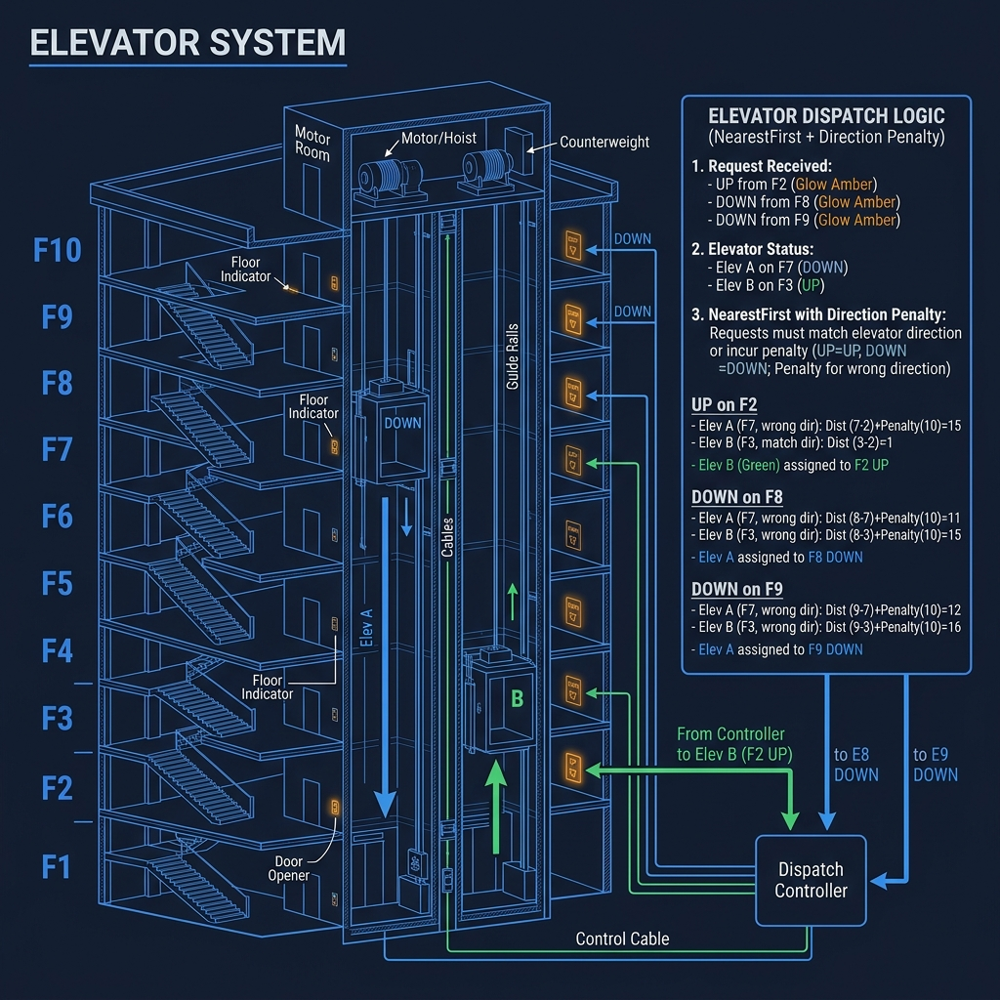
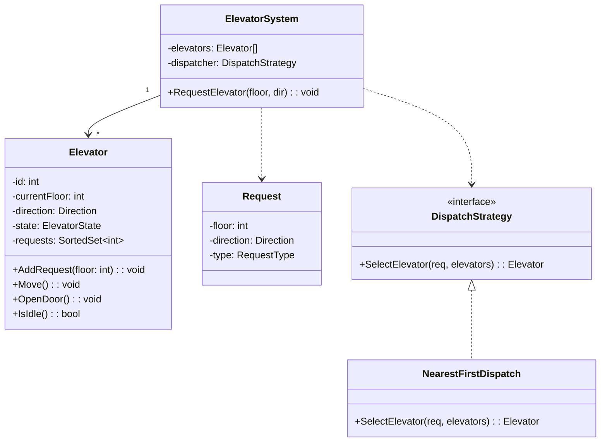
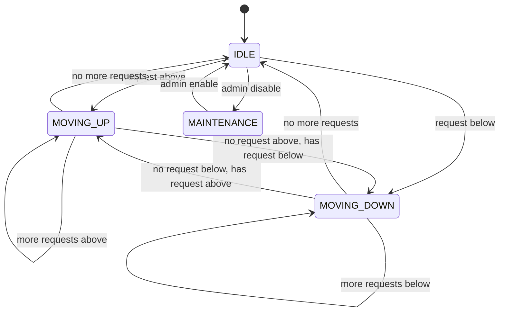

<!-- tags: ood-interview, oop, case-study, elevator-system -->
# Design an Elevator System

> Multi-elevator coordination: request scheduling, direction state machine, dispatch strategy.

| Aspect | Detail |
| --- | --- |
| **Difficulty** | ⭐⭐⭐ |
| **Primary patterns** | State, Strategy, Observer |
| **Interview focus** | Multi-entity state coordination + scheduling algorithm + extension seam |

📅 Created: 2026-04-02 · 🔄 Updated: 2026-04-21 · ⏱️ 20 min read

---

## 1. DEFINE

You press the call button on floor 7 — all 3 elevators are moving. Elevator A is going up from floor 3, Elevator B is going down from floor 10, Elevator C is idle at floor 1. Which one should pick you up?

The answer is not "the nearest one." Elevator A is going up and will pass floor 7 — but it has pending requests at floors 5 and 9. Elevator B is going down from 10 — it will pass floor 7, but only after going down to floor 2 and coming back up. Elevator C is idle at floor 1 — farthest away, but has zero pending requests.

Elevator system is harder than parking lot at 3 specific points:

1. **Direction state** — each elevator has its own state machine: `IDLE ↔ MOVING_UP ↔ MOVING_DOWN`. Direction determines whether it can pick up a request en route or must reverse.
2. **Request scheduling** — internal request (passenger presses inside cabin) vs external request (person in hallway). Same floor but different direction = 2 different requests.
3. **Multi-elevator dispatch** — who decides which elevator serves which request? Dispatch strategy can be nearest-first, least-loaded, or zone-based.

| Variant | Description | Interview angle |
| --- | --- | --- |
| Core | Multi-elevator, direction-aware scheduling | Object model + state machine + dispatch |
| Follow-up: VIP | Elevator prioritizes executive floor | Strategy swap, priority queue |
| Follow-up: maintenance | One elevator disabled, redistribute requests | Observer, health check |
| Follow-up: fire mode | All elevators to floor 1, override manual | State override, emergency protocol |

### Core Objects

| Object | Role | Key Attributes | Key Methods |
| --- | --- | --- | --- |
| `ElevatorSystem` | Coordinator | elevators[], dispatcher | `RequestElevator(floor, dir)` |
| `Elevator` | State machine | id, currentFloor, direction, requests | `AddRequest(floor)`, `Move()`, `OpenDoor()` |
| `Request` | Value object | floor, direction, type | — |
| `DispatchStrategy` | Policy interface | — | `SelectElevator(request, elevators[])` |
| `Door` | Component | state | `Open()`, `Close()` |

### Design Approach

| Approach | Trade-off | When to choose |
| --- | --- | --- |
| Single elevator, no dispatch | Simple, sufficient for basic prompt | When interviewer only asks about state machine |
| Multi-elevator + dispatch strategy | More complex, but shows scheduling depth | Default — interviewer wants coordination |

Elevator sounds familiar — but direction-aware dispatch is where many candidates stumble. That trap appears in PITFALLS.

---

## 2. VISUAL




Boundary clear. Two things to visualize before coding: class relationships and the elevator state machine — because the state machine determines when an elevator can accept new requests.

### Class Diagram



*ElevatorSystem coordinates multiple Elevators through DispatchStrategy. Each Elevator manages its own internal state machine.*

### Elevator State Machine



*Elevator direction state — MOVING_UP only switches to DOWN when no more requests above. MAINTENANCE overrides all states.*

---

## 3. CODE

Diagram shows the coordination flow. Core question: does the Elevator decide when to stop and continue — or does ElevatorSystem control it?

### Problem 1: Basic — Elevator state machine with direction-aware movement

> **Goal**: Elevator manages its own direction state, decides when to stop at a floor.
> **Approach**: Sorted request set + direction logic — elevator follows current direction, stops when there is a request, reverses when no more requests in that direction.
> **Example**: Elevator at floor 3 going UP, requests=[5,7,2] → stops 5, stops 7, switches DOWN, stops 2
> **Complexity**: O(log n) add request (sorted set), O(1) per move step

```go
// elevator.go — Elevator state machine with direction-aware scheduling
package elevator

import "fmt"

type Direction int

const (
	Idle Direction = iota
	Up
	Down
)

type Elevator struct {
	ID           int
	CurrentFloor int
	Direction    Direction
	UpRequests   map[int]bool // floors to visit going up
	DownRequests map[int]bool // floors to visit going down
}

func NewElevator(id int) *Elevator {
	return &Elevator{
		ID:           id,
		CurrentFloor: 1,
		Direction:    Idle,
		UpRequests:   make(map[int]bool),
		DownRequests: make(map[int]bool),
	}
}

// AddRequest adds a floor to the appropriate direction queue.
// ⚠️ Request goes to UpRequests if floor > current,
//     DownRequests if floor < current.
func (e *Elevator) AddRequest(floor int) {
	if floor > e.CurrentFloor {
		e.UpRequests[floor] = true
	} else if floor < e.CurrentFloor {
		e.DownRequests[floor] = true
	}
	// same floor = already here, open door
	if e.Direction == Idle {
		e.decideDirection()
	}
}

// Move advances elevator one floor in current direction.
// ✅ Elevator self-decides: stop if request exists, reverse if no requests ahead.
func (e *Elevator) Move() {
	if e.Direction == Idle {
		return
	}
	if e.Direction == Up {
		e.CurrentFloor++
		if e.UpRequests[e.CurrentFloor] {
			delete(e.UpRequests, e.CurrentFloor)
			fmt.Printf("Elevator %d stops at floor %d (UP)\n", e.ID, e.CurrentFloor)
		}
		if len(e.UpRequests) == 0 {
			e.decideDirection() // may switch to Down or Idle
		}
	} else {
		e.CurrentFloor--
		if e.DownRequests[e.CurrentFloor] {
			delete(e.DownRequests, e.CurrentFloor)
			fmt.Printf("Elevator %d stops at floor %d (DOWN)\n", e.ID, e.CurrentFloor)
		}
		if len(e.DownRequests) == 0 {
			e.decideDirection()
		}
	}
}

func (e *Elevator) decideDirection() {
	if len(e.UpRequests) > 0 {
		e.Direction = Up
	} else if len(e.DownRequests) > 0 {
		e.Direction = Down
	} else {
		e.Direction = Idle
	}
}

func (e *Elevator) IsIdle() bool {
	return e.Direction == Idle
}
```

> **Why separate UpRequests and DownRequests instead of a single list?**
> Elevator follows the SCAN algorithm (like disk scheduling): finishes one direction before reversing. A single list requires filtering "which floors are in the current direction?" on every move — complex and error-prone. Two sets = O(1) check, O(log n) add, direction logic cleanly separated. This is the insight interviewers want to hear.

Elevator knows how to move itself. But who decides which elevator serves which request? That is dispatch — and it must be separated from Elevator.

### Problem 2: Intermediate — Dispatch Strategy (multi-elevator coordination)

> **Goal**: ElevatorSystem dispatches request to the optimal elevator.
> **Approach**: Strategy pattern for dispatch — nearest-first as default, swappable to zone-based.
> **Example**: Request floor 7 UP, Elevator A at floor 5 going UP, Elevator B at floor 8 going DOWN → choose A
> **Complexity**: O(E) per dispatch — scan E elevators

```go
// dispatch.go — Multi-elevator dispatch with Strategy pattern
package elevator

import "math"

type RequestType int

const (
	External RequestType = iota
	Internal
)

type Request struct {
	Floor     int
	Direction Direction
	Type      RequestType
}

// DispatchStrategy decides which elevator serves a request.
// ✅ Strategy pattern — swap algorithm without changing ElevatorSystem.
type DispatchStrategy interface {
	SelectElevator(req Request, elevators []*Elevator) *Elevator
}

// NearestFirstDispatch picks the closest elevator that can serve en route.
// ⚠️ "Nearest" ≠ shortest distance — must consider direction compatibility.
type NearestFirstDispatch struct{}

func (d *NearestFirstDispatch) SelectElevator(req Request, elevators []*Elevator) *Elevator {
	var best *Elevator
	bestScore := math.MaxInt32

	for _, e := range elevators {
		score := d.score(e, req)
		if score < bestScore {
			bestScore = score
			best = e
		}
	}
	return best
}

func (d *NearestFirstDispatch) score(e *Elevator, req Request) int {
	dist := abs(e.CurrentFloor - req.Floor)

	// ✅ Idle elevator — pure distance
	if e.IsIdle() {
		return dist
	}
	// ✅ Same direction and on the way — best case
	if e.Direction == Up && req.Direction == Up && e.CurrentFloor <= req.Floor {
		return dist
	}
	if e.Direction == Down && req.Direction == Down && e.CurrentFloor >= req.Floor {
		return dist
	}
	// ⚠️ Wrong direction or already passed — penalize heavily
	return dist + 1000
}

func abs(x int) int {
	if x < 0 {
		return -x
	}
	return x
}

// --- ElevatorSystem ---

type ElevatorSystem struct {
	Elevators  []*Elevator
	Dispatcher DispatchStrategy
}

func NewElevatorSystem(count int) *ElevatorSystem {
	elevators := make([]*Elevator, count)
	for i := range elevators {
		elevators[i] = NewElevator(i + 1)
	}
	return &ElevatorSystem{
		Elevators:  elevators,
		Dispatcher: &NearestFirstDispatch{}, // default, swappable
	}
}

// RequestElevator dispatches the request to the best elevator.
func (sys *ElevatorSystem) RequestElevator(floor int, dir Direction) {
	req := Request{Floor: floor, Direction: dir, Type: External}
	elevator := sys.Dispatcher.SelectElevator(req, sys.Elevators)
	if elevator != nil {
		elevator.AddRequest(floor)
	}
}
```

> **Why is the score penalty +1000 for wrong direction?**
> An elevator going DOWN at floor 10 with a request for UP at floor 7: it will pass floor 7 but is going *down* — it will not stop. It must finish descending then come back up. A large penalty number ensures idle or same-direction elevators are always prioritized. The specific number (1000) does not matter — what matters is the relative ordering.

Back to the opening scenario: floor 7 calls UP, 3 elevators running. Dispatch strategy now picks Elevator A (going UP from floor 3, will pass floor 7) — exactly as expected.

---

## 4. PITFALLS

Elevator system is a problem where many candidates feel confident but get stuck when the interviewer asks "what changes if you add 1 more elevator?"

| # | Severity | Mistake | Consequence | Fix |
| --- | --- | --- | --- | --- |
| 1 | 🔴 Fatal | Dispatch logic hardcoded in Elevator | Adding elevator = modifying scheduling in every elevator | DispatchStrategy interface, inject into ElevatorSystem |
| 2 | 🔴 Fatal | Elevator has no direction state | Floor 7 called, elevator passes but does not stop because it's going down | State machine: IDLE ↔ UP ↔ DOWN, direction-aware stop |
| 3 | 🟡 Common | Dispatch uses only distance, ignores direction | Elevator at floor 6 going DOWN chosen for UP request at floor 7 | Score = distance + direction penalty |
| 4 | 🟡 Common | Single request queue instead of up/down split | Elevator zig-zags between floors instead of SCAN | Separate UpRequests + DownRequests |
| 5 | 🔵 Minor | No Door state model | "Door opens while elevator is moving" | Door.Open() only when state = IDLE or stopped |

### 🔴 Pitfall #1 — Dispatch hardcoded in Elevator

```go
// ❌ Elevator decides dispatch — impossible to coordinate
type Elevator struct {}
func (e *Elevator) ShouldIHandle(floor int) bool {
    return abs(e.CurrentFloor - floor) < 3 // arbitrary
}
```

With 3 elevators, all 3 see "I'm close" and all 3 go to pick up the request → waste. Dispatch MUST live at the system level (ElevatorSystem) because only it sees the full state of every elevator.

**Fix**: `DispatchStrategy` interface at system level, elevator only executes.

---

## 5. REF

| Resource | Type | Link | Note |
| --- | --- | --- | --- |
| ByteByteGo — Elevator OOD | Course | https://bytebytego.com/courses/object-oriented-design-interview | Full walkthrough |
| SCAN Disk Scheduling Algorithm | Reference | https://en.wikipedia.org/wiki/Elevator_algorithm | Elevator algorithm = SCAN — direction-first scheduling |
| Refactoring Guru — State Pattern | Reference | https://refactoring.guru/design-patterns/state | Elevator direction state |

---

## 6. RECOMMEND

Elevator system teaches multi-entity state coordination — each entity has its own state machine, coordinator above dispatches. Next step: practice a different axis.

| Next topic | When | Why | File/Link |
| --- | --- | --- | --- |
| [Parking Lot](./04-parking-lot.md) | Want simpler state machine review | Ticket state machine is one-directional — baseline before elevator | Case study |
| [ATM System](./13-atm-system.md) | Want session lifecycle + transaction | ATM = state machine + transactional flow + auth | Case study |
| [Restaurant Management](./14-restaurant-management.md) | Want different multi-entity coordination | Order → Kitchen → Table — multiple entities, states, actors | Case study |

---

## 7. QUICK REF

| If the interviewer asks | Signal | Your answer |
| --- | --- | --- |
| "Add 1 more elevator?" | OCP / dispatch scalability | `ElevatorSystem.Elevators[]` append, DispatchStrategy unchanged |
| "VIP floor priority?" | Strategy swap | VIPDispatch strategy prioritizes requests from executive floor |
| "Elevator breaks mid-trip?" | Health check / observer | Elevator emits MAINTENANCE state, dispatcher excludes from pool |
| "Fire mode — all to floor 1?" | State override | FireMode state: clear requests, force DOWN to floor 1 |
| "Capacity limit?" | Constraint modeling | `Elevator.MaxWeight`, LoadSensor check before closing door |
| "Internal vs external request?" | Request type differentiation | RequestType enum: Internal (in-cabin) vs External (hallway) |

---

**Links**: [← Vending Machine](./07-vending-machine.md) · [→ Grocery Store](./09-grocery-store.md)
