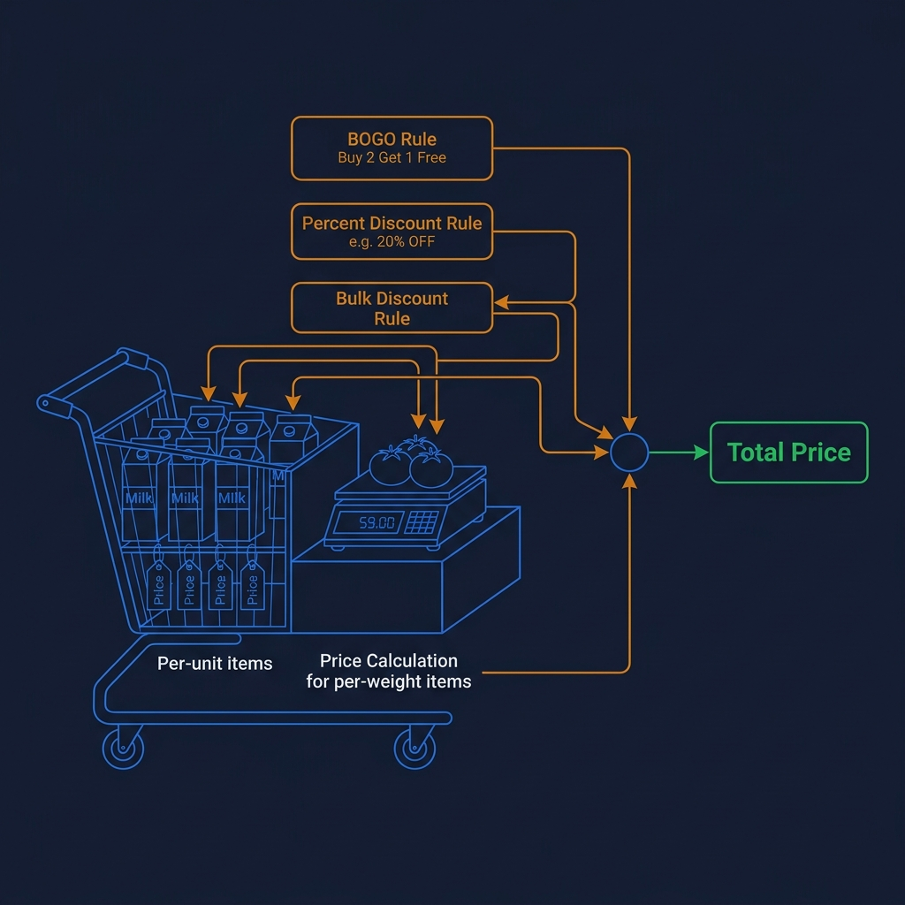
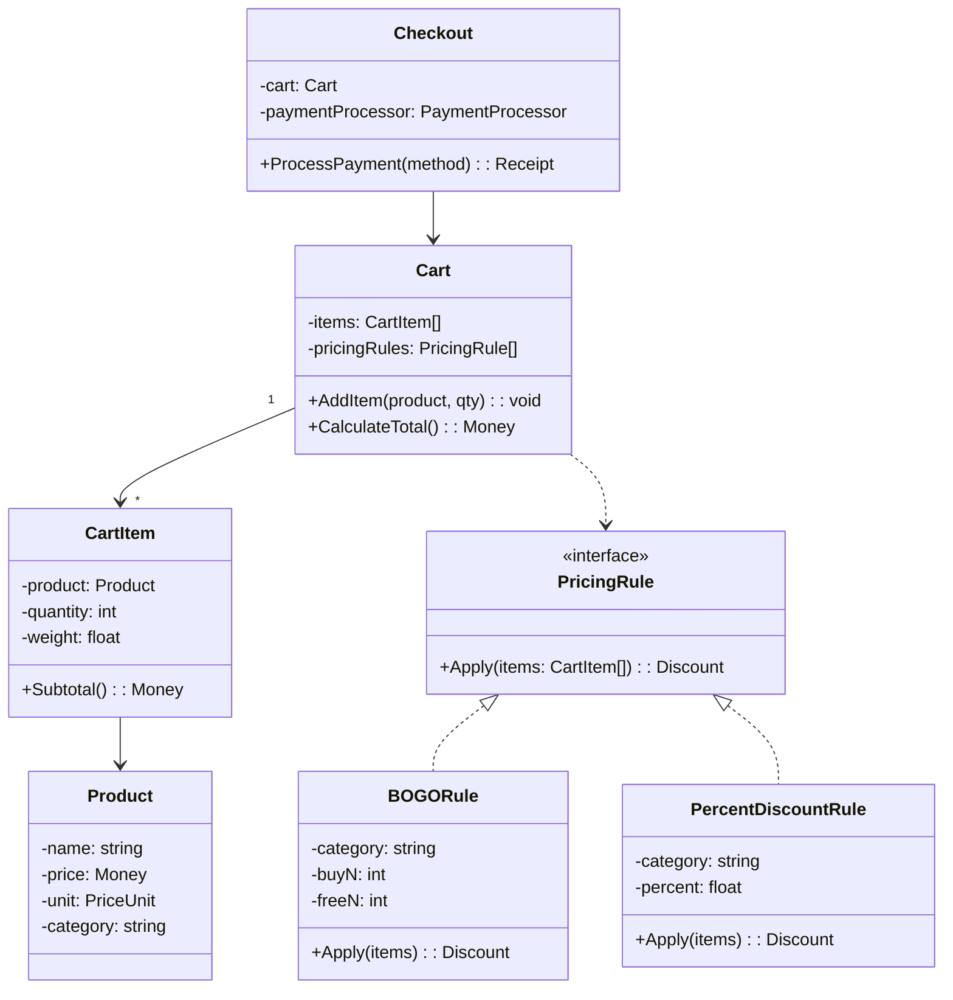
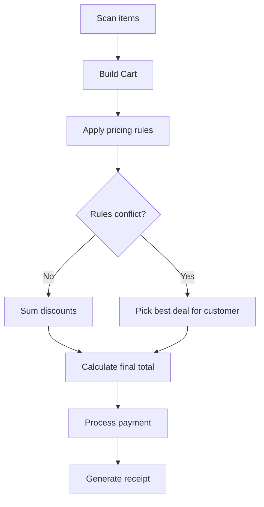

<!-- tags: ood-interview, oop, case-study, grocery-store -->
# Design a Grocery Store Checkout System

> Cart management, pricing rules composition (BOGO, weight-based), payment processing.

| Aspect | Detail |
| --- | --- |
| **Difficulty** | ⭐⭐ |
| **Primary patterns** | Strategy, Composite, Observer |
| **Interview focus** | Pricing rules composition + cart invariants + payment extensibility |

📅 Created: 2026-04-02 · 🔄 Updated: 2026-04-21 · ⏱️ 17 min read

---

## 1. DEFINE

The shelf says "Buy 2 Get 1 Free" for milk, "20% off all vegetables," and "Free shipping over $50." Customer puts in cart: 3 cartons of milk ($5 each), 2kg tomatoes ($3/kg), 1 bottle of cooking oil ($8). Raw total: $29. But which order should the pricing engine apply the 3 rules? BOGO before percentage discount? Or percentage first then BOGO?

Grocery checkout is hard because **pricing rules compose** — and the order of application changes the result:

1. **Cart management** — items can be per-unit (milk: $5/carton) or per-weight (tomatoes: $3/kg). Each type calculates differently.
2. **Pricing rules** — BOGO, percentage discount, bulk discount, coupon. Rules must compose (AND: both apply, BEST: pick the best deal for the customer).
3. **Payment** — cash, card, wallet. Total must be finalized before charging.

| Variant | Description | Interview angle |
| --- | --- | --- |
| Core | Cart + checkout + pricing | Object model + pricing strategy |
| Follow-up: BOGO | Buy 2 get 1 free for category | Rule composition, conflict resolution |
| Follow-up: weight items | Tomatoes $3/kg, weighed at checkout | Item type strategy |
| Follow-up: loyalty | Earn points, redeem points | Observer pattern, point calculation |

### Core Objects

| Object | Role | Key Attributes | Key Methods |
| --- | --- | --- | --- |
| `Cart` | Aggregate | items[], pricingRules[] | `AddItem()`, `CalculateTotal()` |
| `CartItem` | Line item | product, quantity, weight | `Subtotal()` |
| `Product` | Value object | name, price, unit, category | — |
| `PricingRule` | Policy interface | — | `Apply(items[]): Discount` |
| `BOGORule` | Concrete rule | category, buyN, freeN | `Apply(items[])` |
| `PercentDiscountRule` | Concrete rule | category, percent | `Apply(items[])` |

---

## 2. VISUAL




### Class Diagram



*Cart contains items + pricing rules. Rules apply in parallel, Checkout aggregates the final total.*

### Checkout Flow



*Pricing rules apply after cart is finalized. Conflict resolution = best deal policy.*

---

## 3. CODE

Diagram shows the flow. Core question: how does CartItem calculate subtotal when items can be per-unit or per-weight?

### Problem 1: Basic — CartItem with per-unit vs per-weight pricing

> **Goal**: CartItem knows how to calculate its own subtotal based on unit type.
> **Approach**: `Product.Unit` determines formula: per-unit = price × qty; per-weight = price × weight.
> **Example**: Milk($5, per-unit, qty=3) → $15; Tomatoes($3/kg, per-weight, 2kg) → $6
> **Complexity**: O(1) per calculation

```go
// grocery_store.go — CartItem with per-unit vs per-weight pricing
package grocery

type PriceUnit int

const (
	PerUnit   PriceUnit = iota // $5/carton
	PerWeight                  // $3/kg
)

type Product struct {
	Name     string
	Price    float64
	Unit     PriceUnit
	Category string
}

type CartItem struct {
	Product  Product
	Quantity int     // for PerUnit
	Weight   float64 // for PerWeight (kg)
}

// Subtotal calculates based on product's price unit.
// ✅ Item self-calculates — caller does not need to switch on unit type.
func (ci *CartItem) Subtotal() float64 {
	if ci.Product.Unit == PerWeight {
		return ci.Product.Price * ci.Weight
	}
	return ci.Product.Price * float64(ci.Quantity)
}

type Cart struct {
	Items []*CartItem
}

func (c *Cart) AddItem(item *CartItem) {
	c.Items = append(c.Items, item)
}

// RawTotal before any discounts.
func (c *Cart) RawTotal() float64 {
	total := 0.0
	for _, item := range c.Items {
		total += item.Subtotal()
	}
	return total
}
```

> **Why does subtotal logic live in CartItem instead of Cart?**
> If Cart switches on unit type, every new unit type (per-bundle, per-subscription) = modifying Cart. CartItem encapsulates pricing logic = Cart only sums, doesn't know per-unit vs per-weight.

Cart knows raw total. But BOGO "buy 2 get 1 free" must scan the category, count eligible items, calculate free items — that is PricingRule.

### Problem 2: Intermediate — PricingRule composition

> **Goal**: Pricing rules apply in parallel on cart items, returning a discount amount.
> **Approach**: PricingRule interface, each rule scans items and returns discount. Cart sums discounts.
> **Example**: BOGO(dairy, buy=2, free=1) + PercentDiscount(vegetable, 20%) → combined discount
> **Complexity**: O(N × R) — N items, R rules

```go
// pricing_rules.go — PricingRule composition
package grocery

// PricingRule — each rule scans items and returns discount.
// ✅ Strategy pattern — adding a new rule = adding 1 struct, Cart unchanged.
type PricingRule interface {
	Apply(items []*CartItem) float64 // returns discount amount
}

// BOGORule: Buy N get M free for a specific category.
type BOGORule struct {
	Category string
	BuyN     int
	FreeN    int
}

func (r *BOGORule) Apply(items []*CartItem) float64 {
	totalQty := 0
	unitPrice := 0.0
	for _, item := range items {
		if item.Product.Category == r.Category && item.Product.Unit == PerUnit {
			totalQty += item.Quantity
			unitPrice = item.Product.Price
		}
	}
	// ✅ Every BuyN items → FreeN items free
	groups := totalQty / (r.BuyN + r.FreeN)
	freeItems := groups * r.FreeN
	return float64(freeItems) * unitPrice
}

// PercentDiscountRule: X% off for a category.
type PercentDiscountRule struct {
	Category string
	Percent  float64
}

func (r *PercentDiscountRule) Apply(items []*CartItem) float64 {
	discount := 0.0
	for _, item := range items {
		if item.Product.Category == r.Category {
			discount += item.Subtotal() * r.Percent / 100
		}
	}
	return discount
}

// --- Cart with pricing rules ---

func (c *Cart) CalculateTotal(rules []PricingRule) float64 {
	raw := c.RawTotal()
	totalDiscount := 0.0
	for _, rule := range rules {
		totalDiscount += rule.Apply(c.Items)
	}
	final := raw - totalDiscount
	if final < 0 {
		return 0 // ⚠️ Guard — final price must not be negative
	}
	return final
}
```

> **Why do rules apply in parallel instead of sequentially?**
> Sequential = later rules receive items already modified by earlier rules → order dependency. Parallel = each rule calculates on raw items, sum discounts → order-independent, easy to debug. If the interviewer asks "rules conflict?" answer: "best deal policy — pick max discount per item, or apply all non-overlapping."

---

## 4. PITFALLS

| # | Severity | Mistake | Consequence | Fix |
| --- | --- | --- | --- | --- |
| 1 | 🔴 Fatal | Rules apply sequentially → order dependency | Changing rule order = different total | Apply in parallel on raw items, sum discounts |
| 2 | 🔴 Fatal | Final price can be negative with too many discounts | Customer gets paid | Guard: `max(0, rawTotal - totalDiscount)` |
| 3 | 🟡 Common | No separation of per-unit vs per-weight | Tomatoes calculated per carton instead of per kg | PriceUnit enum, `CartItem.Subtotal()` branches |
| 4 | 🟡 Common | BOGO logic lives inside Cart | Adding rule = modifying Cart | PricingRule interface, inject list of rules |
| 5 | 🔵 Minor | Receipt does not break down per-rule discount | Customer does not understand pricing | Each rule returns DiscountDetail(name, amount) |

---

## 5. REF

| Resource | Type | Link | Note |
| --- | --- | --- | --- |
| Refactoring Guru — Strategy Pattern | Reference | https://refactoring.guru/design-patterns/strategy | PricingRule = Strategy |
| ByteByteGo — OOD Interview | Course | https://bytebytego.com/courses/object-oriented-design-interview | Related case studies |

---

## 6. RECOMMEND

| Next topic | When | Why | File/Link |
| --- | --- | --- | --- |
| [Parking Lot](./04-parking-lot.md) | Want simpler Strategy pattern | PricingStrategy for parking fee | Case study |
| [Restaurant Management](./14-restaurant-management.md) | Want order management | Order → Kitchen flow = checkout extended | Case study |
| [Unix File Search](./06-unix-file-search.md) | Want filter/rule composition | Filter composition logic similar to pricing rules | Case study |

---

## 7. QUICK REF

| If the interviewer asks | Signal | Your answer |
| --- | --- | --- |
| "BOGO + percent discount on same item?" | Rule conflict | Best deal policy or cap total discount per item |
| "Add coupon code?" | Rule extensibility | CouponRule implements PricingRule, validate code + apply |
| "Loyalty points?" | Observer | Cart emits CheckoutCompleted event, LoyaltyService subscribes |
| "Scan barcode?" | Input method | ProductLookup service — barcode → Product, decoupled from Cart |
| "Weight item at checkout?" | UX flow | Scale integration — weight input for CartItem, guard weight > 0 |

---

**Links**: [← Elevator System](./08-elevator-system.md) · [→ Tic-Tac-Toe](./10-tic-tac-toe.md)
