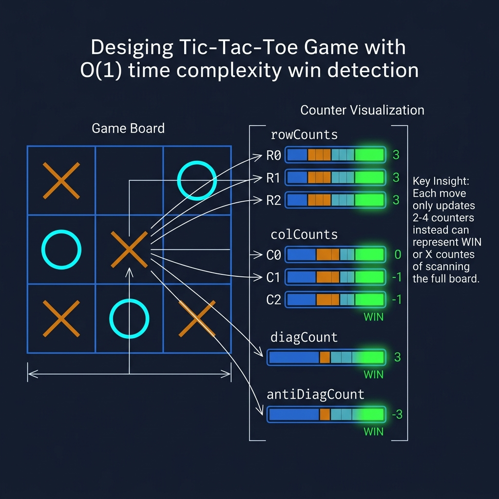
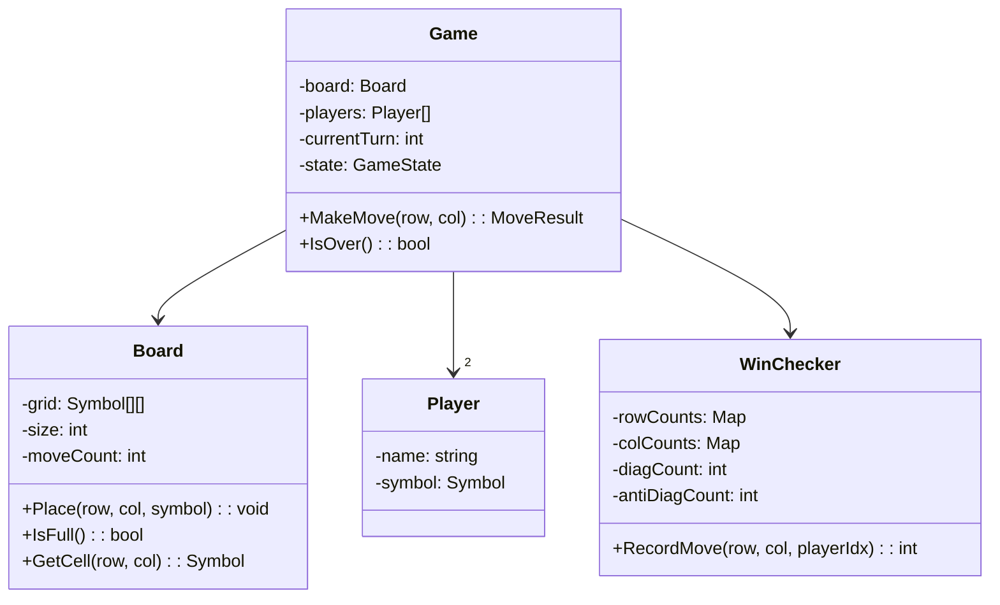
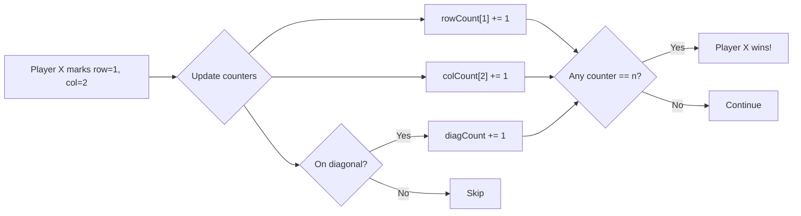

<!-- tags: ood-interview, oop, case-study, tic-tac-toe -->
# Design Tic-Tac-Toe

> Board state, O(1) win detection, turn management, extensible board size.

| Aspect | Detail |
| --- | --- |
| **Difficulty** | ⭐ |
| **Primary patterns** | State, Strategy, Template Method |
| **Interview focus** | Board invariants + O(1) win detection + extensibility |

📅 Created: 2026-04-02 · 🔄 Updated: 2026-04-21 · ⏱️ 16 min read

---

## 1. DEFINE

3×3, X goes first, O goes second, 3 in a row wins. Every engineer knows the rules. But when the interviewer asks "how do you check for a win?", most write brute-force checking 8 winning lines per turn — O(n²) for an n×n board.

The trick: you don't need to check the entire board. Track row count, column count, and diagonal count. Each move only affects 1 row + 1 column + at most 2 diagonals. If count == n → win. **O(1) per move.**

The tic-tac-toe interview does not measure whether you know the rules — it measures:

1. **Board invariants** — reject moves on occupied cells, reject moves after game ends.
2. **Win detection** — O(1) vs O(n²). Counter-based instead of brute-force.
3. **Extensibility** — n×n board? 3+ players? Computer AI? Design must separate board logic from player strategy.

| Variant | Description | Interview angle |
| --- | --- | --- |
| Core | 3×3, 2 players, standard rules | Board model + O(1) win check |
| Follow-up: n×n | Arbitrary board size | Generalized win detection |
| Follow-up: AI player | Computer auto-plays | Strategy pattern for player |
| Follow-up: undo | Undo last move | Command pattern |

### Core Objects

| Object | Role | Key Attributes | Key Methods |
| --- | --- | --- | --- |
| `Game` | Controller | board, players, currentTurn | `MakeMove(row, col)`, `GetWinner()` |
| `Board` | State holder | grid[][], size, moveCount | `Place(row, col, symbol)`, `IsFull()` |
| `Player` | Actor | name, symbol | `MakeMove(board): (row, col)` |
| `WinChecker` | Strategy | rowCounts, colCounts, diagCounts | `RecordMove(row, col, player): winner?` |

---

## 2. VISUAL




### Class Diagram



*Game coordinates. Board holds grid state. WinChecker tracks counts separately — separated from Board to swap strategy.*

### Win Detection — Counter-based O(1)



*Each move updates only 2-4 counters and checks == n. O(1) per move instead of scanning the entire board.*

---

## 3. CODE

### Problem 1: Basic — Board state + O(1) win detection

> **Goal**: Board guards invariants (no double-place, boundary check); WinChecker detects win O(1) per move.
> **Approach**: Counter per row, column, diagonal. Player X = +1, Player O = -1. |count| == n → win.
> **Example**: 3×3 board, X marks (0,0), (0,1), (0,2) → rowCount[0] == 3 → X wins
> **Complexity**: O(1) per move, O(n²) space for board

```go
// tictactoe.go — Board + O(1) win detection
package tictactoe

import (
	"errors"
	"fmt"
)

type Symbol int

const (
	Empty Symbol = iota
	X
	O
)

type Board struct {
	Grid      [][]Symbol
	Size      int
	MoveCount int
}

func NewBoard(size int) *Board {
	grid := make([][]Symbol, size)
	for i := range grid {
		grid[i] = make([]Symbol, size)
	}
	return &Board{Grid: grid, Size: size}
}

// Place puts a symbol on the board.
// ✅ Board guards its own invariants.
func (b *Board) Place(row, col int, symbol Symbol) error {
	if row < 0 || row >= b.Size || col < 0 || col >= b.Size {
		return fmt.Errorf("position (%d,%d) out of bounds", row, col)
	}
	if b.Grid[row][col] != Empty {
		return fmt.Errorf("position (%d,%d) already occupied", row, col)
	}
	b.Grid[row][col] = symbol
	b.MoveCount++
	return nil
}

func (b *Board) IsFull() bool {
	return b.MoveCount >= b.Size*b.Size
}

// --- O(1) Win Checker ---

type WinChecker struct {
	size          int
	rowCounts     []int // per-player sum per row
	colCounts     []int
	diagCount     int
	antiDiagCount int
}

func NewWinChecker(size int) *WinChecker {
	return &WinChecker{
		size:      size,
		rowCounts: make([]int, size),
		colCounts: make([]int, size),
	}
}

// RecordMove updates counters and returns true if this move wins.
// ✅ O(1) — only checks the row, col, and diagonals affected by this move.
// Player 1 = +1, Player 2 = -1. |count| == size → win.
func (wc *WinChecker) RecordMove(row, col, playerIdx int) bool {
	delta := 1
	if playerIdx == 1 {
		delta = -1 // Player 2
	}

	wc.rowCounts[row] += delta
	wc.colCounts[col] += delta

	if row == col {
		wc.diagCount += delta
	}
	if row+col == wc.size-1 {
		wc.antiDiagCount += delta
	}

	target := wc.size
	if playerIdx == 1 {
		target = -wc.size
	}

	return wc.rowCounts[row] == target ||
		wc.colCounts[col] == target ||
		wc.diagCount == target ||
		wc.antiDiagCount == target
}
```

> **Why +1/-1 instead of separate count arrays per player?**
> Two arrays = double memory, double check. A shared counter with +1/-1: |count| == n → win for that player. Elegant, O(1) space per counter line, easy to extend to n×n. This is the insight interviewers want to see — you understand the math trick, not brute-force.

### Problem 2: Intermediate — Game controller + turn management

> **Goal**: Game coordinates turns, validates moves, detects win/draw.
> **Approach**: Game holds Board + WinChecker + Players, rotates turns.
> **Example**: `game.MakeMove(0,0)` → X placed; `game.MakeMove(1,1)` → O placed; ... → "X wins!"
> **Complexity**: O(1) per turn

```go
// game.go — Game controller with turn management
package tictactoe

import "fmt"

type GameState int

const (
	Playing GameState = iota
	Won
	Draw
)

type Player struct {
	Name   string
	Symbol Symbol
}

type Game struct {
	Board       *Board
	Players     [2]Player
	WinChecker  *WinChecker
	CurrentTurn int
	State       GameState
	Winner      *Player
}

func NewGame(size int, p1Name, p2Name string) *Game {
	return &Game{
		Board:      NewBoard(size),
		Players:    [2]Player{{p1Name, X}, {p2Name, O}},
		WinChecker: NewWinChecker(size),
		State:      Playing,
	}
}

// MakeMove places the current player's symbol and checks for win/draw.
// ✅ Game guards: game over check, delegates to Board + WinChecker.
func (g *Game) MakeMove(row, col int) error {
	if g.State != Playing {
		return errors.New("game is over")
	}
	player := g.Players[g.CurrentTurn]
	if err := g.Board.Place(row, col, player.Symbol); err != nil {
		return err
	}

	if g.WinChecker.RecordMove(row, col, g.CurrentTurn) {
		g.State = Won
		g.Winner = &player
		return nil
	}

	if g.Board.IsFull() {
		g.State = Draw
		return nil
	}

	g.CurrentTurn = 1 - g.CurrentTurn // swap 0 ↔ 1
	return nil
}
```

> **Why does Game detect win/draw instead of Board?**
> Board only knows grid state — it does not know which player made a move. WinChecker tracks player counters. Game coordinates both. Separation of concerns: Board = data, WinChecker = rule, Game = flow.

---

## 4. PITFALLS

| # | Severity | Mistake | Consequence | Fix |
| --- | --- | --- | --- | --- |
| 1 | 🔴 Fatal | Brute-force win check (scan 8 lines per turn) | O(n²) per move for n×n | Counter-based O(1): row/col/diag counts |
| 2 | 🔴 Fatal | No game-over check before accepting move | Player moves after winner exists | `Game.State` guard at start of `MakeMove()` |
| 3 | 🟡 Common | Board does not guard double-place | 2 symbols on same cell, state corruption | `Board.Place()` checks `grid[r][c] == Empty` |
| 4 | 🔵 Minor | Hardcoded 3×3, no generalization | Interviewer asks n×n → rewrite | Size parameter, dynamic counter arrays |

---

## 5. REF

| Resource | Type | Link | Note |
| --- | --- | --- | --- |
| LeetCode — Design Tic-Tac-Toe | Practice | https://leetcode.com/problems/design-tic-tac-toe/ | O(1) win detection |
| ByteByteGo — OOD Interview | Course | https://bytebytego.com/courses/object-oriented-design-interview | Related problems |

---

## 6. RECOMMEND

| Next topic | When | Why | File/Link |
| --- | --- | --- | --- |
| [Blackjack](./11-blackjack.md) | Want more complex game state | Card dealing + hand evaluation + multi-player | Game |
| [Elevator System](./08-elevator-system.md) | Want state machine in different domain | Direction state = different kind of state management | Non-game |

---

## 7. QUICK REF

| If the interviewer asks | Signal | Your answer |
| --- | --- | --- |
| "n×n board?" | Scalability | Same counter logic, size parameter — O(1) per move still holds |
| "3+ players?" | Extensibility | Separate counter arrays per player (no ±1 trick), check each |
| "AI opponent?" | Strategy pattern | PlayerStrategy interface: HumanPlayer, MinimaxAI, RandomAI |
| "Undo move?" | Command pattern | MoveCommand with execute/undo, stack of commands |

---

**Links**: [← Grocery Store](./09-grocery-store.md) · [→ Blackjack](./11-blackjack.md)
