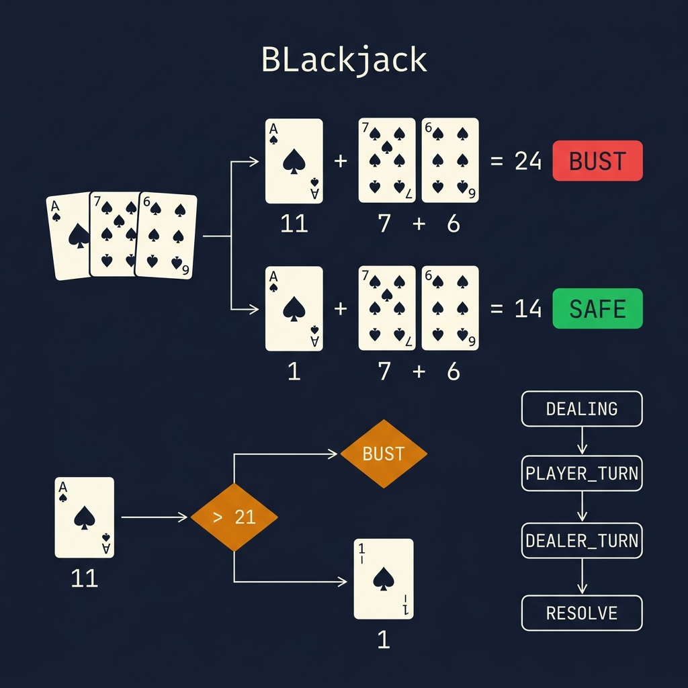
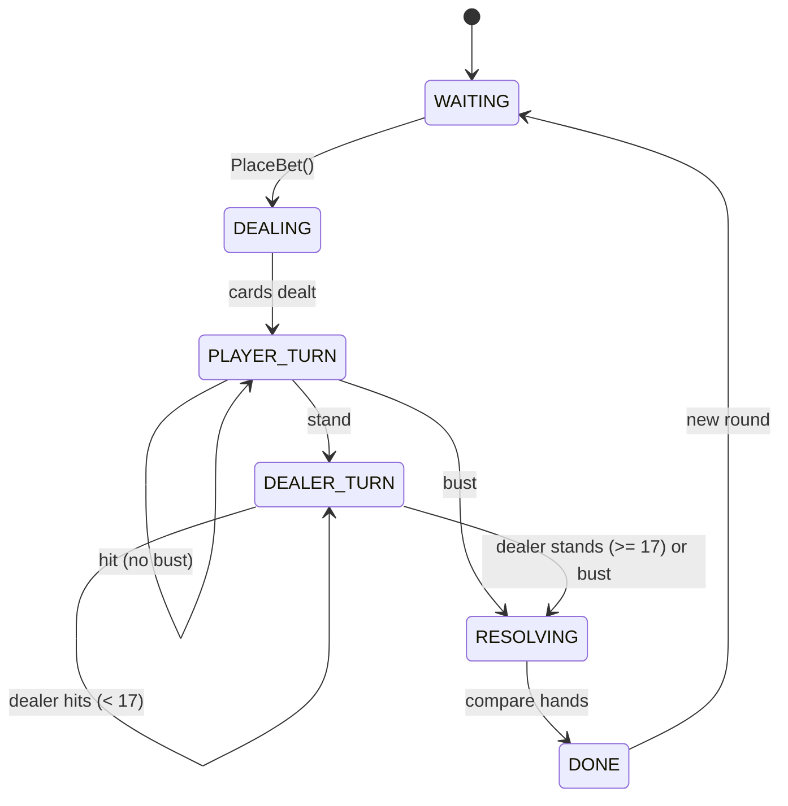

<!-- tags: ood-interview, oop, case-study, blackjack -->
# Design Blackjack

> Card game 21 — card dealing, hand evaluation with Ace dual-value, game state machine, dealer AI.

| Aspect | Detail |
| --- | --- |
| **Difficulty** | ⭐⭐ |
| **Primary patterns** | State, Strategy, Template Method |
| **Interview focus** | Hand evaluation complexity (Ace=1/11) + game state + dealer rules |

📅 Created: 2026-04-02 · 🔄 Updated: 2026-04-21 · ⏱️ 17 min read

---

## 1. DEFINE

Player receives 2 cards: Ace + 7. Hand value = 18 (Ace=11) or 8 (Ace=1)? Player hits and draws a 6. Now: Ace(11) + 7 + 6 = 24 (bust!) or Ace(1) + 7 + 6 = 14 (safe). The Ace must auto-downgrade from 11 to 1 when total exceeds 21.

Blackjack interview is hard at 3 points:

1. **Hand evaluation** — Ace dual-value. Multiple Aces? 2 Aces = 12 (11+1) or 2 (1+1) depending on context. Hand must calculate "best value ≤ 21."
2. **Game state machine** — `BETTING → DEALING → PLAYER_TURN → DEALER_TURN → RESOLVING → DONE`. Each state accepts only certain actions.
3. **Dealer AI** — dealer must hit when hand < 17, stand when ≥ 17. Rules are fixed — but separated into strategy for variability (e.g., "dealer stands on soft 17" vs "dealer hits on soft 17").

| Variant | Description | Interview angle |
| --- | --- | --- |
| Core | 1 player vs dealer, standard rules | Hand evaluation + game flow |
| Follow-up: multi-player | 3 players + dealer | Turn management, concurrent resolution |
| Follow-up: split | Pair → split into 2 hands | Hand cloning, independent state per hand |
| Follow-up: counting | Track dealt cards, adjust bet | Strategy pattern, probability |

### Core Objects

| Object | Role | Key Attributes | Key Methods |
| --- | --- | --- | --- |
| `Game` | Controller | deck, players, dealer, state | `Deal()`, `PlayerHit()`, `PlayerStand()` |
| `Hand` | Value calculator | cards[] | `BestValue()`, `IsBust()`, `IsBlackjack()` |
| `Card` | Value object | rank, suit | `Value(): int` |
| `Deck` | Collection | cards[] | `Shuffle()`, `Draw(): Card` |
| `DealerStrategy` | AI policy | — | `ShouldHit(hand): bool` |

---

## 2. VISUAL




### Class Diagram

```mermaid
classDiagram
    class Game {
        -deck: Deck
        -playerHand: Hand
        -dealerHand: Hand
        -state: GameState
        +Deal(): void
        +PlayerHit(): Card
        +PlayerStand(): void
        +Resolve(): GameResult
    }
    class Hand {
        -cards: Card[]
        +AddCard(card: Card): void
        +BestValue(): int
        +IsBust(): bool
        +IsBlackjack(): bool
    }
    class Card {
        -rank: Rank
        -suit: Suit
        +Value(): int
    }
    class Deck {
        -cards: Card[]
        +Shuffle(): void
        +Draw(): Card
    }
    class DealerStrategy {
        <<interface>>
        +ShouldHit(hand: Hand): bool
    }
    class StandardDealer {
        +ShouldHit(hand): bool
    }

    Game --> "2" Hand
    Game --> Deck
    Hand --> "*" Card
    Deck --> "*" Card
    Game ..> DealerStrategy
    DealerStrategy <|.. StandardDealer
```



### Game State Machine



*PLAYER_TURN loops for hit/stand. DEALER_TURN auto-plays according to DealerStrategy.*

---

## 3. CODE

### Problem 1: Basic — Hand evaluation with Ace dual-value

> **Goal**: Hand calculates best value ≤ 21, auto-downgrades Ace from 11 to 1.
> **Approach**: Sum all card values (Ace=11 by default), then downgrade Aces when total > 21.
> **Example**: [Ace, 7, 6] → 11+7+6=24 → downgrade 1 Ace → 1+7+6=14
> **Complexity**: O(n) per evaluation, n = cards in hand

```go
// blackjack.go — Hand evaluation with Ace dual-value
package blackjack

type Suit int

const (
	Hearts Suit = iota
	Diamonds
	Clubs
	Spades
)

type Rank int

const (
	Ace Rank = iota + 1
	Two
	Three
	Four
	Five
	Six
	Seven
	Eight
	Nine
	Ten
	Jack
	Queen
	King
)

type Card struct {
	Rank Rank
	Suit Suit
}

// Value returns card's point value. Face cards = 10, Ace = 11 (default).
func (c Card) Value() int {
	if c.Rank >= Jack {
		return 10
	}
	if c.Rank == Ace {
		return 11 // ⚠️ Default 11, Hand.BestValue() downgrades if needed
	}
	return int(c.Rank)
}

type Hand struct {
	Cards []Card
}

func (h *Hand) AddCard(c Card) {
	h.Cards = append(h.Cards, c)
}

// BestValue calculates the best hand value ≤ 21.
// ✅ Greedily downgrade Aces from 11 to 1 until total ≤ 21 or no Aces left.
func (h *Hand) BestValue() int {
	total := 0
	aces := 0
	for _, c := range h.Cards {
		total += c.Value()
		if c.Rank == Ace {
			aces++
		}
	}
	// Downgrade Aces: 11 → 1 (save 10 each)
	for total > 21 && aces > 0 {
		total -= 10
		aces--
	}
	return total
}

func (h *Hand) IsBust() bool {
	return h.BestValue() > 21
}

func (h *Hand) IsBlackjack() bool {
	return len(h.Cards) == 2 && h.BestValue() == 21
}
```

> **Why default Ace = 11 then downgrade, instead of default = 1 then upgrade?**
> Downgrade approach: start optimistically (11), reduce when needed. Upgrade approach: start pessimistically (1), must check "can I add 10 without busting?" — reverse logic, harder to read with multiple Aces. Industry convention: "soft hand" = has Ace counted as 11, downgrade on bust.

### Problem 2: Intermediate — Dealer AI + Game resolution

> **Goal**: Dealer auto-plays via strategy; Game resolves winner.
> **Approach**: DealerStrategy interface, StandardDealer hits < 17. Game compares values.
> **Example**: Dealer hand=15 → hit → 15+4=19 → stand. Player=20 > Dealer=19 → Player wins.
> **Complexity**: O(1) per action

```go
// dealer.go — DealerStrategy + Game resolution
package blackjack

// DealerStrategy — separates dealer AI from game logic.
// ✅ Swap StandardDealer → VegasDealer → CasinoDealer.
type DealerStrategy interface {
	ShouldHit(hand *Hand) bool
}

// StandardDealer hits below 17, stands at 17+.
type StandardDealer struct{}

func (d *StandardDealer) ShouldHit(hand *Hand) bool {
	return hand.BestValue() < 17
}

type GameResult int

const (
	PlayerWins GameResult = iota
	DealerWins
	Push // tie
	PlayerBlackjack
)

// Resolve compares hands after both player and dealer are done.
func Resolve(player, dealer *Hand) GameResult {
	if player.IsBlackjack() && !dealer.IsBlackjack() {
		return PlayerBlackjack
	}
	if dealer.IsBust() {
		return PlayerWins
	}
	if player.BestValue() > dealer.BestValue() {
		return PlayerWins
	}
	if player.BestValue() < dealer.BestValue() {
		return DealerWins
	}
	return Push
}
```

> **Why is DealerStrategy separated from Game?**
> Casino rules vary: "dealer stands on soft 17" vs "dealer hits on soft 17" — only the `ShouldHit()` logic differs. Separating the strategy = swap rules without modifying Game flow.

---

## 4. PITFALLS

| # | Severity | Mistake | Consequence | Fix |
| --- | --- | --- | --- | --- |
| 1 | 🔴 Fatal | Ace always = 11 or always = 1 | Hand [Ace,7,6] = bust (24) or always low (14) | Greedy downgrade: 11 → 1 when total > 21 |
| 2 | 🔴 Fatal | No bust check before dealer turn | Player busts but still waits for dealer → wrong flow | PLAYER_TURN → RESOLVING if bust |
| 3 | 🟡 Common | Dealer logic hardcoded in Game | Changing rules = modifying Game | DealerStrategy interface |
| 4 | 🔵 Minor | Deck not shuffled | Card order predictable, game not fair | `Deck.Shuffle()` using Fisher-Yates |

---

## 5. REF

| Resource | Type | Link | Note |
| --- | --- | --- | --- |
| Refactoring Guru — State Pattern | Reference | https://refactoring.guru/design-patterns/state | Game state machine |
| Blackjack rules | Reference | https://en.wikipedia.org/wiki/Blackjack | Official rules |

---

## 6. RECOMMEND

| Next topic | When | Why | File/Link |
| --- | --- | --- | --- |
| [Tic-Tac-Toe](./10-tic-tac-toe.md) | Want simpler game state review | Turn management baseline | Game |
| [Vending Machine](./07-vending-machine.md) | Want State pattern in different domain | Non-game state machine style | Case study |

---

## 7. QUICK REF

| If the interviewer asks | Signal | Your answer |
| --- | --- | --- |
| "Multiple Aces?" | Edge case | Greedy downgrade loop: each Ace can go 11→1, iterate |
| "Split pairs?" | State extension | Clone Hand, independent play per split hand |
| "Card counting?" | Strategy | Track dealt cards, adjust bet via BettingStrategy |
| "Multi-player table?" | Scalability | Player[] array, each with own Hand, resolve independently vs dealer |

---

**Links**: [← Tic-Tac-Toe](./10-tic-tac-toe.md) · [→ Shipping Locker](./12-shipping-locker.md)
