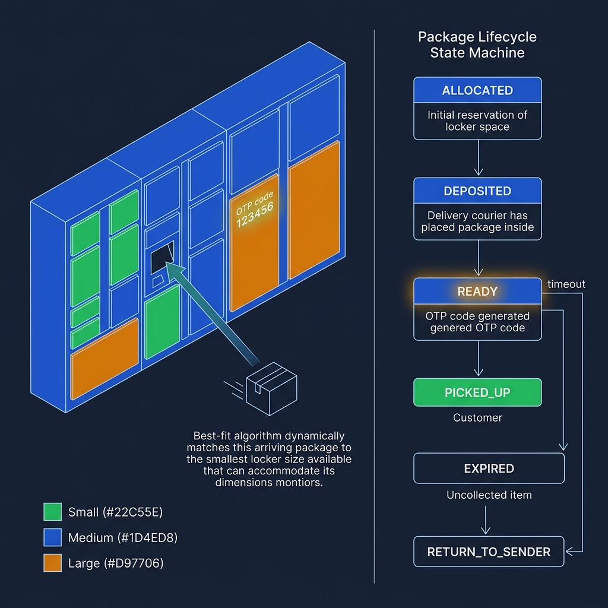
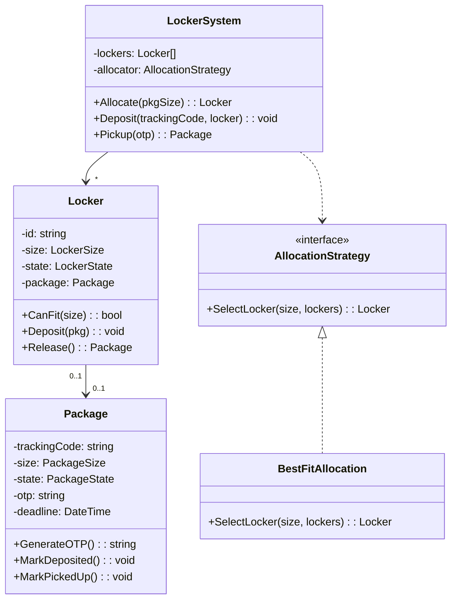
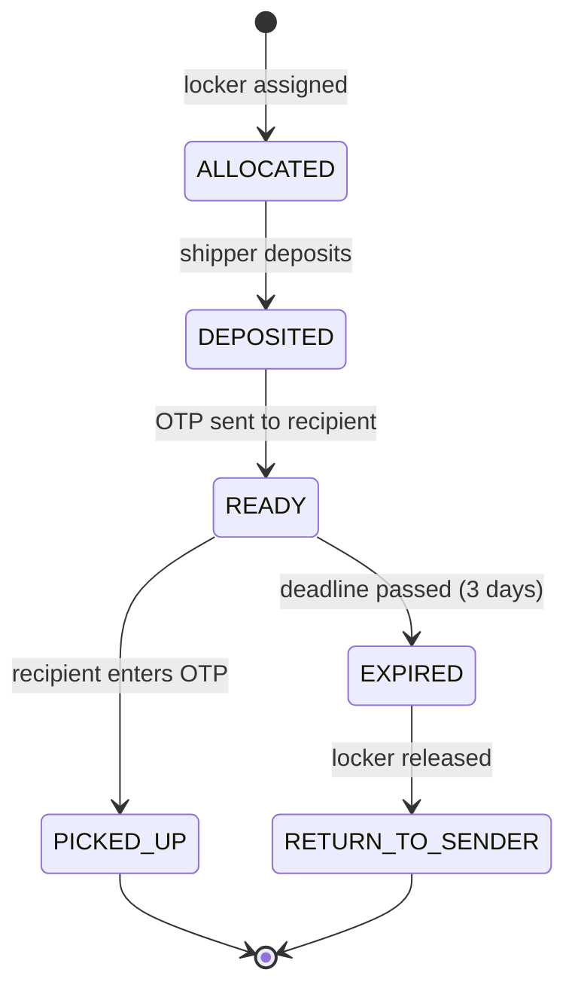

<!-- tags: ood-interview, oop, case-study, shipping-locker -->
# Design a Shipping Locker System

> Locker allocation for package delivery — size matching, package lifecycle, OTP access management.

| Aspect | Detail |
| --- | --- |
| **Difficulty** | ⭐⭐ |
| **Primary patterns** | Strategy, State, Factory |
| **Interview focus** | Size matching + locker allocation + package lifecycle + OTP access |

📅 Created: 2026-04-02 · 🔄 Updated: 2026-04-21 · ⏱️ 17 min read

---

## 1. DEFINE

Amazon Locker: shipper arrives, scans tracking code, system opens locker #37. Shipper places package inside, closes door. System sends OTP to recipient. Recipient arrives, enters OTP, locker #37 opens. Package retrieved. Done.

Simple? Until: package size=Large but only Medium lockers remain. Reject? Or let the shipper split into 2? Then: recipient does not show up for 3 days — package must return to sender.

Shipping locker is hard at 3 points:

1. **Size matching** — package size must fit locker size. Allocation strategy: best-fit (smallest locker that fits) vs first-fit.
2. **Package lifecycle** — `ALLOCATED → DEPOSITED → READY_FOR_PICKUP → PICKED_UP`. Timeout → `RETURN_TO_SENDER`.
3. **Access management** — OTP for recipient, tracking code for shipper. Each phase has different access credentials.

| Variant | Description | Interview angle |
| --- | --- | --- |
| Core | Allocate locker, deposit, pickup | Object model + state + allocation |
| Follow-up: timeout | Package not picked up in 3 days | Timeout state transition |
| Follow-up: multi-package | 1 locker holds multiple small packages | Packing strategy |
| Follow-up: return | Recipient rejects → return to sender | Reverse flow |

### Core Objects

| Object | Role | Key Attributes | Key Methods |
| --- | --- | --- | --- |
| `LockerSystem` | Coordinator | lockers[], packages[] | `Allocate(pkgSize)`, `Deposit(trackingCode)` |
| `Locker` | Resource | id, size, state, package | `CanFit(pkgSize)`, `Deposit(pkg)`, `Release()` |
| `Package` | Lifecycle entity | trackingCode, size, state, otp, deadline | `GenerateOTP()`, `MarkDeposited()`, `MarkPickedUp()` |
| `AllocationStrategy` | Policy | — | `SelectLocker(size, lockers[]): Locker` |

---

## 2. VISUAL




### Class Diagram



### Package Lifecycle



*READY → EXPIRED auto-transitions after deadline. EXPIRED triggers locker release + return flow.*

---

## 3. CODE

### Problem 1: Basic — Locker allocation with best-fit strategy

> **Goal**: Select the smallest locker that fits the package, avoiding waste.
> **Approach**: Best-fit — scan available lockers, pick smallest that fits.
> **Example**: Package=Medium, lockers=[Small(free), Medium(free), Large(free)] → choose Medium
> **Complexity**: O(L) scan L lockers

```go
// locker_system.go — Locker allocation with best-fit strategy
package locker

import (
	"crypto/rand"
	"errors"
	"fmt"
	"math/big"
	"time"
)

type LockerSize int

const (
	Small  LockerSize = iota // fits small packages
	Medium                   // fits small + medium
	Large                    // fits all
)

type LockerState string

const (
	LockerAvailable LockerState = "AVAILABLE"
	LockerOccupied  LockerState = "OCCUPIED"
)

type Locker struct {
	ID      string
	Size    LockerSize
	State   LockerState
	Package *Package
}

// CanFit checks if locker can accommodate package size.
// ✅ Same logic as Parking Lot Spot.CanFit() — size comparison.
func (l *Locker) CanFit(pkgSize LockerSize) bool {
	return l.State == LockerAvailable && pkgSize <= l.Size
}

func (l *Locker) Deposit(pkg *Package) error {
	if l.State != LockerAvailable {
		return fmt.Errorf("locker %s not available", l.ID)
	}
	l.Package = pkg
	l.State = LockerOccupied
	return nil
}

func (l *Locker) Release() *Package {
	pkg := l.Package
	l.Package = nil
	l.State = LockerAvailable
	return pkg
}

// AllocationStrategy — picks best locker for package.
type AllocationStrategy interface {
	SelectLocker(size LockerSize, lockers []*Locker) (*Locker, error)
}

// BestFitAllocation picks smallest available locker that fits.
// ✅ Minimize waste — Medium package → Medium locker (not Large).
type BestFitAllocation struct{}

func (b *BestFitAllocation) SelectLocker(size LockerSize, lockers []*Locker) (*Locker, error) {
	var best *Locker
	for _, l := range lockers {
		if l.CanFit(size) {
			if best == nil || l.Size < best.Size {
				best = l
			}
		}
	}
	if best == nil {
		return nil, errors.New("no available locker for this size")
	}
	return best, nil
}
```

> **Why best-fit instead of first-fit?**
> First-fit: a Medium package may occupy a Large locker → waste. Best-fit: always picks the smallest locker that fits → maximizes availability for Large packages later. Trade-off: best-fit O(L) scan, first-fit can be O(1) if lockers are sorted. In an interview: stating the trade-off = bonus points.

### Problem 2: Intermediate — Package lifecycle + OTP access

> **Goal**: Package tracks state transitions; OTP management for secure pickup.
> **Approach**: Package state machine + OTP generation/validation.
> **Example**: allocate → deposit → generateOTP("123456") → pickup(otp="123456") → success
> **Complexity**: O(1) per transition

```go
// package_lifecycle.go — Package state machine + OTP access
package locker

type PackageState string

const (
	Allocated      PackageState = "ALLOCATED"
	Deposited      PackageState = "DEPOSITED"
	ReadyForPickup PackageState = "READY"
	PickedUp       PackageState = "PICKED_UP"
	Expired        PackageState = "EXPIRED"
)

type Package struct {
	TrackingCode string
	Size         LockerSize
	State        PackageState
	OTP          string
	Deadline     time.Time
}

func (p *Package) MarkDeposited() error {
	if p.State != Allocated {
		return fmt.Errorf("package %s not in ALLOCATED state", p.TrackingCode)
	}
	p.State = Deposited
	p.OTP = generateOTP()
	p.Deadline = time.Now().Add(72 * time.Hour) // 3 days
	p.State = ReadyForPickup
	return nil
}

func (p *Package) Pickup(otp string) error {
	if p.State != ReadyForPickup {
		return fmt.Errorf("package %s not ready for pickup", p.TrackingCode)
	}
	if time.Now().After(p.Deadline) {
		p.State = Expired
		return fmt.Errorf("package %s expired", p.TrackingCode)
	}
	if p.OTP != otp {
		return errors.New("invalid OTP")
	}
	p.State = PickedUp
	return nil
}

func (p *Package) IsExpired() bool {
	return p.State == ReadyForPickup && time.Now().After(p.Deadline)
}

func generateOTP() string {
	n, _ := rand.Int(rand.Reader, big.NewInt(999999))
	return fmt.Sprintf("%06d", n.Int64())
}
```

> **Why does OTP live in Package instead of Locker?**
> OTP is tied to *who has the right to pick up* (recipient) — that is Package context. Locker is just the physical container. When a package expires and is moved to another locker (or returned), the OTP still belongs to Package. Separation: Locker = where, Package = what + who + when.

---

## 4. PITFALLS

| # | Severity | Mistake | Consequence | Fix |
| --- | --- | --- | --- | --- |
| 1 | 🔴 Fatal | No size matching for package vs locker | Large package in Small locker = cannot close | `CanFit(pkgSize)` comparison |
| 2 | 🔴 Fatal | No expired package handling | Locker permanently occupied, capacity leak | Deadline timer + EXPIRED state + auto-release |
| 3 | 🟡 Common | Shared OTP across all packages | Security breach — 1 OTP opens all lockers | Per-package unique OTP |
| 4 | 🟡 Common | First-fit allocation | Large locker wasted for small package | Best-fit strategy |
| 5 | 🔵 Minor | No access history log | Dispute: "I didn't pick up my package" → no proof | Audit log per pickup attempt |

---

## 5. REF

| Resource | Type | Link | Note |
| --- | --- | --- | --- |
| Amazon Locker system | Reference | https://www.amazon.com/b?ie=UTF8&node=17051031011 | Real-world reference |
| ByteByteGo — OOD Interview | Course | https://bytebytego.com/courses/object-oriented-design-interview | Related case studies |

---

## 6. RECOMMEND

| Next topic | When | Why | File/Link |
| --- | --- | --- | --- |
| [Parking Lot](./04-parking-lot.md) | Want to compare resource allocation | Spot allocation ≈ locker allocation | Case study |
| [Movie Ticket Booking](./05-movie-ticket-booking.md) | Want similar temporal lifecycle | Seat hold timeout ≈ package expiry | Case study |
| [ATM System](./13-atm-system.md) | Want access control pattern | ATM session auth ≈ OTP access | Case study |

---

## 7. QUICK REF

| If the interviewer asks | Signal | Your answer |
| --- | --- | --- |
| "No locker of the right size?" | Allocation flexibility | Upgrade: Medium package → Large locker (if available), reject otherwise |
| "Package expired?" | Temporal lifecycle | READY → EXPIRED state, background job releases locker, notifies sender |
| "1 locker, multiple packages?" | Packing optimization | Track remaining capacity per locker, CompartmentedLocker |
| "Return to sender?" | Reverse flow | EXPIRED → RETURN state, schedule courier pickup |

---

**Links**: [← Blackjack](./11-blackjack.md) · [→ ATM System](./13-atm-system.md)
