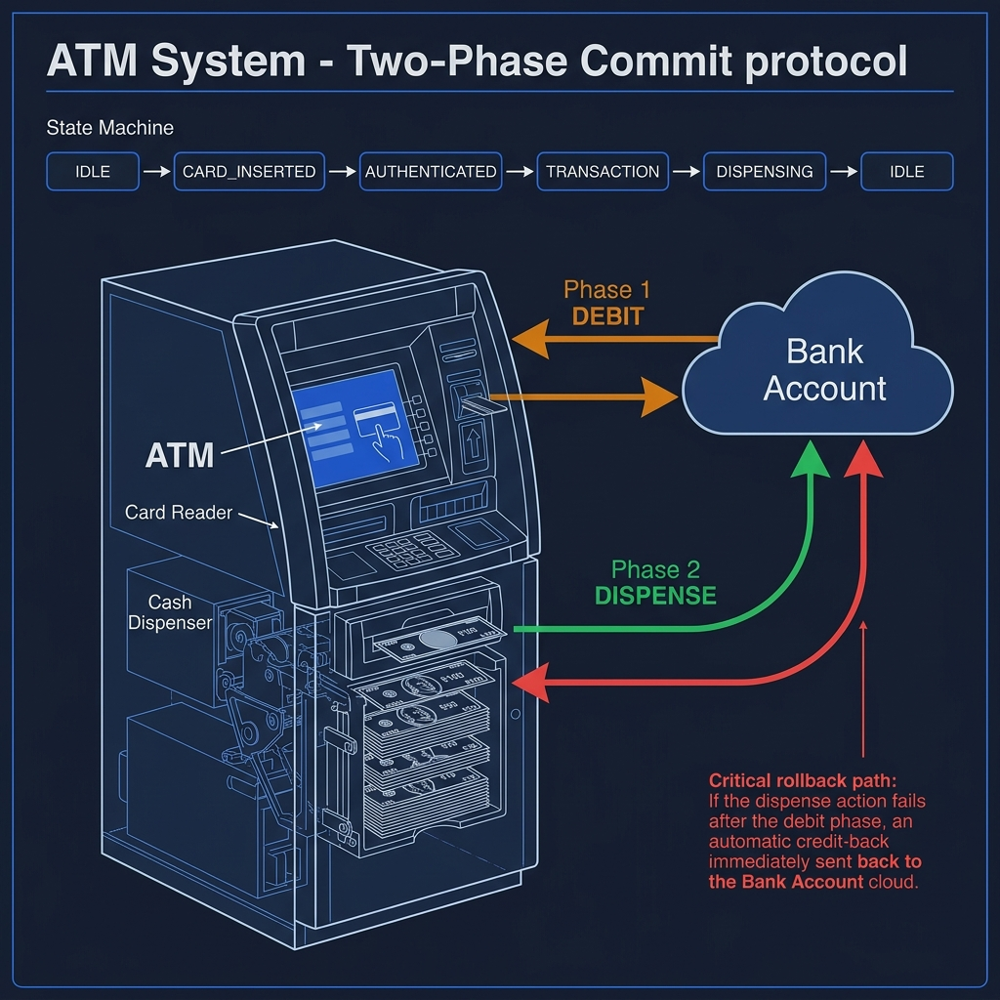
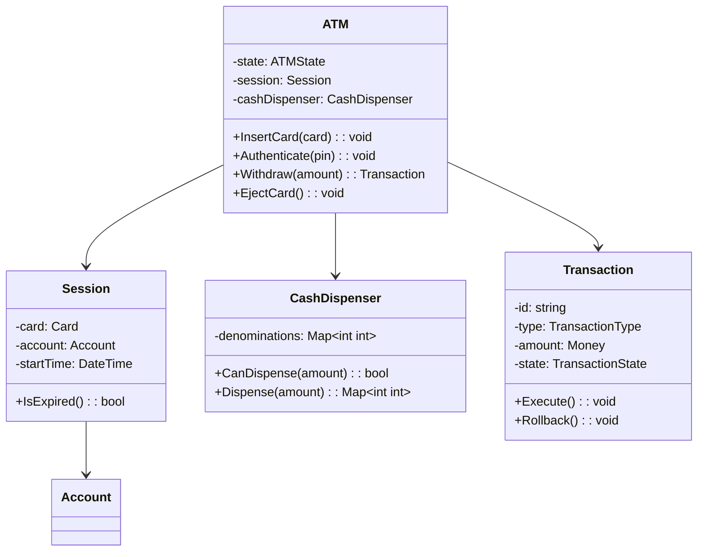
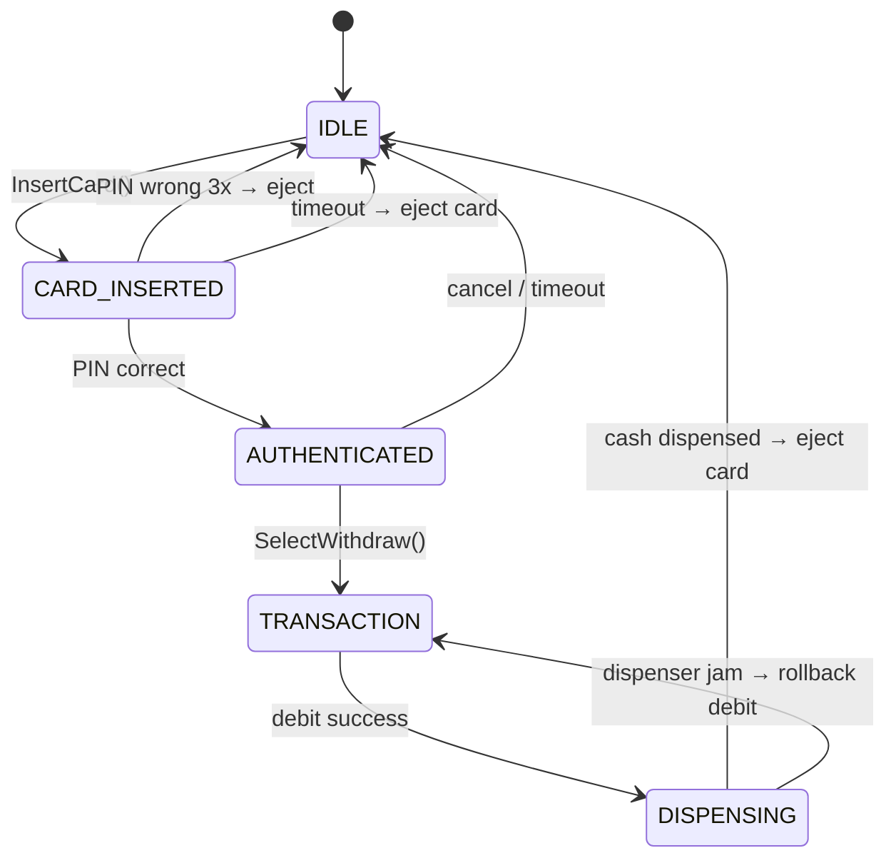

<!-- tags: ood-interview, oop, case-study, atm-system -->
# Design an ATM System

> Session authentication, cash dispensing atomicity, transaction state machine, denomination selection.

| Aspect | Detail |
| --- | --- |
| **Difficulty** | ⭐⭐⭐ |
| **Primary patterns** | State, Chain of Responsibility, Strategy |
| **Interview focus** | Session lifecycle + transaction atomicity + cash denomination algorithm |

📅 Created: 2026-04-02 · 🔄 Updated: 2026-04-21 · ⏱️ 19 min read

---

## 1. DEFINE

Customer withdraws $175 from ATM. Machine has: 50× $100 bills, 30× $50 bills, 100× $20 bills, 200× $10 bills. Should it dispense: 1×$100 + 1×$50 + 1×$20 + 1×$5? But the ATM has no $5 bills. So: 1×$100 + 1×$50 + 1×$20 + 0.5×$10? No — ATMs do not dispense half bills.

$175 cannot be made with the available denominations ($100, $50, $20, $10). The ATM should reject the transaction and display "amount must be a multiple of $10." But what about $170? 1×$100 + 1×$50 + 1×$20 or 3×$50 + 1×$20? Which algorithm minimizes the number of bills?

ATM is hard at 3 points:

1. **Session lifecycle** — insert card → authenticate → transact → eject card. Each phase has a timeout. Session expired = eject card + rollback.
2. **Transaction atomicity** — debit account → dispense cash. If the cash dispenser jams mid-way → rollback the debit. Two-phase commit in an embedded system.
3. **Cash denomination** — greedy (largest bill first) is optimal for most cases, but must check inventory per denomination.

| Variant | Description | Interview angle |
| --- | --- | --- |
| Core | Card auth → withdraw → dispense | Session state + transaction |
| Follow-up: deposit | Accept cash/checks | Reverse state (cash in instead of out) |
| Follow-up: out of cash | Denomination runs out | Graceful degradation |
| Follow-up: multi-account | Savings vs checking account | Account selection strategy |

### Core Objects

| Object | Role | Key Attributes | Key Methods |
| --- | --- | --- | --- |
| `ATM` | State machine | state, cashDispenser, cardReader | `InsertCard()`, `Authenticate()`, `Withdraw()` |
| `Session` | Lifecycle | card, account, startTime, timeout | `IsExpired()`, `End()` |
| `CashDispenser` | Component | denominations[] | `CanDispense(amount)`, `Dispense(amount)` |
| `Transaction` | Unit of work | id, type, amount, state | `Execute()`, `Rollback()` |
| `Account` | External entity | id, balance | `Debit(amount)`, `Credit(amount)` |

---

## 2. VISUAL




### Class Diagram



### ATM State Machine



*DISPENSING → TRANSACTION rollback path — if cash jams, debit must rollback. This is the atomicity challenge.*

---

## 3. CODE

### Problem 1: Basic — CashDispenser with denomination selection

> **Goal**: Dispense the exact requested amount using the largest bills possible.
> **Approach**: Greedy — iterate denominations from largest to smallest, use maximum available.
> **Example**: $170, denoms={100:50, 50:30, 20:100} → 1×$100 + 1×$50 + 1×$20
> **Complexity**: O(D) with D = number of denomination types

```go
// atm_system.go — CashDispenser with denomination selection
package atm

import (
	"fmt"
	"sort"
)

type CashDispenser struct {
	Denominations map[int]int // denomination value → count available
}

// CanDispense checks if exact amount can be made.
func (cd *CashDispenser) CanDispense(amount int) bool {
	_, err := cd.calculateDispense(amount)
	return err == nil
}

// Dispense deducts bills and returns what to give.
// ✅ Greedy — largest denomination first.
// ⚠️ Does NOT modify inventory until commit.
func (cd *CashDispenser) Dispense(amount int) (map[int]int, error) {
	result, err := cd.calculateDispense(amount)
	if err != nil {
		return nil, err
	}
	// Commit — deduct from inventory
	for denom, count := range result {
		cd.Denominations[denom] -= count
	}
	return result, nil
}

func (cd *CashDispenser) calculateDispense(amount int) (map[int]int, error) {
	denoms := make([]int, 0, len(cd.Denominations))
	for d := range cd.Denominations {
		denoms = append(denoms, d)
	}
	sort.Sort(sort.Reverse(sort.IntSlice(denoms)))

	result := make(map[int]int)
	remaining := amount

	for _, d := range denoms {
		available := cd.Denominations[d]
		needed := remaining / d
		used := min(needed, available)
		if used > 0 {
			result[d] = used
			remaining -= used * d
		}
	}

	if remaining > 0 {
		return nil, fmt.Errorf("cannot dispense %d: %d remaining after greedy", amount, remaining)
	}
	return result, nil
}

func min(a, b int) int {
	if a < b {
		return a
	}
	return b
}
```

> **Why is `calculateDispense` separated from commit?**
> Preview before deducting. If debit account succeeds but dispense fails → need to rollback debit, NOT rollback cash (because cash was never deducted). Two-phase: calculate → debit account → deduct cash inventory. Any step fails → rollback previous steps.

### Problem 2: Intermediate — Session + Transaction atomicity

> **Goal**: Session manages authentication lifecycle; Transaction ensures debit-then-dispense atomicity.
> **Approach**: Session timeout guard; Transaction rollback when dispense fails.
> **Example**: authenticate → withdraw($100) → debit OK → dispense OK → success. Dispense jam → rollback debit.
> **Complexity**: O(1) per state transition; O(D) per dispense

```go
// atm_session.go — Session lifecycle + Transaction atomicity
package atm

import (
	"errors"
	"fmt"
	"time"
)

type Account struct {
	ID      string
	Balance int
}

func (a *Account) Debit(amount int) error {
	if amount > a.Balance {
		return fmt.Errorf("insufficient balance: %d < %d", a.Balance, amount)
	}
	a.Balance -= amount
	return nil
}

func (a *Account) Credit(amount int) {
	a.Balance += amount
}

type Session struct {
	Account   *Account
	StartTime time.Time
	Timeout   time.Duration
}

func (s *Session) IsExpired() bool {
	return time.Since(s.StartTime) > s.Timeout
}

type TransactionState string

const (
	TxPending    TransactionState = "PENDING"
	TxDebited    TransactionState = "DEBITED"
	TxComplete   TransactionState = "COMPLETE"
	TxRolledBack TransactionState = "ROLLED_BACK"
)

type WithdrawTransaction struct {
	ID        string
	Amount    int
	Account   *Account
	Dispenser *CashDispenser
	State     TransactionState
}

// Execute runs the two-phase withdraw: debit → dispense.
// ✅ If dispense fails after debit → automatic rollback.
func (tx *WithdrawTransaction) Execute() error {
	// Phase 1: Debit account
	if err := tx.Account.Debit(tx.Amount); err != nil {
		return fmt.Errorf("debit failed: %w", err)
	}
	tx.State = TxDebited

	// Phase 2: Dispense cash
	_, err := tx.Dispenser.Dispense(tx.Amount)
	if err != nil {
		// ⚠️ Dispense failed → rollback debit
		tx.Rollback()
		return fmt.Errorf("dispense failed, debit rolled back: %w", err)
	}
	tx.State = TxComplete
	return nil
}

// Rollback reverses the debit.
func (tx *WithdrawTransaction) Rollback() {
	if tx.State == TxDebited {
		tx.Account.Credit(tx.Amount)
		tx.State = TxRolledBack
	}
}
```

> **Why debit before dispense, not the reverse?**
> Dispense first → cash leaves the machine but account is not debited = free money. Debit first → worst case: debit succeeds but dispense fails → rollback debit = no harm. Pattern: always deduct from the "recoverable" side first (account debit = recoverable; cash dispensed = unrecoverable).

---

## 4. PITFALLS

| # | Severity | Mistake | Consequence | Fix |
| --- | --- | --- | --- | --- |
| 1 | 🔴 Fatal | Dispense cash before debiting account | Cash leaves machine without deduction = loss | Debit first, dispense second, rollback if fail |
| 2 | 🔴 Fatal | No rollback when dispenser jams | Account debited but no cash received | `Transaction.Rollback()` credits account back |
| 3 | 🟡 Common | Session has no timeout | User walks away, card still inserted → security risk | Session timeout 2 min, auto eject card |
| 4 | 🟡 Common | Amount not checked for denomination compatibility | $175 requested but only $100/$50/$20 available | `CanDispense()` check before `Execute()` |
| 5 | 🔵 Minor | PIN attempts not limited | Brute force attack | Max 3 attempts → retain card |

---

## 5. REF

| Resource | Type | Link | Note |
| --- | --- | --- | --- |
| ByteByteGo — ATM OOD | Course | https://bytebytego.com/courses/object-oriented-design-interview | Full walkthrough |
| Refactoring Guru — Chain of Responsibility | Reference | https://refactoring.guru/design-patterns/chain-of-responsibility | CashDispenser denomination chain |

---

## 6. RECOMMEND

| Next topic | When | Why | File/Link |
| --- | --- | --- | --- |
| [Vending Machine](./07-vending-machine.md) | Want to compare state machine + cash handling | Simpler state + coin handling | Case study |
| [Elevator System](./08-elevator-system.md) | Want multi-entity state coordination | ATM = single entity state, Elevator = multi-entity | Case study |
| [Shipping Locker](./12-shipping-locker.md) | Want to compare access control pattern | OTP access ≈ PIN authentication | Case study |

---

## 7. QUICK REF

| If the interviewer asks | Signal | Your answer |
| --- | --- | --- |
| "Dispenser jams mid-way?" | Transaction atomicity | Rollback debit, return error, log for maintenance |
| "Multi-account (savings/checking)?" | Account strategy | AccountSelector interface, user chooses pre-transaction |
| "ATM out of cash?" | Graceful degradation | `CanDispense()` → display "insufficient cash", decline operation |
| "Deposit flow?" | Reverse direction | DepositTransaction: accept cash → count → credit account |
| "PIN wrong 3 times?" | Security | Attempt counter, retain card after 3 failures, notify bank |

---

**Links**: [← Shipping Locker](./12-shipping-locker.md) · [→ Restaurant Management](./14-restaurant-management.md)
