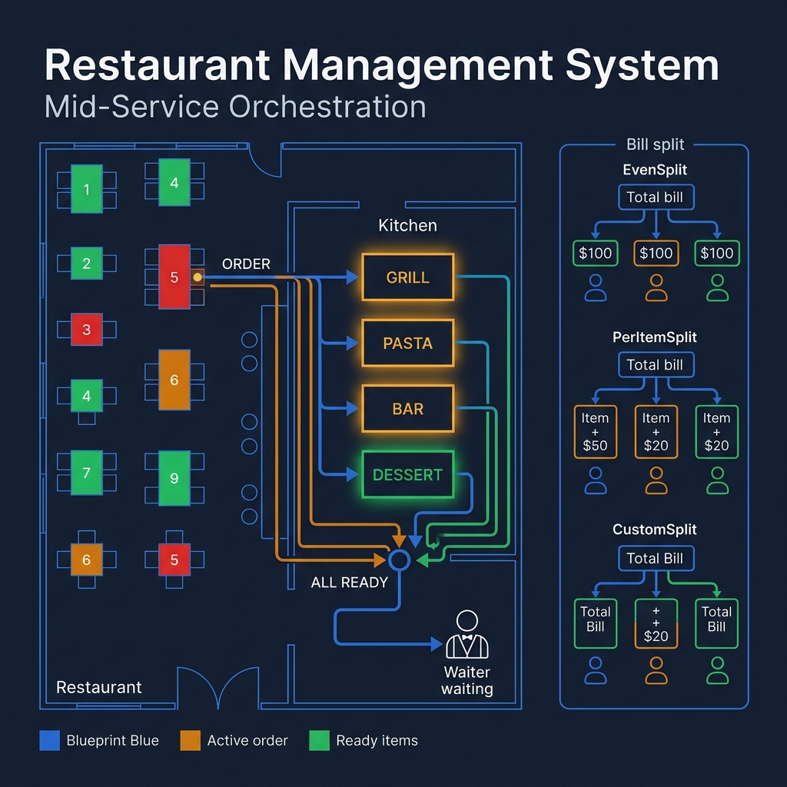
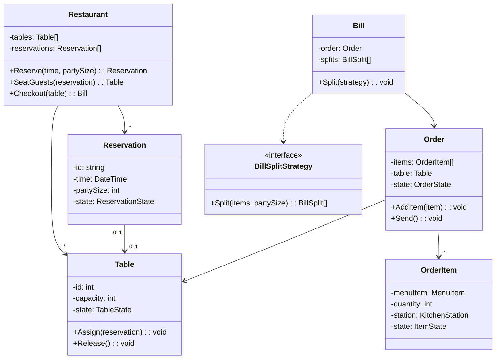
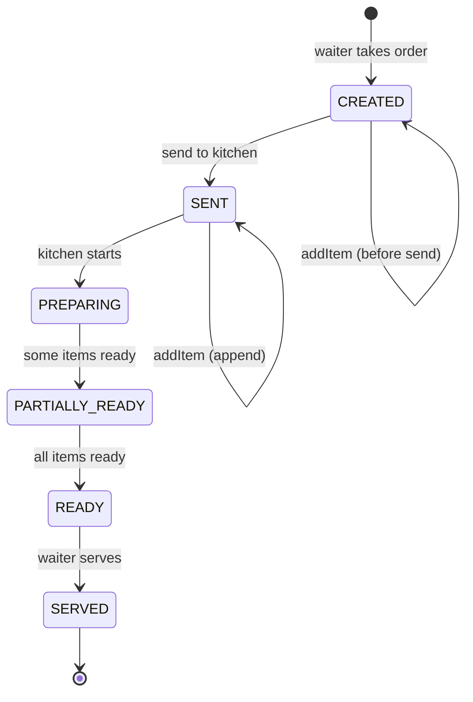

<!-- tags: ood-interview, oop, case-study, restaurant-management -->
# Design a Restaurant Management System

> Multi-entity lifecycle coordination: table reservation, order → kitchen flow, Command pattern for orders, bill splitting.

| Aspect | Detail |
| --- | --- |
| **Difficulty** | ⭐⭐⭐ |
| **Primary patterns** | State, Observer, Strategy, Command |
| **Interview focus** | Multi-entity lifecycle coordination + event-driven kitchen flow + bill strategy |

📅 Created: 2026-04-02 · 🔄 Updated: 2026-04-21 · ⏱️ 22 min read

---

## 1. DEFINE

Customer calls to reserve a table for 4 at 7:00 PM. On arrival, the waiter assigns table #5. Customer orders: 2 Steak Medium-Rare, 1 Pasta, 1 Salad. Kitchen receives the order; bar receives the drink order (in parallel). Steak finishes before Pasta — but should the waiter serve immediately? Or wait until all items are ready?

Then: the customer adds 1 Dessert mid-meal. The original order is already "sent to kitchen" — but dessert is an add-on. Should it append to the existing order or create a new one?

Restaurant management is hard at 3 points:

1. **Multi-entity lifecycle** — Table, Reservation, Order, KitchenTicket — each entity has its own state, synchronized with each other. Table available → reserved → occupied → available. Order created → sent → preparing → ready → served.
2. **Kitchen routing** — order items route to the correct station: grill station for steak, pasta station for pasta, bar for drinks. Parallel preparation, synchronized at serving time.
3. **Bill management** — split bill per person? Per item? Even split? Different payment methods per split?

| Variant | Description | Interview angle |
| --- | --- | --- |
| Core | Reserve, seat, order, kitchen, bill | Multi-entity coordination |
| Follow-up: kitchen station routing | Grill, pasta, dessert stations | Observer / pub-sub |
| Follow-up: bill splitting | Split by person, item, or percentage | Strategy pattern |
| Follow-up: waitlist | No tables available → queue waiting | Queue management, notification |
| Follow-up: order modification | Cancel/modify items after sent | Command pattern with undo |

### Core Objects

| Object | Role | Key Attributes | Key Methods |
| --- | --- | --- | --- |
| `Restaurant` | Coordinator | tables[], reservations[] | `Reserve()`, `SeatGuests()`, `Checkout()` |
| `Table` | Resource | id, capacity, state | `Assign()`, `Release()` |
| `Reservation` | Booking | time, partySize, table, state | `Confirm()`, `Cancel()`, `SeatGuests()` |
| `Order` | Lifecycle | items[], state, table | `AddItem()`, `Send()`, `MarkReady()` |
| `OrderItem` | Line item | menuItem, quantity, station, state | `MarkPreparing()`, `MarkReady()` |
| `Bill` | Accounting | order, splits[], totalAmount | `Split(strategy)`, `Pay(method)` |
| `OrderCommand` | Command | order, action | `Execute()`, `Undo()` |

---

## 2. VISUAL




### Class Diagram



*Restaurant → Table → Reservation is the seating hierarchy. Order links to Table. Bill applies BillSplitStrategy for flexible splitting.*

### Order Lifecycle



*PARTIALLY_READY state enables parallel kitchen work — steak ready but pasta not yet. Waiter serves when ALL items ready.*

---

## 3. CODE

### Problem 1: Basic — Table state + Reservation lifecycle

> **Goal**: Table guards its own state (no double-booking); Reservation tracks lifecycle.
> **Approach**: Table state machine: AVAILABLE → RESERVED → OCCUPIED → AVAILABLE. Reservation links to Table.
> **Example**: `Reserve(7PM, 4 people)` → `Reservation{CONFIRMED}` → `SeatGuests()` → Table OCCUPIED
> **Complexity**: O(T) scan tables for availability

```go
// restaurant.go — Table state + Reservation lifecycle
package restaurant

import (
	"errors"
	"fmt"
	"time"
)

type TableState string

const (
	TableAvailable TableState = "AVAILABLE"
	TableReserved  TableState = "RESERVED"
	TableOccupied  TableState = "OCCUPIED"
)

type Table struct {
	ID       int
	Capacity int
	State    TableState
}

// Assign transitions AVAILABLE/RESERVED → OCCUPIED.
func (t *Table) Assign() error {
	if t.State == TableOccupied {
		return fmt.Errorf("table %d already occupied", t.ID)
	}
	t.State = TableOccupied
	return nil
}

func (t *Table) Reserve() error {
	if t.State != TableAvailable {
		return fmt.Errorf("table %d not available", t.ID)
	}
	t.State = TableReserved
	return nil
}

func (t *Table) Release() {
	t.State = TableAvailable
}

// --- Reservation ---

type ReservationState string

const (
	ResConfirmed ReservationState = "CONFIRMED"
	ResSeated    ReservationState = "SEATED"
	ResCancelled ReservationState = "CANCELLED"
)

type Reservation struct {
	ID        string
	Time      time.Time
	PartySize int
	Table     *Table
	State     ReservationState
}

// SeatGuests transitions CONFIRMED → SEATED, locks table.
func (r *Reservation) SeatGuests() error {
	if r.State != ResConfirmed {
		return fmt.Errorf("reservation %s not confirmed", r.ID)
	}
	if err := r.Table.Assign(); err != nil {
		return err
	}
	r.State = ResSeated
	return nil
}

// --- Restaurant coordinator ---

type Restaurant struct {
	Tables       []*Table
	Reservations []*Reservation
}

// Reserve finds a table that fits and creates reservation.
// ✅ Best-fit: smallest table that fits party size.
func (rest *Restaurant) Reserve(t time.Time, partySize int) (*Reservation, error) {
	var best *Table
	for _, table := range rest.Tables {
		if table.State == TableAvailable && table.Capacity >= partySize {
			if best == nil || table.Capacity < best.Capacity {
				best = table
			}
		}
	}
	if best == nil {
		return nil, errors.New("no available table for party size")
	}
	if err := best.Reserve(); err != nil {
		return nil, err
	}

	res := &Reservation{
		ID:        fmt.Sprintf("R-%d", time.Now().UnixNano()),
		Time:      t,
		PartySize: partySize,
		Table:     best,
		State:     ResConfirmed,
	}
	rest.Reservations = append(rest.Reservations, res)
	return res, nil
}
```

> **Why is Table.Assign() separated from Reservation.SeatGuests()?**
> Table guards its own invariant (no double-occupy). Reservation coordinates flow (check state → assign table → update reservation). If a walk-in guest (no reservation) assigns a table directly, `Table.Assign()` still guards correctly — no Reservation needed.

Table and reservation covered. The core differentiator: how orders flow from waiter to kitchen to table.

### Problem 2: Intermediate — Order flow + kitchen station routing

> **Goal**: Order tracks items, routes to correct kitchen station, tracks per-item readiness.
> **Approach**: OrderItem knows which station processes it. Order tracks overall state based on item states.
> **Example**: `Order([Steak→Grill, Pasta→PastaStation])` → `Send()` → Grill prepares Steak, Pasta station prepares Pasta → both ready → Order READY
> **Complexity**: O(I) per order check, I = items in order

```go
// order_flow.go — Order lifecycle + kitchen routing
package restaurant

type KitchenStation string

const (
	GrillStation   KitchenStation = "GRILL"
	PastaStation   KitchenStation = "PASTA"
	BarStation     KitchenStation = "BAR"
	DessertStation KitchenStation = "DESSERT"
)

type ItemState string

const (
	ItemPending   ItemState = "PENDING"
	ItemPreparing ItemState = "PREPARING"
	ItemReady     ItemState = "READY"
)

type MenuItem struct {
	Name    string
	Price   float64
	Station KitchenStation
}

type OrderItem struct {
	MenuItem MenuItem
	Quantity int
	State    ItemState
}

func (oi *OrderItem) MarkPreparing() error {
	if oi.State != ItemPending {
		return fmt.Errorf("item %s not pending", oi.MenuItem.Name)
	}
	oi.State = ItemPreparing
	return nil
}

func (oi *OrderItem) MarkReady() error {
	if oi.State != ItemPreparing {
		return fmt.Errorf("item %s not preparing", oi.MenuItem.Name)
	}
	oi.State = ItemReady
	return nil
}

// --- Order ---

type OrderState string

const (
	OrderCreated OrderState = "CREATED"
	OrderSent    OrderState = "SENT"
	OrderReady   OrderState = "READY"
	OrderServed  OrderState = "SERVED"
)

type Order struct {
	Items []*OrderItem
	Table *Table
	State OrderState
}

func NewOrder(table *Table) *Order {
	return &Order{Table: table, State: OrderCreated}
}

func (o *Order) AddItem(item MenuItem, qty int) {
	o.Items = append(o.Items, &OrderItem{
		MenuItem: item,
		Quantity: qty,
		State:    ItemPending,
	})
}

// Send routes items to their kitchen stations.
func (o *Order) Send() {
	o.State = OrderSent
	// In production: emit events per station
	// stations["GRILL"].receive(grillItems)
	// stations["PASTA"].receive(pastaItems)
}

// AllReady checks if every item is ready for serving.
// ✅ Waiter serves when ALL items ready — sync point.
func (o *Order) AllReady() bool {
	for _, item := range o.Items {
		if item.State != ItemReady {
			return false
		}
	}
	return true
}

func (o *Order) MarkServed() error {
	if !o.AllReady() {
		return errors.New("not all items ready")
	}
	o.State = OrderServed
	return nil
}
```

> **Why does OrderItem know its station, rather than Order routing?**
> MenuItem defines station (Steak → Grill). When the order is sent, group items by station, dispatch in parallel. If Order does routing, Order must know all station logic — coupled. MenuItem metadata + Order dispatch = decoupled.

Order flow covered. Now the enrichment: bill splitting strategy — the follow-up interviewers love.

### Problem 3: Advanced — BillSplitStrategy

> **Goal**: Split bill flexibly: even, per-item, or custom — without modifying Bill or Order.
> **Approach**: BillSplitStrategy interface. Each strategy calculates how to divide the total.
> **Example**: 4 guests, total $120 → EvenSplit: 4 × $30. PerItemSplit: guest A owes $50 (steak), guest B owes $20 (salad), etc.
> **Complexity**: O(I) per split calculation

```go
// bill_split.go — BillSplitStrategy for flexible splitting
package restaurant

type BillSplit struct {
	GuestName string
	Amount    float64
	Items     []string // item names assigned to this guest
}

// BillSplitStrategy — extension seam for payment splitting.
// ✅ OCP: add CustomSplit by implementing this interface. Zero changes to Bill.
type BillSplitStrategy interface {
	Split(items []*OrderItem, partySize int) []BillSplit
}

// EvenSplitStrategy divides total evenly.
type EvenSplitStrategy struct{}

func (s *EvenSplitStrategy) Split(items []*OrderItem, partySize int) []BillSplit {
	total := 0.0
	for _, item := range items {
		total += item.MenuItem.Price * float64(item.Quantity)
	}
	perPerson := total / float64(partySize)
	splits := make([]BillSplit, partySize)
	for i := range splits {
		splits[i] = BillSplit{
			GuestName: fmt.Sprintf("Guest %d", i+1),
			Amount:    perPerson,
		}
	}
	return splits
}

// PerItemSplitStrategy assigns each item to a specific guest.
type PerItemSplitStrategy struct {
	// ItemAssignment maps item index → guest index
	ItemAssignment map[int]int
}

func (s *PerItemSplitStrategy) Split(items []*OrderItem, partySize int) []BillSplit {
	splits := make([]BillSplit, partySize)
	for i := range splits {
		splits[i] = BillSplit{GuestName: fmt.Sprintf("Guest %d", i+1)}
	}

	for i, item := range items {
		guestIdx, ok := s.ItemAssignment[i]
		if !ok {
			guestIdx = 0 // default to first guest
		}
		cost := item.MenuItem.Price * float64(item.Quantity)
		splits[guestIdx].Amount += cost
		splits[guestIdx].Items = append(splits[guestIdx].Items, item.MenuItem.Name)
	}
	return splits
}

// --- Bill ---

type Bill struct {
	Order  *Order
	Splits []BillSplit
}

// Split applies the given strategy.
// ✅ Strategy pattern — swap EvenSplit → PerItemSplit without modifying Bill.
func (b *Bill) Split(strategy BillSplitStrategy, partySize int) {
	b.Splits = strategy.Split(b.Order.Items, partySize)
}

// Total returns the bill total.
func (b *Bill) Total() float64 {
	total := 0.0
	for _, item := range b.Order.Items {
		total += item.MenuItem.Price * float64(item.Quantity)
	}
	return total
}
```

> **Why Strategy for bill splitting instead of parameters on Bill.Split()?**
> `bill.Split(mode="even")` → switch-case inside Bill → add "per-course" splitting = modify Bill. Strategy interface: implement `PerCourseSplit` → plug in. The interviewer will test this by asking "what if guests want to split appetizers evenly but pay individually for mains?" — you answer: composite strategy that chains EvenSplit for appetizer course + PerItemSplit for main course.

---

## 4. PITFALLS

Restaurant management looks straightforward — until reservation timeout, partial serving, and mid-meal modifications surface.

| # | Severity | Mistake | Consequence | Fix |
| --- | --- | --- | --- | --- |
| 1 | 🔴 Fatal | Reserved table has no timeout | Table locked forever if guest does not show | Reservation timeout 15 min, auto-release |
| 2 | 🔴 Fatal | Serve when only 1 item ready (partial serve) | Guest gets steak but waits 20 min for pasta | `AllReady()` gate before serve (or explicit course-based serving) |
| 3 | 🟡 Common | Kitchen routing hardcoded in Order | Adding station = modifying Order | `MenuItem.Station` metadata, dispatch by grouping |
| 4 | 🟡 Common | Bill does not support splitting | 4 guests, 1 bill → argument about who pays what | BillSplitStrategy: even, per-item, per-person |
| 5 | 🔵 Minor | Walk-in guests have no path | Direct arrival without booking gets rejected | `Table.Assign()` directly bypasses reservation |

---

## 5. REF

| Resource | Type | Link | Note |
| --- | --- | --- | --- |
| ByteByteGo — Restaurant OOD | Course | https://bytebytego.com/courses/object-oriented-design-interview/design-a-restaurant-management-system | Full walkthrough |
| Refactoring Guru — Observer Pattern | Reference | https://refactoring.guru/design-patterns/observer | Kitchen station notification |
| Refactoring Guru — Command Pattern | Reference | https://refactoring.guru/design-patterns/command | Order modification with undo |
| Refactoring Guru — Strategy Pattern | Reference | https://refactoring.guru/design-patterns/strategy | Bill splitting strategy |

---

## 6. RECOMMEND

Restaurant management teaches multi-entity lifecycle coordination — the most complex case study in this series. Next: compare with simpler or orthogonal patterns.

| Next topic | When | Why | File/Link |
| --- | --- | --- | --- |
| [Movie Ticket Booking](./05-movie-ticket-booking.md) | Want to compare reservation pattern | Seat reservation ≈ table reservation | Case study |
| [Grocery Store](./09-grocery-store.md) | Want similar pricing/billing | Cart → Checkout ≈ Order → Bill | Case study |
| [Elevator System](./08-elevator-system.md) | Want different multi-entity coordination | Direction dispatch ≈ kitchen station routing | Case study |

---

## 7. QUICK REF

| If the interviewer asks | Signal | Your answer |
| --- | --- | --- |
| "Guest adds order mid-meal?" | Order mutation | Append items to existing Order, re-send to kitchen |
| "Split bill?" | Payment strategy | BillSplitStrategy: EvenSplit, PerItemSplit, CustomSplit |
| "Kitchen overloaded?" | Queue / throttling | KitchenStation capacity limit, queue excess orders |
| "Waitlist when no tables?" | Queue management | WaitlistQueue with notification when table released |
| "Course-based serving?" | Multi-phase order | OrderCourse enum: Appetizer → Main → Dessert → serve per course |
| "Cancel an item after order sent?" | Command pattern | OrderCommand with `Execute()` / `Undo()`, kitchen notified |

---

**Links**: [← ATM System](./13-atm-system.md) · [→ Foundations](../foundations/README.md)
