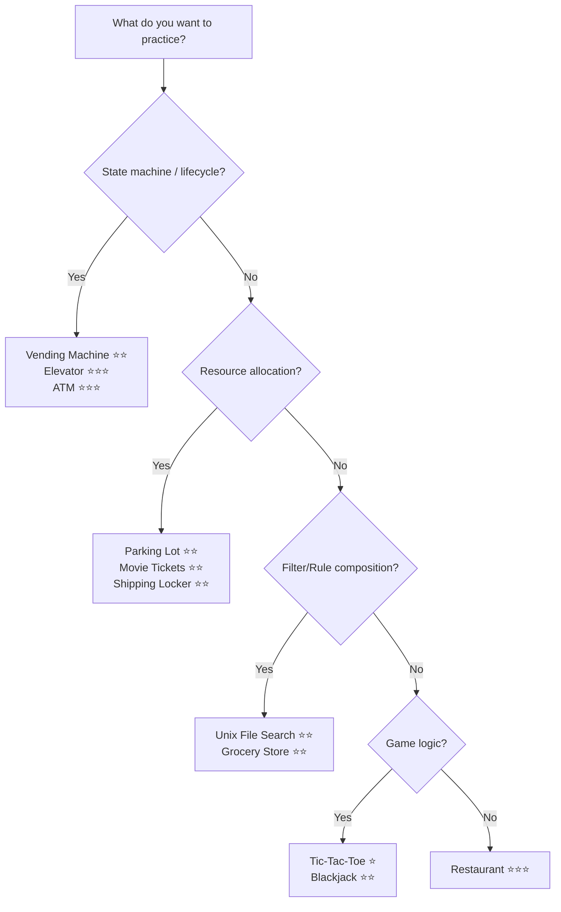

<!-- tags: overview -->
# OOD Case Studies

> Lane for 11 real OOD interview problems — from Parking Lot to Restaurant Management.

| Aspect | Detail |
| --- | --- |
| **Concept** | Decision router for OOD Case Studies |
| **Audience** | Engineers who have the framework and need practice on real prompts |
| **Entry point** | Open when you are ready to practice |

📅 Created: 2026-04-02 · 🔄 Updated: 2026-04-21 · ⏱️ 4 min read

---

## Routing Map — Pick by pattern you want to practice



## Decision Table

| Want to practice | Problem | Difficulty | Primary pattern |
| --- | --- | --- | --- |
| Basic state machine | [Vending Machine](07-vending-machine.md) | ⭐⭐ | State |
| Resource allocation + ticket lifecycle | [Parking Lot](04-parking-lot.md) | ⭐⭐ | State, Strategy, Factory |
| Concurrent booking + temporal state | [Movie Ticket Booking](05-movie-ticket-booking.md) | ⭐⭐ | State, Observer |
| Filter composition + tree traversal | [Unix File Search](06-unix-file-search.md) | ⭐⭐ | Composite, Strategy |
| Multi-entity state coordination | [Elevator System](08-elevator-system.md) | ⭐⭐⭐ | State, Strategy, Observer |
| Pricing rules composition | [Grocery Store](09-grocery-store.md) | ⭐⭐ | Strategy, Composite |
| Board state + O(1) win detection | [Tic-Tac-Toe](10-tic-tac-toe.md) | ⭐ | State |
| Card evaluation + dealer AI | [Blackjack](11-blackjack.md) | ⭐⭐ | State, Strategy |
| Size matching + OTP access | [Shipping Locker](12-shipping-locker.md) | ⭐⭐ | Strategy, State |
| Transaction atomicity + denomination | [ATM System](13-atm-system.md) | ⭐⭐⭐ | State, Chain of Responsibility |
| Multi-entity lifecycle + kitchen routing | [Restaurant Management](14-restaurant-management.md) | ⭐⭐⭐ | State, Observer, Command |

---

## Suggested Learning Paths

### Path A: First-time OOD Practice
```
Parking Lot (⭐⭐) → Vending Machine (⭐⭐) → Elevator (⭐⭐⭐)
```
State machine complexity ramps up: single-direction → pure state → multi-entity.

### Path B: Resource + Booking Systems
```
Parking Lot (⭐⭐) → Movie Tickets (⭐⭐) → Shipping Locker (⭐⭐)
```
Resource allocation + lifecycle: spot → seat → locker.

### Path C: Game Design
```
Tic-Tac-Toe (⭐) → Blackjack (⭐⭐)
```
Board/card game: state detection → evaluation algorithm.

### Path D: Full Stack Interview Prep
```
Parking Lot → Elevator → ATM → Restaurant
```
Covers all major patterns: State, Strategy, Observer, Chain of Responsibility, Command.

---

**Links**: [← OOD Interview](../README.md) · [→ Foundations](../foundations/README.md)
