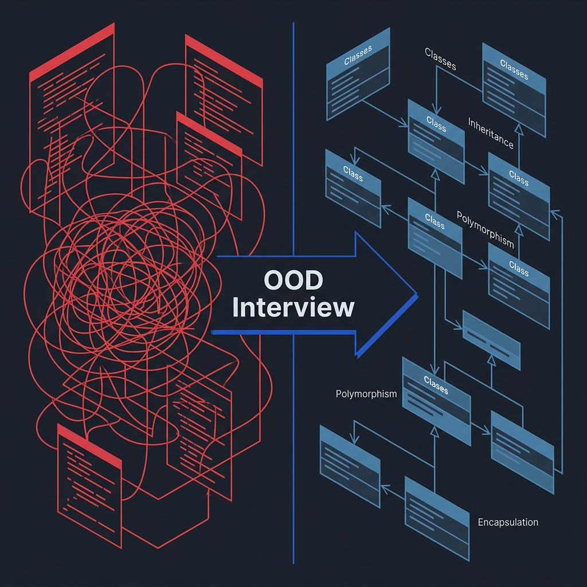
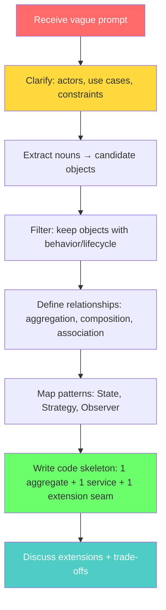
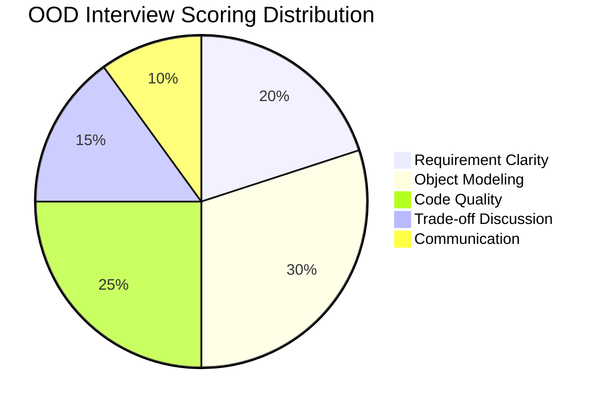

<!-- tags: ood-interview, oop, interview -->
# What Is an OOD Interview?

> OOD interviews measure your ability to turn a vague requirement into a clear object model, justify trade-offs, and produce an extensible code skeleton — all within 35–45 minutes.

| Aspect | Detail |
| --- | --- |
| **Type** | Interview foundation |
| **Audience** | Intermediate → Senior engineer |
| **Primary skill** | Requirement clarification + object modeling |

📅 Created: 2026-04-02 · 🔄 Updated: 2026-04-21 · ⏱️ 14 min read

---

## 1. DEFINE




Round 3 of the interview loop. The interviewer slides a prompt across: "Design a parking lot system." No spec, no wireframe, no acceptance criteria. The clock is ticking: 45 minutes.

You think: "Easy — Car, Spot, ParkingLot." You sketch a class diagram. Ten minutes later, the interviewer fires: "What if a truck takes two spots?" — "Pricing by hour or by block?" — "How does the system handle concurrent entry?" The design you sketched at minute one is now being demolished.

An OOD interview **does not** look for a single correct algorithm. It evaluates how you:

- **Clarify** requirements — ask about scope, actors, and edge cases BEFORE drawing your first class
- **Model** the right objects — distinguish entity vs value object vs service, pick the right aggregate
- **Defend** trade-offs — why composition instead of inheritance, why Strategy instead of switch
- **Extend** under pressure — add features without breaking the existing design

| Interviewer measures | Signal | Fail signal |
| --- | --- | --- |
| Requirement clarity | You ask about actors, use cases, constraints | Jump straight into class diagram |
| Modeling depth | Entity guards invariants, service only coordinates | God service does everything |
| OOP quality | Clear encapsulation, polymorphism with purpose | Inheritance "because it looks more OOP" |
| Extensibility | Add new policy/state without changing core | Hardcode every rule in a switch |
| Communication | Explain *why* before *what* | Code silently without discussing trade-offs |

### Invariants

- Do not model every noun as a class — keep only objects with **behavior** or a distinct **lifecycle**
- Entity guards its own invariants, not pushed into a service
- Interview answers prioritize **readability** over cleverness

### Failure Modes

- Dropping pattern names (Strategy, Observer, State) before requirements are clear → interviewer hears buzzwords
- Inheritance "just because OOP" → fragile base class when extending
- God service holding all business rules → "where would you add the next feature?" → silence

Those failure modes sound familiar. But here is the real trap: jumping into code before clarifying requirements means your design heads in the wrong direction from minute one. That trap surfaces again in PITFALLS.

---

## 2. VISUAL

The concept is clear. The visual below maps the full OOD answer flow from start to finish — skip any step and the interviewer will steer you back.

### OOD Interview Flow



*Red = ambiguity, Yellow = clarifying, Green = building, Teal = defending. Follow this order and the interview answer stays coherent.*

### What the Interviewer Actually Scores



*Object Modeling + Code Quality = 55% of the score. Requirement Clarity is the gate — fail here and the entire design solves the wrong problem.*

The scoring breakdown reveals something non-obvious: modeling and code carry over half the weight, but neither matters if you clarified the wrong scope. Code below shows how to turn those proportions into a concrete answer.

---

## 3. CODE

### Problem 1: Basic — Extract core objects from a prompt

> **Goal**: Turn the prompt "Design a parking lot" into object candidates with clear roles.
> **Approach**: Noun extraction → filter by behavior/lifecycle → classify (entity, service, value object).
> **Example**: "Parking lot" prompt → ParkingLot (aggregate), Spot (resource), Ticket (lifecycle), Vehicle (value object)
> **Complexity**: O(n) mental steps

```go
// ood_extraction.go — Extract core objects from prompt
package ood

import "fmt"

// ✅ Step 1: Identify nouns → candidate objects
// ✅ Step 2: Keep only objects with behavior OR lifecycle
// ✅ Step 3: Classify: entity (state), service (coordinate), value object (immutable)

// Entity — has state + lifecycle + invariants
type Ticket struct {
	ID    string
	State string // ACTIVE → PAID → EXITED
}

// MarkPaid transitions ACTIVE → PAID.
// ⚠️ Guard: only ACTIVE tickets can be paid — prevents double-payment.
func (t *Ticket) MarkPaid() error {
	if t.State != "ACTIVE" {
		return fmt.Errorf("invalid transition from %s", t.State)
	}
	t.State = "PAID"
	return nil
}

// Value Object — immutable, no lifecycle
type Vehicle struct {
	Plate string
	Type  string // "sedan", "truck"
}

// Service — coordinates entities, holds no state
type ParkingService struct{}

func (s *ParkingService) Park(v Vehicle, spot *Spot) (*Ticket, error) {
	if err := spot.Assign(&v); err != nil {
		return nil, err
	}
	return &Ticket{ID: "T-1", State: "ACTIVE"}, nil
}
```

> **Why is Vehicle a value object, not an entity?**
> Vehicle has no lifecycle within the parking lot context — it enters, it exits, its state doesn't change. The plate number is an identifier, but the parking lot doesn't manage the vehicle's lifecycle. Ticket is the entity with a lifecycle (ACTIVE → PAID → EXITED). Stating this distinction clearly in an interview earns you points.

Object extraction sets the foundation. But knowing *what* to extract is only half the battle — the harder question is *how to reuse behavior* without creating a fragile hierarchy. That's where composition enters.

### Problem 2: Intermediate — Composition over inheritance

> **Goal**: Show the interviewer when to use composition instead of inheritance, and why.
> **Approach**: Policy interface instead of base class. Behavior swap at runtime.
> **Example**: `CheckoutService` uses `PricingPolicy` — swap Hourly ↔ Block without modifying the service.
> **Complexity**: O(1) — strategy swap

```go
// composition_vs_inheritance.go — Why composition > inheritance in OOD interview
package ood

import "time"

// ❌ Inheritance approach — fragile base class
// type BasePricing struct { Rate float64 }
// type HourlyPricing struct { BasePricing }
// type BlockPricing struct { BasePricing; BlockSize int }
// → Add WeekendPricing? Inherit from BasePricing or HourlyPricing? Diamond problem.

// ✅ Composition approach — policy interface
type PricingPolicy interface {
	Calculate(entry, exit time.Time) float64
}

type HourlyPricing struct {
	Rate float64
}

func (h *HourlyPricing) Calculate(entry, exit time.Time) float64 {
	hours := exit.Sub(entry).Hours()
	return hours * h.Rate
}

type BlockPricing struct {
	Rate       float64
	BlockHours float64
}

func (b *BlockPricing) Calculate(entry, exit time.Time) float64 {
	hours := exit.Sub(entry).Hours()
	blocks := int(hours/b.BlockHours) + 1
	return float64(blocks) * b.Rate
}

// CheckoutService doesn't know which pricing — just calls the interface.
// ✅ OCP: add WeekendPricing by implementing PricingPolicy. Zero changes here.
type CheckoutService struct {
	Pricing PricingPolicy // ← injected, not inherited
}

func (cs *CheckoutService) Checkout(entry, exit time.Time) float64 {
	return cs.Pricing.Calculate(entry, exit)
}
```

> **Why does composition win in interviews?**
> When the interviewer asks "add weekend pricing?" — inheritance leads to "I create WeekendPricing extends HourlyPricing" → "but weekend pricing has a different block size?" → stuck. Composition leads to "I implement the PricingPolicy interface" → done. Composition satisfies OCP + DIP + testability in a single answer.

---

## 4. PITFALLS

Code looks clean on a whiteboard. But interview failures usually come from what you *forgot to model* before the interviewer asked about it.

| # | Severity | Mistake | Consequence | Fix |
| --- | --- | --- | --- | --- |
| 1 | 🔴 Fatal | Jump into code, skip requirement clarification | Design solves the wrong problem — 20 min wasted | Spend 3–5 min asking about actors, use cases, constraints |
| 2 | 🔴 Fatal | Over-model: every noun becomes a class | 20 classes on the board, interviewer is lost | Keep only objects with behavior/lifecycle — the rest are attributes |
| 3 | 🟡 Common | Drop pattern names as buzzwords | "I use Strategy" without explaining why | Tie pattern to problem: "pricing changes → Strategy" |
| 4 | 🟡 Common | Inheritance instead of composition | Fragile base class when extending | Composition + interface: swap behavior, not hierarchy |
| 5 | 🔵 Minor | Code is too production-ready | Time lost on error handling, logging | Interview code proves design, not production readiness |

---

## 5. REF

| Resource | Type | Link | Note |
| --- | --- | --- | --- |
| ByteByteGo — OOD Interview | Course | https://bytebytego.com/courses/object-oriented-design-interview | Full course |
| Grokking OOD | Course | https://www.educative.io/courses/grokking-the-object-oriented-design-interview | Pattern-based approach |
| Refactoring Guru | Reference | https://refactoring.guru/design-patterns | Pattern catalog |

---

## 6. RECOMMEND

Now you know what OOD interviews measure. Next step: the 7-step framework to structure your answer within 30–40 minutes.

| Next topic | When | Why | File/Link |
| --- | --- | --- | --- |
| [Interview Framework](./02-interview-framework.md) | Now — before practicing case studies | 7 steps keep you on track under pressure | Foundation |
| [OOP Fundamentals](./03-oop-fundamentals.md) | When you need defense vocabulary | Encapsulation, polymorphism, SOLID for interview justification | Foundation |
| [Parking Lot](../case-studies/04-parking-lot.md) | When you want to apply immediately | First problem to practice — simple enough to focus on process | Case study |

---

## 7. QUICK REF

| Signal | Quick action |
| --- | --- |
| Vague prompt, multiple actors | Ask use case + lifecycle BEFORE modeling |
| Multiple rules change by context | Strategy / policy interface |
| Extension is certain in the future | Interface + composition, NOT inheritance |
| Interviewer asks "why X?" | Answer with trade-off: "X because A, alternative Y because B, but A matters more here" |

---

**Links**: [← Foundations](./README.md) · [→ Interview Framework](./02-interview-framework.md)
