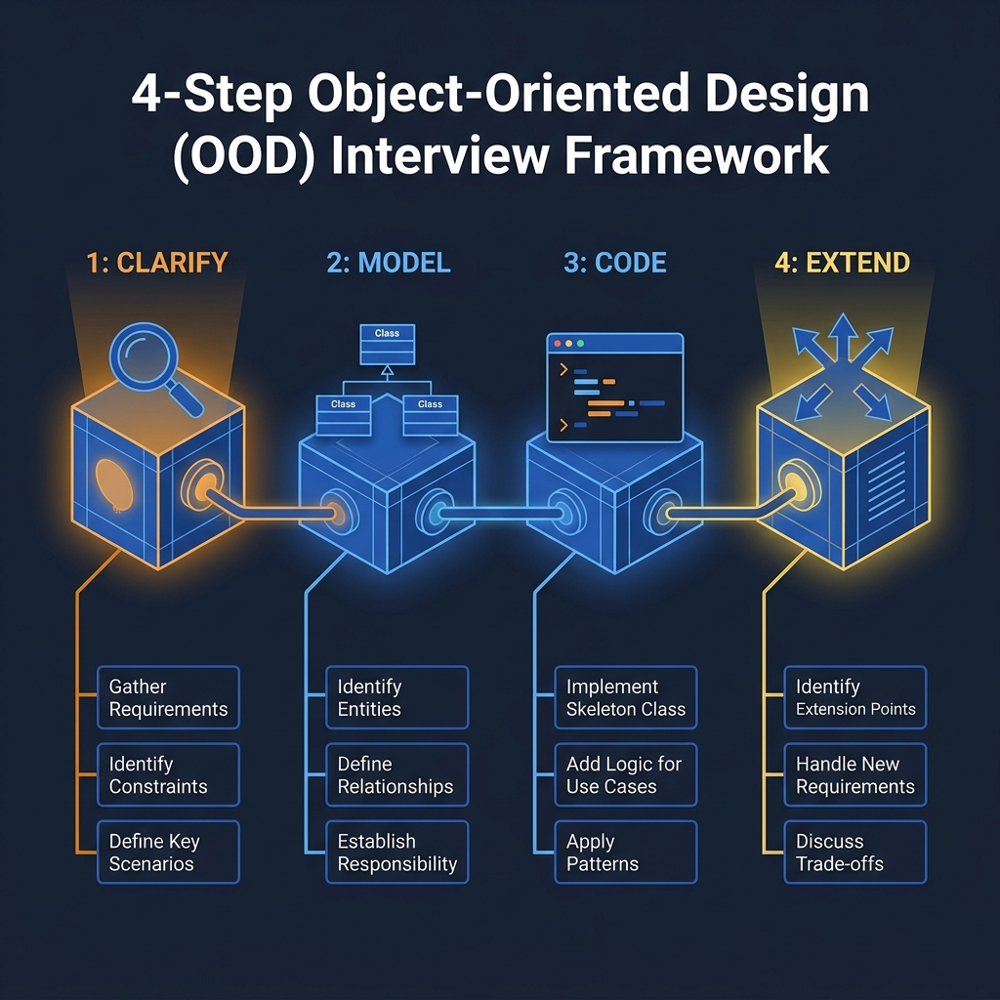
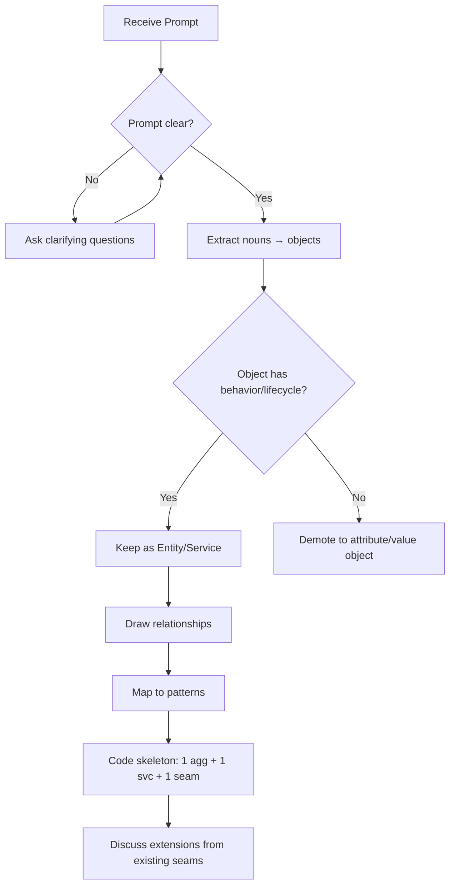

<!-- tags: ood-interview, oop, framework -->
# A Framework for the OOD Interview

> A 7-step framework that turns a vague prompt into a structured answer within 30–40 minutes.

| Aspect | Detail |
| --- | --- |
| **Type** | Framework |
| **Use case** | When you need a structured answer within 30–40 minutes |
| **Output** | Class diagram + code skeleton + extension notes |

📅 Created: 2026-04-02 · 🔄 Updated: 2026-04-21 · ⏱️ 17 min read

---

## 1. DEFINE

Fifteen minutes into the interview, you are still drawing class number eight on the whiteboard. The interviewer gently says: "Show me some code." You haven't written a single line. Fifteen minutes left for 40% of the score (code + trade-offs) — barely enough.

A framework keeps you **allocating time correctly** under pressure:

| Step | Time | Core question | Deliverable |
| --- | --- | --- | --- |
| 1. Clarify | 3–5 min | What problem am I solving? Actors? Scope? | Requirements locked |
| 2. Core Objects | 3–5 min | Which objects have their own lifecycle/behavior? | Entity list |
| 3. Relationships | 3–5 min | Association, aggregation, composition? | Relationship map |
| 4. Patterns | 2–3 min | State? Strategy? Observer? Why? | Pattern justification |
| 5. UML Sketch | 3–5 min | Minimal diagram that shows the design? | Class diagram |
| 6. Code Skeleton | 10–15 min | Which code proves the design? | Working skeleton |
| 7. Extensions | 3–5 min | Scale? New feature? Failure? | Trade-off notes |

### Decision Rules

- **Always** lock functional scope before diving into non-functional concerns
- Code skeleton only needs to **prove the design** — 1 aggregate + 1 service + 1 extension seam
- Extension discussion must **stay anchored to the current design** — only discuss extensions from seams that already exist

### Failure Modes

- Framework too rigid → cannot adapt when the interviewer skips a step
- Framework too loose → lose focus, ramble
- Skip step 1 (clarify) → beautiful design that solves the wrong problem → fail

A framework is a tool that must adapt. The trap: being rigid when the interviewer has already changed direction. See PITFALLS.

---

## 2. VISUAL




### Time Budget

```mermaid
gantt
    title OOD Interview — 35 min time budget
    dateFormat mm
    axisFormat %M min

    section Clarify
    Requirements     :a1, 00, 5m
    section Model
    Core Objects     :a2, after a1, 5m
    Relationships    :a3, after a2, 3m
    Patterns         :a4, after a3, 3m
    section Build
    UML Sketch       :a5, after a4, 4m
    Code Skeleton    :crit, a6, after a5, 12m
    section Defend
    Extensions       :a7, after a6, 3m
```



*Code Skeleton (critical path) takes 35% of the time. Clarify + Model = 45%. Extensions come last.*

### Framework Decision Flow



*Loop: "prompt clear?" — if not, keep asking. Object filter: behavior/lifecycle → keep, else → attribute.*

The flow shows where decisions happen. Code below shows what each decision looks like in practice.

---

## 3. CODE

### Problem 1: Basic — Clarify step: structured requirement extraction

> **Goal**: Turn 3–5 min clarify into structured output instead of random questions.
> **Approach**: Checklist: actors → use cases → constraints → failure cases → scale.
> **Example**: ATM prompt → actors (customer, bank) → use cases (withdraw, deposit, check balance)
> **Complexity**: O(1) — structured mental exercise

```go
// clarity_step.go — Structured requirement extraction
package framework

// ClarifyChecklist — 5 mandatory questions before modeling.
// ⚠️ If Actors or UseCases is empty, you don't have enough info to start.
type ClarifyChecklist struct {
	Actors      []string // "customer", "bank", "admin"
	UseCases    []string // "withdraw", "deposit", "check balance"
	Constraints []string // "PIN 3 attempts", "session timeout 2min"
	Failures    []string // "dispenser jam", "insufficient balance"
	Scale       string   // "single ATM" or "1000 ATMs"
}

func NewClarifyChecklist(prompt string) *ClarifyChecklist {
	return &ClarifyChecklist{} // populated during interview
}

// HasMinimumClarity returns true when enough info to start modeling.
func (c *ClarifyChecklist) HasMinimumClarity() bool {
	return len(c.Actors) > 0 && len(c.UseCases) > 0
}
```

> **Why a structured checklist instead of free-form questions?**
> Free-form leads to random gaps — you miss actors or constraints. A 5-dimension checklist guarantees coverage. The interviewer sees a systematic approach, not "asking questions for the sake of it."

Clarify gives you scope. But scope alone doesn't build code — the next step bridges notes on the whiteboard into a skeleton the interviewer can review.

### Problem 2: Intermediate — From objects to code skeleton (step 6)

> **Goal**: Turn UML notes into a code skeleton that proves the design within 10–15 min.
> **Approach**: 1 aggregate (entity with invariants) + 1 service (orchestrator) + 1 interface (extension seam).
> **Example**: ATM → Account (aggregate), WithdrawService (orchestrator), Dispenser (interface)
> **Complexity**: O(1) — skeleton, not full implementation

```go
// skeleton_pattern.go — The "1 + 1 + 1" skeleton pattern
package framework

import "fmt"

// 1. Aggregate: entity with invariants
type Account struct {
	ID      string
	Balance float64
}

// Debit guards the "no negative balance" invariant.
// ⚠️ Lives in the entity, not in the service — any caller goes through this guard.
func (a *Account) Debit(amount float64) error {
	if amount > a.Balance {
		return fmt.Errorf("insufficient: %.2f < %.2f", a.Balance, amount)
	}
	a.Balance -= amount
	return nil
}

// 2. Interface: extension seam for future changes
type Dispenser interface {
	Dispense(amount float64) error
}

// 3. Service: thin orchestration — no business logic
type WithdrawService struct {
	dispenser Dispenser // ← injected
}

// Execute coordinates debit → dispense. Rollback on dispense failure.
func (ws *WithdrawService) Execute(acct *Account, amount float64) error {
	if err := acct.Debit(amount); err != nil {
		return err
	}
	if err := ws.dispenser.Dispense(amount); err != nil {
		acct.Balance += amount // rollback
		return err
	}
	return nil
}
```

> **Why "1 + 1 + 1" instead of full class diagram in code?**
> Fifteen minutes is not enough for 10 classes. One aggregate proves domain modeling. One service proves orchestration. One interface proves extensibility. Three things cover 70% of scoring criteria.

---

## 4. PITFALLS

| # | Severity | Mistake | Consequence | Fix |
| --- | --- | --- | --- | --- |
| 1 | 🔴 Fatal | Skip clarify step entirely | Beautiful design, wrong scope | 3–5 min first: actors, use cases, constraints |
| 2 | 🔴 Fatal | UML takes 15 min, code gets 5 min | Interviewer sees diagram but no code | UML just enough — 3–5 min max |
| 3 | 🟡 Common | Framework too rigid | You keep talking step 3, interviewer wants code | Listen + adapt, framework is a guide not a script |
| 4 | 🟡 Common | Extension brainstorming | "We could add ML, blockchain, distributed..." | Only discuss extensions from existing seams |
| 5 | 🔵 Minor | Skip pattern naming | Interviewer doesn't know you recognize patterns | Name explicitly: "this is State pattern because..." |

---

## 5. REF

| Resource | Type | Link | Note |
| --- | --- | --- | --- |
| ByteByteGo — OOD Interview | Course | https://bytebytego.com/courses/object-oriented-design-interview | Framework reference |
| Designing Data-Intensive Applications | Book | https://dataintensive.net/ | Trade-off thinking |

---

## 6. RECOMMEND

Framework is in hand. Next: OOP vocabulary to defend your design, or jump straight into a case study.

| Next topic | When | Why | File/Link |
| --- | --- | --- | --- |
| [OOP Fundamentals](./03-oop-fundamentals.md) | Need vocabulary defense | Encapsulation, polymorphism, SOLID for justification | Foundation |
| [Parking Lot](../case-studies/04-parking-lot.md) | Want to apply framework now | Simplest problem — focus on process | Case study |
| [ATM System](../case-studies/13-atm-system.md) | Want transaction depth | Session + transaction + dispensing | Case study |

---

## 7. QUICK REF

| Step | Quick checklist | Time |
| --- | --- | --- |
| 1. Clarify | actors, use cases, constraints, failures, scale | 3–5 min |
| 2. Objects | nouns → filter by behavior/lifecycle → entity/service/VO | 3–5 min |
| 3. Code | 1 aggregate + 1 service + 1 interface | 10–15 min |
| 4. Extensions | only from seams that already exist | 3–5 min |

---

**Links**: [← What Is OOD Interview](./01-what-is-ood-interview.md) · [→ OOP Fundamentals](./03-oop-fundamentals.md)
