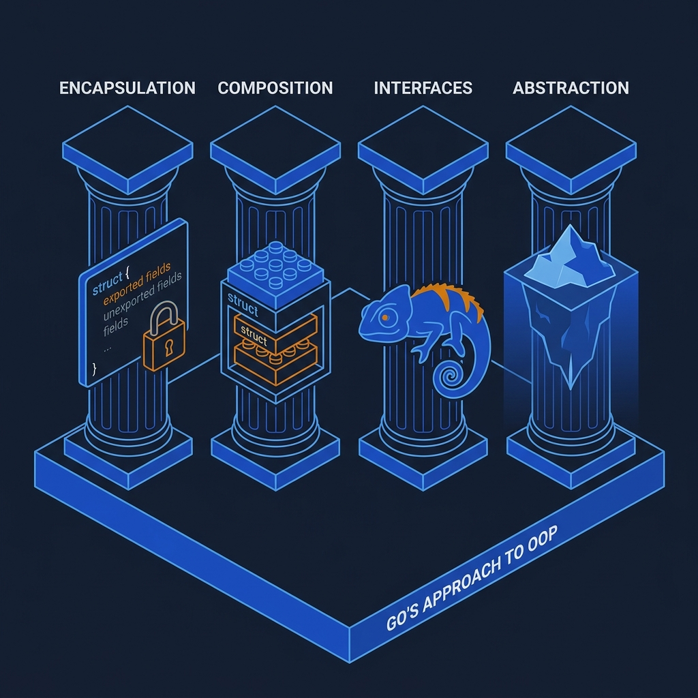
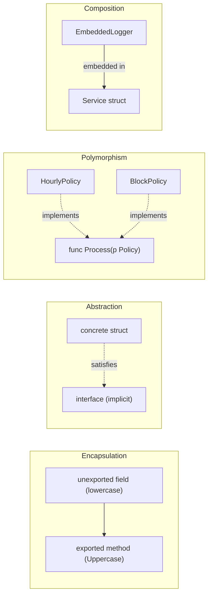
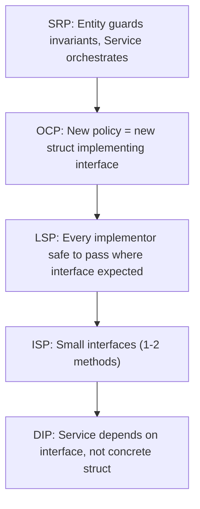

<!-- tags: ood-interview, oop, fundamentals -->
# OOP Fundamentals for Interviews

> The 5 defense pillars (Encapsulation, Abstraction, Polymorphism, Composition, SOLID) that let you justify design decisions under pressure.

| Aspect | Detail |
| --- | --- |
| **Type** | Foundation — defense vocabulary |
| **Use case** | When the interviewer asks "why this design?" |
| **Primary skill** | Justifying trade-offs with OOP principles |

📅 Created: 2026-04-02 · 🔄 Updated: 2026-04-21 · ⏱️ 15 min read

---

## 1. DEFINE

You drew a clean class diagram. The interviewer points at one method: "Why is this private?" You freeze — the answer is "encapsulation," but saying that alone sounds empty. The follow-up: "What would break if I made it public?" You need a concrete answer.

OOP fundamentals in an interview are not about textbook definitions. They are **defense vocabulary** — precise terms that explain *why* your design protects invariants, enables extension, and separates concerns.

### The 5 Pillars — Interview Edition

| Pillar | Textbook definition | Interview defense |
| --- | --- | --- |
| **Encapsulation** | Bundle data + methods, hide internals | "This field is private so external code can't break the invariant" |
| **Abstraction** | Expose interface, hide complexity | "Caller sees `Checkout()`, doesn't know which pricing strategy runs" |
| **Polymorphism** | Same interface, different behavior | "Adding `WeekendPricing` requires zero changes in `CheckoutService`" |
| **Composition** | Build complex from simple, at runtime | "Inject pricing policy instead of inheriting — swap at runtime" |
| **SOLID** | 5 design principles | "SRP: entity guards its invariants, service only orchestrates" |

### Go-Specific Differences

Go has no classes, no inheritance, no constructors. The pillars translate differently:

| OOP concept | Go equivalent |
| --- | --- |
| Class | Struct + methods |
| Inheritance | Embedding (not inheritance!) |
| Interface | Implicit — no `implements` keyword |
| Constructor | `NewXxx()` factory function |
| Private | Lowercase first letter |

### Failure Modes

- Using inheritance terminology ("extends", "overrides") in Go context → interviewer wonders if you know Go
- SOLID as checklist → rattling off "this follows SRP, OCP, LSP..." without tying to the actual design
- Encapsulation = "make everything private" → interviewer asks "but this field needs to be read externally" → stuck

The concepts have sharp edges in Go. The visual below maps how each pillar manifests in Go's type system.

---

## 2. VISUAL




### OOP Pillars in Go



*Go achieves OOP through struct + interface + embedding — no class keyword, no inheritance chain.*

### SOLID at a Glance



*Follow the chain: SRP sets boundary → OCP opens extension → LSP verifies safety → ISP keeps interfaces small → DIP wires dependencies.*

Concepts mapped. Now let's see how each pillar becomes Go code that survives interviewer questions.

---

## 3. CODE

### Problem 1: Basic — Encapsulation: guarding invariants

> **Goal**: Show encapsulation as invariant protection, not just "private fields."
> **Approach**: Account struct with unexported balance, exported Debit method that guards the invariant.
> **Example**: `acct.Debit(500)` on balance 300 → error, balance unchanged.
> **Complexity**: O(1)

```go
// encapsulation.go — Encapsulation protects invariants
package oop

import "fmt"

type Account struct {
	id      string  // unexported — external code can't change ID
	balance float64 // unexported — only Debit/Credit can change balance
}

func NewAccount(id string, initialBalance float64) *Account {
	return &Account{id: id, balance: initialBalance}
}

// Debit enforces the "no negative balance" invariant.
// ✅ Interview answer: "balance is unexported so no caller can set it to -100 directly.
//    All mutations go through Debit/Credit which enforce the invariant."
func (a *Account) Debit(amount float64) error {
	if amount <= 0 {
		return fmt.Errorf("amount must be positive: got %.2f", amount)
	}
	if amount > a.balance {
		return fmt.Errorf("insufficient: balance %.2f < amount %.2f", a.balance, amount)
	}
	a.balance -= amount
	return nil
}

// Balance exposes a read-only view — unexported field, exported getter.
func (a *Account) Balance() float64 {
	return a.balance
}
```

> **Why unexported field + exported method instead of exported field?**
> If `Balance` were exported (`account.Balance = -100`), any caller can break the invariant. The unexported field forces all mutations through guarded methods. This is the encapsulation argument interviewers want to hear.

Encapsulation guards a single object. But real systems have multiple objects collaborating — the next problem shows how polymorphism enables collaboration without tight coupling.

### Problem 2: Intermediate — Polymorphism + Strategy: swap behavior at runtime

> **Goal**: Show polymorphism as "add new behavior without changing existing code."
> **Approach**: Interface for pricing, multiple implementations, injected into service.
> **Example**: `CheckoutService` uses `PricingPolicy` — swap Hourly ↔ Block without modifying the service.
> **Complexity**: O(1) per checkout

```go
// polymorphism.go — Strategy via interface: add behavior without changing callers
package oop

import "time"

// PricingPolicy — the extension seam.
// ✅ ISP: one method. Any struct that calculates price satisfies this.
type PricingPolicy interface {
	Calculate(entry, exit time.Time) float64
}

// HourlyPricing — charges per hour
type HourlyPricing struct {
	RatePerHour float64
}

func (h *HourlyPricing) Calculate(entry, exit time.Time) float64 {
	hours := exit.Sub(entry).Hours()
	if hours < 1 {
		hours = 1 // minimum 1 hour
	}
	return hours * h.RatePerHour
}

// BlockPricing — charges per block of N hours
type BlockPricing struct {
	RatePerBlock float64
	BlockHours   float64
}

func (b *BlockPricing) Calculate(entry, exit time.Time) float64 {
	hours := exit.Sub(entry).Hours()
	blocks := int(hours/b.BlockHours) + 1
	return float64(blocks) * b.RatePerBlock
}

// CheckoutService — depends on interface, not concrete.
// ✅ OCP: add WeekendPricing by implementing PricingPolicy. Zero changes here.
// ✅ DIP: service depends on abstraction (PricingPolicy), not on HourlyPricing directly.
type CheckoutService struct {
	pricing PricingPolicy
}

func NewCheckoutService(p PricingPolicy) *CheckoutService {
	return &CheckoutService{pricing: p}
}

func (cs *CheckoutService) Checkout(entry, exit time.Time) float64 {
	return cs.pricing.Calculate(entry, exit)
}
```

> **Why interface injection instead of switch/case?**
> Switch-case pricing means every new pricing type requires modifying `CheckoutService` — violates OCP. Interface injection means new pricing = new struct, zero changes to the service. In an interview, this is the cleanest way to demonstrate "extensible design."

---

## 4. PITFALLS

| # | Severity | Mistake | Consequence | Fix |
| --- | --- | --- | --- | --- |
| 1 | 🔴 Fatal | Use inheritance terminology in Go | "extends", "overrides" → interviewer doubts Go knowledge | Use "embedding", "satisfies interface", "composition" |
| 2 | 🔴 Fatal | SOLID as checklist without anchoring | "This follows SRP, OCP, LSP..." sounds robotic | Tie to design: "SRP means Account guards balance, Service orchestrates" |
| 3 | 🟡 Common | Encapsulation = "everything unexported" | Interviewer asks "but I need to read the balance" → stuck | Unexported field + exported getter/method is the pattern |
| 4 | 🟡 Common | Large interface (5+ methods) | Violates ISP, hard to mock in tests | Go convention: 1-2 methods per interface |
| 5 | 🔵 Minor | Embedding confused with inheritance | "Account inherits from BaseEntity" — wrong in Go | Embedding promotes methods but is composition, not inheritance |

---

## 5. REF

| Resource | Type | Link | Note |
| --- | --- | --- | --- |
| Effective Go | Official | https://go.dev/doc/effective_go | Interfaces, embedding |
| Go by Example | Tutorial | https://gobyexample.com/interfaces | Interface patterns |
| Refactoring Guru — SOLID | Reference | https://refactoring.guru/solid | Principle catalog |

---

## 6. RECOMMEND

You now have the defense vocabulary. Next step: apply it to a real problem.

| Next topic | When | Why | File/Link |
| --- | --- | --- | --- |
| [Parking Lot](../case-studies/04-parking-lot.md) | Ready to practice | Simplest case study — focus on applying encapsulation + strategy | Case study |
| [Elevator System](../case-studies/08-elevator-system.md) | Want state machine challenge | Multi-entity state coordination — tests polymorphism under pressure | Case study |

---

## 7. QUICK REF

| Pillar | Interview one-liner | Go mechanism |
| --- | --- | --- |
| Encapsulation | "Unexported field → only guarded methods can mutate" | lowercase field + Uppercase method |
| Abstraction | "Caller sees interface, not implementation" | `interface{}` with 1-2 methods |
| Polymorphism | "New behavior = new struct, zero changes to callers" | Implicit interface satisfaction |
| Composition | "Inject dependency, don't inherit" | Struct embedding + interface injection |
| SOLID | "Entity guards invariants, service orchestrates" | SRP + OCP + DIP via interfaces |

---

**Links**: [← Interview Framework](./02-interview-framework.md) · [→ Case Studies](../case-studies/README.md)
