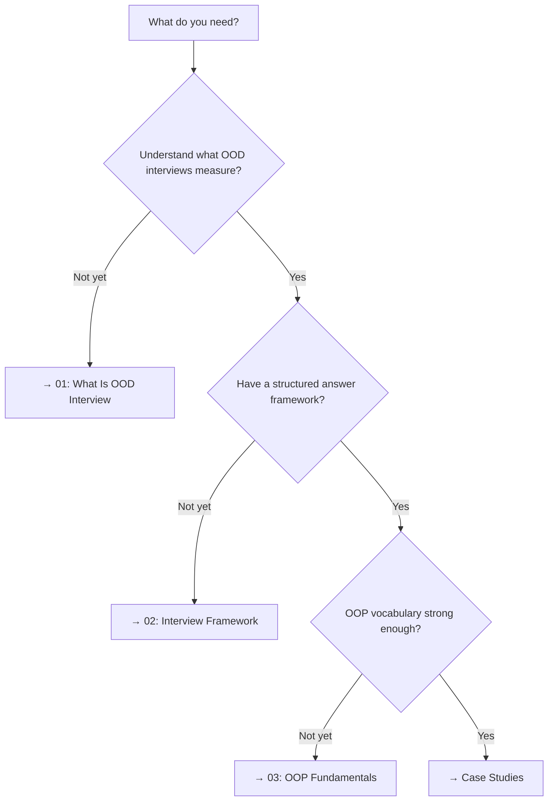

<!-- tags: overview -->
# OOD Foundations

> Lane for the framework, expectations, and OOP vocabulary of OOD interviews.

| Aspect | Detail |
| --- | --- |
| **Concept** | Decision router for OOD Foundations |
| **Audience** | Engineers rebuilding their mental model before practicing cases |
| **Entry point** | Open when you need foundation before case studies |

📅 Created: 2026-04-02 · 🔄 Updated: 2026-04-21 · ⏱️ 3 min read

---

## Routing Map

## Decision Table

| Pain point | File | Why |
| --- | --- | --- |
| "What does an OOD interview expect? I scored low and don't know why" | [What Is OOD Interview](01-what-is-ood-interview.md) | Understand scoring criteria + interviewer mindset |
| "I know what OOD is, but I run out of time or ramble" | [Interview Framework](02-interview-framework.md) | 7-step framework + time budget |
| "I can code but get stuck when asked 'why interface?'" | [OOP Fundamentals](03-oop-fundamentals.md) | Defense vocabulary: encapsulation, composition, SOLID |
| "I have all the foundation, I want to practice" | [Case Studies →](../case-studies/README.md) | 11 real problems |

---

## Reading Order

| # | File | Focus | Prerequisite |
| --- | --- | --- | --- |
| 01 | [What Is OOD Interview](01-what-is-ood-interview.md) | Expectations + scoring | None |
| 02 | [Interview Framework](02-interview-framework.md) | 7-step process + time management | 01 |
| 03 | [OOP Fundamentals](03-oop-fundamentals.md) | Defense vocabulary + patterns | 01 |

---

**Links**: [← OOD Interview](../README.md) · [→ Case Studies](../case-studies/README.md)
