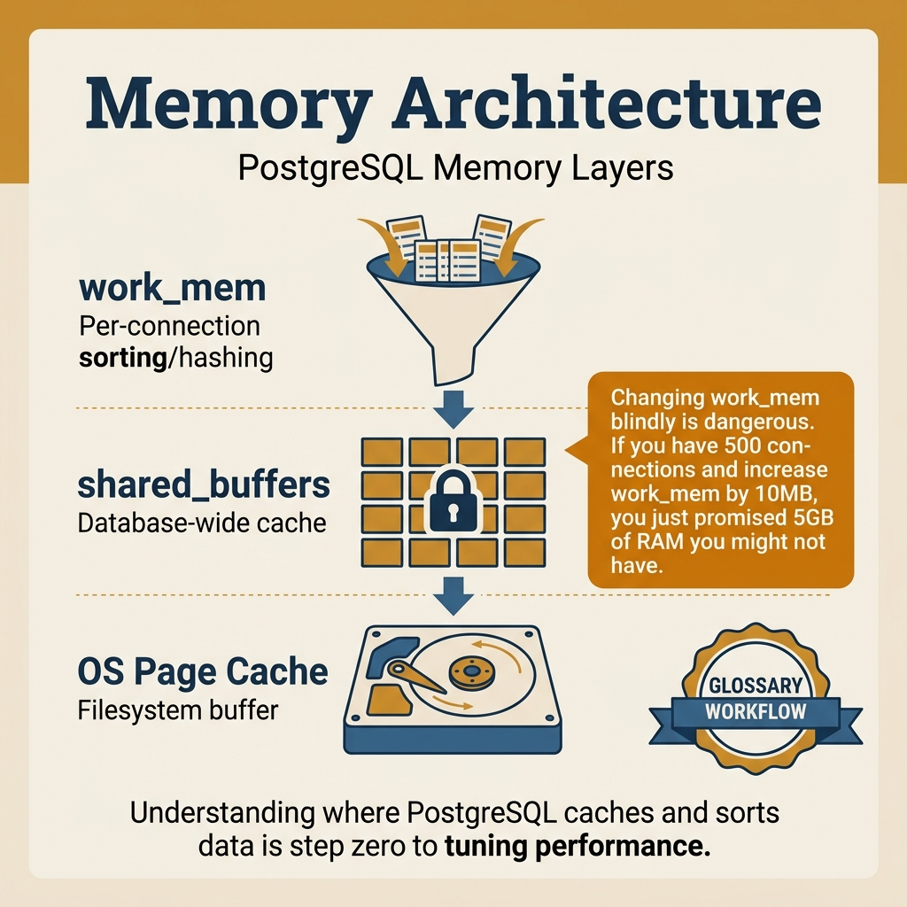
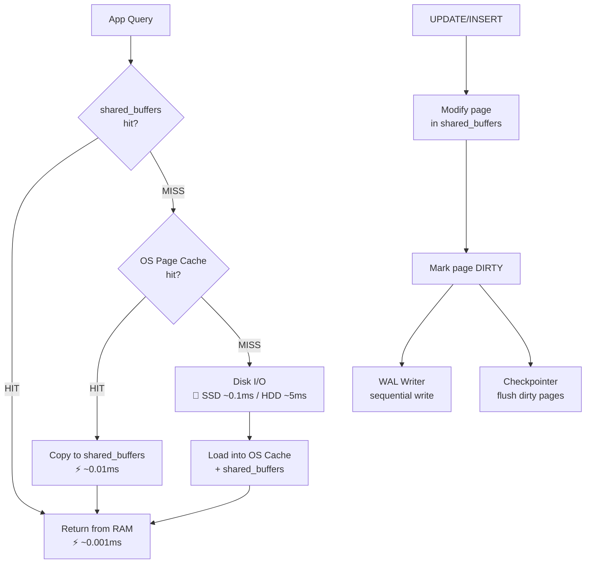

<!-- tags: sql, postgresql, database -->
# 🧠 01 — Memory Architecture

> **Tóm tắt**: PostgreSQL dùng **3 lớp bộ nhớ** để đọc dữ liệu: shared_buffers → OS Page Cache → Disk.
> Hiểu rõ 3 lớp này = hiểu tại sao query nhanh/chậm.

---

📅 Ngày tạo: 2026-03-20 · 🔄 Cập nhật: 2026-04-04 · ⏱️ 15 phút đọc

---

## 1. DEFINE

3 AM. PagerDuty kêu. App dashboard đỏ rực — p99 latency nhảy từ 8ms lên 400ms. Bạn SSH vào database server, chạy `top` — PostgreSQL đang ăn 14GB RAM trên máy 16GB. `dmesg` cho thấy OOM killer vừa bắn chết một backend process 20 phút trước.

Bạn mở `postgresql.conf` và thấy: `shared_buffers = '8GB'`, `work_mem = '256MB'`. Server có 100 connections đang active. Tính nhanh: 100 connections × 4 sort operations × 256MB = **102GB work_mem tiềm năng** trên máy 16GB RAM. Đây không phải memory leak — đây là **memory math sai từ đầu**.

Memory Architecture của PostgreSQL không phải một tham số — nó là ba lớp bộ nhớ phối hợp với nhau, và mỗi lớp có quy tắc riêng. Hiểu sai một lớp, bạn sẽ tune nhầm lớp còn lại.

Bài này giải thích cách PostgreSQL dùng memory để đỡ đòn cho query: thứ gì đi qua shared buffers, thứ gì tràn sang sort/hash memory, và tại sao hiểu sai các lớp bộ nhớ này khiến tuning rất dễ phản tác dụng.

| Variant | Mô tả |
| --- | --- |
| 1️⃣ | shared_buffers · PostgreSQL · ⚡⚡⚡ Nhanh nhất · Cache do PG tự quản lý — pages vừa truy cập |
| 2️⃣ | OS Page Cache · Linux Kernel · ⚡⚡ Nhanh · Kernel cache — RAM chưa dùng thì cache disk pages |
| 3️⃣ | Disk (SSD/HDD) · Hardware · 🐌 Chậm nhất · Physical I/O — đọc từ ổ cứng |

| Approach | Time | Space | Khi chọn |
| --- | --- | --- | --- |
| Kiểm tra cấu hình memory hiện tại | Phụ thuộc cardinality | Phụ thuộc row width | Dùng để nắm baseline semantics trước khi tune planner hoặc index. |
| Tính toán cấu hình tối ưu cho server | Phụ thuộc plan | Phụ thuộc memory operator | Dùng khi query đã chạm index, cardinality hoặc join strategy. |
| Kiểm tra cache hit ratio — đang đọc từ RAM hay Disk? | Phụ thuộc workload | Phụ thuộc buffer/WAL | Dùng khi workload production cần cân bằng correctness, lock và rollout. |
| work_mem ảnh hưởng đến performance thế nào? | Phụ thuộc incident path | Phụ thuộc replication/cache | Dùng khi cần operational playbook, incident response hoặc phối hợp nhiều kỹ thuật. |
| So sánh page size & structure | Phụ thuộc incident path | Phụ thuộc replication/cache | Dùng khi cần operational playbook, incident response hoặc phối hợp nhiều kỹ thuật. |


### Ba lớp cache — Dữ liệu đi qua đâu trước khi đến ứng dụng?

Mỗi khi PostgreSQL đọc một row, hệ thống kiểm tra **theo thứ tự**:

| Lớp | Tên                | Ai quản lý   | Tốc độ            | Mô tả                                             |
| --- | ------------------ | ------------ | ----------------- | ------------------------------------------------- |
| 1️⃣  | **shared_buffers** | PostgreSQL   | ⚡⚡⚡ Nhanh nhất | Cache do PG tự quản lý — pages vừa truy cập       |
| 2️⃣  | **OS Page Cache**  | Linux Kernel | ⚡⚡ Nhanh        | Kernel cache — RAM chưa dùng thì cache disk pages |
| 3️⃣  | **Disk (SSD/HDD)** | Hardware     | 🐌 Chậm nhất      | Physical I/O — đọc từ ổ cứng                      |

### Các tham số bộ nhớ quan trọng

| Parameter                | Mô tả                             | Default | Khuyến nghị                |
| ------------------------ | --------------------------------- | ------- | -------------------------- |
| **shared_buffers**       | Cache chính của PostgreSQL        | 128MB   | **25% RAM** (max ~8GB)     |
| **work_mem**             | RAM cho sort/hash per operation   | 4MB     | **16MB-256MB** (tùy query) |
| **maintenance_work_mem** | RAM cho VACUUM, CREATE INDEX      | 64MB    | **256MB-1GB**              |
| **effective_cache_size** | Ước lượng total cache (PG + OS)   | 4GB     | **50-75% RAM**             |
| **temp_buffers**         | Cache cho temp tables per session | 8MB     | 16-32MB                    |
| **wal_buffers**          | Cache WAL trước khi flush         | 16MB    | **16-64MB** (auto)         |

---

Các failure mode trên nghe quen. Nhưng có trap: shared_buffers set quá lớn = double buffering với OS page cache, và work_mem tính sai per-connection = OOM killer. Trap đó sẽ xuất hiện ở PITFALLS.

## 2. VISUAL

Với Memory Architecture, vocabulary thôi không cứu được bạn. Bottleneck chỉ lộ mặt khi plan, timeline hoặc đường đi của bộ nhớ và I/O được đặt lên bàn cùng lúc.



*Hình: Query đi qua 3 lớp cache: shared_buffers (PG-managed) → OS Page Cache (kernel) → Disk (I/O). work_mem nhân với connections × operations — tính sai = OOM killer.*

### Level 1

```text
  App: SELECT * FROM users WHERE id = 42
                    │
                    ▼
  ┌────── PostgreSQL Executor ───────┐
  │  "Tôi cần page chứa id=42"      │
  └──────────────┬───────────────────┘
                 │
  ━━━━━━━━━━━━━━━▼━━━━━━ LỚP 1 ━━━━━━━━━━━━━━━━━
  ┌──────────────────────────────────────────────┐
  │            shared_buffers (RAM)               │
  │                                              │
  │  Tìm page chứa id=42 trong buffer pool      │
  │  ┌──────┐ ┌──────┐ ┌──────┐ ┌──────┐       │
  │  │ P001 │ │ P002 │ │ P003 │ │ P004 │       │
  │  │users │ │orders│ │users │ │idx_pk│       │
  │  │ 1-100│ │ ...  │ │dirty!│ │      │       │
  │  └──────┘ └──────┘ └──────┘ └──────┘       │
  │                                              │
  │  ✅ HIT → Trả về ngay lập tức               │
  │  ❌ MISS → Xuống lớp 2                       │
  └──────────────────┬───────────────────────────┘
                     │ MISS
  ━━━━━━━━━━━━━━━━━━━▼━━━━━━ LỚP 2 ━━━━━━━━━━━━━━
  ┌──────────────────────────────────────────────┐
  │            OS Page Cache (Kernel RAM)         │
  │                                              │
  │  Linux dùng RAM trống để cache disk pages    │
  │  PG gọi read() → kernel check page cache    │
  │                                              │
  │  ✅ HIT → Copy page → shared_buffers → trả  │
  │              (vẫn nhanh, RAM→RAM)            │
  │  ❌ MISS → Xuống lớp 3                       │
  └──────────────────┬───────────────────────────┘
                     │ MISS
  ━━━━━━━━━━━━━━━━━━━▼━━━━━━ LỚP 3 ━━━━━━━━━━━━━━
  ┌──────────────────────────────────────────────┐
  │            DISK (SSD / HDD)                  │
  │                                              │
  │  Physical I/O — đọc block từ ổ cứng          │
  │  SSD: ~0.05-0.1ms | HDD: ~5-10ms            │
  │                                              │
  │  Page đọc xong → vào OS Cache + shared_buf   │
  │  Lần đọc tiếp → nhanh hơn nhiều!            │
  └──────────────────────────────────────────────┘
```

```text
  UPDATE users SET name = 'New' WHERE id = 42
                    │
                    ▼
  ┌── shared_buffers ────────────────────────────┐
  │  Page chứa id=42 được MODIFY trong RAM       │
  │  Page đánh dấu "DIRTY" 🟡                   │
  │                                              │
  │  ⚠ CHƯA ghi xuống disk ngay!                │
  │  → WAL ghi log trước (đảm bảo durability)   │
  │  → Background writer / Checkpoint ghi sau    │
  └──────────┬────────────────────┬──────────────┘
             │                    │
    WAL Writer ↓            Checkpointer ↓
  ┌──────────────────┐  ┌──────────────────────┐
  │ WAL Files (disk) │  │ Data Files (disk)    │
  │ Sequential write │  │ Random write         │
  │ ⚡ Rất nhanh     │  │ 🐌 Chậm hơn         │
  └──────────────────┘  └──────────────────────┘
```

---

*Hình: Level 1 cho 🧠 01 — Memory Architecture — nhìn vào happy path hoặc baseline heuristic trước khi đi sâu vào planner và trade-off.*

### Level 2

```text
Decision Lens                 Dấu hiệu cần nhìn                 Hướng xử lý
---------------------------  --------------------------------  -------------------------------------------
Semantics trước               Kết quả có đúng intent không?    1. Kiểm tra cấu hình memory hiện tại
Planner / index signal        Cardinality, cost, buffers ra sao? 2. Tính toán cấu hình tối ưu cho server
Production pressure           Lock, WAL, lag, rollback nào đau? 3. Kiểm tra cache hit ratio  —  đang đọc từ RAM hay Disk?
```

*Hình: Level 2 biến 🧠 01 — Memory Architecture thành checklist quyết định — từ semantics, sang plan signal, rồi đến áp lực production.*


### Architecture — Memory Layers & Data Flow



*Hình: Query đi qua 3 lớp cache — shared_buffers → OS Page Cache → Disk. UPDATE không ghi disk ngay mà đánh dấu dirty, WAL log trước, checkpoint ghi sau. Cache hit ratio < 99% = working set vượt RAM.*

---
## 3. CODE

Khi tín hiệu trực quan của Memory Architecture đã rõ, ta chuyển sang truy vấn, lệnh chẩn đoán và playbook có thể chạy thật. Bắt đầu từ baseline đơn giản rồi tăng dần áp lực workload.

### Problem 1: Basic — Kiểm tra cấu hình memory hiện tại

> **Mục tiêu**: Xem PostgreSQL đang dùng bao nhiêu RAM và các setting hiện tại.


```sql
-- ━━━━━━━━━━━━━━━━━━━━━━━━━━━━━━━━━━━━━━━━━
-- Xem tất cả memory-related settings
-- ━━━━━━━━━━━━━━━━━━━━━━━━━━━━━━━━━━━━━━━━━
SHOW shared_buffers;           -- Cache chính (default: 128MB)
SHOW work_mem;                 -- RAM cho sort/hash per operation
SHOW maintenance_work_mem;     -- RAM cho VACUUM, CREATE INDEX
SHOW effective_cache_size;     -- Ước lượng tổng cache

-- ━━━━━━━━━━━━━━━━━━━━━━━━━━━━━━━━━━━━━━━━━
-- Xem tất cả settings cùng lúc
-- ━━━━━━━━━━━━━━━━━━━━━━━━━━━━━━━━━━━━━━━━━
SELECT name, setting, unit, short_desc
FROM pg_settings
WHERE name IN (
    'shared_buffers',
    'work_mem',
    'maintenance_work_mem',
    'effective_cache_size',
    'temp_buffers',
    'wal_buffers',
    'huge_pages'
)
ORDER BY name;

-- Output ví dụ:
-- shared_buffers       | 16384   | 8kB  | Sets number of shared memory buffers...
-- work_mem             | 4096    | kB   | Sets the max memory for each query operation...
-- effective_cache_size | 524288  | 8kB  | Sets the planner's estimate of total cache size...
```


**Kết luận**: Biết PostgreSQL đang dùng bao nhiêu RAM, server 16GB RAM mà shared_buffers chỉ 128MB là **quá ít**.

---

Baseline settings đã cover. Nhưng tính toán optimal cần công thức — hãy tính.

### Problem 2: Intermediate — Tính toán cấu hình tối ưu cho server

> **Mục tiêu**: Biết cách tính RAM settings dựa trên tổng RAM server.


```sql
-- ━━━━━━━━━━━━━━━━━━━━━━━━━━━━━━━━━━━━━━━━━━━━━
-- CÔNG THỨC tính memory (server có 16GB RAM):
-- ━━━━━━━━━━━━━━━━━━━━━━━━━━━━━━━━━━━━━━━━━━━━━

-- shared_buffers = 25% RAM = 4GB
-- ⚠ Không nên > 8GB (diminishing returns, OS cache hiệu quả hơn)
ALTER SYSTEM SET shared_buffers = '4GB';

-- effective_cache_size = 75% RAM = 12GB
-- Đây là ESTIMATE cho planner, không thực sự allocate RAM
-- = shared_buffers + OS page cache ước tính
ALTER SYSTEM SET effective_cache_size = '12GB';

-- work_mem = RAM cho SORT/HASH per operation
-- ⚠ Mỗi query có thể dùng NHIỀU operations!
-- 100 connections × 4 sorts × 64MB = 25GB → OOM!
-- Rule: (RAM × 25%) / max_connections / 4
-- = (16GB × 0.25) / 100 / 4 = ~10MB
ALTER SYSTEM SET work_mem = '16MB';

-- maintenance_work_mem = cho VACUUM, CREATE INDEX
-- Chỉ chạy 1-ít concurrent → có thể set cao
ALTER SYSTEM SET maintenance_work_mem = '512MB';

-- Sau khi thay đổi, cần restart PostgreSQL:
-- sudo systemctl restart postgresql
```

> **Tổng kết bảng tính nhanh**:

```text
  ┌──────────────────────────────────────────────┐
  │        Total RAM: 16 GB                       │
  │  ┌──────────────────────────────────────────┐ │
  │  │  shared_buffers    =  4GB  (25%)         │ │
  │  │  effective_cache   = 12GB  (75%)         │ │
  │  │  work_mem          = 16MB  (per op)      │ │
  │  │  maintenance_mem   = 512MB               │ │
  │  │  wal_buffers       = 64MB  (auto)        │ │
  │  └──────────────────────────────────────────┘ │
  │  Còn lại: ~12GB → OS Page Cache + Apps        │
  └──────────────────────────────────────────────┘
```

**Tại sao?** Ở mức Intermediate của Memory Architecture, câu hỏi không còn là “query có chạy không” mà là “tín hiệu nào đang làm PostgreSQL đổi chiến lược”. Problem 2: Intermediate — Tính toán cấu hình tối ưu cho server ép bạn đọc cardinality, buffer hoặc execution path thay vì sửa theo cảm giác.


---

Cấu hình tối ưu đã cover. Nhưng verify hiệu quả cần cache hit ratio — hãy đo.

### Problem 3: Advanced — Kiểm tra cache hit ratio — đang đọc từ RAM hay Disk?

> **Mục tiêu**: Biết PostgreSQL có đang tận dụng cache tốt không. Nếu < 99% → cần tăng shared_buffers.


```sql
-- ━━━━━━━━━━━━━━━━━━━━━━━━━━━━━━━━━━━━━━━━━
-- Cache hit ratio cho cả database
-- ━━━━━━━━━━━━━━━━━━━━━━━━━━━━━━━━━━━━━━━━━
SELECT
    datname AS database,
    blks_hit,                                    -- blocks found in cache
    blks_read,                                   -- blocks read from disk
    CASE WHEN blks_hit + blks_read = 0 THEN 0
         ELSE ROUND(100.0 * blks_hit / (blks_hit + blks_read), 2)
    END AS cache_hit_ratio_pct
FROM pg_stat_database
WHERE datname = current_database();

-- Kết quả ví dụ:
-- database | blks_hit  | blks_read | cache_hit_ratio_pct
-- myapp    | 98765432  | 12345     | 99.99

-- ━━━━━━━━━━━━━━━━━━━━━━━━━━━━━━━━━━━━━━━━━
-- Cache hit ratio PER TABLE
-- ━━━━━━━━━━━━━━━━━━━━━━━━━━━━━━━━━━━━━━━━━
SELECT
    schemaname,
    relname AS table_name,
    heap_blks_hit,
    heap_blks_read,
    CASE WHEN heap_blks_hit + heap_blks_read = 0 THEN 0
         ELSE ROUND(100.0 * heap_blks_hit / (heap_blks_hit + heap_blks_read), 2)
    END AS hit_ratio_pct
FROM pg_statio_user_tables
WHERE heap_blks_hit + heap_blks_read > 0
ORDER BY hit_ratio_pct ASC    -- worst first
LIMIT 10;

-- ⚠ Table nào < 95% → cần chú ý:
-- Hoặc table quá lớn cho RAM
-- Hoặc shared_buffers quá nhỏ
-- Hoặc table ít truy cập → LRU evicted
```


**Kết luận**: Biết chính xác bao nhiêu % queries đọc từ RAM vs Disk. Mục tiêu: > 99%.

---

Cache hit đã cover. Nhưng work_mem spill-to-disk cần profiling — hãy trace.

### Problem 4: Expert — work_mem ảnh hưởng đến performance thế nào?

> **Mục tiêu**: Hiểu work_mem quá nhỏ → sort tràn ra disk (spill to temp files) → chậm gấp 10-100x.


```sql
-- ━━━━━━━━━━━━━━━━━━━━━━━━━━━━━━━━━━━━━━━━━
-- Bước 1: Query với work_mem nhỏ → sort trên DISK
-- ━━━━━━━━━━━━━━━━━━━━━━━━━━━━━━━━━━━━━━━━━
SET work_mem = '1MB';

EXPLAIN (ANALYZE, BUFFERS)
SELECT * FROM orders
ORDER BY created_at DESC
LIMIT 100;

-- Output:
-- Sort (cost=... rows=1000000)
--   Sort Key: created_at DESC
--   Sort Method: external merge Disk: 125MB  ← 🔴 CHẬM! Sort trên disk!
--   Buffers: shared hit=... read=... temp read=15625 written=15625
--                                      ↑ TEMP FILES = sort tràn disk

-- ━━━━━━━━━━━━━━━━━━━━━━━━━━━━━━━━━━━━━━━━━
-- Bước 2: Tăng work_mem → sort trong RAM
-- ━━━━━━━━━━━━━━━━━━━━━━━━━━━━━━━━━━━━━━━━━
SET work_mem = '256MB';

EXPLAIN (ANALYZE, BUFFERS)
SELECT * FROM orders
ORDER BY created_at DESC
LIMIT 100;

-- Output:
-- Sort (cost=... rows=1000000)
--   Sort Key: created_at DESC
--   Sort Method: top-N heapsort Memory: 32kB  ← 🟢 NHANH! Sort trong RAM!
--   Buffers: shared hit=...
--   No temp files!

-- ━━━━━━━━━━━━━━━━━━━━━━━━━━━━━━━━━━━━━━━━━
-- Bước 3: Kiểm tra temp file usage
-- ━━━━━━━━━━━━━━━━━━━━━━━━━━━━━━━━━━━━━━━━━
SELECT
    datname,
    temp_files,                          -- số temp files đã tạo
    pg_size_pretty(temp_bytes) AS temp_size  -- tổng size
FROM pg_stat_database
WHERE datname = current_database();

-- temp_files > 0 → work_mem cần tăng!
```


**Kết luận**: Hiểu work_mem nhỏ → sort/hash tràn disk → **chậm 10-100x**. Nhưng tăng quá mức → OOM.

---

work_mem đã cover. Nhưng page-level storage cần hiểu disk layout — hãy zoom in.

### Problem 5: Expert — So sánh page size & structure

> **Mục tiêu**: Hiểu PostgreSQL lưu data thế nào trên disk — mỗi "page" 8KB chứa gì?


```sql
-- ━━━━━━━━━━━━━━━━━━━━━━━━━━━━━━━━━━━━━━━━━
-- PostgreSQL page structure:
-- ━━━━━━━━━━━━━━━━━━━━━━━━━━━━━━━━━━━━━━━━━
-- Mỗi table/index file = nhiều pages
-- Mỗi page = 8KB (8192 bytes)
-- Mỗi page chứa NHIỀU rows (tuples)
```

```text
  ┌────── 1 PAGE (8KB = 8192 bytes) ──────────────┐
  │  Page Header (24 bytes)                        │
  │  ┌──────────────────────────────────────────┐  │
  │  │ Item Pointer 1 → offset, length          │  │
  │  │ Item Pointer 2 → offset, length          │  │
  │  │ Item Pointer 3 → offset, length          │  │
  │  │ ...                                      │  │
  │  └──────────────────────────────────────────┘  │
  │          ↕ Free Space (chỗ trống cho row mới)  │
  │  ┌──────────────────────────────────────────┐  │
  │  │ Tuple 3: (id=3, name='Charlie', age=30) │  │
  │  │ Tuple 2: (id=2, name='Bob', age=25)     │  │
  │  │ Tuple 1: (id=1, name='Alice', age=28)   │  │
  │  └──────────────────────────────────────────┘  │
  └────────────────────────────────────────────────┘
```

```sql
-- Xem table chiếm bao nhiêu pages
SELECT
    relname,
    relpages       AS total_pages,
    reltuples      AS estimated_rows,
    pg_size_pretty(pg_relation_size(oid)) AS table_size,
    CASE WHEN relpages > 0
         THEN ROUND(reltuples / relpages, 1)
         ELSE 0
    END AS rows_per_page
FROM pg_class
WHERE relname = 'users'
  AND relkind = 'r';

-- Ví dụ:
-- relname | total_pages | estimated_rows | table_size | rows_per_page
-- users   | 12500       | 1000000        | 98 MB      | 80

-- Nghĩa là: 1 triệu users chiếm 12,500 pages × 8KB = ~98MB
-- Mỗi page chứa ~80 rows
```


**Kết luận**: Hiểu data = pages, mỗi page 8KB. Khi SELECT → PG đọc pages, không đọc rows.

---
Bạn đã đi qua settings, cache ratio, work_mem, và page structure. Bây giờ đến phần nguy hiểm: double buffering và OOM — trap đã được setup từ đầu bài.

## 4. PITFALLS

Memory Architecture rất dễ bị dùng theo phản xạ: thấy chậm là thêm index, thấy lag là tăng tài nguyên. Phần dưới đây gom những lỗi tối ưu tưởng đúng nhưng lại làm latency, lock hoặc chi phí vận hành tệ hơn.

| # | Severity | Lỗi | Hậu quả | Fix |
| --- | --- | --- | --- | --- |
| 1 | 🔴 Fatal | work_mem quá cao trên server nhiều connections | 100 conn × 4 sorts × 256MB = OOM killer bắn process, cascade restart toàn app | Tính: RAM×25% / max_connections / 4. Set level session cho query cần nhiều |
| 2 | 🔴 Fatal | shared_buffers > 50% RAM | Double buffering: PG cache + OS cache cùng giữ data, context switch tăng, throughput giảm 20-30% | Set 25% RAM, max 8GB. Để OS page cache xử lý phần còn lại |
| 3 | 🟡 Common | shared_buffers = default 128MB trên production | Cache hit ratio < 90%, mọi query đều phải đọc disk | Set 25% RAM ngay khi provision server |
| 4 | 🟡 Common | effective_cache_size sai (quá thấp hoặc quá cao) | Planner chọn Seq Scan thay Index Scan hoặc ngược lại — plan instability | Set 50-75% RAM — estimate, không allocate thật |
| 5 | 🔵 Minor | Không phân biệt PG cache vs OS cache khi đọc metrics | Nghĩ `shared hit` = toàn bộ cache, bỏ qua OS page cache contribution | Đọc cả `shared hit` + `shared read` (read có thể vẫn nhanh nếu OS cache hit) |

---
Bạn đã đi qua Memory Architecture và cạm bẫy. Các resources dưới đây giúp đi sâu hơn.

## 5. REF

| Resource                    | Link                                                                                                                        |
| --------------------------- | --------------------------------------------------------------------------------------------------------------------------- |
| PostgreSQL Memory Config    | [postgresql.org/docs/current/runtime-config-resource](https://www.postgresql.org/docs/current/runtime-config-resource.html) |
| PGTune — auto config        | [pgtune.leopard.in.ua](https://pgtune.leopard.in.ua/)                                                                       |
| The Internals of PostgreSQL | [interdb.jp/pg](https://www.interdb.jp/pg/)                                                                                 |

---

## 6. RECOMMEND

Khi các bẫy thường gặp của Memory Architecture đã lộ mặt, bạn có thể nối bài này sang maintenance, replication hoặc triage workflow để quyết định tuning không bị cô lập.

| Tool               | Mô tả                                                       |
| ------------------ | ----------------------------------------------------------- |
| **PGTune**         | Auto-calculate settings dựa trên RAM, CPU, storage type     |
| **pg_buffercache** | Extension — xem chi tiết shared_buffers đang cache những gì |
| **free -h**        | Linux — xem OS page cache (dòng "buff/cache")               |


> **Callback** — Quay lại ca 3 AM lúc đầu bài: OOM killer bắn process vì `work_mem = 256MB × 100 connections`. Bây giờ bạn biết chính xác cách tính: `RAM × 25% / max_connections / 4`. Một phép nhân thay thế một incident.

---

**Liên kết**: [← README](./README.md) · [→ EXPLAIN ANALYZE](./02-explain-analyze.md)

---

## 7. QUICK REF

| Signal | Kiểm tra | Action |
| --- | --- | --- |
| Latency nhảy thất thường | `pg_stat_database.blks_read` | Cache hit < 99% → tăng shared_buffers |
| OOM killer trong `dmesg` | `work_mem × max_connections × 4` | Giảm work_mem hoặc max_connections |
| Sort spill temp files | `EXPLAIN BUFFERS → temp read > 0` | Tăng work_mem cho query cụ thể (SET local) |
| Mới provision server | PGTune output | shared_buffers=25% RAM, effective_cache_size=75% RAM |
