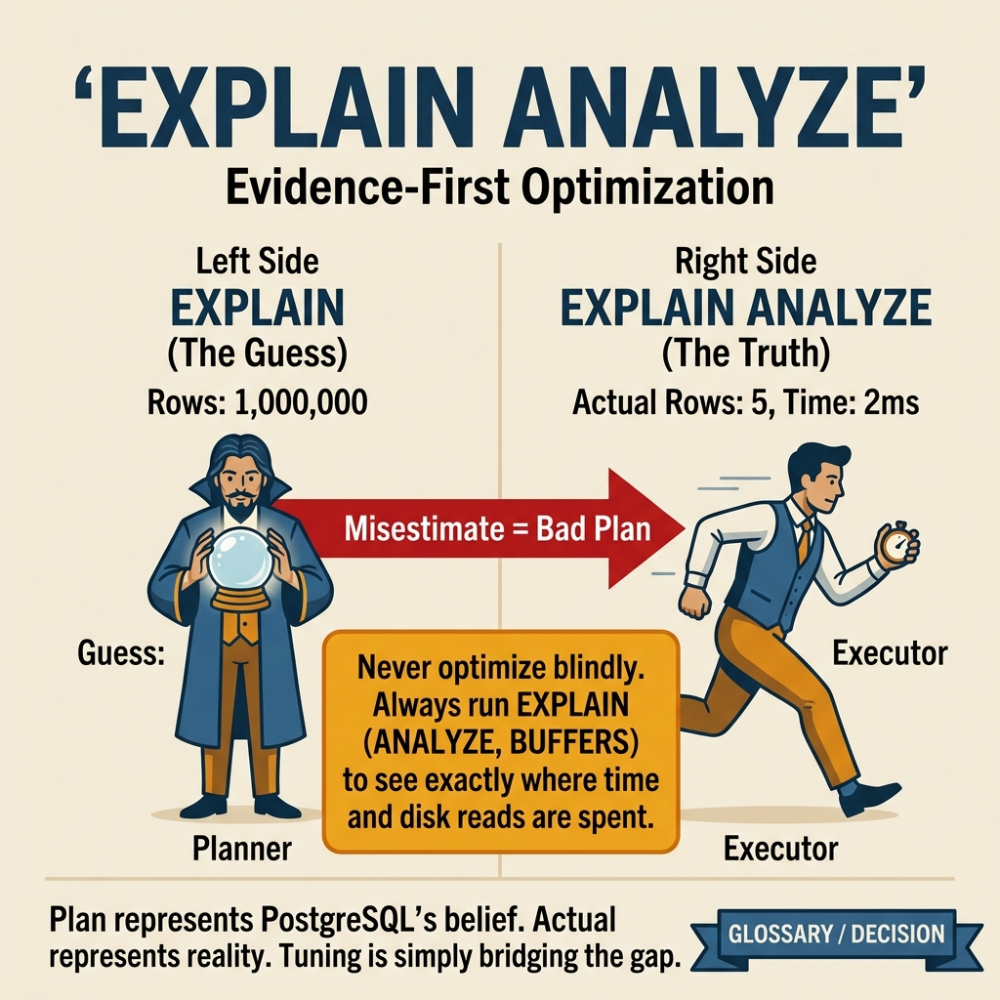
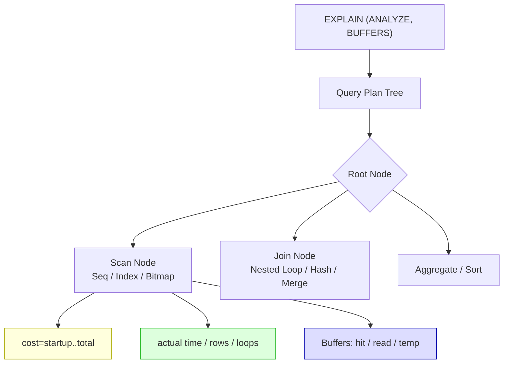

<!-- tags: sql, postgresql, database, query-optimization -->
# 🔍 02 — EXPLAIN ANALYZE — Đọc Query Plan

> **Tóm tắt**: EXPLAIN ANALYZE là **ống nghe** của PostgreSQL — chẩn đoán query nhanh/chậm ở đâu.
> Không biết EXPLAIN = điều trị bệnh mà không khám.

---

📅 Ngày tạo: 2026-03-20 · 🔄 Cập nhật: 2026-04-04 · ⏱️ 15 phút đọc

---

## 1. DEFINE

Slack channel #backend-alerts: _"API `/orders` trả về sau 3.2 giây, bình thường chỉ 50ms."_ Bạn nhìn query — `SELECT ... JOIN orders ON ... WHERE created_at > ...` — trông hoàn toàn hợp lý. Index trên `created_at` đã có. Bạn thêm một index nữa, deploy, chờ. Latency không đổi.

Vấn đề: bạn vừa thêm index mà **planner không dùng**. Estimated rows = 200, actual rows = 50,000 — statistics cũ khiến planner chọn Seq Scan thay vì Index Scan. Bạn đang điều trị triệu chứng mà không khám bệnh.

EXPLAIN ANALYZE là ống nghe của PostgreSQL. Nó không chỉ cho bạn biết query _làm gì_ — nó cho bạn biết planner _nghĩ gì_, executor _đã làm gì_, và khoảng cách giữa hai thứ đó lớn đến mức nào.

EXPLAIN ANALYZE là nơi PostgreSQL kể lại câu chuyện thật của query: planner dự đoán gì, executor đã làm gì, và khoảng cách giữa hai thứ đó lớn đến mức nào.

| Variant | Mô tả |
| --- | --- |
| EXPLAIN | Plan ước lượng (estimated) · ❌ Không · Quick check, production safe |
| EXPLAIN ANALYZE | Plan thực tế (actual) · ✅ Có · Debug performance, có actual time |
| EXPLAIN (ANALYZE, BUFFERS) | Plan + metrics I/O · ✅ Có · Best — full picture |
| EXPLAIN (ANALYZE, BUFFERS, FORMAT JSON) | Machine-readable · ✅ Có · Tools, dalibo visualizer |

| Approach | Time | Space | Khi chọn |
| --- | --- | --- | --- |
| Basic EXPLAIN — Seq Scan vs Index Scan | Phụ thuộc cardinality | Phụ thuộc row width | Dùng để nắm baseline semantics trước khi tune planner hoặc index. |
| EXPLAIN BUFFERS — Phân tích I/O chi tiết | Phụ thuộc plan | Phụ thuộc memory operator | Dùng khi query đã chạm index, cardinality hoặc join strategy. |
| Phát hiện Estimated vs Actual mismatch | Phụ thuộc workload | Phụ thuộc buffer/WAL | Dùng khi workload production cần cân bằng correctness, lock và rollout. |
| So sánh các loại JOIN trong EXPLAIN | Phụ thuộc incident path | Phụ thuộc replication/cache | Dùng khi cần operational playbook, incident response hoặc phối hợp nhiều kỹ thuật. |
| Real — world — Debug slow query step by step | Phụ thuộc incident path | Phụ thuộc replication/cache | Dùng khi cần operational playbook, incident response hoặc phối hợp nhiều kỹ thuật. |


### EXPLAIN vs EXPLAIN ANALYZE

| Command                                   | Mô tả                          | Chạy query? | Dùng khi                          |
| ----------------------------------------- | ------------------------------ | ----------- | --------------------------------- |
| `EXPLAIN`                                 | Plan **ước lượng** (estimated) | ❌ Không    | Quick check, production safe      |
| `EXPLAIN ANALYZE`                         | Plan **thực tế** (actual)      | ✅ Có       | Debug performance, có actual time |
| `EXPLAIN (ANALYZE, BUFFERS)`              | Plan + metrics I/O             | ✅ Có       | Best — full picture               |
| `EXPLAIN (ANALYZE, BUFFERS, FORMAT JSON)` | Machine-readable               | ✅ Có       | Tools, dalibo visualizer          |

### Scan Types — PostgreSQL đọc data bằng cách nào?

| Scan Type             | Mô tả                                | Khi nào                                     | Tốc độ                |
| --------------------- | ------------------------------------ | ------------------------------------------- | --------------------- |
| **Seq Scan**          | Đọc TOÀN BỘ table, row by row        | Không có index, hoặc query trả > 5-10% rows | 🐌 Chậm trên bảng lớn |
| **Index Scan**        | Dùng index → tìm row → đọc heap      | Index match, trả ít rows                    | ⚡ Nhanh              |
| **Index Only Scan**   | Chỉ đọc index, KHÔNG đọc heap        | Tất cả columns cần đều nằm trong index      | ⚡⚡ Nhanh nhất       |
| **Bitmap Index Scan** | Index → bitmap → đọc heap theo block | Trả nhiều rows (5-20%), nhiều conditions    | ⚡ Giữa Seq và Index  |
| **Bitmap Heap Scan**  | Đọc heap theo bitmap từ bước trên    | Pair với Bitmap Index Scan                  | ⚡                    |

### Join Types — PostgreSQL join bảng bằng cách nào?

| Join Type       | Mô tả                      | Tốt cho                         |
| --------------- | -------------------------- | ------------------------------- |
| **Nested Loop** | Loop table A × table B     | Small data, index lookup        |
| **Hash Join**   | Build hash table → probe   | Medium data, no index           |
| **Merge Join**  | Sort both → merge (sorted) | Large data, both sorted/indexed |

---

Các failure mode trên nghe rõ. Nhưng có trap: EXPLAIN không ANALYZE = estimated cost sai xa actual, và ANALYZE trên production = query thật sự chạy. Trap đó sẽ xuất hiện ở PITFALLS.

## 2. VISUAL

Với EXPLAIN ANALYZE — Đọc Query Plan, vocabulary thôi không cứu được bạn. Bottleneck chỉ lộ mặt khi plan, timeline hoặc đường đi của bộ nhớ và I/O được đặt lên bàn cùng lúc.



*Hình: 4 signal phổ biến trong EXPLAIN output — Seq Scan trên bảng lớn, sort spill to disk, Nested Loop skew, Hash batches > 1. Mỗi signal có fix khác nhau.*

### Level 1

```text
  EXPLAIN (ANALYZE, BUFFERS)
  SELECT u.name, o.amount
  FROM users u
  JOIN orders o ON o.user_id = u.id
  WHERE u.status = 'active'
    AND o.created_at > '2024-01-01';

  ┌─────────────────────────────────────────────────────────────────────┐
  │ Hash Join (cost=12.34..567.89 rows=100 width=48)                   │
  │            (actual time=0.5..2.3 rows=95 loops=1)                  │
  │   ├─ Seq Scan on users u (cost=0..112 rows=50 width=24)           │
  │   │     (actual time=0.02..0.8 rows=48 loops=1)                   │
  │   │     Filter: (status = 'active')                                │
  │   │     Rows Removed by Filter: 952                                │
  │   │     Buffers: shared hit=42                                     │
  │   │                                                                │
  │   └─ Hash (cost=345..345 rows=200 width=24)                       │
  │       └─ Index Scan on idx_orders_user on orders o                 │
  │             (actual time=0.01..1.2 rows=200 loops=1)               │
  │             Index Cond: (created_at > '2024-01-01')                │
  │             Buffers: shared hit=150 read=3                         │
  └─────────────────────────────────────────────────────────────────────┘
```

```text
  cost=12.34..567.89
  │        │
  │        └─ Total cost: cost để trả TẤT CẢ rows
  └─ Startup cost: cost trước khi trả row đầu tiên

  rows=100     → Planner ước lượng 100 rows
  actual rows=95 → Thực tế 95 rows (gần = tốt!)

  width=48     → Mỗi row ~48 bytes

  loops=1      → Node chạy 1 lần

  Buffers:
    shared hit=150   → 150 pages đọc từ shared_buffers (RAM) ✅
    shared read=3    → 3 pages đọc từ disk 🟡
    temp read/written → sort tràn disk 🔴
```

---

*Hình: Level 1 cho 🔍 02 — EXPLAIN ANALYZE — Đọc Query Plan — nhìn vào happy path hoặc baseline heuristic trước khi đi sâu vào planner và trade-off.*

### Level 2

```text
Decision Lens                 Dấu hiệu cần nhìn                 Hướng xử lý
---------------------------  --------------------------------  -------------------------------------------
Semantics trước               Kết quả có đúng intent không?    1. Basic EXPLAIN  —  Seq Scan vs Index Scan
Planner / index signal        Cardinality, cost, buffers ra sao? 2. EXPLAIN BUFFERS  —  Phân tích I/O chi tiết
Production pressure           Lock, WAL, lag, rollback nào đau? 3. Phát hiện Estimated vs Actual mismatch
```

*Hình: Level 2 biến 🔍 02 — EXPLAIN ANALYZE — Đọc Query Plan thành checklist quyết định — từ semantics, sang plan signal, rồi đến áp lực production.*


### Architecture — EXPLAIN Output Tree



*Hình: Mỗi node trong plan tree có 3 layer metrics: cost (estimated), actual (measured), buffers (I/O). Khi estimated ≠ actual → statistics cũ, planner chọn sai plan.*

---
## 3. CODE

Khi tín hiệu trực quan của EXPLAIN ANALYZE — Đọc Query Plan đã rõ, ta chuyển sang truy vấn, lệnh chẩn đoán và playbook có thể chạy thật. Bắt đầu từ baseline đơn giản rồi tăng dần áp lực workload.

### Problem 1: Basic — Basic EXPLAIN — Seq Scan vs Index Scan

> **Mục tiêu**: Thấy sự khác biệt giữa query CÓ index và KHÔNG CÓ index.


```sql
-- ━━━━━━━━━━━━━━━━━━━━━━━━━━━━━━━━━━━━━━━━━
-- Setup: Tạo table test với 1 triệu rows
-- ━━━━━━━━━━━━━━━━━━━━━━━━━━━━━━━━━━━━━━━━━
CREATE TABLE products (
    id SERIAL PRIMARY KEY,
    name TEXT,
    price NUMERIC(10,2),
    category TEXT,
    created_at TIMESTAMP DEFAULT NOW()
);

INSERT INTO products (name, price, category, created_at)
SELECT
    'Product ' || i,
    (random() * 1000)::numeric(10,2),
    CASE (i % 5)
        WHEN 0 THEN 'electronics'
        WHEN 1 THEN 'books'
        WHEN 2 THEN 'clothing'
        WHEN 3 THEN 'food'
        WHEN 4 THEN 'toys'
    END,
    NOW() - (random() * 365)::int * interval '1 day'
FROM generate_series(1, 1000000) AS i;

ANALYZE products;  -- cập nhật statistics!

-- ━━━━━━━━━━━━━━━━━━━━━━━━━━━━━━━━━━━━━━━━━
-- KHÔNG có index: Seq Scan 🐌
-- ━━━━━━━━━━━━━━━━━━━━━━━━━━━━━━━━━━━━━━━━━
EXPLAIN (ANALYZE, BUFFERS)
SELECT * FROM products WHERE category = 'electronics';

-- Output:
-- Seq Scan on products (cost=0..22345 rows=200000 width=52)
--   (actual time=0.01..120.5 rows=200000 loops=1)
--   Filter: (category = 'electronics'::text)
--   Rows Removed by Filter: 800000          ← ĐỌC 1TR, GIỮ 200K!
--   Buffers: shared hit=12345               ← Đọc 12,345 pages
-- Planning Time: 0.1 ms
-- Execution Time: 150.3 ms                  ← 150ms 🐌

-- ━━━━━━━━━━━━━━━━━━━━━━━━━━━━━━━━━━━━━━━━━
-- CÓ index: Index Scan ⚡
-- ━━━━━━━━━━━━━━━━━━━━━━━━━━━━━━━━━━━━━━━━━
CREATE INDEX idx_products_category ON products(category);
ANALYZE products;

EXPLAIN (ANALYZE, BUFFERS)
SELECT * FROM products WHERE category = 'electronics';

-- Output:
-- Bitmap Heap Scan on products (cost=2345..8901 rows=200000 width=52)
--   (actual time=15..65 rows=200000 loops=1)
--   Recheck Cond: (category = 'electronics'::text)
--   -> Bitmap Index Scan on idx_products_category
--        (actual time=12..12 rows=200000 loops=1)
--        Index Cond: (category = 'electronics'::text)
--   Buffers: shared hit=3456               ← Chỉ 3,456 pages!
-- Execution Time: 80.2 ms                  ← 80ms (gần 2x nhanh hơn)
```


**Kết luận**: Thấy Seq Scan đọc MỌI page (12,345), còn Bitmap Index Scan chỉ đọc pages cần thiết (3,456).

**Lưu ý**: 200K rows / 1M = 20% → PG chọn Bitmap Scan (giữa Seq và Index). Nếu WHERE trả < 5% rows → sẽ dùng pure Index Scan.

---

EXPLAIN basics đã cover. Nhưng ANALYZE cần actual runtime — hãy benchmark.

### Problem 2: Intermediate — EXPLAIN BUFFERS — Phân tích I/O chi tiết

> **Mục tiêu**: Dùng BUFFERS để biết query đọc bao nhiêu từ cache vs disk.


```sql
-- ━━━━━━━━━━━━━━━━━━━━━━━━━━━━━━━━━━━━━━━━━
-- Query 1: Data đã nằm trong cache
-- ━━━━━━━━━━━━━━━━━━━━━━━━━━━━━━━━━━━━━━━━━
EXPLAIN (ANALYZE, BUFFERS)
SELECT * FROM products WHERE id = 42;

-- Output:
-- Index Scan using products_pkey on products
--   (actual time=0.015..0.016 rows=1 loops=1)
--   Index Cond: (id = 42)
--   Buffers: shared hit=4          ← 4 pages, ALL from cache ✅
-- Execution Time: 0.03 ms          ← 0.03ms = siêu nhanh!

-- ━━━━━━━━━━━━━━━━━━━━━━━━━━━━━━━━━━━━━━━━━
-- Query 2: Data phải đọc từ disk (sau restart)
-- ━━━━━━━━━━━━━━━━━━━━━━━━━━━━━━━━━━━━━━━━━
-- Giả sử sau PostgreSQL restart, cache trống:
-- Buffers: shared hit=1 read=3     ← 3 pages đọc từ disk 🟡
-- Execution Time: 0.5 ms           ← 0.5ms = chậm hơn 10x!

-- ━━━━━━━━━━━━━━━━━━━━━━━━━━━━━━━━━━━━━━━━━
-- GIẢI THÍCH các metrics BUFFERS:
-- ━━━━━━━━━━━━━━━━━━━━━━━━━━━━━━━━━━━━━━━━━
-- shared hit=N     → N pages đọc từ shared_buffers (RAM)     ✅ Tốt
-- shared read=N    → N pages đọc từ disk/OS cache            🟡 Cần giảm
-- shared dirtied=N → N pages bị modify (UPDATE/INSERT)
-- shared written=N → N dirty pages ghi xuống disk
-- temp read=N      → N pages đọc từ temp files (sort spill)  🔴 Xấu
-- temp written=N   → N pages ghi vào temp files               🔴 Xấu
```

**Tại sao?** Ở mức Intermediate của EXPLAIN ANALYZE — Đọc Query Plan, câu hỏi không còn là “query có chạy không” mà là “tín hiệu nào đang làm PostgreSQL đổi chiến lược”. Problem 2: Intermediate — EXPLAIN BUFFERS — Phân tích I/O chi tiết ép bạn đọc cardinality, buffer hoặc execution path thay vì sửa theo cảm giác.

**Kết luận**: `shared hit` cao, `shared read` thấp, `temp` = 0 → query tối ưu!

---

ANALYZE đã cover. Nhưng BUFFERS cần I/O insight — hãy đào sâu.

### Problem 3: Advanced — Phát hiện Estimated vs Actual mismatch

> **Mục tiêu**: Khi planner ước lượng SAI → chọn plan CHẬM. ANALYZE sẽ fix.


```sql
-- ━━━━━━━━━━━━━━━━━━━━━━━━━━━━━━━━━━━━━━━━━
-- Scenario: Statistics cũ → planner ước sai
-- ━━━━━━━━━━━━━━━━━━━━━━━━━━━━━━━━━━━━━━━━━
-- Sau khi INSERT 500K rows mới nhưng CHƯA chạy ANALYZE:

EXPLAIN (ANALYZE)
SELECT * FROM products WHERE category = 'electronics' AND price > 900;

-- Output:
-- Seq Scan on products
--   (estimated rows=200, actual rows=50000)  ← 🔴 SAI LẦM!
--   ↑ Planner nghĩ 200 rows → Seq Scan OK
--   ↑ Thực tế 50,000 rows → Index Scan nhanh hơn!

-- ━━━━━━━━━━━━━━━━━━━━━━━━━━━━━━━━━━━━━━━━━
-- FIX: Cập nhật statistics
-- ━━━━━━━━━━━━━━━━━━━━━━━━━━━━━━━━━━━━━━━━━
ANALYZE products;

EXPLAIN (ANALYZE)
SELECT * FROM products WHERE category = 'electronics' AND price > 900;

-- Output:
-- Index Scan using idx_products_category on products
--   (estimated rows=48500, actual rows=50000)  ← ✅ Gần đúng!
```


**Kết luận**: `rows=estimated` sai lệch nhiều so với `actual rows` → **cần ANALYZE**. Luôn check ratio estimated/actual.

**Quy tắc**: `actual rows / estimated rows` > 10 hoặc < 0.1 → statistics **quá cũ**.

---

BUFFERS đã cover. Nhưng plan instability cần planner understanding — hãy tread carefully.

### Problem 4: Expert — So sánh các loại JOIN trong EXPLAIN

> **Mục tiêu**: Hiểu khi nào PostgreSQL chọn Nested Loop, Hash Join, Merge Join.


```sql
-- ━━━━━━━━━━━━━━━━━━━━━━━━━━━━━━━━━━━━━━━━━
-- Setup: 2 bảng quan hệ
-- ━━━━━━━━━━━━━━━━━━━━━━━━━━━━━━━━━━━━━━━━━
CREATE TABLE customers (
    id SERIAL PRIMARY KEY,
    name TEXT,
    status TEXT
);
INSERT INTO customers
SELECT i, 'Customer ' || i, CASE WHEN i % 10 = 0 THEN 'vip' ELSE 'regular' END
FROM generate_series(1, 10000) i;

CREATE TABLE orders (
    id SERIAL PRIMARY KEY,
    customer_id INT REFERENCES customers(id),
    amount NUMERIC(10,2),
    created_at TIMESTAMP DEFAULT NOW()
);
INSERT INTO orders
SELECT i, (random() * 9999 + 1)::int, (random() * 500)::numeric(10,2),
       NOW() - (random() * 365)::int * interval '1 day'
FROM generate_series(1, 500000) i;

CREATE INDEX idx_orders_customer ON orders(customer_id);
ANALYZE customers; ANALYZE orders;

-- ━━━━━━━━━━━━━━━━━━━━━━━━━━━━━━━━━━━━━━━━━
-- Case 1: Nested Loop (ít rows bên trái)
-- ━━━━━━━━━━━━━━━━━━━━━━━━━━━━━━━━━━━━━━━━━
EXPLAIN (ANALYZE)
SELECT c.name, SUM(o.amount)
FROM customers c
JOIN orders o ON o.customer_id = c.id
WHERE c.status = 'vip'            -- chỉ ~1000 VIP customers
GROUP BY c.name;

-- → Nested Loop:
--   For each VIP customer (1000):
--     Index Scan orders WHERE customer_id = X
--   ⚡ Nhanh vì outer table nhỏ + có index

-- ━━━━━━━━━━━━━━━━━━━━━━━━━━━━━━━━━━━━━━━━━
-- Case 2: Hash Join (nhiều rows, không sort)
-- ━━━━━━━━━━━━━━━━━━━━━━━━━━━━━━━━━━━━━━━━━
EXPLAIN (ANALYZE)
SELECT c.name, o.amount
FROM customers c
JOIN orders o ON o.customer_id = c.id;

-- → Hash Join:
--   Build hash table từ customers (nhỏ)
--   Probe mỗi order vào hash table
--   ⚡ Nhanh cho 2 bảng lớn, không cần sort

-- ━━━━━━━━━━━━━━━━━━━━━━━━━━━━━━━━━━━━━━━━━
-- Case 3: Merge Join (cả 2 sorted/indexed)
-- ━━━━━━━━━━━━━━━━━━━━━━━━━━━━━━━━━━━━━━━━━
EXPLAIN (ANALYZE)
SELECT c.name, o.amount
FROM customers c
JOIN orders o ON o.customer_id = c.id
ORDER BY c.id;

-- → Merge Join:
--   Sort customers by id (or use PK index)
--   Sort orders by customer_id (or use index)
--   Merge both sorted streams
--   ⚡ Rất hiệu quả khi cả 2 đã sorted
```


**Kết luận**: Hiểu JOIN choice:

```text
  Nested Loop: outer table NHỎ + inner có INDEX
  Hash Join:   medium-large, một bảng fit work_mem
  Merge Join:  cả 2 bảng đã SORTED / có index
```


---

### Problem 5: Expert — Real-world — Debug slow query step by step

> **Mục tiêu**: Full workflow debug một query chậm trên production.


```sql
-- ━━━━━━━━━━━━━━━━━━━━━━━━━━━━━━━━━━━━━━━━━
-- Query chậm trên production: 3 giây!
-- ━━━━━━━━━━━━━━━━━━━━━━━━━━━━━━━━━━━━━━━━━
EXPLAIN (ANALYZE, BUFFERS, FORMAT TEXT)
SELECT
    c.name,
    COUNT(*) AS order_count,
    SUM(o.amount) AS total_amount
FROM customers c
JOIN orders o ON o.customer_id = c.id
WHERE o.created_at BETWEEN '2024-01-01' AND '2024-06-30'
  AND c.status = 'vip'
GROUP BY c.name
ORDER BY total_amount DESC
LIMIT 10;

-- ━━━━━━━━━━━━━━━━━━━━━━━━━━━━━━━━━━━━━━━━━
-- Đọc output → tìm bottleneck:
-- ━━━━━━━━━━━━━━━━━━━━━━━━━━━━━━━━━━━━━━━━━

-- Checklist:
-- [1] Có Seq Scan trên bảng lớn không?
--     → Cần index: CREATE INDEX idx_orders_created ON orders(created_at);
--
-- [2] actual rows >> estimated rows?
--     → Statistics cũ: ANALYZE customers; ANALYZE orders;
--
-- [3] shared read >> shared hit?
--     → Cache lạnh hoặc shared_buffers nhỏ
--
-- [4] temp read/written > 0?
--     → Sort spill, tăng work_mem hoặc add index cho ORDER BY
--
-- [5] Nested Loop với inner Seq Scan?
--     → Missing index trên join column

-- ━━━━━━━━━━━━━━━━━━━━━━━━━━━━━━━━━━━━━━━━━
-- FIX: Tạo composite index
-- ━━━━━━━━━━━━━━━━━━━━━━━━━━━━━━━━━━━━━━━━━
CREATE INDEX idx_orders_customer_created
ON orders(customer_id, created_at)
INCLUDE (amount);  -- covering index → Index Only Scan!

ANALYZE orders;

-- Chạy lại → từ 3s xuống 50ms!
```


---
Bạn đã đi qua EXPLAIN, ANALYZE, và BUFFERS. Bây giờ đến phần nguy hiểm: estimated vs actual gap — trap đã được setup từ đầu bài.

## 4. PITFALLS

EXPLAIN ANALYZE — Đọc Query Plan rất dễ bị dùng theo phản xạ: thấy chậm là thêm index, thấy lag là tăng tài nguyên. Phần dưới đây gom những lỗi tối ưu tưởng đúng nhưng lại làm latency, lock hoặc chi phí vận hành tệ hơn.

| # | Severity | Lỗi | Hậu quả | Fix |
| --- | --- | --- | --- | --- |
| 1 | 🔴 Fatal | EXPLAIN ANALYZE trên UPDATE/DELETE không wrap transaction | Thực sự modify/delete data production! EXPLAIN ANALYZE **chạy query thật** | `BEGIN; EXPLAIN ANALYZE DELETE ...; ROLLBACK;` |
| 2 | 🔴 Fatal | Dùng EXPLAIN (không ANALYZE) rồi tin estimated cost | Estimated rows có thể sai 100x so với actual — fix dựa trên số sai = fix sai | Luôn dùng `EXPLAIN (ANALYZE, BUFFERS)` để có actual metrics |
| 3 | 🟡 Common | Bỏ qua "Rows Removed by Filter" | Seq Scan đọc 1M rows, giữ 100 — không ai biết 99.99% work bị lãng phí | Nhìn filter ratio: removed >> returned = cần index cho filter column |
| 4 | 🟡 Common | estimated/actual mismatch > 10x nhưng không chạy ANALYZE | Planner tiếp tục chọn plan sai cho mọi query tương tự | `ANALYZE table_name;` cập nhật statistics ngay |
| 5 | 🔵 Minor | Không dùng BUFFERS option | Mất thông tin cache hit vs disk read — không biết I/O bottleneck ở đâu | Luôn: `EXPLAIN (ANALYZE, BUFFERS)` |

---
Bạn đã đi qua EXPLAIN ANALYZE và cạm bẫy. Các resources dưới đây giúp đi sâu hơn.

## 5. REF

| Resource            | Link                                                                                                |
| ------------------- | --------------------------------------------------------------------------------------------------- |
| EXPLAIN Explained   | [explain.dalibo.com](https://explain.dalibo.com/)                                                   |
| Use the Index, Luke | [use-the-index-luke.com](https://use-the-index-luke.com/)                                           |
| PG docs: EXPLAIN    | [postgresql.org/docs/current/sql-explain](https://www.postgresql.org/docs/current/sql-explain.html) |

---

## 6. RECOMMEND

Khi các bẫy thường gặp của EXPLAIN ANALYZE — Đọc Query Plan đã lộ mặt, bạn có thể nối bài này sang maintenance, replication hoặc triage workflow để quyết định tuning không bị cô lập.

| Tool                   | Mô tả                                                                  |
| ---------------------- | ---------------------------------------------------------------------- |
| **explain.dalibo.com** | Paste EXPLAIN JSON → visual diagram                                    |
| **auto_explain**       | Extension: tự log plan cho slow queries                                |
| **pg_stat_statements** | Track top queries by total time                                        |
| **Depesz EXPLAIN**     | [explain.depesz.com](https://explain.depesz.com/) — another visualizer |


> **Callback** — Quay lại query `/orders` 3.2 giây lúc đầu: estimated rows = 200, actual = 50,000 — statistics cũ. `ANALYZE orders;` + composite index → 50ms. Không có EXPLAIN ANALYZE, bạn vẫn đang thêm index mù.

---

**Liên kết**: [← Memory Architecture](./01-memory-architecture.md) · [→ Indexing Strategies](./03-indexing-strategies.md)

---

## 7. QUICK REF

| Signal | Kiểm tra | Action |
| --- | --- | --- |
| Query chậm, chưa biết nguyên nhân | `EXPLAIN (ANALYZE, BUFFERS)` | Đọc plan tree: scan type, actual vs estimated, buffers |
| Seq Scan trên bảng lớn | `Rows Removed by Filter` | Filter selectivity < 5% → cần index |
| estimated vs actual > 10x | `ANALYZE table_name` | Statistics cũ → cập nhật statistics |
| `temp read/written > 0` | `work_mem` | Sort spill → tăng work_mem hoặc thêm index cho ORDER BY |
| Nested Loop + Seq Scan inner | Missing index trên join column | `CREATE INDEX ON inner_table(join_column)` |
