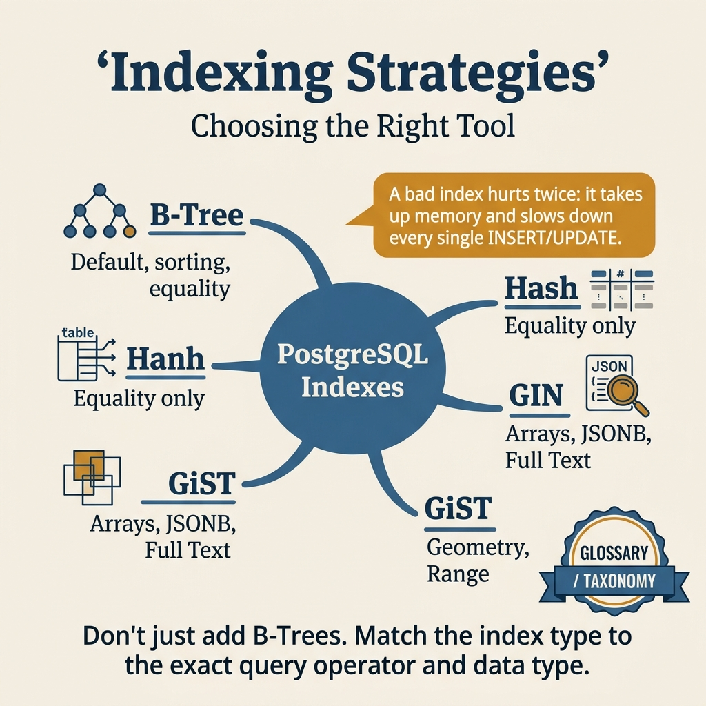
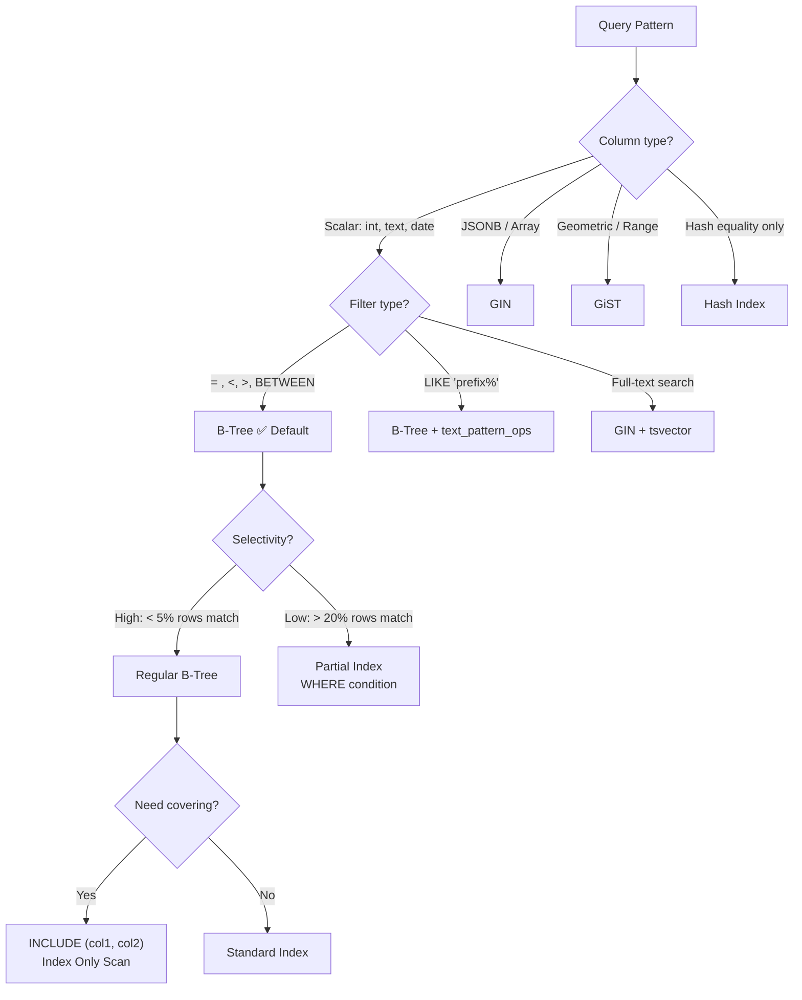

<!-- tags: sql, postgresql, database, indexing -->
# 📇 03 — Indexing Strategies

> **Tóm tắt**: Index = mục lục sách. Không có index → đọc cả cuốn sách để tìm 1 trang.
> Biết chọn đúng loại index = tăng tốc 100-1000x.

---

📅 Ngày tạo: 2026-03-20 · 🔄 Cập nhật: 2026-04-04 · ⏱️ 15 phút đọc

---

## 1. DEFINE

Bảng `transactions` có 80 triệu rows. Team vừa thêm tính năng filter theo `status + created_at`. Query đầu tiên chạy tốt trong staging (500K rows). Production: **12 giây**. DBA phản xạ đầu tiên — thêm `CREATE INDEX idx_status ON transactions(status)`. Latency giảm từ 12s xuống... 8s. Vẫn không chấp nhận được.

Vấn đề không phải _có hay không có index_ — mà là **đúng loại index cho đúng access pattern**. B-Tree trên cột low-cardinality (`status` chỉ có 5 giá trị) gần như vô dụng vì planner ước tính 20% rows match và chọn Seq Scan. Partial index `WHERE status = 'pending'` trên cùng cột đó — index size giảm 80%, query time xuống 15ms.

Bài này không dạy bạn _cách tạo index_. Bài này dạy bạn **chọn đúng index strategy** cho từng loại workload: B-Tree, GIN, partial, covering, expression — mỗi loại có một bài toán riêng mà nó giải tốt nhất.

Nhiều đội chỉ bắt đầu nghĩ nghiêm túc về index sau khi bảng đã phình to và dashboard bắt đầu timeout. Khi đó, thêm một index không còn là thao tác “an toàn mặc định” nữa; nó là một quyết định đánh đổi giữa tốc độ đọc, tốc độ ghi và chi phí bảo trì.

Bài này đặt các chiến lược index vào đúng bối cảnh đó: chọn access path nào, vì sao planner có thể bỏ qua index bạn vừa tạo, và khi nào rollout index làm production đau nhiều hơn nó cứu.

| Variant | Mô tả |
| --- | --- |
| B-Tree | Default, balanced tree · =, <, >, <=, >=, BETWEEN, IN, IS NULL · 95% trường hợp — equality & range |
| Hash | Hash table · = only · Chỉ equality, hiếm dùng (B-Tree also works) |
| GIN | Generalized Inverted Index · @>, ?, ?& · JSONB, Full-text search, arrays |
| GiST | Generalized Search Tree · <<, >> overlap operators · Geometry, PostGIS, full-text |

| Approach | Time | Space | Khi chọn |
| --- | --- | --- | --- |
| B — Tree — Equality, Range, Sorting | Phụ thuộc cardinality | Phụ thuộc row width | Dùng để nắm baseline semantics trước khi tune planner hoặc index. |
| Partial Index — Index thông minh | Phụ thuộc plan | Phụ thuộc memory operator | Dùng khi query đã chạm index, cardinality hoặc join strategy. |
| Covering Index (INCLUDE) — Tránh đọc heap | Phụ thuộc workload | Phụ thuộc buffer/WAL | Dùng khi workload production cần cân bằng correctness, lock và rollout. |
| Expression Index — Index trên biểu thức | Phụ thuộc incident path | Phụ thuộc replication/cache | Dùng khi cần operational playbook, incident response hoặc phối hợp nhiều kỹ thuật. |
| GIN Index — JSONB & Full — text Search | Phụ thuộc incident path | Phụ thuộc replication/cache | Dùng khi cần operational playbook, incident response hoặc phối hợp nhiều kỹ thuật. |
| Kiểm tra & quản lý indexes | Phụ thuộc incident path | Phụ thuộc replication/cache | Dùng khi cần operational playbook, incident response hoặc phối hợp nhiều kỹ thuật. |


### Các loại Index trong PostgreSQL

| Index Type  | Mô tả                      | Operators                               | Khi nào dùng                                      |
| ----------- | -------------------------- | --------------------------------------- | ------------------------------------------------- |
| **B-Tree**  | Default, balanced tree     | `=, <, >, <=, >=, BETWEEN, IN, IS NULL` | 95% trường hợp — equality & range                 |
| **Hash**    | Hash table                 | `=` only                                | Chỉ equality, hiếm dùng (B-Tree also works)       |
| **GIN**     | Generalized Inverted Index | `@>, ?, ?&`                             | JSONB, Full-text search, arrays                   |
| **GiST**    | Generalized Search Tree    | `<<, >>` overlap operators              | Geometry, PostGIS, full-text                      |
| **BRIN**    | Block Range Index          | `=, <, >`                               | Huge table với data tự nhiên sorted (time series) |
| **SP-GiST** | Space-partitioned GiST     | Range operators                         | IP addresses, phone numbers                       |

### Index Variants

| Variant              | Mô tả                             | Ví dụ                             |
| -------------------- | --------------------------------- | --------------------------------- |
| **Partial Index**    | Chỉ index WHERE condition         | `WHERE status = 'active'`         |
| **Covering Index**   | INCLUDE columns → Index Only Scan | `(user_id) INCLUDE (name, email)` |
| **Expression Index** | Index trên biểu thức              | `LOWER(email)`                    |
| **Composite Index**  | Nhiều columns                     | `(user_id, created_at)`           |
| **Unique Index**     | Enforce uniqueness                | `UNIQUE (email)`                  |
| **Concurrent Index** | Tạo index không lock writes       | `CREATE INDEX CONCURRENTLY`       |

---

Các failure mode trên nghe dễ tránh. Nhưng có trap: index bloat qua thời gian = query chậm dần trên index tưởng đã có, và composite index sai column order = full scan. Trap đó sẽ xuất hiện ở PITFALLS.

## 2. VISUAL

Với Indexing Strategies, vocabulary thôi không cứu được bạn. Bottleneck chỉ lộ mặt khi plan, timeline hoặc đường đi của bộ nhớ và I/O được đặt lên bàn cùng lúc.



*Hình: 6 loại index PostgreSQL — B-tree (default), GIN (JSONB/array), GiST (spatial/exclusion), BRIN (time-series), Hash (equality-only), Partial/Expression (targeted). Chọn sai index type = scan thay seek.*

### Level 1

```text
  Table: users (1 triệu rows)
  Index: CREATE INDEX ON users(age)

  B-Tree Structure:
                    ┌───────────┐
                    │  30 | 60  │         ← ROOT
                    └─┬───┬───┬─┘
                      │   │   │
           ┌──────────┘   │   └──────────┐
           ▼              ▼              ▼
    ┌───────────┐  ┌───────────┐  ┌───────────┐
    │ 10 | 20   │  │ 40 | 50   │  │ 70 | 80   │   ← BRANCH
    └─┬──┬──┬───┘  └─┬──┬──┬───┘  └─┬──┬──┬───┘
      │  │  │        │  │  │        │  │  │
      ▼  ▼  ▼        ▼  ▼  ▼        ▼  ▼  ▼
    ┌──┐┌──┐┌──┐   ┌──┐┌──┐┌──┐  ┌──┐┌──┐┌──┐
    │1-││11││21│   │31││41││51│  │61││71││81│   ← LEAF (pointer → heap)
    │10││20││30│   │40││50││60│  │70││80││90│
    └──┘└──┘└──┘   └──┘└──┘└──┘  └──┘└──┘└──┘

  SELECT * FROM users WHERE age = 42:
  ROOT(30|60) → age < 60 → BRANCH(40|50) → age < 50 → LEAF(41-50)
  → Chỉ đọc 3-4 pages thay vì 12,500 pages!
```

```text
  INDEX ON (category, price, created_at)

  ✅ WHERE category = 'books'                    → dùng index
  ✅ WHERE category = 'books' AND price > 100    → dùng index
  ✅ WHERE category = 'books' AND price > 100    → dùng index
      AND created_at > '2024-01-01'

  ❌ WHERE price > 100                           → KHÔNG dùng index!
  ❌ WHERE created_at > '2024-01-01'             → KHÔNG dùng index!

  Quy tắc: "LEFTMOST PREFIX" — phải có column bên trái!

  Ví dụ sách: Mục lục sắp xếp theo Chương → Phần → Trang
  Bạn có thể tra: "Chương 5" ✅
  Bạn có thể tra: "Chương 5, Phần 3" ✅
  Bạn KHÔNG THỂ tra: "Phần 3" (không biết chương nào) ❌
```

---

*Hình: Level 1 cho 📇 03 — Indexing Strategies — nhìn vào happy path hoặc baseline heuristic trước khi đi sâu vào planner và trade-off.*

### Level 2

```text
Decision Lens                 Dấu hiệu cần nhìn                 Hướng xử lý
---------------------------  --------------------------------  -------------------------------------------
Semantics trước               Kết quả có đúng intent không?    1. B — Tree  —  Equality, Range, Sorting
Planner / index signal        Cardinality, cost, buffers ra sao? 2. Partial Index  —  Index thông minh
Production pressure           Lock, WAL, lag, rollback nào đau? 3. Covering Index (INCLUDE)  —  Tránh đọc heap
```

*Hình: Level 2 biến 📇 03 — Indexing Strategies thành checklist quyết định — từ semantics, sang plan signal, rồi đến áp lực production.*


### Architecture — Index Types Decision Map



*Hình: Chọn index type theo column type + filter pattern + selectivity. B-Tree là mặc định nhưng GIN, partial, covering index giải các bài toán B-Tree không giải được.*

---
## 3. CODE

Khi tín hiệu trực quan của Indexing Strategies đã rõ, ta chuyển sang truy vấn, lệnh chẩn đoán và playbook có thể chạy thật. Bắt đầu từ baseline đơn giản rồi tăng dần áp lực workload.

### Problem 1: Basic — B-Tree — Equality, Range, Sorting

> **Mục tiêu**: Hiểu B-Tree làm gì tốt nhất.


```sql
-- ━━━━━━━━━━━━━━━━━━━━━━━━━━━━━━━━━━━━━━━━━
-- Setup
-- ━━━━━━━━━━━━━━━━━━━━━━━━━━━━━━━━━━━━━━━━━
CREATE TABLE orders (
    id SERIAL PRIMARY KEY,
    user_id INT NOT NULL,
    status TEXT NOT NULL,
    amount NUMERIC(10,2),
    created_at TIMESTAMP NOT NULL DEFAULT NOW()
);

-- Insert 2 triệu rows
INSERT INTO orders (user_id, status, amount, created_at)
SELECT
    (random() * 100000)::int + 1,
    (ARRAY['pending','processing','shipped','delivered','cancelled'])[floor(random()*5+1)::int],
    (random() * 500)::numeric(10,2),
    NOW() - (random() * 365 * 2)::int * interval '1 day'
FROM generate_series(1, 2000000);

ANALYZE orders;

-- ━━━━━━━━━━━━━━━━━━━━━━━━━━━━━━━━━━━━━━━━━
-- Case 1: Equality — WHERE user_id = X
-- ━━━━━━━━━━━━━━━━━━━━━━━━━━━━━━━━━━━━━━━━━
CREATE INDEX idx_orders_user ON orders(user_id);

EXPLAIN (ANALYZE) SELECT * FROM orders WHERE user_id = 42;
-- → Index Scan → 0.05ms (thay vì 500ms Seq Scan)

-- ━━━━━━━━━━━━━━━━━━━━━━━━━━━━━━━━━━━━━━━━━
-- Case 2: Range — WHERE created_at BETWEEN
-- ━━━━━━━━━━━━━━━━━━━━━━━━━━━━━━━━━━━━━━━━━
CREATE INDEX idx_orders_created ON orders(created_at);

EXPLAIN (ANALYZE) SELECT * FROM orders
WHERE created_at BETWEEN '2024-06-01' AND '2024-06-30';
-- → Index Scan hoặc Bitmap Index Scan

-- ━━━━━━━━━━━━━━━━━━━━━━━━━━━━━━━━━━━━━━━━━
-- Case 3: Sort — ORDER BY (index = pre-sorted!)
-- ━━━━━━━━━━━━━━━━━━━━━━━━━━━━━━━━━━━━━━━━━
EXPLAIN (ANALYZE) SELECT * FROM orders
ORDER BY created_at DESC LIMIT 10;
-- → Index Scan BACKWARD → tránh Sort operation!
```


**Kết luận**: B-Tree = "đa năng" — equality, range, sorting, unique.

---

B-tree basics đã cover. Nhưng composite indexes cần column order — hãy thiết kế.

### Problem 2: Intermediate — Partial Index — Index thông minh

> **Mục tiêu**: Tại sao index MỌI row khi chỉ query một phần? Tiết kiệm 80% space.


```sql
-- ━━━━━━━━━━━━━━━━━━━━━━━━━━━━━━━━━━━━━━━━━
-- Problem: 90% orders đã delivered — chỉ query active orders
-- ━━━━━━━━━━━━━━━━━━━━━━━━━━━━━━━━━━━━━━━━━

-- Full index: 2 triệu rows → ~60MB index
CREATE INDEX idx_orders_status_full ON orders(status);

-- Partial index: chỉ ~200K active rows → ~6MB index!
CREATE INDEX idx_orders_status_active ON orders(status)
WHERE status IN ('pending', 'processing');

-- So sánh size:
SELECT
    indexrelid::regclass AS index_name,
    pg_size_pretty(pg_relation_size(indexrelid)) AS size
FROM pg_stat_user_indexes
WHERE relname = 'orders'
  AND indexrelid::regclass::text LIKE '%status%';

-- Output:
-- idx_orders_status_full    | 60 MB
-- idx_orders_status_active  | 6 MB   ← 10x nhỏ hơn!

-- Query sử dụng partial index:
EXPLAIN (ANALYZE) SELECT * FROM orders WHERE status = 'pending';
-- → Index Scan using idx_orders_status_active ✅
-- → Nhỏ hơn → fit cache tốt hơn → nhanh hơn!
```

**Tại sao?** Ở mức Intermediate của Indexing Strategies, câu hỏi không còn là “query có chạy không” mà là “tín hiệu nào đang làm PostgreSQL đổi chiến lược”. Problem 2: Intermediate — Partial Index — Index thông minh ép bạn đọc cardinality, buffer hoặc execution path thay vì sửa theo cảm giác.

**Kết luận**: Partial index = index nhỏ hơn, nhanh hơn, ít tốn cache. **Dùng cho hot data**.

---

Composite đã cover. Nhưng partial indexes cần WHERE clause — hãy filter.

### Problem 3: Advanced — Covering Index (INCLUDE) — Tránh đọc heap

> **Mục tiêu**: Index Only Scan = đọc TỪ INDEX, không cần quay lại table heap.


```sql
-- ━━━━━━━━━━━━━━━━━━━━━━━━━━━━━━━━━━━━━━━━━
-- Query thường: Index Scan → quay lại heap đọc name
-- ━━━━━━━━━━━━━━━━━━━━━━━━━━━━━━━━━━━━━━━━━
CREATE INDEX idx_orders_user_covering
ON orders(user_id, created_at)
INCLUDE (amount, status);   -- ← INCLUDE: lưu thêm vào leaf pages

EXPLAIN (ANALYZE, BUFFERS) SELECT amount, status
FROM orders
WHERE user_id = 42
  AND created_at > '2024-01-01';

-- Output:
-- Index Only Scan using idx_orders_user_covering  ← ⚡ Nhanh nhất!
-- Heap Fetches: 0                                  ← KHÔNG đọc heap!
-- Buffers: shared hit=3                            ← Chỉ 3 pages!
```

```text
  Normal Index Scan:
  ┌─────────┐     ┌──────────────────┐
  │  INDEX   │──→  │   TABLE HEAP     │   2 lần đọc
  │ (user_id)│     │ (all columns)    │
  └─────────┘     └──────────────────┘

  Index Only Scan (INCLUDE):
  ┌─────────────────────────────┐
  │  INDEX (user_id, created_at)│    1 lần đọc — mọi thứ nằm trong index!
  │  INCLUDE (amount, status)   │
  └─────────────────────────────┘
```


**Kết luận**: INCLUDE → Index Only Scan → giảm I/O 50%. Dùng cho queries chạy thường xuyên.

---

Partial đã cover. Nhưng covering indexes cần INCLUDE — hãy optimize.

### Problem 4: Expert — Expression Index — Index trên biểu thức

> **Mục tiêu**: Query dùng LOWER(email) → cần index LOWER(email).


```sql
-- ━━━━━━━━━━━━━━━━━━━━━━━━━━━━━━━━━━━━━━━━━
-- Problem: WHERE LOWER(email) = 'alice@test.com'
-- Normal index on (email) → KHÔNG DÙNG ĐƯỢC!
-- ━━━━━━━━━━━━━━━━━━━━━━━━━━━━━━━━━━━━━━━━━
CREATE TABLE users_demo (
    id SERIAL PRIMARY KEY,
    email TEXT NOT NULL,
    name TEXT
);

-- ❌ Không dùng index:
CREATE INDEX idx_users_email ON users_demo(email);
EXPLAIN SELECT * FROM users_demo WHERE LOWER(email) = 'alice@test.com';
-- → Seq Scan! (B-Tree trên email ≠ LOWER(email))

-- ✅ Expression index:
CREATE INDEX idx_users_email_lower ON users_demo(LOWER(email));
EXPLAIN SELECT * FROM users_demo WHERE LOWER(email) = 'alice@test.com';
-- → Index Scan ⚡

-- ━━━━━━━━━━━━━━━━━━━━━━━━━━━━━━━━━━━━━━━━━
-- Các expression index phổ biến:
-- ━━━━━━━━━━━━━━━━━━━━━━━━━━━━━━━━━━━━━━━━━
CREATE INDEX idx_date ON events(DATE(created_at));         -- date part
CREATE INDEX idx_year ON events(EXTRACT(YEAR FROM created_at)); -- year
CREATE INDEX idx_json ON users_demo((metadata->>'city'));  -- JSONB field
```


---

### Problem 5: Expert — GIN Index — JSONB & Full-text Search

> **Mục tiêu**: Khi data là JSONB hoặc cần full-text search, B-Tree không phù hợp → GIN.


```sql
-- ━━━━━━━━━━━━━━━━━━━━━━━━━━━━━━━━━━━━━━━━━
-- JSONB indexing
-- ━━━━━━━━━━━━━━━━━━━━━━━━━━━━━━━━━━━━━━━━━
CREATE TABLE events (
    id SERIAL PRIMARY KEY,
    data JSONB NOT NULL,
    created_at TIMESTAMP DEFAULT NOW()
);

-- GIN index trên toàn bộ JSONB:
CREATE INDEX idx_events_data ON events USING GIN(data);

-- Query: tìm events có key "action" = "purchase"
SELECT * FROM events WHERE data @> '{"action": "purchase"}';
-- → Bitmap Index Scan using idx_events_data ⚡

-- ━━━━━━━━━━━━━━━━━━━━━━━━━━━━━━━━━━━━━━━━━
-- Full-text Search
-- ━━━━━━━━━━━━━━━━━━━━━━━━━━━━━━━━━━━━━━━━━
ALTER TABLE products ADD COLUMN search_vector tsvector;

UPDATE products SET search_vector =
    to_tsvector('english', name || ' ' || COALESCE(description, ''));

CREATE INDEX idx_products_search ON products USING GIN(search_vector);

-- Search:
SELECT name FROM products
WHERE search_vector @@ to_tsquery('english', 'wireless & headphone');
-- → GIN Index Scan ⚡

-- ━━━━━━━━━━━━━━━━━━━━━━━━━━━━━━━━━━━━━━━━━
-- BRIN Index — cho time-series (HUGE tables)
-- ━━━━━━━━━━━━━━━━━━━━━━━━━━━━━━━━━━━━━━━━━
-- Logs table: 100 triệu rows, sorted by timestamp
CREATE INDEX idx_logs_time ON logs USING BRIN(created_at);

-- BRIN chỉ lưu MIN/MAX per block range → TINY index!
-- B-Tree: 2GB index | BRIN: 2MB index (1000x nhỏ hơn!)
-- Phù hợp: append-only, naturally ordered data
```


---

### Problem 6: Expert — Kiểm tra & quản lý indexes

> **Mục tiêu**: Tìm index thừa, index chưa dùng, index thiếu.


```sql
-- ━━━━━━━━━━━━━━━━━━━━━━━━━━━━━━━━━━━━━━━━━
-- Indexes CHƯA BAO GIỜ DÙNG → nên xóa!
-- ━━━━━━━━━━━━━━━━━━━━━━━━━━━━━━━━━━━━━━━━━
SELECT
    schemaname,
    relname AS table_name,
    indexrelname AS index_name,
    pg_size_pretty(pg_relation_size(i.indexrelid)) AS index_size,
    idx_scan AS times_used
FROM pg_stat_user_indexes i
JOIN pg_index pi ON i.indexrelid = pi.indexrelid
WHERE idx_scan = 0                      -- chưa bao giờ dùng
  AND NOT pi.indisunique                -- không phải unique constraint
  AND i.schemaname = 'public'
ORDER BY pg_relation_size(i.indexrelid) DESC;

-- ⚠ Index không dùng vẫn tốn:
-- 1. Disk space (có thể hàng GB)
-- 2. INSERT/UPDATE chậm hơn (phải update index)
-- 3. VACUUM chậm hơn

-- ━━━━━━━━━━━━━━━━━━━━━━━━━━━━━━━━━━━━━━━━━
-- Missing indexes — tables with high Seq Scan
-- ━━━━━━━━━━━━━━━━━━━━━━━━━━━━━━━━━━━━━━━━━
SELECT
    relname AS table_name,
    seq_scan,                            -- số lần Seq Scan
    idx_scan,                            -- số lần Index Scan
    CASE WHEN seq_scan + idx_scan = 0 THEN 0
         ELSE ROUND(100.0 * seq_scan / (seq_scan + idx_scan), 1)
    END AS seq_scan_pct,
    pg_size_pretty(pg_relation_size(relid)) AS table_size
FROM pg_stat_user_tables
WHERE seq_scan > 100                     -- đã Seq Scan > 100 lần
ORDER BY seq_scan_pct DESC, seq_scan DESC
LIMIT 10;

-- seq_scan_pct > 50% trên bảng > 10MB → CẦN INDEX!

-- ━━━━━━━━━━━━━━━━━━━━━━━━━━━━━━━━━━━━━━━━━
-- Total index size per table
-- ━━━━━━━━━━━━━━━━━━━━━━━━━━━━━━━━━━━━━━━━━
SELECT
    relname AS table_name,
    pg_size_pretty(pg_table_size(relid)) AS table_size,
    pg_size_pretty(pg_indexes_size(relid)) AS all_indexes_size,
    ROUND(100.0 * pg_indexes_size(relid) / GREATEST(pg_table_size(relid), 1), 1) AS index_ratio_pct
FROM pg_stat_user_tables
ORDER BY pg_indexes_size(relid) DESC
LIMIT 10;

-- index_ratio > 100% → indexes LỚN HƠN table → quá nhiều index!
```


---
Bạn đã đi qua B-tree, composite, partial, và covering indexes. Bây giờ đến phần nguy hiểm: index bloat và wrong column order — trap đã được setup từ đầu bài.

## 4. PITFALLS

Indexing Strategies rất dễ bị dùng theo phản xạ: thấy chậm là thêm index, thấy lag là tăng tài nguyên. Phần dưới đây gom những lỗi tối ưu tưởng đúng nhưng lại làm latency, lock hoặc chi phí vận hành tệ hơn.

| # | Severity | Lỗi | Hậu quả | Fix |
| --- | --- | --- | --- | --- |
| 1 | 🔴 Fatal | CREATE INDEX (không CONCURRENTLY) trên bảng production | Lock AccessExclusive trên table — block tất cả SELECT/INSERT/UPDATE suốt thời gian build index, có thể hàng giờ | `CREATE INDEX CONCURRENTLY` — không lock table, chạy lâu hơn nhưng safe |
| 2 | 🔴 Fatal | Index trên cột low-cardinality (status: 5 giá trị) | Planner ignore index vì > 20% rows match, index vẫn chiếm disk + slow down writes | Dùng partial index: `WHERE status = 'pending'` chỉ index 5% rows |
| 3 | 🟡 Common | Quá nhiều index trên bảng write-heavy | Mỗi INSERT/UPDATE phải cập nhật tất cả indexes — write throughput giảm 2-5x | Audit unused indexes: `pg_stat_user_indexes WHERE idx_scan = 0` |
| 4 | 🟡 Common | Index mà planner không dùng (function trên column) | Developer tạo index, query vẫn Seq Scan — lãng phí disk + false sense of security | Match index với query pattern: `WHERE LOWER(email) = ...` cần `INDEX ON LOWER(email)` |
| 5 | 🔵 Minor | Không dùng INCLUDE cho covering index | Extra heap lookup cho mỗi row — Index Scan thay vì Index Only Scan | `CREATE INDEX ... INCLUDE (needed_columns)` — trả data trực tiếp từ index |

---
Bạn đã đi qua Indexing Strategies và cạm bẫy. Các resources dưới đây giúp đi sâu hơn.

## 5. REF

| Resource            | Link                                                                                                    |
| ------------------- | ------------------------------------------------------------------------------------------------------- |
| Use The Index, Luke | [use-the-index-luke.com](https://use-the-index-luke.com/)                                               |
| PG Index Types      | [postgresql.org/docs/current/indexes-types](https://www.postgresql.org/docs/current/indexes-types.html) |
| pg_trgm for LIKE    | [postgresql.org/docs/current/pgtrgm](https://www.postgresql.org/docs/current/pgtrgm.html)               |

---

## 6. RECOMMEND

Khi các bẫy thường gặp của Indexing Strategies đã lộ mặt, bạn có thể nối bài này sang maintenance, replication hoặc triage workflow để quyết định tuning không bị cô lập.

| Mở rộng                    | Khi nào                   | Lý do                            |
| -------------------------- | ------------------------- | -----------------------------
> **Callback** — Quay lại bảng `transactions` 80M rows: B-Tree trên `status` (5 giá trị) = vô dụng. Partial index `WHERE status = 'pending'` — size giảm 80%, query 15ms. Chọn đúng loại index quan trọng hơn chọn có index.

--- |
| Tham khảo 3. CODE          | Xem ví dụ đầy đủ          | Code snippets minh họa trực tiếp |
| Đọc 4. PITFALLS            | Trước khi dùng production | Tránh lỗi phổ biến               |
| Kết hợp với tool liên quan | Workflow thực tế          | Hiệu quả cao hơn khi combine     |

**Liên kết**: [← EXPLAIN ANALYZE](./02-explain-analyze.md) · [→ VACUUM & ANALYZE](./04-vacuum-analyze.md)

---

## 7. QUICK REF

| Signal | Index Type | Khi nào |
| --- | --- | --- |
| `=`, `<`, `>`, `BETWEEN`, `ORDER BY` | B-Tree (default) | Equality + range trên scalar columns |
| `WHERE status = 'pending'` (low cardinality) | Partial Index | Filter subset nhỏ của bảng lớn |
| `WHERE LOWER(email) = ...` | Expression Index | Function trên WHERE column |
| JSONB containment `@>`, full-text `@@` | GIN | JSONB path, text search, array ops |
| `SELECT a, b WHERE a = $1` (avoid heap) | Covering Index (INCLUDE) | Index Only Scan — tất cả columns trong index |
