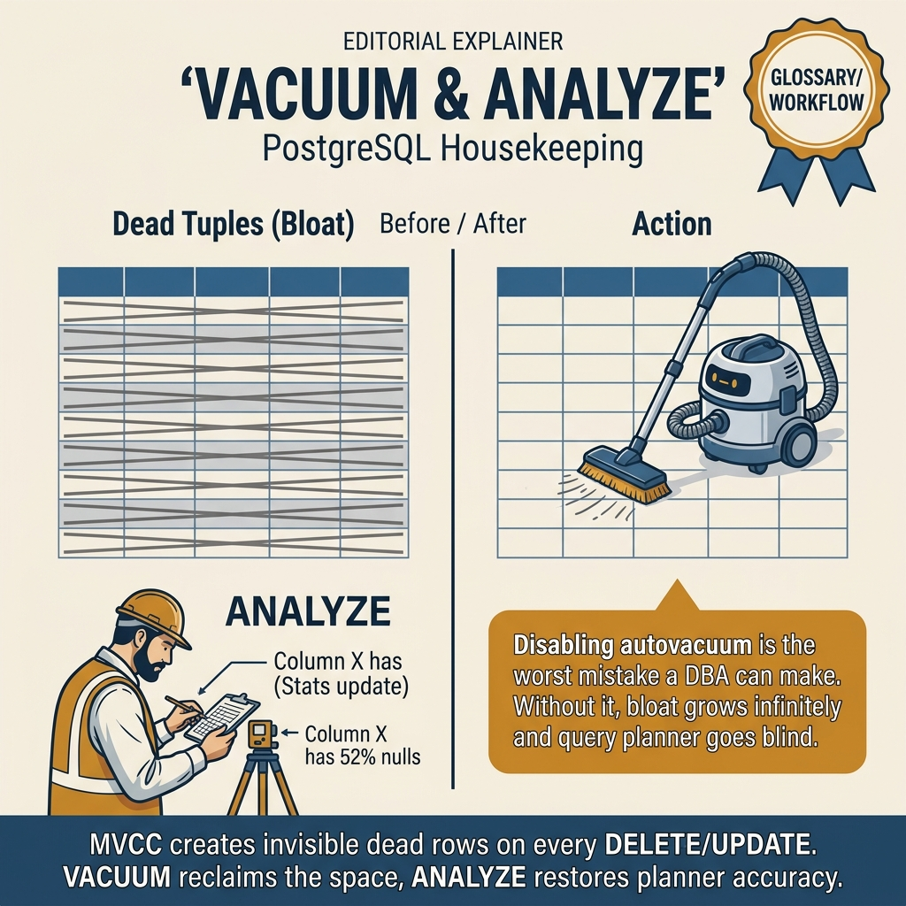
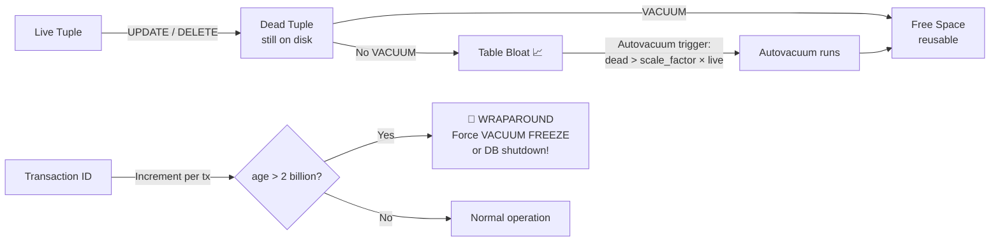

<!-- tags: sql, postgresql, database -->
# 🧹 04 — VACUUM & ANALYZE

> **Tóm tắt**: PostgreSQL dùng MVCC — UPDATE/DELETE KHÔNG xóa row cũ, chỉ đánh dấu "dead".
> VACUUM dọn dead tuples. ANALYZE cập nhật statistics. Không chạy → database PHÌNH TO + CHẬM DẦN.

---

📅 Ngày tạo: 2026-03-20 · 🔄 Cập nhật: 2026-04-04 · ⏱️ 15 phút đọc

---

## 1. DEFINE

Dashboard Grafana sáng đèn đỏ: disk usage tăng 2GB/ngày mặc dù không có thêm data mới. Bảng `audit_logs` chiếm 120GB trên disk nhưng `SELECT count(*)` chỉ trả về 15 triệu rows — tức chưa đến 8GB data thật. 112GB còn lại là **dead tuples** — hàng triệu rows đã bị DELETE hoặc UPDATE nhưng chưa được dọn.

Bạn chạy `SELECT n_dead_tup FROM pg_stat_user_tables WHERE relname = 'audit_logs'` và thấy **45 triệu dead tuples**. Autovacuum đã chạy — nhưng với `autovacuum_vacuum_scale_factor = 0.2` mặc định, nó chỉ trigger khi dead tuples > 20% tổng rows. Bảng 15 triệu rows cần tích 3 triệu dead tuples mới trigger — quá chậm cho workload UPDATE-heavy.

VACUUM không phải "bảo trì định kỳ". Nó là **cơ chế sống còn** của MVCC — nếu không chạy đúng nhịp, database sẽ phình, query sẽ chậm, và đến lúc transaction ID wraparound thì PostgreSQL sẽ **tự shutdown để bảo vệ data**.

PostgreSQL không tự giữ bảng sạch chỉ vì bạn đang dùng MVCC đúng cách. Mỗi update và delete đều để lại dấu vết, và đến một lúc nào đó bloat, stale statistics và autovacuum lag sẽ biến một workload bình thường thành hệ thống khó đoán.

Bài này nối VACUUM và ANALYZE với hậu quả production thực sự: planner estimate lệch, freeze pressure tăng, và maintenance bị xem nhẹ cho đến khi latency hoặc storage buộc bạn phải trả nợ.

| Variant | Mô tả |
| --- | --- |
| VACUUM | Dọn dead tuples, giải phóng space cho reuse · ❌ Không lock writes · ✅ autovacuum |
| VACUUM FULL | Compact table → trả space về OS · ⚠ LOCK TABLE hoàn toàn · ❌ |
| ANALYZE | Cập nhật statistics cho planner · ❌ · ✅ autovacuum |
| VACUUM ANALYZE | Cả hai cùng lúc · ❌ · ✅ |

| Approach | Time | Space | Khi chọn |
| --- | --- | --- | --- |
| Kiểm tra dead tuples — Bao nhiêu rác? | Phụ thuộc cardinality | Phụ thuộc row width | Dùng để nắm baseline semantics trước khi tune planner hoặc index. |
| Chạy VACUUM & ANALYZE | Phụ thuộc plan | Phụ thuộc memory operator | Dùng khi query đã chạm index, cardinality hoặc join strategy. |
| Autovacuum tuning | Phụ thuộc workload | Phụ thuộc buffer/WAL | Dùng khi workload production cần cân bằng correctness, lock và rollout. |
| Transaction ID Wraparound — Nguy hiểm ẩn! | Phụ thuộc incident path | Phụ thuộc replication/cache | Dùng khi cần operational playbook, incident response hoặc phối hợp nhiều kỹ thuật. |


### MVCC — Tại sao cần VACUUM?

```text
  PostgreSQL dùng MVCC (Multi-Version Concurrency Control):

  TRƯỚC UPDATE:
  ┌───────────────────────────────────┐
  │ Row (xmin=100, xmax=∞)           │   ← LIVE tuple
  │ id=1, name='Alice', age=28       │
  └───────────────────────────────────┘

  SAU UPDATE (SET age=29):
  ┌───────────────────────────────────┐
  │ Row (xmin=100, xmax=200)         │   ← DEAD tuple 💀
  │ id=1, name='Alice', age=28       │      (cũ, sẽ bị VACUUM dọn)
  └───────────────────────────────────┘
  ┌───────────────────────────────────┐
  │ Row (xmin=200, xmax=∞)           │   ← LIVE tuple ✅
  │ id=1, name='Alice', age=29       │      (mới)
  └───────────────────────────────────┘

  → UPDATE 1 row = INSERT row mới + đánh dấu row cũ "dead"
  → DELETE = chỉ đánh dấu "dead" (không xóa ngay)
  → Dead tuples tích tụ → TABLE BLOAT → chậm!
```

### Các công cụ

| Command            | Mục đích                                    | Lock?                  | Auto?         |
| ------------------ | ------------------------------------------- | ---------------------- | ------------- |
| **VACUUM**         | Dọn dead tuples, giải phóng space cho reuse | ❌ Không lock writes   | ✅ autovacuum |
| **VACUUM FULL**    | Compact table → trả space về OS             | ⚠ LOCK TABLE hoàn toàn | ❌            |
| **ANALYZE**        | Cập nhật statistics cho planner             | ❌                     | ✅ autovacuum |
| **VACUUM ANALYZE** | Cả hai cùng lúc                             | ❌                     | ✅            |

---

Các failure mode trên nghe cơ bản. Nhưng có trap: autovacuum bị throttled quá mạnh = dead tuples tích tụ = table bloat, và VACUUM FULL lock exclusive = downtime. Trap đó sẽ xuất hiện ở PITFALLS.

## 2. VISUAL

Với VACUUM & ANALYZE, vocabulary thôi không cứu được bạn. Bottleneck chỉ lộ mặt khi plan, timeline hoặc đường đi của bộ nhớ và I/O được đặt lên bàn cùng lúc.



*Hình: Dead tuple lifecycle — UPDATE/DELETE tạo dead version → VACUUM đánh dấu reusable → ANALYZE cập nhật stats cho planner. VACUUM FULL chỉ khi bloat nghiêm trọng.*

### Level 1

```text
  BEFORE VACUUM:
  ┌────────────────────────────────────────┐
  │ Page 1:                                │
  │  [LIVE] [DEAD] [DEAD] [LIVE] [DEAD]   │
  │                                        │
  │ Page 2:                                │
  │  [DEAD] [DEAD] [LIVE] [DEAD] [DEAD]   │
  │                                        │
  │ Hiệu quả: 3 live / 10 = 30% 😰        │
  └────────────────────────────────────────┘

  AFTER VACUUM (normal):
  ┌────────────────────────────────────────┐
  │ Page 1:                                │
  │  [LIVE] [FREE] [FREE] [LIVE] [FREE]   │
  │                                        │
  │ Page 2:                                │
  │  [FREE] [FREE] [LIVE] [FREE] [FREE]   │
  │                                        │
  │ Dead → Free. Pages KHÔNG co lại!       │
  │ Free space sẵn sàng cho INSERT mới     │
  └────────────────────────────────────────┘

  AFTER VACUUM FULL:
  ┌────────────────────────────────────────┐
  │ Page 1:                                │
  │  [LIVE] [LIVE] [LIVE]                  │ ← Compact!
  │                                        │
  │ File nhỏ hơn, trả space về OS         │
  │ ⚠ Nhưng LOCK WRITES toàn bộ thời gian │
  └────────────────────────────────────────┘
```

```text
  TRƯỚC ANALYZE (stats cũ):
  ┌──────────────────────────────┐
  │ pg_statistic:                │
  │   users.status:              │
  │     most_common_vals: active │
  │     most_common_freqs: 0.9  │  ← SAI! Data đã thay đổi
  │     n_distinct: 3            │
  └──────────────────────────────┘
  → Planner: "90% active → Seq Scan OK" ← SAI PLAN!

  SAU ANALYZE (stats mới):
  ┌──────────────────────────────┐
  │ pg_statistic:                │
  │   users.status:              │
  │     most_common_vals: active │
  │     most_common_freqs: 0.4  │  ← ĐÚNG!
  │     n_distinct: 5            │
  └──────────────────────────────┘
  → Planner: "40% active → Index Scan" ← ĐÚNG PLAN!
```

---

*Hình: Level 1 cho 🧹 04 — VACUUM & ANALYZE — nhìn vào happy path hoặc baseline heuristic trước khi đi sâu vào planner và trade-off.*

### Level 2

```text
Decision Lens                 Dấu hiệu cần nhìn                 Hướng xử lý
---------------------------  --------------------------------  -------------------------------------------
Semantics trước               Kết quả có đúng intent không?    1. Kiểm tra dead tuples  —  Bao nhiêu rác?
Planner / index signal        Cardinality, cost, buffers ra sao? 2. Chạy VACUUM & ANALYZE
Production pressure           Lock, WAL, lag, rollback nào đau? 3. Autovacuum tuning
```

*Hình: Level 2 biến 🧹 04 — VACUUM & ANALYZE thành checklist quyết định — từ semantics, sang plan signal, rồi đến áp lực production.*


### Architecture — MVCC Dead Tuple Lifecycle



*Hình: Dead tuples tích tụ sau mỗi UPDATE/DELETE. VACUUM dọn chúng để tái sử dụng space. Nếu autovacuum không kịp, table bloat + transaction ID wraparound có thể force PostgreSQL shutdown.*

---
## 3. CODE

Khi tín hiệu trực quan của VACUUM & ANALYZE đã rõ, ta chuyển sang truy vấn, lệnh chẩn đoán và playbook có thể chạy thật. Bắt đầu từ baseline đơn giản rồi tăng dần áp lực workload.

### Problem 1: Basic — Kiểm tra dead tuples — Bao nhiêu rác?

> **Mục tiêu**: Minh họa cách áp dụng **🧹 04 — VACUUM & ANALYZE** qua ví dụ `Kiểm tra dead tuples — Bao nhiêu rác?` trong đúng ngữ cảnh schema, query hoặc vận hành.


```sql
-- ━━━━━━━━━━━━━━━━━━━━━━━━━━━━━━━━━━━━━━━━━
-- Xem dead tuples per table
-- ━━━━━━━━━━━━━━━━━━━━━━━━━━━━━━━━━━━━━━━━━
SELECT
    schemaname,
    relname AS table_name,
    n_live_tup,                              -- live rows
    n_dead_tup,                              -- dead rows (cần VACUUM)
    CASE WHEN n_live_tup + n_dead_tup = 0 THEN 0
         ELSE ROUND(100.0 * n_dead_tup / (n_live_tup + n_dead_tup), 1)
    END AS dead_pct,                         -- % dead
    last_vacuum,                             -- lần VACUUM cuối
    last_autovacuum,                         -- lần autovacuum cuối
    last_analyze,                            -- lần ANALYZE cuối
    last_autoanalyze
FROM pg_stat_user_tables
WHERE n_dead_tup > 0
ORDER BY n_dead_tup DESC
LIMIT 10;

-- Kết quả ví dụ:
-- table_name | n_live_tup | n_dead_tup | dead_pct | last_autovacuum
-- orders     | 1000000    | 250000     | 20.0     | 2024-01-15 03:00
--                                        ↑ 20% dead → CẦN VACUUM!

-- ━━━━━━━━━━━━━━━━━━━━━━━━━━━━━━━━━━━━━━━━━
-- Table bloat — bảng phình bao nhiêu?
-- ━━━━━━━━━━━━━━━━━━━━━━━━━━━━━━━━━━━━━━━━━
SELECT
    relname AS table_name,
    pg_size_pretty(pg_table_size(relid)) AS current_size,
    n_live_tup,
    n_dead_tup,
    ROUND(100.0 * n_dead_tup / GREATEST(n_live_tup + n_dead_tup, 1), 1) AS dead_pct
FROM pg_stat_user_tables
ORDER BY pg_table_size(relid) DESC
LIMIT 10;
```


---

VACUUM basics đã cover. Nhưng ANALYZE cần statistics update — hãy refresh.

### Problem 2: Intermediate — Chạy VACUUM & ANALYZE

> **Mục tiêu**: Minh họa cách áp dụng **🧹 04 — VACUUM & ANALYZE** qua ví dụ `Chạy VACUUM & ANALYZE` trong đúng ngữ cảnh schema, query hoặc vận hành.


```sql
-- ━━━━━━━━━━━━━━━━━━━━━━━━━━━━━━━━━━━━━━━━━
-- VACUUM cơ bản — Production safe ✅
-- ━━━━━━━━━━━━━━━━━━━━━━━━━━━━━━━━━━━━━━━━━
VACUUM orders;                   -- dọn dead tuples
VACUUM ANALYZE orders;           -- dọn + cập nhật statistics
VACUUM VERBOSE orders;           -- chi tiết output

-- Output VERBOSE:
-- INFO: vacuuming "public.orders"
-- INFO: table "orders": found 50000 removable dead row versions
--    in 5000 out of 12500 pages
-- DETAIL: 50000 dead row versions cannot be removed yet.
--    CPU: user: 0.12 s, system: 0.05 s, elapsed: 0.25 s

-- ━━━━━━━━━━━━━━━━━━━━━━━━━━━━━━━━━━━━━━━━━
-- VACUUM FULL — Compact (⚠ LOCKS TABLE!)
-- ━━━━━━━━━━━━━━━━━━━━━━━━━━━━━━━━━━━━━━━━━
-- Chỉ dùng trong maintenance window!
VACUUM FULL orders;

-- ━━━━━━━━━━━━━━━━━━━━━━━━━━━━━━━━━━━━━━━━━
-- Alternative: pg_repack (no lock!)
-- ━━━━━━━━━━━━━━━━━━━━━━━━━━━━━━━━━━━━━━━━━
-- pg_repack --table orders --no-superuser-check -d mydb

-- ━━━━━━━━━━━━━━━━━━━━━━━━━━━━━━━━━━━━━━━━━
-- ANALYZE — Cập nhật table statistics
-- ━━━━━━━━━━━━━━━━━━━━━━━━━━━━━━━━━━━━━━━━━
ANALYZE orders;                  -- 1 table
ANALYZE;                         -- ALL tables
```

**Tại sao?** Ở mức Intermediate của VACUUM & ANALYZE, câu hỏi không còn là “query có chạy không” mà là “tín hiệu nào đang làm PostgreSQL đổi chiến lược”. Problem 2: Intermediate — Chạy VACUUM & ANALYZE ép bạn đọc cardinality, buffer hoặc execution path thay vì sửa theo cảm giác.


---

ANALYZE đã cover. Nhưng autovacuum tuning cần per-table config — hãy customize.

### Problem 3: Advanced — Autovacuum tuning

> **Mục tiêu**: Minh họa cách áp dụng **🧹 04 — VACUUM & ANALYZE** qua ví dụ `Autovacuum tuning` trong đúng ngữ cảnh schema, query hoặc vận hành.


```sql
-- ━━━━━━━━━━━━━━━━━━━━━━━━━━━━━━━━━━━━━━━━━
-- Xem cấu hình autovacuum hiện tại
-- ━━━━━━━━━━━━━━━━━━━━━━━━━━━━━━━━━━━━━━━━━
SELECT name, setting, short_desc
FROM pg_settings
WHERE name LIKE 'autovacuum%'
ORDER BY name;

-- Key parameters:
-- autovacuum = on                              ← LUÔN bật!
-- autovacuum_vacuum_threshold = 50             ← min dead tuples
-- autovacuum_vacuum_scale_factor = 0.2         ← 20% of table = trigger
-- autovacuum_analyze_threshold = 50
-- autovacuum_analyze_scale_factor = 0.1        ← 10% = trigger analyze

-- ━━━━━━━━━━━━━━━━━━━━━━━━━━━━━━━━━━━━━━━━━
-- CÔNG THỨC: Khi nào autovacuum chạy?
-- ━━━━━━━━━━━━━━━━━━━━━━━━━━━━━━━━━━━━━━━━━
-- dead_tuples > threshold + scale_factor × n_live_tup
--
-- Default: dead > 50 + 0.2 × 1,000,000 = 200,050
-- → Phải có 200K dead tuples mới VACUUM!
-- → Bảng lớn: quá chậm!

-- ━━━━━━━━━━━━━━━━━━━━━━━━━━━━━━━━━━━━━━━━━
-- Tuning cho bảng hot (nhiều UPDATE/DELETE):
-- ━━━━━━━━━━━━━━━━━━━━━━━━━━━━━━━━━━━━━━━━━
ALTER TABLE orders SET (
    autovacuum_vacuum_scale_factor = 0.02,       -- 2% thay vì 20%!
    autovacuum_vacuum_threshold = 1000,
    autovacuum_analyze_scale_factor = 0.01,      -- 1%
    autovacuum_vacuum_cost_delay = 2             -- giảm delay
);

-- ━━━━━━━━━━━━━━━━━━━━━━━━━━━━━━━━━━━━━━━━━
-- Global tuning (postgresql.conf)
-- ━━━━━━━━━━━━━━━━━━━━━━━━━━━━━━━━━━━━━━━━━
ALTER SYSTEM SET autovacuum_max_workers = 6;     -- default 3, tăng nếu nhiều tables
ALTER SYSTEM SET autovacuum_naptime = '30s';     -- check mỗi 30s thay vì 1 phút
```


---

### Problem 4: Expert — Transaction ID Wraparound — Nguy hiểm ẩn!

> **Mục tiêu**: Hiểu tại sao VACUUM QUAN TRỌNG SỐNG CÒN — không chỉ performance.


```sql
-- ━━━━━━━━━━━━━━━━━━━━━━━━━━━━━━━━━━━━━━━━━
-- PostgreSQL dùng 32-bit Transaction ID (XID)
-- Max: ~4.2 tỷ transactions
-- Khi sắp hết → VACUUM FREEZE để "freeze" old XIDs
-- Nếu KHÔNG VACUUM → PostgreSQL TỰ SHUTDOWN để bảo vệ data!
-- ━━━━━━━━━━━━━━━━━━━━━━━━━━━━━━━━━━━━━━━━━

-- Kiểm tra XID age:
SELECT
    relname,
    age(relfrozenxid) AS xid_age,
    pg_size_pretty(pg_table_size(oid)) AS size
FROM pg_class
WHERE relkind = 'r'
  AND relnamespace = 'public'::regnamespace
ORDER BY age(relfrozenxid) DESC
LIMIT 10;

-- ⚠ xid_age > 200,000,000 → WARNING!
-- ⚠ xid_age > 1,000,000,000 → CRITICAL! PostgreSQL sẽ refuse writes!

-- Check system-wide:
SELECT datname, age(datfrozenxid) AS db_xid_age
FROM pg_database
ORDER BY db_xid_age DESC;
```

```text
  Transaction ID Lifecycle:

  0 ─────── 1 tỷ ─────── 2 tỷ ─────── 3 tỷ ─────── 4.2 tỷ → WRAPAROUND 💀
                ↑                         ↑                ↑
              Normal                   WARNING         SHUTDOWN!

  VACUUM FREEZE: "đóng băng" old transactions → reclaim XIDs
  → VACUUM phải chạy ĐỀU ĐẶN, không chỉ vì performance!
```


---
Bạn đã đi qua VACUUM, ANALYZE, và autovacuum tuning. Bây giờ đến phần nguy hiểm: throttled autovacuum và exclusive lock — trap đã được setup từ đầu bài.

## 4. PITFALLS

VACUUM & ANALYZE rất dễ bị dùng theo phản xạ: thấy chậm là thêm index, thấy lag là tăng tài nguyên. Phần dưới đây gom những lỗi tối ưu tưởng đúng nhưng lại làm latency, lock hoặc chi phí vận hành tệ hơn.

| # | Severity | Lỗi | Hậu quả | Fix |
| --- | --- | --- | --- | --- |
| 1 | 🔴 Fatal | Transaction ID wraparound — autovacuum không kịp freeze | PostgreSQL **tự shutdown** khi transaction ID sắp hết 2 tỷ — database offline cho đến khi chạy manual VACUUM FREEZE | Monitor `age(datfrozenxid)` < 500M. Alert + manual VACUUM FREEZE nếu > 1 tỷ |
| 2 | 🔴 Fatal | Long-running transaction block autovacuum | Transaction mở 4 tiếng → autovacuum không clean được dead tuples → bloat 10x → disk full | Kill idle-in-transaction > 30 phút. Set `idle_in_transaction_session_timeout` |
| 3 | 🟡 Common | Autovacuum defaults trên bảng UPDATE-heavy | `scale_factor = 0.2` = bảng 100M rows phải tích 20M dead tuples mới trigger — bloat tích tụ nhiều tháng | Set per-table: `ALTER TABLE ... SET (autovacuum_vacuum_scale_factor = 0.01)` |
| 4 | 🟡 Common | VACUUM FULL thay vì VACUUM | VACUUM FULL lock AccessExclusive + rewrite toàn bộ table — downtime có thể hàng giờ | Dùng `pg_repack` — online compaction không lock, hoặc VACUUM thường xuyên hơn |
| 5 | 🔵 Minor | Không chạy ANALYZE sau bulk INSERT/DELETE | Planner dùng statistics cũ → estimated rows sai → chọn plan sai | `ANALYZE table_name;` ngay sau bulk operation |

---
Bạn đã đi qua VACUUM & ANALYZE và cạm bẫy. Các resources dưới đây giúp đi sâu hơn.

## 5. REF

| Resource          | Link                                                                                                            |
| ----------------- | --------------------------------------------------------------------------------------------------------------- |
| VACUUM docs       | [postgresql.org/docs/current/sql-vacuum](https://www.postgresql.org/docs/current/sql-vacuum.html)               |
| Autovacuum tuning | [postgresql.org/docs/current/routine-vacuuming](https://www.postgresql.org/docs/current/routine-vacuuming.html) |
| pg_repack         | [github.com/reorg/pg_repack](https://github.com/reorg/pg_repack)                                                |

---

## 6. RECOMMEND

Khi các bẫy thường gặp của VACUUM & ANALYZE đã lộ mặt, bạn có thể nối bài này sang maintenance, replication hoặc triage workflow để quyết định tuning không bị cô lập.

| Tool                        | Mô tả                              |
| --------------------------- | ---------------------------------- |
| **pg_repack**               | VACUUM FULL online — no lock       |
| **pgstattuple**             | Extension: chính xác % bloat       |
| **pg_stat_progress_vacuum** | Monitor VACUUM đang chạy real-time |


> **Callback** — Quay lại bảng `audit_logs` 120GB mà chỉ có 8GB data thật: 45 triệu dead tuples tích tụ. Giảm `autovacuum_vacuum_scale_factor = 0.01` cho bảng UPDATE-heavy + tăng `autovacuum_vacuum_cost_delay = 2ms` → bloat kiểm soát được, disk giảm 90%.

---

**Liên kết**: [← Indexing](./03-indexing-strategies.md) · [→ WAL & Checkpoint](./05-wal-checkpoint.md)

---

## 7. QUICK REF

| Signal | Kiểm tra | Action |
| --- | --- | --- |
| Disk tăng dù data không đổi | `pg_stat_user_tables.n_dead_tup` | Dead tuples tích tụ → manual VACUUM hoặc tune autovacuum |
| `age(datfrozenxid) > 500M` | `SELECT datname, age(datfrozenxid) FROM pg_database` | 🔴 Wraparound risk → VACUUM FREEZE ngay |
| Autovacuum không trigger trên bảng UPDATE-heavy | `autovacuum_vacuum_scale_factor` | Giảm per-table: `SET (autovacuum_vacuum_scale_factor = 0.01)` |
| Planner chọn plan sai sau bulk INSERT | `EXPLAIN ANALYZE` estimated/actual mismatch | `ANALYZE table_name` cập nhật statistics |
