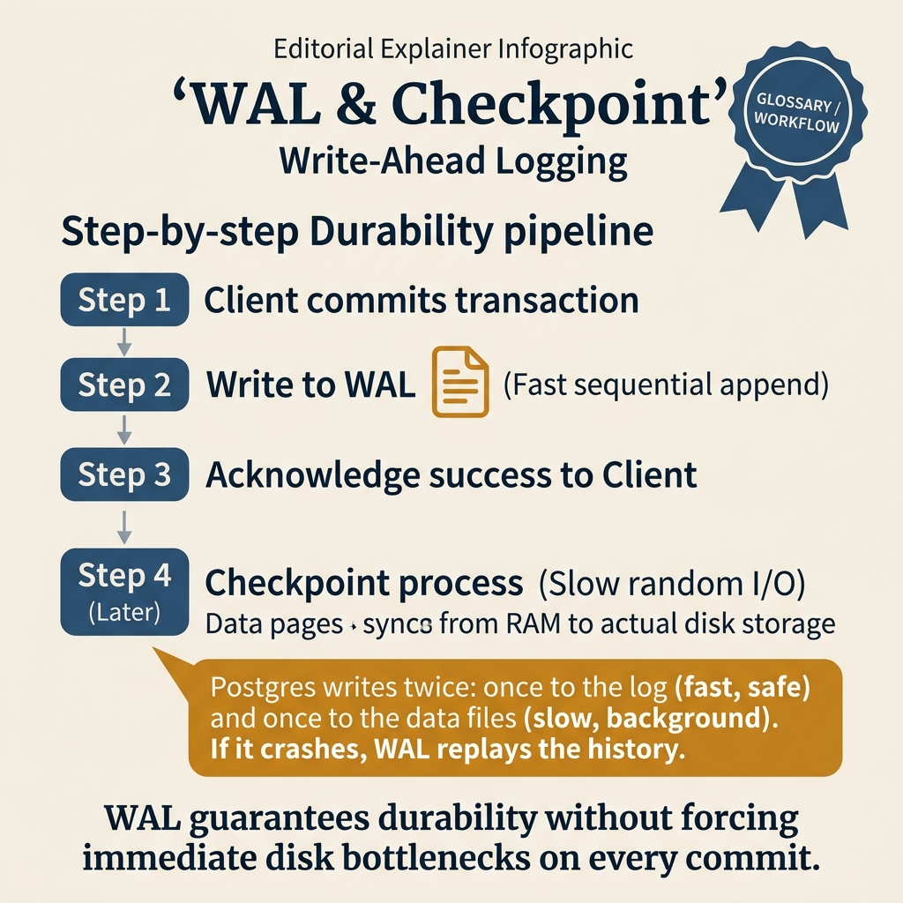
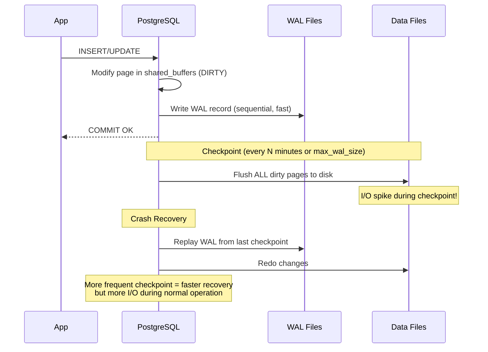

<!-- tags: sql, postgresql, database -->
# 📝 05 — WAL & Checkpoint

> **Tóm tắt**: WAL = "nhật ký trước khi ghi" — đảm bảo data KHÔNG MẤT dù server crash.
> Checkpoint = "đồng bộ từ RAM xuống disk" — quá thường xuyên → chậm, quá ít → recovery lâu.

---

📅 Ngày tạo: 2026-03-20 · 🔄 Cập nhật: 2026-04-04 · ⏱️ 15 phút đọc

---

## 1. DEFINE

2:47 AM. Server crash — mất điện đột ngột. PostgreSQL restart, bắt đầu recovery. Log ghi: _"redo starts at 0/3A000028, redo done at 0/4F2B1A90"_. Recovery mất **47 phút** — suốt thời gian đó, application không connect được database.

Nguyên nhân: `checkpoint_timeout = 30min` và `max_wal_size = 4GB`. Checkpoint cuối cùng xảy ra 28 phút trước khi crash — tức PostgreSQL phải replay gần 4GB WAL data. Nếu checkpoint chạy mỗi 5 phút, recovery chỉ mất 3-4 phút.

Nhưng checkpoint quá thường xuyên cũng đau: mỗi lần checkpoint, PostgreSQL phải flush **tất cả dirty pages** xuống disk — gây I/O spike, latency tăng đột ngột. Đó là trade-off trung tâm của WAL: **write performance vs recovery time**. Bài này giúp bạn nắm cả hai đầu của trade-off đó.

Có những hệ thống trông ổn trong hầu hết thời gian rồi cứ vài phút lại rung lên: disk write spike, latency tăng thành răng cưa, replica replay không theo kịp. Nếu chỉ nhìn query layer, bạn sẽ không thấy thủ phạm vì vấn đề nằm ở WAL và checkpoint.

Bài này giải thích chu kỳ ghi bền của PostgreSQL như một dòng chảy liên tục: transaction tạo WAL ra sao, checkpoint ép dirty pages xuống đĩa thế nào, và vì sao hai cơ chế này quyết định độ mượt của production nhiều hơn tưởng tượng.

| Variant | Mô tả |
| --- | --- |
| WAL (Write-Ahead Log) | Sequential log file ghi MỌI thay đổi |
| WAL segment | File 16MB (mỗi WAL = 1 segment file) |
| LSN (Log Sequence Number) | Vị trí trong WAL stream (như page number) |
| Checkpoint | Flush dirty pages từ shared_buffers → disk |

| Approach | Time | Space | Khi chọn |
| --- | --- | --- | --- |
| Xem WAL & Checkpoint status | Phụ thuộc cardinality | Phụ thuộc row width | Dùng để nắm baseline semantics trước khi tune planner hoặc index. |
| WAL tuning cho production | Phụ thuộc plan | Phụ thuộc memory operator | Dùng khi query đã chạm index, cardinality hoặc join strategy. |
| WAL Archiving & PITR (Point — in — Time Recovery) | Phụ thuộc workload | Phụ thuộc buffer/WAL | Dùng khi workload production cần cân bằng correctness, lock và rollout. |
| full_page_writes & hints | Phụ thuộc incident path | Phụ thuộc replication/cache | Dùng khi cần operational playbook, incident response hoặc phối hợp nhiều kỹ thuật. |


### WAL là gì? Tại sao cần?

```text
  VẤN ĐỀ: Nếu PostgreSQL modify data trong RAM rồi bị crash
  → Data trong RAM (dirty pages) = MẤT!

  GIẢI PHÁP: WAL (Write-Ahead Logging)
  → TRƯỚC KHI modify data, ghi LOG vào WAL file trên disk
  → Crash? → Đọc WAL → replay → khôi phục!

  Nguyên tắc: "Ghi log trước, ghi data sau"
```

| Concept                       | Mô tả                                      |
| ----------------------------- | ------------------------------------------ |
| **WAL (Write-Ahead Log)**     | Sequential log file ghi MỌI thay đổi       |
| **WAL segment**               | File 16MB (mỗi WAL = 1 segment file)       |
| **LSN (Log Sequence Number)** | Vị trí trong WAL stream (như page number)  |
| **Checkpoint**                | Flush dirty pages từ shared_buffers → disk |
| **Recovery**                  | Replay WAL từ last checkpoint → khôi phục  |
| **WAL archiving**             | Copy WAL files → backup storage (PITR)     |

### Tham số WAL quan trọng

| Parameter                        | Mô tả                            | Default | Khuyến nghị              |
| -------------------------------- | -------------------------------- | ------- | ------------------------ |
| **wal_level**                    | Log detail level                 | replica | `replica` hoặc `logical` |
| **max_wal_size**                 | WAL tích tụ max trước checkpoint | 1GB     | **2-8GB**                |
| **min_wal_size**                 | WAL files giữ lại tối thiểu      | 80MB    | 256MB-1GB                |
| **checkpoint_timeout**           | Max time giữa checkpoints        | 5 min   | **10-15 min**            |
| **checkpoint_completion_target** | % time để spread I/O             | 0.9     | 0.9 (default OK)         |
| **wal_compression**              | Compress WAL records             | off     | **on** (giảm 50% I/O)    |
| **wal_buffers**                  | Buffer WAL trước flush           | 16MB    | 16-64MB (auto)           |

---

Các failure mode trên nghe quen. Nhưng có trap: checkpoint_completion_target quá thấp = I/O spike, và WAL archiving fail = PITR gap. Trap đó sẽ xuất hiện ở PITFALLS.

## 2. VISUAL

Với WAL & Checkpoint, vocabulary thôi không cứu được bạn. Bottleneck chỉ lộ mặt khi plan, timeline hoặc đường đi của bộ nhớ và I/O được đặt lên bàn cùng lúc.



*Hình: WAL write → dirty pages in shared_buffers → checkpoint flushes to disk → crash recovery replays WAL. Checkpoint quá thưa = recovery lâu; quá dày = I/O spike liên tục.*

### Level 1

```text
  UPDATE users SET name = 'Bob' WHERE id = 1
                    │
  ┌─────────────────▼──────────────────────────────────────┐
  │           PostgreSQL Backend Process                    │
  │                                                        │
  │  Step 1: Ghi WAL record vào WAL buffer (RAM)          │
  │  Step 2: Mark page "dirty" trong shared_buffers       │
  │  Step 3: Trả COMMIT cho client                        │
  │                                                        │
  │  ┌──────────────┐    ┌──────────────────────────────┐  │
  │  │  WAL Buffer  │    │      Shared Buffers          │  │
  │  │  (RAM, 16MB) │    │  Page users: dirty 🟡        │  │
  │  └──────┬───────┘    └──────────────────────────────┘  │
  └─────────┼──────────────────────────────────────────────┘
            │
            │ ① WAL Writer (mỗi 200ms hoặc COMMIT)
            │    → Sequential write → ⚡ RẤT NHANH
            ▼
  ┌──────────────────┐
  │  WAL Files       │    ← Disk: pg_wal/ directory
  │  000000010001    │       16MB mỗi file, sequential
  │  000000010002    │
  │  000000010003    │
  └──────────────────┘

  ② Checkpoint (mỗi 5-15 phút):
     Dirty pages từ shared_buffers → Data Files
            │
            │ Background checkpoint process
            │    → Random write → 🐌 Chậm hơn WAL
            ▼
  ┌──────────────────┐
  │  Data Files      │    ← Disk: base/ directory
  │  (users table)   │       Pages ghi TRỰC TIẾP
  └──────────────────┘
```

```text
  Timeline:

  ─────────┬─────────────────────┬─────────────────────┬──────→
           │                     │                     │
       Checkpoint 1          Checkpoint 2          Checkpoint 3
           │                     │                     │
  WAL:   [████████████████████][████████████████████][████
           ↑                     ↑
           │                     │
      flush dirty pages     flush dirty pages

  Crash xảy ra ở đây: ────────────────────────────X

  Recovery: Replay WAL từ Checkpoint 2 → crash point
            (không cần replay từ đầu!)

  ⚡ checkpoint_timeout = 15min → crash recovery = max 15 phút WAL
  ⚡ max_wal_size = 4GB → trigger checkpoint khi WAL đạt 4GB
```

---

*Hình: Level 1 cho 📝 05 — WAL & Checkpoint — nhìn vào happy path hoặc baseline heuristic trước khi đi sâu vào planner và trade-off.*

### Level 2

```text
Decision Lens                 Dấu hiệu cần nhìn                 Hướng xử lý
---------------------------  --------------------------------  -------------------------------------------
Semantics trước               Kết quả có đúng intent không?    1. Xem WAL & Checkpoint status
Planner / index signal        Cardinality, cost, buffers ra sao? 2. WAL tuning cho production
Production pressure           Lock, WAL, lag, rollback nào đau? 3. WAL Archiving & PITR (Point — in — Time Recovery)
```

*Hình: Level 2 biến 📝 05 — WAL & Checkpoint thành checklist quyết định — từ semantics, sang plan signal, rồi đến áp lực production.*


### Architecture — WAL Write & Checkpoint Trade-off



*Hình: WAL ghi trước (sequential, nhanh) → COMMIT ngay. Checkpoint flush dirty pages (random I/O, chậm). Checkpoint thường xuyên = recovery nhanh nhưng I/O spike cao. Đây là trade-off trung tâm.*

---
## 3. CODE

Khi tín hiệu trực quan của WAL & Checkpoint đã rõ, ta chuyển sang truy vấn, lệnh chẩn đoán và playbook có thể chạy thật. Bắt đầu từ baseline đơn giản rồi tăng dần áp lực workload.

### Problem 1: Basic — Xem WAL & Checkpoint status

> **Mục tiêu**: Minh họa cách áp dụng **📝 05 — WAL & Checkpoint** qua ví dụ `Xem WAL & Checkpoint status` trong đúng ngữ cảnh schema, query hoặc vận hành.


```sql
-- ━━━━━━━━━━━━━━━━━━━━━━━━━━━━━━━━━━━━━━━━━
-- WAL position hiện tại
-- ━━━━━━━━━━━━━━━━━━━━━━━━━━━━━━━━━━━━━━━━━
SELECT pg_current_wal_lsn();              -- current WAL position
SELECT pg_walfile_name(pg_current_wal_lsn());  -- current WAL file name

-- ━━━━━━━━━━━━━━━━━━━━━━━━━━━━━━━━━━━━━━━━━
-- Checkpoint statistics — RẤT QUAN TRỌNG!
-- ━━━━━━━━━━━━━━━━━━━━━━━━━━━━━━━━━━━━━━━━━
SELECT
    checkpoints_timed,       -- checkpoints theo schedule (tốt)
    checkpoints_req,         -- checkpoints bắt buộc  (xấu nếu nhiều!)
    checkpoint_write_time,   -- ms spent writing
    checkpoint_sync_time,    -- ms spent syncing (fsync)
    buffers_checkpoint,      -- pages written by checkpoints
    buffers_backend,         -- pages written by backends (BAD!)
    buffers_clean,           -- pages written by bgwriter
    maxwritten_clean         -- bgwriter bị dừng vì maxwritten
FROM pg_stat_bgwriter;

-- ⚠ checkpoints_req >> checkpoints_timed → tăng max_wal_size!
-- ⚠ buffers_backend > 0 nhiều → bgwriter/checkpoint settings kém

-- ━━━━━━━━━━━━━━━━━━━━━━━━━━━━━━━━━━━━━━━━━
-- WAL generation rate (bao nhiêu WAL/phút?)
-- ━━━━━━━━━━━━━━━━━━━━━━━━━━━━━━━━━━━━━━━━━
SELECT
    pg_size_pretty(
        pg_wal_lsn_diff(pg_current_wal_lsn(), '0/0')
    ) AS total_wal_generated;

-- So sánh 2 lần (cách 1 phút):
-- t1: SELECT pg_current_wal_lsn(); → 0/12345678
-- t2: SELECT pg_current_wal_lsn(); → 0/12445678
-- WAL/phút = pg_wal_lsn_diff(t2, t1) = 1MB/min
```


---

WAL basics đã cover. Nhưng checkpoint tuning cần spread — hãy configure.

### Problem 2: Intermediate — WAL tuning cho production

> **Mục tiêu**: Minh họa cách áp dụng **📝 05 — WAL & Checkpoint** qua ví dụ `WAL tuning cho production` trong đúng ngữ cảnh schema, query hoặc vận hành.


```sql
-- ━━━━━━━━━━━━━━━━━━━━━━━━━━━━━━━━━━━━━━━━━
-- Tình huống: Checkpoint quá thường xuyên
-- Dấu hiệu: checkpoints_req > checkpoints_timed
-- ━━━━━━━━━━━━━━━━━━━━━━━━━━━━━━━━━━━━━━━━━

-- Default: max_wal_size = 1GB, checkpoint_timeout = 5min
-- → Nếu write-heavy: 1GB WAL đầy trong 2 phút
-- → Checkpoint mỗi 2 phút → I/O spike!

-- FIX:
ALTER SYSTEM SET max_wal_size = '4GB';         -- tích tụ nhiều WAL trước checkpoint
ALTER SYSTEM SET checkpoint_timeout = '15min'; -- dãn thời gian checkpoint
ALTER SYSTEM SET checkpoint_completion_target = 0.9; -- spread I/O 90% thời gian
ALTER SYSTEM SET wal_compression = on;         -- compress WAL → 50% less I/O

-- Reload config (không cần restart):
SELECT pg_reload_conf();

-- ━━━━━━━━━━━━━━━━━━━━━━━━━━━━━━━━━━━━━━━━━
-- Verify: watch checkpoint frequency
-- ━━━━━━━━━━━━━━━━━━━━━━━━━━━━━━━━━━━━━━━━━
-- postgresql.conf:
-- log_checkpoints = on     ← ghi log mỗi checkpoint
```

```text
  TRƯỚC tuning:
  ─┬──┬──┬──┬──┬──┬──┬──┬──→ time
   │  │  │  │  │  │  │  │
   CP CP CP CP CP CP CP CP   ← Checkpoint mỗi 1-2min
   📈📈📈📈📈📈📈📈          ← I/O spikes!

  SAU tuning:
  ─┬────────┬────────┬────────→ time
   │        │        │
   CP       CP       CP        ← Checkpoint mỗi 10-15min
   ████████████████████         ← I/O smooth, spread out
```

**Tại sao?** Ở mức Intermediate của WAL & Checkpoint, câu hỏi không còn là “query có chạy không” mà là “tín hiệu nào đang làm PostgreSQL đổi chiến lược”. Problem 2: Intermediate — WAL tuning cho production ép bạn đọc cardinality, buffer hoặc execution path thay vì sửa theo cảm giác.


---

Checkpoint đã cover. Nhưng WAL archiving cần retention policy — hãy setup.

### Problem 3: Advanced — WAL Archiving & PITR (Point-in-Time Recovery)

> **Mục tiêu**: Backup bằng WAL → có thể restore đến BẤT KỲ thời điểm nào.


```sql
-- ━━━━━━━━━━━━━━━━━━━━━━━━━━━━━━━━━━━━━━━━━
-- Enable WAL archiving (postgresql.conf)
-- ━━━━━━━━━━━━━━━━━━━━━━━━━━━━━━━━━━━━━━━━━
ALTER SYSTEM SET wal_level = 'replica';
ALTER SYSTEM SET archive_mode = on;
ALTER SYSTEM SET archive_command = 'cp %p /backups/wal/%f';
-- %p = source path, %f = filename

-- Restart required!
-- sudo systemctl restart postgresql
```

```text
  PITR Workflow:

  ┌──────────────────────────────────────────────────────────┐
  │                                                          │
  │  Base Backup     WAL Archive     Disaster!   Recovery    │
  │  (pg_basebackup) (archive_cmd)                          │
  │                                                          │
  │  ┌──────────┐   ┌───┐┌───┐┌───┐     💥    ┌──────────┐ │
  │  │ Full DB  │ + │W01││W02││W03│ → crash → │Restore to│ │
  │  │ snapshot │   │   ││   ││   │           │2024-06-15│ │
  │  │ Mon 00:00│   └───┘└───┘└───┘           │14:30:00  │ │
  │  └──────────┘                              └──────────┘ │
  │       ↑                                                  │
  │  Recover: base backup + replay WAL đến timestamp        │
  └──────────────────────────────────────────────────────────┘
```


---

### Problem 4: Expert — full_page_writes & hints

> **Mục tiêu**: Minh họa cách áp dụng **📝 05 — WAL & Checkpoint** qua ví dụ `full_page_writes & hints` trong đúng ngữ cảnh schema, query hoặc vận hành.


```sql
-- ━━━━━━━━━━━━━━━━━━━━━━━━━━━━━━━━━━━━━━━━━
-- full_page_writes: tại sao WAL phình to?
-- ━━━━━━━━━━━━━━━━━━━━━━━━━━━━━━━━━━━━━━━━━

-- Sau mỗi checkpoint, lần đầu modify 1 page:
-- PG ghi TOÀN BỘ page (8KB) vào WAL (thay vì chỉ diff)
-- → Bảo vệ khỏi "torn page" (disk write atomic ≠ 8KB)

SHOW full_page_writes;      -- default: on (ĐỪNG TẮT!)

-- ⚠ full_page_writes = tăng WAL size 2-3x
-- Fix: wal_compression = on → compress full pages trong WAL

-- ━━━━━━━━━━━━━━━━━━━━━━━━━━━━━━━━━━━━━━━━━
-- Xem WAL usage per operation
-- ━━━━━━━━━━━━━━━━━━━━━━━━━━━━━━━━━━━━━━━━━
SELECT
    pg_size_pretty(
        pg_wal_lsn_diff(lsn_after, lsn_before)
    ) AS wal_generated
FROM (
    SELECT pg_current_wal_lsn() AS lsn_before
) a,
LATERAL (
    -- Your operation here:
    SELECT pg_current_wal_lsn() AS lsn_after
) b;
```


---
Bạn đã đi qua WAL, checkpoint, và archiving. Bây giờ đến phần nguy hiểm: I/O spike và PITR gap — trap đã được setup từ đầu bài.

## 4. PITFALLS

WAL & Checkpoint rất dễ bị dùng theo phản xạ: thấy chậm là thêm index, thấy lag là tăng tài nguyên. Phần dưới đây gom những lỗi tối ưu tưởng đúng nhưng lại làm latency, lock hoặc chi phí vận hành tệ hơn.

| # | Severity | Lỗi | Hậu quả | Fix |
| --- | --- | --- | --- | --- |
| 1 | 🔴 Fatal | max_wal_size quá lớn + checkpoint_timeout quá dài | Crash recovery replay hàng GB WAL — downtime 30-60 phút | Balance: `checkpoint_timeout = 5-10min`, `max_wal_size = 1-2GB` |
| 2 | 🔴 Fatal | WAL archiving bị gãy mà không monitor | pg_wal/ đầy disk → PostgreSQL stop accepting writes → outage | Monitor `archive_command` exit status + WAL dir size alert |
| 3 | 🟡 Common | Checkpoint quá thường xuyên (< 1 phút) | I/O spike liên tục, write throughput giảm 50%+, SSD wear tăng | Tăng `checkpoint_timeout`, dùng `checkpoint_completion_target = 0.9` để spread I/O |
| 4 | 🟡 Common | full_page_writes = off | Torn page risk — crash giữa lúc ghi 8KB page = data corruption im lặng | Giữ `full_page_writes = on` — luôn. Chấp nhận WAL size tăng |
| 5 | 🔵 Minor | Không tune wal_buffers | Default 16MB thường đủ, nhưng write-heavy workload có thể benefit từ 64MB | Set `wal_buffers = 64MB` cho high-write server |

---
Bạn đã đi qua WAL & Checkpoint và cạm bẫy. Các resources dưới đây giúp đi sâu hơn.

## 5. REF

| Resource | Loại | Link | Ghi chú |
| --- | --- | --- | --- |
| Using EXPLAIN | Official docs | https://www.postgresql.org/docs/current/using-explain.html | Đọc plan, cost, rows, buffers. |
| Routine Vacuuming | Official docs | https://www.postgresql.org/docs/current/routine-vacuuming.html | Vacuum, analyze, bloat, autovacuum. |

---

## 6. RECOMMEND

Khi các bẫy thường gặp của WAL & Checkpoint đã lộ mặt, bạn có thể nối bài này sang maintenance, replication hoặc triage workflow để quyết định tuning không bị cô lập.

| Tool              | Mô tả                                     |
| ----------------- | ----------------------------------------- |
| **pg_basebackup** | Full backup cho PITR                      |
| **pgBackRest**    | Backup management — parallel, incremental |
| **barman**        | Backup and recovery manager               |
| **wal-g**         | WAL archival/restoration tool             |


> **Callback** — Quay lại 47 phút recovery sau crash: `checkpoint_timeout = 30min` + `max_wal_size = 4GB` = replay quá nhiều WAL. Giảm xuống `checkpoint_timeout = 5min` → recovery 3-4 phút, trade-off I/O spike có thể chấp nhận với `checkpoint_completion_target = 0.9`.

---

**Liên kết**: [← VACUUM](./04-vacuum-analyze.md) · [→ Buffer Stats](./06-buffer-stats-monitoring.md)

---

## 7. QUICK REF

| Signal | Kiểm tra | Action |
| --- | --- | --- |
| Recovery sau crash mất > 10 phút | `checkpoint_timeout` + `max_wal_size` | Giảm: checkpoint 5-10min, max_wal 1-2GB |
| I/O spike định kỳ, latency nhảy | Checkpoint frequency | `checkpoint_completion_target = 0.9` để spread I/O |
| `pg_wal/` directory phình to | WAL archiving status | Monitor `archive_command` + disk space alert |
| Write-heavy, WAL size concern | `wal_compression` | Enable WAL compression giảm 50-70% WAL size |
