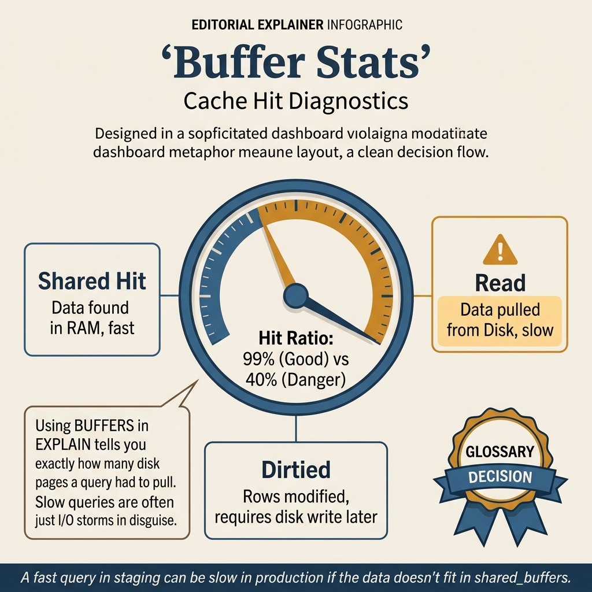
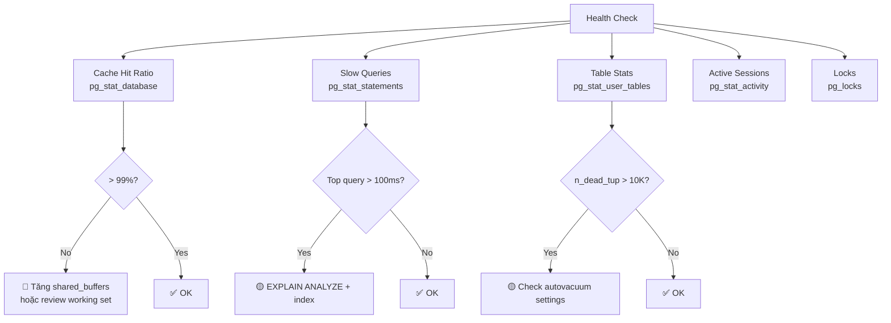

<!-- tags: sql, postgresql, database -->
# 📊 06 — Buffer Stats & Monitoring

> **Tóm tắt**: "Nếu bạn không đo, bạn không biết." — pg_stat views, cache hit ratio, slow queries, alerts.

---

📅 Ngày tạo: 2026-03-20 · 🔄 Cập nhật: 2026-04-04 · ⏱️ 15 phút đọc

---

## 1. DEFINE

Team lead hỏi: _"Database có healthy không?"_ Bạn trả lời: _"Ừ, chạy bình thường."_ Hai tuần sau, bảng `orders` có query chậm 10x — `pg_stat_user_tables` cho thấy index `idx_orders_status` không được dùng từ 3 tháng nay, sequential scan trên bảng 50M rows cứ chạy mà không ai biết.

Vấn đề: "bình thường" không phải metric. Bạn không có baseline, không có dashboard, không có alert. Khi incident xảy ra, bạn phải đào từ đầu — mất 30 phút chỉ để hiểu chuyện gì đang xảy ra.

`pg_stat` views là **hộp đen** mà PostgreSQL mở sẵn cho bạn: cache hit ratio, index usage, table bloat, active locks, slow queries. Bài này biến các con số đó thành health check dashboard bạn chạy được trong 30 giây.

Khi CPU chưa cao mà query vẫn chậm, câu hỏi đáng giá nhất thường không phải “có thiếu index không” mà là “dữ liệu đang được đọc từ đâu”. Buffer hit, read, temp spill và cache churn là những tín hiệu rất dễ bỏ qua nếu chỉ nhìn thời gian chạy cuối cùng.

Bài này biến các chỉ số buffer thành ngôn ngữ chẩn đoán: đâu là dấu hiệu của cache nóng, đâu là tín hiệu working set vượt giới hạn, và đâu là lúc bạn nên dừng tối ưu query để nhìn lại memory behavior.

| Variant | Mô tả |
| --- | --- |
| pg_stat_database | Stats toàn database: cache hit, transactions, deadlocks |
| pg_stat_user_tables | Stats per table: seq scan, index scan, dead tuples |
| pg_stat_user_indexes | Stats per index: scans, size |
| pg_statio_user_tables | I/O per table: blocks hit vs read |

| Approach | Time | Space | Khi chọn |
| --- | --- | --- | --- |
| Health Check Dashboard — 1 query xem tổng quan | Phụ thuộc cardinality | Phụ thuộc row width | Dùng để nắm baseline semantics trước khi tune planner hoặc index. |
| pg_stat_statements — Top slow queries | Phụ thuộc plan | Phụ thuộc memory operator | Dùng khi query đã chạm index, cardinality hoặc join strategy. |
| Active connections & long — running queries | Phụ thuộc workload | Phụ thuộc buffer/WAL | Dùng khi workload production cần cân bằng correctness, lock và rollout. |
| Table & Index size analysis | Phụ thuộc incident path | Phụ thuộc replication/cache | Dùng khi cần operational playbook, incident response hoặc phối hợp nhiều kỹ thuật. |


| View                      | Mô tả                                                   |
| ------------------------- | ------------------------------------------------------- |
| **pg_stat_database**      | Stats toàn database: cache hit, transactions, deadlocks |
| **pg_stat_user_tables**   | Stats per table: seq scan, index scan, dead tuples      |
| **pg_stat_user_indexes**  | Stats per index: scans, size                            |
| **pg_statio_user_tables** | I/O per table: blocks hit vs read                       |
| **pg_stat_bgwriter**      | Background writer + checkpoint stats                    |
| **pg_stat_activity**      | Active connections, running queries                     |
| **pg_stat_statements**    | Top queries by time/calls (extension)                   |

---

Các failure mode trên nghe rõ. Nhưng có trap: pg_stat_statements reset = mất baseline, và monitoring không alert = vấn đề phát hiện quá trễ. Trap đó sẽ xuất hiện ở PITFALLS.

## 2. VISUAL

Với Buffer Stats & Monitoring, vocabulary thôi không cứu được bạn. Bottleneck chỉ lộ mặt khi plan, timeline hoặc đường đi của bộ nhớ và I/O được đặt lên bàn cùng lúc.




*Hình: 4 symptom phổ biến trên production — cache hit thấp, table bloat, slow query, lock contention. Mỗi symptom chỉ tới pg_stat view khác nhau.*

### Level 1

```
pg_stat_activity        ← active connections, queries, wait events
pg_stat_user_tables     ← table-level stats (seq_scan, idx_scan, n_dead_tup)
pg_stat_user_indexes    ← index usage (idx_scan, idx_tup_read)
pg_statio_user_tables   ← buffer hits vs disk reads (cache hit ratio)
pg_stat_statements      ← top N slow queries (requires extension)

Monitoring flow:
  Low cache hit ratio  →  increase shared_buffers
  High n_dead_tup      →  VACUUM more aggressively
  High seq_scan        →  add index
  High waiting         →  check pg_stat_activity wait_event
```

*Hình: Level 1 cho 📊 06 — Buffer Stats & Monitoring — nhìn vào happy path hoặc baseline heuristic trước khi đi sâu vào planner và trade-off.*

### Level 2

```text
Decision Lens                 Dấu hiệu cần nhìn                 Hướng xử lý
---------------------------  --------------------------------  -------------------------------------------
Semantics trước               Kết quả có đúng intent không?    1. Health Check Dashboard  —  1 query xem tổng quan
Planner / index signal        Cardinality, cost, buffers ra sao? 2. pg_stat_statements  —  Top slow queries
Production pressure           Lock, WAL, lag, rollback nào đau? 3. Active connections & long — running queries
```

*Hình: Level 2 biến 📊 06 — Buffer Stats & Monitoring thành checklist quyết định — từ semantics, sang plan signal, rồi đến áp lực production.*


### Architecture — PostgreSQL Health Check Flow



*Hình: Health check dashboard đọc 5 pg_stat views — mỗi view trả lời một câu hỏi khác nhau. Cache < 99% = memory, slow query = index, dead tuples = vacuum.*

---
## 3. CODE

Khi tín hiệu trực quan của Buffer Stats & Monitoring đã rõ, ta chuyển sang truy vấn, lệnh chẩn đoán và playbook có thể chạy thật. Bắt đầu từ baseline đơn giản rồi tăng dần áp lực workload.

### Problem 1: Basic — Health Check Dashboard — 1 query xem tổng quan

> **Mục tiêu**: Minh họa cách áp dụng **📊 06 — Buffer Stats & Monitoring** qua ví dụ `Health Check Dashboard — 1 query xem tổng quan` trong đúng ngữ cảnh schema, query hoặc vận hành.


```sql
-- ━━━━━━━━━━━━━━━━━━━━━━━━━━━━━━━━━━━━━━━━━
-- PostgreSQL Health Check — chạy 1 lần thấy toàn cảnh
-- ━━━━━━━━━━━━━━━━━━━━━━━━━━━━━━━━━━━━━━━━━
WITH db_stats AS (
    SELECT * FROM pg_stat_database WHERE datname = current_database()
),
bgw AS (
    SELECT * FROM pg_stat_bgwriter
)
SELECT
    -- Cache
    ROUND(100.0 * d.blks_hit / GREATEST(d.blks_hit + d.blks_read, 1), 2) AS cache_hit_pct,

    -- Transactions
    d.xact_commit AS commits,
    d.xact_rollback AS rollbacks,
    ROUND(100.0 * d.xact_rollback / GREATEST(d.xact_commit + d.xact_rollback, 1), 2) AS rollback_pct,

    -- Deadlocks
    d.deadlocks,

    -- Temp files (sort spill)
    d.temp_files,
    pg_size_pretty(d.temp_bytes) AS temp_size,

    -- Checkpoints
    b.checkpoints_timed AS checkpoint_scheduled,
    b.checkpoints_req AS checkpoint_forced,

    -- Buffer writes
    b.buffers_checkpoint AS buf_by_checkpoint,
    b.buffers_backend AS buf_by_backend,       -- should be LOW!
    b.buffers_clean AS buf_by_bgwriter

FROM db_stats d, bgw b;

-- ━━━━━━━━━━━━━━━━━━━━━━━━━━━━━━━━━━━━━━━━━
-- Đọc kết quả:
-- ━━━━━━━━━━━━━━━━━━━━━━━━━━━━━━━━━━━━━━━━━
-- cache_hit_pct < 99%           → tăng shared_buffers
-- rollback_pct > 5%             → app có nhiều error
-- deadlocks > 0                 → cần fix app logic
-- temp_files > 0                → tăng work_mem
-- checkpoint_forced > timed     → tăng max_wal_size
-- buf_by_backend > 0 (nhiều)    → bgwriter settings kém
```


---

Buffer stats đã cover. Nhưng pg_stat_statements cần query-level insight — hãy enable.

### Problem 2: Intermediate — pg_stat_statements — Top slow queries

> **Mục tiêu**: Minh họa cách áp dụng **📊 06 — Buffer Stats & Monitoring** qua ví dụ `pg_stat_statements — Top slow queries` trong đúng ngữ cảnh schema, query hoặc vận hành.


```sql
-- ━━━━━━━━━━━━━━━━━━━━━━━━━━━━━━━━━━━━━━━━━
-- Enable pg_stat_statements
-- ━━━━━━━━━━━━━━━━━━━━━━━━━━━━━━━━━━━━━━━━━
-- postgresql.conf:
-- shared_preload_libraries = 'pg_stat_statements'
-- → Restart required!

CREATE EXTENSION IF NOT EXISTS pg_stat_statements;

-- ━━━━━━━━━━━━━━━━━━━━━━━━━━━━━━━━━━━━━━━━━
-- Top 10 queries by TOTAL time
-- ━━━━━━━━━━━━━━━━━━━━━━━━━━━━━━━━━━━━━━━━━
SELECT
    ROUND(total_exec_time::numeric, 2) AS total_ms,
    calls,
    ROUND((total_exec_time / calls)::numeric, 2) AS avg_ms,
    ROUND((shared_blks_hit * 100.0 / GREATEST(shared_blks_hit + shared_blks_read, 1))::numeric, 1) AS cache_hit_pct,
    rows,
    LEFT(query, 100) AS query_preview
FROM pg_stat_statements
WHERE dbid = (SELECT oid FROM pg_database WHERE datname = current_database())
ORDER BY total_exec_time DESC
LIMIT 10;

-- ━━━━━━━━━━━━━━━━━━━━━━━━━━━━━━━━━━━━━━━━━
-- Top 10 queries by AVG time (slowest per call)
-- ━━━━━━━━━━━━━━━━━━━━━━━━━━━━━━━━━━━━━━━━━
SELECT
    ROUND((total_exec_time / calls)::numeric, 2) AS avg_ms,
    calls,
    ROUND(total_exec_time::numeric, 2) AS total_ms,
    LEFT(query, 100) AS query_preview
FROM pg_stat_statements
WHERE calls > 10
  AND dbid = (SELECT oid FROM pg_database WHERE datname = current_database())
ORDER BY (total_exec_time / calls) DESC
LIMIT 10;

-- ━━━━━━━━━━━━━━━━━━━━━━━━━━━━━━━━━━━━━━━━━
-- Reset stats (sau khi optimize):
-- ━━━━━━━━━━━━━━━━━━━━━━━━━━━━━━━━━━━━━━━━━
SELECT pg_stat_statements_reset();
```

**Tại sao?** Ở mức Intermediate của Buffer Stats & Monitoring, câu hỏi không còn là “query có chạy không” mà là “tín hiệu nào đang làm PostgreSQL đổi chiến lược”. Problem 2: Intermediate — pg_stat_statements — Top slow queries ép bạn đọc cardinality, buffer hoặc execution path thay vì sửa theo cảm giác.


---

Query stats đã cover. Nhưng alerting cần thresholds — hãy define.

### Problem 3: Advanced — Active connections & long-running queries

> **Mục tiêu**: Minh họa cách áp dụng **📊 06 — Buffer Stats & Monitoring** qua ví dụ `Active connections & long-running queries` trong đúng ngữ cảnh schema, query hoặc vận hành.


```sql
-- ━━━━━━━━━━━━━━━━━━━━━━━━━━━━━━━━━━━━━━━━━
-- Active connections overview
-- ━━━━━━━━━━━━━━━━━━━━━━━━━━━━━━━━━━━━━━━━━
SELECT
    state,
    COUNT(*) AS count,
    ROUND(AVG(EXTRACT(EPOCH FROM (NOW() - state_change)))::numeric, 1) AS avg_seconds
FROM pg_stat_activity
WHERE datname = current_database()
GROUP BY state
ORDER BY count DESC;

-- state       | count | avg_seconds
-- idle        | 45    | 120.5
-- active      | 3     | 0.5
-- idle in tx  | 2     | 300.0    ← 🔴 NGUY HIỂM! Block VACUUM!

-- ━━━━━━━━━━━━━━━━━━━━━━━━━━━━━━━━━━━━━━━━━
-- Long-running queries — potential blockers
-- ━━━━━━━━━━━━━━━━━━━━━━━━━━━━━━━━━━━━━━━━━
SELECT
    pid,
    NOW() - query_start AS duration,
    state,
    wait_event_type,
    LEFT(query, 80) AS query
FROM pg_stat_activity
WHERE state = 'active'
  AND query_start < NOW() - interval '30 seconds'
ORDER BY query_start;

-- ━━━━━━━━━━━━━━━━━━━━━━━━━━━━━━━━━━━━━━━━━
-- Blocked queries (waiting for locks)
-- ━━━━━━━━━━━━━━━━━━━━━━━━━━━━━━━━━━━━━━━━━
SELECT
    blocked.pid AS blocked_pid,
    blocked.query AS blocked_query,
    blocking.pid AS blocking_pid,
    blocking.query AS blocking_query
FROM pg_stat_activity blocked
JOIN pg_locks bl ON bl.pid = blocked.pid AND NOT bl.granted
JOIN pg_locks gl ON gl.locktype = bl.locktype
    AND gl.database = bl.database
    AND gl.relation = bl.relation
    AND gl.granted
JOIN pg_stat_activity blocking ON blocking.pid = gl.pid
WHERE blocked.pid != blocking.pid;

-- ━━━━━━━━━━━━━━━━━━━━━━━━━━━━━━━━━━━━━━━━━
-- Kill long-running query (if needed)
-- ━━━━━━━━━━━━━━━━━━━━━━━━━━━━━━━━━━━━━━━━━
SELECT pg_cancel_backend(12345);     -- cancel query (graceful)
SELECT pg_terminate_backend(12345);  -- terminate connection (force)
```


---

### Problem 4: Expert — Table & Index size analysis

> **Mục tiêu**: Minh họa cách áp dụng **📊 06 — Buffer Stats & Monitoring** qua ví dụ `Table & Index size analysis` trong đúng ngữ cảnh schema, query hoặc vận hành.


```sql
-- ━━━━━━━━━━━━━━━━━━━━━━━━━━━━━━━━━━━━━━━━━
-- Top tables by size
-- ━━━━━━━━━━━━━━━━━━━━━━━━━━━━━━━━━━━━━━━━━
SELECT
    relname AS table_name,
    pg_size_pretty(pg_table_size(relid)) AS table_size,
    pg_size_pretty(pg_indexes_size(relid)) AS index_size,
    pg_size_pretty(pg_total_relation_size(relid)) AS total_size,
    n_live_tup AS rows
FROM pg_stat_user_tables
ORDER BY pg_total_relation_size(relid) DESC
LIMIT 10;

-- ━━━━━━━━━━━━━━━━━━━━━━━━━━━━━━━━━━━━━━━━━
-- Database total size
-- ━━━━━━━━━━━━━━━━━━━━━━━━━━━━━━━━━━━━━━━━━
SELECT
    pg_size_pretty(pg_database_size(current_database())) AS db_size;
```


---
Bạn đã đi qua buffer stats, query stats, và alerting. Bây giờ đến phần nguy hiểm: lost baseline và late detection — trap đã được setup từ đầu bài.

## 4. PITFALLS

Buffer Stats & Monitoring rất dễ bị dùng theo phản xạ: thấy chậm là thêm index, thấy lag là tăng tài nguyên. Phần dưới đây gom những lỗi tối ưu tưởng đúng nhưng lại làm latency, lock hoặc chi phí vận hành tệ hơn.

| # | Severity | Lỗi | Hậu quả | Fix |
| --- | --- | --- | --- | --- |
| 1 | 🔴 Fatal | Không có monitoring → incident discovery chậm 30+ phút | Query chậm dần trong tuần, team chỉ phát hiện khi user complaint — MTTR tăng gấp 5 | Setup pg_stat_statements + cache ratio alert < 99% |
| 2 | 🟡 Common | Đọc cache_hit_ratio ngay sau restart | shared_buffers trống sau restart → ratio 0% → panic không cần thiết | Chờ warm-up 10-30 phút rồi mới đọc metrics |
| 3 | 🟡 Common | Monitor slow queries bằng `log_min_duration_statement` alone | Chỉ thấy query chậm AT THAT MOMENT, không aggregate trend | Dùng `pg_stat_statements` — track cumulative stats: total_time, calls, mean_time |
| 4 | 🟡 Common | Unused index chiếm disk + làm chậm writes nhưng không biết | Index 2GB không ai query — mỗi INSERT phải cập nhật index đó | Check `pg_stat_user_indexes WHERE idx_scan = 0 AND idx_size > '100MB'` |
| 5 | 🔵 Minor | pg_stat_statements không được reset định kỳ | Stats tích lũy nhiều tháng → top queries phản ánh history, không phải hiện tại | Reset mỗi deploy hoặc mỗi tuần: `SELECT pg_stat_statements_reset()` |

---
Bạn đã đi qua Buffer & Stats Monitoring và cạm bẫy. Các resources dưới đây giúp đi sâu hơn.

## 5. REF

| Resource | Loại | Link | Ghi chú |
| --- | --- | --- | --- |
| Using EXPLAIN | Official docs | https://www.postgresql.org/docs/current/using-explain.html | Đọc plan, cost, rows, buffers. |
| Routine Vacuuming | Official docs | https://www.postgresql.org/docs/current/routine-vacuuming.html | Vacuum, analyze, bloat, autovacuum. |

---

## 6. RECOMMEND

Khi các bẫy thường gặp của Buffer Stats & Monitoring đã lộ mặt, bạn có thể nối bài này sang maintenance, replication hoặc triage workflow để quyết định tuning không bị cô lập.

| Tool               | Mô tả                                           |
| ------------------ | ----------------------------------------------- |
| **pgHero**         | Web dashboard — slow queries, index suggestions |
| **pgwatch2**       | Grafana monitoring với 200+ metrics             |
| **pg_stat_kcache** | CPU + real I/O stats per query                  |
| **auto_explain**   | Auto-log query plans cho slow queries           |


> **Callback** — Quay lại câu "database chạy bình thường" lúc đầu: giờ bạn có 5 con số cụ thể — cache ratio 99.8%, slow query top 1 là 120ms, dead tuples 2.3K, active sessions 12, no locks. Đó mới là "bình thường" có bằng chứng.

---

**Liên kết**: [← WAL](./05-wal-checkpoint.md) · [→ Query Optimization](./07-query-optimization.md)

---

## 7. QUICK REF

| Signal | View | Query |
| --- | --- | --- |
| Overall health | `pg_stat_database` | Cache hit ratio, temp files, deadlocks |
| Slow queries | `pg_stat_statements` | `ORDER BY mean_exec_time DESC LIMIT 10` |
| Table bloat | `pg_stat_user_tables` | `n_dead_tup`, `last_autovacuum` |
| Active sessions & locks | `pg_stat_activity` + `pg_locks` | `WHERE state != 'idle'` |
| Unused indexes | `pg_stat_user_indexes` | `WHERE idx_scan = 0 AND pg_relation_size(indexrelid) > 1048576` |
