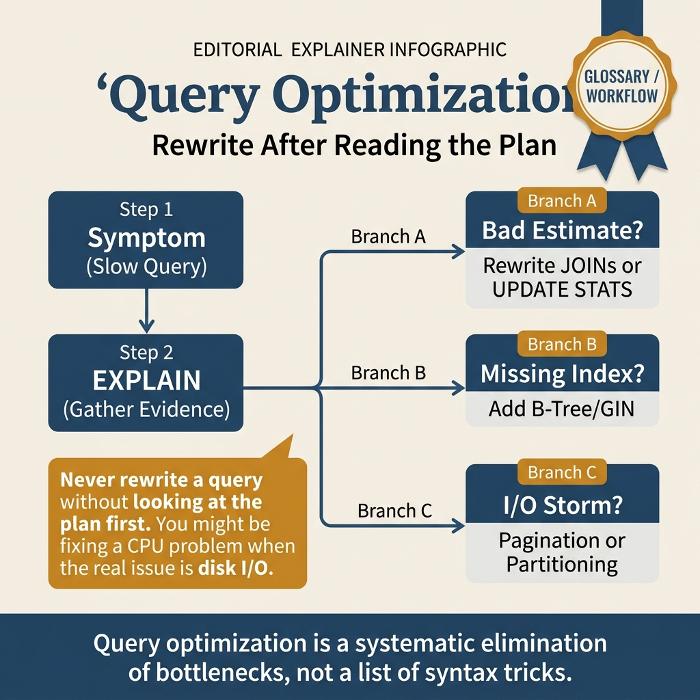
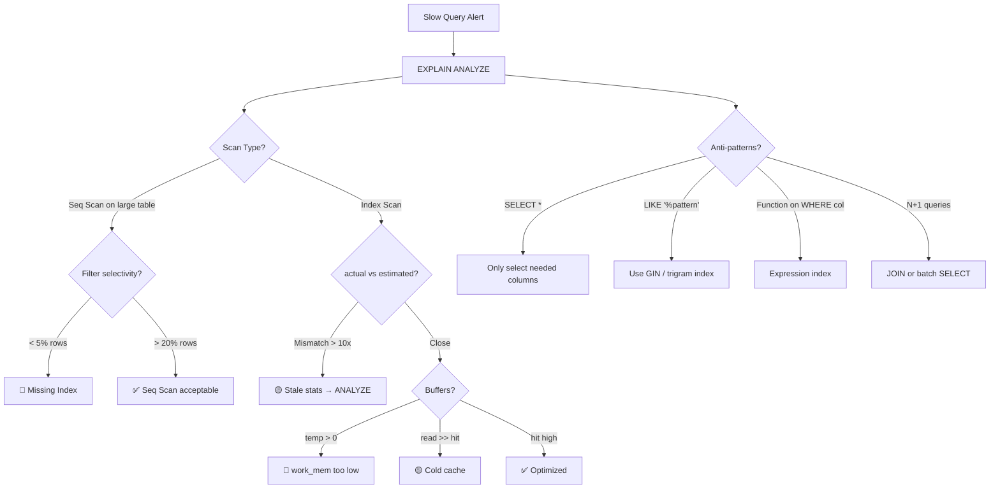

<!-- tags: sql, postgresql, database, query-optimization -->
# ⚡ 07 — Query Optimization — Rewriting, Anti-patterns & Combining Techniques

> Viết SQL hiệu quả: query rewriting patterns, anti-patterns phổ biến, kết hợp nhiều technique, và Go integration.

| Aspect           | Detail                                                                            |
| ---------------- | --------------------------------------------------------------------------------- |
| **Concept**      | Query rewriting, anti-pattern detection, combining optimization techniques        |
| **Use case**     | Tối ưu hóa queries chậm, viết SQL production-grade                                |
| **Go relevance** | pgx query building, prepared statements                                           |
| **Related**      | [02-EXPLAIN](./02-explain-analyze.md), [03-Indexing](./03-indexing-strategies.md) |

---

📅 Ngày tạo: 2026-03-19 · 🔄 Cập nhật: 2026-04-04 · ⏱️ 16 phút đọc

---

## 1. DEFINE

Code review ticket: _"SELECT * FROM users WHERE LOWER(email) = LOWER($1)"_. Query này chạy tốt trên staging (10K users). Production 5M users: **Seq Scan, 800ms**. Reviewer comment: _"Thêm index"_. Developer tạo `CREATE INDEX idx_email ON users(email)`. Push. Latency vẫn 800ms — index không được dùng vì `LOWER()` wrap column, planner không match index.

Fix đúng: `CREATE INDEX idx_email_lower ON users(LOWER(email))` — expression index chạy 0.3ms. Nhưng developer không biết pattern này, và reviewer cũng không catch được.

Query optimization không phải "viết SQL cho chạy" — nó là _nhận diện anti-pattern_ trước khi code lên production. Bài này gom các pattern thường gặp nhất: implicit cast, N+1, missing index on expression, wrong join order — và cách rewrite từng cái.

Một query report có thể chạy 40ms ở staging rồi thành 4 giây ở production chỉ vì cardinality, stats hoặc pattern truy cập đã đổi shape. Nếu không có workflow tối ưu rõ ràng, team rất dễ nhảy từ giả thuyết này sang giả thuyết khác mà không tích lũy được bằng chứng.

Bài này đóng khung tối ưu query như một chuỗi điều tra: xác nhận intent, đọc plan, kiểm tra selectivity, thử access path khác, rồi cân chi phí rollout thay vì săn mẹo tối ưu lẻ tẻ.

| Variant | Mô tả |
| --- | --- |
| 1 | SELECT chỉ cần · Tránh SELECT * — ít columns = ít I/O, enable Index Only Scan · ⭐⭐ |
| 2 | JOIN order · Small/filtered table trước → reduce intermediate result · ⭐⭐ |
| 3 | EXISTS vs IN · EXISTS short-circuits, IN builds full list · ⭐⭐ |
| 4 | CTE Materialization · PG 12+: NOT MATERIALIZED cho inline optimization · ⭐⭐ |

| Approach | Time | Space | Khi chọn |
| --- | --- | --- | --- |
| Anti — patterns & Rewrites | Phụ thuộc cardinality | Phụ thuộc row width | Dùng để nắm baseline semantics trước khi tune planner hoặc index. |
| N+1 Query Elimination & Batch Optimization | Phụ thuộc plan | Phụ thuộc memory operator | Dùng khi query đã chạm index, cardinality hoặc join strategy. |
| Combining Multiple Optimization Techniques | Phụ thuộc workload | Phụ thuộc buffer/WAL | Dùng khi workload production cần cân bằng correctness, lock và rollout. |


### Query Optimization Techniques

| #   | Technique               | Mô tả                                                          | Impact |
| --- | ----------------------- | -------------------------------------------------------------- | ------ |
| 1   | **SELECT chỉ cần**      | Tránh `SELECT *` — ít columns = ít I/O, enable Index Only Scan | ⭐⭐   |
| 2   | **JOIN order**          | Small/filtered table trước → reduce intermediate result        | ⭐⭐   |
| 3   | **EXISTS vs IN**        | EXISTS short-circuits, IN builds full list                     | ⭐⭐   |
| 4   | **CTE Materialization** | PG 12+: `NOT MATERIALIZED` cho inline optimization             | ⭐⭐   |
| 5   | **Batch operations**    | Multi-row INSERT/UPDATE, COPY protocol                         | ⭐⭐⭐ |
| 6   | **Keyset pagination**   | `WHERE id > X` thay `OFFSET N`                                 | ⭐⭐⭐ |
| 7   | **Covering indexes**    | INCLUDE columns → Index Only Scan                              | ⭐⭐⭐ |
| 8   | **Partial indexes**     | Index chỉ subset → nhỏ hơn, nhanh hơn                          | ⭐⭐⭐ |
| 9   | **Predicate pushdown**  | Đẩy WHERE vào subquery/CTE                                     | ⭐⭐   |
| 10  | **Avoid implicit cast** | `WHERE id = '42'` → cast, miss index                           | ⭐⭐   |

### Query Anti-patterns — Phát hiện & Fix

| Anti-pattern                     | Vấn đề                                    | Rewrite                       |
| -------------------------------- | ----------------------------------------- | ----------------------------- |
| `SELECT *`                       | Đọc columns không cần, no Index Only Scan | `SELECT id, name, status`     |
| `WHERE func(col) = val`          | Index bị vô hiệu hóa                      | Expression index hoặc rewrite |
| `OFFSET N` lớn                   | Scan N rows rồi bỏ                        | Keyset pagination             |
| `NOT IN (subquery)`              | NULL semantics sai + slow                 | `NOT EXISTS`                  |
| `SELECT COUNT(*)` on large table | Full table scan                           | `pg_class.reltuples`          |
| `OR` trên indexed columns        | Planner skip index                        | `UNION ALL`                   |
| Implicit type cast               | `WHERE int_col = '42'` miss index         | Explicit cast matching type   |
| N+1 queries                      | Loop + query per item                     | JOIN hoặc `IN ($ids)`         |
| `LIKE '%pattern%'`               | No BTree index usage                      | `pg_trgm` GIN index           |
| Large `IN (list)`                | > 1000 items slow                         | `= ANY($1::int[])` with array |

---

Các failure mode trên nghe dễ tránh. Nhưng có trap: function trong WHERE clause = index bypass, và implicit cast = wrong plan. Trap đó sẽ xuất hiện ở PITFALLS.

## 2. VISUAL

Với Query Optimization — Rewriting, Anti-patterns & Combining Techniques, vocabulary thôi không cứu được bạn. Bottleneck chỉ lộ mặt khi plan, timeline hoặc đường đi của bộ nhớ và I/O được đặt lên bàn cùng lúc.




*Hình: Query tuning loop — Identify (pg_stat_statements) → Analyze (EXPLAIN BUFFERS) → Fix (index/rewrite/tune) → Verify (re-EXPLAIN). Không skip bước nào.*

### Level 1

```text
Query chậm?
     │
     ▼
EXPLAIN (ANALYZE, BUFFERS)
     │
     ├── Seq Scan trên bảng lớn?
     │    ├── Có WHERE? → Tạo index cho WHERE columns
     │    ├── Function trong WHERE? → Expression index
     │    └── Trả > 20% rows? → Seq Scan hợp lý, optimize khác
     │
     ├── Index Scan nhưng chậm?
     │    ├── Rows estimate sai? → ANALYZE
     │    ├── Nhiều columns fetch? → Covering index (INCLUDE)
     │    └── Random I/O? → BRIN nếu sorted data
     │
     ├── Hash/Sort chiếm nhiều?
     │    ├── temp files? → Tăng work_mem
     │    └── Sort unnecessary? → Index ORDER BY
     │
     ├── Nested Loop chậm?
     │    ├── Inner Seq Scan? → Index trên join column
     │    └── Quá nhiều loops? → Rewrite JOIN
     │
     └── Good plan nhưng vẫn chậm?
          ├── Nhiều shared read? → Tăng shared_buffers
          ├── Network latency? → Batch operations
          └── Lock contention? → Xem deadlock doc
```

---

*Hình: Level 1 cho ⚡ 07 — Query Optimization — Rewriting, Anti-patterns & Combining Techniques — nhìn vào happy path hoặc baseline heuristic trước khi đi sâu vào planner và trade-off.*

### Level 2

```text
Decision Lens                 Dấu hiệu cần nhìn                 Hướng xử lý
---------------------------  --------------------------------  -------------------------------------------
Semantics trước               Kết quả có đúng intent không?    1. Anti — patterns & Rewrites
Planner / index signal        Cardinality, cost, buffers ra sao? 2. N+1 Query Elimination & Batch Optimization
Production pressure           Lock, WAL, lag, rollback nào đau? 3. Combining Multiple Optimization Techniques
```

*Hình: Level 2 biến ⚡ 07 — Query Optimization — Rewriting, Anti-patterns & Combining Techniques thành checklist quyết định — từ semantics, sang plan signal, rồi đến áp lực production.*


### Architecture — Query Anti-pattern Detection Flow



*Hình: Từ slow query → EXPLAIN → phân loại vấn đề → fix phù hợp. Anti-pattern phổ biến nhất: missing index, stale stats, SELECT *, function on WHERE.*

---
## 3. CODE

Khi tín hiệu trực quan của Query Optimization — Rewriting, Anti-patterns & Combining Techniques đã rõ, ta chuyển sang truy vấn, lệnh chẩn đoán và playbook có thể chạy thật. Bắt đầu từ baseline đơn giản rồi tăng dần áp lực workload.

### Problem 1: Basic — Anti-patterns & Rewrites

> **Mục tiêu**: Nhận diện và fix top 5 anti-patterns phổ biến nhất
> **Cần**: Bảng với data > 100K rows
> **Đạt được**: Queries nhanh hơn 5-100x


```sql
-- ═══════════════════════════════════════════
-- Anti-pattern 1: SELECT *
-- ═══════════════════════════════════════════

-- ❌ SELECT * — đọc TẤT CẢ columns, kể cả JSONB/TEXT lớn
EXPLAIN (ANALYZE, BUFFERS)
SELECT * FROM orders WHERE user_id = 42;
-- Buffers: shared hit=15  ← đọc 15 pages

-- ✅ SELECT columns cần → có thể Index Only Scan
CREATE INDEX idx_orders_user_covering
    ON orders(user_id)
    INCLUDE (id, amount, status, created_at);

EXPLAIN (ANALYZE, BUFFERS)
SELECT id, amount, status, created_at FROM orders WHERE user_id = 42;
-- Index Only Scan → Buffers: shared hit=3  ← 5x ít pages!

-- ═══════════════════════════════════════════
-- Anti-pattern 2: Function trong WHERE → miss index
-- ═══════════════════════════════════════════

-- ❌ lower() ngăn index usage
SELECT * FROM users WHERE lower(email) = 'alice@go.dev';
-- → Seq Scan (index on email NOT used!)

-- ✅ Fix 1: Expression index
CREATE INDEX idx_users_email_lower ON users(lower(email));

-- ✅ Fix 2: citext extension (case-insensitive text)
ALTER TABLE users ALTER COLUMN email TYPE citext;
-- Giờ: WHERE email = 'Alice@Go.dev' → dùng index, case-insensitive

-- ═══════════════════════════════════════════
-- Anti-pattern 3: NOT IN với NULL
-- ═══════════════════════════════════════════

-- ❌ NOT IN — fails silently khi subquery có NULL!
SELECT * FROM users
WHERE id NOT IN (SELECT manager_id FROM employees);
-- Nếu manager_id có NULL → trả 0 rows! (SQL standard behavior)

-- ✅ NOT EXISTS — handles NULL correctly
SELECT * FROM users u
WHERE NOT EXISTS (
    SELECT 1 FROM employees e WHERE e.manager_id = u.id
);

-- ═══════════════════════════════════════════
-- Anti-pattern 4: OR trên indexed columns
-- ═══════════════════════════════════════════

-- ❌ OR — planner thường skip index
SELECT * FROM orders
WHERE status = 'pending' OR status = 'processing';
-- → Có thể Seq Scan

-- ✅ Fix 1: IN (tương đương OR nhưng planner optimize tốt hơn)
SELECT * FROM orders WHERE status IN ('pending', 'processing');

-- ✅ Fix 2: UNION ALL (force 2 index scans)
SELECT * FROM orders WHERE status = 'pending'
UNION ALL
SELECT * FROM orders WHERE status = 'processing';

-- ═══════════════════════════════════════════
-- Anti-pattern 5: Large IN list → array
-- ═══════════════════════════════════════════

-- ❌ IN (1, 2, 3, ..., 10000) — parse overhead
SELECT * FROM products WHERE id IN (1, 2, 3, /* ... 10000 items */);

-- ✅ Array parameter — 1 bind, clean plan
SELECT * FROM products WHERE id = ANY($1::int[]);
-- Go: pool.Query(ctx, query, pgx.Identifier{"products"}, ids)
```

```go
// ✅ Go: Array parameter thay vì IN list
func (r *Repo) GetByIDs(ctx context.Context, ids []int64) ([]Product, error) {
    // ❌ BAD: fmt.Sprintf("WHERE id IN (%s)", joinIDs) → SQL injection!
    // ✅ GOOD: Array parameter
    rows, err := r.pool.Query(ctx,
        `SELECT id, name, price FROM products WHERE id = ANY($1)`,
        ids, // pgx auto-converts []int64 → PostgreSQL int8[]
    )
    if err != nil {
        return nil, err
    }
    defer rows.Close()
    return pgx.CollectRows(rows, pgx.RowToStructByName[Product])
}
```


---

Query rewrite đã cover. Nhưng join optimization cần statistics — hãy analyze.

### Problem 2: Intermediate — N+1 Query Elimination & Batch Optimization

> **Mục tiêu**: Detect và fix N+1 queries, optimize batch operations
> **Cần**: Multi-table relationships
> **Đạt được**: Từ N+1 (100 queries) → 1-2 queries


```sql
-- ═══════════════════════════════════════════
-- N+1 Problem — phổ biến nhất trong Go apps
-- ═══════════════════════════════════════════

-- ❌ N+1: 1 query lấy users + N queries lấy orders per user
-- Query 1: SELECT * FROM users LIMIT 100
-- Query 2: SELECT * FROM orders WHERE user_id = 1
-- Query 3: SELECT * FROM orders WHERE user_id = 2
-- ... 100 queries tổng!

-- ✅ Fix 1: JOIN (1 query)
SELECT u.id, u.name, o.id AS order_id, o.amount
FROM users u
LEFT JOIN orders o ON o.user_id = u.id
WHERE u.status = 'active'
ORDER BY u.id, o.created_at DESC;

-- ✅ Fix 2: Batch fetch (2 queries)
-- Query 1: SELECT id FROM users WHERE status = 'active' LIMIT 100
-- Query 2: SELECT * FROM orders WHERE user_id = ANY($1) ORDER BY user_id, created_at DESC
-- Application-side: group orders by user_id

-- ═══════════════════════════════════════════
-- Batch INSERT/UPDATE performance
-- ═══════════════════════════════════════════

-- Performance comparison (1000 rows):
-- Individual INSERT:   1000 round-trips, ~500ms
-- Multi-row INSERT:    1 round-trip,     ~10ms   (50x faster)
-- pgx Batch:           1 round-trip,     ~8ms    (60x faster)
-- COPY protocol:       1 round-trip,     ~2ms    (250x faster)

-- ✅ Multi-row INSERT
INSERT INTO orders (user_id, amount, status) VALUES
    (1, 100, 'pending'),
    (2, 200, 'pending'),
    (3, 300, 'pending')
    -- ... up to ~1000 rows per statement
;

-- ✅ Batch UPDATE with VALUES
UPDATE products SET
    price = v.new_price,
    updated_at = now()
FROM (VALUES
    (1, 29.99),
    (2, 39.99),
    (3, 49.99)
) AS v(id, new_price)
WHERE products.id = v.id;

-- ✅ UPSERT batch
INSERT INTO products (sku, name, price) VALUES
    ('SKU001', 'Widget', 9.99),
    ('SKU002', 'Gadget', 19.99)
ON CONFLICT (sku) DO UPDATE SET
    name = EXCLUDED.name,
    price = EXCLUDED.price,
    updated_at = now();
```

```go
// ✅ Go: Eliminate N+1 with batch fetch
func (r *Repo) GetUsersWithOrders(ctx context.Context, limit int) ([]UserWithOrders, error) {
    // Step 1: Get users
    users, err := r.getActiveUsers(ctx, limit)
    if err != nil {
        return nil, err
    }

    // Step 2: Batch fetch orders (1 query for all users)
    userIDs := make([]int64, len(users))
    for i, u := range users {
        userIDs[i] = u.ID
    }

    rows, err := r.pool.Query(ctx,
        `SELECT user_id, id, amount, status, created_at
         FROM orders
         WHERE user_id = ANY($1)
         ORDER BY user_id, created_at DESC`,
        userIDs,
    )
    if err != nil {
        return nil, err
    }
    defer rows.Close()

    // Step 3: Group orders by user_id
    orderMap := make(map[int64][]Order)
    for rows.Next() {
        var o Order
        var uid int64
        rows.Scan(&uid, &o.ID, &o.Amount, &o.Status, &o.CreatedAt)
        orderMap[uid] = append(orderMap[uid], o)
    }

    // Step 4: Combine
    result := make([]UserWithOrders, len(users))
    for i, u := range users {
        result[i] = UserWithOrders{User: u, Orders: orderMap[u.ID]}
    }
    return result, nil
}

// ✅ Go: COPY protocol for bulk insert (fastest)
func (r *Repo) BulkInsert(ctx context.Context, orders []Order) (int64, error) {
    rows := make([][]interface{}, len(orders))
    for i, o := range orders {
        rows[i] = []interface{}{o.UserID, o.Amount, o.Status, time.Now()}
    }
    return r.pool.CopyFrom(ctx,
        pgx.Identifier{"orders"},
        []string{"user_id", "amount", "status", "created_at"},
        pgx.CopyFromRows(rows),
    )
}
```

**Tại sao?** Ở mức Intermediate của Query Optimization — Rewriting, Anti-patterns & Combining Techniques, câu hỏi không còn là “query có chạy không” mà là “tín hiệu nào đang làm PostgreSQL đổi chiến lược”. Problem 2: Intermediate — N+1 Query Elimination & Batch Optimization ép bạn đọc cardinality, buffer hoặc execution path thay vì sửa theo cảm giác.


---

Join optimization đã cover. Nhưng production-grade tuning cần pg_stat_statements — hãy observe.

### Problem 3: Advanced — Combining Multiple Optimization Techniques

> **Mục tiêu**: Kết hợp CTE + partial index + covering index + keyset cho real-world query
> **Cần**: Complex filtering, sorting, pagination
> **Đạt được**: Query đạt <5ms trên bảng 10M+ rows


```sql
-- ═══════════════════════════════════════════
-- Scenario: E-commerce order dashboard API
-- Requirements:
--   - Filter by status, date range, amount
--   - Sort by created_at DESC
--   - Keyset pagination
--   - Show customer name + order summary
-- ═══════════════════════════════════════════

-- ✅ Step 1: Create targeted indexes
-- Partial index: chỉ index pending orders (10% of table)
CREATE INDEX CONCURRENTLY idx_orders_pending_created
    ON orders(created_at DESC, id DESC)
    INCLUDE (customer_id, amount, status)
    WHERE status IN ('pending', 'processing');

-- Covering index cho customer lookup
CREATE INDEX CONCURRENTLY idx_customers_id_name
    ON customers(id) INCLUDE (name, email);

-- ✅ Step 2: Optimized query với multiple techniques
WITH filtered_orders AS NOT MATERIALIZED (
    -- CTE NOT MATERIALIZED → planner pushes WHERE into index scan
    SELECT id, customer_id, amount, status, created_at
    FROM orders
    WHERE status IN ('pending', 'processing')     -- ✅ Matches partial index
      AND created_at BETWEEN $1 AND $2             -- ✅ Range scan on index
      AND amount >= $3                             -- ✅ Additional filter
      AND (created_at, id) < ($4, $5)             -- ✅ Keyset cursor
    ORDER BY created_at DESC, id DESC
    LIMIT 21  -- ✅ N+1 trick for hasMore
)
SELECT
    fo.id,
    fo.amount,
    fo.status,
    fo.created_at,
    c.name AS customer_name        -- ✅ Index Only Scan on customers
FROM filtered_orders fo
JOIN customers c ON c.id = fo.customer_id;

-- ✅ Step 3: Approximate count (fast)
SELECT reltuples::bigint FROM pg_class WHERE relname = 'orders';

-- ═══════════════════════════════════════════
-- EXPLAIN output after optimization:
-- ═══════════════════════════════════════════
-- Nested Loop (actual time=0.1..0.5 rows=21)
--   → Index Only Scan on idx_orders_pending_created (actual time=0.05..0.2 rows=21)
--       Index Cond: (created_at >= $1 AND created_at <= $2)
--       Filter: (amount >= $3 AND (created_at, id) < ($4, $5))
--       Heap Fetches: 0  ← ✅ Index Only Scan!
--   → Index Only Scan on idx_customers_id_name (actual time=0.01 rows=1 loops=21)
--       Heap Fetches: 0  ← ✅ Index Only Scan!
-- Execution Time: 0.8 ms  ← ✅ < 1ms trên 10M rows!
```


---
Bạn đã đi qua query rewrite, join optimization, và production tuning. Bây giờ đến phần nguy hiểm: function-based index bypass và implicit cast — trap đã được setup từ đầu bài.

## 4. PITFALLS

Query Optimization — Rewriting, Anti-patterns & Combining Techniques rất dễ bị dùng theo phản xạ: thấy chậm là thêm index, thấy lag là tăng tài nguyên. Phần dưới đây gom những lỗi tối ưu tưởng đúng nhưng lại làm latency, lock hoặc chi phí vận hành tệ hơn.

| # | Severity | Lỗi | Hậu quả | Fix |
| --- | --- | --- | --- | --- |
| 1 | 🔴 Fatal | N+1 query trong loop (ORM default) | 1000 orders → 1 SELECT orders + 1000 SELECT user cho mỗi order = 1001 queries, latency linear với data | Batch: `WHERE user_id = ANY($1)` hoặc JOIN. ORM: eager loading |
| 2 | 🔴 Fatal | SELECT * trên bảng có JSONB/TOAST columns | PostgreSQL decompress TOAST data cho mỗi row dù bạn không dùng — 10x slower trên bảng có JSON lớn | Chỉ SELECT columns cần thiết. Đặc biệt tránh SELECT * khi bảng có JSONB |
| 3 | 🟡 Common | Function trên WHERE column: `WHERE LOWER(email) = ...` | Planner không match B-Tree index trên `email` — luôn Seq Scan | Expression index: `CREATE INDEX ON users(LOWER(email))` |
| 4 | 🟡 Common | Implicit type cast: `WHERE id = '42'` (text vs int) | PostgreSQL cast mỗi row → func call per row → index bypass | Đảm bảo type match: `WHERE id = 42` (int = int) |
| 5 | 🔵 Minor | ORDER BY + LIMIT nhưng không có index cho sort column | PostgreSQL sort toàn bộ result set rồi mới LIMIT — chậm trên bảng lớn | Index trên sort column hoặc composite index matching WHERE + ORDER BY |

---
Bạn đã đi qua Query Optimization và cạm bẫy. Các resources dưới đây giúp đi sâu hơn.

## 5. REF

| Resource              | Link                                                                                                           |
| --------------------- | -------------------------------------------------------------------------------------------------------------- |
| Use The Index, Luke   | [use-the-index-luke.com](https://use-the-index-luke.com/)                                                      |
| PG Query Optimization | [wiki.postgresql.org/wiki/Performance_Optimization](https://wiki.postgresql.org/wiki/Performance_Optimization) |
| pgx Batch             | [github.com/jackc/pgx](https://github.com/jackc/pgx)                                                           |
| COPY Protocol         | [postgresql.org/docs/current/sql-copy.html](https://www.postgresql.org/docs/current/sql-copy.html)             |

---

## 6. RECOMMEND

Khi các bẫy thường gặp của Query Optimization — Rewriting, Anti-patterns & Combining Techniques đã lộ mặt, bạn có thể nối bài này sang maintenance, replication hoặc triage workflow để quyết định tuning không bị cô lập.

| Mở rộng                 | Khi nào                | Lý do                                                                                        |
| ----------------------- | ---------------------- | -------------------------------------------------------------------------------------------- |
| **Pagination chi tiết** | API endpoints          | Xem [03-pagination-techniques.md](../postgresql/performance/03-pagination-techniques.md)     |
| **CTE + Recursive**     | Hierarchical data      | Xem [02-cte-recursive-lateral.md](../postgresql/advanced/02-cte-recursive-lateral.md)        |
| **Query Analysis**      | Production debugging   | Xem [04-query-analysis-workflow.md](../postgresql/performance/04-query-analysis-workflow.md) |
| **Prepared Statements** | High-frequency queries | Reduce parse overhead                                                                        |
| **Materialized Views**  | Dashboard/reporting    | Pre-compute expensive aggregations                                                           |


> **Callback** — Quay lại `LOWER(email)` 800ms lúc đầu: expression index `ON users(LOWER(email))` → 0.3ms. Pattern đã rõ: function trên column = planner ignore index. Giờ bạn catch được trước khi code review pass.

---

**Liên kết**: [← Buffer Stats](./06-buffer-stats-monitoring.md) · [→ Connection Pooling](./08-connection-pooling.md)

---

## 7. QUICK REF

| Anti-pattern | Hậu quả | Fix |
| --- | --- | --- |
| `SELECT *` trên bảng có TOAST/JSONB | Decompress toàn bộ, 10x slower | Chỉ SELECT columns cần |
| `WHERE LOWER(col) = ...` | Index bypass, Seq Scan | Expression index: `ON (LOWER(col))` |
| `WHERE id = '42'` (type mismatch) | Implicit cast per row | Match types: `WHERE id = 42` |
| N+1 query trong ORM loop | 1+N queries, linear latency | JOIN hoặc `WHERE id = ANY($1)` |
| `LIKE '%pattern'` | Leading wildcard = Seq Scan | `pg_trgm` GIN index |
