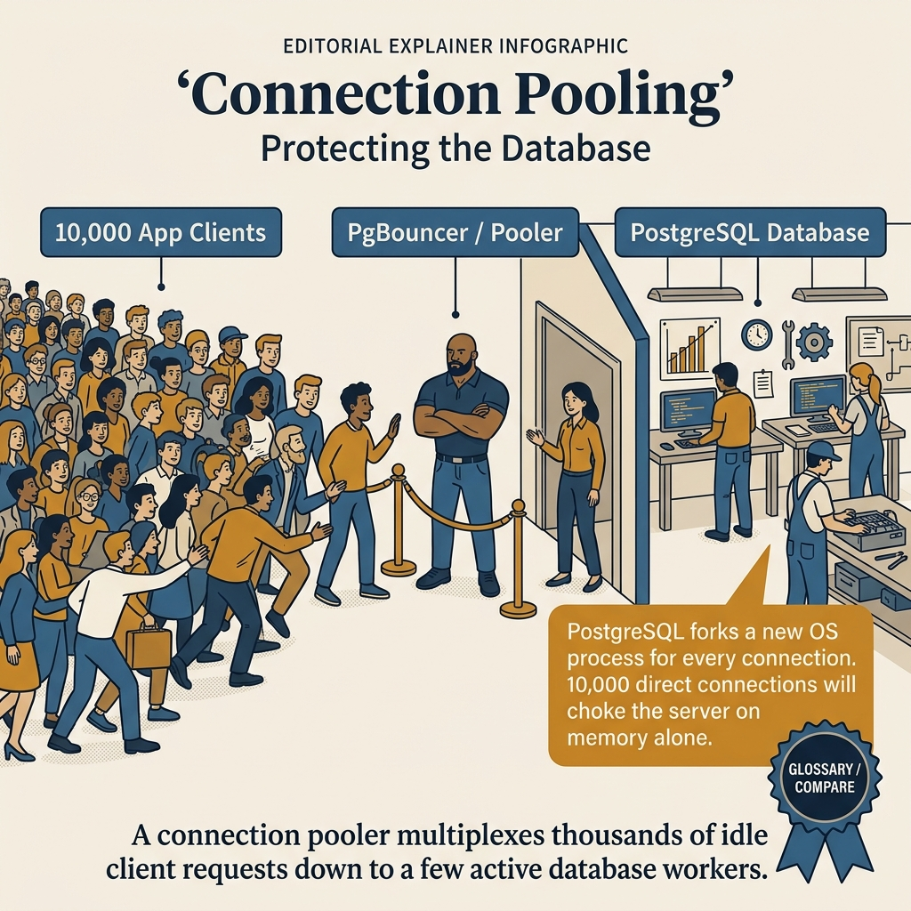
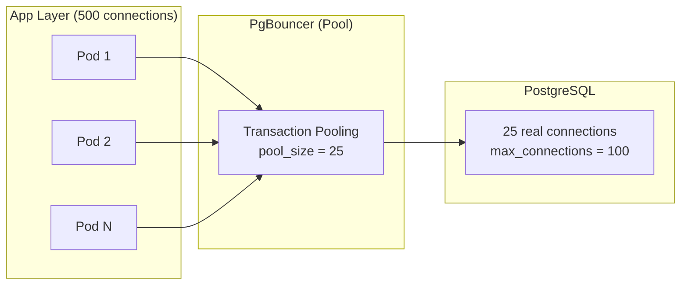

<!-- tags: sql, postgresql, database -->
# 🔌 08 — Connection Pooling — PgBouncer, pgx Pool & Production Patterns

> PostgreSQL fork process per connection (~5-10MB RAM). PgBouncer + pgx pool config → giảm 10x connections, tăng 5x throughput.

| Aspect           | Detail                                                 |
| ---------------- | ------------------------------------------------------ |
| **Concept**      | Connection pooling, PgBouncer, pgx pool tuning         |
| **Use case**     | High-concurrency apps, serverless, microservices       |
| **Go relevance** | pgxpool config, connection lifecycle                   |
| **DBA Roadmap**  | Connection Pooling → PgBouncer, PgBouncer Alternatives |

---

📅 Ngày tạo: 2026-03-19 · 🔄 Cập nhật: 2026-04-04 · ⏱️ 14 phút đọc

---

## 1. DEFINE

5PM Friday deploy. Traffic bình thường. 6PM: marketing push notification cho 2 triệu users. Connection count tăng từ 50 lên 300 trong 2 phút. PostgreSQL log: _"FATAL: sorry, too many clients already"_. `max_connections = 100`, mỗi connection tốn ~5-10MB RAM — 300 connections cần 3GB RAM chỉ riêng cho connection overhead.

Team tăng `max_connections = 500`. Latency vẫn tệ — giờ 500 connections cùng tranh CPU và shared_buffers. Context switching giết throughput.

Vấn đề không phải cần _nhiều_ connections — mà cần _ít_ connections được _tái sử dụng_ hiệu quả. PgBouncer giữ pool 20-30 connections thật tới PostgreSQL và multiplexing 500 connections từ app. Kết quả: 500 app connections → 25 real DB connections → throughput tăng 5x, RAM giảm 10x.

Nhiều hệ thống chết vì quá nhiều kết nối trước khi chết vì quá ít index. Mỗi session PostgreSQL đều mang theo memory và scheduling cost riêng, nên việc “cứ mở thêm connection” thường chỉ chuyển áp lực từ app sang database.

Bài này giải thích connection pooling như một lớp điều tiết áp lực: giới hạn số backend thật, bảo vệ memory, làm phẳng burst traffic, và tránh để database tiêu hao phần lớn thời gian chỉ để quản lý kết nối.

| Variant | Mô tả |
| --- | --- |
| session | Client owns conn for entire session · ✅ · ✅ · ✅ · Legacy apps |
| transaction | Release after each TX commit/rollback · ✅ · ❌ · ❌ default · ✅ Recommended! |
| statement | Release after each statement · ❌ · ❌ · ❌ · Simple queries |

| Approach | Time | Space | Khi chọn |
| --- | --- | --- | --- |
| pgxpool Configuration | Phụ thuộc cardinality | Phụ thuộc row width | Dùng để nắm baseline semantics trước khi tune planner hoặc index. |
| PgBouncer Config + Go App Integration | Phụ thuộc plan | Phụ thuộc memory operator | Dùng khi query đã chạm index, cardinality hoặc join strategy. |
| Connection Pool Sizing & Troubleshooting | Phụ thuộc workload | Phụ thuộc buffer/WAL | Dùng khi workload production cần cân bằng correctness, lock và rollout. |


### Tại sao cần Connection Pooling?

```text
❌ KHÔNG có pooling:
┌──────────┐     ┌───────────────────────────────┐
│ App: 500 │────→│ PostgreSQL: 500 processes       │
│ requests │     │ RAM: 500 × 10MB = 5GB           │
│          │     │ + fork overhead + context switch │
└──────────┘     └───────────────────────────────┘

✅ CÓ PgBouncer:
┌──────────┐     ┌──────────────┐     ┌───────────────────┐
│ App: 500 │────→│ PgBouncer:   │────→│ PostgreSQL: 30     │
│ requests │     │ 500 clients  │     │ processes           │
│          │     │ → 30 servers │     │ RAM: 300MB only     │
└──────────┘     └──────────────┘     └───────────────────┘

✅ CÓ pgx Pool (Go application-side):
┌────────────────────────────┐     ┌───────────────────┐
│ Go App:                    │     │ PostgreSQL: 25      │
│ pgxpool.Pool               │────→│ processes           │
│ MaxConns: 25               │     │                     │
│ MinConns: 5 (warm)         │     │                     │
│ 100 goroutines share pool  │     │                     │
└────────────────────────────┘     └───────────────────┘
```

### Pool Modes (PgBouncer)

| Mode            | Connection lifecycle                  | TX support | Session vars | Prepared stmts | Dùng cho            |
| --------------- | ------------------------------------- | ---------- | ------------ | -------------- | ------------------- |
| **session**     | Client owns conn for entire session   | ✅         | ✅           | ✅             | Legacy apps         |
| **transaction** | Release after each TX commit/rollback | ✅         | ❌           | ❌ default     | ✅ **Recommended!** |
| **statement**   | Release after each statement          | ❌         | ❌           | ❌             | Simple queries      |

### pgx Pool vs PgBouncer

| Feature              | pgxpool (Go-side)   | PgBouncer (proxy)            |
| -------------------- | ------------------- | ---------------------------- |
| **Location**         | In-process          | External process             |
| **Overhead**         | Zero (same process) | Network hop (~0.1ms)         |
| **Prepared stmts**   | ✅ Full support     | ⚠️ transaction mode: limited |
| **Connection limit** | Per Go instance     | Shared across all apps       |
| **Health checks**    | ✅ Built-in         | ✅ Built-in                  |
| **Multi-language**   | Go only             | Any language                 |
| **Combo**            | ✅ Use together     | ✅ Use together              |

### Failure Modes

| Lỗi                   | Nguyên nhân                              | Fix                                   |
| --------------------- | ---------------------------------------- | ------------------------------------- |
| Connection exhaustion | Pool too small for load                  | Increase pool + add PgBouncer         |
| Idle in transaction   | Goroutine holds conn in TX               | `idle_in_transaction_session_timeout` |
| Connection refused    | `max_connections` reached                | PgBouncer + queueing                  |
| Leaked connections    | Forgot `rows.Close()` / `conn.Release()` | `defer` immediately                   |
| Double pooling        | pgxpool → PgBouncer → PG                 | Align pool sizes                      |

---

Các failure mode trên nghe cơ bản. Nhưng có trap: pool size quá lớn = context switching overhead, và transaction mode PgBouncer = prepared statements fail. Trap đó sẽ xuất hiện ở PITFALLS.

## 2. VISUAL

Với Connection Pooling — PgBouncer, pgx Pool & Production Patterns, vocabulary thôi không cứu được bạn. Bottleneck chỉ lộ mặt khi plan, timeline hoặc đường đi của bộ nhớ và I/O được đặt lên bàn cùng lúc.




*Hình: 3 pool mode — Session (safe, ít chia sẻ), Transaction (default, balance tốt), Statement (aggressive, chỉ read-only). Chọn sai mode = connection leak hoặc broken transaction.*

### Level 1

```text
Goroutine A:                     pgxpool:                  PostgreSQL:
   pool.Query()                  ┌─────────────────┐
     │                           │ Conns: [C1, C2] │
     ├── Acquire conn C1 ──────→│ Conns: [C2]     │──── C1 busy ──→ PG
     │                           │                  │
     ├── Execute query           │                  │
     │                           │                  │
     ├── rows.Close()            │                  │
     │                           │                  │
     └── Release C1 ───────────→│ Conns: [C1, C2] │──── C1 idle ──→ PG
                                 └─────────────────┘

Goroutine B (concurrent):
   pool.Begin()
     ├── Acquire conn C2
     ├── INSERT ...
     ├── UPDATE ...
     ├── tx.Commit()
     └── Release C2              ← Connection returned to pool
```

---

*Hình: Level 1 cho 🔌 08 — Connection Pooling — PgBouncer, pgx Pool & Production Patterns — nhìn vào happy path hoặc baseline heuristic trước khi đi sâu vào planner và trade-off.*

### Level 2

```text
Decision Lens                 Dấu hiệu cần nhìn                 Hướng xử lý
---------------------------  --------------------------------  -------------------------------------------
Semantics trước               Kết quả có đúng intent không?    1. pgxpool Configuration
Planner / index signal        Cardinality, cost, buffers ra sao? 2. PgBouncer Config + Go App Integration
Production pressure           Lock, WAL, lag, rollback nào đau? 3. Connection Pool Sizing & Troubleshooting
```

*Hình: Level 2 biến 🔌 08 — Connection Pooling — PgBouncer, pgx Pool & Production Patterns thành checklist quyết định — từ semantics, sang plan signal, rồi đến áp lực production.*


### Architecture — Connection Pooling with PgBouncer



*Hình: 500 app connections → PgBouncer multiplex → 25 real DB connections. PostgreSQL xử lý 25 concurrent queries thay vì 500 context switches. RAM giảm 10x.*

---
## 3. CODE

Khi tín hiệu trực quan của Connection Pooling — PgBouncer, pgx Pool & Production Patterns đã rõ, ta chuyển sang truy vấn, lệnh chẩn đoán và playbook có thể chạy thật. Bắt đầu từ baseline đơn giản rồi tăng dần áp lực workload.

### Problem 1: Basic — pgxpool Configuration

> **Mục tiêu**: Optimal pgxpool config cho production Go application
> **Cần**: pgx v5+
> **Đạt được**: Stable high-concurrency database access


```go
package database

import (
    "context"
    "fmt"
    "log/slog"
    "time"

    "github.com/jackc/pgx/v5/pgxpool"
)

func NewPool(ctx context.Context, databaseURL string) (*pgxpool.Pool, error) {
    config, err := pgxpool.ParseConfig(databaseURL)
    if err != nil {
        return nil, fmt.Errorf("parse config: %w", err)
    }

    // ═══════════════════════════════════════════
    // Pool size tuning
    // ═══════════════════════════════════════════
    // Rule of thumb: MaxConns = (CPU cores × 2) + effective_spindle_count
    // For SSD: MaxConns ≈ CPU cores × 2
    // Example: 4 cores × 2 = 8, but leave room → 10-15
    config.MaxConns = 15
    config.MinConns = 3                             // Keep warm connections ready

    // ═══════════════════════════════════════════
    // Timeout settings
    // ═══════════════════════════════════════════
    config.MaxConnLifetime = 30 * time.Minute       // Recycle connections (prevent stale)
    config.MaxConnLifetimeJitter = 5 * time.Minute  // Spread reconnections
    config.MaxConnIdleTime = 5 * time.Minute        // Close idle connections
    config.HealthCheckPeriod = 30 * time.Second     // Verify connections still work

    // ═══════════════════════════════════════════
    // Connection-level settings
    // ═══════════════════════════════════════════
    config.ConnConfig.ConnectTimeout = 5 * time.Second
    config.ConnConfig.RuntimeParams = map[string]string{
        "application_name":                    "my-go-service",
        "statement_timeout":                   "30000",  // 30s statement timeout
        "idle_in_transaction_session_timeout": "60000",  // Kill idle-in-TX after 60s
    }

    // ═══════════════════════════════════════════
    // Hooks for observability
    // ═══════════════════════════════════════════
    config.BeforeAcquire = func(ctx context.Context, conn *pgx.Conn) bool {
        // Return false to discard unhealthy connections
        return true
    }

    config.AfterRelease = func(conn *pgx.Conn) bool {
        // Return false to close connection instead of returning to pool
        return true
    }

    pool, err := pgxpool.NewWithConfig(ctx, config)
    if err != nil {
        return nil, fmt.Errorf("create pool: %w", err)
    }

    // ✅ Verify connection
    if err := pool.Ping(ctx); err != nil {
        pool.Close()
        return nil, fmt.Errorf("ping: %w", err)
    }

    slog.Info("Database pool created",
        "max_conns", config.MaxConns,
        "min_conns", config.MinConns,
    )
    return pool, nil
}
```


---

Connection pool basics đã cover. Nhưng PgBouncer tuning cần transaction mode — hãy configure.

### Problem 2: Intermediate — PgBouncer Config + Go App Integration

> **Mục tiêu**: Setup PgBouncer with optimal settings, connect from Go
> **Cần**: PgBouncer installed
> **Đạt được**: Handle 1000+ concurrent connections with 30 PG connections


```ini
;; /etc/pgbouncer/pgbouncer.ini

[databases]
myapp = host=127.0.0.1 port=5432 dbname=myapp

[pgbouncer]
listen_addr = 0.0.0.0
listen_port = 6432

;; ═══ Pool settings ═══
pool_mode = transaction              ; ✅ Recommended for most apps
default_pool_size = 25               ; PG connections per database
min_pool_size = 5                    ; Keep warm connections
max_client_conn = 1000               ; Max client connections (app instances)
reserve_pool_size = 5                ; Extra for bursts
reserve_pool_timeout = 3             ; Seconds before using reserve pool

;; ═══ Timeouts ═══
server_idle_timeout = 300            ; Close idle PG connections after 5min
client_idle_timeout = 300            ; Close idle client connections after 5min
query_timeout = 60                   ; Kill queries after 60s
client_login_timeout = 15            ; Connection timeout
server_connect_timeout = 5           ; PG connect timeout
idle_transaction_timeout = 30        ; ✅ Kill idle-in-transaction after 30s

;; ═══ Prepared statements in transaction mode ═══
max_prepared_statements = 200        ; PgBouncer 1.21+: prepared stmt support!

;; ═══ Monitoring ═══
log_connections = 1
log_disconnections = 1
log_pooler_errors = 1
stats_period = 60
admin_users = pgbouncer_admin

;; ═══ Auth ═══
auth_type = scram-sha-256
auth_file = /etc/pgbouncer/userlist.txt
```

```sql
-- ═══════════════════════════════════════════
-- PgBouncer monitoring queries (connect to admin database)
-- ═══════════════════════════════════════════

-- ✅ Pool stats
SHOW POOLS;
-- database  | user    | cl_active | cl_waiting | sv_active | sv_idle | pool_mode
-- myapp     | app_user|    45     |     0      |    12     |   13    | transaction

-- ✅ Client connections
SHOW CLIENTS;

-- ✅ Server (PG) connections
SHOW SERVERS;

-- ✅ Memory usage
SHOW MEM;

-- ✅ Stats
SHOW STATS;
-- total_xact_count | total_query_count | total_received | total_sent

-- ═══════════════════════════════════════════
-- PostgreSQL-side monitoring
-- ═══════════════════════════════════════════

-- ✅ Connection distribution by state
SELECT
    state,
    COUNT(*) AS count,
    round(100.0 * COUNT(*) / SUM(COUNT(*)) OVER(), 2) AS pct
FROM pg_stat_activity
WHERE datname = current_database()
GROUP BY state ORDER BY count DESC;

-- ✅ Connection stats by application
SELECT
    application_name,
    COUNT(*) AS connections,
    COUNT(*) FILTER (WHERE state = 'active') AS active,
    COUNT(*) FILTER (WHERE state = 'idle') AS idle
FROM pg_stat_activity
WHERE datname = current_database()
GROUP BY application_name
ORDER BY connections DESC;
```

```go
// ✅ Go: Connect through PgBouncer with proper settings
func NewPgBouncerPool(ctx context.Context) (*pgxpool.Pool, error) {
    config, _ := pgxpool.ParseConfig(
        "host=localhost port=6432 user=app dbname=myapp sslmode=disable",
    )

    // ✅ Match Go pool to PgBouncer pool
    config.MaxConns = 25  // ≤ PgBouncer default_pool_size
    config.MinConns = 3

    // ✅ Transaction mode compatibility
    config.ConnConfig.RuntimeParams = map[string]string{
        "application_name": "my-go-service",
    }
    // ⚠️ In transaction mode: DON'T use SET, PREPARE, LISTEN
    // Use query-level hints instead

    return pgxpool.NewWithConfig(ctx, config)
}

// ✅ Pool health metrics for Prometheus
func CollectPoolMetrics(pool *pgxpool.Pool) {
    stat := pool.Stat()
    poolTotalConns.Set(float64(stat.TotalConns()))
    poolIdleConns.Set(float64(stat.IdleConns()))
    poolMaxConns.Set(float64(stat.MaxConns()))
    poolAcquireCount.Add(float64(stat.AcquireCount()))
    poolEmptyAcquireCount.Add(float64(stat.EmptyAcquireCount()))
    // EmptyAcquireCount > 0 = pool exhaustion → increase MaxConns
}
```

**Tại sao?** Ở mức Intermediate của Connection Pooling — PgBouncer, pgx Pool & Production Patterns, câu hỏi không còn là “query có chạy không” mà là “tín hiệu nào đang làm PostgreSQL đổi chiến lược”. Problem 2: Intermediate — PgBouncer Config + Go App Integration ép bạn đọc cardinality, buffer hoặc execution path thay vì sửa theo cảm giác.


---

PgBouncer đã cover. Nhưng application-level pooling cần HikariCP-style — hãy combine.

### Problem 3: Advanced — Connection Pool Sizing & Troubleshooting

> **Mục tiêu**: Calculate optimal pool size, diagnose pool issues
> **Cần**: Understanding of workload patterns
> **Đạt được**: Right-sized pool for specific workload


```sql
-- ═══════════════════════════════════════════
-- 1. Pool sizing formula
-- ═══════════════════════════════════════════

-- Formula: connections = (core_count * 2) + effective_spindle_count
-- SSD:     connections ≈ core_count * 2 to core_count * 4
-- Example: 8-core server with SSD → 16-32 connections

-- ✅ Check current utilization
SELECT
    current_setting('max_connections') AS max_conns,
    (SELECT count(*) FROM pg_stat_activity) AS total_used,
    (SELECT count(*) FROM pg_stat_activity WHERE state = 'active') AS active,
    (SELECT count(*) FROM pg_stat_activity WHERE state = 'idle') AS idle,
    (SELECT count(*) FROM pg_stat_activity
     WHERE state = 'idle in transaction') AS idle_in_tx,
    (SELECT count(*) FROM pg_stat_activity
     WHERE wait_event IS NOT NULL AND state = 'active') AS waiting;

-- ═══════════════════════════════════════════
-- 2. Detect connection leaks
-- ═══════════════════════════════════════════

-- ✅ Long-idle connections (potential leaks)
SELECT pid, usename, application_name,
    state, age(now(), state_change) AS idle_duration,
    LEFT(query, 100) AS last_query
FROM pg_stat_activity
WHERE state = 'idle'
  AND age(now(), state_change) > interval '10 minutes'
ORDER BY state_change;

-- ✅ idle-in-transaction connections (DANGEROUS)
SELECT pid, usename, application_name,
    age(now(), xact_start) AS tx_duration,
    LEFT(query, 100) AS query
FROM pg_stat_activity
WHERE state = 'idle in transaction'
ORDER BY xact_start;
-- ⚠️ These block autovacuum + hold locks!

-- ✅ Auto-kill idle-in-transaction (PostgreSQL config)
ALTER SYSTEM SET idle_in_transaction_session_timeout = '60s';
SELECT pg_reload_conf();
```


---
Bạn đã đi qua pool basics, PgBouncer, và app-level pooling. Bây giờ đến phần nguy hiểm: oversized pools và prepared statement failure — trap đã được setup từ đầu bài.

## 4. PITFALLS

Connection Pooling — PgBouncer, pgx Pool & Production Patterns rất dễ bị dùng theo phản xạ: thấy chậm là thêm index, thấy lag là tăng tài nguyên. Phần dưới đây gom những lỗi tối ưu tưởng đúng nhưng lại làm latency, lock hoặc chi phí vận hành tệ hơn.

| # | Severity | Lỗi | Hậu quả | Fix |
| --- | --- | --- | --- | --- |
| 1 | 🔴 Fatal | max_connections = 500 trên server 16GB RAM | 500 × 10MB overhead = 5GB chỉ cho connection management, context switching giết throughput | Giữ max_connections ≤ 100-200, dùng PgBouncer phía trước |
| 2 | 🔴 Fatal | PgBouncer transaction pooling + prepared statements | Prepared statements gắn với connection — transaction pooling reuse connection, prepared statement bị mất | Dùng `DEALLOCATE ALL` hoặc chuyển sang extended protocol |
| 3 | 🟡 Common | pool_size = max_connections (không có multiplexing) | PgBouncer làm proxy nhưng không pool — mỗi app conn vẫn = 1 DB conn | pool_size = CPU cores × 2-3 (thường 20-50 cho server 8-16 core) |
| 4 | 🟡 Common | Không set idle timeout — connections zombie | Connections idle giờ/ngày vẫn giữ slot, pool exhausted khi traffic spike | Set `idle_in_transaction_session_timeout = 30s` + PgBouncer `server_idle_timeout` |
| 5 | 🔵 Minor | Không monitor pool utilization | Pool 80% used nhưng không ai biết — next spike → connection refused | Monitor PgBouncer `SHOW POOLS`: `cl_active`, `cl_waiting`, `sv_active` |

---
Bạn đã đi qua Connection Pooling và cạm bẫy. Các resources dưới đây giúp đi sâu hơn.

## 5. REF

| Resource      | Link                                                                                                                             |
| ------------- | -------------------------------------------------------------------------------------------------------------------------------- |
| PgBouncer     | [pgbouncer.org](https://www.pgbouncer.org/)                                                                                      |
| pgxpool docs  | [pkg.go.dev/github.com/jackc/pgx/v5/pgxpool](https://pkg.go.dev/github.com/jackc/pgx/v5/pgxpool)                                 |
| Pool sizing   | [wiki.postgresql.org/wiki/Number_Of_Database_Connections](https://wiki.postgresql.org/wiki/Number_Of_Database_Connections)       |
| HikariCP docs | [github.com/brettwooldridge/HikariCP/wiki/About-Pool-Sizing](https://github.com/brettwooldridge/HikariCP/wiki/About-Pool-Sizing) |

---

## 6. RECOMMEND

Khi các bẫy thường gặp của Connection Pooling — PgBouncer, pgx Pool & Production Patterns đã lộ mặt, bạn có thể nối bài này sang maintenance, replication hoặc triage workflow để quyết định tuning không bị cô lập.

| Tool          | Mô tả                                                |
| ------------- | ---------------------------------------------------- |
| **PgBouncer** | Lightweight connection pooler — industry standard    |
| **PgCat**     | Next-gen pooler with query routing + sharding        |
| **Odyssey**   | Multithreaded PostgreSQL pooler by Yandex            |
| **Supavisor** | Elixir-based pooler by Supabase — multi-tenant aware |


> **Callback** — Quay lại Friday 6PM: 300 connections → `too many clients`. PgBouncer `pool_size = 25` + transaction pooling → 500 app connections, 25 real DB connections, throughput tăng 5x. Một proxy giải quyết một incident.

---

**Liên kết**: [← Query Optimization](./07-query-optimization.md) · [→ Partitioning](./09-partitioning-sharding.md)

---

## 7. QUICK REF

| Signal | Kiểm tra | Action |
| --- | --- | --- |
| "too many clients already" | `max_connections` vs active | Deploy PgBouncer, set pool_size = CPU × 2-3 |
| Connection exhausted at spike | PgBouncer `SHOW POOLS` | `cl_waiting > 0` → tăng pool_size hoặc optimize query time |
| RAM cao dù idle | `pg_stat_activity` idle connections | Set `idle_in_transaction_session_timeout = 30s` |
| Prepared statement fails | PgBouncer pooling mode | Transaction pooling cần `DEALLOCATE ALL` hoặc extended protocol |
