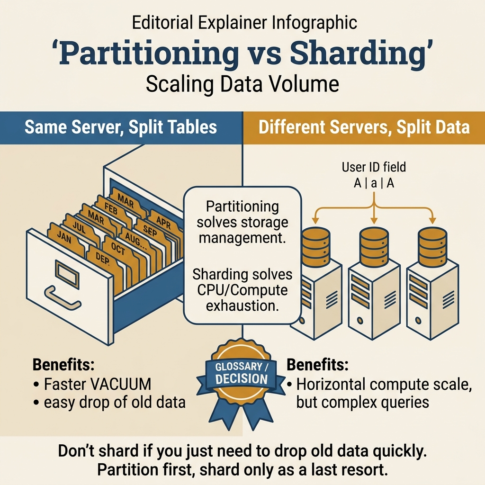
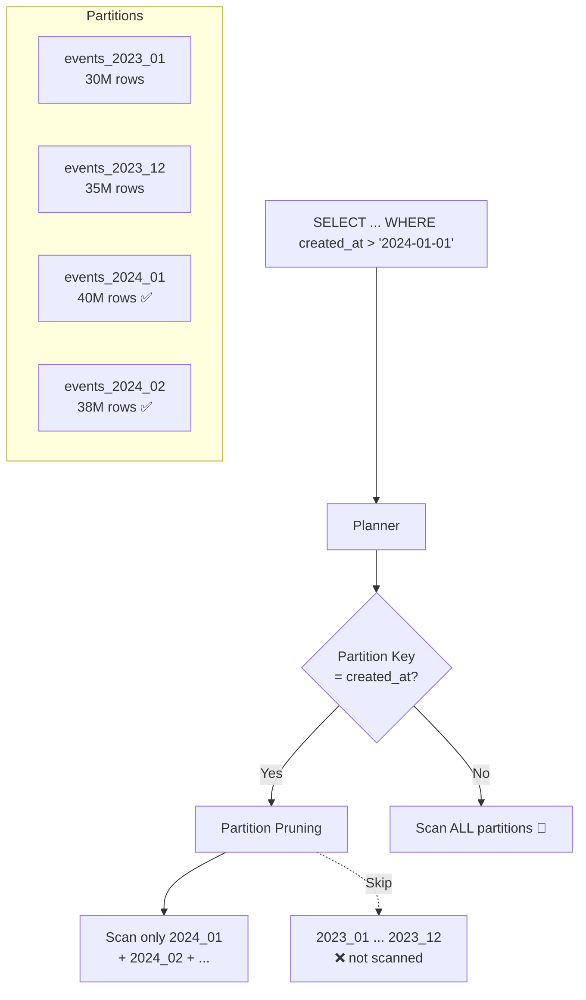

<!-- tags: sql, postgresql, database, replication -->
# 📦 09 — Table Partitioning & Sharding — Production Patterns

> Bảng 100M+ rows? Partition chia nhỏ → query nhanh 10-100x. Sharding chia data across servers → horizontal scaling.

| Aspect           | Detail                                                       |
| ---------------- | ------------------------------------------------------------ |
| **Concept**      | Declarative partitioning, Hash/Range/List, sharding patterns |
| **Use case**     | Time-series, multi-tenant, data archival                     |
| **Go relevance** | Transparent access, partition-aware queries                  |
| **DBA Roadmap**  | Data Partitioning, Sharding Patterns                         |

---

📅 Ngày tạo: 2026-03-19 · 🔄 Cập nhật: 2026-04-04 · ⏱️ 14 phút đọc

---

## 1. DEFINE

Bảng `events` có 800 triệu rows, chiếm 180GB. Mỗi query analytics chỉ cần data 30 ngày gần nhất — nhưng PostgreSQL vẫn scan toàn bộ 800M rows vì planner không có cách nào biết data nằm ở đâu trên disk. VACUUM chạy 4 giờ mỗi đêm. `CREATE INDEX CONCURRENTLY` mất 2 giờ và block autovacuum.

Sau khi partition theo tháng: query 30 ngày chỉ touch 2 partitions (60M rows thay vì 800M). VACUUM chạy song song trên từng partition — xong trong 15 phút. Index rebuild chỉ ảnh hưởng partition hiện tại.

Partitioning không phải "bảng to thì chia nhỏ". Nó là **boundary management** — tách data theo access pattern để query, maintenance và archival đều nhanh hơn. Bài này cover range, hash, list partition và khi nào cần nghĩ đến sharding cross-server.

Khi một bảng append-only lớn lên đủ lâu, mọi quyết định đơn giản trước đó đều bắt đầu đắt: index phình to, retention khó làm sạch, backup chậm, và truy vấn gần đây phải đi qua quá nhiều dữ liệu cũ. Đây là lúc partitioning hoặc sharding bước vào như quyết định kiến trúc, không phải mẹo tối ưu.

Bài này giúp bạn phân biệt hai lớp chia nhỏ dữ liệu đó: partitioning để giữ một logical table còn điều khiển được, và sharding khi một node duy nhất không còn là biên đủ lớn cho workload.

| Variant | Mô tả |
| --- | --- |
| Range | Chia theo khoảng giá trị · created_at, id ranges · Time-series, logs, events |
| List | Chia theo giá trị cụ thể · region, status, tenant · Multi-tenant, categorical |
| Hash | Chia đều theo hash · id, user_id · Even distribution, no natural range |

| Approach | Time | Space | Khi chọn |
| --- | --- | --- | --- |
| Range Partition by Month | Phụ thuộc cardinality | Phụ thuộc row width | Dùng để nắm baseline semantics trước khi tune planner hoặc index. |
| Hash + List Partitioning | Phụ thuộc plan | Phụ thuộc memory operator | Dùng khi query đã chạm index, cardinality hoặc join strategy. |
| Maintenance, Monitoring & Archival | Phụ thuộc workload | Phụ thuộc buffer/WAL | Dùng khi workload production cần cân bằng correctness, lock và rollout. |


### Partitioning Types

| Type      | Mô tả                    | Key selection                | Best for                            |
| --------- | ------------------------ | ---------------------------- | ----------------------------------- |
| **Range** | Chia theo khoảng giá trị | `created_at`, `id ranges`    | Time-series, logs, events           |
| **List**  | Chia theo giá trị cụ thể | `region`, `status`, `tenant` | Multi-tenant, categorical           |
| **Hash**  | Chia đều theo hash       | `id`, `user_id`              | Even distribution, no natural range |

### Partitioning vs Sharding

| Feature                     | Partitioning             | Sharding                    |
| --------------------------- | ------------------------ | --------------------------- |
| **Location**                | Same database server     | Multiple servers            |
| **Scaling**                 | Vertical (bigger server) | Horizontal (more servers)   |
| **Complexity**              | Low (PG declarative)     | High (application routing)  |
| **Cross-partition queries** | ✅ Automatic             | ⚠️ Application-managed      |
| **Transactions**            | ✅ ACID                  | ⚠️ Distributed TX needed    |
| **Use case**                | Single DB performance    | Beyond single server limits |

### Key Constraints

| Constraint                                        | Impact                         |
| ------------------------------------------------- | ------------------------------ |
| **Primary key must include partition key**        | `PRIMARY KEY (id, created_at)` |
| **Unique indexes must include partition key**     | Same as PK                     |
| **Foreign keys TO partitioned table**             | Supported in PG 12+            |
| **Foreign keys FROM partitioned table**           | ✅ Supported                   |
| **Cross-partition queries without partition key** | Scans ALL partitions (slow!)   |

---

Các failure mode trên nghe quen. Nhưng có trap: partition key sai = query scan tất cả partitions, và cross-partition query = worse than no partition. Trap đó sẽ xuất hiện ở PITFALLS.

## 2. VISUAL

Với Table Partitioning & Sharding — Production Patterns, vocabulary thôi không cứu được bạn. Bottleneck chỉ lộ mặt khi plan, timeline hoặc đường đi của bộ nhớ và I/O được đặt lên bàn cùng lúc.




*Hình: Partition type decision — Range (time-series), List (category/tenant), Hash (even split), Shard (scale-out multi-server). Start native, shard later.*

### Level 1

```text
TRƯỚC partitioning (orders: 100M rows):
┌──────────── orders (100M rows) ──────────────┐
│ ██████████████████████████████████████████████│
│ WHERE created_at = '2024-06-15'               │
│ → Full table scan 100M rows! 🐌               │
└──────────────────────────────────────────────┘

SAU range partitioning (by month):
┌─── orders_2024_01 ───┐  ← skip
│ █████ (3M rows)      │
└──────────────────────┘
┌─── orders_2024_06 ───┐  ← Scan ONLY this partition! ⚡
│ █████ (3M rows)      │
└──────────────────────┘
┌─── orders_2024_12 ───┐  ← skip
│ █████ (3M rows)      │
└──────────────────────┘
→ Scan 3M thay vì 100M → 30x nhanh hơn!

SAU hash partitioning (by user_id, 4 partitions):
┌─── orders_p0 (25M) ───┐  WHERE user_id = 42
│ hash(42) % 4 = 2      │  → skip
└────────────────────────┘
┌─── orders_p1 (25M) ───┐  → skip
└────────────────────────┘
┌─── orders_p2 (25M) ───┐  → Scan ONLY this! ⚡
└────────────────────────┘
┌─── orders_p3 (25M) ───┐  → skip
└────────────────────────┘
```

---

*Hình: Level 1 cho 📦 09 — Table Partitioning & Sharding — Production Patterns — nhìn vào happy path hoặc baseline heuristic trước khi đi sâu vào planner và trade-off.*

### Level 2

```text
Decision Lens                 Dấu hiệu cần nhìn                 Hướng xử lý
---------------------------  --------------------------------  -------------------------------------------
Semantics trước               Kết quả có đúng intent không?    1. Range Partition by Month
Planner / index signal        Cardinality, cost, buffers ra sao? 2. Hash + List Partitioning
Production pressure           Lock, WAL, lag, rollback nào đau? 3. Maintenance, Monitoring & Archival
```

*Hình: Level 2 biến 📦 09 — Table Partitioning & Sharding — Production Patterns thành checklist quyết định — từ semantics, sang plan signal, rồi đến áp lực production.*


### Architecture — Partition Pruning & Query Routing



*Hình: Khi WHERE clause match partition key, planner prune các partitions không cần → scan 2 thay vì 24 partitions. Nếu query không có partition key filter → scan tất cả.*

---
## 3. CODE

Khi tín hiệu trực quan của Table Partitioning & Sharding — Production Patterns đã rõ, ta chuyển sang truy vấn, lệnh chẩn đoán và playbook có thể chạy thật. Bắt đầu từ baseline đơn giản rồi tăng dần áp lực workload.

### Problem 1: Basic — Range Partition by Month

> **Mục tiêu**: Partition events table by month, auto-create partitions
> **Cần**: PostgreSQL 11+ (declarative partitioning)
> **Đạt được**: 10-100x faster time-range queries, instant data retention


```sql
-- ═══════════════════════════════════════════
-- 1. Create partitioned table
-- ═══════════════════════════════════════════

CREATE TABLE events (
    id          bigint GENERATED ALWAYS AS IDENTITY,
    event_type  text NOT NULL,
    user_id     bigint NOT NULL,
    payload     jsonb,
    created_at  timestamptz NOT NULL DEFAULT now(),
    -- ✅ PK must include partition key!
    PRIMARY KEY (id, created_at)
) PARTITION BY RANGE (created_at);

-- ✅ Create index on parent (auto-applies to partitions)
CREATE INDEX idx_events_user ON events(user_id, created_at DESC);
CREATE INDEX idx_events_type ON events(event_type, created_at DESC);

-- ═══════════════════════════════════════════
-- 2. Create monthly partitions
-- ═══════════════════════════════════════════

CREATE TABLE events_2024_01 PARTITION OF events
    FOR VALUES FROM ('2024-01-01') TO ('2024-02-01');
CREATE TABLE events_2024_02 PARTITION OF events
    FOR VALUES FROM ('2024-02-01') TO ('2024-03-01');
-- ... (automate with pg_partman or PL/pgSQL function)

-- ✅ Default partition (catch-all for unmatched rows)
CREATE TABLE events_default PARTITION OF events DEFAULT;

-- ═══════════════════════════════════════════
-- 3. Auto-create partitions (PL/pgSQL)
-- ═══════════════════════════════════════════

CREATE OR REPLACE PROCEDURE create_monthly_partitions(
    p_table text, p_year integer, p_months integer DEFAULT 12
)
LANGUAGE plpgsql AS $$
DECLARE
    v_start date;
    v_end   date;
    v_name  text;
BEGIN
    FOR m IN 1..p_months LOOP
        v_start := make_date(p_year, m, 1);
        v_end := v_start + interval '1 month';
        v_name := format('%s_%s_%s', p_table, p_year,
            lpad(m::text, 2, '0'));

        IF NOT EXISTS (SELECT 1 FROM pg_class WHERE relname = v_name) THEN
            EXECUTE format(
                'CREATE TABLE %I PARTITION OF %I FOR VALUES FROM (%L) TO (%L)',
                v_name, p_table, v_start, v_end
            );
            RAISE NOTICE 'Created partition: %', v_name;
        END IF;
    END LOOP;
END;
$$;

CALL create_monthly_partitions('events', 2024);
CALL create_monthly_partitions('events', 2025);

-- ═══════════════════════════════════════════
-- 4. Query optimization — partition pruning
-- ═══════════════════════════════════════════

-- ✅ Partition-aware query (scans 1 partition only)
EXPLAIN (ANALYZE)
SELECT * FROM events
WHERE created_at BETWEEN '2024-06-01' AND '2024-06-30';
-- → Append → Index Scan on events_2024_06 ✅

-- ❌ Missing partition key → scans ALL partitions!
EXPLAIN (ANALYZE) SELECT * FROM events WHERE user_id = 42;
-- → Append → Seq Scan on events_2024_01
--          → Seq Scan on events_2024_02
--          → ... ALL partitions scanned 🐌
-- Fix: ALWAYS include partition key in WHERE:
SELECT * FROM events WHERE user_id = 42 AND created_at > '2024-06-01';
```


---

Range partitioning đã cover. Nhưng list/hash partitioning cần different strategy — hãy chọn.

### Problem 2: Intermediate — Hash + List Partitioning

> **Mục tiêu**: Hash partition for even distribution, List for multi-tenant
> **Cần**: PostgreSQL 11+
> **Đạt được**: Partition strategies for different workloads


```sql
-- ═══════════════════════════════════════════
-- 1. Hash partition (even distribution)
-- ═══════════════════════════════════════════

CREATE TABLE user_activities (
    id          bigint GENERATED ALWAYS AS IDENTITY,
    user_id     bigint NOT NULL,
    action      text NOT NULL,
    created_at  timestamptz DEFAULT now(),
    PRIMARY KEY (id, user_id)
) PARTITION BY HASH (user_id);

-- ✅ Create 8 hash partitions
CREATE TABLE user_activities_p0 PARTITION OF user_activities FOR VALUES WITH (MODULUS 8, REMAINDER 0);
CREATE TABLE user_activities_p1 PARTITION OF user_activities FOR VALUES WITH (MODULUS 8, REMAINDER 1);
CREATE TABLE user_activities_p2 PARTITION OF user_activities FOR VALUES WITH (MODULUS 8, REMAINDER 2);
CREATE TABLE user_activities_p3 PARTITION OF user_activities FOR VALUES WITH (MODULUS 8, REMAINDER 3);
CREATE TABLE user_activities_p4 PARTITION OF user_activities FOR VALUES WITH (MODULUS 8, REMAINDER 4);
CREATE TABLE user_activities_p5 PARTITION OF user_activities FOR VALUES WITH (MODULUS 8, REMAINDER 5);
CREATE TABLE user_activities_p6 PARTITION OF user_activities FOR VALUES WITH (MODULUS 8, REMAINDER 6);
CREATE TABLE user_activities_p7 PARTITION OF user_activities FOR VALUES WITH (MODULUS 8, REMAINDER 7);

-- ✅ Query by user_id → only 1 partition scanned
EXPLAIN ANALYZE SELECT * FROM user_activities WHERE user_id = 42;
-- → Seq Scan on user_activities_p2 (hash(42) % 8 = 2)

-- ═══════════════════════════════════════════
-- 2. List partition (multi-tenant)
-- ═══════════════════════════════════════════

CREATE TABLE tenant_data (
    id          bigint GENERATED ALWAYS AS IDENTITY,
    tenant_id   text NOT NULL,
    name        text NOT NULL,
    data        jsonb,
    created_at  timestamptz DEFAULT now(),
    PRIMARY KEY (id, tenant_id)
) PARTITION BY LIST (tenant_id);

CREATE TABLE tenant_data_acme PARTITION OF tenant_data FOR VALUES IN ('acme');
CREATE TABLE tenant_data_globex PARTITION OF tenant_data FOR VALUES IN ('globex');
CREATE TABLE tenant_data_other PARTITION OF tenant_data DEFAULT;

-- ✅ Detach tenant → instant data isolation/deletion
ALTER TABLE tenant_data DETACH PARTITION tenant_data_acme CONCURRENTLY;  -- PG 14+
DROP TABLE tenant_data_acme;  -- Instant deletion of all tenant data!

-- ═══════════════════════════════════════════
-- 3. Sub-partitioning (Range + Hash)
-- ═══════════════════════════════════════════

CREATE TABLE orders (
    id          bigint GENERATED ALWAYS AS IDENTITY,
    user_id     bigint NOT NULL,
    amount      numeric(10,2),
    created_at  timestamptz NOT NULL DEFAULT now(),
    PRIMARY KEY (id, created_at, user_id)
) PARTITION BY RANGE (created_at);

-- Each monthly partition further hash-partitioned by user_id
CREATE TABLE orders_2024_06 PARTITION OF orders
    FOR VALUES FROM ('2024-06-01') TO ('2024-07-01')
    PARTITION BY HASH (user_id);

CREATE TABLE orders_2024_06_p0 PARTITION OF orders_2024_06 FOR VALUES WITH (MODULUS 4, REMAINDER 0);
CREATE TABLE orders_2024_06_p1 PARTITION OF orders_2024_06 FOR VALUES WITH (MODULUS 4, REMAINDER 1);
-- ...
-- ✅ WHERE created_at = '2024-06-15' AND user_id = 42
--    → Prunes to 1 sub-partition only!
```

**Tại sao?** Ở mức Intermediate của Table Partitioning & Sharding — Production Patterns, câu hỏi không còn là “query có chạy không” mà là “tín hiệu nào đang làm PostgreSQL đổi chiến lược”. Problem 2: Intermediate — Hash + List Partitioning ép bạn đọc cardinality, buffer hoặc execution path thay vì sửa theo cảm giác.


---

Partitioning đã cover. Nhưng sharding cần application-level routing — hãy shard.

### Problem 3: Advanced — Maintenance, Monitoring & Archival

> **Mục tiêu**: Production partition lifecycle management
> **Cần**: Data retention policies, monitoring
> **Đạt được**: Automated partition management


```sql
-- ═══════════════════════════════════════════
-- 1. Data retention via partition management
-- ═══════════════════════════════════════════

-- ✅ Drop old partitions (INSTANT — no row-by-row DELETE!)
CREATE OR REPLACE PROCEDURE rotate_partitions(
    p_table text,
    p_retention_months integer DEFAULT 12
)
LANGUAGE plpgsql AS $$
DECLARE
    v_partition record;
    v_cutoff    date := (now() - (p_retention_months || ' months')::interval)::date;
BEGIN
    FOR v_partition IN
        SELECT c.relname AS partition_name,
            pg_get_expr(c.relpartbound, c.oid) AS bound_expr
        FROM pg_inherits i
        JOIN pg_class p ON i.inhparent = p.oid
        JOIN pg_class c ON i.inhrelid = c.oid
        WHERE p.relname = p_table
          AND c.relname != p_table || '_default'
        ORDER BY c.relname
    LOOP
        -- Check if partition is before cutoff
        IF v_partition.partition_name < p_table || '_' || to_char(v_cutoff, 'YYYY_MM') THEN
            EXECUTE format('ALTER TABLE %I DETACH PARTITION %I CONCURRENTLY',
                p_table, v_partition.partition_name);
            EXECUTE format('DROP TABLE %I', v_partition.partition_name);
            RAISE NOTICE 'Dropped old partition: %', v_partition.partition_name;
        END IF;
    END LOOP;
END;
$$;

-- ✅ Monthly cron: rotate + create ahead
CALL rotate_partitions('events', 12);
CALL create_monthly_partitions('events', 2026);

-- ═══════════════════════════════════════════
-- 2. Partition monitoring
-- ═══════════════════════════════════════════

-- ✅ View all partitions with sizes
SELECT
    parent.relname AS parent_table,
    child.relname AS partition_name,
    pg_size_pretty(pg_total_relation_size(child.oid)) AS total_size,
    pg_size_pretty(pg_relation_size(child.oid)) AS data_size,
    (SELECT reltuples FROM pg_class WHERE oid = child.oid)::bigint AS est_rows
FROM pg_inherits
JOIN pg_class parent ON pg_inherits.inhparent = parent.oid
JOIN pg_class child ON pg_inherits.inhrelid = child.oid
WHERE parent.relname = 'events'
ORDER BY child.relname;

-- ✅ Detect partition imbalance
WITH partition_stats AS (
    SELECT child.relname,
        pg_relation_size(child.oid) AS size_bytes,
        (SELECT reltuples FROM pg_class WHERE oid = child.oid) AS rows
    FROM pg_inherits
    JOIN pg_class parent ON inhparent = parent.oid
    JOIN pg_class child ON inhrelid = child.oid
    WHERE parent.relname = 'user_activities'
)
SELECT relname,
    pg_size_pretty(size_bytes) AS size,
    rows::bigint,
    round(100.0 * size_bytes / SUM(size_bytes) OVER(), 2) AS pct_of_total
FROM partition_stats
ORDER BY size_bytes DESC;
```

```go
// ✅ Go: Partition-aware queries
func (r *Repo) GetUserEvents(ctx context.Context, userID int64, from, to time.Time) ([]Event, error) {
    // ✅ ALWAYS include partition key (created_at) for partition pruning!
    rows, err := r.pool.Query(ctx, `
        SELECT id, event_type, payload, created_at
        FROM events
        WHERE user_id = $1
          AND created_at >= $2    -- ✅ Enables partition pruning!
          AND created_at < $3
        ORDER BY created_at DESC
        LIMIT 100
    `, userID, from, to)
    if err != nil {
        return nil, err
    }
    defer rows.Close()
    return pgx.CollectRows(rows, pgx.RowToStructByName[Event])
}
```


---
Bạn đã đi qua partitioning và sharding. Bây giờ đến phần nguy hiểm: wrong partition key và cross-partition scan — trap đã được setup từ đầu bài.

## 4. PITFALLS

Table Partitioning & Sharding — Production Patterns rất dễ bị dùng theo phản xạ: thấy chậm là thêm index, thấy lag là tăng tài nguyên. Phần dưới đây gom những lỗi tối ưu tưởng đúng nhưng lại làm latency, lock hoặc chi phí vận hành tệ hơn.

| # | Severity | Lỗi | Hậu quả | Fix |
| --- | --- | --- | --- | --- |
| 1 | 🔴 Fatal | Query không có partition key trong WHERE clause | PostgreSQL scan TẤT CẢ partitions — chậm hơn bảng không partition vì overhead per-partition planning | Đảm bảo mọi query include partition key. Nếu không = redesign partition scheme |
| 2 | 🔴 Fatal | Partition quá nhỏ hoặc quá nhiều (> 1000 partitions) | Planning time tăng linear với số partition — query simple mất 50-100ms chỉ để plan | Mỗi partition nên có 1M-100M rows. Merge partitions cũ, archive data lâu |
| 3 | 🟡 Common | Partition by wrong key (high cardinality random) | Hash partition trên UUID = mọi query scan mọi partition vì runtime value không predict được | Partition by access pattern: time-range cho time-series, list cho status/region |
| 4 | 🟡 Common | Không attach/detach partition cho archival | Partitions cũ (2 năm trước) vẫn nằm trong table, tăng planning time và backup size | `ALTER TABLE events DETACH PARTITION events_2022_01 CONCURRENTLY` → archive/drop |
| 5 | 🔵 Minor | Unique constraint không include partition key | PostgreSQL yêu cầu partition key trong mọi unique/PK constraint | `PRIMARY KEY (id, created_at)` — include partition key |

---
Bạn đã đi qua Partitioning & Sharding và cạm bẫy. Các resources dưới đây giúp đi sâu hơn.

## 5. REF

| Resource         | Link                                                                                                               |
| ---------------- | ------------------------------------------------------------------------------------------------------------------ |
| Partitioning     | [postgresql.org/docs/current/ddl-partitioning.html](https://www.postgresql.org/docs/current/ddl-partitioning.html) |
| pg_partman       | [github.com/pgpartman/pg_partman](https://github.com/pgpartman/pg_partman)                                         |
| Citus (sharding) | [citusdata.com](https://www.citusdata.com/)                                                                        |
| TimescaleDB      | [timescale.com](https://www.timescale.com/)                                                                        |

---

## 6. RECOMMEND

Khi các bẫy thường gặp của Table Partitioning & Sharding — Production Patterns đã lộ mặt, bạn có thể nối bài này sang maintenance, replication hoặc triage workflow để quyết định tuning không bị cô lập.

| Tool            | Mô tả                                                      |
| --------------- | ---------------------------------------------------------- |
| **pg_partman**  | Auto partition management (create/drop)                    |
| **Citus**       | Distributed PostgreSQL (true sharding across servers)      |
| **TimescaleDB** | Time-series extension with hypertables (auto partitioning) |
| **Vitess**      | MySQL sharding middleware (similar concept for PG: Citus)  |


> **Callback** — Quay lại bảng `events` 800M rows: query 30 ngày scan toàn bộ 180GB. Range partition theo tháng → scan 2 partitions (60M rows), VACUUM 15 phút thay vì 4 giờ. Boundary đúng = mọi operation scale theo partition, không theo toàn bộ table.

---

**Liên kết**: [← Connection Pooling](./08-connection-pooling.md) · [← README](./README.md)

---

## 7. QUICK REF

| Signal | Kiểm tra | Action |
| --- | --- | --- |
| Bảng > 100M rows, query analytics chậm | Access pattern analysis | Partition by time-range nếu query luôn có date filter |
| Planning time > 10ms | Số partitions | > 1000 partitions → merge old partitions, archive |
| Query không dùng partition pruning | `EXPLAIN` + partition scan count | Ensure WHERE clause có partition key |
| Disk usage tăng cho data cũ | Partition archival strategy | `DETACH PARTITION` old partitions → drop/archive |
