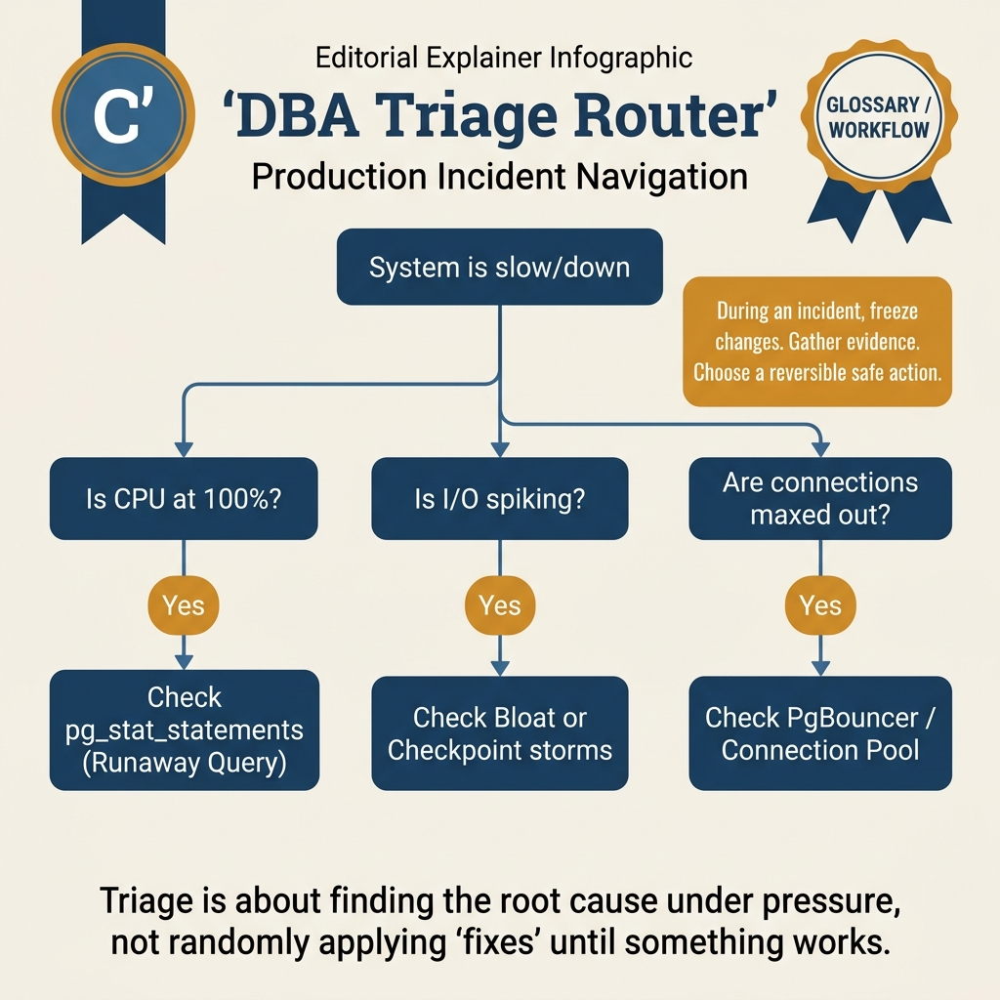
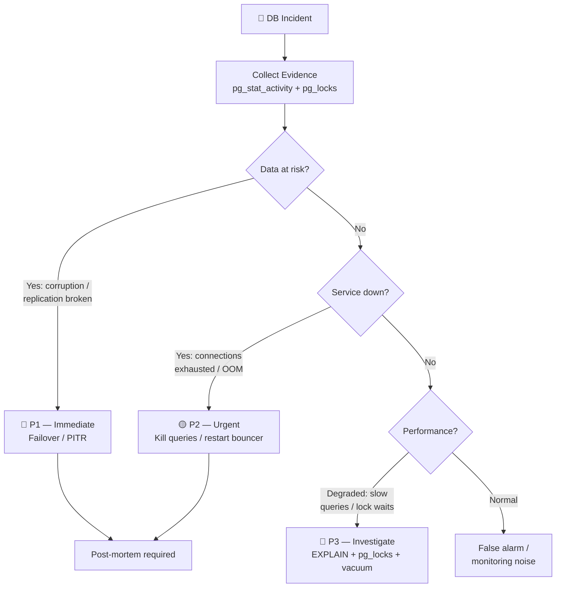

<!-- tags: sql, postgresql, database, dba, incident-response -->
# 🚑 10 — Production DBA Triage Playbook — Evidence-First Incident Workflow

> Khi PostgreSQL gặp sự cố, sai lầm lớn nhất thường không phải thiếu một knob tuning, mà là nhảy vào restart hoặc failover trước khi phân loại đúng vấn đề. Playbook này giúp DBA/backend lead đi từ symptom tới hành động an toàn nhất.

| Aspect | Detail |
| --- | --- |
| **Concept** | incident classification, blast-radius control, evidence pack, safe mitigations |
| **Use case** | primary chậm, lock storm, WAL growth, replica lag, connection exhaustion |
| **Audience** | senior backend engineers, on-call DBA, platform engineers |
| **Related** | [02-EXPLAIN](./02-explain-analyze.md), [06-Monitoring](./06-buffer-stats-monitoring.md), [performance/05](../postgresql/performance/05-vacuum-wal-checkpoint.md) |

📅 Ngày tạo: 2026-03-28 · 🔄 Cập nhật: 2026-04-04 · ⏱️ 15 phút đọc

---

## 1. DEFINE

PagerDuty: _"PostgreSQL replication lag > 30 minutes."_ Bạn SSH vào primary — CPU 100%, `pg_stat_activity` đầy session `IDLE in transaction`. Bạn muốn restart PostgreSQL ngay để fix. Senior DBA chặn lại: _"Restart sẽ kill tất cả connections, rollback các uncommitted transactions, gây data inconsistency trên application layer. Hãy tập hợp evidence trước."_

Sai lầm lớn nhất khi xử lý incident database không phải thiếu kiến thức — mà là **nhảy vào hành động trước khi phân loại đúng vấn đề**. Restart giải quyết symptom nhưng che mất root cause. Failover khi chưa hiểu replication state có thể gây split-brain.

Playbook này là workflow step-by-step: từ **thu thập evidence** (pg_stat_activity, pg_locks, replication lag) → **phân loại severity** (P1 data loss vs P3 performance) → **hành động an toàn nhất** cho từng loại incident.

Pager không reo để hỏi bạn nhớ bao nhiêu cú pháp SQL. Nó reo khi CPU tăng, locks chồng lên nhau, replica lag kéo dài hoặc disk sắp đầy, và bạn phải chọn bước an toàn nhất trong vài phút đầu tiên.

Playbook này gom các tín hiệu DBA production thành một thứ tự xử lý có thể làm theo: xác nhận symptom, lấy evidence, tránh hành động phá hệ thống, rồi mới đi sâu vào fix dài hạn.

| Variant | Mô tả |
| --- | --- |
| 1 | Giữ blast radius không lan · Có migration, job, batch, deploy nào cần pause ngay không? |
| 2 | Phân loại symptom · Đang là lock storm, I/O/WAL pressure, bad plan, lag, hay connection storm? |
| 3 | Chụp evidence · Có query, lag, locks, WAL metrics trước khi ai đó restart hay promote không? |
| 4 | Chọn mitigation ít rủi ro nhất · Cancel query, pause writer, reroute reads, postpone failover, hay scale pool? |

| Approach | Time | Space | Khi chọn |
| --- | --- | --- | --- |
| Incident evidence pack | Phụ thuộc cardinality | Phụ thuộc row width | Dùng để nắm baseline semantics trước khi tune planner hoặc index. |
| Triage decision matrix | Phụ thuộc plan | Phụ thuộc memory operator | Dùng khi query đã chạm index, cardinality hoặc join strategy. |


### First 5 Minutes: Ưu tiên đúng thứ tự

| Step | Mục tiêu | Câu hỏi cần trả lời |
| --- | --- | --- |
| 1 | Giữ blast radius không lan | Có migration, job, batch, deploy nào cần pause ngay không? |
| 2 | Phân loại symptom | Đang là lock storm, I/O/WAL pressure, bad plan, lag, hay connection storm? |
| 3 | Chụp evidence | Có query, lag, locks, WAL metrics trước khi ai đó restart hay promote không? |
| 4 | Chọn mitigation ít rủi ro nhất | Cancel query, pause writer, reroute reads, postpone failover, hay scale pool? |
| 5 | Chỉ escalated action khi đủ bằng chứng | Restart/failover/VACUUM FULL có thật sự là bước đúng không? |

### Symptom → First Safe Action

| Symptom | Dấu hiệu | First safe action |
| --- | --- | --- |
| **Lock storm** | nhiều backend wait `Lock`, API timeouts | xác định blocker, dùng `pg_cancel_backend`, đặt `lock_timeout`, pause migration |
| **Replica lag** | `pg_stat_replication` gap tăng, stale reads | route critical reads về primary, khoan failover nếu standby chưa catch up |
| **WAL pressure** | disk `/pg_wal` tăng nhanh, slots backlog | kiểm logical/physical slots, archiver failures, consumer lag |
| **Connection storm** | `max_connections` gần đầy, CPU context switching cao | giới hạn app concurrency, kiểm pool mode, tránh tăng connection vô tội vạ |
| **Bad plan / slow query** | `pg_stat_statements` top query tăng mạnh | capture plan với `EXPLAIN (ANALYZE, BUFFERS)`, kiểm stats/index/recent deploy |

### Những hành động dễ gây hại nếu làm quá sớm

| Hành động | Vì sao nguy hiểm |
| --- | --- |
| Restart primary | xóa mất evidence trong memory, không sửa được lỗi logic/lock pattern gốc |
| Promote standby lag cao | biến downtime thành data loss |
| `VACUUM FULL` trong giờ cao điểm | `AccessExclusiveLock` làm tệ hơn |
| Giết hàng loạt backend | có thể làm app retry storm nghiêm trọng hơn |
| Tăng random GUCs | đổi quá nhiều biến cùng lúc làm triage mù |

---

Các failure mode trên nghe rõ. Nhưng có trap: triage sai priority = P0 incident delay, và fix symptom không fix root cause = recurring. Trap đó sẽ xuất hiện ở PITFALLS.

## 2. VISUAL

Với Production DBA Triage Playbook — Evidence-First Incident Workflow, vocabulary thôi không cứu được bạn. Bottleneck chỉ lộ mặt khi plan, timeline hoặc đường đi của bộ nhớ và I/O được đặt lên bàn cùng lúc.




*Hình: 6 symptom production — latency spike, disk growth, connection exhaustion, replication lag, slow queries, data corruption. Mỗi symptom route tới module tương ứng.*

### Level 1

```text
Alert fires
   │
   ▼
Freeze blast radius
   │
   ├── pause risky migration/batch job?
   ├── reduce writer concurrency?
   └── stop automated failover if standby stale?
   │
   ▼
Classify symptom
   │
   ├── Lock / blocking
   ├── Query plan / CPU
   ├── WAL / checkpoint / disk
   ├── Replica lag / failover risk
   └── Connection storm
   │
   ▼
Capture evidence pack
   │
   ├── pg_stat_activity
   ├── pg_locks / blockers
   ├── pg_stat_replication / slots
   ├── pg_stat_statements
   └── pg_stat_wal / archiver
   │
   ▼
Choose least-risk mitigation
   │
   ├── cancel single bad actor
   ├── postpone schema change
   ├── reroute reads
   ├── drain pool / fix pool mode
   └── drill failover only if freshness is acceptable
   │
   ▼
Only then: restart / switchover / failover / heavy maintenance
```

*Hình: Level 1 cho 🚑 10 — Production DBA Triage Playbook — Evidence-First Incident Workflow — nhìn vào happy path hoặc baseline heuristic trước khi đi sâu vào planner và trade-off.*

### Level 2

```text
Decision Lens                 Dấu hiệu cần nhìn                 Hướng xử lý
---------------------------  --------------------------------  -------------------------------------------
Semantics trước               Kết quả có đúng intent không?    1. Incident evidence pack
Planner / index signal        Cardinality, cost, buffers ra sao? 2. Triage decision matrix
Production pressure           Lock, WAL, lag, rollback nào đau? 1. Incident evidence pack
```

*Hình: Level 2 biến 🚑 10 — Production DBA Triage Playbook — Evidence-First Incident Workflow thành checklist quyết định — từ semantics, sang plan signal, rồi đến áp lực production.*


### Architecture — Incident Triage Decision Tree



*Hình: Triage flow evidence-first — thu thập trước, phân loại sau, hành động cuối. P1 data loss > P2 service down > P3 performance degradation.*

---
## 3. CODE

Khi tín hiệu trực quan của Production DBA Triage Playbook — Evidence-First Incident Workflow đã rõ, ta chuyển sang truy vấn, lệnh chẩn đoán và playbook có thể chạy thật. Bắt đầu từ baseline đơn giản rồi tăng dần áp lực workload.

### Problem 1: Basic — Incident evidence pack

> **Mục tiêu**: chụp đủ bằng chứng trong 1-2 phút trước khi ai đó thực hiện action phá hủy evidence.
> **Cần**: quyền xem `pg_stat_*` và `pg_locks`.
> **Đạt được**: phân loại incident nhanh, tránh đoán mò.


```sql
-- incident_triage.sql — Evidence-first snapshot

-- 1) Active sessions and wait events
SELECT
    pid,
    usename,
    application_name,
    state,
    wait_event_type,
    wait_event,
    age(now(), query_start) AS runtime,
    left(query, 160) AS query
FROM pg_stat_activity
WHERE datname = current_database()
  AND state <> 'idle'
ORDER BY query_start;

-- 2) Blocking tree
SELECT
    blocked.pid AS blocked_pid,
    blocker.pid AS blocker_pid,
    age(now(), blocked.query_start) AS blocked_runtime,
    left(blocked.query, 100) AS blocked_query,
    left(blocker.query, 100) AS blocker_query
FROM pg_stat_activity blocked
JOIN pg_locks blocked_locks
  ON blocked_locks.pid = blocked.pid
 AND NOT blocked_locks.granted
JOIN pg_locks blocker_locks
  ON blocker_locks.locktype = blocked_locks.locktype
 AND blocker_locks.database IS NOT DISTINCT FROM blocked_locks.database
 AND blocker_locks.relation IS NOT DISTINCT FROM blocked_locks.relation
 AND blocker_locks.page IS NOT DISTINCT FROM blocked_locks.page
 AND blocker_locks.tuple IS NOT DISTINCT FROM blocked_locks.tuple
 AND blocker_locks.classid IS NOT DISTINCT FROM blocked_locks.classid
 AND blocker_locks.objid IS NOT DISTINCT FROM blocked_locks.objid
 AND blocker_locks.objsubid IS NOT DISTINCT FROM blocked_locks.objsubid
 AND blocker_locks.pid <> blocked_locks.pid
 AND blocker_locks.granted
JOIN pg_stat_activity blocker
  ON blocker.pid = blocker_locks.pid;

-- 3) Replica freshness and slot pressure
SELECT
    application_name,
    state,
    sync_state,
    pg_size_pretty(pg_wal_lsn_diff(pg_current_wal_lsn(), replay_lsn)) AS replay_gap
FROM pg_stat_replication;

SELECT
    slot_name,
    slot_type,
    active,
    pg_size_pretty(pg_wal_lsn_diff(pg_current_wal_lsn(), restart_lsn)) AS retained_wal
FROM pg_replication_slots
ORDER BY pg_wal_lsn_diff(pg_current_wal_lsn(), restart_lsn) DESC;

-- 4) WAL / archive pressure
SELECT
    wal_records,
    wal_fpi,
    pg_size_pretty(wal_bytes) AS wal_bytes_since_reset,
    now() - stats_reset AS stats_age
FROM pg_stat_wal;

SELECT
    archived_count,
    failed_count,
    last_archived_wal,
    last_failed_wal,
    last_failed_time
FROM pg_stat_archiver;

-- 5) Top expensive queries in the current period
SELECT
    calls,
    round(total_exec_time::numeric, 2) AS total_ms,
    round(mean_exec_time::numeric, 2) AS mean_ms,
    left(query, 120) AS query_sample
FROM pg_stat_statements
ORDER BY total_exec_time DESC
LIMIT 10;
```


Triage basics đã cover. Nhưng incident response cần escalation path — hãy drill.

### Problem 2: Intermediate — Triage decision matrix

> **Mục tiêu**: Minh họa cách áp dụng **🚑 10 — Production DBA Triage Playbook — Evidence-First Incident Workflow** qua ví dụ `Triage decision matrix` trong đúng ngữ cảnh schema, query hoặc vận hành.
## 4. PITFALLS

Production DBA Triage Playbook — Evidence-First Incident Workflow rất dễ bị dùng theo phản xạ: thấy chậm là thêm index, thấy lag là tăng tài nguyên. Phần dưới đây gom những lỗi tối ưu tưởng đúng nhưng lại làm latency, lock hoặc chi phí vận hành tệ hơn.

| # | Lỗi | Fix |
| --- | --- | --- |
| 1 | Failover chỉ vì primary chậm | xác nhận standby freshness và root cause trước khi promote |
| 2 | Chụp mỗi `pg_stat_activity` rồi kết luận | lấy đủ locks, slots, WAL, archiver, top queries |
| 3 | Không correlate với change timeline | luôn hỏi: deploy nào, migration nào, job nào vừa chạy |
| 4 | Tối ưu query trong khi thật ra đang bị connection storm | phân loại symptom trước rồi mới đào sâu |

**Tại sao?** Ở mức Intermediate của Production DBA Triage Playbook — Evidence-First Incident Workflow, câu hỏi không còn là “query có chạy không” mà là “tín hiệu nào đang làm PostgreSQL đổi chiến lược”. Problem 2: Intermediate — Triage decision matrix ép bạn đọc cardinality, buffer hoặc execution path thay vì sửa theo cảm giác.

**Kết luận**: Triage decision matrix là một góc nhìn của 🚑 10 — Production DBA Triage Playbook — Evidence-First Incident Workflow. Dùng nó khi tín hiệu thực tế khớp đúng giả định của example; nếu workload đã đổi cardinality, pattern truy cập hoặc operational pressure, hãy chuyển sang problem kế tiếp thay vì cố ép cùng một công thức.

---

Bạn đã đi qua triage playbook. Bây giờ đến phần nguy hiểm: wrong priority và symptom-only fix — trap đã được setup từ đầu bài.

## 4. PITFALLS

Sau phần code và mental model, chỗ dễ trượt nhất không nằm ở cú pháp mà ở cách áp kỹ thuật vào production khi giả định còn mơ hồ. Những pitfall dưới đây là các cú vấp dễ trả giá nhất.

| # | Severity | Lỗi | Hậu quả | Fix |
| --- | --- | --- | --- | --- |
| 1 | 🔴 Fatal | Restart PostgreSQL ngay khi incident mà không collect evidence | Mất root cause: pg_stat_activity, pg_locks, replication lag — post-mortem không có data | Snapshot evidence TRƯỚC bất kỳ action nào: `SELECT * FROM pg_stat_activity` → save |
| 2 | 🔴 Fatal | Failover khi chưa check replication state | Replica có thể chưa nhận hết WAL → data loss. Split-brain nếu primary vẫn alive | Check `pg_stat_replication` lag = 0 bytes trước khi promote |
| 3 | 🟡 Common | Nhầm severity: P3 performance xử lý như P1 | Emergency failover cho câu slow query → downtime không cần thiết 15 phút | Dùng triage matrix: data at risk → P1, service down → P2, performance → P3 |
| 4 | 🟡 Common | Kill toàn bộ sessions thay vì target | `pg_terminate_backend()` tất cả = rollback mọi transaction đang chạy → application-level data inconsistency | Identify offending PID qua pg_stat_activity, terminate selective |
| 5 | 🔵 Minor | Post-mortem không document evidence collected | Team lặp lại cùng incident 3 tháng sau vì không ai nhớ root cause và fix | Template post-mortem: timeline, evidence, root cause, fix, prevention |

---
Bạn đã đi qua DBA Triage Playbook và cạm bẫy. Các resources dưới đây giúp đi sâu hơn.

## 5. REF

| Resource | Link |
| --- | --- |
| Monitoring stats | https://www.postgresql.org/docs/current/monitoring-stats.html |
| pg_stat_statements | https://www.postgresql.org/docs/current/pgstatstatements.html |
| Explicit locking | https://www.postgresql.org/docs/current/explicit-locking.html |
| Continuous archiving | https://www.postgresql.org/docs/current/continuous-archiving.html |

---

## 6. RECOMMEND

Khi các bẫy thường gặp của Production DBA Triage Playbook — Evidence-First Incident Workflow đã lộ mặt, bạn có thể nối bài này sang maintenance, replication hoặc triage workflow để quyết định tuning không bị cô lập.

| Mở rộng | Khi nào | Lý do |
| --- | --- | 
> **Callback** — Quay lại replication lag 30 phút: thay vì restart ngay, bạn collect evidence → thấy `IDLE in transaction` 45 phút → `pg_terminate_backend()` 3 session → lag giảm về 0. Evidence-first giữ được data, restart-first có thể mất transaction.

--- |
| keep a saved evidence script | mọi on-call rotation | giảm thời gian “hỏi chạy query gì trước” |
| change-log correlation | production env | mapping symptom với deploy/migration nhanh hơn |
| PITR + failover drills | HA/DR environment | tránh ra quyết định mù khi thật sự có sự cố |
| query plan diff workflow | app teams đổi query nhiều | tách planner regression khỏi infra issue |

**Liên kết**: [← Partitioning & Sharding](./09-partitioning-sharding.md) · [→ Scenario Quiz](../quiz/scenario/02-pitr-failover-cutover-incidents.md)

---

## 7. QUICK REF

| Severity | Signal | First Action | DO NOT |
| --- | --- | --- | --- |
| 🔴 P1 Data Loss | Replication broken, corruption | Snapshot evidence → Failover nếu lag = 0 | Restart trước khi collect evidence |
| 🟡 P2 Service Down | OOM, connection exhausted | Kill offending queries → restart bouncer | Kill ALL sessions |
| 🔵 P3 Performance | Slow queries, lock waits | EXPLAIN ANALYZE → targeted fix | Emergency failover cho slow query |
