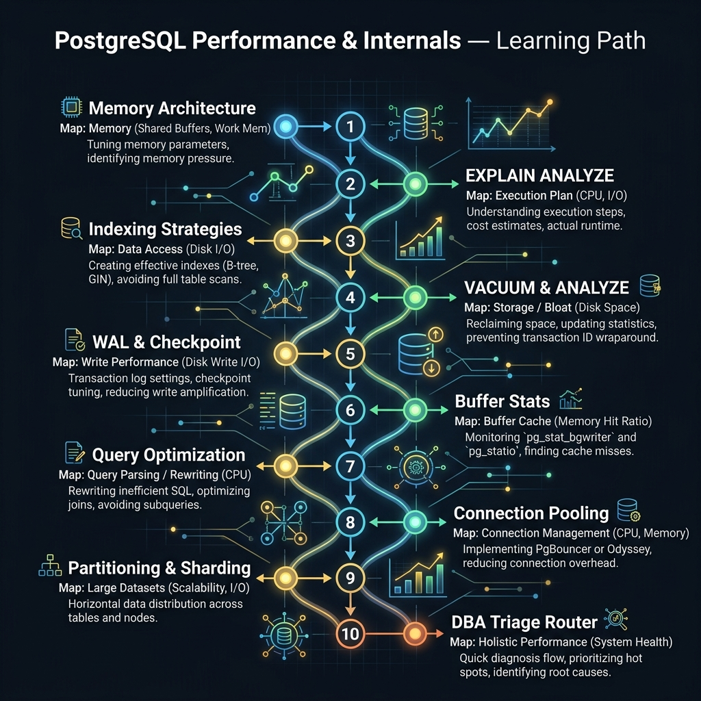

<!-- tags: sql, postgresql, database, performance, overview -->
# 🐘 PostgreSQL Performance & Internals — Tổng quan

> Pager vừa báo query timeout, autovacuum tụt lại, replica lag tăng và connection pool gần chạm trần. Track này không dạy “mẹo tối ưu” rời rạc; nó dạy cách đọc evidence trước, rồi mới chạm index, memory, WAL hay failover-sensitive tuning.

| Aspect | Detail |
| --- | --- |
| **Concept** | Planner, memory, WAL, VACUUM, monitoring, partitioning, production DBA triage |
| **Audience** | Backend engineer, DBA, SRE, on-call engineer |
| **Primary style** | Concept-First hub cho diagnostics và operations |
| **Entry point** | `01-memory-architecture`, `02-explain-analyze`, `10-production-dba-triage-playbook` |

📅 Ngày tạo: 2026-03-19 · 🔄 Cập nhật: 2026-04-04 · ⏱️ 6 phút đọc

---

## 1. DEFINE

Pager vừa báo timeout. Autovacuum chạy 2 giờ trên bảng `audit_logs`. Connection pool gần trần. Ba tín hiệu cùng lúc — thêm index? Tăng `work_mem`? Kill autovacuum? Mỗi hành động sai đều có blast radius.

Optimizer module cover 10 chủ đề DBA core — từ memory architecture qua EXPLAIN ANALYZE đến production triage playbook. Mỗi bài bắt đầu từ một incident cụ thể và kết thúc bằng operational knowledge bạn có thể dùng ngay. Đọc theo thứ tự nếu mới bắt đầu. Nhảy đến bài cần nếu đang debug production.

| Variant | Mô tả |
| --- | --- |
| Planner & Cost Model | Tập trung vào EXPLAIN, rows estimate, scan types, join order và index selection. |
| Storage & Maintenance | Đi vào VACUUM, WAL, checkpoint, buffer cache, bloat và maintenance windows. |
| Connection & Scale Controls | Xử lý pooling, partitioning, sharding decision và workload distribution. |
| Incident Playbook | Dùng evidence-first triage để chọn safe action thay vì tối ưu mù. |

| Approach | Time | Space | Khi chọn |
| --- | --- | --- | --- |
| Memory → Planner → Index | Phụ thuộc query + table size | O(1) | Dùng khi query chậm nhưng chưa biết bottleneck ở cache, plan hay storage. |
| Maintenance-first | Phụ thuộc churn rate | O(1) | Dùng khi bloat, dead tuples, WAL growth hoặc autovacuum lag mới là pain chính. |
| Pooling / Partitioning | Phụ thuộc concurrency | O(1) | Dùng khi đã tối ưu query mà hệ thống vẫn nghẽn ở connections hoặc data volume. |
| Triage Playbook | Phụ thuộc incident path | O(1) | Dùng khi production đang đỏ và cần hành động ít rủi ro nhất trước. |

Core insight:

> Phần lớn “query chậm” không phải là một vấn đề đơn lẻ. Nó là kết quả của tương tác giữa **shape dữ liệu**, **planner decision**, **memory/WAL pressure** và **safe rollout constraints**.

### Coverage Map

| File | Vai trò |
| --- | --- |
| [01-memory-architecture.md](./01-memory-architecture.md) | Hiểu 3 lớp memory: shared buffers, OS page cache, work_mem |
| [02-explain-analyze.md](./02-explain-analyze.md) | Đọc kế hoạch thực thi trước khi thêm index hay rewrite |
| [03-indexing-strategies.md](./03-indexing-strategies.md) | Chọn đúng loại index và đúng column order |
| [04-vacuum-analyze.md](./04-vacuum-analyze.md) | Chốt maintenance cho bloat và stale stats |
| [05-wal-checkpoint.md](./05-wal-checkpoint.md) | Hiểu durability cost và checkpoint pressure |
| [06-buffer-stats-monitoring.md](./06-buffer-stats-monitoring.md) | Dựa vào metrics thay vì cảm giác |
| [07-query-optimization.md](./07-query-optimization.md) | Rewrite query sau khi đã đọc plan |
| [08-connection-pooling.md](./08-connection-pooling.md) | Xử lý connection storms và pool mismatch |
| [09-partitioning-sharding.md](./09-partitioning-sharding.md) | Mở rộng khi data volume phá vỡ single-table assumptions |
| [10-production-dba-triage-playbook.md](./10-production-dba-triage-playbook.md) | Router an toàn cho incident thật |

---

## 2. VISUAL

Với PostgreSQL Performance & Internals — Tổng quan, vocabulary thôi không cứu được bạn. Bottleneck chỉ lộ mặt khi plan, timeline hoặc đường đi của bộ nhớ và I/O được đặt lên bàn cùng lúc.



### Level 1

```text
Symptom
  |
  +--> Query wrong? -----------------> Không phải optimizer track
  |
  +--> Query slow?
        |
        +--> Read EXPLAIN ANALYZE
        |      |
        |      +--> Seq Scan / bad estimate -> Index / stats / rewrite
        |      +--> Sort/Hash spill         -> Memory / work_mem
        |
        +--> Check bloat / VACUUM / WAL
        |
        +--> Check connections / pooling / partitioning
```

*Hình: Level 1 cho thấy optimizer track bắt đầu từ evidence, không bắt đầu từ “thêm index thử xem”.*

### Level 2

```text
Evidence                         File nên mở đầu tiên                   Câu hỏi chính
------------------------------  --------------------------------------  ---------------------------------------------
rows estimate lệch xa actual    02-explain-analyze.md                  Planner đang đoán sai ở đâu?
seq scan trên bảng lớn          03-indexing-strategies.md              Có index hợp lý và selectivity đủ chưa?
dead tuples / stale stats       04-vacuum-analyze.md                   VACUUM / ANALYZE đang trễ vì sao?
WAL spike / checkpoint storm    05-wal-checkpoint.md                   Durability cost đang đội lên ở bước nào?
cache hit ratio thấp            01-memory-architecture.md + 06-buffer  Memory layer nào đang miss nhiều nhất?
connection exhaustion           08-connection-pooling.md               Pool mode hay app behavior sai?
table quá lớn / hot partition   09-partitioning-sharding.md            Có nên chia data hay chưa?
incident đang diễn ra           10-production-dba-triage-playbook.md   Safe first action là gì?
```

*Hình: Level 2 biến optimizer README thành operational router — symptom nào cũng đi kèm evidence và file mở đầu tiên.*

---
## 3. CODE

Khi tín hiệu trực quan của PostgreSQL Performance & Internals — Tổng quan đã rõ, ta chuyển sang truy vấn, lệnh chẩn đoán và playbook có thể chạy thật. Bắt đầu từ baseline đơn giản rồi tăng dần áp lực workload.

### Problem 1: Basic — Triage query chậm bằng plan trước, index sau

> **Mục tiêu**: Chuẩn hóa reflex đầu tiên khi gặp “query chậm”.
> **Approach**: Luôn đọc `EXPLAIN (ANALYZE, BUFFERS)` trước khi chạm index hay rewrite.
> **Ví dụ**: Đầu vào là một query chậm; đầu ra là evidence để quyết định file nào trong optimizer cần mở tiếp.
> **Độ phức tạp**: Basic — khóa đúng workflow điều tra.

```sql
-- problem-1.sql — first-response checklist cho query chậm
EXPLAIN (ANALYZE, BUFFERS, VERBOSE)
SELECT
  o.customer_id,
  sum(o.total_amount) AS total_spent
FROM orders o
WHERE o.created_at >= now() - interval '30 days'
GROUP BY o.customer_id
ORDER BY total_spent DESC
LIMIT 20;

-- Sau khi đọc plan, ghi lại 4 câu hỏi:
-- 1. Seq Scan hay Index Scan?
-- 2. actual rows vs estimated rows lệch bao nhiêu?
-- 3. Sort/Hash có spill ra disk không?
-- 4. Buffers: shared hit / read / dirtied nói gì về cache?
```

**Tại sao?** Thêm index trước khi đọc plan là cách nhanh nhất để tích lũy technical debt trong database. Plan cho bạn biết PostgreSQL đang tin điều gì về dữ liệu và đang tốn chi phí ở operator nào. Không có bước này, mọi tối ưu về index hoặc memory chỉ là đoán mò.

**Kết luận**: Optimizer track bắt đầu ở evidence. Nếu chưa có plan, bạn chưa đủ dữ liệu để quyết định nên mở `03-indexing-strategies`, `04-vacuum-analyze` hay `07-query-optimization`.

### Problem 2: Intermediate — Correlate metrics trước khi chạm config

> **Mục tiêu**: Không sửa `shared_buffers`, `work_mem`, checkpoint settings hay pool size theo cảm giác.
> **Approach**: Gộp plan signal với `pg_stat_*` và cache/WAL metrics để biết bottleneck thật.
> **Ví dụ**: Đầu vào là hệ thống có slow query + WAL spike; đầu ra là checklist evidence đủ để chọn bài phù hợp trong track.
> **Độ phức tạp**: Intermediate — phối hợp nhiều nguồn tín hiệu.

```sql
-- problem-2.sql — metrics pack cho optimizer track
SELECT datname, blks_hit, blks_read
FROM pg_stat_database
WHERE datname = current_database();

SELECT relname, n_live_tup, n_dead_tup, vacuum_count, autovacuum_count
FROM pg_stat_user_tables
ORDER BY n_dead_tup DESC
LIMIT 10;

SELECT checkpoints_timed, checkpoints_req, buffers_checkpoint, buffers_backend
FROM pg_stat_bgwriter;

SELECT query, calls, total_exec_time, mean_exec_time
FROM pg_stat_statements
ORDER BY total_exec_time DESC
LIMIT 10;
```

**Tại sao?** Một config change “hợp lý” ở layer memory có thể vô nghĩa nếu problem thật nằm ở stale stats, bloat hoặc pool thrashing. Metrics pack này ép bạn nhìn optimizer như một hệ thống nhiều lớp chứ không phải một query đơn lẻ.

**Kết luận**: Khi symptom trải rộng qua nhiều metric, optimizer README đóng vai trò định tuyến. Mở bài đúng theo tín hiệu sẽ tiết kiệm nhiều hơn bất kỳ tweak ngẫu nhiên nào.

### Problem 3: Advanced — Safe first action trong incident thật

> **Mục tiêu**: Chọn bước đầu tiên ít rủi ro nhất khi production đang cháy.
> **Approach**: Evidence-first triage: classify symptom → gather evidence → choose reversible action.
> **Ví dụ**: Đầu vào là incident “timeout + replica lag + WAL growth”; đầu ra là sequence hành động an toàn.
> **Độ phức tạp**: Advanced — có operational risk và rollback concerns.

```text
Incident: timeout tăng, replica lag tăng, WAL archive backlog

1. Freeze changes
   - Không tạo index lớn, không VACUUM FULL, không restart vô cớ

2. Gather evidence
   - pg_stat_statements top queries
   - pg_stat_replication lag
   - pg_stat_bgwriter checkpoint pressure
   - pg_stat_user_tables dead tuples

3. Choose safe first action
   - Kill runaway query?
   - Reduce batch writer?
   - Pause non-critical backfills?
   - Raise alert for storage/WAL?

4. Only then decide follow-up
   - index / rewrite / vacuum / pool tuning / failover prep
```

**Tại sao?** Trong incident thật, “best technical fix” có thể không phải “best operational fix”. Optimizer track phải dạy người đọc giữ rollback path và blast radius trong đầu trước khi chạm tới lệnh nặng.

**Kết luận**: Khi incident đang mở, `10-production-dba-triage-playbook.md` là entry point đúng hơn mọi bài “how to optimize query” đơn lẻ.

---
## 4. PITFALLS

PostgreSQL Performance & Internals — Tổng quan rất dễ bị dùng theo phản xạ: thấy chậm là thêm index, thấy lag là tăng tài nguyên. Phần dưới đây gom những lỗi tối ưu tưởng đúng nhưng lại làm latency, lock hoặc chi phí vận hành tệ hơn.

| # | Severity | Lỗi | Hậu quả | Fix |
| --- | --- | --- | --- | --- |
| 1 | 🔴 Fatal | Tạo index hoặc VACUUM FULL ngay khi chưa có evidence | Có thể khóa hệ thống, tăng WAL, làm incident nặng hơn | Luôn bắt đầu bằng plan + metrics + safe action classification. |
| 2 | 🟡 Common | Chỉ nhìn mỗi query plan mà bỏ metrics hệ thống | Chẩn đoán thiếu context, sửa nhầm layer | Kết hợp `EXPLAIN`, `pg_stat_*`, cache/WAL signals. |
| 3 | 🟡 Common | Dùng optimizer README như tài liệu theory thuần túy | Không chuyển được từ symptom sang action | Luôn map symptom → file → câu hỏi quyết định. |
| 4 | 🔵 Minor | Bỏ qua triage playbook vì nghĩ “chỉ DBA mới cần” | Backend engineer xử lý incident thiếu safety | Xem `10-production-dba-triage-playbook.md` như bài bắt buộc của production mindset. |

---
## 5. REF

| Resource | Loại | Link | Ghi chú |
| --- | --- | --- | --- |
| Using EXPLAIN | Official docs | https://www.postgresql.org/docs/current/using-explain.html | Nền tảng để đọc plan đúng. |
| Routine Vacuuming | Official docs | https://www.postgresql.org/docs/current/routine-vacuuming.html | VACUUM, ANALYZE, bloat, autovacuum. |
| pg_stat_statements | Official docs | https://www.postgresql.org/docs/current/pgstatstatements.html | Track query performance ở production. |

---

## 6. RECOMMEND

Khi các bẫy thường gặp của PostgreSQL Performance & Internals — Tổng quan đã lộ mặt, bạn có thể nối bài này sang maintenance, replication hoặc triage workflow để quyết định tuning không bị cô lập.

| Mở rộng | Khi nào | Lý do | File/Link |
| --- | --- | --- | --- |
| PostgreSQL Performance Track | Khi cần bài chuyên sâu về index, locking, pagination | Kết nối diagnostics với tuning thực chiến | [../postgresql/performance/README.md](../postgresql/performance/README.md) |
| Replication Track | Khi tuning bắt đầu đụng replica lag, WAL, failover safety | Không để tối ưu local làm hỏng HA | [../postgresql/replication/README.md](../postgresql/replication/README.md) |
| SQL Quiz | Khi cần kiểm tra mental model sau khi đọc xong optimizer docs | Buộc reasoning theo tình huống thay vì nhớ mẹo | [../quiz/README.md](../quiz/README.md) |

---

## 7. QUICK REF

| Nếu gặp | Nghĩ ngay |
| --- | --- |
| Query chậm nhưng chưa rõ vì sao | `02-explain-analyze.md` |
| Seq scan / wrong index type | `03-indexing-strategies.md` |
| Dead tuples / stale stats | `04-vacuum-analyze.md` |
| WAL / checkpoint pressure | `05-wal-checkpoint.md` |
| Connection storms | `08-connection-pooling.md` |
| Incident production | `10-production-dba-triage-playbook.md` |