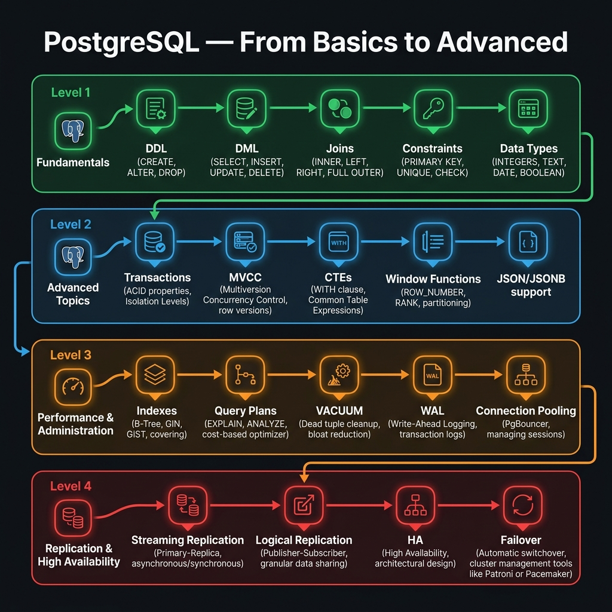

<!-- tags: sql, postgresql, database, overview -->
# 🐘 PostgreSQL — Từ cơ bản đến nâng cao

> Bạn không cần “học hết PostgreSQL” theo thứ tự docs chính thức. Bạn cần một lộ trình giúp mình biết lúc nào nên học schema/query semantics, lúc nào phải đọc plan, và lúc nào phải nghĩ như DBA hoặc on-call engineer. README này là router cho lộ trình đó.

| Aspect | Detail |
| --- | --- |
| **Concept** | PostgreSQL core learning track: fundamentals, performance, advanced SQL, replication |
| **Audience** | Backend engineer, platform engineer, DBA, senior reviewer |
| **Primary style** | Concept-First hub với audience layering |
| **Entry point** | `fundamental/`, sau đó `performance/`, `advanced/`, `replication/` |

📅 Ngày tạo: 2026-03-19 · 🔄 Cập nhật: 2026-04-04 · ⏱️ 5 phút đọc

---

## 1. DEFINE

PostgreSQL documentation library — 3 tracks song song:

- **Fundamental**: data types, DDL, DML, joins, window functions, triggers — nền tảng mọi query
- **Advanced**: PL/pgSQL, recursive CTE, MVCC internals — khi flat SQL không đủ
- **Performance + Replication**: index deep-dive, deadlock analysis, streaming HA, backup/PITR — khi production gõ cửa

Mỗi track có quiz riêng để verify mental model trước khi lên track tiếp.


| Variant | Mô tả |
| --- | --- |
| Fundamental Track | Data types, DDL, DML, joins, JSONB, functions, windows, views, triggers, COPY, schema patterns |
| Performance Track | Indexing, deadlocks, pagination, query analysis, VACUUM/WAL/checkpoint |
| Advanced Track | PL/pgSQL, CTE/recursive, LATERAL, MVCC, RLS internals |
| Replication Track | Streaming replication, logical replication, Patroni, PgBouncer, backup/PITR |

| Approach | Time | Space | Khi chọn |
| --- | --- | --- | --- |
| Fundamentals → Quiz | Phụ thuộc số bài | O(1) | Dùng khi cần khóa chắc semantics trước khi chạm performance. |
| Fundamentals → Performance | Phụ thuộc query workload | O(1) | Dùng khi ứng dụng đã chạy thật và query cost bắt đầu lộ ra. |
| Performance → Advanced | Phụ thuộc use case | O(1) | Dùng khi cần procedural SQL, tree traversal, internals hoặc tenant isolation. |
| Performance/Advanced → Replication | Phụ thuộc topology | O(1) | Dùng khi thay đổi query/schema bắt đầu ảnh hưởng standby, failover, cutover hoặc DR. |

Core insight:

> PostgreSQL không nên học như một đống feature rời rạc. Học đúng là học theo **quyết định**: viết query đúng, đọc plan đúng, rồi giữ hệ thống an toàn khi scale hoặc failover.

### Track Coverage

| Subfolder | Chủ đề | Khi nào mở |
| --- | --- | --- |
| [fundamental/](./fundamental/README.md) | Nền tảng SQL/PostgreSQL | Khi còn câu hỏi về semantics, schema, query, transaction |
| [performance/](./performance/README.md) | Query tuning & maintenance | Khi query đúng logic nhưng chậm hoặc có lock/bloat |
| [advanced/](./advanced/README.md) | Kỹ thuật nâng cao | Khi cần procedural SQL, recursive logic, internals, RLS |
| [replication/](./replication/README.md) | HA, replication, PITR | Khi hệ thống đã cần read replica, failover, DR |

---

## 2. VISUAL

Với PostgreSQL — Từ cơ bản đến nâng cao, điều còn thiếu sau phần định nghĩa là bản đồ: vấn đề nào đi nhánh nào và vì sao. Sơ đồ dưới đây làm rõ đường đi đó trước khi bạn chạm vào chi tiết triển khai.



### Level 1

```text
fundamental
    |
    v
performance
    |
    +--> advanced
    |
    v
replication
    |
    v
quiz/module + quiz/scenario
```

*Hình: Level 1 cho thấy thứ tự học hợp lý: semantics trước, tuning sau, rồi mới đến internals và HA.*

### Level 2

```text
Question you are asking                Track to open
------------------------------------  ---------------------------------------------
"Query này có đúng logic không?"      fundamental
"Planner tại sao chọn plan này?"      performance
"Tôi cần procedural / recursive SQL"  advanced
"Replica / failover / PITR ra sao?"   replication
"Tôi thực sự hiểu đến đâu?"           ../quiz
```

*Hình: Level 2 biến PostgreSQL hub thành decision table — câu hỏi nào cũng map sang đúng track thay vì học lan man.*

---
## 3. CODE

Có bản đồ của PostgreSQL — Từ cơ bản đến nâng cao rồi vẫn chưa đủ nếu bạn không biến nó thành checklist hoặc lab có thể chạy thật. Phần dưới đây chuyển routing logic thành artifact dùng được ngay.

### Problem 1: Basic — Chọn track đầu tiên cho một backend feature

> **Mục tiêu**: Quyết định đọc track nào khi đang xây feature chứ không phải đang “học cho đủ”.
> **Approach**: Map feature questions sang từng subfolder PostgreSQL.
> **Ví dụ**: Đầu vào là một feature backlog; đầu ra là track nên đọc trước.
> **Độ phức tạp**: Basic — chọn đúng entry point.

```text
Feature: build order service

Need schema + constraints?
  -> fundamental

Need pagination + indexing?
  -> performance

Need stored procedure / recursive hierarchy?
  -> advanced

Need read replica / failover / PITR?
  -> replication
```

**Tại sao?** Hầu hết team mất thời gian vì họ đọc tài liệu theo tên folder thay vì theo câu hỏi đang cần trả lời. Problem này ép router theo backlog thực tế, giúp người đọc không bị drown trong feature list của PostgreSQL.

**Kết luận**: Hub README có giá trị khi nó giúp chọn đúng track đầu tiên. Sau đó mỗi README con mới làm nhiệm vụ đi sâu hơn.

### Problem 2: Intermediate — Chuẩn hóa learning checkpoint sau mỗi track

> **Mục tiêu**: Không để việc học dừng ở “đọc xong”.
> **Approach**: Gắn mỗi track với quiz tương ứng để verify mental model.
> **Ví dụ**: Đầu vào là một track vừa đọc xong; đầu ra là checkpoint nên làm tiếp.
> **Độ phức tạp**: Intermediate — kết hợp docs với verification path.

```sql
-- track_checkpoint.sql — pseudo checklist để review sau mỗi track
SELECT *
FROM (VALUES
  ('fundamental', 'quiz/module/01-postgresql-fundamentals.md'),
  ('performance', 'quiz/module/02-query-plans-performance-and-maintenance.md'),
  ('replication', 'quiz/module/03-replication-and-ha.md'),
  ('logical/CDC', 'quiz/module/04-logical-replication-and-cdc.md')
) AS checkpoints(track, quiz_file);
```

**Tại sao?** PostgreSQL là miền có nhiều false confidence: đọc docs thấy hiểu, nhưng đến lúc gặp deadlock, lag hay wrong grouping semantics thì lại trả lời sai. Quiz là thiết bị đo chất lượng mental model, không phải phần phụ.

**Kết luận**: Nếu một track không kết thúc bằng verification, kiến thức về track đó chưa ổn định.

### Problem 3: Advanced — Chuyển từ single-node thinking sang production thinking

> **Mục tiêu**: Cho thấy khi nào learner phải rời khỏi mindset “database local” để sang mindset production.
> **Approach**: So sánh câu hỏi ở local dev với câu hỏi ở production topology.
> **Ví dụ**: Đầu vào là feature đã chạy thật; đầu ra là moment để chuyển từ `performance` sang `replication`.
> **Độ phức tạp**: Advanced — có topology và rollback risk.

```text
Local dev question:
  "Query này nhanh chưa?"

Production question:
  "Query này nhanh chưa, có ổn định plan không, có làm replica lag tăng không,
   failover có còn an toàn không, backup/PITR có giữ được recovery objective không?"
```

**Tại sao?** Nhiều team dừng ở performance tuning và quên rằng mọi thay đổi với query, index hoặc batch job đều tác động lên WAL, replica replay và recovery path. Production thinking bắt đầu khi bạn nhìn một thay đổi qua topology, không chỉ qua latency.

**Kết luận**: `replication/` không phải track “nâng cao cho vui”. Nó là bước bắt buộc khi hệ thống đã trở thành production system thật.

---
## 4. PITFALLS

PostgreSQL — Từ cơ bản đến nâng cao chỉ có ích khi nó giúp tránh đi nhầm đường. Phần dưới đây chỉ ra những cách người đọc thường tự phá learning path hoặc triage path của chính mình.

| # | Severity | Lỗi | Hậu quả | Fix |
| --- | --- | --- | --- | --- |
| 1 | 🔴 Fatal | Nhảy thẳng vào performance khi fundamentals còn yếu | Query có thể nhanh hơn nhưng vẫn sai semantics | Hoàn thành `fundamental/` trước, đặc biệt joins, grouping, transactions, JSONB. |
| 2 | 🟡 Common | Xem `advanced/` như “hay ho” mà không gắn use case | Dùng recursive/PLpgSQL sai chỗ, tăng complexity vô ích | Chỉ mở `advanced/` khi feature thực sự cần procedural logic hoặc internals. |
| 3 | 🟡 Common | Tối ưu xong rồi coi như xong, không học replication | Thay đổi query/index ảnh hưởng standby hoặc failover nhưng team không nhận ra | Khi hệ thống có replica hoặc DR, mở `replication/` ngay. |
| 4 | 🔵 Minor | Không gắn docs với quiz | Khó biết team thật sự hiểu đến đâu | Chèn module quiz và scenario quiz vào learning cadence. |

---
## 5. REF

| Resource | Loại | Link | Ghi chú |
| --- | --- | --- | --- |
| PostgreSQL Documentation | Official docs | https://www.postgresql.org/docs/current/index.html | Canonical reference cho mọi track trong hub này. |
| Neon PostgreSQL Tutorial | Tutorial | https://neon.com/postgresql/tutorial | Companion material tốt cho `fundamental/`. |

---

## 6. RECOMMEND

Khi đường đi của PostgreSQL — Từ cơ bản đến nâng cao đã rõ, bạn có thể rẽ sang đúng module tiếp theo thay vì đọc lan man. Phần gợi ý dưới đây mở tiếp cánh cửa đó.

| Mở rộng | Khi nào | Lý do | File/Link |
| --- | --- | --- | --- |
| PostgreSQL Fundamentals | Khi cần baseline semantics | Giữ mọi tối ưu sau này đứng trên nền đúng | [fundamental/README.md](./fundamental/README.md) |
| PostgreSQL Performance | Khi query đúng logic nhưng production bắt đầu đau | Chuyển từ correctness sang cost-based thinking | [performance/README.md](./performance/README.md) |
| PostgreSQL Advanced | Khi cần procedural SQL, recursive logic, internals | Mở rộng sang những feature khó hơn của engine | [advanced/README.md](./advanced/README.md) |
| PostgreSQL Replication | Khi có replica, failover, PITR, CDC | Kết nối tuning với HA và recovery | [replication/README.md](./replication/README.md) |
| SQL Quiz | Khi cần xác nhận mental model | Biến learning path thành vòng lặp có kiểm chứng | [../quiz/README.md](../quiz/README.md) |

---

## 7. QUICK REF

| Nếu hỏi | Mở track |
| --- | --- |
| “Câu SQL này đúng chưa?” | `fundamental/` |
| “Planner chọn gì và vì sao?” | `performance/` |
| “Có cần PL/pgSQL / recursive / RLS không?” | `advanced/` |
| “Replica, failover, PITR ổn chưa?” | `replication/` |
| “Mình hiểu thật chưa?” | `../quiz/` |