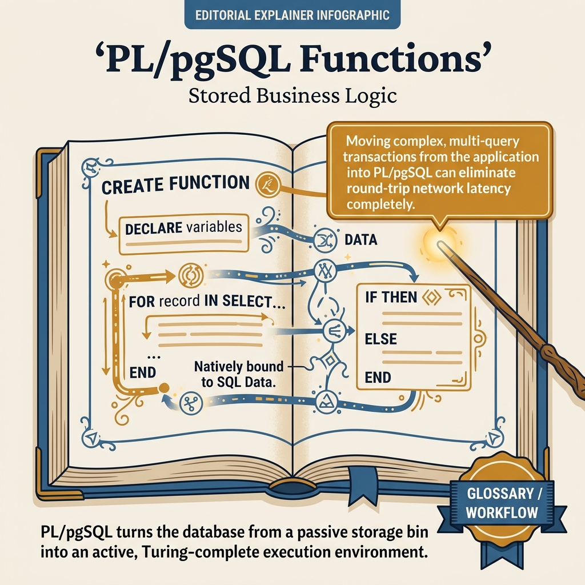
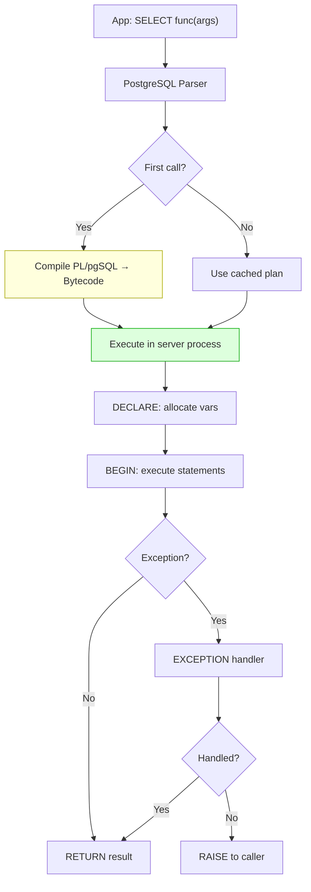

<!-- tags: sql, postgresql, database -->
# 📝 PL/pgSQL — Complete Guide

> Server-side programming language: variables, control structures, functions, procedures, cursors, triggers, exception handling — từ cơ bản đến production patterns.

| Aspect           | Detail                                                                                   |
| ---------------- | ---------------------------------------------------------------------------------------- |
| **Concept**      | PostgreSQL procedural language — PL/pgSQL                                                |
| **Use case**     | Business logic, audit triggers, computed columns, batch processing                       |
| **Go relevance** | `CALL procedure()`, `SELECT func()` từ pgx                                               |
| **Reference**    | [neon.com/postgresql/postgresql-plpgsql](https://neon.com/postgresql/postgresql-plpgsql) |

---

📅 Ngày tạo: 2026-03-19 · 🔄 Cập nhật: 2026-04-04 · ⏱️ 22 phút đọc

---

## 1. DEFINE

Yêu cầu: "khi order shipped, trừ inventory, ghi audit log, gửi notification — tất cả trong 1 transaction." Developer viết 3 round-trips từ Go app: SELECT → UPDATE → INSERT. Latency 15ms mỗi round-trip × 3 = 45ms chỉ cho logic đơn giản. Dưới 100 req/s thì fine. Nhưng flash sale 5,000 req/s: connection pool exhaust, transaction idle 45ms × 5,000 = 225 giây tổng lock time.

Chuyển logic vào PL/pgSQL: 1 function call, 0 round-trips, 3 statements chạy trong cùng process. Latency giảm từ 45ms xuống 2ms. Nhưng 6 tháng sau, team thêm 5 triggers + 3 procedures — debugging trở thành khảo cổ: không ai biết logic nào chạy ở app, logic nào chạy ở DB.

PL/pgSQL là trade-off: **performance vs debuggability**. Bài này dạy bạn khi nào nên đưa logic xuống DB, khi nào nên giữ ở app, và cách viết PL/pgSQL không biến database thành ứng dụng thứ hai.


| Variant | Mô tả |
| --- | --- |
| Return value | ✅ Required (RETURNS type) · ❌ No return (use INOUT params) |
| Transaction control | ❌ Runs in caller's TX · ✅ Own COMMIT/ROLLBACK |
| Call syntax | SELECT func() / FROM func() · CALL proc() |
| Use in queries | ✅ SELECT *, func(col) FROM t · ❌ Standalone only |

| Approach | Time | Space | Khi chọn |
| --- | --- | --- | --- |
| Variables, SELECT INTO, Control Structures | Phụ thuộc cardinality | Phụ thuộc row width | Dùng để nắm baseline semantics trước khi tune planner hoặc index. |
| Functions, Table Returns, Overloading | Phụ thuộc plan | Phụ thuộc memory operator | Dùng khi query đã chạm index, cardinality hoặc join strategy. |
| Stored Procedures, Exception Handling, Dynamic SQL | Phụ thuộc workload | Phụ thuộc buffer/WAL | Dùng khi workload production cần cân bằng correctness, lock và rollout. |
| Cursors, Triggers, NOTIFY/LISTEN | Phụ thuộc incident path | Phụ thuộc replication/cache | Dùng khi cần operational playbook, incident response hoặc phối hợp nhiều kỹ thuật. |


### Block Structure

Mọi PL/pgSQL code đều nằm trong block:

```sql
DO $$                    -- Anonymous block (execute immediately)
DECLARE
    -- Variable declarations
    v_count integer := 0;
BEGIN
    -- Executable statements
    SELECT count(*) INTO v_count FROM users;
    RAISE NOTICE 'Total users: %', v_count;
EXCEPTION
    WHEN others THEN
        RAISE WARNING 'Error: %', SQLERRM;
END;
$$;
```

### Function vs Procedure (PG 11+)

| Feature                 | Function (`CREATE FUNCTION`)    | Procedure (`CREATE PROCEDURE`)  |
| ----------------------- | ------------------------------- | ------------------------------- |
| **Return value**        | ✅ Required (RETURNS type)      | ❌ No return (use INOUT params) |
| **Transaction control** | ❌ Runs in caller's TX          | ✅ Own COMMIT/ROLLBACK          |
| **Call syntax**         | `SELECT func()` / `FROM func()` | `CALL proc()`                   |
| **Use in queries**      | ✅ `SELECT *, func(col) FROM t` | ❌ Standalone only              |
| **Side effects**        | ✅ But within 1 transaction     | ✅ Can span multiple TXs        |

### Variable Types

| Type         | Mô tả                             | Ví dụ                           |
| ------------ | --------------------------------- | ------------------------------- |
| **Scalar**   | Single value (integer, text, ...) | `v_count integer := 0`          |
| **%TYPE**    | Copy type từ column               | `v_email users.email%TYPE`      |
| **%ROWTYPE** | Copy structure từ table           | `v_user users%ROWTYPE`          |
| **RECORD**   | Dynamic row type                  | `v_row RECORD`                  |
| **CONSTANT** | Read-only variable                | `c_max CONSTANT integer := 100` |
| **ALIAS**    | Param alias                       | `p_id ALIAS FOR $1`             |

### Parameter Modes

| Mode             | Direction     | Description                |
| ---------------- | ------------- | -------------------------- |
| **IN** (default) | Input only    | Read-only parameter        |
| **OUT**          | Output only   | Function returns this      |
| **INOUT**        | Both          | Input + modified as output |
| **VARIADIC**     | Variable args | `VARIADIC p_ids int[]`     |

### Control Structures Summary

| Structure         | Syntax                                        | Use case                    |
| ----------------- | --------------------------------------------- | --------------------------- |
| **IF/ELSIF/ELSE** | `IF cond THEN ... ELSIF ... ELSE ... END IF`  | Conditional logic           |
| **CASE**          | `CASE expr WHEN val THEN ... END CASE`        | Multi-branch selection      |
| **LOOP**          | `LOOP ... EXIT WHEN cond; END LOOP`           | Basic loop                  |
| **WHILE**         | `WHILE cond LOOP ... END LOOP`                | Pre-test loop               |
| **FOR (int)**     | `FOR i IN 1..10 LOOP ... END LOOP`            | Counter loop                |
| **FOR (query)**   | `FOR rec IN SELECT ... LOOP ... END LOOP`     | Iterate result set          |
| **FOREACH**       | `FOREACH elem IN ARRAY arr LOOP ... END LOOP` | Iterate array               |
| **RETURN NEXT**   | `RETURN NEXT`                                 | Build result set row by row |
| **RETURN QUERY**  | `RETURN QUERY SELECT ...`                     | Return entire query result  |

### Trigger Variables

| Variable        | Mô tả                                   | Available in                    |
| --------------- | --------------------------------------- | ------------------------------- |
| `NEW`           | New row data                            | INSERT, UPDATE                  |
| `OLD`           | Old row data                            | UPDATE, DELETE                  |
| `TG_OP`         | Operation: 'INSERT', 'UPDATE', 'DELETE' | All                             |
| `TG_TABLE_NAME` | Table name triggering                   | All                             |
| `TG_NARGS`      | Number of trigger arguments             | All                             |
| `TG_ARGV`       | Trigger arguments array                 | All                             |
| `TG_WHEN`       | 'BEFORE', 'AFTER', 'INSTEAD OF'         | All                             |
| `FOUND`         | Last query returned rows?               | After SELECT INTO, UPDATE, etc. |

---

Các failure mode trên nghe quen. Nhưng có trap: PL/pgSQL exception handler quá rộng = swallow real errors, và RAISE NOTICE trong loop = log flood. Trap đó sẽ xuất hiện ở PITFALLS.

## 2. VISUAL

Với PL/pgSQL — Complete Guide, đọc định nghĩa thôi chưa đủ vì phần khó nằm ở cơ chế ẩn bên dưới. Một trace hoặc sơ đồ cụ thể sẽ cho thấy snapshot, dependency hay scope thật sự đang dịch chuyển theo hướng nào.




*Hình: PL/pgSQL lifecycle — Parse & Plan (compiled once) → Execute (LOOP, PERFORM, RETURN QUERY) → Control Flow (IF/FOR/WHILE) → Exception (BEGIN/EXCEPTION, RAISE). Logic gần data nhưng business rules nên ở app layer.*

### Level 1

```text
Client sends: CALL transfer_money(1, 2, 100.00)
  │
  ▼
PostgreSQL:
  ┌─ Parse & Plan ─────────────────────────────────┐
  │  1. Find procedure 'transfer_money'             │
  │  2. Bind parameters: $1=1, $2=2, $3=100.00     │
  │  3. First call → compile to bytecode (cached!)  │
  └─────────────────────┬───────────────────────────┘
                        │
  ┌─ Execute PL/pgSQL ──▼──────────────────────────┐
  │  DECLARE vars                                    │
  │  BEGIN                                           │
  │    SELECT balance INTO v_bal ... FOR UPDATE      │
  │    IF v_bal < amount THEN RAISE EXCEPTION        │
  │    UPDATE accounts ...                           │
  │    COMMIT                                        │
  │  EXCEPTION                                       │
  │    WHEN ... THEN ROLLBACK                        │
  │  END                                             │
  └─────────────────────────────────────────────────┘
                        │
Performance note:
  ✅ Compiled once, cached → subsequent calls faster
  ✅ No network round-trips between statements
  ✅ Server-side → no data transfer overhead
  ❌ Harder to debug than application code
  ❌ Tight coupling to PostgreSQL
```

```text
DECLARE cursor → OPEN → FETCH → process → FETCH → ... → CLOSE

  ┌─ Cursor ──────────────────────────────────────┐
  │                                                │
  │  OPEN: SELECT * FROM orders WHERE ...          │
  │    │                                           │
  │    ▼                                           │
  │  FETCH 100 rows → process batch                │
  │    │                                           │
  │    ▼                                           │
  │  FETCH 100 rows → process batch                │
  │    │                                           │
  │    ▼                                           │
  │  FETCH 0 rows (empty) → EXIT                   │
  │    │                                           │
  │    ▼                                           │
  │  CLOSE cursor                                  │
  └────────────────────────────────────────────────┘

  ✅ Memory efficient: chỉ load batch hiện tại
  ✅ Tốt cho: batch processing millions of rows
```

---

*Hình: Level 1 cho 📝 PL/pgSQL — Complete Guide — nhìn vào happy path hoặc baseline heuristic trước khi đi sâu vào planner và trade-off.*

### Level 2

```text
Decision Lens                 Dấu hiệu cần nhìn                 Hướng xử lý
---------------------------  --------------------------------  -------------------------------------------
Semantics trước               Kết quả có đúng intent không?    1. Variables, SELECT INTO, Control Structures
Planner / index signal        Cardinality, cost, buffers ra sao? 2. Functions, Table Returns, Overloading
Production pressure           Lock, WAL, lag, rollback nào đau? 3. Stored Procedures, Exception Handling, Dynamic SQL
```

*Hình: Level 2 biến 📝 PL/pgSQL — Complete Guide thành checklist quyết định — từ semantics, sang plan signal, rồi đến áp lực production.*


### Architecture — PL/pgSQL Execution Flow



*Hình: PL/pgSQL compile một lần, cache plan cho calls sau. Toàn bộ chạy trong server process — zero network round-trips. EXCEPTION block tạo implicit savepoint.*

---
## 3. CODE

Sau khi cơ chế của PL/pgSQL — Complete Guide đã lộ mặt trên sơ đồ, ta chuyển sang câu lệnh và pattern có thể chạy thật để xem abstraction này giúp gì và gây khó gì trong hệ thống thật.

### Problem 1: Basic — Variables, SELECT INTO, Control Structures

> **Mục tiêu**: Hiểu cách khai báo biến, gán giá trị, if/case/loop cơ bản
> **Cần**: PostgreSQL 15+
> **Đạt được**: Viết PL/pgSQL blocks cơ bản


```sql
-- ═══════════════════════════════════════════
-- 1. Variables & SELECT INTO
-- ═══════════════════════════════════════════

DO $$
DECLARE
    -- ✅ Scalar variables
    v_user_id    integer;
    v_email      text;
    v_balance    numeric(15,2) := 0.00;
    v_is_active  boolean := true;

    -- ✅ %TYPE: copy type từ column → type-safe
    v_user_email users.email%TYPE;

    -- ✅ %ROWTYPE: copy cấu trúc toàn bộ table
    v_user       users%ROWTYPE;

    -- ✅ RECORD: dynamic row type
    v_row        RECORD;

    -- ✅ CONSTANT
    c_max_retries CONSTANT integer := 3;

    -- ✅ Array
    v_tags       text[] := ARRAY['go', 'postgresql'];
BEGIN
    -- ✅ SELECT INTO — gán kết quả vào variable
    SELECT id, email INTO v_user_id, v_email
    FROM users WHERE email = 'alice@go.dev';

    -- ✅ Kiểm tra FOUND
    IF NOT FOUND THEN
        RAISE NOTICE 'User not found';
        RETURN;
    END IF;

    -- ✅ SELECT INTO row type
    SELECT * INTO v_user FROM users WHERE id = v_user_id;
    RAISE NOTICE 'User: %, Email: %', v_user.full_name, v_user.email;

    -- ✅ Dynamic record
    FOR v_row IN SELECT id, email FROM users WHERE status = 'active' LIMIT 5
    LOOP
        RAISE NOTICE 'Active user: % - %', v_row.id, v_row.email;
    END LOOP;
END;
$$;

-- ═══════════════════════════════════════════
-- 2. IF / ELSIF / ELSE
-- ═══════════════════════════════════════════

CREATE OR REPLACE FUNCTION get_tier(p_amount numeric)
RETURNS text AS $$
BEGIN
    IF p_amount >= 10000 THEN
        RETURN 'platinum';
    ELSIF p_amount >= 5000 THEN
        RETURN 'gold';
    ELSIF p_amount >= 1000 THEN
        RETURN 'silver';
    ELSE
        RETURN 'bronze';
    END IF;
END;
$$ LANGUAGE plpgsql IMMUTABLE;

-- ✅ Usage: SELECT get_tier(7500) → 'gold'
-- ✅ IMMUTABLE → planner caches result, can be used in indexes

-- ═══════════════════════════════════════════
-- 3. CASE statement
-- ═══════════════════════════════════════════

CREATE OR REPLACE FUNCTION format_status(p_status text)
RETURNS text AS $$
BEGIN
    -- ✅ Simple CASE
    CASE p_status
        WHEN 'active' THEN RETURN '🟢 Active';
        WHEN 'inactive' THEN RETURN '🟡 Inactive';
        WHEN 'suspended' THEN RETURN '🔴 Suspended';
        ELSE RETURN '⚪ Unknown: ' || p_status;
    END CASE;
END;
$$ LANGUAGE plpgsql IMMUTABLE;

-- ═══════════════════════════════════════════
-- 4. Loops: FOR, WHILE, LOOP
-- ═══════════════════════════════════════════

CREATE OR REPLACE FUNCTION fibonacci(n integer)
RETURNS integer[] AS $$
DECLARE
    v_result integer[] := ARRAY[0, 1];
    v_next   integer;
BEGIN
    IF n <= 2 THEN
        RETURN v_result[1:n];
    END IF;

    -- ✅ FOR loop with integer range
    FOR i IN 3..n LOOP
        v_next := v_result[i-1] + v_result[i-2];
        v_result := array_append(v_result, v_next);
    END LOOP;

    RETURN v_result;
END;
$$ LANGUAGE plpgsql IMMUTABLE;

-- ✅ SELECT fibonacci(10) → {0,1,1,2,3,5,8,13,21,34}

-- ✅ FOR loop over query result
DO $$
DECLARE
    v_order RECORD;
    v_total numeric := 0;
BEGIN
    FOR v_order IN
        SELECT id, amount FROM orders WHERE status = 'paid' LIMIT 100
    LOOP
        v_total := v_total + v_order.amount;
        -- Process each order...
    END LOOP;
    RAISE NOTICE 'Total: %', v_total;
END;
$$;

-- ✅ FOREACH over array
DO $$
DECLARE
    v_tag text;
    v_tags text[] := ARRAY['go', 'postgresql', 'docker'];
BEGIN
    FOREACH v_tag IN ARRAY v_tags
    LOOP
        RAISE NOTICE 'Tag: %', v_tag;
    END LOOP;
END;
$$;
```


> **✅ Đạt được**: Variables, %TYPE/%ROWTYPE, SELECT INTO, IF/CASE, FOR/WHILE/FOREACH.
> **⚠️ Lưu ý**: `FOUND` chỉ set sau SELECT INTO, INSERT, UPDATE, DELETE.

---

Block structure đã cover. Nhưng functions cần parameter modes — hãy design API.

### Problem 2: Intermediate — Functions, Table Returns, Overloading

> **Mục tiêu**: Tạo user-defined functions trả về scalar, row, table; function overloading
> **Cần**: Hiểu parameter modes (IN, OUT, INOUT)
> **Đạt được**: Production-ready function patterns


```sql
-- ═══════════════════════════════════════════
-- 1. Function returning TABLE
-- ═══════════════════════════════════════════

-- ✅ Return multiple columns as table
CREATE OR REPLACE FUNCTION get_customer_summary(p_customer_id integer)
RETURNS TABLE(
    order_count    bigint,
    total_spent    numeric,
    avg_order      numeric,
    last_order_at  timestamptz,
    tier           text
) AS $$
BEGIN
    RETURN QUERY
    SELECT
        COUNT(*)::bigint,
        COALESCE(SUM(amount), 0)::numeric,
        COALESCE(AVG(amount), 0)::numeric,
        MAX(created_at),
        CASE
            WHEN COALESCE(SUM(amount), 0) >= 10000 THEN 'platinum'
            WHEN COALESCE(SUM(amount), 0) >= 5000 THEN 'gold'
            WHEN COALESCE(SUM(amount), 0) >= 1000 THEN 'silver'
            ELSE 'bronze'
        END
    FROM orders
    WHERE customer_id = p_customer_id AND status = 'paid';
END;
$$ LANGUAGE plpgsql STABLE;

-- ✅ Usage (as table source):
SELECT * FROM get_customer_summary(42);
-- order_count | total_spent | avg_order | last_order_at | tier
-- -----------+-------------+-----------+---------------+------
--         15 |     7500.00 |    500.00 | 2024-06-15    | gold

-- ═══════════════════════════════════════════
-- 2. Function returning SETOF (multiple rows)
-- ═══════════════════════════════════════════

CREATE OR REPLACE FUNCTION get_top_customers(p_limit integer DEFAULT 10)
RETURNS SETOF RECORD AS $$
DECLARE
    v_row RECORD;
BEGIN
    FOR v_row IN
        SELECT c.id, c.name, SUM(o.amount) AS total
        FROM customers c
        JOIN orders o ON o.customer_id = c.id
        WHERE o.status = 'paid'
        GROUP BY c.id, c.name
        ORDER BY total DESC
        LIMIT p_limit
    LOOP
        RETURN NEXT v_row;  -- ✅ Add row to result set
    END LOOP;
END;
$$ LANGUAGE plpgsql STABLE;

-- ═══════════════════════════════════════════
-- 3. OUT parameters (multiple return values)
-- ═══════════════════════════════════════════

CREATE OR REPLACE FUNCTION calculate_tax(
    IN  p_amount  numeric,
    IN  p_rate    numeric DEFAULT 0.10,
    OUT o_tax     numeric,
    OUT o_total   numeric,
    OUT o_pretty  text
) AS $$
BEGIN
    o_tax := round(p_amount * p_rate, 2);
    o_total := p_amount + o_tax;
    o_pretty := format('%s + %s tax = %s', p_amount, o_tax, o_total);
END;
$$ LANGUAGE plpgsql IMMUTABLE;

-- ✅ SELECT * FROM calculate_tax(1000, 0.08);
-- o_tax  | o_total | o_pretty
-- -------+---------+---------------------------
-- 80.00  | 1080.00 | 1000 + 80.00 tax = 1080.00

-- ═══════════════════════════════════════════
-- 4. Function overloading
-- ═══════════════════════════════════════════

-- ✅ Same name, different parameter types
CREATE OR REPLACE FUNCTION find_user(p_id integer)
RETURNS users AS $$
    SELECT * FROM users WHERE id = p_id;
$$ LANGUAGE sql STABLE;

CREATE OR REPLACE FUNCTION find_user(p_email text)
RETURNS users AS $$
    SELECT * FROM users WHERE email = p_email;
$$ LANGUAGE sql STABLE;

-- ✅ PG auto-selects based on argument type:
-- SELECT * FROM find_user(42);           → by ID
-- SELECT * FROM find_user('a@go.dev');   → by email

-- ═══════════════════════════════════════════
-- 5. Volatility categories (PERFORMANCE!)
-- ═══════════════════════════════════════════

-- IMMUTABLE: result never changes for same inputs → cacheable, usable in indexes
-- STABLE:    result doesn't change within 1 query → safe for query optimization
-- VOLATILE:  result can change between calls → no optimization (default)

-- ✅ IMMUTABLE cho pure computation
CREATE FUNCTION add_vat(price numeric) RETURNS numeric AS $$
    SELECT price * 1.10;
$$ LANGUAGE sql IMMUTABLE;
-- → Can be used in expression indexes!
-- CREATE INDEX idx_products_with_vat ON products(add_vat(price));

-- ✅ STABLE cho database reads
CREATE FUNCTION get_setting(key text) RETURNS text AS $$
    SELECT value FROM settings WHERE name = key;
$$ LANGUAGE sql STABLE;
-- → Won't be re-executed for each row in same query
```

```go
// ✅ Go: Call table-returning function
func (r *Repo) GetCustomerSummary(ctx context.Context, customerID int) (*CustomerSummary, error) {
    var s CustomerSummary
    err := r.pool.QueryRow(ctx,
        `SELECT * FROM get_customer_summary($1)`, customerID,
    ).Scan(&s.OrderCount, &s.TotalSpent, &s.AvgOrder, &s.LastOrderAt, &s.Tier)
    return &s, err
}
```


> **✅ Đạt được**: Table returns, SETOF, OUT params, overloading, volatility.
> **⚠️ Lưu ý**: Đặt đúng volatility category → ảnh hưởng lớn đến performance!

---

Functions đã cover. Nhưng error handling cần EXCEPTION blocks — hãy protect.

### Problem 3: Advanced — Stored Procedures, Exception Handling, Dynamic SQL

> **Mục tiêu**: Procedures với transaction control, exception handling chi tiết, dynamic SQL
> **Cần**: PostgreSQL 11+ (procedures), SECURITY DEFINER
> **Đạt được**: Production-grade server-side logic


```sql
-- ═══════════════════════════════════════════
-- 1. Stored Procedure với Transaction Control
-- ═══════════════════════════════════════════

CREATE OR REPLACE PROCEDURE process_batch_orders(
    p_batch_size integer DEFAULT 100,
    INOUT p_processed integer DEFAULT 0
)
LANGUAGE plpgsql AS $$
DECLARE
    v_order  RECORD;
    v_cursor CURSOR FOR
        SELECT id, customer_id, amount
        FROM orders
        WHERE status = 'pending'
        ORDER BY created_at
        LIMIT p_batch_size
        FOR UPDATE SKIP LOCKED;  -- ✅ Concurrent-safe!
BEGIN
    OPEN v_cursor;

    LOOP
        FETCH v_cursor INTO v_order;
        EXIT WHEN NOT FOUND;

        -- ✅ Process each order
        BEGIN
            UPDATE orders SET status = 'processing' WHERE id = v_order.id;

            -- Business logic here...
            UPDATE accounts
            SET balance = balance - v_order.amount
            WHERE id = v_order.customer_id;

            UPDATE orders SET status = 'completed' WHERE id = v_order.id;

            p_processed := p_processed + 1;

            -- ✅ Commit every 10 orders (prevent long transaction)
            IF p_processed % 10 = 0 THEN
                COMMIT;  -- ✅ Only procedures can COMMIT!
            END IF;

        EXCEPTION
            WHEN OTHERS THEN
                -- ✅ Log error and continue with next order
                RAISE WARNING 'Order % failed: %', v_order.id, SQLERRM;
                UPDATE orders SET status = 'failed',
                    metadata = jsonb_build_object('error', SQLERRM)
                WHERE id = v_order.id;
        END;
    END LOOP;

    CLOSE v_cursor;
    COMMIT;

    RAISE NOTICE 'Processed % orders', p_processed;
END;
$$;

-- ✅ Call:
CALL process_batch_orders(500);

-- ═══════════════════════════════════════════
-- 2. Exception Handling chi tiết
-- ═══════════════════════════════════════════

CREATE OR REPLACE FUNCTION safe_transfer(
    p_from_id   bigint,
    p_to_id     bigint,
    p_amount    numeric
) RETURNS jsonb AS $$
DECLARE
    v_from_balance  numeric;
    v_result        jsonb;
BEGIN
    -- ✅ Input validation
    IF p_amount <= 0 THEN
        RAISE EXCEPTION 'Amount must be positive: %', p_amount
            USING ERRCODE = 'check_violation',
                  HINT = 'Provide a positive amount';
    END IF;

    IF p_from_id = p_to_id THEN
        RAISE EXCEPTION 'Cannot transfer to same account'
            USING ERRCODE = 'invalid_parameter_value';
    END IF;

    -- ✅ Lock in consistent order (prevent deadlock)
    PERFORM 1 FROM accounts
    WHERE id IN (p_from_id, p_to_id)
    ORDER BY id FOR UPDATE;

    -- ✅ Check balance
    SELECT balance INTO STRICT v_from_balance
    FROM accounts WHERE id = p_from_id;

    IF v_from_balance < p_amount THEN
        RAISE EXCEPTION 'Insufficient balance: % < %', v_from_balance, p_amount
            USING ERRCODE = 'insufficient_funds';
    END IF;

    -- ✅ Execute transfer
    UPDATE accounts SET balance = balance - p_amount WHERE id = p_from_id;
    UPDATE accounts SET balance = balance + p_amount WHERE id = p_to_id;

    -- ✅ Log
    INSERT INTO transfer_log(from_id, to_id, amount)
    VALUES (p_from_id, p_to_id, p_amount);

    v_result := jsonb_build_object(
        'success', true,
        'from', p_from_id, 'to', p_to_id,
        'amount', p_amount, 'timestamp', now()
    );
    RETURN v_result;

EXCEPTION
    WHEN no_data_found THEN
        RETURN jsonb_build_object('success', false, 'error', 'Account not found');
    WHEN SQLSTATE 'insufficient_funds' THEN
        RETURN jsonb_build_object('success', false, 'error', 'Insufficient balance',
            'balance', v_from_balance, 'requested', p_amount);
    WHEN check_violation THEN
        RETURN jsonb_build_object('success', false, 'error', SQLERRM);
    WHEN deadlock_detected THEN
        RAISE WARNING 'Deadlock detected, retrying...';
        -- ⚠️ Cannot retry inside function — must retry from application
        RETURN jsonb_build_object('success', false, 'error', 'Deadlock, please retry');
    WHEN OTHERS THEN
        RETURN jsonb_build_object('success', false,
            'error', SQLERRM, 'code', SQLSTATE,
            'detail', PG_EXCEPTION_DETAIL,
            'context', PG_EXCEPTION_CONTEXT);
END;
$$ LANGUAGE plpgsql;

-- ═══════════════════════════════════════════
-- 3. Dynamic SQL (EXECUTE)
-- ═══════════════════════════════════════════

-- ✅ Dynamic table name + conditions
CREATE OR REPLACE FUNCTION dynamic_search(
    p_table     text,
    p_column    text,
    p_value     text,
    p_limit     integer DEFAULT 10
) RETURNS SETOF RECORD AS $$
DECLARE
    v_query text;
BEGIN
    -- ✅ format() with %I (identifier) and %L (literal) → SQL injection safe!
    v_query := format(
        'SELECT * FROM %I WHERE %I = %L ORDER BY id LIMIT %s',
        p_table, p_column, p_value, p_limit
    );

    RAISE NOTICE 'Executing: %', v_query;
    RETURN QUERY EXECUTE v_query;
END;
$$ LANGUAGE plpgsql;

-- ✅ Dynamic pivot / cross-tab
CREATE OR REPLACE FUNCTION generate_report(
    p_year integer,
    p_group_by text DEFAULT 'month'
) RETURNS TABLE(period text, revenue numeric, orders bigint) AS $$
BEGIN
    RETURN QUERY EXECUTE format(
        $q$
        SELECT
            to_char(created_at, CASE %L
                WHEN 'month' THEN 'YYYY-MM'
                WHEN 'week' THEN 'IYYY-IW'
                WHEN 'day' THEN 'YYYY-MM-DD'
            END) AS period,
            SUM(amount)::numeric AS revenue,
            COUNT(*)::bigint AS orders
        FROM orders
        WHERE extract(year FROM created_at) = %s
          AND status = 'paid'
        GROUP BY 1 ORDER BY 1
        $q$,
        p_group_by, p_year
    );
END;
$$ LANGUAGE plpgsql STABLE;

-- ✅ SELECT * FROM generate_report(2024, 'month');
```

```go
// ✅ Go: Call stored procedure with INOUT
func (r *Repo) ProcessBatchOrders(ctx context.Context, batchSize int) (int, error) {
    var processed int
    err := r.pool.QueryRow(ctx,
        `CALL process_batch_orders($1, $2)`, batchSize, 0,
    ).Scan(&processed)
    return processed, err
}

// ✅ Go: Call function returning JSONB
func (r *Repo) SafeTransfer(ctx context.Context, from, to int64, amount float64) (*TransferResult, error) {
    var result json.RawMessage
    err := r.pool.QueryRow(ctx,
        `SELECT safe_transfer($1, $2, $3)`, from, to, amount,
    ).Scan(&result)
    if err != nil {
        return nil, err
    }
    var tr TransferResult
    json.Unmarshal(result, &tr)
    return &tr, nil
}
```


> **✅ Đạt được**: Procedures with TX control, comprehensive exception handling, dynamic SQL.
> **⚠️ Lưu ý**: Dynamic SQL → LUÔN dùng `format(%I, %L)` — NEVER string concatenation!

---

### Problem 4: Expert — Cursors, Triggers, NOTIFY/LISTEN

> **Mục tiêu**: Batch processing với cursors, generic audit triggers, real-time notifications
> **Cần**: Production workload patterns
> **Đạt được**: Server-side batch processing + event-driven patterns


```sql
-- ═══════════════════════════════════════════
-- 1. Cursor-based Batch Processing
-- ═══════════════════════════════════════════

CREATE OR REPLACE PROCEDURE cleanup_expired_sessions(
    p_batch_size integer DEFAULT 1000,
    INOUT p_deleted bigint DEFAULT 0
)
LANGUAGE plpgsql AS $$
DECLARE
    v_batch_count integer;
BEGIN
    LOOP
        -- ✅ Delete in batches (avoid long locks)
        WITH deleted AS (
            DELETE FROM sessions
            WHERE id IN (
                SELECT id FROM sessions
                WHERE expired_at < now() - interval '7 days'
                LIMIT p_batch_size
                FOR UPDATE SKIP LOCKED
            )
            RETURNING id
        )
        SELECT count(*) INTO v_batch_count FROM deleted;

        p_deleted := p_deleted + v_batch_count;

        -- ✅ Commit each batch
        COMMIT;

        -- ✅ Exit when no more rows
        EXIT WHEN v_batch_count < p_batch_size;

        -- ✅ Small pause to reduce lock contention
        PERFORM pg_sleep(0.1);
    END LOOP;

    RAISE NOTICE 'Cleaned up % expired sessions', p_deleted;
END;
$$;

-- ═══════════════════════════════════════════
-- 2. Generic Audit Trigger (production-ready)
-- ═══════════════════════════════════════════

CREATE TABLE audit_log (
    id          bigint GENERATED ALWAYS AS IDENTITY PRIMARY KEY,
    table_name  text NOT NULL,
    operation   text NOT NULL,
    row_id      text,
    old_data    jsonb,
    new_data    jsonb,
    changed_fields text[],      -- ✅ Only changed columns
    changed_by  text DEFAULT current_user,
    changed_at  timestamptz DEFAULT now(),
    app_user_id text           -- ✅ Application-level user
);

CREATE OR REPLACE FUNCTION audit_trigger_func()
RETURNS TRIGGER AS $$
DECLARE
    v_old_data  jsonb;
    v_new_data  jsonb;
    v_changed   text[] := '{}';
    v_key       text;
    v_app_user  text;
BEGIN
    -- ✅ Get application user from session variable
    BEGIN
        v_app_user := current_setting('app.current_user_id', true);
    EXCEPTION WHEN OTHERS THEN
        v_app_user := NULL;
    END;

    IF TG_OP = 'INSERT' THEN
        INSERT INTO audit_log(table_name, operation, row_id, new_data, app_user_id)
        VALUES (TG_TABLE_NAME, TG_OP, NEW.id::text, to_jsonb(NEW), v_app_user);
        RETURN NEW;

    ELSIF TG_OP = 'UPDATE' THEN
        v_old_data := to_jsonb(OLD);
        v_new_data := to_jsonb(NEW);

        -- ✅ Find changed fields only
        FOR v_key IN SELECT key FROM jsonb_each(v_new_data)
        LOOP
            IF v_old_data->v_key IS DISTINCT FROM v_new_data->v_key THEN
                v_changed := array_append(v_changed, v_key);
            END IF;
        END LOOP;

        -- ✅ Skip if nothing actually changed
        IF array_length(v_changed, 1) IS NULL THEN
            RETURN NEW;
        END IF;

        INSERT INTO audit_log(table_name, operation, row_id, old_data, new_data, changed_fields, app_user_id)
        VALUES (TG_TABLE_NAME, TG_OP, NEW.id::text, v_old_data, v_new_data, v_changed, v_app_user);
        RETURN NEW;

    ELSIF TG_OP = 'DELETE' THEN
        INSERT INTO audit_log(table_name, operation, row_id, old_data, app_user_id)
        VALUES (TG_TABLE_NAME, TG_OP, OLD.id::text, to_jsonb(OLD), v_app_user);
        RETURN OLD;
    END IF;

    RETURN NULL;
END;
$$ LANGUAGE plpgsql;

-- ✅ Attach to tables
CREATE TRIGGER users_audit AFTER INSERT OR UPDATE OR DELETE
    ON users FOR EACH ROW EXECUTE FUNCTION audit_trigger_func();

-- ✅ Prevent recursive trigger loops
-- pg_trigger_depth() > 0 means we're inside a trigger
CREATE OR REPLACE FUNCTION safe_audit_trigger()
RETURNS TRIGGER AS $$
BEGIN
    IF pg_trigger_depth() > 1 THEN
        RETURN COALESCE(NEW, OLD);  -- ✅ Skip nested trigger
    END IF;
    -- ... audit logic ...
    RETURN COALESCE(NEW, OLD);
END;
$$ LANGUAGE plpgsql;

-- ═══════════════════════════════════════════
-- 3. NOTIFY/LISTEN — Real-time events
-- ═══════════════════════════════════════════

-- ✅ Trigger that sends notifications
CREATE OR REPLACE FUNCTION notify_order_change()
RETURNS TRIGGER AS $$
BEGIN
    PERFORM pg_notify('order_changes',
        json_build_object(
            'operation', TG_OP,
            'order_id', COALESCE(NEW.id, OLD.id),
            'status', CASE WHEN TG_OP = 'DELETE' THEN OLD.status ELSE NEW.status END,
            'timestamp', extract(epoch FROM now())
        )::text
    );
    RETURN COALESCE(NEW, OLD);
END;
$$ LANGUAGE plpgsql;

CREATE TRIGGER orders_notify AFTER INSERT OR UPDATE OR DELETE
    ON orders FOR EACH ROW EXECUTE FUNCTION notify_order_change();
```

```go
// ✅ Go: Listen for PostgreSQL notifications (real-time)
func (s *Service) ListenOrderChanges(ctx context.Context) error {
    conn, err := s.pool.Acquire(ctx)
    if err != nil {
        return err
    }
    defer conn.Release()

    // ✅ Subscribe to channel
    _, err = conn.Exec(ctx, "LISTEN order_changes")
    if err != nil {
        return err
    }

    for {
        // ✅ Wait for notification (blocks until received)
        notification, err := conn.Conn().WaitForNotification(ctx)
        if err != nil {
            return err
        }

        var event OrderChangeEvent
        json.Unmarshal([]byte(notification.Payload), &event)

        log.Printf("📬 Order %d: %s → %s", event.OrderID, event.Operation, event.Status)

        // Process event...
        s.handleOrderChange(ctx, event)
    }
}

// ✅ Go: Set application user for audit trail
func (r *Repo) WithAuditUser(ctx context.Context, userID string, fn func(pgx.Tx) error) error {
    tx, err := r.pool.Begin(ctx)
    if err != nil {
        return err
    }
    defer tx.Rollback(ctx)

    // ✅ Set session variable for audit trigger
    _, err = tx.Exec(ctx, "SET LOCAL app.current_user_id = $1", userID)
    if err != nil {
        return err
    }

    if err := fn(tx); err != nil {
        return err
    }
    return tx.Commit(ctx)
}
```

**Tại sao?** Expert path của PL/pgSQL — Complete Guide không thưởng cho việc biết nhiều cú pháp hơn, mà thưởng cho khả năng nối đúng cơ chế thấp tầng với quyết định thiết kế cao tầng. Problem 4: Expert — Cursors, Triggers, NOTIFY/LISTEN được đặt ở đây để ép bạn làm việc đó.


> **✅ Đạt được**: Cursor batch processing, generic audit with change detection, NOTIFY/LISTEN real-time.
> **⚠️ Lưu ý**: `pg_trigger_depth()` ngăn recursive loops. `SET LOCAL` chỉ tồn tại trong transaction.

---
Bạn đã đi qua PL/pgSQL blocks, functions, và error handling. Bây giờ đến phần nguy hiểm: exception swallowing và log flood — trap đã được setup từ đầu bài.

## 4. PITFALLS

PL/pgSQL — Complete Guide mạnh vì nó mở thêm nhiều cửa ra quyết định. Phần dưới đây tập trung vào những lúc mở sai cửa và tự đẩy truy vấn hoặc policy vào vùng khó debug hơn.

| # | Severity | Lỗi | Hậu quả | Fix |
| --- | --- | --- | --- | --- |
| 1 | 🔴 Fatal | EXCEPTION handler `WHEN OTHERS THEN NULL` — swallow mọi error | Silent data corruption — error bị nuốt, transaction commit với data sai | Chỉ catch specific exceptions: `WHEN unique_violation`, `WHEN check_violation` |
| 2 | 🔴 Fatal | Dynamic SQL dùng string concatenation thay format() | SQL injection: `p_table = 'users; DROP TABLE orders'` | Luôn dùng `format(%I, %L)` — `%I` cho identifiers, `%L` cho literals |
| 3 | 🟡 Common | RAISE NOTICE trong loop xử lý triệu rows | Log flood: output buffer đầy, client chờ flush, throughput giảm 10x | Log batch summary, không log per-row. Hoặc dùng `RAISE DEBUG` |
| 4 | 🟡 Common | Function VOLATILE khi có thể STABLE/IMMUTABLE | Planner không optimize — re-execute per row thay vì cache | IMMUTABLE cho pure computation, STABLE cho DB reads in same TX |
| 5 | 🔵 Minor | Không dùng %TYPE/%ROWTYPE | Schema change = function break | `v_email users.email%TYPE` auto-adapt khi column type đổi |

---
Bạn đã đi qua PL/pgSQL và cạm bẫy. Các resources dưới đây giúp đi sâu hơn.

## 5. REF

| Resource          | Link                                                                                                                 |
| ----------------- | -------------------------------------------------------------------------------------------------------------------- |
| PL/pgSQL Tutorial | [neon.com/postgresql/postgresql-plpgsql](https://neon.com/postgresql/postgresql-plpgsql)                             |
| PL/pgSQL Official | [postgresql.org/docs/current/plpgsql.html](https://www.postgresql.org/docs/current/plpgsql.html)                     |
| Trigger Functions | [postgresql.org/docs/current/plpgsql-trigger.html](https://www.postgresql.org/docs/current/plpgsql-trigger.html)     |
| NOTIFY/LISTEN     | [postgresql.org/docs/current/sql-notify.html](https://www.postgresql.org/docs/current/sql-notify.html)               |
| Error Codes       | [postgresql.org/docs/current/errcodes-appendix.html](https://www.postgresql.org/docs/current/errcodes-appendix.html) |

---

## 6. RECOMMEND

Khi lõi cơ chế của PL/pgSQL — Complete Guide đã rõ, bạn có thể nối nó sang các chủ đề lân cận như planner, security hoặc replication để thấy tác động xuyên module.

| Mở rộng                          | Khi nào              | Lý do                                         |
| -------------------------------- | -------------------- | --------------------------------------------- |
| **PL/Python, PL/V8**             | Complex computation  | Language with more libraries                  |
| **pg_cron**                      | Scheduled procedures | Cron inside PostgreSQL                        |
| **Logical replication triggers** | CDC                  | Change Data Capture via triggers              |
| **pgTAP**                        | Testing PL/pgSQL     | Unit testing for database functions           |
| **Debezium**                     | Event streaming      | Alternative to NOTIFY for distributed systems |


> **Callback** — Quay lại 45ms round-trip × 5,000 req/s lúc đầu: PL/pgSQL function giảm xuống 2ms — zero round-trips. Nhưng 6 tháng 5 triggers + 3 procedures = debugging nightmare. Rule: đưa logic xuống DB khi cần atomicity + performance, giữ ở app khi cần visibility + testability.

---

← Previous: [README](./README.md) · → Next: [02-cte-recursive-lateral.md](./02-cte-recursive-lateral.md)

---

## 7. QUICK REF

| Nếu gặp | Nghĩ ngay |
| --- | --- |
| Variables, SELECT INTO, Control Structures | Dùng pattern này khi gặp signal tương ứng trong production workload. |
| Functions, Table Returns, Overloading | Dùng pattern này khi gặp signal tương ứng trong production workload. |
| Stored Procedures, Exception Handling, Dynamic SQL | Dùng pattern này khi gặp signal tương ứng trong production workload. |
| Cursors, Triggers, NOTIFY/LISTEN | Dùng pattern này khi gặp signal tương ứng trong production workload. |
