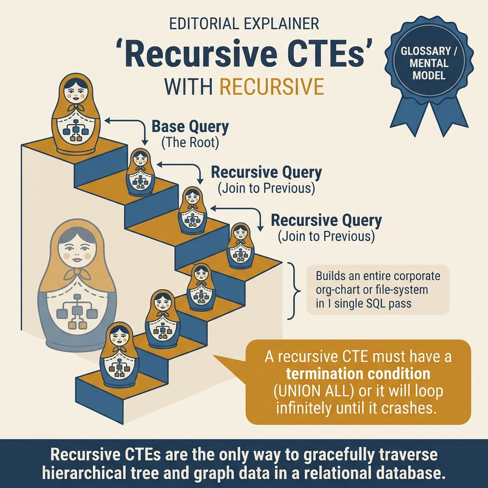
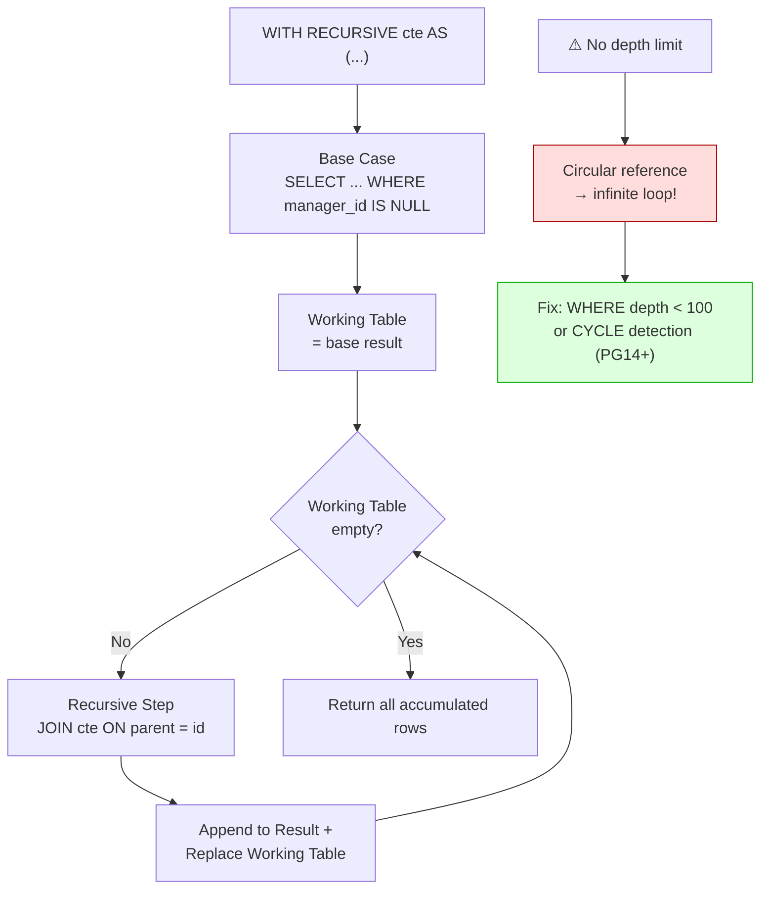

<!-- tags: sql, postgresql, database, advanced-sql -->
# 🌲 CTE, Recursive Queries & LATERAL JOIN

> Kỹ thuật query nâng cao: CTE cho modular queries, Recursive CTE cho hierarchical data, LATERAL JOIN cho correlated subqueries — kết hợp với Window Functions.

| Aspect           | Detail                                                          |
| ---------------- | --------------------------------------------------------------- |
| **Concept**      | Common Table Expressions, Recursive queries, LATERAL subqueries |
| **Use case**     | Tree traversal, graph walking, Top-N per group, modular queries |
| **Go relevance** | Complex reports, org charts, category trees                     |
| **Complexity**   | O(n) for CTE, O(depth × branching) for recursive                |

---

📅 Ngày tạo: 2026-03-19 · 🔄 Cập nhật: 2026-04-04 · ⏱️ 16 phút đọc

---

## 1. DEFINE

HR dashboard: hiển thị org chart — ai report cho ai, bao nhiêu level deep. Developer viết self-JOIN: `employees e1 JOIN employees e2 ON e2.manager_id = e1.id JOIN employees e3 ON e3.manager_id = e2.id...`. Hardcode 5 JOINs cho 5 levels. Level 6 xuất hiện → query miss toàn bộ nhánh đó. Không scalable.

Recursive CTE giải quyết: `WITH RECURSIVE org_tree AS (... UNION ALL ...)` — tự động traverse bao nhiêu level cũng được. Nhưng team không thêm `WHERE depth < 100` → một circular reference trong data (A reports to B reports to A) khiến query chạy vô hạn, PostgreSQL ăn 100% CPU 12 phút trước khi bị kill.

CTE, Recursive, LATERAL — ba công cụ giải các bài toán mà flat SQL không viết được. Nhưng mỗi cái có một trap riêng: CTE materialization giữ data quá lâu, recursive loop vô hạn, LATERAL tạo N+1 ẩn. Bài này cover cả ba.


| Variant | Mô tả |
| --- | --- |
| Scope | Trong 1 query · Trong 1 query · Trong session |
| Materialization | PG 12+: auto decide · Inline always · Always materialized |
| Reusable | ✅ Multiple references · ❌ Phải copy/paste · ✅ Multiple queries |
| Recursive | ✅ WITH RECURSIVE · ❌ Không · ❌ Không |

| Approach | Time | Space | Khi chọn |
| --- | --- | --- | --- |
| CTE cho Readable Queries | Phụ thuộc cardinality | Phụ thuộc row width | Dùng để nắm baseline semantics trước khi tune planner hoặc index. |
| Recursive CTE cho Tree & Graph | Phụ thuộc plan | Phụ thuộc memory operator | Dùng khi query đã chạm index, cardinality hoặc join strategy. |
| LATERAL JOIN + Combining Techniques | Phụ thuộc workload | Phụ thuộc buffer/WAL | Dùng khi workload production cần cân bằng correctness, lock và rollout. |


### CTE (Common Table Expressions)

CTE = **named temporary result set** trong 1 query. Như "declaring a variable" cho SQL.

```text
WITH cte_name AS (
    SELECT ...   ← "define" result set
)
SELECT * FROM cte_name;  ← "use" result set
```

| Feature             | CTE                    | Subquery           | Temp Table          |
| ------------------- | ---------------------- | ------------------ | ------------------- |
| **Scope**           | Trong 1 query          | Trong 1 query      | Trong session       |
| **Materialization** | PG 12+: auto decide    | Inline always      | Always materialized |
| **Reusable**        | ✅ Multiple references | ❌ Phải copy/paste | ✅ Multiple queries |
| **Recursive**       | ✅ `WITH RECURSIVE`    | ❌ Không           | ❌ Không            |
| **Readability**     | ✅ Excellent           | ❌ Nested = messy  | ⚠️ Side effects     |

### CTE Materialization (PG 12+)

```text
NOT MATERIALIZED (default for non-recursive):
  CTE inlined → planner optimize toàn bộ query
  ✅ Tốt cho simple CTEs

MATERIALIZED:
  CTE execute 1 lần, cache kết quả
  ✅ Tốt khi CTE referenced multiple times
  ✅ Tốt khi CTE có expensive computation
```

### Recursive CTE — cho Hierarchical Data

```text
WITH RECURSIVE cte AS (
    -- ① Base case: starting point
    SELECT * FROM categories WHERE parent_id IS NULL

    UNION ALL

    -- ② Recursive step: join back to CTE
    SELECT c.* FROM categories c
    JOIN cte ON c.parent_id = cte.id
)
SELECT * FROM cte;

Execution flow:
  Iteration 0: Root nodes (parent_id IS NULL)
  Iteration 1: Children of roots
  Iteration 2: Children of children
  ...
  Stop: No more rows returned
```

### LATERAL JOIN

LATERAL = subquery có thể **reference columns từ bảng trước** nó (correlated).

```text
-- ❌ Regular JOIN: subquery KHÔNG thể reference outer table
SELECT * FROM users u
JOIN (SELECT MAX(created_at) FROM orders WHERE user_id = u.id) x  -- ERROR!

-- ✅ LATERAL JOIN: CAN reference outer table
SELECT * FROM users u
JOIN LATERAL (
    SELECT * FROM orders WHERE user_id = u.id
    ORDER BY created_at DESC LIMIT 3
) recent_orders ON true;
```

### Failure Modes

| Lỗi                                            | Nguyên nhân                 | Fix                                   |
| ---------------------------------------------- | --------------------------- | ------------------------------------- |
| Recursive CTE infinite loop                    | Circular references         | Thêm `WHERE depth < 100` hoặc `CYCLE` |
| CTE materialized khi không cần                 | PG < 12 default materialize | `NOT MATERIALIZED` hint (PG 12+)      |
| LATERAL chậm                                   | Executed per outer row      | Add index trên inner query            |
| CTE reference nhiều lần nhưng not materialized | Planner compute nhiều lần   | `MATERIALIZED` hint                   |

---

Các failure mode trên nghe rõ. Nhưng có trap: CTE là optimization fence trước PG12 = query chậm, và recursive CTE thiếu termination = infinite loop. Trap đó sẽ xuất hiện ở PITFALLS.

## 2. VISUAL

Với CTE, Recursive Queries & LATERAL JOIN, đọc định nghĩa thôi chưa đủ vì phần khó nằm ở cơ chế ẩn bên dưới. Một trace hoặc sơ đồ cụ thể sẽ cho thấy snapshot, dependency hay scope thật sự đang dịch chuyển theo hướng nào.




*Hình: CTE mental model — Simple CTE (PG12+ inline by default), MATERIALIZED (optimization fence), Recursive (WITH RECURSIVE base+step), LATERAL JOIN (correlated per-row). PG12+ inline CTE = zero overhead.*

### Level 1

```text
categories table:
┌────┬──────────────┬───────────┐
│ id │ name         │ parent_id │
├────┼──────────────┼───────────┤
│  1 │ Electronics  │ NULL      │   ← Root
│  2 │ Phones       │ 1         │     ├── Phones
│  3 │ iPhone       │ 2         │     │   ├── iPhone
│  4 │ Samsung      │ 2         │     │   └── Samsung
│  5 │ Laptops      │ 1         │     └── Laptops
│  6 │ MacBook      │ 5         │         └── MacBook
│  7 │ Clothing     │ NULL      │   ← Root
│  8 │ Men          │ 7         │     └── Men
└────┴──────────────┴───────────┘

Recursive CTE execution:
  Iter 0: [Electronics, Clothing]              ← parent_id IS NULL
  Iter 1: [Phones, Laptops, Men]               ← parent_id IN (1, 7)
  Iter 2: [iPhone, Samsung, MacBook]           ← parent_id IN (2, 5, 8)
  Iter 3: (empty)                              ← STOP
```

```text
users × LATERAL (top 3 orders)

User Alice ──▶ LATERAL ──▶ [Order $500, Order $300, Order $200]
User Bob   ──▶ LATERAL ──▶ [Order $800, Order $100, Order $50]
User Carol ──▶ LATERAL ──▶ [Order $1000, Order $900, Order $700]

→ Mỗi user lấy top 3 orders (sorted by amount DESC)
→ Tối ưu hơn Window Function khi chỉ cần top N nhỏ
```

---

*Hình: Level 1 cho 🌲 CTE, Recursive Queries & LATERAL JOIN — nhìn vào happy path hoặc baseline heuristic trước khi đi sâu vào planner và trade-off.*

### Level 2

```text
Decision Lens                 Dấu hiệu cần nhìn                 Hướng xử lý
---------------------------  --------------------------------  -------------------------------------------
Semantics trước               Kết quả có đúng intent không?    1. CTE cho Readable Queries
Planner / index signal        Cardinality, cost, buffers ra sao? 2. Recursive CTE cho Tree & Graph
Production pressure           Lock, WAL, lag, rollback nào đau? 3. LATERAL JOIN + Combining Techniques
```

*Hình: Level 2 biến 🌲 CTE, Recursive Queries & LATERAL JOIN thành checklist quyết định — từ semantics, sang plan signal, rồi đến áp lực production.*


### Architecture — Recursive CTE Execution



*Hình: Recursive CTE iterate cho đến khi Working Table rỗng. Không có depth limit = infinite loop nếu data có circular reference. PG14+ có CYCLE clause tự detect.*

---
## 3. CODE

Sau khi cơ chế của CTE, Recursive Queries & LATERAL JOIN đã lộ mặt trên sơ đồ, ta chuyển sang câu lệnh và pattern có thể chạy thật để xem abstraction này giúp gì và gây khó gì trong hệ thống thật.

### Problem 1: Basic — CTE cho Readable Queries

> **Mục tiêu**: Dùng CTE để chia query phức tạp thành parts dễ đọc
> **Cần**: PostgreSQL 15+
> **Đạt được**: Maintainable complex queries


```sql
-- ═══════════════════════════════════════════
-- CTE: Modular query building
-- ═══════════════════════════════════════════

-- ❌ BAD: Nested subqueries — khó đọc
SELECT name, total_amount, order_count
FROM (
    SELECT customer_id, SUM(amount) AS total_amount, COUNT(*) AS order_count
    FROM orders
    WHERE status = 'paid' AND created_at > now() - interval '30 days'
    GROUP BY customer_id
    HAVING SUM(amount) > 1000
) high_value
JOIN customers c ON c.id = high_value.customer_id
ORDER BY total_amount DESC;

-- ✅ GOOD: CTE — đọc từ trên xuống dưới
WITH
    -- Step 1: Filter recent paid orders
    recent_paid AS (
        SELECT customer_id, amount
        FROM orders
        WHERE status = 'paid'
          AND created_at > now() - interval '30 days'
    ),
    -- Step 2: Aggregate per customer
    customer_totals AS (
        SELECT
            customer_id,
            SUM(amount) AS total_amount,
            COUNT(*) AS order_count
        FROM recent_paid
        GROUP BY customer_id
        HAVING SUM(amount) > 1000
    )
-- Step 3: Join with customer info
SELECT
    c.name,
    ct.total_amount,
    ct.order_count
FROM customer_totals ct
JOIN customers c ON c.id = ct.customer_id
ORDER BY ct.total_amount DESC;

-- ═══════════════════════════════════════════
-- CTE Materialization control (PG 12+)
-- ═══════════════════════════════════════════

-- ✅ NOT MATERIALIZED: planner can inline + optimize
WITH active_users AS NOT MATERIALIZED (
    SELECT id, name FROM users WHERE status = 'active'
)
SELECT * FROM active_users WHERE name LIKE 'A%';
-- → Planner pushes WHERE into CTE → uses index on name

-- ✅ MATERIALIZED: compute once, reference many times
WITH expensive_stats AS MATERIALIZED (
    SELECT user_id, SUM(amount) AS total, COUNT(*) AS cnt
    FROM orders
    GROUP BY user_id
)
SELECT
    (SELECT AVG(total) FROM expensive_stats),
    (SELECT MAX(total) FROM expensive_stats),
    (SELECT percentile_cont(0.95) WITHIN GROUP (ORDER BY total) FROM expensive_stats);
-- → CTE computed once, used 3 times
```

```go
// ✅ Go: Dynamic CTE building
func (r *Repo) GetDashboardStats(ctx context.Context, days int) (*DashboardStats, error) {
    query := `
        WITH
            recent_orders AS (
                SELECT customer_id, amount, status
                FROM orders
                WHERE created_at > now() - $1::interval
            ),
            revenue AS (
                SELECT SUM(amount) AS total
                FROM recent_orders WHERE status = 'paid'
            ),
            top_customers AS (
                SELECT customer_id, SUM(amount) AS spend
                FROM recent_orders WHERE status = 'paid'
                GROUP BY customer_id ORDER BY spend DESC LIMIT 5
            )
        SELECT
            (SELECT total FROM revenue) AS total_revenue,
            (SELECT COUNT(DISTINCT customer_id) FROM recent_orders) AS unique_customers,
            json_agg(json_build_object('id', tc.customer_id, 'spend', tc.spend))
        FROM top_customers tc
    `

    var stats DashboardStats
    err := r.pool.QueryRow(ctx, query,
        fmt.Sprintf("%d days", days),
    ).Scan(&stats.TotalRevenue, &stats.UniqueCustomers, &stats.TopCustomersJSON)
    return &stats, err
}
```


> **✅ Đạt được**: CTE chia query thành steps rõ ràng + materialization control.
> **⚠️ Lưu ý**: PG 12+: CTE default NOT MATERIALIZED (tốt). PG < 12: luôn materialized.

---

CTE basics đã cover. Nhưng recursive CTE cần hierarchy traversal — hãy traverse.

### Problem 2: Intermediate — Recursive CTE cho Tree & Graph

> **Mục tiêu**: Traverse org chart, category tree, find paths trong graph
> **Cần**: Hierarchical data (parent_id pattern)
> **Đạt được**: Full tree operations trong 1 query


```sql
-- ═══════════════════════════════════════════
-- Recursive CTE: Organization Chart
-- ═══════════════════════════════════════════

CREATE TABLE employees (
    id          integer PRIMARY KEY,
    name        text NOT NULL,
    manager_id  integer REFERENCES employees(id),
    title       text NOT NULL,
    salary      numeric(10,2)
);

INSERT INTO employees VALUES
    (1, 'CEO Alice',     NULL, 'CEO', 200000),
    (2, 'VP Bob',        1,    'VP Engineering', 150000),
    (3, 'VP Carol',      1,    'VP Sales', 150000),
    (4, 'Lead Dave',     2,    'Tech Lead', 120000),
    (5, 'Dev Eve',       4,    'Senior Dev', 100000),
    (6, 'Dev Frank',     4,    'Junior Dev', 70000),
    (7, 'Sales Grace',   3,    'Sales Manager', 90000);

-- ✅ Get full org tree with depth + path
WITH RECURSIVE org_tree AS (
    -- ① Base: top-level (CEO)
    SELECT
        id, name, title, manager_id, salary,
        0 AS depth,
        ARRAY[name]::text[] AS path,    -- path from root
        name AS tree_display
    FROM employees
    WHERE manager_id IS NULL

    UNION ALL

    -- ② Recursive: children
    SELECT
        e.id, e.name, e.title, e.manager_id, e.salary,
        ot.depth + 1,
        ot.path || e.name,
        repeat('  ', ot.depth + 1) || '├── ' || e.name   -- indented display
    FROM employees e
    JOIN org_tree ot ON e.manager_id = ot.id
)
SELECT tree_display, title, salary, depth, path
FROM org_tree
ORDER BY path;  -- ✅ alphabetical tree order

-- Output:
-- CEO Alice              CEO              200000  0  {CEO Alice}
--   ├── VP Bob           VP Engineering   150000  1  {CEO Alice,VP Bob}
--     ├── Lead Dave      Tech Lead        120000  2  {CEO Alice,VP Bob,Lead Dave}
--       ├── Dev Eve      Senior Dev       100000  3  {...}
--       ├── Dev Frank    Junior Dev        70000  3  {...}
--   ├── VP Carol         VP Sales         150000  1  {CEO Alice,VP Carol}
--     ├── Sales Grace    Sales Manager     90000  2  {...}

-- ✅ Subtree salary total per manager
WITH RECURSIVE subtree AS (
    SELECT id, name, salary, id AS root_id, name AS root_name
    FROM employees

    UNION ALL

    SELECT e.id, e.name, e.salary, s.root_id, s.root_name
    FROM employees e
    JOIN subtree s ON e.manager_id = s.id
)
SELECT
    root_name AS manager,
    COUNT(*) - 1 AS direct_reports,  -- exclude self
    SUM(salary) AS total_team_salary
FROM subtree
GROUP BY root_id, root_name
ORDER BY total_team_salary DESC;

-- ═══════════════════════════════════════════
-- Recursive CTE: File System / Category Tree
-- ═══════════════════════════════════════════

-- ✅ Find all descendants of a category
WITH RECURSIVE descendants AS (
    SELECT id, name, parent_id, 0 AS depth
    FROM categories WHERE id = 1  -- Start from "Electronics"

    UNION ALL

    SELECT c.id, c.name, c.parent_id, d.depth + 1
    FROM categories c
    JOIN descendants d ON c.parent_id = d.id
    WHERE d.depth < 10  -- ✅ Safety limit!
)
SELECT * FROM descendants;

-- ✅ CYCLE detection (PG 14+)
WITH RECURSIVE tree AS (
    SELECT id, name, parent_id, ARRAY[id] AS visited
    FROM categories WHERE parent_id IS NULL

    UNION ALL

    SELECT c.id, c.name, c.parent_id, t.visited || c.id
    FROM categories c
    JOIN tree t ON c.parent_id = t.id
    WHERE c.id != ALL(t.visited)  -- ✅ Prevent infinite loop
)
SELECT * FROM tree;

-- ✅ PG 14+ native CYCLE detection
WITH RECURSIVE tree AS (
    SELECT id, name, parent_id FROM categories WHERE parent_id IS NULL
    UNION ALL
    SELECT c.id, c.name, c.parent_id
    FROM categories c JOIN tree t ON c.parent_id = t.id
)
CYCLE id SET is_cycle USING path  -- ✅ PG 14+ built-in!
SELECT * FROM tree WHERE NOT is_cycle;
```

```go
// ✅ Go: Recursive CTE for org chart API
type OrgNode struct {
    ID        int       `json:"id" db:"id"`
    Name      string    `json:"name" db:"name"`
    Title     string    `json:"title" db:"title"`
    Depth     int       `json:"depth" db:"depth"`
    Path      []string  `json:"path" db:"path"`
    Salary    float64   `json:"salary" db:"salary"`
}

func (r *Repo) GetOrgTree(ctx context.Context, rootID *int) ([]OrgNode, error) {
    query := `
        WITH RECURSIVE org_tree AS (
            SELECT id, name, title, salary, 0 AS depth, ARRAY[name]::text[] AS path
            FROM employees
            WHERE CASE
                WHEN $1::int IS NOT NULL THEN id = $1
                ELSE manager_id IS NULL
            END

            UNION ALL

            SELECT e.id, e.name, e.title, e.salary,
                   ot.depth + 1, ot.path || e.name
            FROM employees e
            JOIN org_tree ot ON e.manager_id = ot.id
            WHERE ot.depth < 20
        )
        SELECT id, name, title, salary, depth, path
        FROM org_tree ORDER BY path
    `
    rows, err := r.pool.Query(ctx, query, rootID)
    if err != nil {
        return nil, err
    }
    defer rows.Close()
    return pgx.CollectRows(rows, pgx.RowToStructByName[OrgNode])
}
```


> **✅ Đạt được**: Full tree traversal, subtree aggregation, cycle detection.
> **⚠️ Lưu ý**: LUÔN có depth limit cho recursive CTE.

---

Recursive đã cover. Nhưng LATERAL JOIN cần row-dependent subquery — hãy correlate.

### Problem 3: Advanced — LATERAL JOIN + Combining Techniques

> **Mục tiêu**: Top-N per group, correlated subqueries, combine CTE + LATERAL + Window
> **Cần**: LATERAL syntax (PG 9.3+)
> **Đạt được**: Most efficient Top-N queries


```sql
-- ═══════════════════════════════════════════
-- LATERAL: Top 3 orders per customer
-- ═══════════════════════════════════════════

-- ❌ SLOW: Window function approach (processes ALL rows)
SELECT * FROM (
    SELECT *,
        ROW_NUMBER() OVER (PARTITION BY customer_id ORDER BY amount DESC) AS rn
    FROM orders
) sub WHERE rn <= 3;
-- → Scans entire orders table, ranks everything, then filters

-- ✅ FAST: LATERAL approach (stops at 3 per customer)
SELECT c.name, o.*
FROM customers c
JOIN LATERAL (
    SELECT id, amount, status, created_at
    FROM orders
    WHERE customer_id = c.id
    ORDER BY amount DESC
    LIMIT 3        -- ✅ Only fetches 3 rows per customer!
) o ON true;
-- → Uses index on orders(customer_id, amount DESC)
-- → Much faster khi số customers << số orders

-- ═══════════════════════════════════════════
-- LATERAL: Running statistics per user
-- ═══════════════════════════════════════════

-- ✅ For each customer: latest order + total spent + order count
SELECT
    c.id, c.name,
    stats.order_count,
    stats.total_spent,
    latest.amount AS latest_amount,
    latest.created_at AS latest_order_at
FROM customers c
JOIN LATERAL (
    SELECT COUNT(*) AS order_count, SUM(amount) AS total_spent
    FROM orders WHERE customer_id = c.id
) stats ON true
LEFT JOIN LATERAL (
    SELECT amount, created_at
    FROM orders WHERE customer_id = c.id
    ORDER BY created_at DESC LIMIT 1
) latest ON true;

-- ═══════════════════════════════════════════
-- Combining: CTE + LATERAL + Window Functions
-- ═══════════════════════════════════════════

-- ✅ Monthly revenue report with running total + top products
WITH monthly_revenue AS (
    SELECT
        date_trunc('month', o.created_at) AS month,
        SUM(oi.quantity * oi.unit_price) AS revenue,
        COUNT(DISTINCT o.id) AS order_count
    FROM orders o
    JOIN order_items oi ON oi.order_id = o.id
    WHERE o.status = 'paid'
      AND o.created_at >= now() - interval '12 months'
    GROUP BY 1
),
with_trends AS (
    SELECT
        month,
        revenue,
        order_count,
        -- ✅ Window: running total
        SUM(revenue) OVER (ORDER BY month) AS cumulative_revenue,
        -- ✅ Window: month-over-month change
        revenue - LAG(revenue) OVER (ORDER BY month) AS mom_change,
        -- ✅ Window: percentage change
        round(100.0 * (revenue - LAG(revenue) OVER (ORDER BY month))
            / NULLIF(LAG(revenue) OVER (ORDER BY month), 0), 2) AS mom_pct
    FROM monthly_revenue
)
SELECT
    wt.*,
    -- ✅ LATERAL: top 3 products per month
    top_products.products
FROM with_trends wt
JOIN LATERAL (
    SELECT json_agg(json_build_object(
        'name', p.name,
        'revenue', sub.product_revenue
    ) ORDER BY sub.product_revenue DESC) AS products
    FROM (
        SELECT oi.product_id, SUM(oi.quantity * oi.unit_price) AS product_revenue
        FROM orders o
        JOIN order_items oi ON oi.order_id = o.id
        WHERE o.status = 'paid'
          AND date_trunc('month', o.created_at) = wt.month
        GROUP BY oi.product_id
        ORDER BY product_revenue DESC
        LIMIT 3
    ) sub
    JOIN products p ON p.id = sub.product_id
) top_products ON true
ORDER BY wt.month DESC;
```


> **✅ Đạt được**: CTE for modularity + Window for analytics + LATERAL for Top-N → complete report.
> **⚠️ Lưu ý**: LATERAL per row → ensure inner query has proper index.

---
Bạn đã đi qua CTE, recursive, và LATERAL. Bây giờ đến phần nguy hiểm: optimization fence và infinite recursion — trap đã được setup từ đầu bài.

## 4. PITFALLS

CTE, Recursive Queries & LATERAL JOIN mạnh vì nó mở thêm nhiều cửa ra quyết định. Phần dưới đây tập trung vào những lúc mở sai cửa và tự đẩy truy vấn hoặc policy vào vùng khó debug hơn.

| # | Severity | Lỗi | Hậu quả | Fix |
| --- | --- | --- | --- | --- |
| 1 | 🔵 Minor | Recursive CTE infinite loop | — | Thêm WHERE depth < N hoặc dùng CYCLE (PG 14+) |
| 2 | 🔵 Minor | CTE materialized không cần thiết | — | Dùng NOT MATERIALIZED cho simple CTEs (PG 12+) |
| 3 | 🔵 Minor | LATERAL thiếu index | — | Inner query chạy per row → PHẢI có index trên join column |
| 4 | 🔵 Minor | Window function cho Top-N | — | Dùng LATERAL thay vì ROW_NUMBER khi N nhỏ |
| 5 | 🔵 Minor | CTE reference 1 lần nhưng MATERIALIZED | — | Unnecessary materialization overhead |
| 6 | 🔵 Minor | Recursive depth quá sâu | — | PG default max_recursion_depth = 1000, reduce nếu cần |

---
Bạn đã đi qua CTE & Recursive & LATERAL và cạm bẫy. Các resources dưới đây giúp đi sâu hơn.

## 5. REF

| Resource         | Link                                                                                                                                                                 |
| ---------------- | -------------------------------------------------------------------------------------------------------------------------------------------------------------------- |
| CTE              | [postgresql.org/docs/current/queries-with.html](https://www.postgresql.org/docs/current/queries-with.html)                                                           |
| LATERAL          | [postgresql.org/docs/current/queries-table-expressions.html#QUERIES-LATERAL](https://www.postgresql.org/docs/current/queries-table-expressions.html#QUERIES-LATERAL) |
| CYCLE Detection  | [postgresql.org/docs/current/queries-with.html#QUERIES-WITH-CYCLE](https://www.postgresql.org/docs/current/queries-with.html#QUERIES-WITH-CYCLE)                     |
| Window Functions | [postgresql.org/docs/current/tutorial-window.html](https://www.postgresql.org/docs/current/tutorial-window.html)                                                     |

---

## 6. RECOMMEND

Khi lõi cơ chế của CTE, Recursive Queries & LATERAL JOIN đã rõ, bạn có thể nối nó sang các chủ đề lân cận như planner, security hoặc replication để thấy tác động xuyên module.

| Mở rộng                         | Khi nào          | Lý do                                        |
| ------------------------------- | ---------------- | -------------------------------------------- |
| **ltree extension**             | Deep hierarchies | Materialized path, faster than recursive CTE |
| **pg_graphql**                  | GraphQL API      | Auto-recursive queries from schema           |
| **Adjacency list → Nested set** | Read-heavy trees | O(1) subtree queries                         |
| **LATERAL + LIMIT**             | Top-N per group  | More efficient than Window functions         |


> **Callback** — Quay lại org chart infinite loop: recursive CTE không có `WHERE depth < 100` + circular data = 100% CPU 12 phút. PG14+ `CYCLE` clause detect tự động. Luôn thêm depth limit cho recursive queries trên user-generated data.

---

← Previous: [01-plpgsql.md](./01-plpgsql.md)

---

## 7. QUICK REF

| Nếu gặp | Nghĩ ngay |
| --- | --- |
| CTE cho Readable Queries | Dùng pattern này khi gặp signal tương ứng trong production workload. |
| Recursive CTE cho Tree & Graph | Dùng pattern này khi gặp signal tương ứng trong production workload. |
| LATERAL JOIN + Combining Techniques | Dùng pattern này khi gặp signal tương ứng trong production workload. |
