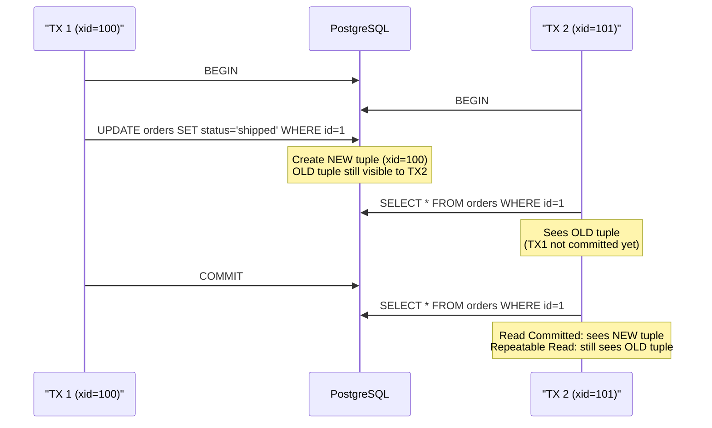

<!-- tags: sql, postgresql, database, mvcc -->
# 🔐 MVCC, Row-Level Security & Internals

> Hiểu cách PostgreSQL quản lý concurrent access (MVCC), Row-Level Security (RLS) cho multi-tenant, và internal mechanics quan trọng.

| Aspect           | Detail                                                           |
| ---------------- | ---------------------------------------------------------------- |
| **Concept**      | MVCC, transaction snapshots, visibility, RLS policies            |
| **Use case**     | Concurrent access, multi-tenant apps, data isolation             |
| **Go relevance** | pgx transaction levels, RLS with session variables               |
| **DBA Roadmap**  | Low Level Internals → MVCC, Vacuum Processing, Buffer Management |

---

📅 Ngày tạo: 2026-03-19 · 🔄 Cập nhật: 2026-04-04 · ⏱️ 18 phút đọc

---

## 1. DEFINE

SaaS multi-tenant: bảng `documents` có `tenant_id`. Team implement RLS: `CREATE POLICY tenant_isolation ON documents USING (tenant_id = current_setting('app.tenant_id'))`. Penetration test: tester gọi `SET app.tenant_id = 'other_tenant'` trước query — **thấy data tenant khác**. RLS policy đúng, nhưng `current_setting()` có thể bị bất kỳ session nào override.

Fix: dùng `current_user` mapping hoặc JWT claim thay vì session variable tùy ý. Nhưng hiểu sao RLS hoạt động đòi hỏi hiểu MVCC — **cơ chế mà PostgreSQL quản lý concurrent access mà không lock reads**. Mỗi transaction thấy một snapshot khác nhau của data, và RLS filter apply trên snapshot đó.

Bài này đi sâu vào hai lớp invisible nhất của PostgreSQL: MVCC (tại sao UPDATE tạo row mới thay vì sửa row cũ) và RLS (tại sao policy đúng vẫn có thể bị bypass).


| Variant | Mô tả |
| --- | --- |
| xmin | Transaction ID tạo tuple · 4 bytes |
| xmax | Transaction ID xóa/update tuple · 4 bytes |
| cmin/cmax | Command ID within transaction · 4 bytes |
| ctid | Physical location (page, offset) · 6 bytes |

| Approach | Time | Space | Khi chọn |
| --- | --- | --- | --- |
| MVCC Visibility & Transaction Behavior | Phụ thuộc cardinality | Phụ thuộc row width | Dùng để nắm baseline semantics trước khi tune planner hoặc index. |
| Row — Level Security (Multi — Tenant) | Phụ thuộc plan | Phụ thuộc memory operator | Dùng khi query đã chạm index, cardinality hoặc join strategy. |
| Autovacuum Tuning & Performance Monitoring | Phụ thuộc workload | Phụ thuộc buffer/WAL | Dùng khi workload production cần cân bằng correctness, lock và rollout. |


### MVCC — Multi-Version Concurrency Control

PostgreSQL KHÔNG lock rows khi đọc. Thay vào đó, mỗi row có **nhiều versions** (tuples), và mỗi transaction chỉ thấy versions phù hợp với **snapshot** của nó.

```text
Table "accounts"               Tuple Versions
┌────────────────────┐
│ Row (id=1)         │
│  xmin=100 xmax=∞   │────→  Version 1: balance=1000 (created by TX 100)
│  xmin=100 xmax=105 │────→  Version 1: balance=1000 (deleted by TX 105)
│  xmin=105 xmax=∞   │────→  Version 2: balance=900  (created by TX 105)
└────────────────────┘

TX 103 (READ COMMITTED, snapshot at 103):
  Sees Version 1 (xmin=100 ≤ 103, xmax=∞ or xmax > 103)

TX 106 (started after TX 105 committed):
  Sees Version 2 (xmin=105 ≤ 106, xmax=∞)

TX 104 (REPEATABLE READ, snapshot at 104):
  Always sees Version 1 (snapshot frozen at 104 < 105)
```

### Tuple Header Fields

| Field              | Mô tả                             | Size                  |
| ------------------ | --------------------------------- | --------------------- |
| `xmin`             | Transaction ID tạo tuple          | 4 bytes               |
| `xmax`             | Transaction ID xóa/update tuple   | 4 bytes               |
| `cmin/cmax`        | Command ID within transaction     | 4 bytes               |
| `ctid`             | Physical location (page, offset)  | 6 bytes               |
| `infomask`         | Visibility flags, lock hints      | 2 bytes               |
| `infomask2`        | HOT update flags, attribute count | 2 bytes               |
| **Total overhead** |                                   | **~23 bytes per row** |

### HOT Updates (Heap-Only Tuples)

```text
Normal UPDATE:
  1. Insert new tuple in any page
  2. Update ALL indexes to point to new tuple
  → Expensive: N indexes × 1 update each

HOT UPDATE (when updated column NOT in any index):
  1. Insert new tuple in SAME page
  2. No index update needed!
  → Much faster: O(1) instead of O(N_indexes)

Requirement: new tuple must fit in same page (FILLFACTOR < 100)
```

### Row-Level Security (RLS)

| Feature                      | Mô tả                              |
| ---------------------------- | ---------------------------------- |
| **ENABLE RLS**               | Activate RLS on table              |
| **POLICY**                   | Rule defining which rows visible   |
| **BYPASSRLS**                | Superuser/owner bypass             |
| **FORCE ROW LEVEL SECURITY** | Even table owner respects policies |
| **USING**                    | Filter for SELECT/UPDATE/DELETE    |
| **WITH CHECK**               | Validation for INSERT/UPDATE       |

### Failure Modes

| Lỗi                       | Nguyên nhân                     | Fix                          |
| ------------------------- | ------------------------------- | ---------------------------- |
| Transaction ID wraparound | Approaching 2^31 limit          | Emergency VACUUM FREEZE      |
| Table bloat               | Too many dead tuples            | Tune autovacuum, VACUUM FULL |
| Serialization failure     | Concurrent write conflict (SSI) | Retry transaction            |
| RLS bypass                | Table owner not subject to RLS  | `FORCE ROW LEVEL SECURITY`   |

---

Các failure mode trên nghe dễ tránh. Nhưng có trap: MVCC bloat khi long transaction = table size double, và RLS policy bypass qua superuser = security hole. Trap đó sẽ xuất hiện ở PITFALLS.

## 2. VISUAL

Với MVCC, Row-Level Security & Internals, đọc định nghĩa thôi chưa đủ vì phần khó nằm ở cơ chế ẩn bên dưới. Một trace hoặc sơ đồ cụ thể sẽ cho thấy snapshot, dependency hay scope thật sự đang dịch chuyển theo hướng nào.


*Hình: MVCC flow — Tuple Versioning (xmin/xmax) → Snapshot (consistent read) → Visibility Rules (commit log) → RLS (row-level access). Readers never block writers.*

### Level 1

```text
Timeline     TX 100          TX 101          TX 102
─────────────────────────────────────────────────────

t=0          BEGIN            BEGIN
             INSERT id=1
             balance=1000

t=1                           SELECT balance
                              WHERE id=1
                              → 1000 ✅
                              (sees TX 100's committed insert)

t=2          UPDATE balance
             SET 900
             WHERE id=1

t=3          COMMIT                            BEGIN
                                               (REPEATABLE READ)

t=4                           SELECT balance    SELECT balance
                              WHERE id=1        WHERE id=1
                              → 900 ✅          → 900 ✅
                              (READ COMMITTED:   (snapshot at t=3,
                               sees latest       sees TX 100's commit)
                               committed)

t=5                                            UPDATE balance
                                               SET 800
                                               WHERE id=1
                                               → OK (no conflict in RC)

                              UPDATE balance
                              SET 700
                              WHERE id=1
                              → ERROR! (in REPEATABLE READ:
                                 row changed since snapshot)
```

```text
┌─── Application ──────────────────────────────────┐
│                                                    │
│  Tenant A request                                  │
│  SET app.tenant_id = 'tenant_a'                    │
│       │                                            │
│       ▼                                            │
│  SELECT * FROM orders                              │
│  → RLS policy auto-adds:                               │
│    WHERE tenant_id = current_setting('app.tenant_id') │
│  → Only sees Tenant A's data! ✅                   │
│                                                    │
│  Tenant B request                                  │
│  SET app.tenant_id = 'tenant_b'                    │
│  SELECT * FROM orders                              │
│  → Only sees Tenant B's data! ✅                   │
│                                                    │
│  No code changes needed! Database enforces isolation│
└────────────────────────────────────────────────────┘
```

---

*Hình: Level 1 cho 🔐 MVCC, Row-Level Security & Internals — nhìn vào happy path hoặc baseline heuristic trước khi đi sâu vào planner và trade-off.*

### Level 2

```text
Decision Lens                 Dấu hiệu cần nhìn                 Hướng xử lý
---------------------------  --------------------------------  -------------------------------------------
Semantics trước               Kết quả có đúng intent không?    1. MVCC Visibility & Transaction Behavior
Planner / index signal        Cardinality, cost, buffers ra sao? 2. Row — Level Security (Multi — Tenant)
Production pressure           Lock, WAL, lag, rollback nào đau? 3. Autovacuum Tuning & Performance Monitoring
```

*Hình: Level 2 biến 🔐 MVCC, Row-Level Security & Internals thành checklist quyết định — từ semantics, sang plan signal, rồi đến áp lực production.*


### Architecture — MVCC Snapshot Isolation



*Hình: MVCC — UPDATE không sửa row, nó tạo row mới. TX2 thấy version nào phụ thuộc isolation level. Read Committed = snapshot per statement. Repeatable Read = snapshot per transaction.*

---
## 3. CODE

Sau khi cơ chế của MVCC, Row-Level Security & Internals đã lộ mặt trên sơ đồ, ta chuyển sang câu lệnh và pattern có thể chạy thật để xem abstraction này giúp gì và gây khó gì trong hệ thống thật.

### Problem 1: Basic — MVCC Visibility & Transaction Behavior

> **Mục tiêu**: Hiểu MVCC visibility rules, xmin/xmax, dead tuples
> **Cần**: PostgreSQL 15+
> **Đạt được**: Debug concurrent issues


```sql
-- ═══════════════════════════════════════════
-- 1. Xem tuple headers (xmin, xmax)
-- ═══════════════════════════════════════════

CREATE TABLE mvcc_demo (id int PRIMARY KEY, value text);
INSERT INTO mvcc_demo VALUES (1, 'original');

-- ✅ View tuple internal fields
SELECT ctid, xmin, xmax, * FROM mvcc_demo;
-- ctid  | xmin | xmax | id | value
-- (0,1) | 100  | 0    | 1  | original

-- ✅ After UPDATE:
UPDATE mvcc_demo SET value = 'updated' WHERE id = 1;
SELECT ctid, xmin, xmax, * FROM mvcc_demo;
-- ctid  | xmin | xmax | id | value
-- (0,2) | 105  | 0    | 1  | updated
-- → New ctid! Old tuple (0,1) still exists but invisible (dead tuple)

-- ═══════════════════════════════════════════
-- 2. Dead tuples & bloat monitoring
-- ═══════════════════════════════════════════

-- ✅ Check dead tuples per table
SELECT
    schemaname, relname,
    n_live_tup,
    n_dead_tup,
    round(100.0 * n_dead_tup / NULLIF(n_live_tup + n_dead_tup, 0), 2) AS dead_pct,
    last_autovacuum,
    last_autoanalyze,
    autovacuum_count
FROM pg_stat_user_tables
WHERE n_dead_tup > 0
ORDER BY n_dead_tup DESC;

-- ✅ Check table bloat (estimated)
SELECT
    schemaname, relname,
    pg_size_pretty(pg_total_relation_size(relid)) AS total_size,
    pg_size_pretty(pg_relation_size(relid)) AS table_size,
    n_live_tup,
    n_dead_tup
FROM pg_stat_user_tables
ORDER BY pg_total_relation_size(relid) DESC
LIMIT 10;

-- ═══════════════════════════════════════════
-- 3. FILLFACTOR cho HOT updates
-- ═══════════════════════════════════════════

-- ✅ Set fillfactor to 80% → 20% free space for HOT updates
ALTER TABLE orders SET (fillfactor = 80);
-- Khi UPDATE column KHÔNG nằm trong index:
--   PostgreSQL dùng HOT update → cùng page, không update index
--   → 2-5x faster than regular UPDATE

-- ✅ Check HOT update ratio
SELECT
    relname,
    n_tup_upd AS total_updates,
    n_tup_hot_upd AS hot_updates,
    round(100.0 * n_tup_hot_upd / NULLIF(n_tup_upd, 0), 2) AS hot_pct
FROM pg_stat_user_tables
WHERE n_tup_upd > 0
ORDER BY n_tup_upd DESC;
-- hot_pct > 90% = excellent! Close to 0% = too many indexed columns updated

-- ═══════════════════════════════════════════
-- 4. Transaction ID management
-- ═══════════════════════════════════════════

-- ✅ Check current transaction age
SELECT datname,
    age(datfrozenxid) AS frozen_age,
    current_setting('autovacuum_freeze_max_age')::bigint AS max_age,
    round(100.0 * age(datfrozenxid) /
        current_setting('autovacuum_freeze_max_age')::bigint, 2) AS pct_to_wraparound
FROM pg_database
WHERE datname NOT LIKE 'template%'
ORDER BY age(datfrozenxid) DESC;
-- ⚠️ pct_to_wraparound > 50% → autovacuum should be running
-- 🔴 pct_to_wraparound > 80% → manual VACUUM FREEZE needed!
```


---

MVCC basics đã cover. Nhưng RLS cần per-user row visibility — hãy define policies.

### Problem 2: Intermediate — Row-Level Security (Multi-Tenant)

> **Mục tiêu**: Implement RLS cho multi-tenant SaaS application
> **Cần**: PostgreSQL 15+, application roles
> **Đạt được**: Database-level tenant isolation


```sql
-- ═══════════════════════════════════════════
-- 1. Setup multi-tenant tables with RLS
-- ═══════════════════════════════════════════

CREATE TABLE tenants (
    id      text PRIMARY KEY,
    name    text NOT NULL,
    plan    text NOT NULL DEFAULT 'free'
);

CREATE TABLE tenant_orders (
    id          bigint GENERATED ALWAYS AS IDENTITY PRIMARY KEY,
    tenant_id   text NOT NULL REFERENCES tenants(id),
    customer    text NOT NULL,
    amount      numeric(10,2) NOT NULL,
    status      text NOT NULL DEFAULT 'pending',
    created_at  timestamptz DEFAULT now()
);

CREATE INDEX idx_tenant_orders_tenant ON tenant_orders(tenant_id);

-- ✅ Enable RLS
ALTER TABLE tenant_orders ENABLE ROW LEVEL SECURITY;

-- ✅ Force RLS even for table owner
ALTER TABLE tenant_orders FORCE ROW LEVEL SECURITY;

-- ═══════════════════════════════════════════
-- 2. Create RLS policies
-- ═══════════════════════════════════════════

-- ✅ SELECT: tenant can only see own orders
CREATE POLICY tenant_isolation_select ON tenant_orders
    FOR SELECT
    USING (tenant_id = current_setting('app.tenant_id', true));

-- ✅ INSERT: tenant can only insert own orders
CREATE POLICY tenant_isolation_insert ON tenant_orders
    FOR INSERT
    WITH CHECK (tenant_id = current_setting('app.tenant_id', true));

-- ✅ UPDATE: tenant can only update own orders
CREATE POLICY tenant_isolation_update ON tenant_orders
    FOR UPDATE
    USING (tenant_id = current_setting('app.tenant_id', true))
    WITH CHECK (tenant_id = current_setting('app.tenant_id', true));

-- ✅ DELETE: tenant can only delete own orders
CREATE POLICY tenant_isolation_delete ON tenant_orders
    FOR DELETE
    USING (tenant_id = current_setting('app.tenant_id', true));

-- ═══════════════════════════════════════════
-- 3. Create application role
-- ═══════════════════════════════════════════

CREATE ROLE app_user NOLOGIN;
GRANT SELECT, INSERT, UPDATE, DELETE ON tenant_orders TO app_user;
GRANT USAGE ON ALL SEQUENCES IN SCHEMA public TO app_user;

CREATE ROLE app_service LOGIN PASSWORD 'secure_password';
GRANT app_user TO app_service;

-- ═══════════════════════════════════════════
-- 4. Advanced: Per-role policies
-- ═══════════════════════════════════════════

-- ✅ Admin can see ALL orders (bypass tenant filter)
CREATE POLICY admin_full_access ON tenant_orders
    FOR ALL
    TO admin_role
    USING (true)
    WITH CHECK (true);

-- ✅ Support can see orders but not modify
CREATE POLICY support_read_only ON tenant_orders
    FOR SELECT
    TO support_role
    USING (true);

-- ═══════════════════════════════════════════
-- 5. RLS + Composite policies
-- ═══════════════════════════════════════════

-- ✅ Additional policy: only see non-deleted orders
CREATE POLICY hide_deleted ON tenant_orders
    FOR SELECT
    USING (status != 'deleted');
-- Policies are AND-ed by default for same role
-- tenant_isolation_select AND hide_deleted both must pass
```

```go
// ✅ Go: Multi-tenant middleware with RLS
func (r *Repo) WithTenant(ctx context.Context, tenantID string, fn func(pgx.Tx) error) error {
    tx, err := r.pool.Begin(ctx)
    if err != nil {
        return err
    }
    defer tx.Rollback(ctx)

    // ✅ Set tenant context transaction-locally for RLS
    _, err = tx.Exec(ctx, "SELECT set_config('app.tenant_id', $1, true)", tenantID)
    if err != nil {
        return fmt.Errorf("set tenant: %w", err)
    }

    // ✅ Switch to app_user role (respects RLS)
    _, err = tx.Exec(ctx, "SET LOCAL ROLE app_user")
    if err != nil {
        return fmt.Errorf("set role: %w", err)
    }

    if err := fn(tx); err != nil {
        return err
    }
    return tx.Commit(ctx)
}

// ✅ Usage in HTTP handler
func (h *Handler) ListOrders(w http.ResponseWriter, r *http.Request) {
    tenantID := r.Header.Get("X-Tenant-ID") // From JWT/auth middleware

    var orders []Order
    err := h.repo.WithTenant(r.Context(), tenantID, func(tx pgx.Tx) error {
        // ✅ RLS automatically filters by tenant!
        rows, err := tx.Query(r.Context(), "SELECT * FROM tenant_orders ORDER BY created_at DESC")
        if err != nil {
            return err
        }
        orders, err = pgx.CollectRows(rows, pgx.RowToStructByName[Order])
        return err
    })
    // ...
}
```


> **✅ Đạt được**: Tenant filter được enforce ở database layer thay vì lặp lại trong mọi query ứng dụng.
> **⚠️ Lưu ý**: Dùng transaction-local state (`SET LOCAL` / `set_config(..., true)`) và non-owner app role để tránh context leak qua connection pool.

---

RLS đã cover. Nhưng MVCC internals cần xmin/xmax understanding — hãy trace.

### Problem 3: Advanced — Autovacuum Tuning & Performance Monitoring

> **Mục tiêu**: Tune autovacuum cho high-write tables, monitor MVCC health
> **Cần**: DBA-level access (ALTER SYSTEM)
> **Đạt được**: Prevent bloat, optimize write-heavy workloads


```sql
-- ═══════════════════════════════════════════
-- 1. Per-table autovacuum tuning
-- ═══════════════════════════════════════════

-- ✅ High-write table: aggressive autovacuum
ALTER TABLE orders SET (
    autovacuum_vacuum_scale_factor = 0.01,      -- Vacuum at 1% dead tuples (default 20%)
    autovacuum_vacuum_threshold = 1000,          -- At least 1000 dead tuples
    autovacuum_analyze_scale_factor = 0.005,     -- Analyze at 0.5% changes
    autovacuum_vacuum_cost_delay = 2,            -- Less delay between vacuums (faster)
    fillfactor = 80                               -- 20% free space for HOT updates
);

-- ✅ Append-only table (logs): less aggressive
ALTER TABLE event_logs SET (
    autovacuum_vacuum_scale_factor = 0.1,
    autovacuum_enabled = true
);

-- ═══════════════════════════════════════════
-- 2. Global autovacuum settings
-- ═══════════════════════════════════════════

-- ✅ Increase autovacuum workers for large databases
ALTER SYSTEM SET autovacuum_max_workers = 5;          -- Default 3
ALTER SYSTEM SET autovacuum_naptime = '30s';           -- Check every 30s (default 1min)
ALTER SYSTEM SET autovacuum_vacuum_cost_limit = 2000;  -- More I/O budget (default 200)
SELECT pg_reload_conf();

-- ═══════════════════════════════════════════
-- 3. MVCC health monitoring view
-- ═══════════════════════════════════════════

CREATE OR REPLACE VIEW v_mvcc_health AS
SELECT
    -- Table info
    schemaname || '.' || relname AS table_name,
    pg_size_pretty(pg_total_relation_size(relid)) AS total_size,

    -- Tuple counts
    n_live_tup,
    n_dead_tup,
    round(100.0 * n_dead_tup / NULLIF(n_live_tup + n_dead_tup, 0), 2) AS dead_pct,

    -- Update patterns
    n_tup_upd AS updates,
    n_tup_hot_upd AS hot_updates,
    round(100.0 * n_tup_hot_upd / NULLIF(n_tup_upd, 0), 2) AS hot_update_pct,

    -- Autovacuum status
    last_autovacuum,
    last_autoanalyze,
    autovacuum_count,

    -- Health assessment
    CASE
        WHEN n_dead_tup > n_live_tup * 0.2 THEN '🔴 CRITICAL: >20% dead tuples'
        WHEN n_dead_tup > n_live_tup * 0.05 THEN '🟡 WARNING: >5% dead tuples'
        ELSE '✅ OK'
    END AS health_status
FROM pg_stat_user_tables
WHERE n_live_tup > 100
ORDER BY n_dead_tup DESC;

-- ✅ Usage
SELECT * FROM v_mvcc_health WHERE health_status LIKE '🔴%';
```


> **✅ Đạt được**: Per-table autovacuum tuning, MVCC health monitoring, HOT optimization.
> **⚠️ Lưu ý**: `fillfactor = 80` + avoid indexing frequently-updated columns → maximize HOT updates.

---
Bạn đã đi qua MVCC, RLS, và internals. Bây giờ đến phần nguy hiểm: MVCC bloat và superuser bypass — trap đã được setup từ đầu bài.

## 4. PITFALLS

MVCC, Row-Level Security & Internals mạnh vì nó mở thêm nhiều cửa ra quyết định. Phần dưới đây tập trung vào những lúc mở sai cửa và tự đẩy truy vấn hoặc policy vào vùng khó debug hơn.

| # | Severity | Lỗi | Hậu quả | Fix |
| --- | --- | --- | --- | --- |
| 1 | 🔵 Minor | RLS without FORCE | — | Table owner bypasses policies → always FORCE ROW LEVEL SECURITY |
| 2 | 🟡 Common | Ignore dead tuples | — | Bloat → slow queries → tune autovacuum per table |
| 3 | 🟡 Common | Transaction ID wraparound | — | Emergency VACUUM FREEZE → monitoring pct_to_wraparound |
| 4 | 🔵 Minor | All columns indexed | — | Kills HOT updates → only index columns used in WHERE/JOIN |
| 5 | 🟡 Common | Long-running transactions | — | Block autovacuum → dead tuples accumulate → monitoring pg_stat_activity |
| 6 | 🔵 Minor | FILLFACTOR 100 on update-heavy tables | — | No room for HOT → set fillfactor = 70-80 |

---
Bạn đã đi qua MVCC & RLS Internals và cạm bẫy. Các resources dưới đây giúp đi sâu hơn.

## 5. REF

| Resource | Link                                                                                                                                                               |
| -------- | ------------------------------------------------------------------------------------------------------------------------------------------------------------------ |
| MVCC     | [postgresql.org/docs/current/mvcc.html](https://www.postgresql.org/docs/current/mvcc.html)                                                                         |
| RLS      | [postgresql.org/docs/current/ddl-rowsecurity.html](https://www.postgresql.org/docs/current/ddl-rowsecurity.html)                                                   |
| VACUUM   | [postgresql.org/docs/current/routine-vacuuming.html](https://www.postgresql.org/docs/current/routine-vacuuming.html)                                               |
| HOT      | [postgresql.org/docs/current/storage-hot.html](https://www.postgresql.org/docs/current/storage-hot.html)                                                           |
| Neon RLS | [neon.com/postgresql/postgresql-administration/postgresql-row-level-security](https://neon.com/postgresql/postgresql-administration/postgresql-row-level-security) |

---

## 6. RECOMMEND

Khi lõi cơ chế của MVCC, Row-Level Security & Internals đã rõ, bạn có thể nối nó sang các chủ đề lân cận như planner, security hoặc replication để thấy tác động xuyên module.

| Mở rộng             | Khi nào                           | Lý do                                 |
| ------------------- | --------------------------------- | ------------------------------------- |
| **pg_repack**       | Online table/index reorganization | Reduce bloat without VACUUM FULL lock |
| **pgstattuple**     | Detailed bloat analysis           | Row-level visibility stats            |
| **PostgREST + RLS** | REST API auto-generation          | RLS handles all authorization         |
| **Supabase + RLS**  | BaaS with built-in RLS            | Production-ready multi-tenant         |


> **Callback** — Quay lại RLS bypass qua `SET app.tenant_id`: session variable do bất kỳ ai set được. Fix: dùng `current_user` mapping hoặc JWT claim — identity server control, không phải session variable. MVCC đảm bảo snapshot isolation, nhưng RLS chỉ mạnh bằng identity source mà nó dựa vào.

---

← Previous: [02-cte-recursive-lateral.md](./02-cte-recursive-lateral.md)

---

## 7. QUICK REF

| Nếu gặp | Nghĩ ngay |
| --- | --- |
| MVCC Visibility & Transaction Behavior | Dùng pattern này khi gặp signal tương ứng trong production workload. |
| Row — Level Security (Multi — Tenant) | Dùng pattern này khi gặp signal tương ứng trong production workload. |
| Autovacuum Tuning & Performance Monitoring | Dùng pattern này khi gặp signal tương ứng trong production workload. |
