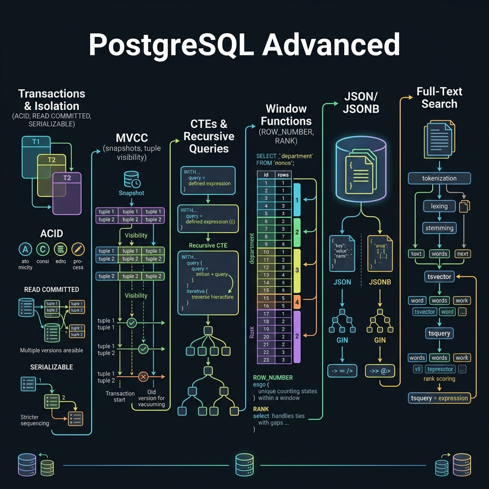

<!-- tags: sql, postgresql, database, overview -->
# 🧠 PostgreSQL Advanced

> Khi query và index không còn đủ, bạn bắt đầu cần procedural SQL, recursive traversal, internals và tenant isolation. Track này dành cho giai đoạn đó.

| Aspect | Detail |
| --- | --- |
| **Concept** | PL/pgSQL, CTE/recursive/LATERAL, MVCC, RLS |
| **Audience** | Experienced engineer đến expert |
| **Primary style** | Concept-First hub cho advanced techniques |
| **Entry point** | `01-plpgsql.md`, `02-cte-recursive-lateral.md`, `03-mvcc-rls-internals.md` |

📅 Ngày tạo: 2026-03-19 · 🔄 Cập nhật: 2026-04-04 · ⏱️ 4 phút đọc

---

## 1. DEFINE

3 bài advanced cover những gì flat SQL không giải được: **PL/pgSQL** cho server-side logic, **Recursive CTE/LATERAL** cho hierarchical queries, **MVCC + RLS** cho multi-tenant security.

Track này dành cho engineer đã vững fundamentals và đang gặp bài toán cần procedural logic, recursive traversal, hoặc row-level access control.


| Variant | Mô tả |
| --- | --- |
| Procedural SQL | Dùng PL/pgSQL cho functions, procedures, triggers, control flow |
| Recursive / Correlated Querying | Dùng CTE recursive, LATERAL, Top-N per group |
| Storage & Visibility Internals | Dùng MVCC, HOT, xmin/xmax để hiểu behavior bên dưới |
| Tenant Isolation | Dùng RLS khi cần policy-level access control |

| Approach | Time | Space | Khi chọn |
| --- | --- | --- | --- |
| PL/pgSQL first | Phụ thuộc function size | O(1) | Dùng khi business logic cần chạy gần data. |
| Recursive / LATERAL | Phụ thuộc graph/tree shape | O(1) | Dùng khi query relation phức tạp vượt joins cơ bản. |
| Internals / RLS | Phụ thuộc workload | O(1) | Dùng khi cần giải thích visibility, bloat hoặc tenant isolation. |

Core insight:

> Advanced PostgreSQL chỉ đáng dùng khi nó giảm complexity tổng thể của hệ thống. Dùng sai chỗ, nó sẽ trở thành black box khó debug hơn cả application code.

---

## 2. VISUAL

Với PostgreSQL Advanced, đọc định nghĩa thôi chưa đủ vì phần khó nằm ở cơ chế ẩn bên dưới. Một trace hoặc sơ đồ cụ thể sẽ cho thấy snapshot, dependency hay scope thật sự đang dịch chuyển theo hướng nào.



### Level 1

```text
Need stored logic? ----------> PL/pgSQL
Need tree/top-N traversal? --> CTE / LATERAL
Need visibility explanation? -> MVCC internals
Need tenant isolation? ------> RLS
```

*Hình: Level 1 route câu hỏi advanced sang đúng kỹ thuật thay vì gom chung thành “PostgreSQL nâng cao”.*

### Level 2

```text
Question                              File
------------------------------------  -----------------------------------
Should logic live in DB?              01-plpgsql
How to walk hierarchies efficiently?  02-cte-recursive-lateral
Why is row visible / dead / HOT?      03-mvcc-rls-internals
How to enforce tenant policy?         03-mvcc-rls-internals
```

*Hình: Level 2 map decision trực tiếp sang file advanced tương ứng.*

---
## 3. CODE

Sau khi cơ chế của PostgreSQL Advanced đã lộ mặt trên sơ đồ, ta chuyển sang câu lệnh và pattern có thể chạy thật để xem abstraction này giúp gì và gây khó gì trong hệ thống thật.

### Problem 1: Basic — Chọn kỹ thuật advanced đúng câu hỏi

> **Mục tiêu**: Không dùng advanced feature vì “nghe mạnh”.
> **Approach**: Router theo loại câu hỏi.
> **Ví dụ**: Đầu vào là use case khó; đầu ra là file cần mở trước.
> **Độ phức tạp**: Basic — choose the right tool.

```sql
SELECT *
FROM (VALUES
  ('need trigger/procedure logic', '01-plpgsql.md'),
  ('need recursive org chart', '02-cte-recursive-lateral.md'),
  ('need top-N per group efficiently', '02-cte-recursive-lateral.md'),
  ('need explain visibility or tenant policy', '03-mvcc-rls-internals.md')
) AS routes(use_case, first_file);
```

**Tại sao?** Advanced PostgreSQL feature có blast radius lớn hơn feature cơ bản. Router này ép người đọc phải chứng minh use case phù hợp trước khi dùng.

**Kết luận**: README advanced tồn tại để giảm misuse của feature mạnh, không phải để phô trương đủ loại keyword.

### Problem 2: Intermediate — Chọn lúc nào sang advanced từ performance

> **Mục tiêu**: Biết khi nào performance tricks không đủ nữa.
> **Approach**: Dựa vào shape bài toán: procedural logic, recursion, visibility, policy.
> **Ví dụ**: Đầu vào là query/app logic phức tạp; đầu ra là lý do chuyển sang advanced track.
> **Độ phức tạp**: Intermediate — trade-off giữa app code và DB code.

```text
If the problem is:
  - "need recursive traversal"        -> advanced/02
  - "need row-level tenant isolation" -> advanced/03
  - "need trigger/procedure"          -> advanced/01
  - "need explain vacuum/MVCC effect" -> advanced/03
```

**Tại sao?** Team hay kẹt ở giữa: query thường không đủ, nhưng chuyển logic vào DB cũng đáng sợ. Track advanced giúp quyết định theo problem shape thay vì theo preference cá nhân.

**Kết luận**: Chỉ sang advanced khi feature thực sự đòi hỏi đặc tính mà fundamentals/performance không giải được gọn gàng.

### Problem 3: Advanced — Chốt checkpoint trước khi đụng production feature

> **Mục tiêu**: Định nghĩa readiness khi dùng advanced PostgreSQL trên production.
> **Approach**: Checklist reasoning thay vì hứng lên dùng feature mạnh.
> **Ví dụ**: Đầu vào là một design đang cân nhắc PL/pgSQL/CTE/RLS; đầu ra là review checklist.
> **Độ phức tạp**: Advanced — production review gate.

```text
Before using advanced PG on production:
  - explain được vì sao app code không đơn giản hơn
  - có plan test/rollback cho procedure/trigger/policy
  - hiểu impact lên visibility, locks, maintenance
  - biết observability point ở đâu khi có bug
```

**Tại sao?** Advanced features trả giá bằng observability và operational complexity. Nếu không có review gate, chúng rất dễ trở thành kỹ thuật “đẹp trên giấy, đau khi debug”.

**Kết luận**: Advanced track nên đi cùng design review discipline, không nên được dùng như shortcut ngẫu hứng.

---
## 4. PITFALLS

PostgreSQL Advanced mạnh vì nó mở thêm nhiều cửa ra quyết định. Phần dưới đây tập trung vào những lúc mở sai cửa và tự đẩy truy vấn hoặc policy vào vùng khó debug hơn.

| # | Severity | Lỗi | Hậu quả | Fix |
| --- | --- | --- | --- | --- |
| 1 | 🔴 Fatal | Dùng trigger/procedure mà không có rollback/test path | Sửa production rất nguy hiểm khi bug | Chỉ dùng khi có review gate và observability rõ. |
| 2 | 🟡 Common | Chọn recursive/CTE/LATERAL khi joins cơ bản đã đủ | Query khó đọc, khó maintain | Chứng minh need bằng problem shape trước. |
| 3 | 🟡 Common | Dùng RLS mà không hiểu policy interaction | Data leak hoặc false deny | Đọc kỹ `03-mvcc-rls-internals.md` trước rollout. |
| 4 | 🔵 Minor | Xem advanced như track “đọc cho vui” | Học feature mà không biết khi nào dùng | Gắn mỗi feature với câu hỏi quyết định rõ ràng. |

---
## 5. REF

| Resource | Loại | Link | Ghi chú |
| --- | --- | --- | --- |
| PostgreSQL PL/pgSQL | Official docs | https://www.postgresql.org/docs/current/plpgsql.html | Procedures, functions, triggers. |
| WITH Queries | Official docs | https://www.postgresql.org/docs/current/queries-with.html | CTE và recursive. |
| MVCC | Official docs | https://www.postgresql.org/docs/current/mvcc.html | Visibility internals. |
| Row Security Policies | Official docs | https://www.postgresql.org/docs/current/ddl-rowsecurity.html | RLS policy model. |

---

## 6. RECOMMEND

Khi lõi cơ chế của PostgreSQL Advanced đã rõ, bạn có thể nối nó sang các chủ đề lân cận như planner, security hoặc replication để thấy tác động xuyên module.

| Mở rộng | Khi nào | Lý do | File/Link |
| --- | --- | --- | --- |
| Replication Track | Khi advanced features bắt đầu tác động HA/rollback path | Kết nối feature mạnh với topology thật | [../replication/README.md](../replication/README.md) |
| Performance Track | Khi advanced query còn phải tối ưu execution | Không tách rời feature mạnh khỏi plan cost | [../performance/README.md](../performance/README.md) |

---

## 7. QUICK REF

| Nếu gặp | Mở file |
| --- | --- |
| Procedure / trigger / function | `01` |
| Recursive / LATERAL / Top-N | `02` |
| MVCC / RLS / visibility | `03` |