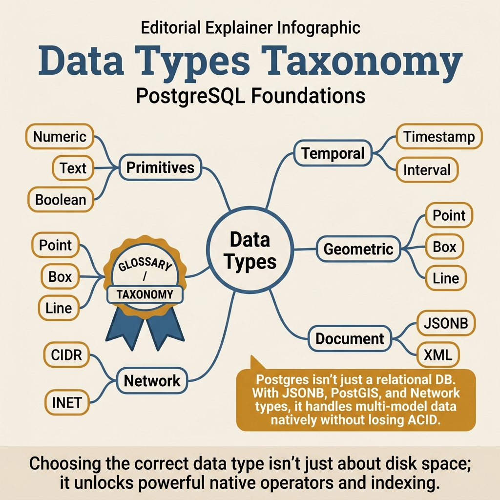
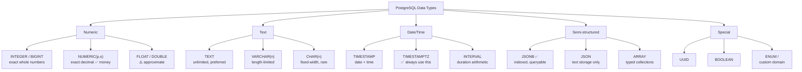

<!-- tags: sql, postgresql, database -->
# 📊 Data Types & Domains

> Chọn đúng data type = 50% hiệu năng — hiểu trade-offs từng loại

| Aspect           | Detail                                              |
| ---------------- | --------------------------------------------------- |
| **Concept**      | PostgreSQL type system, domains, enums, composite   |
| **Use case**     | Schema design, data integrity, storage optimization |
| **Go relevance** | `pgx`, `sqlx` type mapping                          |
| **CLI**          | `\dT`, `\dD`, `pg_typeof()`                         |

---

📅 Ngày tạo: 2026-03-20 · 🔄 Cập nhật: 2026-04-04 · ⏱️ 15 phút đọc

---

## 1. DEFINE

Code review: `price DOUBLE PRECISION` cho bảng thanh toán. Reviewer approve vì "floating-point chỉ sai ở tính toán khoa học". 3 tháng sau, report tài chính lệch $847.23 — tổng một triệu transaction bị rounding error tích lũy. Đổi sang `NUMERIC(12,2)` và recompute: con số khớp đến từng cent.

Data type không phải syntax decision — nó là **contract** giữa schema và business logic. Chọn sai type không báo lỗi khi INSERT; nó rò rỉ im lặng qua mỗi phép tính cho đến khi report tài chính đủ sai để ai đó nhận ra.


| Variant | Mô tả |
| --- | --- |
| smallint | 2B · ±32,767 · int16 · Status codes, age |
| integer | 4B · ±2.1 billion · int32 · General purpose |
| bigint | 8B · ±9.2×10¹⁸ · int64 · IDs, counters |
| numeric(p,s) | Variable · Exact · decimal.Decimal · Money, financial |

| Approach | Time | Space | Khi chọn |
| --- | --- | --- | --- |
| Đúng Type cho Go App | Phụ thuộc cardinality | Phụ thuộc row width | Dùng để nắm baseline semantics trước khi tune planner hoặc index. |
| JSONB & Array Types | Phụ thuộc plan | Phụ thuộc memory operator | Dùng khi query đã chạm index, cardinality hoặc join strategy. |
| Range Types & Exclusion Constraints | Phụ thuộc workload | Phụ thuộc buffer/WAL | Dùng khi workload production cần cân bằng correctness, lock và rollout. |


### Numeric Types

| Type               | Size     | Range               | Go type           | Use case                    |
| ------------------ | -------- | ------------------- | ----------------- | --------------------------- |
| `smallint`         | 2B       | ±32,767             | `int16`           | Status codes, age           |
| `integer`          | 4B       | ±2.1 billion        | `int32`           | General purpose             |
| `bigint`           | 8B       | ±9.2×10¹⁸           | `int64`           | IDs, counters               |
| `numeric(p,s)`     | Variable | Exact               | `decimal.Decimal` | Money, financial            |
| `real`             | 4B       | 6 digits precision  | `float32`         | Scientific (approx)         |
| `double precision` | 8B       | 15 digits precision | `float64`         | Scientific (approx)         |
| `serial`           | 4B       | Auto-increment      | `int32`           | Legacy PK (prefer IDENTITY) |
| `bigserial`        | 8B       | Auto-increment      | `int64`           | Legacy PK                   |

### Text Types

| Type         | Max size      | Go type  | Use case                      |
| ------------ | ------------- | -------- | ----------------------------- |
| `varchar(n)` | n chars       | `string` | Bounded strings (email, name) |
| `text`       | Unlimited     | `string` | Unbounded strings             |
| `char(n)`    | Fixed n chars | `string` | Fixed-length codes            |
| `name`       | 63 bytes      | `string` | Internal identifiers          |

> **⚠️ Key insight**: `varchar(n)` vs `text` — **không có performance khác biệt** trong PostgreSQL! `varchar(n)` chỉ thêm validation constraint.

### Temporal Types

| Type          | Size | Resolution | Go type           | Use case                         |
| ------------- | ---- | ---------- | ----------------- | -------------------------------- |
| `timestamp`   | 8B   | 1μs        | `time.Time`       | Event time (no timezone)         |
| `timestamptz` | 8B   | 1μs        | `time.Time`       | **Recommended** — timezone-aware |
| `date`        | 4B   | 1 day      | `time.Time`       | Birthday, due date               |
| `time`        | 8B   | 1μs        | `time.Time`       | Schedule time                    |
| `interval`    | 16B  | 1μs        | `pgtype.Interval` | Duration                         |

### Special Types

| Type                  | Size     | Go type           | Use case                   |
| --------------------- | -------- | ----------------- | -------------------------- |
| `uuid`                | 16B      | `uuid.UUID`       | Primary keys (distributed) |
| `jsonb`               | Variable | `json.RawMessage` | Semi-structured data       |
| `json`                | Variable | `json.RawMessage` | Preserve formatting        |
| `boolean`             | 1B       | `bool`            | Flags                      |
| `bytea`               | Variable | `[]byte`          | Binary data                |
| `inet`/`cidr`         | 7-19B    | `netip.Addr`      | IP addresses               |
| `tsquery`/`tsvector`  | Variable | `string`          | Full-text search           |
| `int4range`/`tsrange` | Variable | Custom            | Range queries              |

### Failure Modes

| Lỗi                      | Nguyên nhân                            | Fix                             |
| ------------------------ | -------------------------------------- | ------------------------------- |
| `numeric` quá chậm       | Exact arithmetic overhead              | Dùng `bigint` (cents) cho money |
| `timestamp` timezone sai | Dùng `timestamp` thay vì `timestamptz` | **Luôn dùng `timestamptz`**     |
| `varchar(255)` habit     | MySQL legacy                           | PostgreSQL: `text` = tốt hơn    |
| `serial` ID conflict     | Multi-writer race                      | Dùng `bigint GENERATED ALWAYS`  |

---

Các failure mode trên nghe quen. Nhưng có trap: NUMERIC precision overflow = silent rounding, và TEXT vs VARCHAR performance myth = premature optimization. Trap đó sẽ xuất hiện ở PITFALLS.

## 2. VISUAL

Với Data Types & Domains, bảng phân loại mới chỉ giúp bạn gọi đúng tên khái niệm. Điều quan trọng hơn là nhìn xem rows, giá trị hoặc ràng buộc thực sự đổi shape như thế nào khi query chạy qua từng bước.




*Hình: 6 họ data type PostgreSQL — Numeric (exact cho tiền), Text (text > varchar), Temporal (luôn timestamptz), Semi-Structured (jsonb + GIN), Identity (uuid v7), Custom (enum/domain/range). Chọn sai type = silent bug tích lũy.*

### Level 1

```
Số (numeric)?
├── Exact arithmetic? (money, financial)
│   └── numeric(p,s) hoặc bigint (store as cents)
├── Integer?
│   ├── < 32K → smallint
│   ├── < 2.1B → integer
│   └── > 2.1B → bigint
└── Floating point?
    └── double precision (avoid real)

Text?
├── Need length limit?
│   └── varchar(n) — validation only
└── No limit?
    └── text — ✅ recommended

Time?
├── Need timezone?
│   └── timestamptz — ✅ ALWAYS USE THIS
├── Date only?
│   └── date
└── Duration?
    └── interval

ID?
├── Single database?
│   └── bigint GENERATED ALWAYS AS IDENTITY
└── Distributed?
    └── uuid (v7 preferred — sortable)
```

---

*Hình: Level 1 cho 📊 Data Types & Domains — nhìn vào happy path hoặc baseline heuristic trước khi đi sâu vào planner và trade-off.*

### Level 2

```text
Decision Lens                 Dấu hiệu cần nhìn                 Hướng xử lý
---------------------------  --------------------------------  -------------------------------------------
Semantics trước               Kết quả có đúng intent không?    1. Đúng Type cho Go App
Planner / index signal        Cardinality, cost, buffers ra sao? 2. JSONB & Array Types
Production pressure           Lock, WAL, lag, rollback nào đau? 3. Range Types & Exclusion Constraints
```

*Hình: Level 2 biến 📊 Data Types & Domains thành checklist quyết định — từ semantics, sang plan signal, rồi đến áp lực production.*


### Architecture — PostgreSQL Type System Map



*Hình: PostgreSQL type system — NUMERIC cho tiền, TIMESTAMPTZ cho mọi thời gian, JSONB cho semi-structured. Chọn sai type = silent bugs tích lũy theo thời gian.*

---
## 3. CODE

Khi flow của Data Types & Domains đã rõ, ta chuyển nó thành DDL, truy vấn và transaction có thể chạy thật. Ta bắt đầu từ case hẹp nhất rồi tăng dần số lượng rows, ràng buộc và biến thể.

### Problem 1: Basic — Đúng Type cho Go App

> **Mục tiêu**: Tạo table với type tối ưu, mapping Go struct
> **Cần**: PostgreSQL 15+
> **Đạt được**: Type-safe schema + Go mapping


```sql
-- ✅ Modern PostgreSQL table design
CREATE TABLE users (
    -- ✅ UUID v7 — sortable, distributed-safe
    id          uuid PRIMARY KEY DEFAULT gen_random_uuid(),

    -- ✅ text — no performance diff vs varchar in PG
    email       text NOT NULL,
    full_name   text NOT NULL,

    -- ✅ timestamptz — ALWAYS use timezone-aware
    created_at  timestamptz NOT NULL DEFAULT now(),
    updated_at  timestamptz NOT NULL DEFAULT now(),
    deleted_at  timestamptz,         -- Soft delete

    -- ✅ smallint cho bounded values
    age         smallint CHECK (age > 0 AND age < 200),

    -- ✅ Domain type cho reusable constraints
    phone       text CHECK (phone ~ '^\+?[0-9]{10,15}$'),

    -- ✅ Enum type
    status      user_status NOT NULL DEFAULT 'active',

    -- ✅ JSONB cho flexible metadata
    metadata    jsonb DEFAULT '{}',

    -- ✅ Constraints
    CONSTRAINT users_email_unique UNIQUE (email),
    CONSTRAINT users_email_format CHECK (email ~* '^[a-z0-9._%+-]+@[a-z0-9.-]+\.[a-z]{2,}$')
);

-- ✅ Custom enum type
CREATE TYPE user_status AS ENUM ('active', 'inactive', 'suspended', 'deleted');

-- ✅ Domain type — reusable constraint
CREATE DOMAIN positive_amount AS numeric(15,2) CHECK (VALUE > 0);

CREATE TABLE transactions (
    id          bigint GENERATED ALWAYS AS IDENTITY PRIMARY KEY,
    user_id     uuid NOT NULL REFERENCES users(id),
    amount      positive_amount NOT NULL,    -- ✅ Domain constraint
    currency    char(3) NOT NULL DEFAULT 'VND',
    created_at  timestamptz NOT NULL DEFAULT now()
);
```

```go
// models/user.go — Go struct mapping
package models

import (
	"encoding/json"
	"time"

	"github.com/google/uuid"
)

type UserStatus string

const (
	UserStatusActive    UserStatus = "active"
	UserStatusInactive  UserStatus = "inactive"
	UserStatusSuspended UserStatus = "suspended"
)

type User struct {
	ID        uuid.UUID        `db:"id" json:"id"`
	Email     string           `db:"email" json:"email"`
	FullName  string           `db:"full_name" json:"full_name"`
	CreatedAt time.Time        `db:"created_at" json:"created_at"`
	UpdatedAt time.Time        `db:"updated_at" json:"updated_at"`
	DeletedAt *time.Time       `db:"deleted_at" json:"deleted_at,omitempty"`
	Age       *int16           `db:"age" json:"age,omitempty"`
	Phone     *string          `db:"phone" json:"phone,omitempty"`
	Status    UserStatus       `db:"status" json:"status"`
	Metadata  json.RawMessage  `db:"metadata" json:"metadata"`
}
```


> **✅ Đạt được**: Type-safe schema, proper Go mapping, constraints.
> **⚠️ Lưu ý**: `timestamptz` luôn luôn. `text` thay `varchar(255)`.

---

Type basics đã cover. Nhưng temporal types cần timezone awareness — hãy handle.

### Problem 2: Intermediate — JSONB & Array Types

> **Mục tiêu**: Sử dụng JSONB cho semi-structured data, array cho tags
> **Cần**: PostgreSQL 15+
> **Đạt được**: Flexible schema với indexing


```sql
-- ✅ JSONB — semi-structured data
CREATE TABLE products (
    id          bigint GENERATED ALWAYS AS IDENTITY PRIMARY KEY,
    name        text NOT NULL,

    -- ✅ JSONB cho dynamic attributes
    attributes  jsonb NOT NULL DEFAULT '{}',

    -- ✅ Array type cho tags
    tags        text[] DEFAULT '{}',

    -- ✅ Generated column từ JSONB
    price       numeric(10,2) GENERATED ALWAYS AS (
        (attributes->>'price')::numeric
    ) STORED,

    created_at  timestamptz DEFAULT now()
);

-- ✅ GIN index cho JSONB queries
CREATE INDEX idx_products_attributes ON products USING gin (attributes);

-- ✅ GIN index cho array containment
CREATE INDEX idx_products_tags ON products USING gin (tags);

-- ✅ Insert JSONB data
INSERT INTO products (name, attributes, tags) VALUES
    ('MacBook Pro', '{"price": 2499.99, "cpu": "M3 Pro", "ram": "18GB", "specs": {"screen": "16 inch", "battery": "22h"}}', ARRAY['laptop', 'apple', 'premium']),
    ('ThinkPad X1', '{"price": 1899.99, "cpu": "i7-1365U", "ram": "32GB"}', ARRAY['laptop', 'lenovo', 'business']);

-- ✅ Query JSONB
SELECT name, attributes->>'cpu' AS cpu, attributes->>'ram' AS ram
FROM products
WHERE attributes @> '{"ram": "32GB"}'        -- ✅ Containment (uses GIN index)
  AND (attributes->>'price')::numeric < 2000;

-- ✅ Query array
SELECT * FROM products WHERE tags @> ARRAY['laptop', 'premium'];  -- Contains all
SELECT * FROM products WHERE tags && ARRAY['apple', 'lenovo'];    -- Contains any
SELECT * FROM products WHERE 'laptop' = ANY(tags);                -- Single element

-- ✅ Update JSONB (partial update)
UPDATE products
SET attributes = jsonb_set(attributes, '{price}', '2299.99')
WHERE name = 'MacBook Pro';

-- ✅ JSONB aggregation
SELECT jsonb_object_agg(name, attributes->>'price') FROM products;
```

```go
// repository/product.go — JSONB + Array trong Go
package repository

import (
	"context"
	"encoding/json"

	"github.com/jackc/pgx/v5"
	"github.com/jackc/pgx/v5/pgxpool"
	"github.com/lib/pq" // for pq.Array
)

type ProductAttributes struct {
	Price float64 `json:"price"`
	CPU   string  `json:"cpu"`
	RAM   string  `json:"ram"`
}

type Product struct {
	ID         int64              `db:"id"`
	Name       string             `db:"name"`
	Attributes ProductAttributes  `db:"attributes"`
	Tags       []string           `db:"tags"`
}

func (r *Repo) FindByJSONB(ctx context.Context, minRAM string) ([]Product, error) {
	query := `
		SELECT id, name, attributes, tags
		FROM products
		WHERE attributes @> $1
	`
	filter, _ := json.Marshal(map[string]string{"ram": minRAM})

	rows, err := r.pool.Query(ctx, query, filter)
	if err != nil {
		return nil, err
	}
	defer rows.Close()

	return pgx.CollectRows(rows, pgx.RowToStructByName[Product])
}
```

**Tại sao?** Ở mức Intermediate của Data Types & Domains, bài khó không còn là viết cho chạy mà là giữ đúng invariant khi dữ liệu đổi shape. Problem 2: Intermediate — JSONB & Array Types buộc bạn nhìn xem cardinality, nullability hoặc grain của dữ liệu đang bẻ semantic đi theo hướng nào.


> **✅ Đạt được**: JSONB queries, array operations, GIN indexing.
> **⚠️ Lưu ý**: `jsonb` > `json` (binary, indexable). `@>` uses GIN index.

---

Temporal đã cover. Nhưng special types cần domain-specific casting — hãy apply.

### Problem 3: Advanced — Range Types & Exclusion Constraints

> **Mục tiêu**: Dùng range types cho booking/scheduling, prevent overlaps
> **Cần**: btree_gist extension
> **Đạt được**: Database-level overlap prevention


```sql
-- ✅ Enable extension
CREATE EXTENSION IF NOT EXISTS btree_gist;

-- ✅ Range types cho booking system
CREATE TABLE room_bookings (
    id          bigint GENERATED ALWAYS AS IDENTITY PRIMARY KEY,
    room_id     integer NOT NULL,
    user_id     uuid NOT NULL REFERENCES users(id),

    -- ✅ tstzrange — timestamp range with timezone
    during      tstzrange NOT NULL,

    -- ✅ Exclusion constraint — prevent overlapping bookings
    EXCLUDE USING gist (
        room_id WITH =,          -- Same room
        during  WITH &&           -- Overlapping time range
    ),

    -- ✅ Ensure valid range
    CONSTRAINT valid_booking CHECK (
        lower(during) < upper(during)
        AND upper(during) - lower(during) <= interval '24 hours'
    )
);

-- ✅ Insert bookings
INSERT INTO room_bookings (room_id, user_id, during) VALUES
    (1, 'uuid-1', tstzrange('2024-01-15 09:00+07', '2024-01-15 11:00+07'));

-- ✅ This fails — overlapping!
INSERT INTO room_bookings (room_id, user_id, during) VALUES
    (1, 'uuid-2', tstzrange('2024-01-15 10:00+07', '2024-01-15 12:00+07'));
-- ERROR: conflicting key value violates exclusion constraint

-- ✅ Query available slots
SELECT room_id
FROM rooms r
WHERE NOT EXISTS (
    SELECT 1 FROM room_bookings rb
    WHERE rb.room_id = r.id
    AND rb.during && tstzrange('2024-01-15 14:00+07', '2024-01-15 16:00+07')
);

-- ✅ int4range cho version ranges
CREATE TABLE api_versions (
    api_name    text NOT NULL,
    version     int4range NOT NULL,
    handler     text NOT NULL,
    EXCLUDE USING gist (api_name WITH =, version WITH &&)
);
```

**Tại sao?** Khi Data Types & Domains đi tới mức Advanced, chi phí không còn nằm riêng trong câu lệnh mà lan sang lock time, maintenance window và rollback path. Problem 3: Advanced — Range Types & Exclusion Constraints đáng giá vì nó cho thấy một lựa chọn đẹp trên giấy có thể rất đắt trên hệ thống đang chạy.


> **✅ Đạt được**: Database-level overlap prevention, range queries.
> **⚠️ Lưu ý**: Exclusion constraints cần `btree_gist` extension.

---
Bạn đã đi qua numeric, temporal, và special types. Bây giờ đến phần nguy hiểm: silent rounding và type myths — trap đã được setup từ đầu bài.

## 4. PITFALLS

Data Types & Domains thường không thất bại ở chỗ cú pháp sai, mà ở chỗ semantics bị hiểu lệch hoặc bị kéo vào ngữ cảnh production lớn hơn. Phần dưới đây gom những lỗi dễ trả giá nhất.

| # | Severity | Lỗi | Hậu quả | Fix |
| --- | --- | --- | --- | --- |
| 1 | 🔵 Minor | timestamp mất timezone | — | Luôn dùng timestamptz |
| 2 | 🔵 Minor | varchar(255) pattern (MySQL habit) | — | Dùng text — PG không có performance khác biệt |
| 3 | 🔵 Minor | serial cho distributed IDs | — | Dùng uuid (v7 = sortable) |
| 4 | 🔵 Minor | float cho money | — | Dùng numeric(15,2) hoặc bigint (cents) |
| 5 | 🔵 Minor | json thay vì jsonb | — | jsonb = binary, indexable, faster queries |

---
Bạn đã đi qua Data Types và cạm bẫy. Các resources dưới đây giúp đi sâu hơn.

## 5. REF

| Resource              | Link                                                                                                           |
| --------------------- | -------------------------------------------------------------------------------------------------------------- |
| PostgreSQL Data Types | [postgresql.org/docs/current/datatype.html](https://www.postgresql.org/docs/current/datatype.html)             |
| JSONB Operations      | [postgresql.org/docs/current/functions-json.html](https://www.postgresql.org/docs/current/functions-json.html) |
| Range Types           | [postgresql.org/docs/current/rangetypes.html](https://www.postgresql.org/docs/current/rangetypes.html)         |
| pgx Go Driver         | [github.com/jackc/pgx](https://github.com/jackc/pgx)                                                           |

---

## 6. RECOMMEND

Khi những bẫy chính của Data Types & Domains đã hiện ra, bước tiếp theo là nối nó sang planner, maintenance hoặc topology lớn hơn để mental model không dừng ở mức cú pháp.

| Mở rộng             | Khi nào               | Lý do                       |
| ------------------- | --------------------- | --------------------------- |
| **UUID v7**         | Distributed IDs       | Sortable, timestamp-based   |
| **Composite types** | Complex domain models | Type-safe nested structures |
| **Domain types**    | Reusable constraints  | DRY validation              |
| **PostGIS**         | Geospatial data       | Geography/geometry types    |
| **timescaledb**     | Time-series data      | Hypertable partitioning     |


> **Callback** — Quay lại $847.23 lệch report tài chính lúc đầu: DOUBLE PRECISION tích lũy rounding error qua 1 triệu transactions. `NUMERIC(12,2)` giải quyết — exact arithmetic, zero surprise. Type contract đúng từ đầu = zero silent bugs.

---

**Liên kết**: [← README](./README.md) · [→ DDL & Constraints](./02-ddl-constraints.md)

---

## 7. QUICK REF

| Signal | Action |
| --- | --- |
| NUMERIC(p,s) cho tiền, không FLOAT | Exact arithmetic, zero rounding |
| TIMESTAMPTZ cho mọi thời gian, không TIMESTAMP | Timezone-aware, no silent offset |
| TEXT > VARCHAR(n) trừ khi cần hard limit | No performance difference, fewer constraint errors |
| JSONB cho semi-structured, JSON chỉ khi store-only | Indexable + queryable vs text storage |
