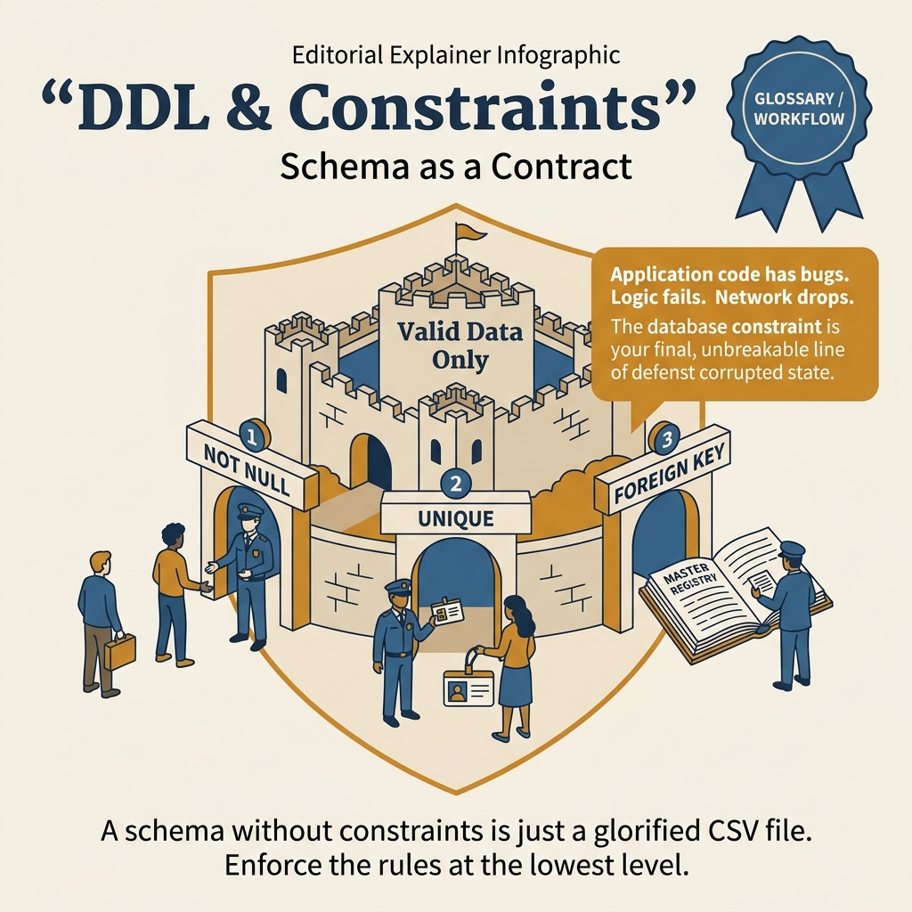
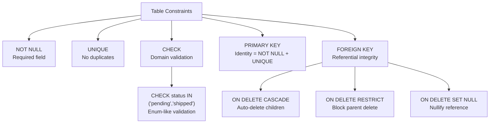

<!-- tags: sql, postgresql, database -->
# 🏗️ DDL & Constraints

> Schema design, constraints, indexes — integrity tại database level

| Aspect           | Detail                                         |
| ---------------- | ---------------------------------------------- |
| **Concept**      | DDL statements, constraints, schema management |
| **Use case**     | Table design, data integrity                   |
| **Go relevance** | Migration tools (goose, golang-migrate)        |
| **CLI**          | `\d`, `\dt`, `\di`, `CREATE TABLE`             |

---

📅 Ngày tạo: 2026-03-20 · 🔄 Cập nhật: 2026-04-04 · ⏱️ 15 phút đọc

---

## 1. DEFINE

Bảng `orders` production: `status TEXT`, không có CHECK constraint. Sprint 5, developer INSERT `status = 'Pending'` thay vì `'pending'`. Sprint 8, API filter `WHERE status = 'pending'` — 15% orders biến mất khỏi dashboard vì case mismatch. Hotfix: migration thêm `CHECK (status IN ('pending', 'confirmed', 'shipped'))` — phát hiện 2,340 rows vi phạm đã nằm trong database.

DDL không chỉ là "tạo bảng". Constraints là **guardrails** bảo vệ data integrity tại database layer — nơi mà application code không thể bao phủ hết mọi entry point.


| Variant | Mô tả |
| --- | --- |
| CREATE TABLE | Tạo bảng · CREATE TABLE users (...) |
| ALTER TABLE | Thay đổi schema · ALTER TABLE users ADD COLUMN age int |
| DROP TABLE | Xoá bảng · DROP TABLE IF EXISTS users CASCADE |
| CREATE INDEX | Tạo index · CREATE INDEX idx_email ON users(email) |

| Approach | Time | Space | Khi chọn |
| --- | --- | --- | --- |
| Table với Full Constraints | Phụ thuộc cardinality | Phụ thuộc row width | Dùng để nắm baseline semantics trước khi tune planner hoặc index. |
| Safe Migrations | Phụ thuộc plan | Phụ thuộc memory operator | Dùng khi query đã chạm index, cardinality hoặc join strategy. |


### DDL Statements

| Statement       | Mô tả           | Ví dụ                                     |
| --------------- | --------------- | ----------------------------------------- |
| `CREATE TABLE`  | Tạo bảng        | `CREATE TABLE users (...)`                |
| `ALTER TABLE`   | Thay đổi schema | `ALTER TABLE users ADD COLUMN age int`    |
| `DROP TABLE`    | Xoá bảng        | `DROP TABLE IF EXISTS users CASCADE`      |
| `CREATE INDEX`  | Tạo index       | `CREATE INDEX idx_email ON users(email)`  |
| `TRUNCATE`      | Xoá data (fast) | `TRUNCATE users RESTART IDENTITY CASCADE` |
| `CREATE SCHEMA` | Namespace       | `CREATE SCHEMA app`                       |

### Constraint Types

| Type          | Mô tả               | Enforce           | Ví dụ                     |
| ------------- | ------------------- | ----------------- | ------------------------- |
| `PRIMARY KEY` | Unique + NOT NULL   | Row identity      | `id bigint PRIMARY KEY`   |
| `UNIQUE`      | No duplicates       | Uniqueness        | `UNIQUE(email)`           |
| `NOT NULL`    | No null values      | Required field    | `name text NOT NULL`      |
| `CHECK`       | Custom validation   | Business rules    | `CHECK(age > 0)`          |
| `FOREIGN KEY` | Reference integrity | Relationships     | `REFERENCES users(id)`    |
| `EXCLUDE`     | Prevent overlaps    | Range constraints | `EXCLUDE USING gist(...)` |
| `DEFAULT`     | Auto-fill value     | Convenience       | `DEFAULT now()`           |

### Foreign Key Actions

| Action        | ON DELETE                     | ON UPDATE         |
| ------------- | ----------------------------- | ----------------- |
| `RESTRICT`    | Block delete if referenced    | Block update      |
| `CASCADE`     | Delete child rows too         | Update child FK   |
| `SET NULL`    | Set FK to NULL                | Set FK to NULL    |
| `SET DEFAULT` | Set FK to default             | Set FK to default |
| `NO ACTION`   | Same as RESTRICT (deferrable) | Same as RESTRICT  |

### Failure Modes

| Lỗi                     | Nguyên nhân               | Fix                         |
| ----------------------- | ------------------------- | --------------------------- |
| `unique_violation`      | Duplicate key             | UPSERT hoặc handle conflict |
| `foreign_key_violation` | Referenced row not found  | Insert parent first         |
| `check_violation`       | CHECK constraint failed   | Validate before insert      |
| Table lock during ALTER | Long ALTER on large table | `CREATE INDEX CONCURRENTLY` |

---

Các failure mode trên nghe rõ. Nhưng có trap: ALTER TABLE ADD COLUMN NOT NULL = full table rewrite trước PG11, và DROP CONSTRAINT không cascade = orphan references. Trap đó sẽ xuất hiện ở PITFALLS.

## 2. VISUAL

Với DDL & Constraints, bảng phân loại mới chỉ giúp bạn gọi đúng tên khái niệm. Điều quan trọng hơn là nhìn xem rows, giá trị hoặc ràng buộc thực sự đổi shape như thế nào khi query chạy qua từng bước.




*Hình: Schema lifecycle — CREATE TABLE → ALTER TABLE → Constraints → Migration Safety. NOT VALID + VALIDATE = zero-downtime constraint trên bảng lớn.*

### Level 1

```
Business Requirements
       │
       ▼
Entities → Tables
       │
       ├── Primary Keys (identity)
       ├── Columns + Types (data)
       ├── Constraints (integrity)
       │     ├── NOT NULL (required)
       │     ├── UNIQUE (no duplicates)
       │     ├── CHECK (business rules)
       │     └── FK (relationships)
       ├── Indexes (performance)
       └── Triggers (automation)
```

---

*Hình: Level 1 cho 🏗️ DDL & Constraints — nhìn vào happy path hoặc baseline heuristic trước khi đi sâu vào planner và trade-off.*

### Level 2

```text
Decision Lens                 Dấu hiệu cần nhìn                 Hướng xử lý
---------------------------  --------------------------------  -------------------------------------------
Semantics trước               Kết quả có đúng intent không?    1. Table với Full Constraints
Planner / index signal        Cardinality, cost, buffers ra sao? 2. Safe Migrations
Production pressure           Lock, WAL, lag, rollback nào đau? 1. Table với Full Constraints
```

*Hình: Level 2 biến 🏗️ DDL & Constraints thành checklist quyết định — từ semantics, sang plan signal, rồi đến áp lực production.*


### Architecture — Constraint Types Map



*Hình: Constraint types từ đơn giản (NOT NULL) đến phức tạp (FK cascade). Mỗi constraint là guardrail bảo vệ data integrity tại database layer — nơi application code không cover hết.*

---
## 3. CODE

Khi flow của DDL & Constraints đã rõ, ta chuyển nó thành DDL, truy vấn và transaction có thể chạy thật. Ta bắt đầu từ case hẹp nhất rồi tăng dần số lượng rows, ràng buộc và biến thể.

### Problem 1: Basic — Table với Full Constraints

> **Mục tiêu**: Minh họa cách áp dụng **🏗️ DDL & Constraints** qua ví dụ `Table với Full Constraints` trong đúng ngữ cảnh schema, query hoặc vận hành.


```sql
-- ✅ Users table — production-grade
CREATE TABLE users (
    id          bigint GENERATED ALWAYS AS IDENTITY PRIMARY KEY,
    email       text NOT NULL,
    full_name   text NOT NULL,
    avatar_url  text,
    status      text NOT NULL DEFAULT 'active'
                CHECK (status IN ('active', 'inactive', 'suspended')),
    created_at  timestamptz NOT NULL DEFAULT now(),
    updated_at  timestamptz NOT NULL DEFAULT now(),

    CONSTRAINT users_email_unique UNIQUE (email),
    CONSTRAINT users_email_valid CHECK (email ~* '^[^@]+@[^@]+\.[^@]+$'),
    CONSTRAINT users_name_not_empty CHECK (char_length(full_name) > 0)
);

-- ✅ Orders table — FK relationships
CREATE TABLE orders (
    id          bigint GENERATED ALWAYS AS IDENTITY PRIMARY KEY,
    user_id     bigint NOT NULL REFERENCES users(id) ON DELETE RESTRICT,
    total       numeric(15,2) NOT NULL CHECK (total >= 0),
    currency    char(3) NOT NULL DEFAULT 'VND',
    status      text NOT NULL DEFAULT 'pending'
                CHECK (status IN ('pending', 'paid', 'shipped', 'delivered', 'cancelled')),
    notes       text,
    created_at  timestamptz NOT NULL DEFAULT now(),
    updated_at  timestamptz NOT NULL DEFAULT now()
);

CREATE TABLE order_items (
    id          bigint GENERATED ALWAYS AS IDENTITY PRIMARY KEY,
    order_id    bigint NOT NULL REFERENCES orders(id) ON DELETE CASCADE,
    product_id  bigint NOT NULL,
    quantity    integer NOT NULL CHECK (quantity > 0),
    unit_price  numeric(15,2) NOT NULL CHECK (unit_price >= 0),

    CONSTRAINT order_items_unique_product UNIQUE (order_id, product_id)
);

-- ✅ Indexes
CREATE INDEX idx_orders_user_id ON orders(user_id);
CREATE INDEX idx_orders_status ON orders(status) WHERE status != 'delivered';
CREATE INDEX idx_order_items_order_id ON order_items(order_id);

-- ✅ Auto-update updated_at trigger
CREATE OR REPLACE FUNCTION update_updated_at()
RETURNS TRIGGER AS $$
BEGIN
    NEW.updated_at = now();
    RETURN NEW;
END;
$$ LANGUAGE plpgsql;

CREATE TRIGGER users_updated_at
    BEFORE UPDATE ON users
    FOR EACH ROW EXECUTE FUNCTION update_updated_at();

CREATE TRIGGER orders_updated_at
    BEFORE UPDATE ON orders
    FOR EACH ROW EXECUTE FUNCTION update_updated_at();
```


DDL basics đã cover. Nhưng constraints cần domain integrity — hãy enforce.

### Problem 2: Intermediate — Safe Migrations

> **Mục tiêu**: Minh họa cách áp dụng **🏗️ DDL & Constraints** qua ví dụ `Safe Migrations` trong đúng ngữ cảnh schema, query hoặc vận hành.


```sql
-- ✅ Add column (safe — no lock)
ALTER TABLE users ADD COLUMN phone text;

-- ✅ Add column with default (PG 11+ = instant, no rewrite)
ALTER TABLE users ADD COLUMN is_verified boolean NOT NULL DEFAULT false;

-- ✅ Create index CONCURRENTLY (no lock!)
CREATE INDEX CONCURRENTLY idx_users_phone ON users(phone) WHERE phone IS NOT NULL;

-- ❌ AVOID: add NOT NULL without default (rewrites entire table)
-- ALTER TABLE users ADD COLUMN age integer NOT NULL;
-- ✅ INSTEAD:
ALTER TABLE users ADD COLUMN age integer;
-- Backfill in batches...
UPDATE users SET age = 0 WHERE age IS NULL AND id BETWEEN 1 AND 10000;
-- Then add NOT NULL
ALTER TABLE users ALTER COLUMN age SET NOT NULL;
ALTER TABLE users ALTER COLUMN age SET DEFAULT 0;

-- ✅ Rename column (safe)
ALTER TABLE users RENAME COLUMN full_name TO display_name;

-- ✅ Change column type (⚠️ may rewrite — be careful on large tables)
ALTER TABLE users ALTER COLUMN status TYPE text;  -- text→text = instant
```

```go
// migrations/001_create_users.go — Go migration
package migrations

import (
	"context"
	"database/sql"
	"github.com/pressly/goose/v3"
)

func init() {
	goose.AddMigrationContext(Up001, Down001)
}

func Up001(ctx context.Context, tx *sql.Tx) error {
	_, err := tx.ExecContext(ctx, `
		CREATE TABLE users (
			id bigint GENERATED ALWAYS AS IDENTITY PRIMARY KEY,
			email text NOT NULL,
			created_at timestamptz NOT NULL DEFAULT now(),
			CONSTRAINT users_email_unique UNIQUE (email)
		)
	`)
	return err
}

func Down001(ctx context.Context, tx *sql.Tx) error {
	_, err := tx.ExecContext(ctx, `DROP TABLE IF EXISTS users`)
	return err
}
```

**Tại sao?** Ở mức Intermediate của DDL & Constraints, bài khó không còn là viết cho chạy mà là giữ đúng invariant khi dữ liệu đổi shape. Problem 2: Intermediate — Safe Migrations buộc bạn nhìn xem cardinality, nullability hoặc grain của dữ liệu đang bẻ semantic đi theo hướng nào.


> **✅ Đạt được**: Safe schema changes, CONCURRENTLY index, Go migrations.
> **⚠️ Lưu ý**: `CREATE INDEX CONCURRENTLY` không chạy trong transaction!

---
Bạn đã đi qua DDL và constraints. Bây giờ đến phần nguy hiểm: table rewrite và orphan refs — trap đã được setup từ đầu bài.

## 4. PITFALLS

DDL & Constraints thường không thất bại ở chỗ cú pháp sai, mà ở chỗ semantics bị hiểu lệch hoặc bị kéo vào ngữ cảnh production lớn hơn. Phần dưới đây gom những lỗi dễ trả giá nhất.

| # | Severity | Lỗi | Hậu quả | Fix |
| --- | --- | --- | --- | --- |
| 1 | 🟡 Common | ALTER TABLE locks table | — | CREATE INDEX CONCURRENTLY, batch updates |
| 2 | 🟡 Common | FK on large tables → slow delete | — | Consider soft delete hoặc ON DELETE CASCADE |
| 3 | 🔵 Minor | Missing NOT NULL → bad data | — | Add constraints early |
| 4 | 🔵 Minor | CASCADE delete unexpected | — | Prefer RESTRICT, xử lý manually |
| 5 | 🔵 Minor | Migration not idempotent | — | IF NOT EXISTS, IF EXISTS |

---
Bạn đã đi qua DDL & Constraints và cạm bẫy. Các resources dưới đây giúp đi sâu hơn.

## 5. REF

| Resource    | Link                                                                                                             |
| ----------- | ---------------------------------------------------------------------------------------------------------------- |
| DDL         | [postgresql.org/docs/current/ddl.html](https://www.postgresql.org/docs/current/ddl.html)                         |
| Constraints | [postgresql.org/docs/current/ddl-constraints.html](https://www.postgresql.org/docs/current/ddl-constraints.html) |
| Goose       | [github.com/pressly/goose](https://github.com/pressly/goose)                                                     |

---

## 6. RECOMMEND

Khi những bẫy chính của DDL & Constraints đã hiện ra, bước tiếp theo là nối nó sang planner, maintenance hoặc topology lớn hơn để mental model không dừng ở mức cú pháp.

| Mở rộng                | Khi nào                | Lý do                       |
| ---------------------- | ---------------------- | --------------------------- |
| **golang-migrate**     | Alternative to goose   | Phổ biến, nhiều drivers     |
| **Atlas**              | Declarative migrations | HCL-based schema definition |
| **pg_repack**          | Reclaim space          | CLUSTER without lock        |
| **safe-pg-migrations** | Rails-like safety      | Prevent dangerous DDL       |


> **Callback** — Quay lại 2,340 rows vi phạm constraint lúc đầu: `'Pending'` vs `'pending'` — CHECK constraint phát hiện ngay tại INSERT thay vì 3 sprint sau qua user complaint. Guardrails rẻ hơn hotfix.

---

**Liên kết**: [← Data Types](./01-data-types.md) · [→ DML & Transactions](./03-dml-transactions.md)

---

## 7. QUICK REF

| Signal | Action |
| --- | --- |
| CHECK cho domain validation (status, enum) | Reject invalid data at INSERT time |
| UNIQUE cho business keys (email, code) | Prevent duplicates at DB layer |
| FK cho referential integrity | Cascade delete/restrict protect relationships |
| NOT NULL cho required fields | Eliminate NULL ambiguity |
