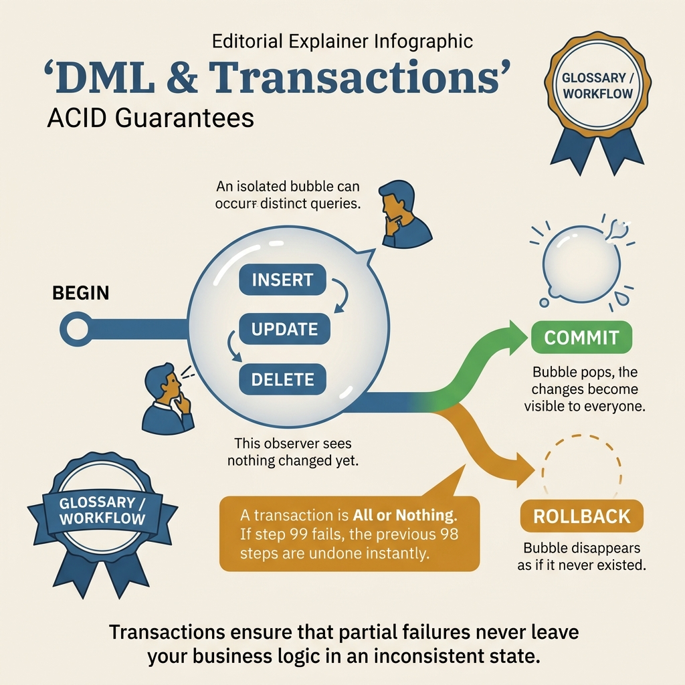
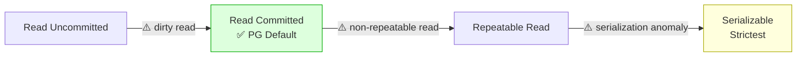

<!-- tags: sql, postgresql, database, transactions -->
# 🔄 DML & Transactions — INSERT, UPDATE, DELETE, UPSERT, Isolation

> CRUD operations, UPSERT patterns, transaction isolation levels — mọi thao tác data

| Aspect           | Detail                                        |
| ---------------- | --------------------------------------------- |
| **Concept**      | Data Manipulation Language, ACID transactions |
| **Use case**     | Mọi CRUD operation                            |
| **Go relevance** | pgx, sqlx, GORM operations                    |
| **CLI**          | `BEGIN`, `COMMIT`, `ROLLBACK`, `SAVEPOINT`    |

---

📅 Ngày tạo: 2026-03-20 · 🔄 Cập nhật: 2026-04-04 · ⏱️ 15 phút đọc

---

## 1. DEFINE

Transfer tiền: trừ tài khoản A, cộng tài khoản B. Code chạy tốt 99.99% thời gian. Nhưng lúc 2AM, server crash giữa hai operations — A bị trừ, B chưa được cộng. $5,000 biến mất. Không có transaction wrap, hai operations này là **hai hành động độc lập** — crash ở giữa = data inconsistency không thể detect tự động.

DML + Transactions là bộ đôi quyết định data sống hay chết: INSERT/UPDATE/DELETE thay đổi state, Transaction đảm bảo thay đổi đó hoặc xảy ra hoàn toàn hoặc không xảy ra gì.


| Variant | Mô tả |
| --- | --- |
| INSERT | Thêm row mới · RETURNING * |
| UPDATE | Sửa existing rows · RETURNING * |
| DELETE | Xoá rows · RETURNING * |
| INSERT ... ON CONFLICT | UPSERT (insert or update) · RETURNING * |

| Approach | Time | Space | Khi chọn |
| --- | --- | --- | --- |
| INSERT, UPDATE, DELETE với RETURNING | Phụ thuộc cardinality | Phụ thuộc row width | Dùng để nắm baseline semantics trước khi tune planner hoặc index. |
| UPSERT & MERGE | Phụ thuộc plan | Phụ thuộc memory operator | Dùng khi query đã chạm index, cardinality hoặc join strategy. |
| Transaction Patterns, Locking, Retry | Phụ thuộc workload | Phụ thuộc buffer/WAL | Dùng khi workload production cần cân bằng correctness, lock và rollout. |
| COPY Protocol (Fastest Bulk Insert) | Phụ thuộc incident path | Phụ thuộc replication/cache | Dùng khi cần operational playbook, incident response hoặc phối hợp nhiều kỹ thuật. |


### DML Statements

| Statement                | Mô tả                                     | Returns       |
| ------------------------ | ----------------------------------------- | ------------- |
| `INSERT`                 | Thêm row mới                              | `RETURNING *` |
| `UPDATE`                 | Sửa existing rows                         | `RETURNING *` |
| `DELETE`                 | Xoá rows                                  | `RETURNING *` |
| `INSERT ... ON CONFLICT` | UPSERT (insert or update)                 | `RETURNING *` |
| `MERGE`                  | Insert/Update/Delete conditional (PG 15+) | —             |
| `COPY`                   | Bulk import/export (fastest)              | count         |

### Transaction Isolation Levels

| Level                | Dirty Read                       | Non-repeatable Read | Phantom Read     | Use case             |
| -------------------- | -------------------------------- | ------------------- | ---------------- | -------------------- |
| **Read Uncommitted** | ❌ (PG treats as Read Committed) | ✅                  | ✅               | —                    |
| **Read Committed**   | ❌                               | ✅                  | ✅               | ✅ Default PG        |
| **Repeatable Read**  | ❌                               | ❌                  | ❌ (PG uses SSI) | Financial            |
| **Serializable**     | ❌                               | ❌                  | ❌               | Critical consistency |

### Locking Types

| Lock                | Mô tả                 | Use case                  |
| ------------------- | --------------------- | ------------------------- |
| `FOR UPDATE`        | Exclusive row lock    | Prevent concurrent modify |
| `FOR SHARE`         | Shared read lock      | Prevent delete/update     |
| `FOR NO KEY UPDATE` | Lock except FK checks | Most common UPDATE lock   |
| `FOR KEY SHARE`     | Minimally restrictive | FK reference checks       |
| `SKIP LOCKED`       | Skip locked rows      | Job queue pattern         |
| `NOWAIT`            | Error if locked       | Fast-fail pattern         |

### Failure Modes

| Lỗi                     | Nguyên nhân                    | Fix                       |
| ----------------------- | ------------------------------ | ------------------------- |
| `deadlock_detected`     | 2 transactions lock each other | Consistent lock ordering  |
| `serialization_failure` | Concurrent modify conflict     | Retry transaction         |
| `unique_violation`      | Duplicate key                  | UPSERT or handle conflict |
| `foreign_key_violation` | Referenced row missing         | Insert parent first       |

---

Các failure mode trên nghe dễ tránh. Nhưng có trap: long running transaction = bloat + replication lag, và READ COMMITTED phantom reads = stale data logic. Trap đó sẽ xuất hiện ở PITFALLS.

## 2. VISUAL

Với DML & Transactions — INSERT, UPDATE, DELETE, UPSERT, Isolation, bảng phân loại mới chỉ giúp bạn gọi đúng tên khái niệm. Điều quan trọng hơn là nhìn xem rows, giá trị hoặc ràng buộc thực sự đổi shape như thế nào khi query chạy qua từng bước.




*Hình: Transaction lifecycle — BEGIN → DML operations → COMMIT/ROLLBACK → Isolation level. READ COMMITTED đủ cho 95% apps.*

### Level 1

```
BEGIN
  │
  ├── SAVEPOINT sp1
  │     ├── Operations...
  │     ├── Error? → ROLLBACK TO sp1
  │     └── Success → RELEASE sp1
  │
  ├── More operations...
  │
  ├── All OK? → COMMIT
  └── Error?  → ROLLBACK
```

---

*Hình: Level 1 cho 🔄 DML & Transactions — INSERT, UPDATE, DELETE, UPSERT, Isolation — nhìn vào happy path hoặc baseline heuristic trước khi đi sâu vào planner và trade-off.*

### Level 2

```text
Decision Lens                 Dấu hiệu cần nhìn                 Hướng xử lý
---------------------------  --------------------------------  -------------------------------------------
Semantics trước               Kết quả có đúng intent không?    1. INSERT, UPDATE, DELETE với RETURNING
Planner / index signal        Cardinality, cost, buffers ra sao? 2. UPSERT & MERGE
Production pressure           Lock, WAL, lag, rollback nào đau? 3. Transaction Patterns, Locking, Retry
```

*Hình: Level 2 biến 🔄 DML & Transactions — INSERT, UPDATE, DELETE, UPSERT, Isolation thành checklist quyết định — từ semantics, sang plan signal, rồi đến áp lực production.*


### Architecture — Transaction Isolation Levels



*Hình: PostgreSQL mặc định Read Committed — snapshot per statement. Repeatable Read = snapshot per transaction. Serializable = linearizable nhưng có thể retry. Chọn theo consistency requirement, không phải theo defaults.*

---
## 3. CODE

Khi flow của DML & Transactions — INSERT, UPDATE, DELETE, UPSERT, Isolation đã rõ, ta chuyển nó thành DDL, truy vấn và transaction có thể chạy thật. Ta bắt đầu từ case hẹp nhất rồi tăng dần số lượng rows, ràng buộc và biến thể.

### Problem 1: Basic — INSERT, UPDATE, DELETE với RETURNING

> **Mục tiêu**: CRUD operations chuẩn với RETURNING
> **Cần**: PostgreSQL 15+
> **Đạt được**: Efficient data manipulation


```sql
-- ═══════════════════════════════════════════
-- INSERT
-- ═══════════════════════════════════════════

-- ✅ Basic insert
INSERT INTO users (email, full_name, status)
VALUES ('alice@go.dev', 'Alice', 'active');

-- ✅ Insert với RETURNING — lấy generated values
INSERT INTO users (email, full_name)
VALUES ('bob@go.dev', 'Bob')
RETURNING id, created_at;            -- ✅ trả về ID + timestamp

-- ✅ Multi-row insert
INSERT INTO users (email, full_name) VALUES
    ('user1@go.dev', 'User 1'),
    ('user2@go.dev', 'User 2'),
    ('user3@go.dev', 'User 3')
RETURNING id, email;

-- ✅ Insert from SELECT
INSERT INTO user_backups (email, full_name, backed_up_at)
SELECT email, full_name, now()
FROM users
WHERE status = 'inactive';

-- ✅ Insert with DEFAULT values
INSERT INTO orders (user_id) VALUES (1);
-- status defaults to 'pending', created_at defaults to now()

-- ═══════════════════════════════════════════
-- UPDATE
-- ═══════════════════════════════════════════

-- ✅ Basic update
UPDATE users SET status = 'inactive'
WHERE last_login_at < now() - interval '6 months';

-- ✅ Update with RETURNING (trả về rows affected)
UPDATE orders
SET status = 'shipped', shipped_at = now()
WHERE id = 42
RETURNING id, status, shipped_at;

-- ✅ Update from another table (JOIN update)
UPDATE order_items oi
SET price = p.current_price
FROM products p
WHERE oi.product_id = p.id
AND oi.order_id = 100;

-- ✅ Conditional update (CASE)
UPDATE users
SET tier = CASE
    WHEN total_spent >= 10000 THEN 'gold'
    WHEN total_spent >= 5000  THEN 'silver'
    ELSE 'bronze'
END
WHERE tier != CASE
    WHEN total_spent >= 10000 THEN 'gold'
    WHEN total_spent >= 5000  THEN 'silver'
    ELSE 'bronze'
END;                                   -- ✅ Only update changed rows

-- ═══════════════════════════════════════════
-- DELETE
-- ═══════════════════════════════════════════

-- ✅ Delete with condition
DELETE FROM sessions
WHERE expired_at < now();

-- ✅ Delete with RETURNING
DELETE FROM temp_uploads
WHERE created_at < now() - interval '24 hours'
RETURNING id, filename;               -- ✅ Know what was deleted

-- ✅ Delete with subquery
DELETE FROM orders
WHERE user_id IN (
    SELECT id FROM users WHERE status = 'deleted'
);

-- ✅ TRUNCATE — fastest delete (DDL, not DML)
TRUNCATE users RESTART IDENTITY CASCADE;
-- ⚠️ Cannot rollback! Resets serial counter. Cascades to FK tables.
```

```go
// ✅ Go with pgx — INSERT RETURNING
func (r *Repo) CreateUser(ctx context.Context, email, name string) (*User, error) {
    user := &User{}
    err := r.pool.QueryRow(ctx,
        `INSERT INTO users (email, full_name) VALUES ($1, $2)
         RETURNING id, email, full_name, created_at`,
        email, name,
    ).Scan(&user.ID, &user.Email, &user.FullName, &user.CreatedAt)
    return user, err
}
```


DML basics đã cover. Nhưng transaction isolation cần MVCC understanding — hãy hiểu.

### Problem 2: Intermediate — UPSERT & MERGE

> **Mục tiêu**: Handle duplicate keys gracefully, bulk upsert
> **Cần**: Unique constraints
> **Đạt được**: Idempotent data operations


```sql
-- ═══════════════════════════════════════════
-- UPSERT — INSERT ... ON CONFLICT
-- ═══════════════════════════════════════════

-- ✅ UPSERT: insert or update
INSERT INTO users (email, full_name, last_login_at)
VALUES ('alice@go.dev', 'Alice Updated', now())
ON CONFLICT (email) DO UPDATE SET
    full_name = EXCLUDED.full_name,      -- ✅ EXCLUDED = row being inserted
    last_login_at = EXCLUDED.last_login_at,
    updated_at = now()
RETURNING id, email, full_name;

-- ✅ UPSERT: insert or ignore (skip duplicates)
INSERT INTO tags (name)
VALUES ('golang'), ('postgresql'), ('docker')
ON CONFLICT (name) DO NOTHING
RETURNING id, name;

-- ✅ UPSERT with WHERE — conditional update
INSERT INTO product_prices (product_id, price, effective_date)
VALUES (1, 29.99, '2024-01-15')
ON CONFLICT (product_id) DO UPDATE SET
    price = EXCLUDED.price,
    effective_date = EXCLUDED.effective_date
WHERE product_prices.price != EXCLUDED.price;  -- ✅ Only update if price changed

-- ✅ Bulk UPSERT from JSON
INSERT INTO products (external_id, name, price)
SELECT
    (item->>'id')::int,
    item->>'name',
    (item->>'price')::numeric
FROM jsonb_array_elements($1::jsonb) AS item
ON CONFLICT (external_id) DO UPDATE SET
    name = EXCLUDED.name,
    price = EXCLUDED.price,
    updated_at = now();

-- ═══════════════════════════════════════════
-- MERGE — PostgreSQL 15+ (SQL standard)
-- ═══════════════════════════════════════════

-- ✅ MERGE — single statement for insert/update/delete
MERGE INTO inventory AS target
USING new_shipment AS source
ON target.product_id = source.product_id
WHEN MATCHED AND source.quantity = 0 THEN
    DELETE                                       -- ✅ Remove if depleted
WHEN MATCHED THEN
    UPDATE SET quantity = target.quantity + source.quantity,
               updated_at = now()                -- ✅ Add quantity
WHEN NOT MATCHED THEN
    INSERT (product_id, quantity, warehouse_id)
    VALUES (source.product_id, source.quantity, source.warehouse_id);
```

```go
// ✅ Go bulk UPSERT with pgx batch
func (r *Repo) BulkUpsertProducts(ctx context.Context, products []Product) error {
    batch := &pgx.Batch{}
    for _, p := range products {
        batch.Queue(
            `INSERT INTO products (external_id, name, price)
             VALUES ($1, $2, $3)
             ON CONFLICT (external_id) DO UPDATE SET
                name = EXCLUDED.name, price = EXCLUDED.price, updated_at = now()`,
            p.ExternalID, p.Name, p.Price,
        )
    }
    results := r.pool.SendBatch(ctx, batch)
    defer results.Close()

    for i := 0; i < len(products); i++ {
        if _, err := results.Exec(); err != nil {
            return fmt.Errorf("upsert product[%d]: %w", i, err)
        }
    }
    return nil
}
```

**Tại sao?** Ở mức Intermediate của DML & Transactions — INSERT, UPDATE, DELETE, UPSERT, Isolation, bài khó không còn là viết cho chạy mà là giữ đúng invariant khi dữ liệu đổi shape. Problem 2: Intermediate — UPSERT & MERGE buộc bạn nhìn xem cardinality, nullability hoặc grain của dữ liệu đang bẻ semantic đi theo hướng nào.


Isolation đã cover. Nhưng savepoints cần nested rollback — hãy control.

### Problem 3: Advanced — Transaction Patterns, Locking, Retry

> **Mục tiêu**: Production-grade transaction handling, deadlock prevention
> **Cần**: Concurrency understanding
> **Đạt được**: ACID guarantees, concurrent safety


```sql
-- ═══════════════════════════════════════════
-- Transaction with SAVEPOINT
-- ═══════════════════════════════════════════
BEGIN;
    UPDATE accounts SET balance = balance - 100 WHERE id = 1;

    SAVEPOINT transfer_to_savings;
        UPDATE savings SET balance = balance + 100 WHERE user_id = 1;
        -- Nếu savings table lỗi → rollback chỉ phần này
    -- ROLLBACK TO transfer_to_savings;     -- partial rollback
    RELEASE SAVEPOINT transfer_to_savings;  -- success

COMMIT;

-- ═══════════════════════════════════════════
-- Row Locking — FOR UPDATE
-- ═══════════════════════════════════════════

-- ✅ Pessimistic lock — prevent concurrent modification
BEGIN;
    SELECT balance FROM accounts WHERE id = 1 FOR UPDATE;
    -- Row is locked — other transactions WAIT here
    UPDATE accounts SET balance = balance - 100 WHERE id = 1;
COMMIT;

-- ✅ SKIP LOCKED — job queue pattern
-- Multiple workers can grab different jobs without waiting
BEGIN;
    DELETE FROM job_queue
    WHERE id = (
        SELECT id FROM job_queue
        WHERE status = 'pending'
        ORDER BY created_at
        LIMIT 1
        FOR UPDATE SKIP LOCKED           -- ✅ Skip locked rows!
    )
    RETURNING *;
COMMIT;

-- ✅ NOWAIT — fast-fail
BEGIN;
    SELECT * FROM accounts WHERE id = 1 FOR UPDATE NOWAIT;
    -- If locked → ERROR immediately (no waiting)
COMMIT;

-- ═══════════════════════════════════════════
-- Advisory Locks (application-level)
-- ═══════════════════════════════════════════

-- ✅ Session-level advisory lock
SELECT pg_advisory_lock(hashtext('process_daily_report'));
-- ... run daily report (only 1 instance)
SELECT pg_advisory_unlock(hashtext('process_daily_report'));

-- ✅ Transaction-level advisory lock (auto-released on COMMIT)
BEGIN;
    SELECT pg_advisory_xact_lock(hashtext('user_42_update'));
    UPDATE users SET balance = balance + 100 WHERE id = 42;
COMMIT;  -- lock auto-released
```

```go
// ✅ Go transaction with retry (serialization_failure)
func (r *Repo) TransferWithRetry(ctx context.Context, from, to int64, amount float64) error {
    maxRetries := 3
    for attempt := 0; attempt < maxRetries; attempt++ {
        err := r.transfer(ctx, from, to, amount)
        if err == nil {
            return nil
        }
        // ✅ Retry on serialization failure
        var pgErr *pgconn.PgError
        if errors.As(err, &pgErr) && pgErr.Code == "40001" {
            log.Printf("Serialization failure, retry %d/%d", attempt+1, maxRetries)
            time.Sleep(time.Duration(attempt*10) * time.Millisecond)
            continue
        }
        return err // Non-retryable error
    }
    return fmt.Errorf("max retries exceeded")
}

func (r *Repo) transfer(ctx context.Context, from, to int64, amount float64) error {
    tx, err := r.pool.BeginTx(ctx, pgx.TxOptions{
        IsoLevel: pgx.Serializable,  // ✅ Strongest isolation
    })
    if err != nil {
        return err
    }
    defer tx.Rollback(ctx)

    // ✅ Lock rows in consistent order (prevent deadlock)
    ids := []int64{from, to}
    sort.Slice(ids, func(i, j int) bool { return ids[i] < ids[j] })

    for _, id := range ids {
        var balance float64
        err := tx.QueryRow(ctx,
            "SELECT balance FROM accounts WHERE id = $1 FOR UPDATE", id,
        ).Scan(&balance)
        if err != nil {
            return err
        }
        if id == from && balance < amount {
            return fmt.Errorf("insufficient balance: %.2f < %.2f", balance, amount)
        }
    }

    _, err = tx.Exec(ctx, "UPDATE accounts SET balance = balance - $1 WHERE id = $2", amount, from)
    if err != nil {
        return err
    }
    _, err = tx.Exec(ctx, "UPDATE accounts SET balance = balance + $1 WHERE id = $2", amount, to)
    if err != nil {
        return err
    }

    return tx.Commit(ctx)
}
```

**Tại sao?** Khi DML & Transactions — INSERT, UPDATE, DELETE, UPSERT, Isolation đi tới mức Advanced, chi phí không còn nằm riêng trong câu lệnh mà lan sang lock time, maintenance window và rollback path. Problem 3: Advanced — Transaction Patterns, Locking, Retry đáng giá vì nó cho thấy một lựa chọn đẹp trên giấy có thể rất đắt trên hệ thống đang chạy.


### Problem 4: Expert — COPY Protocol (Fastest Bulk Insert)

> **Mục tiêu**: Bulk insert millions of rows
> **Cần**: pgx CopyFrom
> **Đạt được**: 100x faster than individual INSERTs


```go
// ✅ pgx CopyFrom — uses PostgreSQL COPY protocol
func (r *Repo) BulkInsertUsers(ctx context.Context, users []User) (int64, error) {
    rows := make([][]interface{}, len(users))
    for i, u := range users {
        rows[i] = []interface{}{u.Email, u.FullName, u.Status, time.Now()}
    }

    count, err := r.pool.CopyFrom(ctx,
        pgx.Identifier{"users"},               // Table name
        []string{"email", "full_name", "status", "created_at"}, // Columns
        pgx.CopyFromRows(rows),                 // Data
    )
    return count, err
}

// Benchmark:
// Individual INSERT: 1000 rows/sec
// Batch INSERT:      10,000 rows/sec
// COPY protocol:     100,000+ rows/sec
```

**Tại sao?** Ở lớp Expert của DML & Transactions — INSERT, UPDATE, DELETE, UPSERT, Isolation, bạn phải giữ cùng lúc ba thứ: semantics đúng, planner không bị lạc hướng và rollout không làm production đau thêm. Problem 4: Expert — COPY Protocol (Fastest Bulk Insert) tồn tại để luyện đúng khả năng phối hợp đó.


---
Bạn đã đi qua DML, isolation, và savepoints. Bây giờ đến phần nguy hiểm: long transactions và phantom reads — trap đã được setup từ đầu bài.

## 4. PITFALLS

DML & Transactions — INSERT, UPDATE, DELETE, UPSERT, Isolation thường không thất bại ở chỗ cú pháp sai, mà ở chỗ semantics bị hiểu lệch hoặc bị kéo vào ngữ cảnh production lớn hơn. Phần dưới đây gom những lỗi dễ trả giá nhất.

| # | Severity | Lỗi | Hậu quả | Fix |
| --- | --- | --- | --- | --- |
| 1 | 🔵 Minor | UPDATE without WHERE → update ALL rows | — | Always include WHERE |
| 2 | 🔴 Fatal | Deadlock | — | Lock rows in consistent order (sort by ID) |
| 3 | 🟡 Common | Long transaction → lock contention | — | Keep transactions short |
| 4 | 🔴 Fatal | DELETE slow on large tables | — | Batch delete hoặc partition + drop |
| 5 | 🔵 Minor | UPSERT race condition | — | Unique constraint + retry |
| 6 | 🔵 Minor | Serialization failure not retried | — | Always retry 40001 errors |

---
Bạn đã đi qua DML & Transactions và cạm bẫy. Các resources dưới đây giúp đi sâu hơn.

## 5. REF

| Resource      | Link                                                                                                             |
| ------------- | ---------------------------------------------------------------------------------------------------------------- |
| INSERT        | [postgresql.org/docs/current/sql-insert.html](https://www.postgresql.org/docs/current/sql-insert.html)           |
| Transactions  | [postgresql.org/docs/current/transaction-iso.html](https://www.postgresql.org/docs/current/transaction-iso.html) |
| MERGE (PG 15) | [postgresql.org/docs/current/sql-merge.html](https://www.postgresql.org/docs/current/sql-merge.html)             |
| Neon Tutorial | [neon.com/postgresql/tutorial](https://neon.com/postgresql/tutorial)                                             |

---

## 6. RECOMMEND

Khi những bẫy chính của DML & Transactions — INSERT, UPDATE, DELETE, UPSERT, Isolation đã hiện ra, bước tiếp theo là nối nó sang planner, maintenance hoặc topology lớn hơn để mental model không dừng ở mức cú pháp.

| Mở rộng                 | Khi nào                   | Lý do                   |
| ----------------------- | ------------------------- | ----------------------- |
| **pgx batch**           | Bulk operations           | Reduce round-trips      |
| **COPY protocol**       | Million+ rows             | 100x faster than INSERT |
| **Advisory locks**      | Application-level locking | Distributed mutex       |
| **Logical replication** | CDC (Change Data Capture) | Event-driven arch       |


> **Callback** — Quay lại $5,000 biến mất lúc đầu: trừ A nhưng chưa cộng B. `BEGIN; UPDATE accounts ...; UPDATE accounts ...; COMMIT;` — hoặc cả hai xảy ra, hoặc không gì xảy ra. Transaction biến hai hành động nguy hiểm thành một atomic operation.

---

**Liên kết**: [← DDL & Constraints](./02-ddl-constraints.md) · [→ Joins & Subqueries](./04-joins-subqueries.md)

---

## 7. QUICK REF

| Signal | Action |
| --- | --- |
| Multi-step mutation | Wrap in BEGIN/COMMIT — atomicity |
| Concurrent access | Read Committed mặc định, Serializable cho financial |
| Bulk upsert | INSERT ON CONFLICT DO UPDATE — single statement |
| Retry on serialization failure | SQLSTATE 40001 → retry loop |
