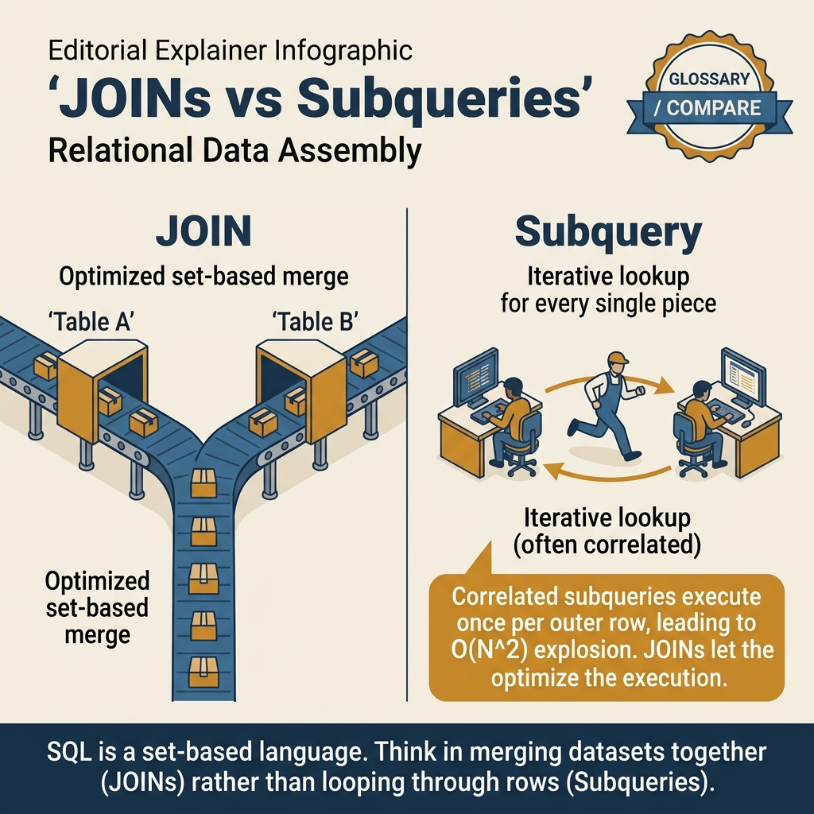
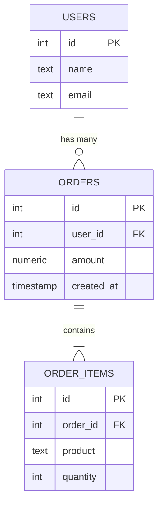

<!-- tags: sql, postgresql, database, advanced-sql -->
# 🔗 Joins & Subqueries — INNER, LEFT, LATERAL, CTE, EXISTS

> Mọi join types, CTE (WITH), LATERAL, EXISTS vs IN vs ANY — query composition

| Aspect           | Detail                                  |
| ---------------- | --------------------------------------- |
| **Concept**      | Combining data from multiple tables     |
| **Use case**     | Reports, relationships, complex queries |
| **Go relevance** | sqlx struct scanning, pgx row mapping   |
| **Performance**  | JOIN order, index usage, EXPLAIN        |

---

📅 Ngày tạo: 2026-03-20 · 🔄 Cập nhật: 2026-04-04 · ⏱️ 15 phút đọc

---

## 1. DEFINE

Report hàng tháng: `users JOIN orders`. 100K users, 2M orders. Report chính xác. Tháng sau, thêm `JOIN order_items` — report hiện số lượng orders gấp 3 lần thực tế. Không ai thay đổi data — chỉ thêm một JOIN. Nguyên nhân: **row multiplication** — mỗi order có 3 items, mỗi JOIN nhân row count.

Join không phải "kết hợp bảng" — Join là **phép nhân tập hợp có điều kiện**. Hiểu sai shape của kết quả = bug im lặng trong mọi report dependency.


| Variant | Mô tả |
| --- | --- |
| INNER JOIN | Chỉ matching rows · ❌ |
| LEFT JOIN | All left + matching right · ✅ Right nulls |
| RIGHT JOIN | All right + matching left · ✅ Left nulls |
| FULL OUTER JOIN | All rows from both · ✅ Both nulls |

| Approach | Time | Space | Khi chọn |
| --- | --- | --- | --- |
| All Join Types | Phụ thuộc cardinality | Phụ thuộc row width | Dùng để nắm baseline semantics trước khi tune planner hoặc index. |
| CTE, LATERAL, EXISTS | Phụ thuộc plan | Phụ thuộc memory operator | Dùng khi query đã chạm index, cardinality hoặc join strategy. |
| Recursive CTE (Tree Traversal) | Phụ thuộc workload | Phụ thuộc buffer/WAL | Dùng khi workload production cần cân bằng correctness, lock và rollout. |


### Join Types

| Join              | Mô tả                     | NULL rows?     |
| ----------------- | ------------------------- | -------------- |
| `INNER JOIN`      | Chỉ matching rows         | ❌             |
| `LEFT JOIN`       | All left + matching right | ✅ Right nulls |
| `RIGHT JOIN`      | All right + matching left | ✅ Left nulls  |
| `FULL OUTER JOIN` | All rows from both        | ✅ Both nulls  |
| `CROSS JOIN`      | Cartesian product (N×M)   | ❌             |
| `LATERAL JOIN`    | Subquery references outer | Depends        |
| `NATURAL JOIN`    | Auto-match column names   | ❌             |

### Subquery Types

| Type              | Mô tả                  | Returns              |
| ----------------- | ---------------------- | -------------------- |
| **Scalar**        | Single value           | 1 row, 1 column      |
| **Column**        | List of values         | N rows, 1 column     |
| **Table**         | Full table             | N rows, M columns    |
| **Correlated**    | References outer query | Row-dependent        |
| **CTE (WITH)**    | Named subquery         | Reusable block       |
| **Recursive CTE** | Self-referencing       | Tree/graph traversal |

### EXISTS vs IN vs ANY

| Operator     | Performance           | NULL handling                    | Best for              |
| ------------ | --------------------- | -------------------------------- | --------------------- |
| `EXISTS`     | ⚡ Short-circuits     | Handles NULLs                    | Large subquery result |
| `IN`         | 🐢 Materializes list  | `NULL IN (...)` = NULL           | Small known list      |
| `ANY/SOME`   | ⚡ Indexed            | Better with arrays               | Array comparison      |
| `NOT EXISTS` | ⚡ Best for anti-join | Correct with NULLs               | "Not in other table"  |
| `NOT IN`     | ⚠️ NULL trap!         | If subquery has NULL → all FALSE | Avoid!                |

---

Các failure mode trên nghe cơ bản. Nhưng có trap: correlated subquery = per-row execution = O(n²), và implicit cross join quên WHERE = cartesian explosion. Trap đó sẽ xuất hiện ở PITFALLS.

## 2. VISUAL

Với Joins & Subqueries — INNER, LEFT, LATERAL, CTE, EXISTS, bảng phân loại mới chỉ giúp bạn gọi đúng tên khái niệm. Điều quan trọng hơn là nhìn xem rows, giá trị hoặc ràng buộc thực sự đổi shape như thế nào khi query chạy qua từng bước.




*Hình: 4 join types — INNER (match both), LEFT (keep all left), CROSS (cartesian), LATERAL (correlated top-N). Chọn sai join = kết quả sai hoặc cartesian explosion.*

### Level 1

```
INNER JOIN          LEFT JOIN           FULL OUTER JOIN
 ┌───┬───┐          ┌───┬───┐           ┌───┬───┐
 │ A │ B │          │ A │ B │           │ A │ B │
 ├───┼───┤          ├───┼───┤           ├───┼───┤
 │ █ │ █ │          │ █ │ █ │           │ █ │   │
 │ █ │ █ │          │ █ │ █ │           │ █ │ █ │
 │   │   │          │ █ │   │           │ █ │ █ │
 └───┴───┘          └───┴───┘           │   │ █ │
                                        └───┴───┘
Only matching        All A +             All A + All B
                     matching B
```

---

*Hình: Level 1 cho 🔗 Joins & Subqueries — INNER, LEFT, LATERAL, CTE, EXISTS — nhìn vào happy path hoặc baseline heuristic trước khi đi sâu vào planner và trade-off.*

### Level 2

```text
Decision Lens                 Dấu hiệu cần nhìn                 Hướng xử lý
---------------------------  --------------------------------  -------------------------------------------
Semantics trước               Kết quả có đúng intent không?    1. All Join Types
Planner / index signal        Cardinality, cost, buffers ra sao? 2. CTE, LATERAL, EXISTS
Production pressure           Lock, WAL, lag, rollback nào đau? 3. Recursive CTE (Tree Traversal)
```

*Hình: Level 2 biến 🔗 Joins & Subqueries — INNER, LEFT, LATERAL, CTE, EXISTS thành checklist quyết định — từ semantics, sang plan signal, rồi đến áp lực production.*


### Architecture — Join Result Shape



*Hình: users (1) → orders (N) → order_items (N×M). JOIN users × orders × order_items = row multiplication. Nếu 1 user có 5 orders × 3 items mỗi order = 15 rows cho 1 user.*

---
## 3. CODE

Khi flow của Joins & Subqueries — INNER, LEFT, LATERAL, CTE, EXISTS đã rõ, ta chuyển nó thành DDL, truy vấn và transaction có thể chạy thật. Ta bắt đầu từ case hẹp nhất rồi tăng dần số lượng rows, ràng buộc và biến thể.

### Problem 1: Basic — All Join Types

> **Mục tiêu**: Minh họa cách áp dụng **🔗 Joins & Subqueries — INNER, LEFT, LATERAL, CTE, EXISTS** qua ví dụ `All Join Types` trong đúng ngữ cảnh schema, query hoặc vận hành.


```sql
-- ✅ Setup tables
CREATE TABLE departments (
    id serial PRIMARY KEY,
    name text NOT NULL
);

CREATE TABLE employees (
    id serial PRIMARY KEY,
    name text NOT NULL,
    department_id int REFERENCES departments(id),
    salary numeric(10,2)
);

INSERT INTO departments VALUES (1, 'Engineering'), (2, 'Marketing'), (3, 'Finance');
INSERT INTO employees VALUES
    (1, 'Alice', 1, 90000),
    (2, 'Bob', 1, 85000),
    (3, 'Charlie', 2, 70000),
    (4, 'Diana', NULL, 65000);   -- No department

-- ═══════════════════════════════════════════
-- INNER JOIN — only matching rows
-- ═══════════════════════════════════════════
SELECT e.name, d.name AS department, e.salary
FROM employees e
INNER JOIN departments d ON e.department_id = d.id;
-- Alice   | Engineering | 90000
-- Bob     | Engineering | 85000
-- Charlie | Marketing   | 70000
-- ❌ Diana NOT shown (no department)
-- ❌ Finance NOT shown (no employees)

-- ═══════════════════════════════════════════
-- LEFT JOIN — all employees, even without department
-- ═══════════════════════════════════════════
SELECT e.name, d.name AS department
FROM employees e
LEFT JOIN departments d ON e.department_id = d.id;
-- Alice   | Engineering
-- Bob     | Engineering
-- Charlie | Marketing
-- Diana   | NULL            ← ✅ included

-- ═══════════════════════════════════════════
-- RIGHT JOIN — all departments, even without employees
-- ═══════════════════════════════════════════
SELECT e.name, d.name AS department
FROM employees e
RIGHT JOIN departments d ON e.department_id = d.id;
-- Alice   | Engineering
-- Bob     | Engineering
-- Charlie | Marketing
-- NULL    | Finance          ← ✅ included

-- ═══════════════════════════════════════════
-- FULL OUTER JOIN — everything
-- ═══════════════════════════════════════════
SELECT e.name, d.name AS department
FROM employees e
FULL OUTER JOIN departments d ON e.department_id = d.id;
-- All employees + all departments

-- ═══════════════════════════════════════════
-- CROSS JOIN — cartesian product
-- ═══════════════════════════════════════════
SELECT e.name, d.name
FROM employees e
CROSS JOIN departments d;
-- 4 employees × 3 departments = 12 rows

-- ═══════════════════════════════════════════
-- Self JOIN — employee hierarchy
-- ═══════════════════════════════════════════
ALTER TABLE employees ADD COLUMN manager_id int REFERENCES employees(id);

SELECT
    e.name AS employee,
    m.name AS manager
FROM employees e
LEFT JOIN employees m ON e.manager_id = m.id;
```


JOIN basics đã cover. Nhưng subqueries cần correlated vs uncorrelated — hãy phân biệt.

### Problem 2: Intermediate — CTE, LATERAL, EXISTS

> **Mục tiêu**: Minh họa cách áp dụng **🔗 Joins & Subqueries — INNER, LEFT, LATERAL, CTE, EXISTS** qua ví dụ `CTE, LATERAL, EXISTS` trong đúng ngữ cảnh schema, query hoặc vận hành.


```sql
-- ═══════════════════════════════════════════
-- CTE (WITH) — named subqueries
-- ═══════════════════════════════════════════
WITH
    dept_stats AS (
        SELECT
            department_id,
            COUNT(*) AS emp_count,
            AVG(salary) AS avg_salary,
            MAX(salary) AS max_salary
        FROM employees
        GROUP BY department_id
    ),
    high_earners AS (
        SELECT id, name, salary, department_id
        FROM employees
        WHERE salary > (SELECT AVG(salary) FROM employees)
    )
SELECT
    d.name AS department,
    ds.emp_count,
    ds.avg_salary,
    ds.max_salary,
    COUNT(he.id) AS high_earner_count
FROM departments d
JOIN dept_stats ds ON d.id = ds.department_id
LEFT JOIN high_earners he ON he.department_id = d.id
GROUP BY d.name, ds.emp_count, ds.avg_salary, ds.max_salary;

-- ═══════════════════════════════════════════
-- LATERAL JOIN — subquery references outer row
-- ═══════════════════════════════════════════
-- ✅ Top 3 employees per department
SELECT d.name AS department, top3.*
FROM departments d
CROSS JOIN LATERAL (
    SELECT e.name, e.salary
    FROM employees e
    WHERE e.department_id = d.id
    ORDER BY e.salary DESC
    LIMIT 3
) AS top3;

-- ✅ LATERAL vs regular subquery
-- Regular subquery: cannot reference outer query columns
-- LATERAL subquery: CAN reference outer query columns (like a for-each)

-- ═══════════════════════════════════════════
-- EXISTS vs IN vs ANY
-- ═══════════════════════════════════════════

-- ✅ EXISTS — efficient, short-circuits
SELECT d.name
FROM departments d
WHERE EXISTS (
    SELECT 1 FROM employees e WHERE e.department_id = d.id
);
-- Departments that have at least 1 employee

-- ✅ NOT EXISTS — the SAFEST "not in" pattern
SELECT d.name
FROM departments d
WHERE NOT EXISTS (
    SELECT 1 FROM employees e WHERE e.department_id = d.id
);
-- Departments with NO employees (Finance)

-- ⚠️ NOT IN — DANGEROUS with NULLs!
-- If any department_id in employees is NULL:
SELECT d.name FROM departments d
WHERE d.id NOT IN (SELECT department_id FROM employees);
-- Returns NOTHING! Because NULL comparison = UNKNOWN
-- ✅ Fix: exclude NULLs
WHERE d.id NOT IN (SELECT department_id FROM employees WHERE department_id IS NOT NULL);

-- ✅ ANY/SOME — with arrays
SELECT * FROM employees
WHERE department_id = ANY(ARRAY[1, 2]);
-- Same as: WHERE department_id IN (1, 2) but works with array params

-- ✅ ANY with subquery
SELECT * FROM employees
WHERE salary > ALL(SELECT salary FROM employees WHERE department_id = 2);
-- Employees earning more than ALL marketing employees
```

**Tại sao?** Ở mức Intermediate của Joins & Subqueries — INNER, LEFT, LATERAL, CTE, EXISTS, bài khó không còn là viết cho chạy mà là giữ đúng invariant khi dữ liệu đổi shape. Problem 2: Intermediate — CTE, LATERAL, EXISTS buộc bạn nhìn xem cardinality, nullability hoặc grain của dữ liệu đang bẻ semantic đi theo hướng nào.


Subqueries đã cover. Nhưng anti-join patterns cần NOT EXISTS — hãy optimize.

### Problem 3: Advanced — Recursive CTE (Tree Traversal)

> **Mục tiêu**: Minh họa cách áp dụng **🔗 Joins & Subqueries — INNER, LEFT, LATERAL, CTE, EXISTS** qua ví dụ `Recursive CTE (Tree Traversal)` trong đúng ngữ cảnh schema, query hoặc vận hành.


```sql
-- ═══════════════════════════════════════════
-- Recursive CTE — organizational hierarchy
-- ═══════════════════════════════════════════
CREATE TABLE org (
    id    int PRIMARY KEY,
    name  text NOT NULL,
    parent_id int REFERENCES org(id)
);

INSERT INTO org VALUES
    (1, 'CEO', NULL),
    (2, 'CTO', 1),
    (3, 'VP Engineering', 2),
    (4, 'Tech Lead', 3),
    (5, 'Developer 1', 4),
    (6, 'Developer 2', 4),
    (7, 'CFO', 1),
    (8, 'Accountant', 7);

-- ✅ Get full org tree with depth
WITH RECURSIVE org_tree AS (
    -- ✅ Base case: root nodes (no parent)
    SELECT id, name, parent_id, 0 AS depth,
           name::text AS path
    FROM org
    WHERE parent_id IS NULL

    UNION ALL

    -- ✅ Recursive case: children
    SELECT o.id, o.name, o.parent_id, ot.depth + 1,
           ot.path || ' → ' || o.name
    FROM org o
    INNER JOIN org_tree ot ON o.parent_id = ot.id
)
SELECT
    repeat('  ', depth) || name AS hierarchy,
    depth,
    path
FROM org_tree
ORDER BY path;

-- Output:
-- CEO                         0  CEO
--   CTO                       1  CEO → CTO
--     VP Engineering           2  CEO → CTO → VP Engineering
--       Tech Lead              3  CEO → CTO → VP Engineering → Tech Lead
--         Developer 1          4  CEO → CTO → VP Engineering → Tech Lead → Developer 1
--         Developer 2          4  CEO → CTO → VP Engineering → Tech Lead → Developer 2
--   CFO                       1  CEO → CFO
--     Accountant              2  CEO → CFO → Accountant

-- ✅ Find all descendants of CTO
WITH RECURSIVE subtree AS (
    SELECT id, name FROM org WHERE name = 'CTO'
    UNION ALL
    SELECT o.id, o.name FROM org o
    JOIN subtree s ON o.parent_id = s.id
)
SELECT * FROM subtree;

-- ✅ Find path from any node to root
WITH RECURSIVE ancestors AS (
    SELECT id, name, parent_id FROM org WHERE name = 'Developer 1'
    UNION ALL
    SELECT o.id, o.name, o.parent_id FROM org o
    JOIN ancestors a ON o.id = a.parent_id
)
SELECT * FROM ancestors;
-- Developer 1 → Tech Lead → VP Engineering → CTO → CEO
```

**Tại sao?** Khi Joins & Subqueries — INNER, LEFT, LATERAL, CTE, EXISTS đi tới mức Advanced, chi phí không còn nằm riêng trong câu lệnh mà lan sang lock time, maintenance window và rollback path. Problem 3: Advanced — Recursive CTE (Tree Traversal) đáng giá vì nó cho thấy một lựa chọn đẹp trên giấy có thể rất đắt trên hệ thống đang chạy.


---
Bạn đã đi qua joins, subqueries, và anti-joins. Bây giờ đến phần nguy hiểm: O(n²) correlated query và cartesian explosion — trap đã được setup từ đầu bài.

## 4. PITFALLS

Joins & Subqueries — INNER, LEFT, LATERAL, CTE, EXISTS thường không thất bại ở chỗ cú pháp sai, mà ở chỗ semantics bị hiểu lệch hoặc bị kéo vào ngữ cảnh production lớn hơn. Phần dưới đây gom những lỗi dễ trả giá nhất.

| # | Severity | Lỗi | Hậu quả | Fix |
| --- | --- | --- | --- | --- |
| 1 | 🔵 Minor | NOT IN với NULL values | — | Dùng NOT EXISTS thay vì |
| 2 | 🔵 Minor | Cartesian product (missing JOIN condition) | — | Luôn kiểm tra ON clause |
| 3 | 🔵 Minor | Recursive CTE infinite loop | — | Thêm WHERE depth < 100 safety limit |
| 4 | 🔵 Minor | N+1 query problem | — | Use JOIN hoặc batch SELECT |
| 5 | 🔵 Minor | LEFT JOIN + WHERE on right table = INNER JOIN | — | Đặt condition trong ON, không WHERE |

---
Bạn đã đi qua Joins & Subqueries và cạm bẫy. Các resources dưới đây giúp đi sâu hơn.

## 5. REF

| Resource      | Link                                                                                                                                                                 |
| ------------- | -------------------------------------------------------------------------------------------------------------------------------------------------------------------- |
| Joins         | [postgresql.org/docs/current/queries-table-expressions.html](https://www.postgresql.org/docs/current/queries-table-expressions.html)                                 |
| WITH (CTE)    | [postgresql.org/docs/current/queries-with.html](https://www.postgresql.org/docs/current/queries-with.html)                                                           |
| LATERAL       | [postgresql.org/docs/current/queries-table-expressions.html#QUERIES-LATERAL](https://www.postgresql.org/docs/current/queries-table-expressions.html#QUERIES-LATERAL) |
| Neon Tutorial | [neon.com/postgresql/tutorial](https://neon.com/postgresql/tutorial)                                                                                                 |

---

## 6. RECOMMEND

Khi những bẫy chính của Joins & Subqueries — INNER, LEFT, LATERAL, CTE, EXISTS đã hiện ra, bước tiếp theo là nối nó sang planner, maintenance hoặc topology lớn hơn để mental model không dừng ở mức cú pháp.

| Mở rộng                       | Khi nào               | Lý do                         |
| ----------------------------- | --------------------- | ----------------------------- |
| **Materialized View**         | Cache complex queries | Pre-computed JOIN results     |
| **LATERAL + generate_series** | Time-series gaps      | Fill missing intervals        |
| **pg_graphql**                | GraphQL API           | Auto-generate from schema     |
| **ltree extension**           | Tree data             | Built-in hierarchy operations |


> **Callback** — Quay lại report gấp 3 lần thực tế: users × orders × order_items = row multiplication. Fix: aggregate IN subquery trước khi JOIN, hoặc dùng `COUNT(DISTINCT o.id)`. Hiểu shape trước khi JOIN = report chính xác từ lần đầu.

---

**Liên kết**: [← DML & Transactions](./03-dml-transactions.md) · [→ JSONB & Array](./05-jsonb-array.md)

---

## 7. QUICK REF

| Signal | Action |
| --- | --- |
| Report nhân row bất thường | Check JOIN cardinality → aggregate before JOIN |
| NULL trong NOT IN | Dùng NOT EXISTS thay NOT IN |
| Correlated subquery chậm | O(n²) per-row execution → rewrite as JOIN |
| Top-N per group | LATERAL JOIN + LIMIT |
