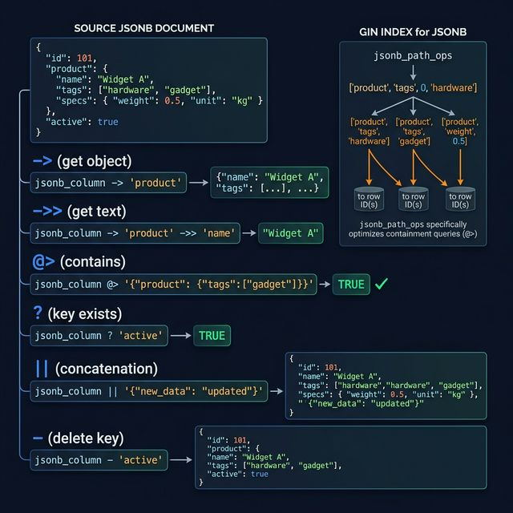
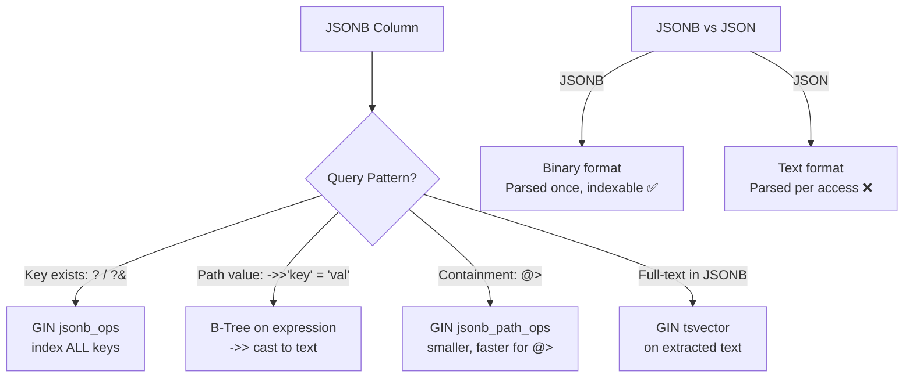

<!-- tags: sql, postgresql, database, json -->
# 🗂️ JSONB & Array — Deep Dive

> JSONB operators, path queries, aggregation, array operations — kỹ thuật chi tiết nhất

| Aspect           | Detail                                             |
| ---------------- | -------------------------------------------------- |
| **Concept**      | Semi-structured data trong relational DB           |
| **Use case**     | Dynamic attributes, API responses, EAV replacement |
| **Go relevance** | `json.RawMessage`, `pgtype.JSONB`                  |
| **Performance**  | GIN index, jsonb_path_ops                          |

---

📅 Ngày tạo: 2026-03-20 · 🔄 Cập nhật: 2026-04-04 · ⏱️ 15 phút đọc

---

## 1. DEFINE

Team quyết định lưu `metadata` dưới dạng JSONB vì "schema flexible, không cần migration". 6 tháng sau: 50M rows, mỗi row có JSONB 2-5KB. Query `WHERE metadata->>'region' = 'US'` chạy 12 giây — Seq Scan toàn bộ bảng vì không ai tạo GIN index cho JSONB. Thêm GIN index: query 15ms. Nhưng index chiếm 8GB disk và mỗi INSERT chậm 3x.

JSONB trong PostgreSQL mạnh hơn document database ở chỗ: **nó vẫn là relational** — có thể JOIN, index, constraint. Nhưng mạnh không có nghĩa là miễn phí. Bài này dạy bạn khi nào JSONB là lựa chọn đúng, khi nào nó là technical debt.


| Variant | Mô tả |
| --- | --- |
| Storage | Text (preserve whitespace) · Binary (parsed) |
| Duplicate keys | Allowed · Last value wins |
| Indexing | ❌ · ✅ GIN, GiST |
| Query operators | Basic · Full operator set |

| Approach | Time | Space | Khi chọn |
| --- | --- | --- | --- |
| JSONB CRUD Operations | Phụ thuộc cardinality | Phụ thuộc row width | Dùng để nắm baseline semantics trước khi tune planner hoặc index. |
| JSONB Functions & Aggregation | Phụ thuộc plan | Phụ thuộc memory operator | Dùng khi query đã chạm index, cardinality hoặc join strategy. |
| Array Deep Dive | Phụ thuộc workload | Phụ thuộc buffer/WAL | Dùng khi workload production cần cân bằng correctness, lock và rollout. |
| JSONB + Array Real — world Patterns | Phụ thuộc incident path | Phụ thuộc replication/cache | Dùng khi cần operational playbook, incident response hoặc phối hợp nhiều kỹ thuật. |
| JSONB JOINs & Cross — Table Queries | Phụ thuộc workload | Phụ thuộc buffer/WAL | Dùng khi workload production cần cân bằng correctness, lock và rollout. |
| Array Deep Operations | Phụ thuộc workload | Phụ thuộc buffer/WAL | Dùng khi workload production cần cân bằng correctness, lock và rollout. |


### JSON vs JSONB

| Feature            | `json`                     | `jsonb`             |
| ------------------ | -------------------------- | ------------------- |
| Storage            | Text (preserve whitespace) | Binary (parsed)     |
| Duplicate keys     | Allowed                    | Last value wins     |
| Indexing           | ❌                         | ✅ GIN, GiST        |
| Query operators    | Basic                      | Full operator set   |
| Insert speed       | ⚡ Faster (no parsing)     | 🐢 Slightly slower  |
| Query speed        | 🐢 Slower (parse on read)  | ⚡ Much faster      |
| **Recommendation** | Almost never               | ✅ Always use JSONB |

### JSONB Operators

| Operator | Mô tả                    | Ví dụ                              | Return |
| -------- | ------------------------- | ---------------------------------- | ------ |
| `->`     | Get element by key/index  | `data->'name'`                     | jsonb  |
| `->>`    | Get element as text       | `data->>'name'`                    | text   |
| `#>`     | Get path                  | `data#>'{a,b}'`                    | jsonb  |
| `#>>`    | Get path as text          | `data#>>'{a,b}'`                   | text   |
| `@>`     | Contains                  | `data @> '{"a":1}'`                | bool   |
| `<@`     | Contained by              | `'{"a":1}' <@ data`                | bool   |
| `?`      | Key exists                | `data ? 'name'`                    | bool   |
| <code>?&#124;</code> | Any key exists  | <code>data ?&#124; array['a','b']</code> | bool   |
| `?&`     | All keys exist            | `data ?& array['a','b']`           | bool   |
| <code>&#124;&#124;</code> | Concatenate JSONB | <code>data &#124;&#124; '{"c":3}'</code> | jsonb  |
| `-`      | Delete key                | `data - 'key'`                     | jsonb  |
| `#-`     | Delete path               | `data #- '{a,0}'`                  | jsonb  |
| `@?`     | JSON path exists          | `data @? '$.a'`                    | bool   |
| `@@`     | JSON path predicate       | `data @@ '$.price > 10'`           | bool   |

### Array Operators

| Operator           | Mô tả                | Ví dụ                              |
| ------------------ | --------------------- | ---------------------------------- |
| `@>`               | Contains              | `ARRAY[1,2] @> ARRAY[1]`          |
| `<@`               | Contained by          | `ARRAY[1] <@ ARRAY[1,2]`          |
| `&&`               | Overlap (any common)  | `ARRAY[1,2] && ARRAY[2,3]`        |
| <code>&#124;&#124;</code> | Concatenate    | <code>ARRAY[1] &#124;&#124; ARRAY[2]</code> |
| `ANY()`            | Element match         | `1 = ANY(arr)`                     |
| `ALL()`            | All elements match    | `1 < ALL(arr)`                     |
| `array_agg()`      | Aggregate to array    | `SELECT array_agg(name)`           |
| `unnest()`         | Expand array to rows  | `SELECT unnest(tags)`              |
| `array_length()`   | Array length          | `array_length(arr, 1)`             |
| `array_position()` | Find element index    | `array_position(arr, 'go')`        |
| `array_remove()`   | Remove element        | `array_remove(arr, 'go')`          |
| `array_cat()`      | Concatenate           | `array_cat(a, b)`                  |

---

Các failure mode trên nghe quen. Nhưng có trap: JSONB index GIN vs B-tree chọn sai = scan toàn bộ, và array unnest + join = memory explosion trên large arrays. Trap đó sẽ xuất hiện ở PITFALLS.

## 2. VISUAL

Với JSONB & Array — Deep Dive, bảng phân loại mới chỉ giúp bạn gọi đúng tên khái niệm. Điều quan trọng hơn là nhìn xem rows, giá trị hoặc ràng buộc thực sự đổi shape như thế nào khi query chạy qua từng bước.

### Level 1



```text
data = {
    "name": "Alice",          ← data->>'name'     = 'Alice'
    "age": 30,                ← data->>'age'       = '30' (text!)
    "address": {              ← data->'address'    = {"city":"HCM",...}
        "city": "HCM",       ← data->'address'->>'city' = 'HCM'
        "zip": "70000"       ← data#>>'{address,zip}'   = '70000'
    },
    "tags": ["go","pg"],      ← data->'tags'       = ["go","pg"]
                              ← data->'tags'->>0   = 'go'
    "scores": [               ← data->'scores'     = [{...},{...}]
        {"subject":"math", "score":95},
        {"subject":"cs", "score":100}
    ]
}
```

---

*Hình: Level 1 cho 🗂️ JSONB & Array — Deep Dive — nhìn vào happy path hoặc baseline heuristic trước khi đi sâu vào planner và trade-off.*

### Level 2

```text
Decision Lens                 Dấu hiệu cần nhìn                 Hướng xử lý
---------------------------  --------------------------------  -------------------------------------------
Semantics trước               Kết quả có đúng intent không?    1. JSONB CRUD Operations
Planner / index signal        Cardinality, cost, buffers ra sao? 2. JSONB Functions & Aggregation
Production pressure           Lock, WAL, lag, rollback nào đau? 3. Array Deep Dive
```

*Hình: Level 2 biến 🗂️ JSONB & Array — Deep Dive thành checklist quyết định — từ semantics, sang plan signal, rồi đến áp lực production.*


### Architecture — JSONB Storage & Index Strategy



*Hình: JSONB query pattern quyết định index strategy — `jsonb_ops` cho key existence, `jsonb_path_ops` cho containment, B-Tree expression cho specific key lookup.*

---
## 3. CODE

Khi flow của JSONB & Array — Deep Dive đã rõ, ta chuyển nó thành DDL, truy vấn và transaction có thể chạy thật. Ta bắt đầu từ case hẹp nhất rồi tăng dần số lượng rows, ràng buộc và biến thể.

### Problem 1: Basic — JSONB CRUD Operations

> **Mục tiêu**: Insert, query, update JSONB data
> **Cần**: PostgreSQL 15+
> **Đạt được**: Flexible schema within relational DB


```sql
CREATE TABLE products (
    id      bigint GENERATED ALWAYS AS IDENTITY PRIMARY KEY,
    name    text NOT NULL,
    attrs   jsonb NOT NULL DEFAULT '{}',
    tags    text[] DEFAULT '{}',
    created_at timestamptz DEFAULT now()
);

-- ═══════════════════════════════════════════
-- INSERT JSONB data
-- ═══════════════════════════════════════════
INSERT INTO products (name, attrs, tags) VALUES
('MacBook Pro 16"', '{
    "brand": "Apple",
    "price": 2499.99,
    "cpu": "M3 Pro",
    "ram": "18GB",
    "storage": "512GB",
    "color": "Space Black",
    "ports": ["USB-C", "HDMI", "MagSafe", "SD Card"],
    "specs": {
        "screen": {"size": 16.2, "resolution": "3456x2234", "type": "Liquid Retina XDR"},
        "battery": {"capacity": "100Wh", "hours": 22},
        "weight": 2.14
    },
    "ratings": [
        {"source": "verge", "score": 9.5},
        {"source": "mkbhd", "score": 9.0}
    ]
}', ARRAY['laptop', 'apple', 'premium', 'pro']),

('ThinkPad X1 Carbon', '{
    "brand": "Lenovo",
    "price": 1899.99,
    "cpu": "i7-1365U",
    "ram": "32GB",
    "storage": "1TB",
    "color": "Black",
    "ports": ["USB-C", "USB-A", "HDMI"],
    "specs": {
        "screen": {"size": 14, "resolution": "2880x1800", "type": "OLED"},
        "battery": {"capacity": "57Wh", "hours": 15},
        "weight": 1.12
    }
}', ARRAY['laptop', 'lenovo', 'business', 'ultrabook']);

-- ═══════════════════════════════════════════
-- QUERY JSONB — all operators
-- ═══════════════════════════════════════════

-- ✅ Access top-level key (as text)
SELECT name, attrs->>'brand' AS brand, attrs->>'price' AS price
FROM products;

-- ✅ Access nested path
SELECT name,
    attrs->'specs'->'screen'->>'size' AS screen_size,
    attrs->'specs'->'battery'->>'hours' AS battery_hours,
    attrs#>>'{specs,screen,resolution}' AS resolution    -- ✅ #>> path shortcut
FROM products;

-- ✅ Cast JSONB to numeric for comparison
SELECT name, (attrs->>'price')::numeric AS price
FROM products
WHERE (attrs->>'price')::numeric < 2000;

-- ✅ Containment query (@> uses GIN index!)
SELECT name FROM products
WHERE attrs @> '{"brand": "Apple"}';

SELECT name FROM products
WHERE attrs @> '{"ram": "32GB", "brand": "Lenovo"}';

-- ✅ Key existence
SELECT name FROM products WHERE attrs ? 'color';        -- Has 'color' key
SELECT name FROM products WHERE attrs ?| array['gpu', 'ram']; -- Has 'gpu' OR 'ram'
SELECT name FROM products WHERE attrs ?& array['cpu', 'ram']; -- Has 'cpu' AND 'ram'

-- ✅ Array within JSONB
SELECT name, jsonb_array_length(attrs->'ports') AS port_count
FROM products;

-- ✅ Access JSONB array elements
SELECT name, attrs->'ports'->>0 AS first_port
FROM products;

-- ✅ Check if JSONB array contains value
SELECT name FROM products
WHERE attrs->'ports' ? 'HDMI';

-- ═══════════════════════════════════════════
-- UPDATE JSONB — partial update (no full replace)
-- ═══════════════════════════════════════════

-- ✅ Set a single key
UPDATE products
SET attrs = jsonb_set(attrs, '{price}', '2299.99')
WHERE name LIKE 'MacBook%';

-- ✅ Set nested key
UPDATE products
SET attrs = jsonb_set(attrs, '{specs,battery,hours}', '24')
WHERE name LIKE 'MacBook%';

-- ✅ Add new key
UPDATE products
SET attrs = attrs || '{"warranty": "2 years"}'
WHERE name LIKE 'MacBook%';

-- ✅ Remove key
UPDATE products
SET attrs = attrs - 'color';

-- ✅ Remove nested key
UPDATE products
SET attrs = attrs #- '{specs,weight}';

-- ✅ Append to JSONB array
UPDATE products
SET attrs = jsonb_set(
    attrs,
    '{ports}',
    (attrs->'ports') || '"Thunderbolt 4"'
)
WHERE name LIKE 'MacBook%';

-- ✅ Conditional JSONB update
UPDATE products
SET attrs = CASE
    WHEN (attrs->>'price')::numeric > 2000
    THEN jsonb_set(attrs, '{tier}', '"premium"')
    ELSE jsonb_set(attrs, '{tier}', '"standard"')
END;
```


JSONB basics đã cover. Nhưng querying cần operators @> containment — hãy query.

### Problem 2: Intermediate — JSONB Functions & Aggregation

> **Mục tiêu**: jsonb_each, jsonb_object_agg, path queries, statistics từ JSONB
> **Cần**: JSON data
> **Đạt được**: Complex JSONB analytics


```sql
-- ═══════════════════════════════════════════
-- JSONB expansion functions
-- ═══════════════════════════════════════════

-- ✅ jsonb_each — expand object to rows (key/value)
SELECT p.name, kv.key, kv.value
FROM products p,
LATERAL jsonb_each(p.attrs) AS kv
WHERE kv.key IN ('brand', 'price', 'cpu');

-- ✅ jsonb_each_text — values as text
SELECT p.name, kv.key, kv.value
FROM products p,
LATERAL jsonb_each_text(p.attrs) AS kv;

-- ✅ jsonb_array_elements — expand JSON array to rows
SELECT p.name, port
FROM products p,
LATERAL jsonb_array_elements_text(p.attrs->'ports') AS port;

-- ✅ Ratings analysis (nested array of objects)
SELECT
    p.name,
    rating->>'source' AS source,
    (rating->>'score')::numeric AS score
FROM products p,
LATERAL jsonb_array_elements(p.attrs->'ratings') AS rating
WHERE p.attrs ? 'ratings';

-- ═══════════════════════════════════════════
-- JSONB aggregation
-- ═══════════════════════════════════════════

-- ✅ jsonb_object_agg — aggregate rows to JSONB object
SELECT jsonb_object_agg(name, attrs->>'price')
FROM products;
-- {"MacBook Pro 16\"": "2299.99", "ThinkPad X1 Carbon": "1899.99"}

-- ✅ jsonb_agg — aggregate rows to JSONB array
SELECT jsonb_agg(jsonb_build_object(
    'name', name,
    'brand', attrs->>'brand',
    'price', (attrs->>'price')::numeric
))
FROM products;
-- [{"name":"MacBook...", "brand":"Apple", "price":2299.99}, ...]

-- ✅ Build JSONB from columns
SELECT jsonb_build_object(
    'id', id,
    'name', name,
    'brand', attrs->>'brand',
    'price', (attrs->>'price')::numeric,
    'tag_count', array_length(tags, 1)
) AS product_json
FROM products;

-- ═══════════════════════════════════════════
-- JSON Path (PG 12+) — SQL/JSON standard
-- ═══════════════════════════════════════════

-- ✅ jsonb_path_query — extract values
SELECT jsonb_path_query(attrs, '$.specs.screen.size') AS screen_size
FROM products;

-- ✅ jsonb_path_query_array — extract as array
SELECT jsonb_path_query_array(attrs, '$.ports[*]') AS all_ports
FROM products;

-- ✅ jsonb_path_exists — check path existence
SELECT name FROM products
WHERE jsonb_path_exists(attrs, '$.specs.screen ? (@.size > 15)');
-- Products with screen > 15 inch

-- ✅ Complex path filter
SELECT name FROM products
WHERE jsonb_path_exists(
    attrs,
    '$.ratings[*] ? (@.score > $min_score)',
    '{"min_score": 9.0}'
);
-- Products with any rating > 9.0

-- ✅ jsonb_path_query_first — first match only
SELECT jsonb_path_query_first(attrs, '$.ratings[0].source') AS top_source
FROM products;

-- ✅ @@ operator — path predicate
SELECT name FROM products
WHERE attrs @@ '$.price > 2000';
```

**Tại sao?** Ở mức Intermediate của JSONB & Array — Deep Dive, bài khó không còn là viết cho chạy mà là giữ đúng invariant khi dữ liệu đổi shape. Problem 2: Intermediate — JSONB Functions & Aggregation buộc bạn nhìn xem cardinality, nullability hoặc grain của dữ liệu đang bẻ semantic đi theo hướng nào.


JSONB query đã cover. Nhưng array operations cần unnest — hãy transform.

### Problem 3: Advanced — Array Deep Dive

> **Mục tiêu**: PostgreSQL array operations chi tiết
> **Cần**: Array concepts
> **Đạt được**: Tag systems, multi-value fields, analytics


```sql
-- ═══════════════════════════════════════════
-- Array operations chi tiết
-- ═══════════════════════════════════════════

CREATE TABLE articles (
    id      bigint GENERATED ALWAYS AS IDENTITY PRIMARY KEY,
    title   text NOT NULL,
    tags    text[] DEFAULT '{}',
    scores  int[] DEFAULT '{}',
    metadata jsonb DEFAULT '{}'
);

INSERT INTO articles (title, tags, scores) VALUES
('Go Concurrency', ARRAY['go', 'concurrency', 'goroutines'], ARRAY[95, 88, 92]),
('PostgreSQL JSONB', ARRAY['postgresql', 'jsonb', 'database'], ARRAY[90, 85, 95]),
('Docker Production', ARRAY['docker', 'devops', 'go'], ARRAY[88, 92, 87]),
('K8s Patterns', ARRAY['kubernetes', 'devops', 'go', 'docker'], ARRAY[91, 89, 94]);

-- ✅ Containment — find articles with ALL given tags
SELECT title FROM articles WHERE tags @> ARRAY['go', 'docker'];
-- Docker Production, K8s Patterns (có cả 'go' VÀ 'docker')

-- ✅ Overlap — find articles with ANY given tag
SELECT title FROM articles WHERE tags && ARRAY['postgresql', 'kubernetes'];
-- PostgreSQL JSONB, K8s Patterns (có 'postgresql' HOẶC 'kubernetes')

-- ✅ Single element check
SELECT title FROM articles WHERE 'go' = ANY(tags);
-- Go Concurrency, Docker Production, K8s Patterns

-- ✅ NOT in array
SELECT title FROM articles WHERE NOT ('devops' = ANY(tags));
-- Go Concurrency, PostgreSQL JSONB

-- ✅ Array length
SELECT title, array_length(tags, 1) AS tag_count
FROM articles
ORDER BY array_length(tags, 1) DESC;

-- ✅ Array position (1-indexed)
SELECT title, array_position(tags, 'go') AS go_position
FROM articles
WHERE 'go' = ANY(tags);

-- ✅ Array slice
SELECT tags[1:2] FROM articles;   -- First 2 elements
SELECT tags[2] FROM articles;     -- 2nd element (1-indexed!)

-- ✅ Unnest — expand array to rows
SELECT a.title, tag
FROM articles a, LATERAL unnest(a.tags) AS tag;

-- ✅ Count tag frequency across all articles
SELECT tag, COUNT(*) as frequency
FROM articles, LATERAL unnest(tags) AS tag
GROUP BY tag
ORDER BY frequency DESC;
-- go: 3, devops: 2, docker: 2, ...

-- ✅ Array aggregation — collect values
SELECT array_agg(DISTINCT tag ORDER BY tag)
FROM articles, LATERAL unnest(tags) AS tag;
-- {concurrency,database,devops,docker,go,goroutines,...}

-- ✅ Array modification
UPDATE articles
SET tags = array_append(tags, 'featured')
WHERE id = 1;

UPDATE articles
SET tags = array_remove(tags, 'devops');

UPDATE articles
SET tags = array_cat(tags, ARRAY['trending', 'popular'])
WHERE id = 2;

-- ✅ Array statistics (using unnest)
SELECT
    a.title,
    (SELECT AVG(s) FROM unnest(a.scores) AS s) AS avg_score,
    (SELECT MAX(s) FROM unnest(a.scores) AS s) AS max_score,
    (SELECT MIN(s) FROM unnest(a.scores) AS s) AS min_score
FROM articles a;

-- ✅ Intersect arrays
SELECT title FROM articles
WHERE tags @> (
    SELECT array_agg(tag)
    FROM unnest(ARRAY['go', 'concurrency']) AS tag
    WHERE tag = ANY((SELECT tags FROM articles WHERE id = 1))
);

-- ═══════════════════════════════════════════
-- GIN Index cho Array + JSONB
-- ═══════════════════════════════════════════

CREATE INDEX idx_articles_tags ON articles USING gin(tags);        -- Array containment
CREATE INDEX idx_products_attrs ON products USING gin(attrs);      -- JSONB full
CREATE INDEX idx_products_attrs_path ON products USING gin(attrs jsonb_path_ops);
-- jsonb_path_ops: smaller index, faster @> queries (chỉ support @>)
```

**Tại sao?** Khi JSONB & Array — Deep Dive đi tới mức Advanced, chi phí không còn nằm riêng trong câu lệnh mà lan sang lock time, maintenance window và rollback path. Problem 3: Advanced — Array Deep Dive đáng giá vì nó cho thấy một lựa chọn đẹp trên giấy có thể rất đắt trên hệ thống đang chạy.


### Problem 4: Expert — JSONB + Array Real-world Patterns

> **Mục tiêu**: EAV replacement, dynamic forms, tagging system
> **Cần**: Complex data modeling
> **Đạt được**: Flexible schema cho dynamic content


```sql
-- ═══════════════════════════════════════════
-- Pattern 1: Dynamic Form Builder
-- ═══════════════════════════════════════════

CREATE TABLE form_submissions (
    id          bigint GENERATED ALWAYS AS IDENTITY PRIMARY KEY,
    form_id     text NOT NULL,
    data        jsonb NOT NULL,
    submitted_at timestamptz DEFAULT now()
);

-- ✅ Store dynamic form data
INSERT INTO form_submissions (form_id, data) VALUES
('contact_form', '{
    "name": "Alice",
    "email": "alice@go.dev",
    "message": "Hello from Go!",
    "priority": "high",
    "attachments": ["file1.pdf", "file2.png"]
}'),
('survey', '{
    "q1": "Very Satisfied",
    "q2": 5,
    "q3": ["speed", "reliability", "docs"],
    "comments": "Great product!"
}');

-- ✅ Query dynamic fields
SELECT
    id,
    data->>'name' AS name,
    data->>'email' AS email,
    data->>'priority' AS priority
FROM form_submissions
WHERE form_id = 'contact_form'
AND data->>'priority' = 'high';

-- ✅ Search across all JSON keys
SELECT id, data
FROM form_submissions
WHERE data::text ILIKE '%go%';

-- ✅ Generated column from JSONB (computed index)
ALTER TABLE form_submissions
ADD COLUMN email text GENERATED ALWAYS AS (data->>'email') STORED;

CREATE INDEX idx_submissions_email ON form_submissions(email);
-- Now: WHERE email = 'alice@go.dev' → uses B-tree index!

-- ═══════════════════════════════════════════
-- Pattern 2: Event Sourcing with JSONB
-- ═══════════════════════════════════════════

CREATE TABLE events (
    id          bigint GENERATED ALWAYS AS IDENTITY PRIMARY KEY,
    aggregate_id uuid NOT NULL,
    event_type  text NOT NULL,
    data        jsonb NOT NULL,
    metadata    jsonb DEFAULT '{}',
    version     int NOT NULL,
    created_at  timestamptz DEFAULT now(),

    CONSTRAINT events_unique_version UNIQUE (aggregate_id, version)
);

-- ✅ Store events
INSERT INTO events (aggregate_id, event_type, data, version) VALUES
('550e8400-e29b-41d4-a716-446655440000', 'OrderCreated',
 '{"user_id": 42, "items": [{"product_id": 1, "qty": 2}], "total": 59.98}', 1),
('550e8400-e29b-41d4-a716-446655440000', 'PaymentReceived',
 '{"amount": 59.98, "method": "credit_card", "transaction_id": "txn_123"}', 2),
('550e8400-e29b-41d4-a716-446655440000', 'OrderShipped',
 '{"tracking": "VN123456", "carrier": "GHN"}', 3);

-- ✅ Rebuild current state from events
SELECT
    aggregate_id,
    jsonb_object_agg(event_type, data) AS current_state,
    MAX(version) AS current_version,
    MIN(created_at) AS first_event,
    MAX(created_at) AS last_event
FROM events
WHERE aggregate_id = '550e8400-e29b-41d4-a716-446655440000'
GROUP BY aggregate_id;

-- ═══════════════════════════════════════════
-- Pattern 3: Audit Trail with jsonb_diff
-- ═══════════════════════════════════════════

-- ✅ Compare old vs new JSONB (custom diff function)
CREATE OR REPLACE FUNCTION jsonb_diff(old jsonb, new jsonb)
RETURNS jsonb AS $$
    SELECT jsonb_object_agg(key, value)
    FROM (
        SELECT key, new->key AS value
        FROM jsonb_each(new) t
        WHERE old->key IS DISTINCT FROM new->key
    ) sub
$$ LANGUAGE sql IMMUTABLE;

-- Usage: track changes
SELECT jsonb_diff(
    '{"name":"Alice", "age":30, "city":"HCM"}',
    '{"name":"Alice", "age":31, "city":"HN"}'
);
-- {"age": 31, "city": "HN"} ← only changed fields
```

```go
// ✅ Go — JSONB with pgx
func (r *Repo) CreateProduct(ctx context.Context, name string, attrs map[string]any, tags []string) (*Product, error) {
    attrsJSON, _ := json.Marshal(attrs)

    var p Product
    err := r.pool.QueryRow(ctx,
        `INSERT INTO products (name, attrs, tags)
         VALUES ($1, $2, $3)
         RETURNING id, name, attrs, tags`,
        name, attrsJSON, tags,
    ).Scan(&p.ID, &p.Name, &p.Attrs, &p.Tags)
    return &p, err
}

func (r *Repo) SearchByJSONB(ctx context.Context, filter map[string]any) ([]Product, error) {
    filterJSON, _ := json.Marshal(filter)
    rows, err := r.pool.Query(ctx,
        `SELECT id, name, attrs, tags FROM products WHERE attrs @> $1`,
        filterJSON,
    )
    // ...
}
```

**Tại sao?** Ở lớp Expert của JSONB & Array — Deep Dive, bạn phải giữ cùng lúc ba thứ: semantics đúng, planner không bị lạc hướng và rollout không làm production đau thêm. Problem 4: Expert — JSONB + Array Real-world Patterns tồn tại để luyện đúng khả năng phối hợp đó.


### Problem 5: Advanced — JSONB JOINs & Cross-Table Queries

> **Mục tiêu**: JOIN tables sử dụng JSONB, lateral joins, jsonb_to_recordset
> **Cần**: Relational + JSONB data
> **Đạt được**: Kết hợp sức mạnh relational JOINs với JSONB flexibility


```sql
-- ═══════════════════════════════════════════
-- Setup: Tables cho JSONB JOIN examples
-- ═══════════════════════════════════════════

CREATE TABLE orders (
    id          BIGSERIAL PRIMARY KEY,
    customer_id INT NOT NULL,
    items       JSONB NOT NULL,    -- ✅ Array of {product_id, qty, price}
    metadata    JSONB DEFAULT '{}',
    status      TEXT DEFAULT 'pending',
    created_at  TIMESTAMPTZ DEFAULT NOW()
);

CREATE TABLE customers (
    id         SERIAL PRIMARY KEY,
    name       TEXT NOT NULL,
    email      TEXT UNIQUE,
    preferences JSONB DEFAULT '{}'  -- ✅ JSONB preferences
);

CREATE TABLE inventory (
    id         SERIAL PRIMARY KEY,
    sku        TEXT UNIQUE NOT NULL,
    name       TEXT NOT NULL,
    category   TEXT,
    price      NUMERIC(10,2),
    stock      INT DEFAULT 0
);

-- ━━━ Sample data ━━━
INSERT INTO customers (id, name, email, preferences) VALUES
(1, 'Alice', 'alice@dev.io', '{"lang": "vi", "theme": "dark", "notifications": {"email": true, "sms": false}}'),
(2, 'Bob', 'bob@dev.io', '{"lang": "en", "theme": "light", "notifications": {"email": false, "sms": true}}'),
(3, 'Carol', 'carol@dev.io', '{"lang": "vi", "theme": "dark", "notifications": {"email": true, "sms": true}}');

INSERT INTO inventory (id, sku, name, category, price, stock) VALUES
(101, 'LAPTOP-001', 'MacBook Pro 16"', 'electronics', 2499.99, 10),
(102, 'PHONE-001', 'iPhone 15 Pro', 'electronics', 1199.99, 25),
(103, 'BOOK-001', 'System Design Interview', 'books', 39.99, 100),
(104, 'CABLE-001', 'USB-C Cable', 'accessories', 19.99, 500);

INSERT INTO orders (customer_id, items, metadata) VALUES
(1, '[
    {"product_id": 101, "qty": 1, "price": 2499.99},
    {"product_id": 103, "qty": 2, "price": 39.99}
]', '{"source": "web", "coupon": "SAVE10", "ip": "192.168.1.1"}'),
(2, '[
    {"product_id": 102, "qty": 1, "price": 1199.99},
    {"product_id": 104, "qty": 3, "price": 19.99}
]', '{"source": "mobile", "ip": "10.0.0.1"}'),
(1, '[
    {"product_id": 104, "qty": 5, "price": 19.99}
]', '{"source": "api", "bulk": true}');

-- ═══════════════════════════════════════════
-- Pattern 1: JOIN JSONB array → relational table
-- ═══════════════════════════════════════════

-- ✅ Expand JSONB array items → JOIN với inventory table
SELECT
    o.id AS order_id,
    c.name AS customer,
    inv.name AS product,
    inv.category,
    (item->>'qty')::INT AS qty,
    (item->>'price')::NUMERIC AS unit_price,
    (item->>'qty')::INT * (item->>'price')::NUMERIC AS line_total
FROM orders o
    JOIN customers c ON c.id = o.customer_id
    CROSS JOIN LATERAL jsonb_array_elements(o.items) AS item
    JOIN inventory inv ON inv.id = (item->>'product_id')::INT
ORDER BY o.id, inv.name;

-- ═══════════════════════════════════════════
-- Pattern 2: jsonb_to_recordset — JSONB → typed rows
-- ═══════════════════════════════════════════

-- ✅ Chuyển JSONB array thành typed recordset (không cần jsonb_array_elements)
SELECT
    o.id AS order_id,
    c.name AS customer,
    items_row.product_id,
    items_row.qty,
    items_row.price,
    inv.name AS product_name
FROM orders o
    JOIN customers c ON c.id = o.customer_id
    CROSS JOIN LATERAL jsonb_to_recordset(o.items) AS items_row(
        product_id INT,
        qty INT,
        price NUMERIC
    )
    JOIN inventory inv ON inv.id = items_row.product_id;

-- ═══════════════════════════════════════════
-- Pattern 3: Aggregate JSONB → relational summary
-- ═══════════════════════════════════════════

-- ✅ Tổng doanh thu per customer (từ JSONB items)
SELECT
    c.name,
    c.email,
    COUNT(DISTINCT o.id) AS total_orders,
    SUM((item->>'qty')::INT * (item->>'price')::NUMERIC) AS total_spent,
    ROUND(AVG((item->>'price')::NUMERIC), 2) AS avg_item_price
FROM orders o
    JOIN customers c ON c.id = o.customer_id
    CROSS JOIN LATERAL jsonb_array_elements(o.items) AS item
GROUP BY c.id, c.name, c.email
ORDER BY total_spent DESC;

-- ═══════════════════════════════════════════
-- Pattern 4: JOIN on JSONB keys (relational FK trong JSONB)
-- ═══════════════════════════════════════════

-- ✅ Tìm orders chứa product thuộc category 'electronics'
SELECT DISTINCT
    o.id AS order_id,
    c.name AS customer,
    o.metadata->>'source' AS order_source
FROM orders o
    JOIN customers c ON c.id = o.customer_id
    CROSS JOIN LATERAL jsonb_array_elements(o.items) AS item
    JOIN inventory inv ON inv.id = (item->>'product_id')::INT
WHERE inv.category = 'electronics';

-- ═══════════════════════════════════════════
-- Pattern 5: JSONB preferences filtering + JOIN
-- ═══════════════════════════════════════════

-- ✅ Tìm customers có preferences cụ thể VÀ đã mua hàng
SELECT
    c.name,
    c.preferences->>'lang' AS language,
    c.preferences->>'theme' AS theme,
    c.preferences->'notifications'->>'email' AS email_notif,
    COUNT(o.id) AS order_count
FROM customers c
    LEFT JOIN orders o ON o.customer_id = c.id
WHERE c.preferences @> '{"lang": "vi"}'    -- ✅ GIN-indexed filter
  AND c.preferences->'notifications' @> '{"email": true}'
GROUP BY c.id, c.name, c.preferences;

-- ═══════════════════════════════════════════
-- Pattern 6: Self-JOIN with JSONB — tìm customers có cùng preferences
-- ═══════════════════════════════════════════

-- ✅ Customers cùng theme
SELECT
    c1.name AS customer_1,
    c2.name AS customer_2,
    c1.preferences->>'theme' AS shared_theme
FROM customers c1
    JOIN customers c2 ON c1.id < c2.id  -- avoid duplicates
WHERE c1.preferences->>'theme' = c2.preferences->>'theme';

-- ═══════════════════════════════════════════
-- Pattern 7: Subquery with JSONB aggregation
-- ═══════════════════════════════════════════

-- ✅ Top sản phẩm bán chạy nhất (từ JSONB items across all orders)
SELECT
    inv.name AS product,
    inv.category,
    SUM((item->>'qty')::INT) AS total_qty_sold,
    SUM((item->>'qty')::INT * (item->>'price')::NUMERIC) AS total_revenue,
    inv.stock AS remaining_stock
FROM orders o
    CROSS JOIN LATERAL jsonb_array_elements(o.items) AS item
    JOIN inventory inv ON inv.id = (item->>'product_id')::INT
GROUP BY inv.id, inv.name, inv.category, inv.stock
ORDER BY total_qty_sold DESC;

-- ═══════════════════════════════════════════
-- Pattern 8: CTE + JSONB — complex analytics
-- ═══════════════════════════════════════════

-- ✅ Customer RFM from JSONB orders
WITH order_details AS (
    SELECT
        o.customer_id,
        o.created_at,
        SUM((item->>'qty')::INT * (item->>'price')::NUMERIC) AS order_total
    FROM orders o
        CROSS JOIN LATERAL jsonb_array_elements(o.items) AS item
    GROUP BY o.id, o.customer_id, o.created_at
),
rfm AS (
    SELECT
        customer_id,
        MAX(created_at)     AS last_order,
        COUNT(*)            AS frequency,
        SUM(order_total)    AS monetary
    FROM order_details
    GROUP BY customer_id
)
SELECT
    c.name,
    c.email,
    rfm.last_order,
    rfm.frequency,
    ROUND(rfm.monetary, 2) AS total_spent,
    CASE
        WHEN rfm.monetary > 2000 THEN 'VIP'
        WHEN rfm.monetary > 500  THEN 'Regular'
        ELSE 'New'
    END AS segment
FROM rfm
    JOIN customers c ON c.id = rfm.customer_id
ORDER BY total_spent DESC;
```

**Tại sao?** Khi JSONB & Array — Deep Dive đi tới mức Advanced, chi phí không còn nằm riêng trong câu lệnh mà lan sang lock time, maintenance window và rollback path. Problem 5: Advanced — JSONB JOINs & Cross-Table Queries đáng giá vì nó cho thấy một lựa chọn đẹp trên giấy có thể rất đắt trên hệ thống đang chạy.


### Problem 6: Advanced — Array Deep Operations

> **Mục tiêu**: Multi-dimensional arrays, set operations, array_agg nâng cao
> **Cần**: Complex array use cases
> **Đạt được**: Master-level array handling


```sql
-- ═══════════════════════════════════════════
-- Multi-dimensional arrays
-- ═══════════════════════════════════════════

-- ✅ 2D array (matrix)
SELECT ARRAY[[1,2,3],[4,5,6]] AS matrix;
-- {{1,2,3},{4,5,6}}

-- ✅ Access 2D array elements
SELECT (ARRAY[[1,2,3],[4,5,6]])[2][3];  -- → 6 (row 2, col 3)

-- ✅ Array dimensions
SELECT
    array_ndims(ARRAY[[1,2],[3,4]]) AS dims,      -- 2
    array_dims(ARRAY[[1,2],[3,4]]) AS dim_bounds;  -- [1:2][1:2]

-- ═══════════════════════════════════════════
-- Array set operations
-- ═══════════════════════════════════════════

CREATE TABLE user_skills (
    user_id   INT PRIMARY KEY,
    name      TEXT,
    skills    TEXT[] NOT NULL DEFAULT '{}'
);

INSERT INTO user_skills VALUES
(1, 'Alice', ARRAY['go', 'postgresql', 'docker', 'k8s']),
(2, 'Bob',   ARRAY['python', 'postgresql', 'docker', 'aws']),
(3, 'Carol', ARRAY['go', 'rust', 'k8s', 'terraform']);

-- ✅ Intersection: skills chung giữa 2 users
SELECT ARRAY(
    SELECT UNNEST(s1.skills)
    INTERSECT
    SELECT UNNEST(s2.skills)
) AS common_skills
FROM user_skills s1, user_skills s2
WHERE s1.user_id = 1 AND s2.user_id = 2;
-- {postgresql, docker}

-- ✅ Difference: skills Alice có mà Bob không có
SELECT ARRAY(
    SELECT UNNEST(s1.skills)
    EXCEPT
    SELECT UNNEST(s2.skills)
) AS unique_to_alice
FROM user_skills s1, user_skills s2
WHERE s1.user_id = 1 AND s2.user_id = 2;
-- {go, k8s}

-- ✅ Union: tất cả skills (unique)
SELECT ARRAY(
    SELECT DISTINCT UNNEST(skills) FROM user_skills
    ORDER BY 1
) AS all_skills;
-- {aws,docker,go,k8s,postgresql,python,rust,terraform}

-- ═══════════════════════════════════════════
-- array_agg nâng cao
-- ═══════════════════════════════════════════

-- ✅ Ordered aggregation
SELECT
    category,
    array_agg(name ORDER BY price DESC) AS products_by_price,
    array_agg(DISTINCT category) OVER() AS all_categories
FROM inventory
GROUP BY category;

-- ✅ Filtered aggregation
SELECT
    array_agg(name) FILTER (WHERE stock > 20) AS in_stock,
    array_agg(name) FILTER (WHERE stock <= 20) AS low_stock
FROM inventory;

-- ✅ Array comparison operators
SELECT name, skills FROM user_skills
WHERE skills @> ARRAY['go', 'k8s']     -- contains ALL
   OR skills && ARRAY['python', 'rust']; -- overlaps ANY

-- ✅ Array to string
SELECT
    name,
    array_to_string(skills, ', ') AS skills_csv,
    array_to_string(skills, ' | ', 'N/A') AS skills_pipe
FROM user_skills;

-- ✅ String to array
SELECT string_to_array('go,postgresql,docker', ',') AS skills;
-- {go,postgresql,docker}

-- ═══════════════════════════════════════════
-- Array + JSONB combined patterns
-- ═══════════════════════════════════════════

-- ✅ Convert JSONB array → PostgreSQL array
SELECT
    name,
    ARRAY(SELECT jsonb_array_elements_text(attrs->'ports')) AS ports_array
FROM products
WHERE attrs ? 'ports';

-- ✅ Convert PostgreSQL array → JSONB array
SELECT
    name,
    to_jsonb(skills) AS skills_jsonb
FROM user_skills;

-- ✅ Find users with overlapping skills (using array operators)
SELECT
    s1.name AS user1,
    s2.name AS user2,
    ARRAY(
        SELECT UNNEST(s1.skills)
        INTERSECT
        SELECT UNNEST(s2.skills)
    ) AS shared_skills,
    array_length(ARRAY(
        SELECT UNNEST(s1.skills)
        INTERSECT
        SELECT UNNEST(s2.skills)
    ), 1) AS match_count
FROM user_skills s1
    JOIN user_skills s2 ON s1.user_id < s2.user_id
WHERE s1.skills && s2.skills  -- ✅ at least 1 common skill
ORDER BY match_count DESC;
```

**Tại sao?** Khi JSONB & Array — Deep Dive đi tới mức Advanced, chi phí không còn nằm riêng trong câu lệnh mà lan sang lock time, maintenance window và rollback path. Problem 6: Advanced — Array Deep Operations đáng giá vì nó cho thấy một lựa chọn đẹp trên giấy có thể rất đắt trên hệ thống đang chạy.


---
Bạn đã đi qua JSONB, operators, và arrays. Bây giờ đến phần nguy hiểm: wrong index type và array explosion — trap đã được setup từ đầu bài.

## 4. PITFALLS

JSONB & Array — Deep Dive thường không thất bại ở chỗ cú pháp sai, mà ở chỗ semantics bị hiểu lệch hoặc bị kéo vào ngữ cảnh production lớn hơn. Phần dưới đây gom những lỗi dễ trả giá nhất.

| # | Severity | Lỗi | Hậu quả | Fix |
| --- | --- | --- | --- | --- |
| 1 | 🔵 Minor | > returns jsonb, ->> returns text | Type mismatch khi comparison | Dùng ->> + cast cho comparison |
| 2 | 🔵 Minor | JSONB not indexed by default | Full table scan trên JSONB queries | CREATE INDEX ... USING gin(attrs) |
| 3 | 🔵 Minor | jsonb_path_ops không support ? operator | Index không được sử dụng | Dùng default GIN nếu cần ? |
| 4 | 🔵 Minor | Array 1-indexed (not 0) | Off-by-one khi truy cập phần tử | tags[1] = first element |
| 5 | 🔵 Minor | NOT IN array trap | Kết quả sai khi array chứa NULL | Dùng NOT (x = ANY(arr)) |
| 6 | 🔵 Minor | JSONB update replaces entire value | Mất data khi concurrent update | jsonb_set() cho partial update |
| 7 | 🔵 Minor | Over-using JSONB → schema-less mess | Không enforce data integrity | JSONB cho dynamic fields, columns cho fixed fields |
| 8 | 🔵 Minor | LATERAL JOIN quên filter → cartesian product | Query chạy cực chậm | Luôn có WHERE/ON condition khi dùng LATERAL |
| 9 | 🔵 Minor | Cast JSONB number không qua text trước | Error: cannot cast jsonb to numeric | Dùng (col->>'key')::numeric (2 bước: jsonb→text→numeric) |
| 10 | 🔵 Minor | JSONB array contains check dùng @> sai cách | False positive với nested objects | Dùng ? 'value' cho JSONB arrays, @> cho containment |

---
Bạn đã đi qua JSONB & Array và cạm bẫy. Các resources dưới đây giúp đi sâu hơn.

## 5. REF

| Resource | Link |
| -------- | ---- |
| JSONB Functions | [postgresql.org/docs/current/functions-json.html](https://www.postgresql.org/docs/current/functions-json.html) |
| Array Functions | [postgresql.org/docs/current/functions-array.html](https://www.postgresql.org/docs/current/functions-array.html) |
| JSON Path | [postgresql.org/docs/current/functions-json.html#FUNCTIONS-SQLJSON-PATH](https://www.postgresql.org/docs/current/functions-json.html#FUNCTIONS-SQLJSON-PATH) |
| jsonb_to_recordset | [postgresql.org/docs/current/functions-json.html](https://www.postgresql.org/docs/current/functions-json.html#FUNCTIONS-JSON-PROCESSING-TABLE) |
| Set-Returning Functions | [postgresql.org/docs/current/functions-srf.html](https://www.postgresql.org/docs/current/functions-srf.html) |
| Neon PG Tutorial | [neon.com/postgresql/tutorial](https://neon.com/postgresql/tutorial) |

---

## 6. RECOMMEND

Khi những bẫy chính của JSONB & Array — Deep Dive đã hiện ra, bước tiếp theo là nối nó sang planner, maintenance hoặc topology lớn hơn để mental model không dừng ở mức cú pháp.

| Mở rộng | Khi nào | Lý do |
| ------- | ------- | ----- |
| **Generated columns** | Index JSONB fields | B-tree on extracted value |
| **jsonb_populate_record** | Map JSONB to struct | Type-safe extraction |
| **pg_jsonschema** | Schema validation | Validate JSONB structure |
| **TOAST compression** | Large JSONB values | LZ4/PGLZ auto-compression |
| **jsonb_to_recordset** | Complex JSONB → rows | Typed row expansion, no manual casting |
| **LATERAL JOIN** | Expand JSONB arrays in JOIN | Standard SQL pattern cho JSONB arrays |
| **GIN + expression index** | Frequently queried JSONB keys | `CREATE INDEX ON t USING btree((data->>'key'))` |
| **Document DB** | Full document store | Use Supabase/Neon with JSONB |


> **Callback** — Quay lại JSONB query 12 giây: Seq Scan trên 50M rows. GIN index (`jsonb_path_ops`) → 15ms nhưng 8GB disk + write overhead. Trade-off rõ ràng: JSONB flexible nhưng không miễn phí. Column thường xuyên query = nên tách thành dedicated column + index.

---

**Liên kết**: [← Joins & Subqueries](./04-joins-subqueries.md) · [→ String Functions](./06-string-functions.md)

---

## 7. QUICK REF

| Nếu gặp | Nghĩ ngay |
| --- | --- |
| JSONB CRUD Operations | Dùng pattern này khi gặp signal tương ứng trong query plan hoặc workload. |
| JSONB Functions & Aggregation | Dùng pattern này khi gặp signal tương ứng trong query plan hoặc workload. |
| Array Deep Dive | Dùng pattern này khi gặp signal tương ứng trong query plan hoặc workload. |
| JSONB + Array Real — world Patterns | Dùng pattern này khi gặp signal tương ứng trong query plan hoặc workload. |
