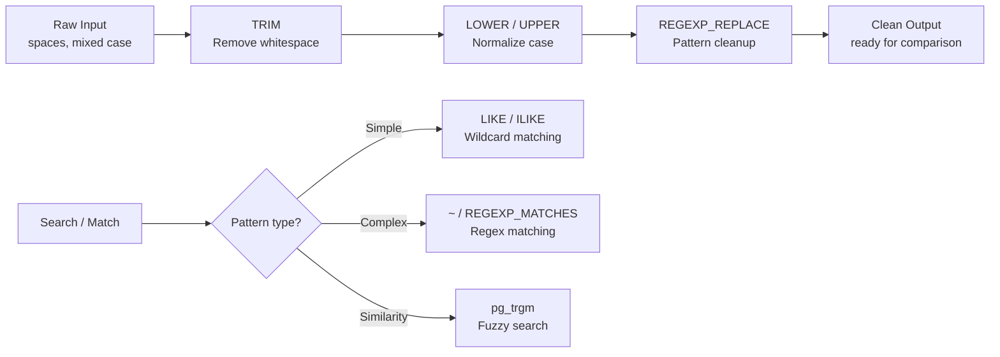

<!-- tags: sql, postgresql, database -->
# 📝 String Functions — Text Processing Chi Tiết

> Mọi string operations trong PostgreSQL: pattern matching, regex, formatting, full-text

| Aspect           | Detail                                |
| ---------------- | ------------------------------------- |
| **Concept**      | Text manipulation, search, formatting |
| **Use case**     | Data cleaning, search, reporting      |
| **Go relevance** | Template strings, query building      |
| **Performance**  | LIKE vs ILIKE vs regex vs FTS         |

---

📅 Ngày tạo: 2026-03-20 · 🔄 Cập nhật: 2026-04-04 · ⏱️ 15 phút đọc

---

## 1. DEFINE

ETL pipeline import CSV: tên khách hàng có leading/trailing spaces, phone number mix format `+84`, `084`, `84`. Query `WHERE phone = '0901234567'` miss 40% records vì data lưu dạng `+84901234567`. Team viết 15 application-level normalizers — mỗi service normalize khác nhau.

PostgreSQL có **50+ string functions** xử lý tại database layer — nơi data đi qua đúng một lần thay vì phải normalize ở 5 services khác nhau. TRIM, REGEXP_REPLACE, TRANSLATE giải quyết data quality trước khi nó kịp gây bug.


| Variant | Mô tả |
| --- | --- |
| length(s) | Số characters · length('Xin chào') · 8 |
| octet_length(s) | Số bytes · octet_length('Xin chào') · 10 |
| char_length(s) | Alias của length · char_length('abc') · 3 |
| upper(s) | Uppercase · upper('hello') · 'HELLO' |

| Approach | Time | Space | Khi chọn |
| --- | --- | --- | --- |
| String Manipulation | Phụ thuộc cardinality | Phụ thuộc row width | Dùng để nắm baseline semantics trước khi tune planner hoặc index. |
| Pattern Matching & Regex | Phụ thuộc plan | Phụ thuộc memory operator | Dùng khi query đã chạm index, cardinality hoặc join strategy. |
| Full — Text Search | Phụ thuộc workload | Phụ thuộc buffer/WAL | Dùng khi workload production cần cân bằng correctness, lock và rollout. |


### String Functions Overview

| Function                 | Mô tả                   | Ví dụ                           | Kết quả         |
| ------------------------ | ----------------------- | ------------------------------- | --------------- |
| `length(s)`              | Số characters           | `length('Xin chào')`            | `8`             |
| `octet_length(s)`        | Số bytes                | `octet_length('Xin chào')`      | `10`            |
| `char_length(s)`         | Alias của length        | `char_length('abc')`            | `3`             |
| `upper(s)`               | Uppercase               | `upper('hello')`                | `'HELLO'`       |
| `lower(s)`               | Lowercase               | `lower('HELLO')`                | `'hello'`       |
| `initcap(s)`             | Title Case              | `initcap('hello world')`        | `'Hello World'` |
| `trim(s)`                | Xoá whitespace          | `trim('  hi  ')`                | `'hi'`          |
| `ltrim(s)`               | Left trim               | `ltrim('  hi')`                 | `'hi'`          |
| `rtrim(s)`               | Right trim              | `rtrim('hi  ')`                 | `'hi'`          |
| `btrim(s, chars)`        | Trim specific chars     | `btrim('xxhixx', 'x')`          | `'hi'`          |
| `lpad(s, n, fill)`       | Left pad                | `lpad('42', 5, '0')`            | `'00042'`       |
| `rpad(s, n, fill)`       | Right pad               | `rpad('hi', 10, '.')`           | `'hi........'`  |
| `repeat(s, n)`           | Repeat string           | `repeat('ab', 3)`               | `'ababab'`      |
| `reverse(s)`             | Reverse                 | `reverse('hello')`              | `'olleh'`       |
| `replace(s, from, to)`   | Replace all             | `replace('abc', 'b', 'X')`      | `'aXc'`         |
| `translate(s, from, to)` | Char-by-char replace    | `translate('abc', 'ac', '13')`  | `'1b3'`         |
| `left(s, n)`             | First n chars           | `left('hello', 3)`              | `'hel'`         |
| `right(s, n)`            | Last n chars            | `right('hello', 3)`             | `'llo'`         |
| `substring(s, pos, len)` | Substring               | `substring('hello', 2, 3)`      | `'ell'`         |
| `position(sub IN s)`     | Find position           | `position('ll' IN 'hello')`     | `3`             |
| `strpos(s, sub)`         | Find position (alt)     | `strpos('hello', 'll')`         | `3`             |
| `split_part(s, d, n)`    | Split and get part      | `split_part('a.b.c', '.', 2)`   | `'b'`           |
| `string_to_array(s, d)`  | Split to array          | `string_to_array('a,b,c', ',')` | `{a,b,c}`       |
| `array_to_string(a, d)`  | Join array              | `array_to_string('{a,b}', ',')` | `'a,b'`         |
| `concat(a, b, ...)`      | Concatenate (NULL-safe) | `concat('a', NULL, 'b')`        | `'ab'`          |
| `concat_ws(sep, ...)`    | Concat with separator   | `concat_ws(',', 'a', 'b')`      | `'a,b'`         |
| `format(fmt, ...)`       | Printf-style            | `format('Hello %s', 'Go')`      | `'Hello Go'`    |
| `md5(s)`                 | MD5 hash                | `md5('password')`               | hash string     |
| `encode(bytes, fmt)`     | Encode bytes            | `encode('hi', 'base64')`        | `'aGk='`        |
| `starts_with(s, prefix)` | Starts with             | `starts_with('hello', 'he')`    | `true`          |

### Pattern Matching

| Method       | Syntax           | Case         | Index?              | Speed   |
| ------------ | ---------------- | ------------ | ------------------- | ------- |
| `LIKE`       | `%pattern%`      | Sensitive    | ✅ (prefix only)    | Fast    |
| `ILIKE`      | `%pattern%`      | Insensitive  | ✅ (with `pg_trgm`) | Medium  |
| `SIMILAR TO` | SQL regex        | Sensitive    | ❌                  | Slow    |
| `~`          | POSIX regex      | Sensitive    | ✅ (with `pg_trgm`) | Medium  |
| `~*`         | POSIX regex      | Insensitive  | ✅ (with `pg_trgm`) | Medium  |
| `@@`         | Full-text search | Configurable | ✅ (GIN)            | ⚡ Best |

---

Các failure mode trên nghe rõ. Nhưng có trap: LIKE với leading wildcard = full scan bỏ qua index, và collation mismatch = sort sai thứ tự. Trap đó sẽ xuất hiện ở PITFALLS.

## 2. VISUAL

Với String Functions — Text Processing Chi Tiết, bảng phân loại mới chỉ giúp bạn gọi đúng tên khái niệm. Điều quan trọng hơn là nhìn xem rows, giá trị hoặc ràng buộc thực sự đổi shape như thế nào khi query chạy qua từng bước.


*Hình: 4 họ string function — Search (LIKE/regex), Transform (UPPER/REPLACE), Extract (SUBSTRING/SPLIT_PART), Format (CONCAT/FORMAT). Mỗi họ giải quyết một nhóm bài toán khác nhau.*

### Level 1

> 📖 Xem 3. CODE bên dưới để xem ví dụ minh họa chi tiết.

*Hình: Level 1 cho 📝 String Functions — Text Processing Chi Tiết — nhìn vào happy path hoặc baseline heuristic trước khi đi sâu vào planner và trade-off.*

### Level 2

```text
Decision Lens                 Dấu hiệu cần nhìn                 Hướng xử lý
---------------------------  --------------------------------  -------------------------------------------
Semantics trước               Kết quả có đúng intent không?    1. String Manipulation
Planner / index signal        Cardinality, cost, buffers ra sao? 2. Pattern Matching & Regex
Production pressure           Lock, WAL, lag, rollback nào đau? 3. Full — Text Search
```

*Hình: Level 2 biến 📝 String Functions — Text Processing Chi Tiết thành checklist quyết định — từ semantics, sang plan signal, rồi đến áp lực production.*


### Architecture — String Processing Pipeline



*Hình: String processing pipeline — normalize (TRIM → LOWER → REGEXP_REPLACE) trước khi so sánh. Search strategy chọn theo pattern complexity: LIKE cho simple, regex cho complex, trigram cho fuzzy.*

---
## 3. CODE

Khi flow của String Functions — Text Processing Chi Tiết đã rõ, ta chuyển nó thành DDL, truy vấn và transaction có thể chạy thật. Ta bắt đầu từ case hẹp nhất rồi tăng dần số lượng rows, ràng buộc và biến thể.

### Problem 1: Basic — String Manipulation

> **Mục tiêu**: Minh họa cách áp dụng **📝 String Functions — Text Processing Chi Tiết** qua ví dụ `String Manipulation` trong đúng ngữ cảnh schema, query hoặc vận hành.


```sql
-- ═══════════════════════════════════════════
-- Text formatting & cleaning
-- ═══════════════════════════════════════════

-- ✅ Name formatting
SELECT
    initcap(trim(full_name)) AS formatted_name,                    -- 'alice nguyen' → 'Alice Nguyen'
    lower(trim(email)) AS clean_email,                              -- '  Alice@Go.Dev  ' → 'alice@go.dev'
    upper(left(first_name, 1)) || lower(substring(first_name, 2)) AS capitalized
FROM users;

-- ✅ String padding (invoice numbers)
SELECT
    'INV-' || lpad(id::text, 8, '0') AS invoice_number              -- INV-00000042
FROM orders;

-- ✅ Concatenation — NULL-safe
SELECT
    concat_ws(' ', first_name, middle_name, last_name) AS full_name, -- Skips NULLs
    concat(first_name, ' ', last_name) AS simple_name,               -- NULL if any part is NULL? No!
    first_name || ' ' || last_name AS pipe_concat                    -- ⚠️ NULL if any part is NULL!
FROM users;
-- ✅ concat / concat_ws: NULL → empty string (safe)
-- ❌ || operator: NULL → entire result is NULL

-- ✅ Format function (printf-style)
SELECT format('User %s (#%s) spent %s on %s',
    u.name,
    u.id,
    to_char(o.total, 'FM$999,999.00'),
    to_char(o.created_at, 'YYYY-MM-DD')
) AS description
FROM users u JOIN orders o ON u.id = o.user_id;

-- ═══════════════════════════════════════════
-- Splitting & extracting
-- ═══════════════════════════════════════════

-- ✅ Split email domain
SELECT
    email,
    split_part(email, '@', 1) AS username,      -- 'alice@go.dev' → 'alice'
    split_part(email, '@', 2) AS domain          -- 'alice@go.dev' → 'go.dev'
FROM users;

-- ✅ Parse CSV string
SELECT unnest(string_to_array('go,rust,python', ',')) AS language;
-- go
-- rust
-- python

-- ✅ Extract between delimiters
SELECT substring('Hello [World]' FROM '\[(.+)\]') AS extracted;
-- World

-- ✅ Substring positions
SELECT
    position('@' IN 'alice@go.dev') AS at_pos,        -- 6
    strpos('alice@go.dev', '.') AS dot_pos,             -- 10
    left('alice@go.dev', position('@' IN 'alice@go.dev') - 1) AS user_part;  -- alice
```


String basics đã cover. Nhưng regex cần pattern matching — hãy match.

### Problem 2: Intermediate — Pattern Matching & Regex

> **Mục tiêu**: Minh họa cách áp dụng **📝 String Functions — Text Processing Chi Tiết** qua ví dụ `Pattern Matching & Regex` trong đúng ngữ cảnh schema, query hoặc vận hành.


```sql
-- ═══════════════════════════════════════════
-- LIKE / ILIKE
-- ═══════════════════════════════════════════

-- ✅ LIKE: case-sensitive
SELECT * FROM users WHERE email LIKE '%@go.dev';
SELECT * FROM users WHERE name LIKE 'A%';           -- Starts with A
SELECT * FROM users WHERE name LIKE '%son';          -- Ends with son
SELECT * FROM users WHERE name LIKE '_o%';           -- 2nd char is 'o'

-- ✅ ILIKE: case-insensitive (PostgreSQL extension)
SELECT * FROM users WHERE email ILIKE '%@GO.DEV';   -- Works!

-- ✅ Escape special chars
SELECT * FROM products WHERE name LIKE '%50\%%';    -- Contains '50%'

-- ═══════════════════════════════════════════
-- POSIX Regex
-- ═══════════════════════════════════════════

-- ✅ ~ : regex match (case-sensitive)
SELECT * FROM users WHERE email ~ '^[a-z]+@.+\.dev$';

-- ✅ ~* : regex match (case-insensitive)
SELECT * FROM users WHERE name ~* '^(alice|bob)';

-- ✅ !~ : NOT match
SELECT * FROM users WHERE phone !~ '^\+84';

-- ✅ regexp_match — extract groups
SELECT
    email,
    (regexp_match(email, '^(.+)@(.+)$'))[1] AS username,
    (regexp_match(email, '^(.+)@(.+)$'))[2] AS domain
FROM users;

-- ✅ regexp_matches — all matches (g flag)
SELECT regexp_matches('Phone: +84-123-456, Fax: +84-789-012', '\+\d+-\d+-\d+', 'g');
-- {+84-123-456}
-- {+84-789-012}

-- ✅ regexp_replace — regex substitution
SELECT regexp_replace('Hello   World   Go', '\s+', ' ', 'g') AS cleaned;
-- 'Hello World Go'

-- ✅ Phone number formatting
SELECT regexp_replace('0912345678', '(\d{4})(\d{3})(\d{3})', '\1-\2-\3');
-- '0912-345-678'

-- ✅ regexp_split_to_table — split by regex
SELECT regexp_split_to_table('one::two:::three', ':+') AS part;
-- one, two, three

-- ✅ regexp_split_to_array
SELECT regexp_split_to_array('2024-01-15', '-') AS parts;
-- {2024,01,15}

-- ═══════════════════════════════════════════
-- Data validation with regex
-- ═══════════════════════════════════════════

-- ✅ Email validation
ALTER TABLE users ADD CONSTRAINT valid_email
    CHECK (email ~* '^[A-Za-z0-9._%+-]+@[A-Za-z0-9.-]+\.[A-Za-z]{2,}$');

-- ✅ Vietnamese phone validation
ALTER TABLE users ADD CONSTRAINT valid_phone
    CHECK (phone ~ '^\+?84[0-9]{9,10}$' OR phone ~ '^0[0-9]{9,10}$');

-- ✅ Slug validation
ALTER TABLE articles ADD CONSTRAINT valid_slug
    CHECK (slug ~ '^[a-z0-9]+(-[a-z0-9]+)*$');
```

**Tại sao?** Ở mức Intermediate của String Functions — Text Processing Chi Tiết, bài khó không còn là viết cho chạy mà là giữ đúng invariant khi dữ liệu đổi shape. Problem 2: Intermediate — Pattern Matching & Regex buộc bạn nhìn xem cardinality, nullability hoặc grain của dữ liệu đang bẻ semantic đi theo hướng nào.


Regex đã cover. Nhưng full-text search cần tsvector — hãy search.

### Problem 3: Advanced — Full-Text Search

> **Mục tiêu**: Minh họa cách áp dụng **📝 String Functions — Text Processing Chi Tiết** qua ví dụ `Full-Text Search` trong đúng ngữ cảnh schema, query hoặc vận hành.


```sql
-- ═══════════════════════════════════════════
-- Full-Text Search (FTS) — production-grade
-- ═══════════════════════════════════════════

-- ✅ Basic FTS
SELECT * FROM articles
WHERE to_tsvector('english', title || ' ' || body)
   @@ to_tsquery('english', 'golang & concurrency');

-- ✅ Phraseto_tsquery — exact phrase
SELECT * FROM articles
WHERE to_tsvector('english', body)
   @@ phraseto_tsquery('english', 'worker pool pattern');

-- ✅ Websearch — Google-like syntax
SELECT * FROM articles
WHERE to_tsvector('english', body)
   @@ websearch_to_tsquery('english', '"error handling" go -java');
-- Includes "error handling", must be about Go, NOT Java

-- ✅ Rank results
SELECT
    title,
    ts_rank(
        to_tsvector('english', title || ' ' || body),
        websearch_to_tsquery('english', 'docker performance')
    ) AS rank
FROM articles
ORDER BY rank DESC
LIMIT 20;

-- ✅ Highlight matches
SELECT
    title,
    ts_headline(
        'english',
        body,
        websearch_to_tsquery('english', 'go concurrency'),
        'StartSel=<mark>, StopSel=</mark>, MaxFragments=3, FragmentDelimiter=...'
    ) AS snippet
FROM articles
WHERE to_tsvector('english', body)
   @@ websearch_to_tsquery('english', 'go concurrency')
ORDER BY ts_rank(to_tsvector('english', body), websearch_to_tsquery('english', 'go concurrency')) DESC;

-- ✅ GIN index for FTS (MUST HAVE for performance)
ALTER TABLE articles ADD COLUMN search_vector tsvector
    GENERATED ALWAYS AS (
        setweight(to_tsvector('english', coalesce(title, '')), 'A') ||
        setweight(to_tsvector('english', coalesce(body, '')), 'B')
    ) STORED;

CREATE INDEX idx_articles_search ON articles USING gin(search_vector);

-- ✅ Query using pre-computed column
SELECT title
FROM articles
WHERE search_vector @@ websearch_to_tsquery('english', 'kubernetes deployment')
ORDER BY ts_rank(search_vector, websearch_to_tsquery('english', 'kubernetes deployment')) DESC;

-- ✅ Trigram similarity (fuzzy search) — pg_trgm extension
CREATE EXTENSION IF NOT EXISTS pg_trgm;

-- Fuzzy match
SELECT name, similarity(name, 'posgresql') AS sim
FROM products
WHERE similarity(name, 'posgresql') > 0.3
ORDER BY sim DESC;
-- Finds "PostgreSQL" even with typo!

-- Trigram GIN index
CREATE INDEX idx_users_name_trgm ON users USING gin(name gin_trgm_ops);
SELECT * FROM users WHERE name ILIKE '%alice%';   -- ✅ Uses trigram index!
```

**Tại sao?** Khi String Functions — Text Processing Chi Tiết đi tới mức Advanced, chi phí không còn nằm riêng trong câu lệnh mà lan sang lock time, maintenance window và rollback path. Problem 3: Advanced — Full-Text Search đáng giá vì nó cho thấy một lựa chọn đẹp trên giấy có thể rất đắt trên hệ thống đang chạy.


---
Bạn đã đi qua string functions, regex, và full-text search. Bây giờ đến phần nguy hiểm: leading wildcard trap và collation mismatch — trap đã được setup từ đầu bài.

## 4. PITFALLS

String Functions — Text Processing Chi Tiết thường không thất bại ở chỗ cú pháp sai, mà ở chỗ semantics bị hiểu lệch hoặc bị kéo vào ngữ cảnh production lớn hơn. Phần dưới đây gom những lỗi dễ trả giá nhất.

| # | Severity | Lỗi | Hậu quả | Fix |
| --- | --- | --- | --- | --- |
| 1 | 🔵 Minor | `\ | \ | ` concat with NULL → NULL |
| 2 | 🔵 Minor | LIKE %prefix → full table scan | — | Reverse index hoặc GIN trigram |
| 3 | 🟡 Common | ILIKE slow trên large tables | — | pg_trgm GIN index |
| 4 | 🟡 Common | Regex trong WHERE → slow | — | Pre-compute + index where possible |
| 5 | 🟡 Common | FTS without GIN index → seq scan | — | Luôn tạo GIN index cho tsvector |
| 6 | 🔵 Minor | length() returns chars, not bytes | — | Dùng octet_length() cho bytes |
| 7 | 🔵 Minor | Mixed encoding issues | — | Ensure database is UTF-8 |

---
Bạn đã đi qua String Functions và cạm bẫy. Các resources dưới đây giúp đi sâu hơn.

## 5. REF

| Resource         | Link                                                                                                                   |
| ---------------- | ---------------------------------------------------------------------------------------------------------------------- |
| String Functions | [postgresql.org/docs/current/functions-string.html](https://www.postgresql.org/docs/current/functions-string.html)     |
| Pattern Matching | [postgresql.org/docs/current/functions-matching.html](https://www.postgresql.org/docs/current/functions-matching.html) |
| Full-Text Search | [postgresql.org/docs/current/textsearch.html](https://www.postgresql.org/docs/current/textsearch.html)                 |
| pg_trgm          | [postgresql.org/docs/current/pgtrgm.html](https://www.postgresql.org/docs/current/pgtrgm.html)                         |

---

## 6. RECOMMEND

Khi những bẫy chính của String Functions — Text Processing Chi Tiết đã hiện ra, bước tiếp theo là nối nó sang planner, maintenance hoặc topology lớn hơn để mental model không dừng ở mức cú pháp.

| Mở rộng      | Khi nào                    | Lý do                         |
| ------------ | -------------------------- | ----------------------------- |
| **pg_trgm**  | Fuzzy/typo-tolerant search | Similarity matching           |
| **unaccent** | Vietnamese/accented text   | Remove diacritics             |
| **citext**   | Case-insensitive columns   | citext type = auto ILIKE      |
| **pgroonga** | CJK full-text search       | Better Asian language support |


> **Callback** — Quay lại 40% records bị miss vì phone format mismatch: `REGEXP_REPLACE(phone, '[^0-9]', '', 'g')` chuẩn hóa tại database layer — mọi service cùng query, cùng format, zero divergence.

---

**Liên kết**: [← JSONB & Array](./05-jsonb-array.md) · [→ Math & Date Functions](./07-math-date-functions.md)

---

## 7. QUICK REF

| Nếu gặp | Nghĩ ngay |
| --- | --- |
| String Manipulation | Dùng pattern này khi gặp signal tương ứng trong query plan hoặc workload. |
| Pattern Matching & Regex | Dùng pattern này khi gặp signal tương ứng trong query plan hoặc workload. |
| Full — Text Search | Dùng pattern này khi gặp signal tương ứng trong query plan hoặc workload. |
