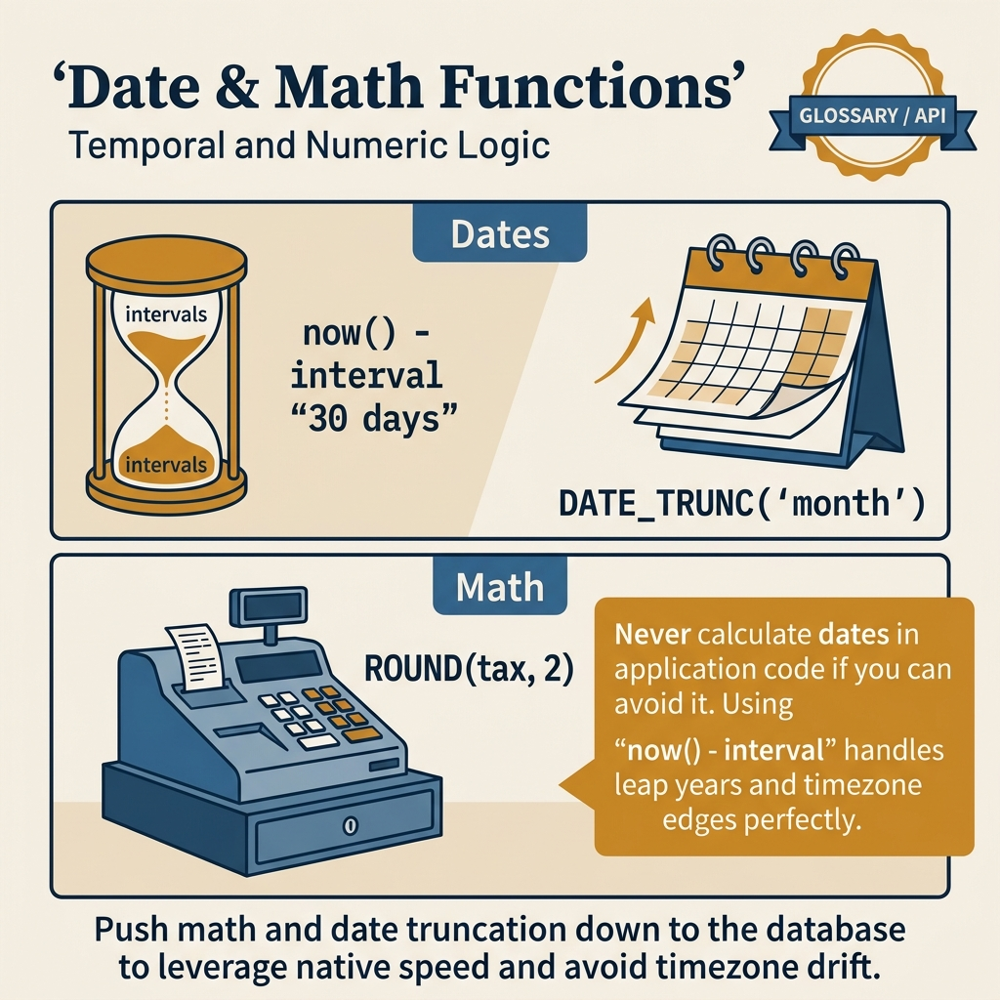
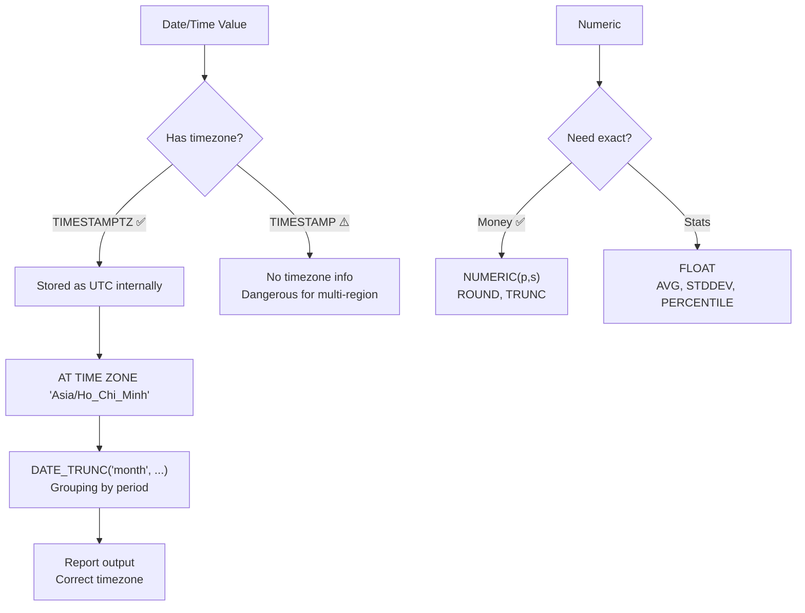

<!-- tags: sql, postgresql, database -->
# 🔢 Math & Date Functions — Numeric, Temporal, Aggregation

> Hàm toán học, date/time, interval, generate_series — xử lý số & thời gian

| Aspect           | Detail                                          |
| ---------------- | ----------------------------------------------- |
| **Concept**      | Numeric operations, date arithmetic, time zones |
| **Use case**     | Reports, analytics, scheduling, billing         |
| **Go relevance** | `time.Time`, `pgtype.Timestamptz`               |

---

📅 Ngày tạo: 2026-03-19 · 🔄 Cập nhật: 2026-04-04 · ⏱️ 12 phút đọc

---

## 1. DEFINE

Report doanh thu theo tháng: `SUM(amount) GROUP BY DATE_TRUNC('month', created_at)`. Tháng 3 thiếu $127K so với hệ thống billing. Debug 2 ngày — phát hiện: server timezone UTC, billing system timezone `Asia/Ho_Chi_Minh`. 3 giờ đầu ngày 1/4 (00:00-02:59 UTC = 07:00-09:59 VN) bị tính vào tháng 4. Fix: `AT TIME ZONE 'Asia/Ho_Chi_Minh'` trước khi GROUP BY.

Math và Date functions không phải utility — chúng là **business logic tại data layer**. Sai timezone = sai report. Sai rounding = sai tiền. Sai interval = sai retention policy.


| Variant | Mô tả |
| --- | --- |
| abs(x) | Giá trị tuyệt đối · abs(-5) · 5 |
| ceil(x) / ceiling(x) | Làm tròn lên · ceil(4.2) · 5 |
| floor(x) | Làm tròn xuống · floor(4.9) · 4 |
| round(x, n) | Làm tròn n chữ số · round(3.1415, 2) · 3.14 |

| Approach | Time | Space | Khi chọn |
| --- | --- | --- | --- |
| Math & Aggregation | Phụ thuộc cardinality | Phụ thuộc row width | Dùng để nắm baseline semantics trước khi tune planner hoặc index. |
| Date/Time Operations | Phụ thuộc plan | Phụ thuộc memory operator | Dùng khi query đã chạm index, cardinality hoặc join strategy. |
| generate_series & Time — series Gaps | Phụ thuộc workload | Phụ thuộc buffer/WAL | Dùng khi workload production cần cân bằng correctness, lock và rollout. |


### Math Functions

| Function                     | Mô tả             | Ví dụ                          | Kết quả    |
| ---------------------------- | ----------------- | ------------------------------ | ---------- |
| `abs(x)`                     | Giá trị tuyệt đối | `abs(-5)`                      | `5`        |
| `ceil(x)` / `ceiling(x)`     | Làm tròn lên      | `ceil(4.2)`                    | `5`        |
| `floor(x)`                   | Làm tròn xuống    | `floor(4.9)`                   | `4`        |
| `round(x, n)`                | Làm tròn n chữ số | `round(3.1415, 2)`             | `3.14`     |
| `trunc(x, n)`                | Cắt bỏ n chữ số   | `trunc(3.1415, 2)`             | `3.14`     |
| `mod(x, y)`                  | Modulo            | `mod(10, 3)`                   | `1`        |
| `power(x, y)`                | Luỹ thừa          | `power(2, 10)`                 | `1024`     |
| `sqrt(x)`                    | Căn bậc hai       | `sqrt(144)`                    | `12`       |
| `log(x)`                     | Log base 10       | `log(1000)`                    | `3`        |
| `ln(x)`                      | Natural log       | `ln(2.718)`                    | `~1`       |
| `exp(x)`                     | e^x               | `exp(1)`                       | `2.718...` |
| `sign(x)`                    | Sign (-1, 0, 1)   | `sign(-5)`                     | `-1`       |
| `random()`                   | Random [0, 1)     | `random()`                     | `0.73...`  |
| `greatest(a,b,...)`          | Max of values     | `greatest(1,5,3)`              | `5`        |
| `least(a,b,...)`             | Min of values     | `least(1,5,3)`                 | `1`        |
| `width_bucket(x, lo, hi, n)` | Histogram bucket  | `width_bucket(75, 0, 100, 10)` | `8`        |

### Aggregate Functions

| Function                                           | Mô tả                       |
| -------------------------------------------------- | --------------------------- |
| `count(*)`                                         | Đếm rows                    |
| `count(DISTINCT col)`                              | Đếm unique values           |
| `sum(col)`                                         | Tổng                        |
| `avg(col)`                                         | Trung bình                  |
| `min(col)` / `max(col)`                            | Min/Max                     |
| `stddev(col)`                                      | Standard deviation          |
| `variance(col)`                                    | Variance                    |
| `percentile_cont(0.5) WITHIN GROUP (ORDER BY col)` | Median                      |
| `mode() WITHIN GROUP (ORDER BY col)`               | Mode                        |
| `string_agg(col, ',')`                             | Nối strings                 |
| `array_agg(col)`                                   | Aggregate thành array       |
| `jsonb_agg(col)`                                   | Aggregate thành JSONB array |
| `bool_and(col)` / `bool_or(col)`                   | Logical AND/OR              |

### Date/Time Types

| Type          | Mô tả                  | Ví dụ                      |
| ------------- | ---------------------- | -------------------------- |
| `date`        | Date only              | `'2024-01-15'`             |
| `time`        | Time only              | `'14:30:00'`               |
| `timestamp`   | Date + time (no TZ)    | `'2024-01-15 14:30:00'`    |
| `timestamptz` | Date + time + timezone | `'2024-01-15 14:30:00+07'` |
| `interval`    | Duration               | `'2 hours 30 minutes'`     |

### Date Functions

| Function                            | Mô tả                     | Ví dụ                                      |
| ----------------------------------- | ------------------------- | ------------------------------------------ |
| `now()`                             | Current timestamp with TZ | `2024-01-15 14:30:00+07`                   |
| `current_date`                      | Today                     | `2024-01-15`                               |
| `current_time`                      | Now (time only)           | `14:30:00+07`                              |
| `date_trunc(field, ts)`             | Truncate                  | `date_trunc('month', now())`               |
| `extract(field FROM ts)`            | Extract part              | `extract(year FROM now())`                 |
| `age(ts1, ts2)`                     | Interval between          | `age(now(), '2020-01-01')`                 |
| `date_part(field, ts)`              | Extract (float)           | `date_part('hour', now())`                 |
| `to_char(ts, fmt)`                  | Format as string          | `to_char(now(), 'YYYY-MM-DD')`             |
| `to_date(s, fmt)`                   | Parse string → date       | `to_date('15/01/2024', 'DD/MM/YYYY')`      |
| `to_timestamp(s, fmt)`              | Parse → timestamp         | `to_timestamp('2024-01-15', 'YYYY-MM-DD')` |
| `make_date(y,m,d)`                  | Construct date            | `make_date(2024, 1, 15)`                   |
| `make_interval(...)`                | Construct interval        | `make_interval(hours => 2)`                |
| `generate_series(start, end, step)` | Time series               | See examples                               |

---

Các failure mode trên nghe dễ tránh. Nhưng có trap: EXTRACT vs date_trunc confusion = aggregate sai, và timezone-naive arithmetic = date shift ở DST boundary. Trap đó sẽ xuất hiện ở PITFALLS.

## 2. VISUAL

Với Math & Date Functions — Numeric, Temporal, Aggregation, bảng phân loại mới chỉ giúp bạn gọi đúng tên khái niệm. Điều quan trọng hơn là nhìn xem rows, giá trị hoặc ràng buộc thực sự đổi shape như thế nào khi query chạy qua từng bước.




*Hình: 4 cluster — Math Basics (ROUND/ABS), Aggregation (SUM/AVG/PERCENTILE), Date Extract (DATE_TRUNC/AGE), Date Arithmetic (interval/generate_series). DATE_TRUNC là key cho time-series grouping.*

### Level 1

> 📖 Xem 3. CODE bên dưới để xem ví dụ minh họa chi tiết.

*Hình: Level 1 cho 🔢 Math & Date Functions — Numeric, Temporal, Aggregation — nhìn vào happy path hoặc baseline heuristic trước khi đi sâu vào planner và trade-off.*

### Level 2

```text
Decision Lens                 Dấu hiệu cần nhìn                 Hướng xử lý
---------------------------  --------------------------------  -------------------------------------------
Semantics trước               Kết quả có đúng intent không?    1. Math & Aggregation
Planner / index signal        Cardinality, cost, buffers ra sao? 2. Date/Time Operations
Production pressure           Lock, WAL, lag, rollback nào đau? 3. generate_series & Time — series Gaps
```

*Hình: Level 2 biến 🔢 Math & Date Functions — Numeric, Temporal, Aggregation thành checklist quyết định — từ semantics, sang plan signal, rồi đến áp lực production.*


### Architecture — Date/Time Processing Flow



*Hình: TIMESTAMPTZ → UTC internal → AT TIME ZONE cho output. DATE_TRUNC cho grouping. NUMERIC cho exact money math, FLOAT cho statistical approximation.*

---
## 3. CODE

Khi flow của Math & Date Functions — Numeric, Temporal, Aggregation đã rõ, ta chuyển nó thành DDL, truy vấn và transaction có thể chạy thật. Ta bắt đầu từ case hẹp nhất rồi tăng dần số lượng rows, ràng buộc và biến thể.

### Problem 1: Basic — Math & Aggregation

> **Mục tiêu**: Minh họa cách áp dụng **🔢 Math & Date Functions — Numeric, Temporal, Aggregation** qua ví dụ `Math & Aggregation` trong đúng ngữ cảnh schema, query hoặc vận hành.


```sql
-- ═══════════════════════════════════════════
-- Math operations
-- ═══════════════════════════════════════════

-- ✅ Rounding
SELECT
    round(123.456, 2) AS rounded,          -- 123.46
    ceil(123.001) AS ceiled,               -- 124
    floor(123.999) AS floored,             -- 123
    trunc(123.456, 1) AS truncated;        -- 123.4

-- ✅ Financial calculations
SELECT
    product_name,
    price,
    round(price * 0.08, 2) AS tax,         -- 8% tax
    round(price * 1.08, 2) AS total,        -- Price + tax
    round(price * 0.85, 2) AS discounted   -- 15% discount
FROM products;

-- ✅ Random sampling
SELECT * FROM users
ORDER BY random()
LIMIT 10;                                  -- Random 10 users

-- ✅ Random within range
SELECT floor(random() * (100 - 1 + 1) + 1)::int AS random_1_to_100;

-- ═══════════════════════════════════════════
-- Aggregate functions
-- ═══════════════════════════════════════════

-- ✅ Basic aggregates
SELECT
    department_id,
    count(*) AS emp_count,
    round(avg(salary), 2) AS avg_salary,
    min(salary) AS min_salary,
    max(salary) AS max_salary,
    sum(salary) AS total_salary
FROM employees
GROUP BY department_id
HAVING count(*) >= 3                       -- ✅ Filter groups
ORDER BY avg_salary DESC;

-- ✅ Statistical functions
SELECT
    percentile_cont(0.5) WITHIN GROUP (ORDER BY salary) AS median_salary,
    percentile_cont(0.95) WITHIN GROUP (ORDER BY salary) AS p95_salary,
    stddev(salary) AS salary_stddev,
    variance(salary) AS salary_variance,
    mode() WITHIN GROUP (ORDER BY department_id) AS most_common_dept
FROM employees;

-- ✅ String aggregation
SELECT
    department_id,
    string_agg(name, ', ' ORDER BY name) AS employee_names
FROM employees
GROUP BY department_id;
-- Engineering: Alice, Bob, Charlie

-- ✅ Conditional aggregation (FILTER)
SELECT
    count(*) AS total_orders,
    count(*) FILTER (WHERE status = 'completed') AS completed,
    count(*) FILTER (WHERE status = 'cancelled') AS cancelled,
    sum(total) FILTER (WHERE status = 'completed') AS revenue,
    round(avg(total) FILTER (WHERE status = 'completed'), 2) AS avg_order_value
FROM orders;

-- ✅ Histogram with width_bucket
SELECT
    width_bucket(salary, 30000, 120000, 9) AS bucket,
    count(*) AS count,
    min(salary) AS bucket_min,
    max(salary) AS bucket_max,
    repeat('█', count(*)::int) AS chart
FROM employees
GROUP BY bucket
ORDER BY bucket;
```


Math functions đã cover. Nhưng date arithmetic cần interval — hãy tính.

### Problem 2: Intermediate — Date/Time Operations

> **Mục tiêu**: Minh họa cách áp dụng **🔢 Math & Date Functions — Numeric, Temporal, Aggregation** qua ví dụ `Date/Time Operations` trong đúng ngữ cảnh schema, query hoặc vận hành.


```sql
-- ═══════════════════════════════════════════
-- Date arithmetic
-- ═══════════════════════════════════════════

-- ✅ Interval arithmetic
SELECT
    now() AS current_time,
    now() + interval '7 days' AS next_week,
    now() - interval '30 days' AS last_month,
    now() + interval '2 hours 30 minutes' AS later,
    now() + interval '1 year 6 months' AS future;

-- ✅ Date difference
SELECT
    age(now(), '2020-01-01'::date) AS time_since,          -- 4 years 14 days
    now()::date - '2020-01-01'::date AS days_since,        -- 1476 (integer days)
    extract(epoch FROM (now() - '2020-01-01'::timestamptz)) / 3600 AS hours_since;

-- ✅ date_trunc — truncate to unit
SELECT
    date_trunc('year', now()) AS year_start,       -- 2024-01-01 00:00:00
    date_trunc('month', now()) AS month_start,     -- 2024-01-01 00:00:00
    date_trunc('week', now()) AS week_start,       -- Monday 00:00:00
    date_trunc('day', now()) AS day_start,         -- 2024-01-15 00:00:00
    date_trunc('hour', now()) AS hour_start;       -- 2024-01-15 14:00:00

-- ✅ Extract parts
SELECT
    extract(year FROM now()) AS year,          -- 2024
    extract(month FROM now()) AS month,        -- 1
    extract(day FROM now()) AS day,            -- 15
    extract(dow FROM now()) AS day_of_week,    -- 0=Sun, 1=Mon, ...
    extract(doy FROM now()) AS day_of_year,    -- 15
    extract(week FROM now()) AS iso_week,      -- 3
    extract(quarter FROM now()) AS quarter,    -- 1
    extract(epoch FROM now()) AS unix_epoch;   -- 1705312200.123

-- ✅ Formatting
SELECT
    to_char(now(), 'YYYY-MM-DD') AS iso_date,              -- 2024-01-15
    to_char(now(), 'DD/MM/YYYY HH24:MI:SS') AS vn_format,  -- 15/01/2024 14:30:00
    to_char(now(), 'Day, DD Month YYYY') AS long_format,   -- Monday, 15 January 2024
    to_char(now(), 'YYYY"Q"Q') AS quarter_label,           -- 2024Q1
    to_char(now(), 'HH12:MI AM') AS time_12h;              -- 02:30 PM

-- ✅ Timezone conversion
SELECT
    now() AT TIME ZONE 'UTC' AS utc_time,
    now() AT TIME ZONE 'Asia/Ho_Chi_Minh' AS vn_time,
    now() AT TIME ZONE 'America/New_York' AS ny_time;

-- ═══════════════════════════════════════════
-- Date-based reporting
-- ═══════════════════════════════════════════

-- ✅ Daily revenue report
SELECT
    date_trunc('day', created_at)::date AS order_date,
    count(*) AS orders,
    sum(total) AS revenue,
    round(avg(total), 2) AS avg_order
FROM orders
WHERE created_at >= now() - interval '30 days'
GROUP BY order_date
ORDER BY order_date DESC;

-- ✅ Monthly comparison (this year vs last year)
SELECT
    extract(month FROM created_at) AS month,
    sum(total) FILTER (WHERE extract(year FROM created_at) = 2024) AS revenue_2024,
    sum(total) FILTER (WHERE extract(year FROM created_at) = 2023) AS revenue_2023,
    round(
        (sum(total) FILTER (WHERE extract(year FROM created_at) = 2024) -
         sum(total) FILTER (WHERE extract(year FROM created_at) = 2023)) /
        NULLIF(sum(total) FILTER (WHERE extract(year FROM created_at) = 2023), 0) * 100,
        1
    ) AS growth_pct
FROM orders
GROUP BY month
ORDER BY month;
```

**Tại sao?** Ở mức Intermediate của Math & Date Functions — Numeric, Temporal, Aggregation, bài khó không còn là viết cho chạy mà là giữ đúng invariant khi dữ liệu đổi shape. Problem 2: Intermediate — Date/Time Operations buộc bạn nhìn xem cardinality, nullability hoặc grain của dữ liệu đang bẻ semantic đi theo hướng nào.


Date arithmetic đã cover. Nhưng generate_series cần time-based data — hãy generate.

### Problem 3: Advanced — generate_series & Time-series Gaps

> **Mục tiêu**: Minh họa cách áp dụng **🔢 Math & Date Functions — Numeric, Temporal, Aggregation** qua ví dụ `generate_series & Time-series Gaps` trong đúng ngữ cảnh schema, query hoặc vận hành.


```sql
-- ═══════════════════════════════════════════
-- generate_series — fill time gaps
-- ═══════════════════════════════════════════

-- ✅ Generate date range
SELECT d::date AS date
FROM generate_series('2024-01-01', '2024-01-31', '1 day'::interval) AS d;

-- ✅ Generate hours
SELECT h AS hour_slot
FROM generate_series(
    date_trunc('day', now()),
    date_trunc('day', now()) + interval '23 hours',
    '1 hour'::interval
) AS h;

-- ✅ Fill missing days with 0 (no gaps in chart data!)
SELECT
    d.date,
    COALESCE(o.orders, 0) AS orders,
    COALESCE(o.revenue, 0) AS revenue
FROM generate_series(
    (now() - interval '30 days')::date,
    now()::date,
    '1 day'::interval
) AS d(date)
LEFT JOIN (
    SELECT
        created_at::date AS order_date,
        count(*) AS orders,
        sum(total) AS revenue
    FROM orders
    GROUP BY order_date
) o ON d.date = o.order_date
ORDER BY d.date;

-- ✅ Hourly heatmap (24h × 7 days)
SELECT
    extract(dow FROM d) AS day_of_week,
    extract(hour FROM d) AS hour,
    COALESCE(count(o.id), 0) AS order_count
FROM generate_series(
    date_trunc('week', now()),
    date_trunc('week', now()) + interval '6 days 23 hours',
    '1 hour'::interval
) AS d
LEFT JOIN orders o ON date_trunc('hour', o.created_at) = d
GROUP BY day_of_week, hour
ORDER BY day_of_week, hour;

-- ✅ Number series
SELECT n FROM generate_series(1, 100) AS n;

-- ✅ IP range generation
SELECT ('10.0.0.' || n)::inet AS ip
FROM generate_series(1, 254) AS n;

-- ═══════════════════════════════════════════
-- Practical: Billing period calculation
-- ═══════════════════════════════════════════
WITH billing_periods AS (
    SELECT
        d AS period_start,
        d + interval '1 month' - interval '1 day' AS period_end
    FROM generate_series(
        '2024-01-01'::date,
        '2024-12-01'::date,
        '1 month'::interval
    ) AS d
)
SELECT
    bp.period_start::date,
    bp.period_end::date,
    COALESCE(sum(o.total), 0) AS period_revenue,
    count(o.id) AS order_count
FROM billing_periods bp
LEFT JOIN orders o ON o.created_at >= bp.period_start
    AND o.created_at < bp.period_start + interval '1 month'
GROUP BY bp.period_start, bp.period_end
ORDER BY bp.period_start;
```

```go
// ✅ Go — time operations with pgx
func (r *Repo) GetDailyReport(ctx context.Context, days int) ([]DailyReport, error) {
    rows, err := r.pool.Query(ctx, `
        SELECT
            d.date,
            COALESCE(count(o.id), 0) AS orders,
            COALESCE(sum(o.total), 0) AS revenue
        FROM generate_series(
            (now() - $1::interval)::date,
            now()::date,
            '1 day'::interval
        ) AS d(date)
        LEFT JOIN orders o ON d.date = o.created_at::date
        GROUP BY d.date
        ORDER BY d.date`,
        fmt.Sprintf("%d days", days),
    )
    // scan rows...
}
```

**Tại sao?** Khi Math & Date Functions — Numeric, Temporal, Aggregation đi tới mức Advanced, chi phí không còn nằm riêng trong câu lệnh mà lan sang lock time, maintenance window và rollback path. Problem 3: Advanced — generate_series & Time-series Gaps đáng giá vì nó cho thấy một lựa chọn đẹp trên giấy có thể rất đắt trên hệ thống đang chạy.


---
Bạn đã đi qua math, date arithmetic, và generate_series. Bây giờ đến phần nguy hiểm: extract confusion và DST bugs — trap đã được setup từ đầu bài.

## 4. PITFALLS

Math & Date Functions — Numeric, Temporal, Aggregation thường không thất bại ở chỗ cú pháp sai, mà ở chỗ semantics bị hiểu lệch hoặc bị kéo vào ngữ cảnh production lớn hơn. Phần dưới đây gom những lỗi dễ trả giá nhất.

| # | Severity | Lỗi | Hậu quả | Fix |
| --- | --- | --- | --- | --- |
| 1 | 🔵 Minor | timestamp vs timestamptz confusion | — | Luôn dùng timestamptz |
| 2 | 🔵 Minor | Timezone conversion sai | — | AT TIME ZONE + set session timezone |
| 3 | 🟡 Common | now() trong transaction = fixed | — | clock_timestamp() cho realtime |
| 4 | 🔵 Minor | Integer division (5/2=2, not 2.5) | — | Cast: 5::numeric / 2 |
| 5 | 🔵 Minor | date_trunc('week') = Monday | — | Dùng dow extract nếu cần Sunday start |
| 6 | 🔵 Minor | Aggregation without GROUP BY | — | Add GROUP BY hoặc wrap in subquery |

---
Bạn đã đi qua Math & Date Functions và cạm bẫy. Các resources dưới đây giúp đi sâu hơn.

## 5. REF

| Resource            | Link                                                                                                                     |
| ------------------- | ------------------------------------------------------------------------------------------------------------------------ |
| Math Functions      | [postgresql.org/docs/current/functions-math.html](https://www.postgresql.org/docs/current/functions-math.html)           |
| Date Functions      | [postgresql.org/docs/current/functions-datetime.html](https://www.postgresql.org/docs/current/functions-datetime.html)   |
| Aggregate Functions | [postgresql.org/docs/current/functions-aggregate.html](https://www.postgresql.org/docs/current/functions-aggregate.html) |
| generate_series     | [postgresql.org/docs/current/functions-srf.html](https://www.postgresql.org/docs/current/functions-srf.html)             |

---

## 6. RECOMMEND

Khi những bẫy chính của Math & Date Functions — Numeric, Temporal, Aggregation đã hiện ra, bước tiếp theo là nối nó sang planner, maintenance hoặc topology lớn hơn để mental model không dừng ở mức cú pháp.

| Mở rộng              | Khi nào               | Lý do                       |
| -------------------- | --------------------- | --------------------------- |
| **timescaledb**      | Time-series data      | Hypertables, auto-partition |
| **pg_cron**          | Scheduled jobs        | Cron within Postgres        |
| **INTERVAL types**   | Billing cycles        | `make_interval()`           |
| **Window functions** | Running totals, ranks | Next chapter!               |


> **Callback** — Quay lại $127K thiếu trong report tháng 3: timezone UTC vs `Asia/Ho_Chi_Minh`. `DATE_TRUNC('month', created_at AT TIME ZONE 'Asia/Ho_Chi_Minh')` → report khớp 100%. Một `AT TIME ZONE` cứu một report tài chính.

---

**Liên kết**: [← String Functions](./06-string-functions.md) · [→ Window Functions](./08-window-functions.md)

---

## 7. QUICK REF

| Nếu gặp | Nghĩ ngay |
| --- | --- |
| Math & Aggregation | Dùng pattern này khi gặp signal tương ứng trong query plan hoặc workload. |
| Date/Time Operations | Dùng pattern này khi gặp signal tương ứng trong query plan hoặc workload. |
| generate_series & Time — series Gaps | Dùng pattern này khi gặp signal tương ứng trong query plan hoặc workload. |
