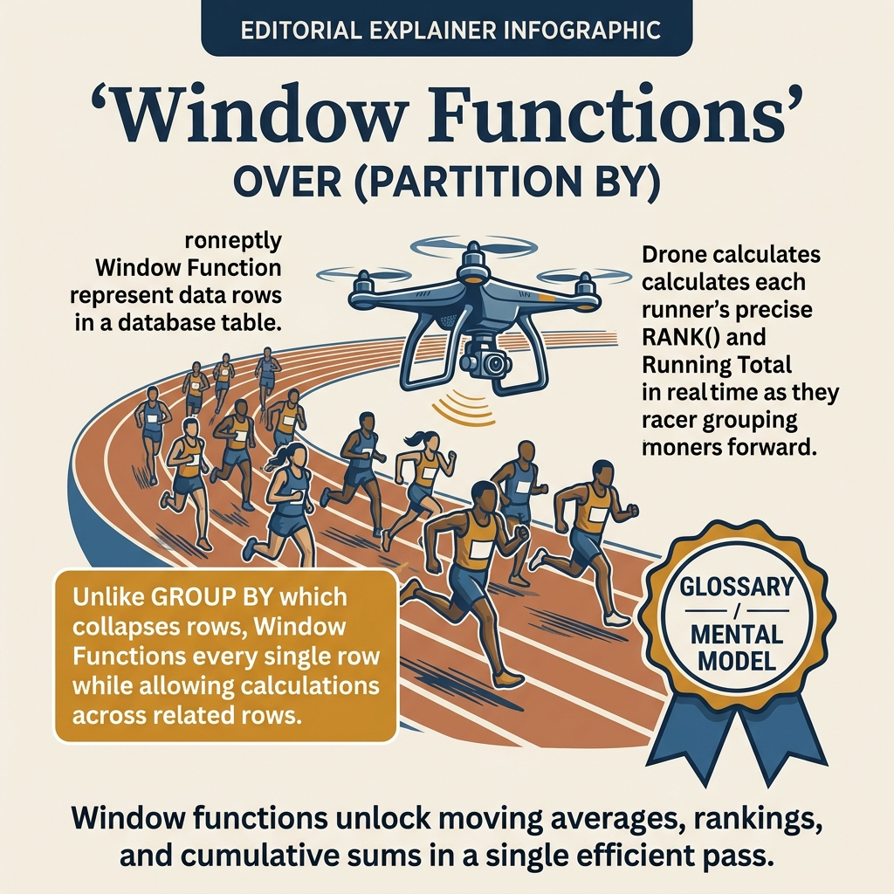
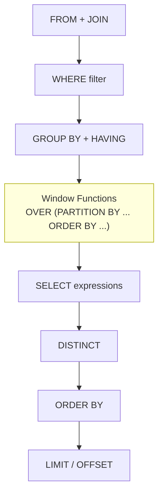

<!-- tags: sql, postgresql, database, advanced-sql -->
# 📊 Window Functions — ROW_NUMBER, RANK, LAG, LEAD, Frames

> Window functions: analytics trên bộ dữ liệu mà không collapse rows

| Aspect          | Detail                                           |
| --------------- | ------------------------------------------------ |
| **Concept**     | Tính toán trên "cửa sổ" rows liên quan           |
| **Use case**    | Rankings, running totals, comparisons, analytics |
| **Key insight** | Khác GROUP BY — không gom rows!                  |
| **Performance** | Index trên PARTITION BY + ORDER BY columns       |

---

📅 Ngày tạo: 2026-03-19 · 🔄 Cập nhật: 2026-04-04 · ⏱️ 18 phút đọc

---

## 1. DEFINE

Có những bài toán mà `GROUP BY` không đủ nữa: bạn vừa muốn nhìn từng row, vừa muốn mang theo tổng lũy kế, ranking hay context của những row lân cận. Khi cố giải bằng subquery lồng nhau, query thường trở nên khó đọc và khó tối ưu.

Window functions xuất hiện đúng ở ngưỡng đó. Chúng cho phép bạn tính toán trên một “cửa sổ” dữ liệu mà không làm mất từng dòng gốc.

| Variant | Mô tả |
| --- | --- |
| ROW_NUMBER() | Số thứ tự (unique) · Pagination, dedup |
| RANK() | Rank (có gaps nếu tie) · Competition ranking |
| DENSE_RANK() | Rank (không gaps) · Continuous ranking |
| NTILE(n) | Chia thành n buckets · Percentiles |

| Approach | Time | Space | Khi chọn |
| --- | --- | --- | --- |
| ROW_NUMBER, RANK, DENSE_RANK | Phụ thuộc cardinality | Phụ thuộc row width | Dùng để nắm baseline semantics trước khi tune planner hoặc index. |
| LAG, LEAD, Running Totals | Phụ thuộc plan | Phụ thuộc memory operator | Dùng khi query đã chạm index, cardinality hoặc join strategy. |
| NTILE, Percentiles, Named Windows | Phụ thuộc workload | Phụ thuộc buffer/WAL | Dùng khi workload production cần cân bằng correctness, lock và rollout. |


### Window Functions Overview

| Function            | Mô tả                   | Use case                   |
| ------------------- | ----------------------- | -------------------------- |
| `ROW_NUMBER()`      | Số thứ tự (unique)      | Pagination, dedup          |
| `RANK()`            | Rank (có gaps nếu tie)  | Competition ranking        |
| `DENSE_RANK()`      | Rank (không gaps)       | Continuous ranking         |
| `NTILE(n)`          | Chia thành n buckets    | Percentiles                |
| `LAG(col, n)`       | Giá trị n rows trước    | So sánh period-over-period |
| `LEAD(col, n)`      | Giá trị n rows sau      | Predict next value         |
| `FIRST_VALUE(col)`  | First value in window   | Earliest record            |
| `LAST_VALUE(col)`   | Last value in window    | Latest record              |
| `NTH_VALUE(col, n)` | Nth value in window     | Specific position          |
| `CUME_DIST()`       | Cumulative distribution | Percentile rank            |
| `PERCENT_RANK()`    | Relative rank (0-1)     | Statistical rank           |
| `SUM() OVER(...)`   | Running sum             | Cumulative totals          |
| `AVG() OVER(...)`   | Moving average          | Trend smoothing            |
| `COUNT() OVER(...)` | Running count           | Accumulated count          |

### Window Frame Syntax

```sql
function OVER (
    [PARTITION BY col1, col2]      -- Group within window
    [ORDER BY col3]                 -- Order within partition
    [frame_clause]                  -- Which rows to include
)
```

### Frame Types

| Frame                                                      | Mô tả                          | Ví dụ                   |
| ---------------------------------------------------------- | ------------------------------ | ----------------------- |
| `ROWS BETWEEN UNBOUNDED PRECEDING AND CURRENT ROW`         | All rows from start to current | Running total (default) |
| `ROWS BETWEEN 2 PRECEDING AND CURRENT ROW`                 | Last 3 rows                    | 3-row moving average    |
| `ROWS BETWEEN UNBOUNDED PRECEDING AND UNBOUNDED FOLLOWING` | All rows in partition          | Grand total             |
| `RANGE BETWEEN ...`                                        | Value-based range              | Time-based windows      |
| `GROUPS BETWEEN ...`                                       | Peer group-based               | PG 11+                  |

---

Các failure mode trên nghe cơ bản. Nhưng có trap: window function trong WHERE = syntax error (cần CTE/subquery), và frame clause default RANGE = unexpected results. Trap đó sẽ xuất hiện ở PITFALLS.

## 2. VISUAL

Với Window Functions — ROW_NUMBER, RANK, LAG, LEAD, Frames, bảng phân loại mới chỉ giúp bạn gọi đúng tên khái niệm. Điều quan trọng hơn là nhìn xem rows, giá trị hoặc ràng buộc thực sự đổi shape như thế nào khi query chạy qua từng bước.




*Hình: Window function mental model — ROW_NUMBER (unique rank), RANK/DENSE_RANK (ties), Running SUM/AVG (cumulative), LAG/LEAD (navigate). Window functions giữ nguyên mọi row, không collapse như GROUP BY.*

### Level 1

```
GROUP BY (collapse)              WINDOW (preserve)
┌─────────────────┐             ┌─────────────────┐
│ Alice  90K  Eng │             │ Alice  90K  Eng │ rank=1, dept_avg=87.5K
│ Bob    85K  Eng │ ──→ 87.5K  │ Bob    85K  Eng │ rank=2, dept_avg=87.5K
│ Charlie 70K Mkt │ ──→ 70K    │ Charlie 70K Mkt │ rank=1, dept_avg=70K
└─────────────────┘             └─────────────────┘
   3 rows → 2 rows                3 rows → 3 rows ✅
```

---

*Hình: Level 1 cho 📊 Window Functions — ROW_NUMBER, RANK, LAG, LEAD, Frames — nhìn vào happy path hoặc baseline heuristic trước khi đi sâu vào planner và trade-off.*

### Level 2

```text
Decision Lens                 Dấu hiệu cần nhìn                 Hướng xử lý
---------------------------  --------------------------------  -------------------------------------------
Semantics trước               Kết quả có đúng intent không?    1. ROW_NUMBER, RANK, DENSE_RANK
Planner / index signal        Cardinality, cost, buffers ra sao? 2. LAG, LEAD, Running Totals
Production pressure           Lock, WAL, lag, rollback nào đau? 3. NTILE, Percentiles, Named Windows
```

*Hình: Level 2 biến 📊 Window Functions — ROW_NUMBER, RANK, LAG, LEAD, Frames thành checklist quyết định — từ semantics, sang plan signal, rồi đến áp lực production.*


### Architecture — Window Function Evaluation Order



*Hình: Window functions chạy SAU GROUP BY nhưng TRƯỚC ORDER BY/LIMIT. Vì vậy window function có thể tham chiếu aggregate results nhưng không thể dùng trong WHERE.*

---
## 3. CODE

Khi flow của Window Functions — ROW_NUMBER, RANK, LAG, LEAD, Frames đã rõ, ta chuyển nó thành DDL, truy vấn và transaction có thể chạy thật. Ta bắt đầu từ case hẹp nhất rồi tăng dần số lượng rows, ràng buộc và biến thể.

### Problem 1: Basic — ROW_NUMBER, RANK, DENSE_RANK

> **Mục tiêu**: Ranking employees, pagination, deduplication
> **Cần**: ORDER BY concept
> **Đạt được**: Flexible ranking strategies


```sql
-- ✅ Setup
CREATE TABLE sales (
    id          serial PRIMARY KEY,
    salesperson text NOT NULL,
    department  text NOT NULL,
    region      text NOT NULL,
    amount      numeric(10,2) NOT NULL,
    sold_at     timestamptz DEFAULT now()
);

INSERT INTO sales (salesperson, department, region, amount, sold_at) VALUES
('Alice', 'Tech', 'North', 15000, '2024-01-05'),
('Bob', 'Tech', 'South', 15000, '2024-01-08'),
('Charlie', 'Tech', 'North', 12000, '2024-01-12'),
('Diana', 'Fashion', 'South', 18000, '2024-01-03'),
('Eve', 'Fashion', 'North', 16000, '2024-01-07'),
('Frank', 'Fashion', 'South', 14000, '2024-01-15'),
('Grace', 'Tech', 'South', 20000, '2024-01-20'),
('Henry', 'Fashion', 'North', 11000, '2024-01-22'),
('Alice', 'Tech', 'North', 18000, '2024-02-01'),
('Bob', 'Tech', 'South', 22000, '2024-02-05');

-- ═══════════════════════════════════════════
-- ROW_NUMBER — unique sequential number
-- ═══════════════════════════════════════════

-- ✅ Global ranking
SELECT
    salesperson,
    department,
    amount,
    ROW_NUMBER() OVER (ORDER BY amount DESC) AS global_rank
FROM sales;

-- ✅ Ranking within partition (per department)
SELECT
    salesperson,
    department,
    amount,
    ROW_NUMBER() OVER (PARTITION BY department ORDER BY amount DESC) AS dept_rank
FROM sales;

-- ═══════════════════════════════════════════
-- RANK vs DENSE_RANK — handling ties
-- ═══════════════════════════════════════════
SELECT
    salesperson,
    amount,
    ROW_NUMBER() OVER (ORDER BY amount DESC) AS row_num,   -- 1, 2, 3, 4...
    RANK() OVER (ORDER BY amount DESC) AS rank,             -- 1, 2, 2, 4... (gap!)
    DENSE_RANK() OVER (ORDER BY amount DESC) AS dense_rank  -- 1, 2, 2, 3... (no gap)
FROM sales;
-- Alice & Bob both 15000:
-- ROW_NUMBER: 3, 4 (arbitrary)
-- RANK:       3, 3 (tie), next is 5 (gap)
-- DENSE_RANK: 3, 3 (tie), next is 4 (no gap)

-- ═══════════════════════════════════════════
-- Top-N per partition
-- ═══════════════════════════════════════════

-- ✅ Top 3 salespeople per department
SELECT * FROM (
    SELECT
        salesperson,
        department,
        sum(amount) AS total_sales,
        ROW_NUMBER() OVER (
            PARTITION BY department
            ORDER BY sum(amount) DESC
        ) AS rank
    FROM sales
    GROUP BY salesperson, department
) ranked
WHERE rank <= 3;

-- ═══════════════════════════════════════════
-- Deduplication with ROW_NUMBER
-- ═══════════════════════════════════════════

-- ✅ Keep only latest record per salesperson
DELETE FROM sales
WHERE id IN (
    SELECT id FROM (
        SELECT id,
            ROW_NUMBER() OVER (
                PARTITION BY salesperson
                ORDER BY sold_at DESC
            ) AS rn
        FROM sales
    ) sub
    WHERE rn > 1
);

-- ✅ Pagination (keyset pagination alternative)
SELECT * FROM (
    SELECT *, ROW_NUMBER() OVER (ORDER BY sold_at DESC) AS rn
    FROM sales
) sub
WHERE rn BETWEEN 11 AND 20;  -- Page 2 (10 per page)
```


ROW_NUMBER/RANK đã cover. Nhưng aggregate windows cần running totals — hãy accumulate.

### Problem 2: Intermediate — LAG, LEAD, Running Totals

> **Mục tiêu**: Period-over-period comparison, cumulative metrics
> **Cần**: Date/time functions
> **Đạt được**: Growth analysis, trend detection


```sql
-- ═══════════════════════════════════════════
-- LAG — compare with previous row
-- ═══════════════════════════════════════════

-- ✅ Monthly revenue with month-over-month growth
WITH monthly_revenue AS (
    SELECT
        date_trunc('month', sold_at)::date AS month,
        sum(amount) AS revenue
    FROM sales
    GROUP BY month
)
SELECT
    month,
    revenue,
    LAG(revenue) OVER (ORDER BY month) AS prev_month,
    revenue - LAG(revenue) OVER (ORDER BY month) AS change,
    round(
        (revenue - LAG(revenue) OVER (ORDER BY month)) /
        NULLIF(LAG(revenue) OVER (ORDER BY month), 0) * 100,
        1
    ) AS growth_pct
FROM monthly_revenue;

-- ═══════════════════════════════════════════
-- LEAD — peek at next row
-- ═══════════════════════════════════════════

-- ✅ Days until next sale per salesperson
SELECT
    salesperson,
    sold_at::date AS sale_date,
    amount,
    LEAD(sold_at::date) OVER (
        PARTITION BY salesperson ORDER BY sold_at
    ) AS next_sale_date,
    LEAD(sold_at::date) OVER (
        PARTITION BY salesperson ORDER BY sold_at
    ) - sold_at::date AS days_between
FROM sales;

-- ═══════════════════════════════════════════
-- Running totals & cumulative metrics
-- ═══════════════════════════════════════════

-- ✅ Cumulative revenue (running total)
SELECT
    sold_at::date AS sale_date,
    amount,
    SUM(amount) OVER (ORDER BY sold_at) AS cumulative_revenue,
    COUNT(*) OVER (ORDER BY sold_at) AS cumulative_count,
    ROUND(AVG(amount) OVER (ORDER BY sold_at), 2) AS cumulative_avg
FROM sales
ORDER BY sold_at;

-- ✅ Cumulative revenue per department
SELECT
    department,
    sold_at::date,
    amount,
    SUM(amount) OVER (
        PARTITION BY department
        ORDER BY sold_at
    ) AS dept_cumulative
FROM sales;

-- ✅ Running percentage of total
SELECT
    salesperson,
    amount,
    SUM(amount) OVER () AS grand_total,          -- No ORDER BY = all rows
    ROUND(amount / SUM(amount) OVER () * 100, 2) AS pct_of_total,
    ROUND(
        SUM(amount) OVER (ORDER BY amount DESC) /
        SUM(amount) OVER () * 100,
        2
    ) AS cumulative_pct                           -- Pareto analysis
FROM sales;

-- ═══════════════════════════════════════════
-- Moving averages
-- ═══════════════════════════════════════════

-- ✅ 7-day moving average
SELECT
    sold_at::date,
    amount,
    ROUND(AVG(amount) OVER (
        ORDER BY sold_at
        ROWS BETWEEN 6 PRECEDING AND CURRENT ROW
    ), 2) AS moving_avg_7d,
    ROUND(AVG(amount) OVER (
        ORDER BY sold_at
        ROWS BETWEEN 29 PRECEDING AND CURRENT ROW
    ), 2) AS moving_avg_30d
FROM sales
ORDER BY sold_at;

-- ✅ FIRST_VALUE / LAST_VALUE
SELECT
    salesperson,
    department,
    amount,
    FIRST_VALUE(salesperson) OVER (
        PARTITION BY department ORDER BY amount DESC
    ) AS top_salesperson,
    FIRST_VALUE(amount) OVER (
        PARTITION BY department ORDER BY amount DESC
    ) AS max_sale,
    amount - FIRST_VALUE(amount) OVER (
        PARTITION BY department ORDER BY amount DESC
    ) AS gap_from_top
FROM sales;
```

**Tại sao?** Ở mức Intermediate của Window Functions — ROW_NUMBER, RANK, LAG, LEAD, Frames, bài khó không còn là viết cho chạy mà là giữ đúng invariant khi dữ liệu đổi shape. Problem 2: Intermediate — LAG, LEAD, Running Totals buộc bạn nhìn xem cardinality, nullability hoặc grain của dữ liệu đang bẻ semantic đi theo hướng nào.


Aggregate windows đã cover. Nhưng frame clauses cần ROWS vs RANGE — hãy control.

### Problem 3: Advanced — NTILE, Percentiles, Named Windows

> **Mục tiêu**: Minh họa cách áp dụng **📊 Window Functions — ROW_NUMBER, RANK, LAG, LEAD, Frames** qua ví dụ `NTILE, Percentiles, Named Windows` trong đúng ngữ cảnh schema, query hoặc vận hành.


```sql
-- ═══════════════════════════════════════════
-- NTILE — distribute into buckets
-- ═══════════════════════════════════════════

-- ✅ Quartiles (4 buckets)
SELECT
    salesperson,
    amount,
    NTILE(4) OVER (ORDER BY amount) AS quartile,
    CASE NTILE(4) OVER (ORDER BY amount)
        WHEN 1 THEN 'Bottom 25%'
        WHEN 2 THEN '25-50%'
        WHEN 3 THEN '50-75%'
        WHEN 4 THEN 'Top 25%'
    END AS quartile_label
FROM sales;

-- ✅ Percentile rank
SELECT
    salesperson,
    amount,
    ROUND(PERCENT_RANK() OVER (ORDER BY amount) * 100, 1) AS percentile,
    ROUND(CUME_DIST() OVER (ORDER BY amount) * 100, 1) AS cumulative_dist
FROM sales;

-- ═══════════════════════════════════════════
-- Named windows (DRY!)
-- ═══════════════════════════════════════════

-- ✅ Define window once, reuse multiple times
SELECT
    salesperson,
    department,
    amount,
    ROW_NUMBER() OVER dept_w AS dept_rank,
    SUM(amount) OVER dept_w AS dept_running_total,
    AVG(amount) OVER dept_w AS dept_running_avg,
    FIRST_VALUE(amount) OVER dept_w AS dept_best_sale,
    LAG(amount) OVER dept_w AS prev_dept_sale
FROM sales
WINDOW dept_w AS (PARTITION BY department ORDER BY amount DESC);
-- ✅ WINDOW clause = define once, use many times. No code duplication!

-- ═══════════════════════════════════════════
-- Complex analytics: Cohort retention
-- ═══════════════════════════════════════════

-- ✅ User retention by signup cohort
WITH user_activity AS (
    SELECT
        user_id,
        date_trunc('month', signed_up_at)::date AS cohort_month,
        date_trunc('month', activity_at)::date AS activity_month
    FROM user_activities
),
cohort_sizes AS (
    SELECT cohort_month, COUNT(DISTINCT user_id) AS cohort_size
    FROM user_activity
    GROUP BY cohort_month
)
SELECT
    ua.cohort_month,
    cs.cohort_size,
    (extract(year FROM ua.activity_month) * 12 + extract(month FROM ua.activity_month)) -
    (extract(year FROM ua.cohort_month) * 12 + extract(month FROM ua.cohort_month)) AS months_since,
    COUNT(DISTINCT ua.user_id) AS active_users,
    ROUND(COUNT(DISTINCT ua.user_id)::numeric / cs.cohort_size * 100, 1) AS retention_pct
FROM user_activity ua
JOIN cohort_sizes cs ON ua.cohort_month = cs.cohort_month
GROUP BY ua.cohort_month, cs.cohort_size, months_since
ORDER BY ua.cohort_month, months_since;

-- ═══════════════════════════════════════════
-- Gap analysis (find missing sequences)
-- ═══════════════════════════════════════════

-- ✅ Find gaps in order numbers
SELECT
    order_number,
    LEAD(order_number) OVER (ORDER BY order_number) AS next_order,
    LEAD(order_number) OVER (ORDER BY order_number) - order_number - 1 AS gap_size
FROM orders
WHERE LEAD(order_number) OVER (ORDER BY order_number) - order_number > 1;

-- ═══════════════════════════════════════════
-- Sessionization (identify user sessions)
-- ═══════════════════════════════════════════

-- ✅ Group page views into sessions (30 min gap = new session)
WITH page_events AS (
    SELECT
        user_id,
        page_url,
        viewed_at,
        CASE WHEN viewed_at - LAG(viewed_at) OVER (
            PARTITION BY user_id ORDER BY viewed_at
        ) > interval '30 minutes'
        THEN 1 ELSE 0 END AS new_session
    FROM page_views
)
SELECT
    user_id,
    SUM(new_session) OVER (
        PARTITION BY user_id ORDER BY viewed_at
    ) + 1 AS session_id,
    page_url,
    viewed_at
FROM page_events;
```

**Tại sao?** Khi Window Functions — ROW_NUMBER, RANK, LAG, LEAD, Frames đi tới mức Advanced, chi phí không còn nằm riêng trong câu lệnh mà lan sang lock time, maintenance window và rollback path. Problem 3: Advanced — NTILE, Percentiles, Named Windows đáng giá vì nó cho thấy một lựa chọn đẹp trên giấy có thể rất đắt trên hệ thống đang chạy.


---
Bạn đã đi qua ranking, aggregates, và frame clauses. Bây giờ đến phần nguy hiểm: WHERE syntax trap và frame default — trap đã được setup từ đầu bài.

## 4. PITFALLS

Window Functions — ROW_NUMBER, RANK, LAG, LEAD, Frames thường không thất bại ở chỗ cú pháp sai, mà ở chỗ semantics bị hiểu lệch hoặc bị kéo vào ngữ cảnh production lớn hơn. Phần dưới đây gom những lỗi dễ trả giá nhất.

| # | Severity | Lỗi | Hậu quả | Fix |
| --- | --- | --- | --- | --- |
| 1 | 🔵 Minor | LAST_VALUE returns current row by default | — | Thêm ROWS BETWEEN UNBOUNDED PRECEDING AND UNBOUNDED FOLLOWING |
| 2 | 🔵 Minor | Mixing aggregate + window functions | — | Window functions không thể trong WHERE |
| 3 | 🔵 Minor | Performance trên large datasets | — | Index trên PARTITION BY + ORDER BY columns |
| 4 | 🔵 Minor | ROW_NUMBER ties = non-deterministic | — | Thêm tiebreaker column (e.g., id) |
| 5 | 🔵 Minor | Frame clause ignored without ORDER BY | — | Luôn thêm ORDER BY khi dùng frames |
| 6 | 🔵 Minor | Window function in WHERE clause | — | Wrap trong subquery/CTE |

---
Bạn đã đi qua Window Functions và cạm bẫy. Các resources dưới đây giúp đi sâu hơn.

## 5. REF

| Resource             | Link                                                                                                               |
| -------------------- | ------------------------------------------------------------------------------------------------------------------ |
| Window Functions     | [postgresql.org/docs/current/tutorial-window.html](https://www.postgresql.org/docs/current/tutorial-window.html)   |
| Window Function List | [postgresql.org/docs/current/functions-window.html](https://www.postgresql.org/docs/current/functions-window.html) |
| Neon Tutorial        | [neon.com/postgresql/tutorial](https://neon.com/postgresql/tutorial)                                               |

---

## 6. RECOMMEND

Khi những bẫy chính của Window Functions — ROW_NUMBER, RANK, LAG, LEAD, Frames đã hiện ra, bước tiếp theo là nối nó sang planner, maintenance hoặc topology lớn hơn để mental model không dừng ở mức cú pháp.

| Mở rộng               | Khi nào                    | Lý do                        |
| --------------------- | -------------------------- | ---------------------------- |
| **Materialized View** | Pre-compute window results | Cache expensive analytics    |
| **TimescaleDB**       | Time-series window         | Built-in time_bucket         |
| **EXPLAIN ANALYZE**   | Debug slow windows         | Check Sort + WindowAgg nodes |
| **Partitioning**      | Large tables               | Partition pruning speedup    |


> **Callback** — Quay lại GROUP BY không đủ lúc đầu: ranking, running total, lead/lag đều cần OVER() — window function giữ row-level detail mà aggregate không thể. Một PARTITION BY thay thế một self-join phức tạp.

---

**Liên kết**: [← Math & Date](./07-math-date-functions.md) · [→ Views](./09-views.md)

---

## 7. QUICK REF

| Nếu gặp | Nghĩ ngay |
| --- | --- |
| ROW_NUMBER, RANK, DENSE_RANK | Dùng pattern này khi gặp signal tương ứng trong query plan hoặc workload. |
| LAG, LEAD, Running Totals | Dùng pattern này khi gặp signal tương ứng trong query plan hoặc workload. |
| NTILE, Percentiles, Named Windows | Dùng pattern này khi gặp signal tương ứng trong query plan hoặc workload. |
