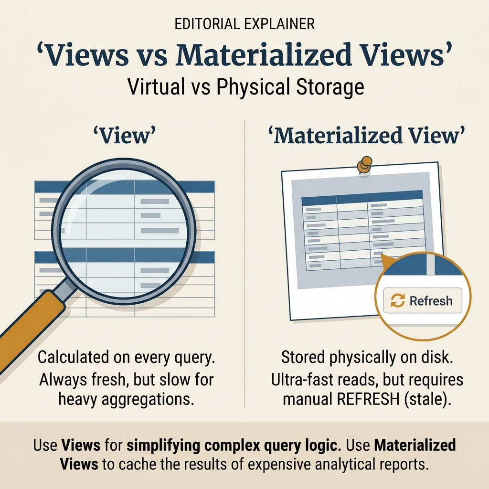
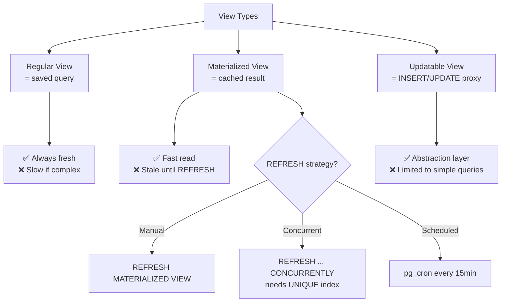

<!-- tags: sql, postgresql, database -->
# 👁️ Views — Regular, Materialized, Updatable

> Views: virtual tables, cached materialized views, auto-updatable views

| Aspect           | Detail                                     |
| ---------------- | ------------------------------------------ |
| **Concept**      | Saved query as virtual table               |
| **Use case**     | Abstraction, security, caching             |
| **Go relevance** | Query simplification, API layer            |
| **Performance**  | Regular: 0 overhead. Materialized: cached. |

---

📅 Ngày tạo: 2026-03-19 · 🔄 Cập nhật: 2026-04-04 · ⏱️ 12 phút đọc

---

## 1. DEFINE

Dashboard analytics chạy 5 queries mỗi lần load — mỗi query JOIN 4 bảng, filter theo 30 ngày, GROUP BY region. Total: 25 JOIN operations, 200ms tổng cộng. Tạo Materialized View: 1 query pre-computed, refresh mỗi 15 phút. Dashboard load: 8ms.

Nhưng 2 tuần sau, team phàn nàn data trên dashboard "trễ 15 phút". Regular View thì realtime nhưng 200ms. Materialized View thì nhanh nhưng stale.

View không phải "query được lưu" — nó là **abstraction layer** giữa raw data và consumer. Chọn Regular vs Materialized vs Updatable View phụ thuộc vào trade-off `freshness vs performance`.


| Variant | Mô tả |
| --- | --- |
| Regular View | ❌ Query only · N/A (live) · ✅ (simple) · Abstraction, security |
| Materialized View | ✅ Data cached · ❌ Manual/pg_cron · ❌ · Expensive queries, dashboards |
| Recursive View | ❌ Query only · N/A · ❌ · Tree/graph traversal |

| Approach | Time | Space | Khi chọn |
| --- | --- | --- | --- |
| Regular Views | Phụ thuộc cardinality | Phụ thuộc row width | Dùng để nắm baseline semantics trước khi tune planner hoặc index. |
| Materialized Views | Phụ thuộc plan | Phụ thuộc memory operator | Dùng khi query đã chạm index, cardinality hoặc join strategy. |
| Updatable Views & Recursive Views | Phụ thuộc workload | Phụ thuộc buffer/WAL | Dùng khi workload production cần cân bằng correctness, lock và rollout. |


### View Types

| Type                  | Storage        | Auto-refresh?     | Writable?   | Use case                      |
| --------------------- | -------------- | ----------------- | ----------- | ----------------------------- |
| **Regular View**      | ❌ Query only  | N/A (live)        | ✅ (simple) | Abstraction, security         |
| **Materialized View** | ✅ Data cached | ❌ Manual/pg_cron | ❌          | Expensive queries, dashboards |
| **Recursive View**    | ❌ Query only  | N/A               | ❌          | Tree/graph traversal          |

### Updatable View Rules

| Rule                          | Mô tả                                  |
| ----------------------------- | -------------------------------------- |
| Single table                  | FROM chỉ 1 table                       |
| No aggregates                 | Không `GROUP BY`, `HAVING`, `DISTINCT` |
| No set operations             | Không `UNION`, `INTERSECT`, `EXCEPT`   |
| No window functions           | Không `OVER()`                         |
| All NOT NULL columns included | Hoặc có default values                 |
| No subquery in FROM           | CTE OK trong certain cases             |

---

Các failure mode trên nghe quen. Nhưng có trap: view nested quá sâu = planner không optimize được, và materialized view stale = query trả data cũ. Trap đó sẽ xuất hiện ở PITFALLS.

## 2. VISUAL

Với Views — Regular, Materialized, Updatable, bảng phân loại mới chỉ giúp bạn gọi đúng tên khái niệm. Điều quan trọng hơn là nhìn xem rows, giá trị hoặc ràng buộc thực sự đổi shape như thế nào khi query chạy qua từng bước.




*Hình: Regular view (live query, no storage, always fresh) vs Materialized view (cached result, indexable, needs REFRESH). Regular cho fresh data, materialized cho expensive reports.*

### Level 1

> 📖 Xem 3. CODE bên dưới để xem ví dụ minh họa chi tiết.

*Hình: Level 1 cho 👁️ Views — Regular, Materialized, Updatable — nhìn vào happy path hoặc baseline heuristic trước khi đi sâu vào planner và trade-off.*

### Level 2

```text
Decision Lens                 Dấu hiệu cần nhìn                 Hướng xử lý
---------------------------  --------------------------------  -------------------------------------------
Semantics trước               Kết quả có đúng intent không?    1. Regular Views
Planner / index signal        Cardinality, cost, buffers ra sao? 2. Materialized Views
Production pressure           Lock, WAL, lag, rollback nào đau? 3. Updatable Views & Recursive Views
```

*Hình: Level 2 biến 👁️ Views — Regular, Materialized, Updatable thành checklist quyết định — từ semantics, sang plan signal, rồi đến áp lực production.*


### Architecture — View Types Comparison



*Hình: Regular = realtime slow, Materialized = fast stale, Updatable = write-through proxy. Chọn theo freshness vs performance requirement.*

---
## 3. CODE

Khi flow của Views — Regular, Materialized, Updatable đã rõ, ta chuyển nó thành DDL, truy vấn và transaction có thể chạy thật. Ta bắt đầu từ case hẹp nhất rồi tăng dần số lượng rows, ràng buộc và biến thể.

### Problem 1: Basic — Regular Views

> **Mục tiêu**: Minh họa cách áp dụng **👁️ Views — Regular, Materialized, Updatable** qua ví dụ `Regular Views` trong đúng ngữ cảnh schema, query hoặc vận hành.


```sql
-- ═══════════════════════════════════════════
-- Regular View — live query alias
-- ═══════════════════════════════════════════

-- ✅ Simple view
CREATE VIEW active_users AS
SELECT id, email, full_name, created_at
FROM users
WHERE status = 'active' AND deleted_at IS NULL;

-- Usage: query like a table
SELECT * FROM active_users WHERE email LIKE '%@go.dev';

-- ✅ Complex view — join + aggregation
CREATE VIEW department_summary AS
SELECT
    d.id AS department_id,
    d.name AS department_name,
    COUNT(e.id) AS employee_count,
    ROUND(AVG(e.salary), 2) AS avg_salary,
    MAX(e.salary) AS max_salary,
    MIN(e.salary) AS min_salary,
    SUM(e.salary) AS total_salary
FROM departments d
LEFT JOIN employees e ON d.id = e.department_id
GROUP BY d.id, d.name;

SELECT * FROM department_summary ORDER BY avg_salary DESC;

-- ✅ Security view — hide sensitive columns
CREATE VIEW public_users AS
SELECT id, full_name, avatar_url, created_at
FROM users;
-- ✅ Consumers never see email, password_hash, etc.

-- GRANT SELECT ON public_users TO app_readonly;
-- REVOKE SELECT ON users FROM app_readonly;

-- ✅ View with check option
CREATE VIEW premium_products AS
SELECT * FROM products
WHERE price >= 100
WITH CHECK OPTION;
-- INSERT into this view will REJECT rows where price < 100

-- ✅ Modify view
CREATE OR REPLACE VIEW active_users AS
SELECT id, email, full_name, last_login_at, created_at
FROM users
WHERE status = 'active' AND deleted_at IS NULL;

-- ✅ Drop view
DROP VIEW IF EXISTS active_users CASCADE;
```


View basics đã cover. Nhưng materialized views cần refresh strategy — hãy schedule.

### Problem 2: Intermediate — Materialized Views

> **Mục tiêu**: Minh họa cách áp dụng **👁️ Views — Regular, Materialized, Updatable** qua ví dụ `Materialized Views` trong đúng ngữ cảnh schema, query hoặc vận hành.


```sql
-- ═══════════════════════════════════════════
-- Materialized View — cached query results
-- ═══════════════════════════════════════════

-- ✅ Create materialized view
CREATE MATERIALIZED VIEW mv_monthly_revenue AS
SELECT
    date_trunc('month', o.created_at)::date AS month,
    d.name AS department,
    COUNT(o.id) AS order_count,
    SUM(o.total) AS revenue,
    ROUND(AVG(o.total), 2) AS avg_order_value,
    COUNT(DISTINCT o.user_id) AS unique_customers
FROM orders o
JOIN departments d ON o.department_id = d.id
WHERE o.status = 'completed'
GROUP BY month, d.name
ORDER BY month DESC, revenue DESC;

-- ✅ Create index on materialized view (important!)
CREATE UNIQUE INDEX ON mv_monthly_revenue (month, department);
CREATE INDEX ON mv_monthly_revenue (month);

-- ✅ Query — fast! (reads from cached data)
SELECT * FROM mv_monthly_revenue
WHERE month >= '2024-01-01'
ORDER BY month, revenue DESC;

-- ✅ Refresh — update cached data
REFRESH MATERIALIZED VIEW mv_monthly_revenue;
-- ⚠️ Blocks reads during refresh!

-- ✅ Concurrent refresh (non-blocking, requires UNIQUE INDEX)
REFRESH MATERIALIZED VIEW CONCURRENTLY mv_monthly_revenue;
-- ✅ No downtime! Readers can query old data during refresh

-- ═══════════════════════════════════════════
-- Auto-refresh with pg_cron
-- ═══════════════════════════════════════════

-- ✅ Refresh every hour
-- SELECT cron.schedule(
--     'refresh-monthly-revenue',
--     '0 * * * *',  -- Every hour
--     'REFRESH MATERIALIZED VIEW CONCURRENTLY mv_monthly_revenue'
-- );

-- ✅ Dashboard analytics view
CREATE MATERIALIZED VIEW mv_dashboard AS
WITH order_stats AS (
    SELECT
        COUNT(*) AS total_orders,
        SUM(total) AS total_revenue,
        COUNT(*) FILTER (WHERE created_at >= now() - interval '24 hours') AS orders_24h,
        SUM(total) FILTER (WHERE created_at >= now() - interval '24 hours') AS revenue_24h,
        COUNT(*) FILTER (WHERE created_at >= now() - interval '7 days') AS orders_7d,
        SUM(total) FILTER (WHERE created_at >= now() - interval '7 days') AS revenue_7d
    FROM orders WHERE status = 'completed'
),
user_stats AS (
    SELECT
        COUNT(*) AS total_users,
        COUNT(*) FILTER (WHERE created_at >= now() - interval '24 hours') AS new_users_24h,
        COUNT(*) FILTER (WHERE last_login_at >= now() - interval '24 hours') AS active_24h
    FROM users
)
SELECT
    os.*, us.*,
    now() AS last_refreshed
FROM order_stats os, user_stats us;

-- ✅ Single-row dashboard query — instant!
SELECT * FROM mv_dashboard;
```

**Tại sao?** Ở mức Intermediate của Views — Regular, Materialized, Updatable, bài khó không còn là viết cho chạy mà là giữ đúng invariant khi dữ liệu đổi shape. Problem 2: Intermediate — Materialized Views buộc bạn nhìn xem cardinality, nullability hoặc grain của dữ liệu đang bẻ semantic đi theo hướng nào.


Materialized đã cover. Nhưng updatable views cần INSTEAD OF triggers — hãy enable.

### Problem 3: Advanced — Updatable Views & Recursive Views

> **Mục tiêu**: Minh họa cách áp dụng **👁️ Views — Regular, Materialized, Updatable** qua ví dụ `Updatable Views & Recursive Views` trong đúng ngữ cảnh schema, query hoặc vận hành.


```sql
-- ═══════════════════════════════════════════
-- Updatable views
-- ═══════════════════════════════════════════

-- ✅ Auto-updatable view (simple single-table)
CREATE VIEW active_products AS
SELECT id, name, price, category, status
FROM products
WHERE status = 'active';

-- ✅ These all work!
INSERT INTO active_products (name, price, category, status)
VALUES ('New Product', 29.99, 'tech', 'active');

UPDATE active_products SET price = 39.99 WHERE id = 1;

DELETE FROM active_products WHERE id = 1;

-- ✅ WITH CHECK OPTION prevents inserting non-matching rows
CREATE VIEW expensive_products AS
SELECT * FROM products WHERE price > 1000
WITH LOCAL CHECK OPTION;

-- ❌ This fails! price < 1000 doesn't match view condition
INSERT INTO expensive_products (name, price) VALUES ('Cheap', 5.99);

-- ═══════════════════════════════════════════
-- INSTEAD OF trigger for complex views
-- ═══════════════════════════════════════════

-- ✅ Complex view (not auto-updatable)
CREATE VIEW user_profiles AS
SELECT
    u.id,
    u.email,
    u.full_name,
    p.avatar_url,
    p.bio,
    p.website
FROM users u
LEFT JOIN profiles p ON u.id = p.user_id;

-- ✅ Make it updatable via trigger
CREATE OR REPLACE FUNCTION update_user_profile()
RETURNS trigger AS $$
BEGIN
    UPDATE users SET
        email = NEW.email,
        full_name = NEW.full_name
    WHERE id = NEW.id;

    INSERT INTO profiles (user_id, avatar_url, bio, website)
    VALUES (NEW.id, NEW.avatar_url, NEW.bio, NEW.website)
    ON CONFLICT (user_id) DO UPDATE SET
        avatar_url = EXCLUDED.avatar_url,
        bio = EXCLUDED.bio,
        website = EXCLUDED.website;

    RETURN NEW;
END;
$$ LANGUAGE plpgsql;

CREATE TRIGGER trg_update_user_profile
    INSTEAD OF UPDATE ON user_profiles
    FOR EACH ROW
    EXECUTE FUNCTION update_user_profile();

-- ✅ Now updates work on the complex view!
UPDATE user_profiles SET
    full_name = 'Alice Updated',
    bio = 'Go developer'
WHERE id = 1;

-- ═══════════════════════════════════════════
-- Recursive view
-- ═══════════════════════════════════════════

CREATE RECURSIVE VIEW org_hierarchy (id, name, parent_id, depth, path) AS
    SELECT id, name, parent_id, 0, name::text
    FROM org WHERE parent_id IS NULL

    UNION ALL

    SELECT o.id, o.name, o.parent_id, oh.depth + 1,
           oh.path || ' → ' || o.name
    FROM org o
    JOIN org_hierarchy oh ON o.parent_id = oh.id;

SELECT repeat('  ', depth) || name AS hierarchy, path
FROM org_hierarchy
ORDER BY path;
```

**Tại sao?** Khi Views — Regular, Materialized, Updatable đi tới mức Advanced, chi phí không còn nằm riêng trong câu lệnh mà lan sang lock time, maintenance window và rollback path. Problem 3: Advanced — Updatable Views & Recursive Views đáng giá vì nó cho thấy một lựa chọn đẹp trên giấy có thể rất đắt trên hệ thống đang chạy.


---
Bạn đã đi qua views, materialized, và updatable views. Bây giờ đến phần nguy hiểm: nested view overhead và stale data — trap đã được setup từ đầu bài.

## 4. PITFALLS

Views — Regular, Materialized, Updatable thường không thất bại ở chỗ cú pháp sai, mà ở chỗ semantics bị hiểu lệch hoặc bị kéo vào ngữ cảnh production lớn hơn. Phần dưới đây gom những lỗi dễ trả giá nhất.

| # | Severity | Lỗi | Hậu quả | Fix |
| --- | --- | --- | --- | --- |
| 1 | 🟡 Common | Materialized view stale data | — | Schedule REFRESH CONCURRENTLY with pg_cron |
| 2 | 🟡 Common | REFRESH blocks reads | — | Dùng CONCURRENTLY (cần UNIQUE INDEX) |
| 3 | 🔵 Minor | View performance = underlying query | — | Index the base tables, not the view |
| 4 | 🔵 Minor | Complex view not updatable | — | INSTEAD OF trigger |
| 5 | 🔴 Fatal | View dependencies block DROP TABLE | — | DROP ... CASCADE hoặc drop view first |
| 6 | 🔵 Minor | WITH CHECK OPTION = LOCAL only | — | Dùng WITH CASCADED CHECK OPTION cho nested |

---
Bạn đã đi qua Views và cạm bẫy. Các resources dưới đây giúp đi sâu hơn.

## 5. REF

| Resource           | Link                                                                                                                                   |
| ------------------ | -------------------------------------------------------------------------------------------------------------------------------------- |
| Views              | [postgresql.org/docs/current/sql-createview.html](https://www.postgresql.org/docs/current/sql-createview.html)                         |
| Materialized Views | [postgresql.org/docs/current/sql-creatematerializedview.html](https://www.postgresql.org/docs/current/sql-creatematerializedview.html) |
| Neon Views         | [neon.com/postgresql/postgresql-views](https://neon.com/postgresql/postgresql-views/)                                                  |

---

## 6. RECOMMEND

Khi những bẫy chính của Views — Regular, Materialized, Updatable đã hiện ra, bước tiếp theo là nối nó sang planner, maintenance hoặc topology lớn hơn để mental model không dừng ở mức cú pháp.

| Mở rộng                    | Khi nào                   | Lý do                            |
| -------------------------- | ------------------------- | -----------------------------
> **Callback** — Quay lại dashboard 200ms vs 8ms: Regular View realtime nhưng chậm, Materialized View nhanh nhưng stale 15 phút. Giải pháp production: Materialized View + `pg_cron` refresh + `CONCURRENTLY` option để không lock reads. Freshness vs speed là trade-off có thể tune, không phải binary choice.

--- |
| Tham khảo 3. CODE          | Xem ví dụ đầy đủ          | Code snippets minh họa trực tiếp |
| Đọc 4. PITFALLS            | Trước khi dùng production | Tránh lỗi phổ biến               |
| Kết hợp với tool liên quan | Workflow thực tế          | Hiệu quả cao hơn khi combine     |

**Liên kết**: [← Window Functions](./08-window-functions.md) · [→ Triggers](./10-triggers-plpgsql.md)

---

## 7. QUICK REF

| Nếu gặp | Nghĩ ngay |
| --- | --- |
| Regular Views | Dùng pattern này khi gặp signal tương ứng trong query plan hoặc workload. |
| Materialized Views | Dùng pattern này khi gặp signal tương ứng trong query plan hoặc workload. |
| Updatable Views & Recursive Views | Dùng pattern này khi gặp signal tương ứng trong query plan hoặc workload. |
