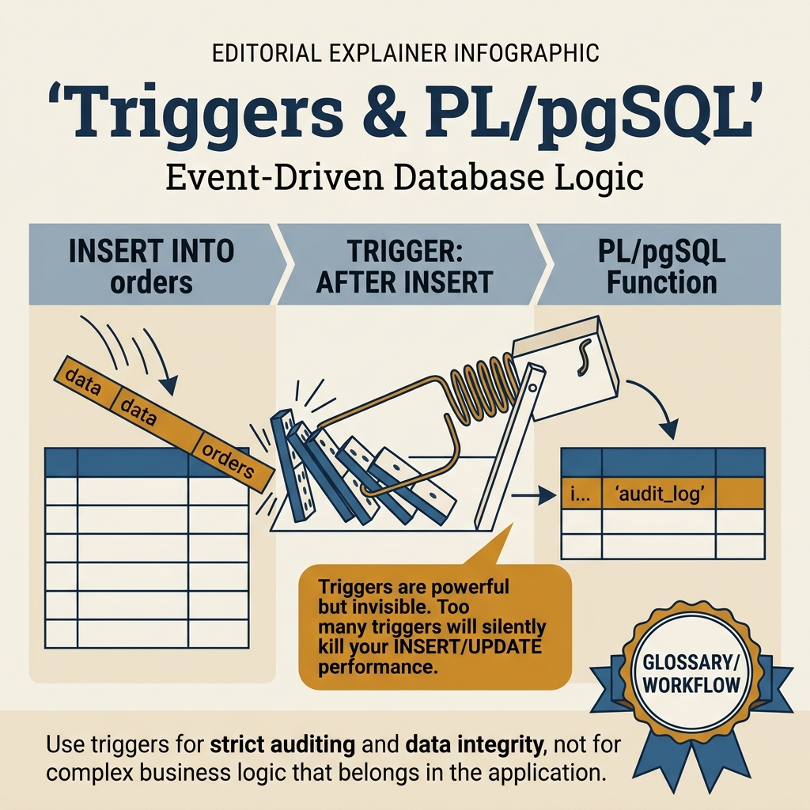
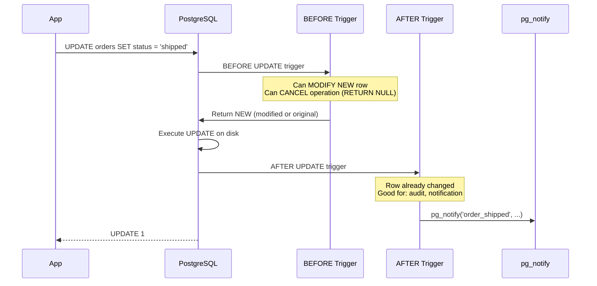

<!-- tags: sql, postgresql, database -->
# ⚡ Triggers & PL/pgSQL — Event-driven Logic

> Triggers, PL/pgSQL functions/procedures, audit trails, data validation

| Aspect           | Detail                                                                                      |
| ---------------- | ------------------------------------------------------------------------------------------- |
| **Concept**      | Auto-execute function on data events                                                        |
| **Use case**     | Audit logs, validation, computed fields, notifications                                      |
| **Go relevance** | Business logic in DB vs application layer                                                   |
| **Reference**    | [neon.com/postgresql/postgresql-triggers](https://neon.com/postgresql/postgresql-triggers/) |

---

📅 Ngày tạo: 2026-03-19 · 🔄 Cập nhật: 2026-04-04 · ⏱️ 16 phút đọc

---

## 1. DEFINE

Yêu cầu: "mỗi khi order status đổi sang 'shipped', tự động gửi notification". Developer viết trigger AFTER UPDATE trên bảng `orders`. Trigger gọi `pg_notify()` — hoạt động tốt. Sprint sau, thêm trigger thứ hai: audit log. Sprint nữa: trigger thứ ba: update inventory. Giờ mỗi UPDATE trên `orders` trigger 3 functions, transaction lock kéo dài 800ms, throughput giảm 5x.

Trigger là **event-driven logic tại database layer** — mạnh nhưng invisible. Không ai nhìn thấy trigger khi đọc application code. Khi trigger cascade trigger, debugging biến thành truy tìm chuỗi domino mà không có bản đồ.


| Variant | Mô tả |
| --- | --- |
| BEFORE | Trước operation · Per-row · Modify data, validate |
| AFTER | Sau operation · Per-row · Audit, notifications |
| INSTEAD OF | Thay thế operation · Per-row (views) · Updatable views |
| BEFORE STATEMENT | Trước batch · Per-statement · Log bulk operations |

| Approach | Time | Space | Khi chọn |
| --- | --- | --- | --- |
| Auto Timestamps & Validation | Phụ thuộc cardinality | Phụ thuộc row width | Dùng để nắm baseline semantics trước khi tune planner hoặc index. |
| Audit Trail | Phụ thuộc plan | Phụ thuộc memory operator | Dùng khi query đã chạm index, cardinality hoặc join strategy. |
| PL/pgSQL Functions & Procedures | Phụ thuộc workload | Phụ thuộc buffer/WAL | Dùng khi workload production cần cân bằng correctness, lock và rollout. |


### Trigger Types

| Type               | Khi nào            | Granularity     | Use case              |
| ------------------ | ------------------ | --------------- | --------------------- |
| `BEFORE`           | Trước operation    | Per-row         | Modify data, validate |
| `AFTER`            | Sau operation      | Per-row         | Audit, notifications  |
| `INSTEAD OF`       | Thay thế operation | Per-row (views) | Updatable views       |
| `BEFORE STATEMENT` | Trước batch        | Per-statement   | Log bulk operations   |
| `AFTER STATEMENT`  | Sau batch          | Per-statement   | Aggregate changes     |
| `TRUNCATE`         | On TRUNCATE        | Table-level     | Cleanup               |

### Trigger Special Variables

| Variable          | Mô tả                                    | Available in   |
| ----------------- | ---------------------------------------- | -------------- |
| `NEW`             | New row (after change)                   | INSERT, UPDATE |
| `OLD`             | Old row (before change)                  | UPDATE, DELETE |
| `TG_OP`           | Operation ('INSERT', 'UPDATE', 'DELETE') | All            |
| `TG_TABLE_NAME`   | Table name                               | All            |
| `TG_TABLE_SCHEMA` | Schema name                              | All            |
| `TG_WHEN`         | 'BEFORE' or 'AFTER'                      | All            |
| `TG_NARGS`        | Number of trigger args                   | All            |
| `TG_ARGV[]`       | Trigger arguments                        | All            |

### PL/pgSQL Basics

| Element   | Syntax                                                          |
| --------- | --------------------------------------------------------------- |
| Function  | `CREATE FUNCTION name() RETURNS trigger`                        |
| Procedure | `CREATE PROCEDURE name()` (no return, supports COMMIT/ROLLBACK) |
| Variable  | `DECLARE x int := 0;`                                           |
| If-else   | `IF cond THEN ... ELSIF ... ELSE ... END IF;`                   |
| Loop      | `FOR r IN query LOOP ... END LOOP;`                             |
| Exception | `BEGIN ... EXCEPTION WHEN OTHERS THEN ... END;`                 |
| Raise     | `RAISE NOTICE 'msg %', var;`                                    |

---

Các failure mode trên nghe rõ. Nhưng có trap: trigger recursion = infinite loop crash, và trigger trên hot table = write latency tăng. Trap đó sẽ xuất hiện ở PITFALLS.

## 2. VISUAL

Với Triggers & PL/pgSQL — Event-driven Logic, bảng phân loại mới chỉ giúp bạn gọi đúng tên khái niệm. Điều quan trọng hơn là nhìn xem rows, giá trị hoặc ràng buộc thực sự đổi shape như thế nào khi query chạy qua từng bước.




*Hình: Trigger flow — BEFORE (validation, modify NEW) → Row Operation (INSERT/UPDATE/DELETE) → AFTER (audit, notification) → Error Handling (EXCEPTION, RAISE). BEFORE cho validation, AFTER cho side effects.*

### Level 1

> 📖 Xem 3. CODE bên dưới để xem ví dụ minh họa chi tiết.

*Hình: Level 1 cho ⚡ Triggers & PL/pgSQL — Event-driven Logic — nhìn vào happy path hoặc baseline heuristic trước khi đi sâu vào planner và trade-off.*

### Level 2

```text
Decision Lens                 Dấu hiệu cần nhìn                 Hướng xử lý
---------------------------  --------------------------------  -------------------------------------------
Semantics trước               Kết quả có đúng intent không?    1. Auto Timestamps & Validation
Planner / index signal        Cardinality, cost, buffers ra sao? 2. Audit Trail
Production pressure           Lock, WAL, lag, rollback nào đau? 3. PL/pgSQL Functions & Procedures
```

*Hình: Level 2 biến ⚡ Triggers & PL/pgSQL — Event-driven Logic thành checklist quyết định — từ semantics, sang plan signal, rồi đến áp lực production.*


### Architecture — Trigger Execution Order



*Hình: BEFORE trigger có quyền modify/cancel row. AFTER trigger chạy sau khi row đã thay đổi — dùng cho side effects. Nhiều triggers = transaction time tăng tuyến tính.*

---
## 3. CODE

Khi flow của Triggers & PL/pgSQL — Event-driven Logic đã rõ, ta chuyển nó thành DDL, truy vấn và transaction có thể chạy thật. Ta bắt đầu từ case hẹp nhất rồi tăng dần số lượng rows, ràng buộc và biến thể.

### Problem 1: Basic — Auto Timestamps & Validation

> **Mục tiêu**: Auto-set `updated_at`, validate data trước insert/update
> **Cần**: Table setup
> **Đạt được**: Consistent data, no application logic needed


```sql
-- ═══════════════════════════════════════════
-- Auto-update timestamps
-- ═══════════════════════════════════════════

-- ✅ Generic trigger function (reusable cho mọi table!)
CREATE OR REPLACE FUNCTION update_updated_at()
RETURNS trigger AS $$
BEGIN
    NEW.updated_at = now();
    RETURN NEW;
END;
$$ LANGUAGE plpgsql;

-- ✅ Apply to any table
CREATE TRIGGER trg_users_updated_at
    BEFORE UPDATE ON users
    FOR EACH ROW
    EXECUTE FUNCTION update_updated_at();

CREATE TRIGGER trg_orders_updated_at
    BEFORE UPDATE ON orders
    FOR EACH ROW
    EXECUTE FUNCTION update_updated_at();

-- ✅ Now updated_at auto-sets on every UPDATE!
UPDATE users SET full_name = 'Alice Updated' WHERE id = 1;
-- updated_at automatically set to now()

-- ═══════════════════════════════════════════
-- Data validation trigger
-- ═══════════════════════════════════════════

CREATE OR REPLACE FUNCTION validate_order()
RETURNS trigger AS $$
BEGIN
    -- ✅ Validate total
    IF NEW.total <= 0 THEN
        RAISE EXCEPTION 'Order total must be positive, got: %', NEW.total;
    END IF;

    -- ✅ Validate status transition
    IF TG_OP = 'UPDATE' THEN
        IF OLD.status = 'cancelled' AND NEW.status != 'cancelled' THEN
            RAISE EXCEPTION 'Cannot reactivate cancelled order %', OLD.id;
        END IF;

        IF OLD.status = 'delivered' AND NEW.status NOT IN ('delivered', 'refunded') THEN
            RAISE EXCEPTION 'Delivered order % can only be refunded', OLD.id;
        END IF;
    END IF;

    -- ✅ Auto-set fields
    IF TG_OP = 'INSERT' THEN
        NEW.order_number = 'ORD-' || lpad(nextval('order_seq')::text, 8, '0');
        NEW.status = COALESCE(NEW.status, 'pending');
    END IF;

    RETURN NEW;
END;
$$ LANGUAGE plpgsql;

CREATE TRIGGER trg_validate_order
    BEFORE INSERT OR UPDATE ON orders
    FOR EACH ROW
    EXECUTE FUNCTION validate_order();
```


Trigger basics đã cover. Nhưng PL/pgSQL functions cần procedural logic — hãy viết.

### Problem 2: Intermediate — Audit Trail

> **Mục tiêu**: Log mọi thay đổi data vào audit table
> **Cần**: JSONB, trigger variables
> **Đạt được**: Complete change history cho compliance


```sql
-- ═══════════════════════════════════════════
-- Generic audit trail
-- ═══════════════════════════════════════════

CREATE TABLE audit_log (
    id          bigint GENERATED ALWAYS AS IDENTITY PRIMARY KEY,
    table_name  text NOT NULL,
    record_id   text NOT NULL,
    operation   text NOT NULL,
    old_data    jsonb,
    new_data    jsonb,
    changed_by  text DEFAULT current_user,
    changed_at  timestamptz DEFAULT now(),
    app_user_id text  -- Application-level user (set via session variable)
);

CREATE INDEX idx_audit_table_record ON audit_log (table_name, record_id);
CREATE INDEX idx_audit_changed_at ON audit_log (changed_at);

-- ✅ Generic audit trigger function
CREATE OR REPLACE FUNCTION audit_trigger()
RETURNS trigger AS $$
DECLARE
    record_id text;
    app_user text;
BEGIN
    -- ✅ Get application user from session variable
    BEGIN
        app_user := current_setting('app.current_user_id', true);
    EXCEPTION WHEN OTHERS THEN
        app_user := NULL;
    END;

    -- ✅ Get record ID
    CASE TG_OP
        WHEN 'INSERT' THEN record_id := NEW.id::text;
        WHEN 'UPDATE' THEN record_id := NEW.id::text;
        WHEN 'DELETE' THEN record_id := OLD.id::text;
    END CASE;

    -- ✅ Insert audit record
    INSERT INTO audit_log (table_name, record_id, operation, old_data, new_data, app_user_id)
    VALUES (
        TG_TABLE_NAME,
        record_id,
        TG_OP,
        CASE WHEN TG_OP IN ('UPDATE', 'DELETE') THEN to_jsonb(OLD) END,
        CASE WHEN TG_OP IN ('INSERT', 'UPDATE') THEN to_jsonb(NEW) END,
        app_user
    );

    RETURN COALESCE(NEW, OLD);
END;
$$ LANGUAGE plpgsql;

-- ✅ Apply to tables
CREATE TRIGGER trg_users_audit
    AFTER INSERT OR UPDATE OR DELETE ON users
    FOR EACH ROW EXECUTE FUNCTION audit_trigger();

CREATE TRIGGER trg_orders_audit
    AFTER INSERT OR UPDATE OR DELETE ON orders
    FOR EACH ROW EXECUTE FUNCTION audit_trigger();

-- ✅ Set application user in Go
-- tx.Exec(ctx, "SET LOCAL app.current_user_id = $1", userID)
-- All subsequent queries in this transaction will have the user ID

-- ═══════════════════════════════════════════
-- Query audit history
-- ═══════════════════════════════════════════

-- ✅ View changes for a specific record
SELECT
    operation,
    changed_at,
    changed_by,
    app_user_id,
    CASE operation
        WHEN 'UPDATE' THEN (
            SELECT jsonb_object_agg(key, new_data->key)
            FROM jsonb_each(new_data) t
            WHERE old_data->key IS DISTINCT FROM new_data->key
        )
        ELSE new_data
    END AS changes
FROM audit_log
WHERE table_name = 'users' AND record_id = '1'
ORDER BY changed_at DESC;
```

**Tại sao?** Ở mức Intermediate của Triggers & PL/pgSQL — Event-driven Logic, bài khó không còn là viết cho chạy mà là giữ đúng invariant khi dữ liệu đổi shape. Problem 2: Intermediate — Audit Trail buộc bạn nhìn xem cardinality, nullability hoặc grain của dữ liệu đang bẻ semantic đi theo hướng nào.


Functions đã cover. Nhưng trigger cascading cần ordering — hãy control.

### Problem 3: Advanced — PL/pgSQL Functions & Procedures

> **Mục tiêu**: Stored procedures, error handling, cursors
> **Cần**: PL/pgSQL syntax
> **Đạt được**: Complex business logic in database


```sql
-- ═══════════════════════════════════════════
-- Function with complex logic
-- ═══════════════════════════════════════════

-- ✅ Calculate order statistics
CREATE OR REPLACE FUNCTION calculate_user_stats(p_user_id bigint)
RETURNS TABLE (
    total_orders int,
    total_spent  numeric,
    avg_order    numeric,
    tier         text,
    last_order   timestamptz
) AS $$
BEGIN
    RETURN QUERY
    SELECT
        COUNT(o.id)::int,
        COALESCE(SUM(o.total), 0),
        COALESCE(ROUND(AVG(o.total), 2), 0),
        CASE
            WHEN COALESCE(SUM(o.total), 0) >= 10000 THEN 'Gold'
            WHEN COALESCE(SUM(o.total), 0) >= 5000  THEN 'Silver'
            ELSE 'Bronze'
        END,
        MAX(o.created_at)
    FROM orders o
    WHERE o.user_id = p_user_id AND o.status = 'completed';
END;
$$ LANGUAGE plpgsql STABLE;

-- Usage:
SELECT * FROM calculate_user_stats(42);

-- ═══════════════════════════════════════════
-- Procedure with transactions (PG 11+)
-- ═══════════════════════════════════════════

-- ✅ Transfer money between accounts (with logging)
CREATE OR REPLACE PROCEDURE transfer_funds(
    p_from_id  bigint,
    p_to_id    bigint,
    p_amount   numeric,
    p_notes    text DEFAULT NULL
)
LANGUAGE plpgsql AS $$
DECLARE
    v_from_balance numeric;
    v_transfer_id  bigint;
BEGIN
    -- ✅ Lock accounts in order (prevent deadlock)
    PERFORM 1 FROM accounts WHERE id = LEAST(p_from_id, p_to_id) FOR UPDATE;
    PERFORM 1 FROM accounts WHERE id = GREATEST(p_from_id, p_to_id) FOR UPDATE;

    -- ✅ Check balance
    SELECT balance INTO v_from_balance FROM accounts WHERE id = p_from_id;

    IF v_from_balance IS NULL THEN
        RAISE EXCEPTION 'Account % not found', p_from_id;
    END IF;

    IF v_from_balance < p_amount THEN
        RAISE EXCEPTION 'Insufficient balance: % < %', v_from_balance, p_amount
            USING HINT = 'Check account balance before transfer';
    END IF;

    -- ✅ Perform transfer
    UPDATE accounts SET balance = balance - p_amount WHERE id = p_from_id;
    UPDATE accounts SET balance = balance + p_amount WHERE id = p_to_id;

    -- ✅ Log transfer
    INSERT INTO transfers (from_account, to_account, amount, notes)
    VALUES (p_from_id, p_to_id, p_amount, p_notes)
    RETURNING id INTO v_transfer_id;

    RAISE NOTICE 'Transfer #% completed: % from account % to %',
        v_transfer_id, p_amount, p_from_id, p_to_id;

    -- ✅ Procedure can COMMIT (functions cannot!)
    COMMIT;

EXCEPTION
    WHEN OTHERS THEN
        RAISE NOTICE 'Transfer failed: %', SQLERRM;
        ROLLBACK;
        RAISE;
END;
$$;

-- Usage:
CALL transfer_funds(1, 2, 500.00, 'Monthly rent');

-- ═══════════════════════════════════════════
-- Notification trigger (LISTEN/NOTIFY)
-- ═══════════════════════════════════════════

-- ✅ Real-time notifications to Go application
CREATE OR REPLACE FUNCTION notify_order_change()
RETURNS trigger AS $$
BEGIN
    PERFORM pg_notify(
        'order_changes',
        json_build_object(
            'operation', TG_OP,
            'id', COALESCE(NEW.id, OLD.id),
            'status', CASE WHEN TG_OP = 'DELETE' THEN OLD.status ELSE NEW.status END,
            'total', CASE WHEN TG_OP = 'DELETE' THEN OLD.total ELSE NEW.total END,
            'timestamp', now()
        )::text
    );
    RETURN COALESCE(NEW, OLD);
END;
$$ LANGUAGE plpgsql;

CREATE TRIGGER trg_order_notify
    AFTER INSERT OR UPDATE OR DELETE ON orders
    FOR EACH ROW EXECUTE FUNCTION notify_order_change();
```

```go
// ✅ Go — Listen for PostgreSQL notifications
func (r *Repo) ListenOrderChanges(ctx context.Context) error {
    conn, err := r.pool.Acquire(ctx)
    if err != nil {
        return err
    }
    defer conn.Release()

    _, err = conn.Exec(ctx, "LISTEN order_changes")
    if err != nil {
        return err
    }

    for {
        notification, err := conn.Conn().WaitForNotification(ctx)
        if err != nil {
            return err
        }

        var event OrderEvent
        json.Unmarshal([]byte(notification.Payload), &event)
        log.Printf("Order %d: %s → %s", event.ID, event.Operation, event.Status)
    }
}
```

**Tại sao?** Khi Triggers & PL/pgSQL — Event-driven Logic đi tới mức Advanced, chi phí không còn nằm riêng trong câu lệnh mà lan sang lock time, maintenance window và rollback path. Problem 3: Advanced — PL/pgSQL Functions & Procedures đáng giá vì nó cho thấy một lựa chọn đẹp trên giấy có thể rất đắt trên hệ thống đang chạy.


---
Bạn đã đi qua triggers, functions, và cascading. Bây giờ đến phần nguy hiểm: trigger recursion và write latency — trap đã được setup từ đầu bài.

## 4. PITFALLS

Triggers & PL/pgSQL — Event-driven Logic thường không thất bại ở chỗ cú pháp sai, mà ở chỗ semantics bị hiểu lệch hoặc bị kéo vào ngữ cảnh production lớn hơn. Phần dưới đây gom những lỗi dễ trả giá nhất.

| # | Severity | Lỗi | Hậu quả | Fix |
| --- | --- | --- | --- | --- |
| 1 | 🔵 Minor | Trigger modifies same table → infinite loop | — | WHEN condition hoặc pg_trigger_depth() check |
| 2 | 🟡 Common | Heavy trigger → slow INSERT/UPDATE | — | Keep triggers lightweight, async processing |
| 3 | 🔵 Minor | BEFORE trigger return NULL → skip operation | — | Always RETURN NEW hoặc RETURN OLD |
| 4 | 🔵 Minor | Procedure vs Function confusion | — | Procedure: can COMMIT. Function: cannot. |
| 5 | 🔵 Minor | NOTIFY payload limit 8000 bytes | — | Send ID only, query details separately |
| 6 | 🔴 Fatal | Audit log grows forever | — | Partition by month, auto-drop old months |

---
Bạn đã đi qua Triggers & PL/pgSQL và cạm bẫy. Các resources dưới đây giúp đi sâu hơn.

## 5. REF

| Resource      | Link                                                                                                                   |
| ------------- | ---------------------------------------------------------------------------------------------------------------------- |
| Triggers      | [postgresql.org/docs/current/trigger-definition.html](https://www.postgresql.org/docs/current/trigger-definition.html) |
| PL/pgSQL      | [postgresql.org/docs/current/plpgsql.html](https://www.postgresql.org/docs/current/plpgsql.html)                       |
| Neon Triggers | [neon.com/postgresql/postgresql-triggers](https://neon.com/postgresql/postgresql-triggers/)                            |
| Neon PL/pgSQL | [neon.com/postgresql/postgresql-plpgsql](https://neon.com/postgresql/postgresql-plpgsql/)                              |

---

## 6. RECOMMEND

Khi những bẫy chính của Triggers & PL/pgSQL — Event-driven Logic đã hiện ra, bước tiếp theo là nối nó sang planner, maintenance hoặc topology lớn hơn để mental model không dừng ở mức cú pháp.

| Mở rộng             | Khi nào               | Lý do                        |
| ------------------- | --------------------- | ---------------------------- |
| **Event triggers**  | DDL tracking          | Log schema changes           |
| **pgAudit**         | Compliance            | Enterprise audit extension   |
| **pg_notify**       | Real-time events      | Push to Go via LISTEN/NOTIFY |
| **Temporal tables** | Point-in-time queries | `periods` extension          |


> **Callback** — Quay lại 3 triggers cascade 800ms: mỗi trigger thêm latency vào transaction. Fix: gộp audit + notification vào 1 trigger, defer inventory update sang async queue. Rule: trigger nên _ghi nhận_ event, không _xử lý_ event.

---

**Liên kết**: [← Views](./09-views.md) · [← README](./README.md)

---

## 7. QUICK REF

| Nếu gặp | Nghĩ ngay |
| --- | --- |
| Auto Timestamps & Validation | Dùng pattern này khi gặp signal tương ứng trong query plan hoặc workload. |
| Audit Trail | Dùng pattern này khi gặp signal tương ứng trong query plan hoặc workload. |
| PL/pgSQL Functions & Procedures | Dùng pattern này khi gặp signal tương ứng trong query plan hoặc workload. |
