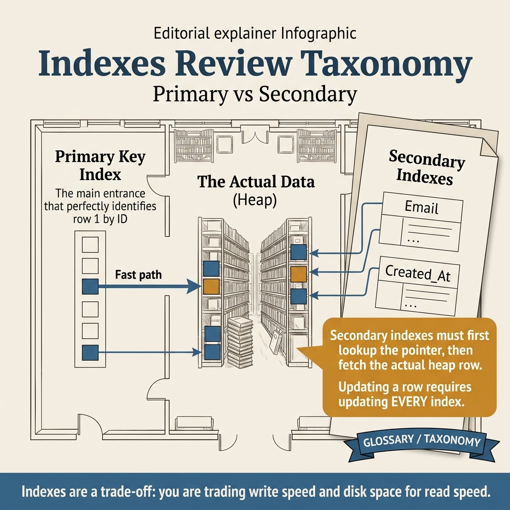
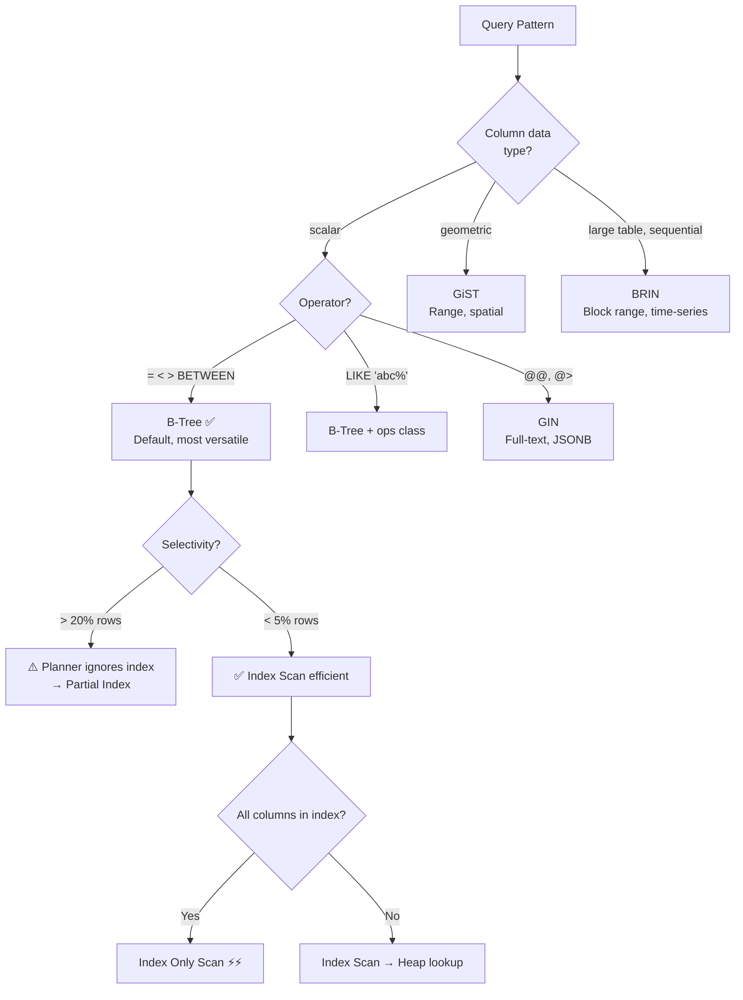

<!-- tags: sql, postgresql, database, indexing -->
# 🔍 PostgreSQL Indexes — B-tree, GIN, GiST, BRIN, Partial

> Index types, strategies, EXPLAIN ANALYZE, index-only scans — performance essentials

| Aspect        | Detail                                                                                    |
| ------------- | ----------------------------------------------------------------------------------------- |
| **Concept**   | Data structures cho fast lookup                                                           |
| **Use case**  | Query performance, unique constraints                                                     |
| **Reference** | [neon.com/postgresql/postgresql-indexes](https://neon.com/postgresql/postgresql-indexes/) |

---

📅 Ngày tạo: 2026-03-19 · 🔄 Cập nhật: 2026-04-04 · ⏱️ 14 phút đọc

---

## 1. DEFINE

Query đơn giản: `SELECT * FROM users WHERE email = $1`. Có B-Tree index trên `email`. EXPLAIN cho thấy... Seq Scan. Tại sao? Vì query thật là `WHERE LOWER(email) = LOWER($1)` — function `LOWER()` khiến planner không match B-Tree index. Thêm 5 index khác "phòng khi cần" — mỗi INSERT giờ cập nhật 6 indexes, write throughput giảm 40%.

Index không phải "cứ thêm là nhanh". Mỗi index là trade-off: **read faster, write slower, disk bigger**. Bài này dạy bạn chọn đúng loại index cho đúng query pattern.


| Variant | Mô tả |
| --- | --- |
| B-tree (default) | =, <, >, <=, >=, BETWEEN, IN, IS NULL · General purpose, sorting · Medium |
| Hash | = only · Equality-only lookups · Small |
| GIN | @>, ?, &&, @@ · JSONB, arrays, FTS, trigram · Large |
| GiST | <<, >>, geometric · Range types, PostGIS, ltree · Medium |

| Approach | Time | Space | Khi chọn |
| --- | --- | --- | --- |
| Index Creation & Usage | Phụ thuộc cardinality | Phụ thuộc row width | Dùng để nắm baseline semantics trước khi tune planner hoặc index. |
| EXPLAIN ANALYZE | Phụ thuộc plan | Phụ thuộc memory operator | Dùng khi query đã chạm index, cardinality hoặc join strategy. |
| Index Maintenance & Strategy | Phụ thuộc workload | Phụ thuộc buffer/WAL | Dùng khi workload production cần cân bằng correctness, lock và rollout. |


### Index Types

| Type                 | Operators                               | Use case                     | Size       |
| -------------------- | --------------------------------------- | ---------------------------- | ---------- |
| **B-tree** (default) | `=, <, >, <=, >=, BETWEEN, IN, IS NULL` | General purpose, sorting     | Medium     |
| **Hash**             | `=` only                                | Equality-only lookups        | Small      |
| **GIN**              | `@>, ?, &&, @@`                         | JSONB, arrays, FTS, trigram  | Large      |
| **GiST**             | `<<, >>`, geometric                     | Range types, PostGIS, ltree  | Medium     |
| **SP-GiST**          | space-partitioned                       | IP ranges, phone numbers     | Medium     |
| **BRIN**             | range summary                           | Time-series, sequential data | Very small |

### Index Strategies

| Strategy          | Syntax                                | Use case                      |
| ----------------- | ------------------------------------- | ----------------------------- |
| **Single column** | `CREATE INDEX ON t(col)`              | Single-column WHERE           |
| **Multi-column**  | `CREATE INDEX ON t(a, b, c)`          | Composite WHERE (left-prefix) |
| **Partial**       | `CREATE INDEX ... WHERE condition`    | Subset of rows                |
| **Expression**    | `CREATE INDEX ON t(lower(email))`     | Computed queries              |
| **Covering**      | `CREATE INDEX ON t(a) INCLUDE (b, c)` | Index-only scans              |
| **Unique**        | `CREATE UNIQUE INDEX ON t(col)`       | Enforce uniqueness            |
| **Concurrent**    | `CREATE INDEX CONCURRENTLY`           | Non-blocking (production)     |

---

Các failure mode trên nghe dễ tránh. Nhưng có trap: unused index = write overhead vô ích, và expression index trên wrong function = never used. Trap đó sẽ xuất hiện ở PITFALLS.

## 2. VISUAL

Với PostgreSQL Indexes — B-tree, GIN, GiST, BRIN, Partial, bảng phân loại mới chỉ giúp bạn gọi đúng tên khái niệm. Điều quan trọng hơn là nhìn xem rows, giá trị hoặc ràng buộc thực sự đổi shape như thế nào khi query chạy qua từng bước.




*Hình: 4 loại index chính — B-tree (default, 80% use cases), GIN (JSONB/array), Partial (WHERE subset), Expression (function-based). B-tree trước, chuyển sang GIN/Partial khi query pattern đòi hỏi.*

### Level 1

> 📖 Xem 3. CODE bên dưới để xem ví dụ minh họa chi tiết.

*Hình: Level 1 cho 🔍 PostgreSQL Indexes — B-tree, GIN, GiST, BRIN, Partial — nhìn vào happy path hoặc baseline heuristic trước khi đi sâu vào planner và trade-off.*

### Level 2

```text
Decision Lens                 Dấu hiệu cần nhìn                 Hướng xử lý
---------------------------  --------------------------------  -------------------------------------------
Semantics trước               Kết quả có đúng intent không?    1. Index Creation & Usage
Planner / index signal        Cardinality, cost, buffers ra sao? 2. EXPLAIN ANALYZE
Production pressure           Lock, WAL, lag, rollback nào đau? 3. Index Maintenance & Strategy
```

*Hình: Level 2 biến 🔍 PostgreSQL Indexes — B-tree, GIN, GiST, BRIN, Partial thành checklist quyết định — từ semantics, sang plan signal, rồi đến áp lực production.*


### Architecture — Index Type Selection



*Hình: B-Tree là mặc định nhưng không phải silver bullet. GIN cho full-text/JSONB, BRIN cho time-series ordered data. Selectivity > 20% = planner chọn Seq Scan, cần partial index.*

---
## 3. CODE

Khi flow của PostgreSQL Indexes — B-tree, GIN, GiST, BRIN, Partial đã rõ, ta chuyển nó thành DDL, truy vấn và transaction có thể chạy thật. Ta bắt đầu từ case hẹp nhất rồi tăng dần số lượng rows, ràng buộc và biến thể.

### Problem 1: Basic — Index Creation & Usage

> **Mục tiêu**: Minh họa cách áp dụng **🔍 PostgreSQL Indexes — B-tree, GIN, GiST, BRIN, Partial** qua ví dụ `Index Creation & Usage` trong đúng ngữ cảnh schema, query hoặc vận hành.


```sql
-- ═══════════════════════════════════════════
-- B-tree index (default)
-- ═══════════════════════════════════════════

-- ✅ Single column
CREATE INDEX idx_users_email ON users(email);

-- ✅ Multi-column (composite)
CREATE INDEX idx_orders_user_status ON orders(user_id, status);
-- ✅ Works for: WHERE user_id = 1
-- ✅ Works for: WHERE user_id = 1 AND status = 'active'
-- ❌ Does NOT help: WHERE status = 'active' (must use leftmost columns!)

-- ✅ Unique index
CREATE UNIQUE INDEX idx_users_email_unique ON users(email);

-- ✅ Expression index (computed column)
CREATE INDEX idx_users_email_lower ON users(lower(email));
-- ✅ WHERE lower(email) = 'alice@go.dev' → uses this index

-- ✅ Partial index (subset of rows only)
CREATE INDEX idx_orders_pending ON orders(created_at)
WHERE status = 'pending';
-- Much smaller index! Only indexes pending orders

-- ✅ Covering index (INCLUDE for index-only scans)
CREATE INDEX idx_orders_user_cover ON orders(user_id)
INCLUDE (total, status, created_at);
-- SELECT total, status FROM orders WHERE user_id = 1
-- → Index-only scan! No table access needed

-- ═══════════════════════════════════════════
-- GIN index (JSONB, arrays, FTS)
-- ═══════════════════════════════════════════

-- ✅ JSONB containment
CREATE INDEX idx_products_attrs ON products USING gin(attrs);
-- ✅ WHERE attrs @> '{"brand": "Apple"}'
-- ✅ WHERE attrs ? 'color'

-- ✅ JSONB path_ops (smaller, faster for @> only)
CREATE INDEX idx_products_attrs_path ON products USING gin(attrs jsonb_path_ops);
-- ✅ WHERE attrs @> '{"price": 2499}'
-- ❌ Does NOT support: ? operator

-- ✅ Array containment
CREATE INDEX idx_articles_tags ON articles USING gin(tags);
-- ✅ WHERE tags @> ARRAY['go', 'docker']
-- ✅ WHERE tags && ARRAY['go', 'rust']

-- ✅ Full-text search
CREATE INDEX idx_articles_search ON articles USING gin(search_vector);

-- ✅ Trigram (fuzzy search)
CREATE EXTENSION IF NOT EXISTS pg_trgm;
CREATE INDEX idx_users_name_trgm ON users USING gin(name gin_trgm_ops);
-- ✅ WHERE name ILIKE '%alice%'  → uses GIN trigram!
-- ✅ WHERE name % 'alce'         → fuzzy match

-- ═══════════════════════════════════════════
-- BRIN index (time-series, sequential data)
-- ═══════════════════════════════════════════

-- ✅ For naturally ordered data (timestamps, serial IDs)
CREATE INDEX idx_logs_created_at_brin ON event_logs USING brin(created_at);
-- ✅ Tiny index (~1000x smaller than B-tree)
-- ✅ Best when: data is inserted in order (time-series)
-- ❌ Bad when: data is randomly ordered

-- ═══════════════════════════════════════════
-- Production: CONCURRENTLY (non-blocking)
-- ═══════════════════════════════════════════

-- ✅ Create without locking the table
CREATE INDEX CONCURRENTLY idx_users_name ON users(name);
-- ⚠️ Takes longer, but doesn't block reads/writes

-- ✅ Drop without blocking
DROP INDEX CONCURRENTLY idx_users_name;
```


Index basics đã cover. Nhưng multi-column indexes cần selectivity order — hãy design.

### Problem 2: Intermediate — EXPLAIN ANALYZE

> **Mục tiêu**: Minh họa cách áp dụng **🔍 PostgreSQL Indexes — B-tree, GIN, GiST, BRIN, Partial** qua ví dụ `EXPLAIN ANALYZE` trong đúng ngữ cảnh schema, query hoặc vận hành.


```sql
-- ═══════════════════════════════════════════
-- EXPLAIN ANALYZE — understand query plans
-- ═══════════════════════════════════════════

-- ✅ Basic explain
EXPLAIN ANALYZE
SELECT * FROM users WHERE email = 'alice@go.dev';
-- Index Scan using idx_users_email on users  (cost=0.28..8.29 rows=1 width=...)
--   Planning Time: 0.1ms
--   Execution Time: 0.05ms

-- ✅ EXPLAIN with more detail
EXPLAIN (ANALYZE, BUFFERS, FORMAT JSON)
SELECT * FROM orders WHERE user_id = 1 AND status = 'completed'
ORDER BY created_at DESC LIMIT 10;

-- ═══════════════════════════════════════════
-- Scan types (từ nhanh → chậm)
-- ═══════════════════════════════════════════

-- ✅ Index Only Scan — fastest (data from index only)
-- Requires: covering index or visibility map is fresh
-- VACUUM keeps visibility map updated

-- ✅ Index Scan — fast (index → table lookup)
-- Uses: B-tree index, returns few rows

-- ✅ Bitmap Index Scan — medium (for many rows)
-- Builds bitmap of matching pages, then reads them
-- Used when: returning moderate number of rows

-- ⚠️ Seq Scan — slowest (reads entire table)
-- Used when: no index, or returning most rows
-- NOT always bad! For small tables or large result sets, Seq Scan can be faster

-- ═══════════════════════════════════════════
-- Real-world EXPLAIN examples
-- ═══════════════════════════════════════════

-- ✅ Check if index is used
EXPLAIN ANALYZE
SELECT id, email FROM users WHERE lower(email) = 'alice@go.dev';
-- Without expression index: Seq Scan (reads all rows)
-- With idx_users_email_lower: Index Scan ✅

-- ✅ Why index NOT used?
-- 1. Wrong operator: WHERE jsonb_col = '{}' (need @> for GIN)
-- 2. Type mismatch: WHERE int_col = '42' (string vs int)
-- 3. Function on column: WHERE upper(email) = 'X' (need expression index)
-- 4. Not enough rows (planner prefers Seq Scan for small tables)
-- 5. Stats outdated: run ANALYZE tablename;
```

**Tại sao?** Ở mức Intermediate của PostgreSQL Indexes — B-tree, GIN, GiST, BRIN, Partial, bài khó không còn là viết cho chạy mà là giữ đúng invariant khi dữ liệu đổi shape. Problem 2: Intermediate — EXPLAIN ANALYZE buộc bạn nhìn xem cardinality, nullability hoặc grain của dữ liệu đang bẻ semantic đi theo hướng nào.


Multi-column đã cover. Nhưng expression indexes cần function matching — hãy align.

### Problem 3: Advanced — Index Maintenance & Strategy

> **Mục tiêu**: Minh họa cách áp dụng **🔍 PostgreSQL Indexes — B-tree, GIN, GiST, BRIN, Partial** qua ví dụ `Index Maintenance & Strategy` trong đúng ngữ cảnh schema, query hoặc vận hành.


```sql
-- ═══════════════════════════════════════════
-- Index monitoring
-- ═══════════════════════════════════════════

-- ✅ Unused indexes (waste space + slow writes)
SELECT
    schemaname, tablename, indexname,
    pg_size_pretty(pg_relation_size(quote_ident(indexname)::regclass)) AS index_size,
    idx_scan AS times_used,
    idx_tup_read AS rows_read
FROM pg_stat_user_indexes
WHERE idx_scan = 0
AND indexname NOT LIKE '%_pkey'    -- Keep primary keys
AND indexname NOT LIKE '%_unique%' -- Keep unique constraints
ORDER BY pg_relation_size(quote_ident(indexname)::regclass) DESC;

-- ✅ Duplicate indexes
SELECT
    a.indexrelid::regclass AS index_a,
    b.indexrelid::regclass AS index_b,
    pg_size_pretty(pg_relation_size(a.indexrelid)) AS size_a
FROM pg_index a
JOIN pg_index b ON a.indrelid = b.indrelid
    AND a.indexrelid != b.indexrelid
    AND a.indkey::text = b.indkey::text;

-- ✅ Index bloat estimation
SELECT
    schemaname, tablename, indexname,
    pg_size_pretty(pg_relation_size(quote_ident(indexname)::regclass)) AS index_size,
    round(100 * pg_relation_size(quote_ident(indexname)::regclass) /
        NULLIF(pg_relation_size(quote_ident(tablename)::regclass), 0), 1) AS index_to_table_pct
FROM pg_stat_user_indexes
ORDER BY pg_relation_size(quote_ident(indexname)::regclass) DESC
LIMIT 20;

-- ✅ Reindex bloated indexes (production-safe)
REINDEX INDEX CONCURRENTLY idx_users_email;

-- ═══════════════════════════════════════════
-- Advanced strategies
-- ═══════════════════════════════════════════

-- ✅ Multi-column index ordering matters!
-- Index on (a, b, c) works for:
--   WHERE a = 1                    ✅
--   WHERE a = 1 AND b = 2         ✅
--   WHERE a = 1 AND b = 2 AND c = 3  ✅
--   WHERE b = 2                   ❌ (skips leftmost)
--   WHERE a = 1 AND c = 3         ⚠️ (only uses a part)

-- ✅ Descending index for ORDER BY DESC
CREATE INDEX idx_orders_recent ON orders(created_at DESC);
-- ✅ ORDER BY created_at DESC LIMIT 10 → fast!

-- ✅ NULLS FIRST/LAST
CREATE INDEX idx_orders_shipped ON orders(shipped_at NULLS LAST);

-- ✅ Conditional unique (partial unique index)
CREATE UNIQUE INDEX idx_users_active_email
ON users(email) WHERE deleted_at IS NULL;
-- Allows duplicate emails if user is deleted!
-- Active users must have unique emails

-- ✅ Index for LIKE prefix searches
CREATE INDEX idx_users_name_pattern ON users(name text_pattern_ops);
-- ✅ WHERE name LIKE 'Ali%'  → uses index
-- ❌ WHERE name LIKE '%ali%' → needs GIN trigram
```

**Tại sao?** Khi PostgreSQL Indexes — B-tree, GIN, GiST, BRIN, Partial đi tới mức Advanced, chi phí không còn nằm riêng trong câu lệnh mà lan sang lock time, maintenance window và rollback path. Problem 3: Advanced — Index Maintenance & Strategy đáng giá vì nó cho thấy một lựa chọn đẹp trên giấy có thể rất đắt trên hệ thống đang chạy.


---
Bạn đã đi qua index basics, multi-column, và expression indexes. Bây giờ đến phần nguy hiểm: unused indexes và function mismatch — trap đã được setup từ đầu bài.

## 4. PITFALLS

PostgreSQL Indexes — B-tree, GIN, GiST, BRIN, Partial thường không thất bại ở chỗ cú pháp sai, mà ở chỗ semantics bị hiểu lệch hoặc bị kéo vào ngữ cảnh production lớn hơn. Phần dưới đây gom những lỗi dễ trả giá nhất.

| # | Severity | Lỗi | Hậu quả | Fix |
| --- | --- | --- | --- | --- |
| 1 | 🔵 Minor | Index on every column | — | Chỉ index columns dùng trong WHERE/JOIN/ORDER BY |
| 2 | 🟡 Common | Composite index wrong order | — | Leftmost column must be in WHERE |
| 3 | 🔵 Minor | GIN on small table = overhead | — | B-tree OK cho tables < 10K rows |
| 4 | 🟡 Common | CREATE INDEX blocks writes | — | Dùng CONCURRENTLY in production |
| 5 | 🟡 Common | Stale statistics | — | ANALYZE tablename; sau bulk operations |
| 6 | 🟡 Common | Bloated index | — | REINDEX CONCURRENTLY |
| 7 | 🟡 Common | Too many indexes = slow writes | — | Each index adds INSERT/UPDATE overhead |

---
Bạn đã đi qua Indexes và cạm bẫy. Các resources dưới đây giúp đi sâu hơn.

## 5. REF

| Resource     | Link                                                                                                         |
| ------------ | ------------------------------------------------------------------------------------------------------------ |
| Index Types  | [postgresql.org/docs/current/indexes.html](https://www.postgresql.org/docs/current/indexes.html)             |
| EXPLAIN      | [postgresql.org/docs/current/using-explain.html](https://www.postgresql.org/docs/current/using-explain.html) |
| Neon Indexes | [neon.com/postgresql/postgresql-indexes](https://neon.com/postgresql/postgresql-indexes/)                    |

---

## 6. RECOMMEND

Khi những bẫy chính của PostgreSQL Indexes — B-tree, GIN, GiST, BRIN, Partial đã hiện ra, bước tiếp theo là nối nó sang planner, maintenance hoặc topology lớn hơn để mental model không dừng ở mức cú pháp.

| Mở rộng                | Khi nào            | Lý do                         |
| ---------------------- | ------------------ | ----------------------------- |
| **pg_stat_statements** | Query performance  | Top slow queries              |
| **auto_explain**       | Slow query logging | Log EXPLAIN for slow queries  |
| **pgstattuple**        | Index health       | Bloat detection               |
| **HypoPG**             | Index what-if      | Test indexes without creating |


> **Callback** — Quay lại `LOWER(email)` Seq Scan dù có B-Tree: function wrap column = planner blind. Expression index `ON (LOWER(email))` → index match → 0.2ms. Và 5 index "phòng khi cần" giảm write throughput 40% — mỗi index phải justify existence bằng query pattern.

---

**Liên kết**: [← Performance README](../performance/README.md) · [→ Fundamental](../fundamental/)

---

## 7. QUICK REF

| Nếu gặp | Nghĩ ngay |
| --- | --- |
| Index Creation & Usage | Dùng pattern này khi gặp signal tương ứng trong query plan hoặc workload. |
| EXPLAIN ANALYZE | Dùng pattern này khi gặp signal tương ứng trong query plan hoặc workload. |
| Index Maintenance & Strategy | Dùng pattern này khi gặp signal tương ứng trong query plan hoặc workload. |
