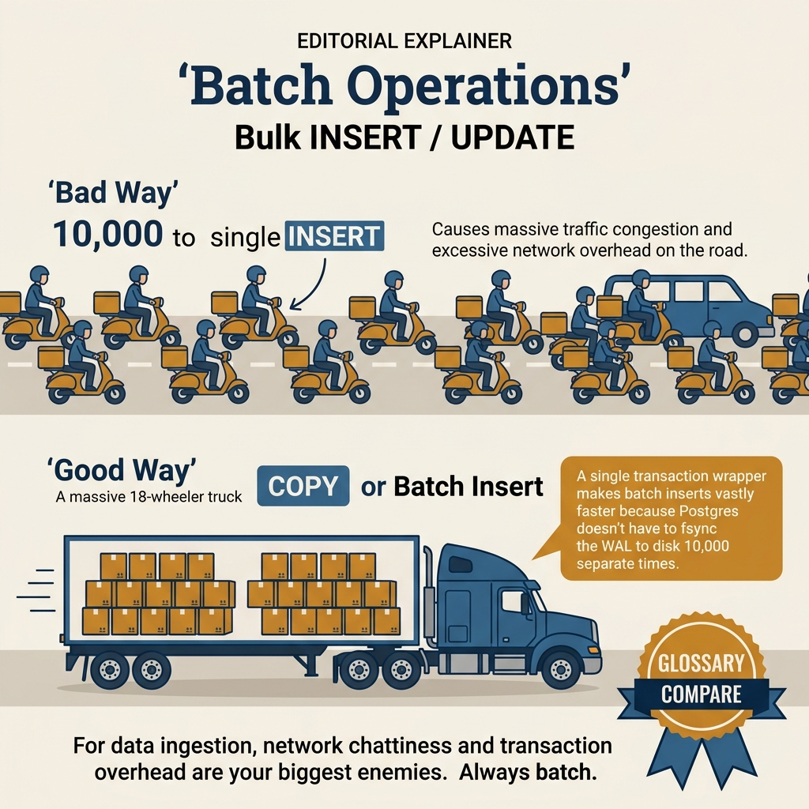
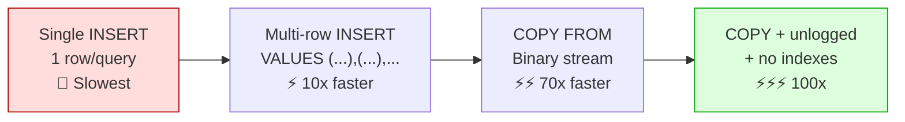

<!-- tags: sql, postgresql, database -->
# 📦 Batch Operations, COPY & Bulk Processing

> Hiệu suất INSERT/UPDATE/DELETE hàng triệu rows: multi-row INSERT, COPY protocol, batch UPDATE, UPSERT patterns — kết hợp với Go pgx.

| Aspect           | Detail                                                                                             |
| ---------------- | -------------------------------------------------------------------------------------------------- |
| **Concept**      | Bulk data loading, batch DML, COPY protocol                                                        |
| **Use case**     | ETL, data migration, batch processing, CSV import                                                  |
| **Go relevance** | pgx CopyFrom, batch operations                                                                     |
| **Reference**    | [postgresql.org/docs/current/sql-copy.html](https://www.postgresql.org/docs/current/sql-copy.html) |

---

📅 Ngày tạo: 2026-03-19 · 🔄 Cập nhật: 2026-04-04 · ⏱️ 16 phút đọc

---

## 1. DEFINE

Migration 10 triệu rows từ CSV vào PostgreSQL. Team dùng `INSERT INTO ... VALUES` qua ORM: **45 phút**. Đổi sang `COPY FROM stdin`: **38 giây** — nhanh hơn 70x. Nhưng tuần sau, bulk UPDATE 5 triệu rows cần merge — COPY không hỗ trợ UPDATE, `UPDATE ... SET` từng row qua loop = 2 giờ.

Batch operations trong PostgreSQL có nhiều gear: COPY cho bulk load, multi-row INSERT, CTE-based upsert, temp table + JOIN merge. Mỗi gear có sweet spot riêng — bài này cover từng cái và khi nào chuyển gear.


| Variant | Mô tả |
| --- | --- |
| Individual INSERT | 10,000 · ~5,000ms · 1x |
| Multi-row INSERT (1000/batch) | 10 · ~100ms · 50x |
| Prepared statement loop | 10,000 (pipelined) · ~200ms · 25x |
| pgx.Batch | 1 · ~80ms · 62x |

| Approach | Time | Space | Khi chọn |
| --- | --- | --- | --- |
| Multi — row INSERT & Batch UPDATE | Phụ thuộc cardinality | Phụ thuộc row width | Dùng để nắm baseline semantics trước khi tune planner hoặc index. |
| COPY Protocol & pgx Integration | Phụ thuộc plan | Phụ thuộc memory operator | Dùng khi query đã chạm index, cardinality hoặc join strategy. |
| ETL Pipeline with Staging + UPSERT | Phụ thuộc workload | Phụ thuộc buffer/WAL | Dùng khi workload production cần cân bằng correctness, lock và rollout. |


### Performance Comparison (10,000 rows)

| Method                        | Round-trips        | Time      | Speed    |
| ----------------------------- | ------------------ | --------- | -------- |
| Individual INSERT             | 10,000             | ~5,000ms  | 1x       |
| Multi-row INSERT (1000/batch) | 10                 | ~100ms    | 50x      |
| Prepared statement loop       | 10,000 (pipelined) | ~200ms    | 25x      |
| pgx.Batch                     | 1                  | ~80ms     | 62x      |
| **COPY protocol**             | **1**              | **~20ms** | **250x** |

### When to Use Which

| Method                    | Best for                           | Max rows/batch       |
| ------------------------- | ---------------------------------- | -------------------- |
| **Individual INSERT**     | 1-10 rows                          | N/A                  |
| **Multi-row INSERT**      | 10-10,000 rows                     | ~1,000 per statement |
| **pgx.Batch**             | Mixed operations (INSERT + UPDATE) | ~10,000 operations   |
| **COPY FROM**             | 10,000+ rows of same structure     | Unlimited            |
| **COPY FROM with FREEZE** | Initial bulk load (empty table)    | Unlimited, skips WAL |

### COPY Protocol Details

```text
Application                PostgreSQL
    │                          │
    ├── CopyIn message ───────→│
    │                          │  Begins COPY mode
    ├── Data row 1 ───────────→│
    ├── Data row 2 ───────────→│  Binary stream
    ├── Data row 3 ───────────→│  (no SQL parsing!)
    │   ...                    │
    ├── Data row N ───────────→│
    ├── CopyDone ─────────────→│
    │                          │  Commit
    │←──── CommandComplete ────│
    │                          │

✅ No SQL parsing per row → minimal overhead
✅ Binary mode → no text conversion overhead
✅ Streaming → constant memory usage
```

### Failure Modes

| Lỗi                             | Nguyên nhân                    | Fix                          |
| ------------------------------- | ------------------------------ | ---------------------------- |
| OOM on large batch              | Loading all data into memory   | Stream with COPY / batch     |
| Duplicate key error             | Constraint violation in bulk   | ON CONFLICT / pre-filter     |
| Lock contention on batch UPDATE | Too many rows locked           | Batch + SKIP LOCKED          |
| WAL bloat during bulk insert    | Each row generates WAL         | COPY FREEZE for initial load |
| Statement too large             | Multi-row INSERT > 64KB params | Split into smaller batches   |

---

Các failure mode trên nghe cơ bản. Nhưng có trap: INSERT loop 1M rows = WAL flood + 100x slower than COPY, và COPY without error handling = partial import. Trap đó sẽ xuất hiện ở PITFALLS.

## 2. VISUAL

Với Batch Operations, COPY & Bulk Processing, bảng phân loại mới chỉ giúp bạn gọi đúng tên khái niệm. Điều quan trọng hơn là nhìn xem rows, giá trị hoặc ràng buộc thực sự đổi shape như thế nào khi query chạy qua từng bước.




*Hình: 3 cấp throughput — Single INSERT (~1K/s), Multi-Value INSERT (~50K/s), COPY FROM (~500K+/s). COPY cho ETL, multi-value cho API batch, single INSERT chỉ cho CRUD đơn.*

### Level 1

```text
Source Data (CSV, API, etc.)
    │
    ▼
┌── Staging Table ─────────────────────────────┐
│  COPY FROM → staging_orders (no constraints) │
│  10M rows loaded in ~30 seconds              │
└──────────────────┬───────────────────────────┘
                   │
    ┌──────────────┼──────────────┐
    ▼              ▼              ▼
Validate       Transform      Deduplicate
(CHECK types)  (normalize)    (DISTINCT ON)
    │              │              │
    └──────────────┼──────────────┘
                   ▼
┌── Production Table ──────────────────────────┐
│  INSERT INTO orders                           │
│  SELECT * FROM staging_orders                 │
│  ON CONFLICT (external_id) DO UPDATE ...      │
│  → UPSERT with deduplication                  │
└──────────────────────────────────────────────┘
```

---

*Hình: Level 1 cho 📦 Batch Operations, COPY & Bulk Processing — nhìn vào happy path hoặc baseline heuristic trước khi đi sâu vào planner và trade-off.*

### Level 2

```text
Decision Lens                 Dấu hiệu cần nhìn                 Hướng xử lý
---------------------------  --------------------------------  -------------------------------------------
Semantics trước               Kết quả có đúng intent không?    1. Multi — row INSERT & Batch UPDATE
Planner / index signal        Cardinality, cost, buffers ra sao? 2. COPY Protocol & pgx Integration
Production pressure           Lock, WAL, lag, rollback nào đau? 3. ETL Pipeline with Staging + UPSERT
```

*Hình: Level 2 biến 📦 Batch Operations, COPY & Bulk Processing thành checklist quyết định — từ semantics, sang plan signal, rồi đến áp lực production.*


### Architecture — Batch Insert Performance Tiers



*Hình: Single INSERT = 1 round-trip/row. Multi-row = 1 round-trip/batch. COPY = binary stream, bypass SQL parser. Tắt index + unlogged table cho maximum throughput, rebuild sau.*

---
## 3. CODE

Khi flow của Batch Operations, COPY & Bulk Processing đã rõ, ta chuyển nó thành DDL, truy vấn và transaction có thể chạy thật. Ta bắt đầu từ case hẹp nhất rồi tăng dần số lượng rows, ràng buộc và biến thể.

### Problem 1: Basic — Multi-row INSERT & Batch UPDATE

> **Mục tiêu**: Efficient INSERT/UPDATE cho 100-10,000 rows
> **Cần**: PostgreSQL 9.5+ (ON CONFLICT)
> **Đạt được**: 50x faster than individual operations


```sql
-- ═══════════════════════════════════════════
-- 1. Multi-row INSERT
-- ═══════════════════════════════════════════

-- ❌ SLOW: 1000 individual INSERTs
INSERT INTO orders (user_id, amount) VALUES (1, 100);
INSERT INTO orders (user_id, amount) VALUES (2, 200);
-- ... 998 more round-trips

-- ✅ FAST: 1 statement, 1000 rows
INSERT INTO orders (user_id, amount, status) VALUES
    (1, 100.00, 'pending'),
    (2, 200.00, 'pending'),
    (3, 300.00, 'pending'),
    -- ... up to ~1000 rows
    (1000, 999.00, 'pending');
-- 1 round-trip, 1 parse, 1 execution → 50x faster!

-- ═══════════════════════════════════════════
-- 2. UPSERT (INSERT ON CONFLICT)
-- ═══════════════════════════════════════════

-- ✅ Batch upsert: insert or update
INSERT INTO products (sku, name, price, stock) VALUES
    ('SKU001', 'Widget', 9.99, 100),
    ('SKU002', 'Gadget', 19.99, 50),
    ('SKU003', 'Doohickey', 29.99, 25)
ON CONFLICT (sku) DO UPDATE SET
    name = EXCLUDED.name,
    price = EXCLUDED.price,
    stock = products.stock + EXCLUDED.stock,  -- ✅ Accumulate stock
    updated_at = now()
RETURNING id, sku, (xmax = 0) AS was_inserted;
-- was_inserted: true = new row, false = updated existing

-- ═══════════════════════════════════════════
-- 3. Batch UPDATE with VALUES
-- ═══════════════════════════════════════════

-- ❌ SLOW: individual UPDATEs
UPDATE orders SET status = 'shipped' WHERE id = 1;
UPDATE orders SET status = 'shipped' WHERE id = 2;

-- ✅ FAST: single UPDATE with VALUES
UPDATE orders
SET status = v.new_status,
    shipped_at = v.shipped_at::timestamptz
FROM (VALUES
    (1, 'shipped', '2024-06-15T10:00:00Z'),
    (2, 'shipped', '2024-06-15T10:30:00Z'),
    (3, 'delivered', '2024-06-14T15:00:00Z')
) AS v(id, new_status, shipped_at)
WHERE orders.id = v.id::bigint;

-- ═══════════════════════════════════════════
-- 4. Batch DELETE
-- ═══════════════════════════════════════════

-- ✅ Delete by IDs (array parameter from Go)
DELETE FROM sessions WHERE id = ANY($1::bigint[]);

-- ✅ Delete with subquery (batch)
WITH to_delete AS (
    SELECT id FROM sessions
    WHERE expired_at < now() - interval '30 days'
    LIMIT 10000           -- ✅ Limit batch size
    FOR UPDATE SKIP LOCKED -- ✅ Don't block concurrent access
)
DELETE FROM sessions WHERE id IN (SELECT id FROM to_delete);
```


---

COPY basics đã cover. Nhưng batch INSERT cần UNNEST — hãy bulk.

### Problem 2: Intermediate — COPY Protocol & pgx Integration

> **Mục tiêu**: Use COPY protocol cho maximum throughput
> **Cần**: pgx v5+
> **Đạt được**: 250x faster than individual INSERT


```sql
-- ═══════════════════════════════════════════
-- 1. COPY FROM (server-side)
-- ═══════════════════════════════════════════

-- ✅ Import CSV
COPY orders (user_id, amount, status, created_at)
FROM '/tmp/orders.csv'
WITH (FORMAT csv, HEADER true, DELIMITER ',');

-- ✅ Import with type casting
COPY events (event_type, user_id, payload, created_at)
FROM '/tmp/events.csv'
WITH (FORMAT csv, HEADER true, NULL '\N');

-- ═══════════════════════════════════════════
-- 2. COPY TO (export)
-- ═══════════════════════════════════════════

-- ✅ Export to CSV
COPY (SELECT id, email, created_at FROM users WHERE status = 'active')
TO '/tmp/active_users.csv'
WITH (FORMAT csv, HEADER true);

-- ✅ Export to stdout (for piping)
COPY orders TO STDOUT WITH (FORMAT csv);

-- ═══════════════════════════════════════════
-- 3. COPY FREEZE (initial load, skip WAL)
-- ═══════════════════════════════════════════

-- ✅ For empty tables only! Skips WAL → much faster
BEGIN;
TRUNCATE orders;
COPY orders FROM '/tmp/orders.csv' WITH (FORMAT csv, FREEZE true);
COMMIT;
-- ⚠️ FREEZE only works in same TX as TRUNCATE and on empty tables
```

```go
// ═══════════════════════════════════════════
// Go: COPY protocol with pgx (fastest!)
// ═══════════════════════════════════════════

// ✅ CopyFrom — bulk insert 100K+ rows
func (r *Repo) BulkInsertOrders(ctx context.Context, orders []Order) (int64, error) {
    rows := make([][]interface{}, len(orders))
    for i, o := range orders {
        rows[i] = []interface{}{
            o.UserID, o.Amount, o.Status, o.CreatedAt,
        }
    }

    count, err := r.pool.CopyFrom(ctx,
        pgx.Identifier{"orders"},                              // table name
        []string{"user_id", "amount", "status", "created_at"}, // columns
        pgx.CopyFromRows(rows),                                 // data source
    )
    return count, err
}

// ✅ CopyFrom with streaming (constant memory)
func (r *Repo) StreamInsert(ctx context.Context, ch <-chan Order) (int64, error) {
    return r.pool.CopyFrom(ctx,
        pgx.Identifier{"orders"},
        []string{"user_id", "amount", "status", "created_at"},
        pgx.CopyFromFunc(func() ([]interface{}, error) {
            order, ok := <-ch
            if !ok {
                return nil, nil // ✅ Channel closed → end of data
            }
            return []interface{}{
                order.UserID, order.Amount, order.Status, order.CreatedAt,
            }, nil
        }),
    )
}

// ═══════════════════════════════════════════
// Go: pgx.Batch for mixed operations
// ═══════════════════════════════════════════

// ✅ Batch: multiple different queries in 1 round-trip
func (r *Repo) ProcessOrderBatch(ctx context.Context, updates []OrderUpdate) error {
    batch := &pgx.Batch{}

    for _, u := range updates {
        switch u.Action {
        case "ship":
            batch.Queue(
                "UPDATE orders SET status = 'shipped', shipped_at = now() WHERE id = $1",
                u.OrderID,
            )
        case "cancel":
            batch.Queue(
                "UPDATE orders SET status = 'cancelled', cancelled_at = now() WHERE id = $1",
                u.OrderID,
            )
            batch.Queue(
                "INSERT INTO refunds (order_id, amount) VALUES ($1, $2)",
                u.OrderID, u.RefundAmount,
            )
        }
    }

    // ✅ Send all queries in 1 round-trip!
    br := r.pool.SendBatch(ctx, batch)
    defer br.Close()

    for i := 0; i < batch.Len(); i++ {
        if _, err := br.Exec(); err != nil {
            return fmt.Errorf("batch operation %d: %w", i, err)
        }
    }
    return nil
}
```

**Tại sao?** Ở mức Intermediate của Batch Operations, COPY & Bulk Processing, bài khó không còn là viết cho chạy mà là giữ đúng invariant khi dữ liệu đổi shape. Problem 2: Intermediate — COPY Protocol & pgx Integration buộc bạn nhìn xem cardinality, nullability hoặc grain của dữ liệu đang bẻ semantic đi theo hướng nào.


---

Batch INSERT đã cover. Nhưng upsert patterns cần ON CONFLICT — hãy merge.

### Problem 3: Advanced — ETL Pipeline with Staging + UPSERT

> **Mục tiêu**: Full ETL pipeline: staging → validate → upsert to production
> **Cần**: COPY + ON CONFLICT + CTE
> **Đạt được**: Production-grade data ingestion pipeline


```sql
-- ═══════════════════════════════════════════
-- 1. Create staging table (no constraints)
-- ═══════════════════════════════════════════

CREATE UNLOGGED TABLE staging_products (  -- ✅ UNLOGGED = no WAL = fast!
    external_id text,
    name        text,
    price       text,  -- text for validation
    category    text,
    raw_data    jsonb
);

-- ═══════════════════════════════════════════
-- 2. Load data via COPY
-- ═══════════════════════════════════════════

COPY staging_products (external_id, name, price, category)
FROM '/tmp/product_feed.csv'
WITH (FORMAT csv, HEADER true);
-- 500K rows loaded in ~2 seconds

-- ═══════════════════════════════════════════
-- 3. Validate + transform + upsert
-- ═══════════════════════════════════════════

WITH
-- Step 1: Validate
validated AS (
    SELECT
        external_id,
        name,
        price::numeric AS price,
        lower(trim(category)) AS category
    FROM staging_products
    WHERE external_id IS NOT NULL
      AND name IS NOT NULL
      AND price ~ '^\d+\.?\d*$'  -- Valid number format
),
-- Step 2: Deduplicate (keep latest per external_id)
deduped AS (
    SELECT DISTINCT ON (external_id) *
    FROM validated
    ORDER BY external_id, price DESC
),
-- Step 3: Upsert to production
upserted AS (
    INSERT INTO products (external_id, name, price, category, synced_at)
    SELECT external_id, name, price, category, now()
    FROM deduped
    ON CONFLICT (external_id) DO UPDATE SET
        name = EXCLUDED.name,
        price = EXCLUDED.price,
        category = EXCLUDED.category,
        synced_at = EXCLUDED.synced_at
    WHERE products.price IS DISTINCT FROM EXCLUDED.price  -- ✅ Only update if changed
       OR products.name IS DISTINCT FROM EXCLUDED.name
    RETURNING id, (xmax = 0) AS was_inserted
)
SELECT
    COUNT(*) FILTER (WHERE was_inserted) AS inserted,
    COUNT(*) FILTER (WHERE NOT was_inserted) AS updated
FROM upserted;

-- ═══════════════════════════════════════════
-- 4. Cleanup
-- ═══════════════════════════════════════════

TRUNCATE staging_products;
-- Or: DROP TABLE staging_products;
```

```go
// ✅ Go: Full ETL pipeline
func (s *ETLService) SyncProducts(ctx context.Context, csvReader io.Reader) (*SyncResult, error) {
    tx, err := s.pool.Begin(ctx)
    if err != nil {
        return nil, err
    }
    defer tx.Rollback(ctx)

    // Step 1: Create temp staging table
    _, err = tx.Exec(ctx, `
        CREATE TEMP TABLE staging_products (
            external_id text, name text, price text, category text
        ) ON COMMIT DROP
    `)
    if err != nil {
        return nil, err
    }

    // Step 2: COPY CSV data to staging
    count, err := tx.Conn().PgConn().CopyFrom(ctx,
        strings.NewReader(csvData),
        "COPY staging_products FROM STDIN WITH (FORMAT csv, HEADER true)",
    )
    slog.Info("Loaded to staging", "rows", count)

    // Step 3: Upsert to production (single SQL)
    var result SyncResult
    err = tx.QueryRow(ctx, `
        WITH validated AS (
            SELECT external_id, name, price::numeric, lower(trim(category)) AS category
            FROM staging_products
            WHERE external_id IS NOT NULL AND price ~ '^\d+\.?\d*$'
        ),
        upserted AS (
            INSERT INTO products (external_id, name, price, category, synced_at)
            SELECT *, now() FROM validated
            ON CONFLICT (external_id) DO UPDATE SET
                name = EXCLUDED.name, price = EXCLUDED.price,
                category = EXCLUDED.category, synced_at = now()
            RETURNING (xmax = 0) AS was_inserted
        )
        SELECT
            COUNT(*) FILTER (WHERE was_inserted),
            COUNT(*) FILTER (WHERE NOT was_inserted)
        FROM upserted
    `).Scan(&result.Inserted, &result.Updated)

    return &result, tx.Commit(ctx)
}
```

**Tại sao?** Khi Batch Operations, COPY & Bulk Processing đi tới mức Advanced, chi phí không còn nằm riêng trong câu lệnh mà lan sang lock time, maintenance window và rollback path. Problem 3: Advanced — ETL Pipeline with Staging + UPSERT đáng giá vì nó cho thấy một lựa chọn đẹp trên giấy có thể rất đắt trên hệ thống đang chạy.


> **✅ Đạt được**: Full ETL với staging, validation, deduplication, conditional upsert.
> **⚠️ Lưu ý**: `UNLOGGED` tables không survive crash → chỉ dùng cho staging. `CREATE TEMP TABLE ... ON COMMIT DROP` tự cleanup.

---
Bạn đã đi qua COPY, batch insert, và upsert. Bây giờ đến phần nguy hiểm: WAL flood và partial import — trap đã được setup từ đầu bài.

## 4. PITFALLS

Batch Operations, COPY & Bulk Processing thường không thất bại ở chỗ cú pháp sai, mà ở chỗ semantics bị hiểu lệch hoặc bị kéo vào ngữ cảnh production lớn hơn. Phần dưới đây gom những lỗi dễ trả giá nhất.

| # | Severity | Lỗi | Hậu quả | Fix |
| --- | --- | --- | --- | --- |
| 1 | 🔵 Minor | Individual INSERT in loop | — | Multi-row INSERT or COPY |
| 2 | 🔵 Minor | Loading all data into memory | — | Stream with COPY / CopyFromFunc |
| 3 | 🔵 Minor | UPSERT without WHERE change check | — | WHERE col IS DISTINCT FROM EXCLUDED.col |
| 4 | 🟡 Common | Batch DELETE without LIMIT | — | Lock entire table → LIMIT N FOR UPDATE SKIP LOCKED |
| 5 | 🔵 Minor | COPY without staging table | — | Bad data breaks COPY → validate in staging first |
| 6 | 🟡 Common | Forgot ANALYZE after bulk load | — | Statistics stale → planner picks wrong plan |

---
Bạn đã đi qua Batch Operations & COPY và cạm bẫy. Các resources dưới đây giúp đi sâu hơn.

## 5. REF

| Resource     | Link                                                                                                         |
| ------------ | ------------------------------------------------------------------------------------------------------------ |
| COPY         | [postgresql.org/docs/current/sql-copy.html](https://www.postgresql.org/docs/current/sql-copy.html)           |
| pgx CopyFrom | [pkg.go.dev/github.com/jackc/pgx/v5#Conn.CopyFrom](https://pkg.go.dev/github.com/jackc/pgx/v5#Conn.CopyFrom) |
| pgx Batch    | [pkg.go.dev/github.com/jackc/pgx/v5#Batch](https://pkg.go.dev/github.com/jackc/pgx/v5#Batch)                 |
| ON CONFLICT  | [postgresql.org/docs/current/sql-insert.html](https://www.postgresql.org/docs/current/sql-insert.html)       |

---

## 6. RECOMMEND

Khi những bẫy chính của Batch Operations, COPY & Bulk Processing đã hiện ra, bước tiếp theo là nối nó sang planner, maintenance hoặc topology lớn hơn để mental model không dừng ở mức cú pháp.

| Mở rộng                     | Khi nào                  | Lý do                           |
| --------------------------- | ------------------------ | ------------------------------- |
| **pg_bulkload**             | Very large initial loads | Faster than COPY for 100M+ rows |
| **Timescale parallel COPY** | Time-series data         | Parallel COPY into hypertables  |
| **Foreign Data Wrappers**   | Cross-database ETL       | `postgres_fdw`, `file_fdw`      |
| **Logical replication**     | Real-time sync           | Instead of batch ETL            |


> **Callback** — Quay lại 45 phút vs 38 giây: ORM INSERT → COPY FROM = 70x faster. Nhưng bulk UPDATE cần khác: temp table + JOIN merge, không phải COPY. Mỗi batch operation có gear riêng — bài toán quyết định gear, không phải thói quen.

---

**Liên kết**: [← DML Transactions](./03-dml-transactions.md) · [→ README](./README.md)

---

## 7. QUICK REF

| Nếu gặp | Nghĩ ngay |
| --- | --- |
| Multi — row INSERT & Batch UPDATE | Dùng pattern này khi gặp signal tương ứng trong query plan hoặc workload. |
| COPY Protocol & pgx Integration | Dùng pattern này khi gặp signal tương ứng trong query plan hoặc workload. |
| ETL Pipeline with Staging + UPSERT | Dùng pattern này khi gặp signal tương ứng trong query plan hoặc workload. |
