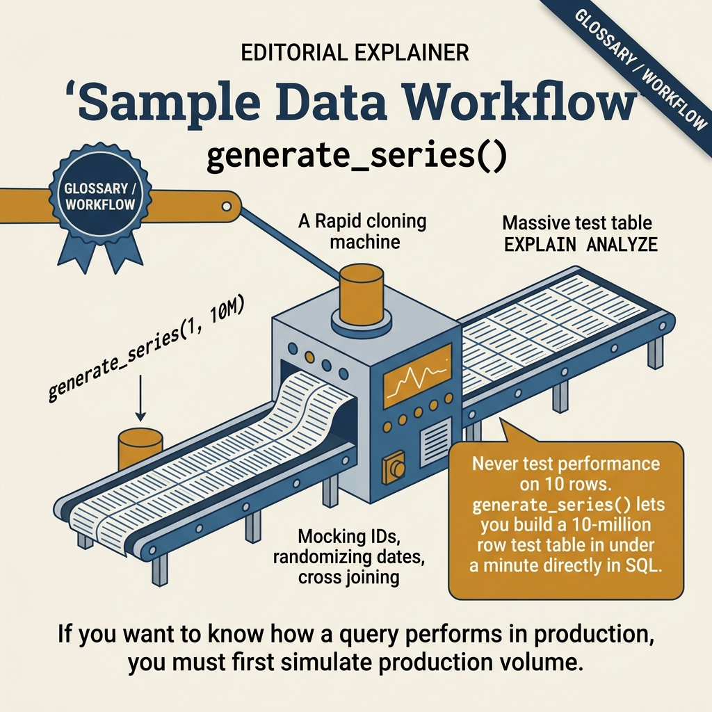
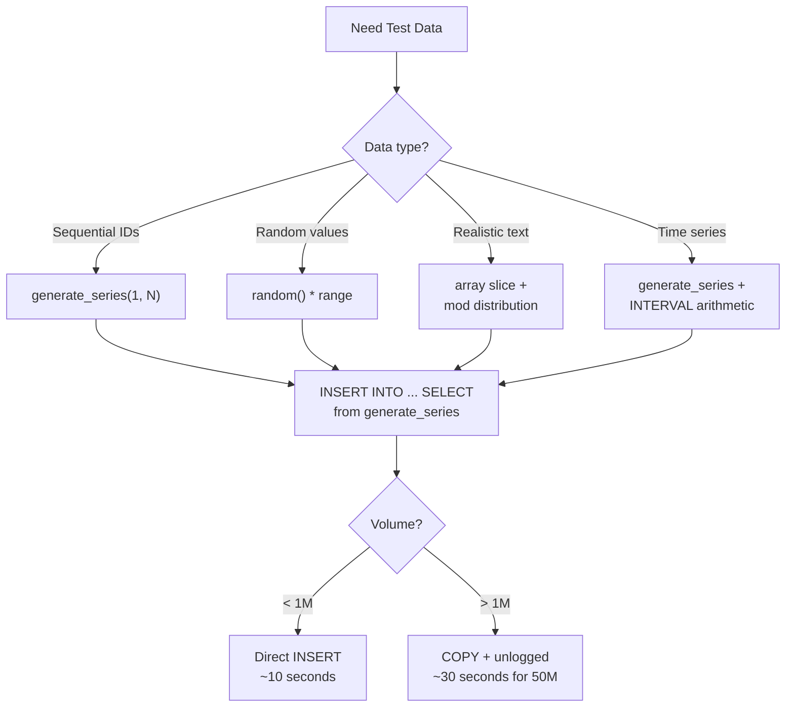

<!-- tags: sql, postgresql, database -->
# 🎲 Sample Data Generation — Random & Realistic

> Tạo dữ liệu test: từ single table đến multi-table schema (customers → orders → products → inventory) — sử dụng generate_series, random(), PL/pgSQL.

| Aspect           | Detail                                                                                                                                      |
| ---------------- | ------------------------------------------------------------------------------------------------------------------------------------------- |
| **Concept**      | generate_series, random(), string generation, FK relationships                                                                              |
| **Use case**     | Dev/test data, load testing, demo databases                                                                                                 |
| **Go relevance** | Seed scripts, test fixtures                                                                                                                 |
| **Reference**    | [neon.com/postgresql/postgresql-tutorial/postgresql-random-range](https://neon.com/postgresql/postgresql-tutorial/postgresql-random-range/) |

---

📅 Ngày tạo: 2026-03-19 · 🔄 Cập nhật: 2026-04-04 · ⏱️ 16 phút đọc

---

## 1. DEFINE

Dev test query trên local database 500 rows — chạy 2ms. Deploy production 50M rows — **8 giây**. Performance test fail vì test data quá nhỏ để trigger Seq Scan, buffer eviction, hash join fallback. Team cần 50M realistic rows nhưng production data có PII không thể clone.

`generate_series()` + `random()` + `array slicing` = PostgreSQL có thể tự generate **hàng triệu rows** realistic data trong 30 giây, không cần external tool, không cần PII. Bài này teach bạn generate data đủ realistic để benchmark plan, index, và concurrency.


| Variant | Mô tả |
| --- | --- |
| random() | Float 0.0 – 1.0 · 0.7324... |
| floor(random() * N + 1)::int | Integer 1 – N · 42 |
| (random() * (max - min) + min)::numeric(10,2) | Range decimal · 125.99 |
| md5(random()::text) | Random hex string · 'a1b2c3d4...' |

| Approach | Time | Space | Khi chọn |
| --- | --- | --- | --- |
| Single Table Random Data | Phụ thuộc cardinality | Phụ thuộc row width | Dùng để nắm baseline semantics trước khi tune planner hoặc index. |
| Multi — Table E — Commerce Schema | Phụ thuộc plan | Phụ thuộc memory operator | Dùng khi query đã chạm index, cardinality hoặc join strategy. |
| Reusable Generator Functions + Time — Series | Phụ thuộc workload | Phụ thuộc buffer/WAL | Dùng khi workload production cần cân bằng correctness, lock và rollout. |


### Random Functions

| Function                                        | Output              | Ví dụ            |
| ----------------------------------------------- | ------------------- | ---------------- |
| `random()`                                      | Float 0.0 – 1.0     | `0.7324...`      |
| `floor(random() * N + 1)::int`                  | Integer 1 – N       | `42`             |
| `(random() * (max - min) + min)::numeric(10,2)` | Range decimal       | `125.99`         |
| `md5(random()::text)`                           | Random hex string   | `'a1b2c3d4...'`  |
| `gen_random_uuid()`                             | UUID v4             | `'550e8400-...'` |
| `substr(md5(random()::text), 1, 8)`             | Short random string | `'a1b2c3d4'`     |

### Generate Series

| Variant         | Ví dụ                                                           | Output            |
| --------------- | --------------------------------------------------------------- | ----------------- |
| Integer range   | `generate_series(1, 100)`                                       | 1, 2, 3, ..., 100 |
| Date range      | `generate_series('2024-01-01'::date, '2024-12-31', '1 day')`    | Daily dates       |
| Timestamp range | `generate_series(now() - '30 days'::interval, now(), '1 hour')` | Hourly timestamps |

### Random Selection Patterns

| Pattern              | SQL                                         | Ví dụ output             |
| -------------------- | ------------------------------------------- | ------------------------ |
| Pick from array      | `(ARRAY['a','b','c'])[floor(random()*3+1)]` | `'b'`                    |
| Random row           | `ORDER BY random() LIMIT 1`                 | Any random row           |
| Weighted random      | `random() < 0.7` (70% true)                 | Boolean weighted         |
| Random date in range | `'2024-01-01'::date + (random()*365)::int`  | `'2024-08-15'`           |
| Random timestamp     | `now() - (random() * interval '365 days')`  | Random time in last year |

---

Các failure mode trên nghe quen. Nhưng có trap: generate_series + random = data distribution sai thực tế, và missing VACUUM ANALYZE sau seed = planner dùng default estimates. Trap đó sẽ xuất hiện ở PITFALLS.

## 2. VISUAL

Với Sample Data Generation — Random & Realistic, bảng phân loại mới chỉ giúp bạn gọi đúng tên khái niệm. Điều quan trọng hơn là nhìn xem rows, giá trị hoặc ràng buộc thực sự đổi shape như thế nào khi query chạy qua từng bước.




*Hình: Data generation pipeline — generate_series (foundation) → Random Data (distribution) → Bulk Seed (COPY + disable triggers) → Verify (EXPLAIN + ANALYZE). Luôn ANALYZE sau bulk seed.*

### Level 1

```text
Step 1: Categories (lookup table)
  ┌── 10 categories ──────────────────────────┐
  │ Electronics, Clothing, Books, Food, ...    │
  └───────────────────┬───────────────────────┘
                      │ FK
Step 2: Products      ▼
  ┌── 100 products ───────────────────────────┐
  │ Each → random category_id (1..10)         │
  │        random price ($1 - $999)           │
  │        random stock (0 - 500)             │
  └───────────────────┬───────────────────────┘
                      │ FK
Step 3: Customers     │
  ┌── 1000 customers ─┤─────────────────────┐
  │ Random names       │                     │
  │ Random emails      │                     │
  │ Random addresses   │                     │
  └───────────────────┬┘                     │
                      │ FK                   │ FK
Step 4: Orders        ▼                      ▼
  ┌── 10,000 orders ─────────────────────────┐
  │ Each → random customer_id (1..1000)      │
  │        random product_id (1..100)        │
  │        random quantity (1..10)            │
  │        random status (pending/paid/...)   │
  │        random date (last 2 years)        │
  └──────────────────────────────────────────┘

Step 5: Inventory (derived from orders)
  ┌── 100 inventory records ─────────────────┐
  │ stock = initial_stock - SUM(sold qty)    │
  │ Tracks reorder_level, warehouse          │
  └──────────────────────────────────────────┘
```

---

*Hình: Level 1 cho 🎲 Sample Data Generation — Random & Realistic — nhìn vào happy path hoặc baseline heuristic trước khi đi sâu vào planner và trade-off.*

### Level 2

```text
Decision Lens                 Dấu hiệu cần nhìn                 Hướng xử lý
---------------------------  --------------------------------  -------------------------------------------
Semantics trước               Kết quả có đúng intent không?    1. Single Table Random Data
Planner / index signal        Cardinality, cost, buffers ra sao? 2. Multi — Table E — Commerce Schema
Production pressure           Lock, WAL, lag, rollback nào đau? 3. Reusable Generator Functions + Time — Series
```

*Hình: Level 2 biến 🎲 Sample Data Generation — Random & Realistic thành checklist quyết định — từ semantics, sang plan signal, rồi đến áp lực production.*


### Architecture — Data Generation Strategy



*Hình: PostgreSQL tự generate millions of rows — generate_series cho sequential, random() cho distribution, array slice cho categorical. Volume > 1M dùng COPY + unlogged table.*

---
## 3. CODE

Khi flow của Sample Data Generation — Random & Realistic đã rõ, ta chuyển nó thành DDL, truy vấn và transaction có thể chạy thật. Ta bắt đầu từ case hẹp nhất rồi tăng dần số lượng rows, ràng buộc và biến thể.

### Problem 1: Basic — Single Table Random Data

> **Mục tiêu**: Tạo 10K rows cho 1 table với realistic random data
> **Cần**: PostgreSQL 14+ (`gen_random_uuid()`)
> **Đạt được**: Seed database cho development/testing


```sql
-- ═══════════════════════════════════════════
-- 1. Random integers & decimals
-- ═══════════════════════════════════════════

-- ✅ Random integer in range [min, max]
SELECT floor(random() * (100 - 1 + 1) + 1)::int AS random_1_to_100;

-- ✅ Random decimal with precision
SELECT round((random() * 999 + 1)::numeric, 2) AS random_price;  -- 1.00 - 1000.00

-- ═══════════════════════════════════════════
-- 2. Random strings & choices
-- ═══════════════════════════════════════════

-- ✅ Random name from array
SELECT (ARRAY[
    'Alice', 'Bob', 'Charlie', 'Diana', 'Eve',
    'Frank', 'Grace', 'Henry', 'Ivy', 'Jack',
    'Karen', 'Leo', 'Mia', 'Noah', 'Olivia'
])[floor(random() * 15 + 1)::int] AS random_name;

-- ✅ Random email
SELECT lower(
    substr(md5(random()::text), 1, 8) || '@' ||
    (ARRAY['gmail.com','yahoo.com','outlook.com','company.io'])[floor(random()*4+1)]
) AS random_email;

-- ✅ Random Vietnamese name (realistic)
SELECT
    (ARRAY['Nguyễn','Trần','Lê','Phạm','Hoàng','Huỳnh','Phan','Vũ','Võ','Đặng'])[floor(random()*10+1)]
    || ' ' ||
    (ARRAY['Văn','Thị','Đức','Minh','Hoàng','Thanh','Quốc','Phương','Tuấn','Anh'])[floor(random()*10+1)]
    || ' ' ||
    (ARRAY['An','Bình','Cường','Dũng','Hà','Hải','Linh','Nam','Tâm','Thắng'])[floor(random()*10+1)]
    AS random_vietnamese_name;

-- ═══════════════════════════════════════════
-- 3. Single table: Tạo 10K users
-- ═══════════════════════════════════════════

CREATE TABLE IF NOT EXISTS sample_users (
    id          bigint GENERATED ALWAYS AS IDENTITY PRIMARY KEY,
    username    text UNIQUE NOT NULL,
    email       text UNIQUE NOT NULL,
    full_name   text NOT NULL,
    age         int CHECK (age BETWEEN 18 AND 80),
    status      text NOT NULL DEFAULT 'active',
    balance     numeric(10,2) DEFAULT 0,
    created_at  timestamptz NOT NULL,
    metadata    jsonb DEFAULT '{}'
);

INSERT INTO sample_users (username, email, full_name, age, status, balance, created_at, metadata)
SELECT
    -- ✅ Unique username: prefix + sequence number
    'user_' || to_char(i, 'FM00000') AS username,

    -- ✅ Unique email
    'user' || i || '@' ||
    (ARRAY['gmail.com','yahoo.com','outlook.com','hotmail.com'])[floor(random()*4+1)]
    AS email,

    -- ✅ Random full name
    (ARRAY['Alice','Bob','Charlie','Diana','Eve','Frank','Grace','Henry','Ivy','Jack',
           'Karen','Leo','Mia','Noah','Olivia','Peter','Quinn','Rose','Sam','Tina'])[floor(random()*20+1)]
    || ' ' ||
    (ARRAY['Smith','Johnson','Williams','Brown','Jones','Garcia','Miller','Davis',
           'Rodriguez','Martinez','Anderson','Taylor','Thomas','Moore','Jackson'])[floor(random()*15+1)]
    AS full_name,

    -- ✅ Random age 18-65
    floor(random() * (65 - 18 + 1) + 18)::int AS age,

    -- ✅ Weighted status: 70% active, 20% inactive, 10% suspended
    CASE
        WHEN random() < 0.70 THEN 'active'
        WHEN random() < 0.90 THEN 'inactive'
        ELSE 'suspended'
    END AS status,

    -- ✅ Random balance $0 - $10,000
    round((random() * 10000)::numeric, 2) AS balance,

    -- ✅ Random timestamp in last 2 years
    now() - (random() * interval '730 days') AS created_at,

    -- ✅ Random JSONB metadata
    jsonb_build_object(
        'source', (ARRAY['web','mobile','api','import'])[floor(random()*4+1)],
        'verified', random() < 0.8,
        'login_count', floor(random() * 500)::int,
        'preferences', jsonb_build_object(
            'theme', (ARRAY['light','dark','auto'])[floor(random()*3+1)],
            'language', (ARRAY['vi','en','ja','ko'])[floor(random()*4+1)]
        )
    ) AS metadata

FROM generate_series(1, 10000) AS i;

-- ✅ Verify
SELECT count(*), min(created_at), max(created_at) FROM sample_users;
SELECT status, count(*), round(100.0 * count(*) / sum(count(*)) over(), 1) AS pct
FROM sample_users GROUP BY status ORDER BY count DESC;

-- ✅ Quick data preview
SELECT * FROM sample_users ORDER BY random() LIMIT 5;
```


> **✅ Output**: 10K users với realistic names, unique emails, weighted status, random metadata.
> **⚠️ Lưu ý**: `generate_series(1, N)` + column expressions = nhanh hơn loop INSERT.

---

Basic generation đã cover. Nhưng realistic distributions cần weighted random — hãy model.

### Problem 2: Intermediate — Multi-Table E-Commerce Schema

> **Mục tiêu**: Tạo schema hoàn chỉnh có FK relationships: categories → products → customers → orders → order_items
> **Cần**: PostgreSQL 14+
> **Đạt được**: Full e-commerce test database


```sql
-- ═══════════════════════════════════════════
-- 1. Schema setup
-- ═══════════════════════════════════════════

CREATE TABLE categories (
    id   int GENERATED ALWAYS AS IDENTITY PRIMARY KEY,
    name text UNIQUE NOT NULL,
    slug text UNIQUE NOT NULL
);

CREATE TABLE products (
    id          int GENERATED ALWAYS AS IDENTITY PRIMARY KEY,
    name        text NOT NULL,
    sku         text UNIQUE NOT NULL,
    category_id int REFERENCES categories(id),
    price       numeric(10,2) NOT NULL CHECK (price > 0),
    cost        numeric(10,2) NOT NULL CHECK (cost > 0),
    stock       int NOT NULL DEFAULT 0 CHECK (stock >= 0),
    weight_kg   numeric(5,2),
    status      text NOT NULL DEFAULT 'active',
    created_at  timestamptz DEFAULT now()
);

CREATE TABLE customers (
    id          int GENERATED ALWAYS AS IDENTITY PRIMARY KEY,
    first_name  text NOT NULL,
    last_name   text NOT NULL,
    email       text UNIQUE NOT NULL,
    phone       text,
    city        text,
    country     text NOT NULL DEFAULT 'VN',
    tier        text NOT NULL DEFAULT 'bronze',
    created_at  timestamptz DEFAULT now()
);

CREATE TABLE orders (
    id          bigint GENERATED ALWAYS AS IDENTITY PRIMARY KEY,
    customer_id int NOT NULL REFERENCES customers(id),
    status      text NOT NULL DEFAULT 'pending',
    total       numeric(12,2) NOT NULL DEFAULT 0,
    note        text,
    ordered_at  timestamptz NOT NULL,
    shipped_at  timestamptz,
    delivered_at timestamptz
);

CREATE TABLE order_items (
    id          bigint GENERATED ALWAYS AS IDENTITY PRIMARY KEY,
    order_id    bigint NOT NULL REFERENCES orders(id) ON DELETE CASCADE,
    product_id  int NOT NULL REFERENCES products(id),
    quantity    int NOT NULL CHECK (quantity > 0),
    unit_price  numeric(10,2) NOT NULL,
    subtotal    numeric(12,2) GENERATED ALWAYS AS (quantity * unit_price) STORED
);

CREATE TABLE inventory_log (
    id          bigint GENERATED ALWAYS AS IDENTITY PRIMARY KEY,
    product_id  int NOT NULL REFERENCES products(id),
    change_qty  int NOT NULL,
    reason      text NOT NULL,
    created_at  timestamptz DEFAULT now()
);

-- ═══════════════════════════════════════════
-- 2. Seed lookup data: Categories
-- ═══════════════════════════════════════════

INSERT INTO categories (name, slug) VALUES
    ('Electronics', 'electronics'),
    ('Clothing', 'clothing'),
    ('Books', 'books'),
    ('Home & Garden', 'home-garden'),
    ('Sports', 'sports'),
    ('Food & Drinks', 'food-drinks'),
    ('Beauty', 'beauty'),
    ('Toys', 'toys'),
    ('Automotive', 'automotive'),
    ('Health', 'health');

-- ═══════════════════════════════════════════
-- 3. Seed: 500 Products (depends on categories)
-- ═══════════════════════════════════════════

INSERT INTO products (name, sku, category_id, price, cost, stock, weight_kg, status)
SELECT
    -- ✅ Product name: adjective + noun
    (ARRAY['Premium','Classic','Ultra','Pro','Mini','Deluxe','Smart','Eco','Turbo','Lite'])[floor(random()*10+1)]
    || ' ' ||
    (ARRAY['Widget','Gadget','Device','Tool','Kit','Set','Pack','Bundle','System','Module'])[floor(random()*10+1)]
    || ' ' || to_char(i, 'FM000') AS name,

    -- ✅ Unique SKU
    'SKU-' || upper(substr(md5(i::text), 1, 4)) || '-' || to_char(i, 'FM0000') AS sku,

    -- ✅ Random category (1-10)
    floor(random() * 10 + 1)::int AS category_id,

    -- ✅ Price: $5 - $999 with cost < price
    round((random() * 994 + 5)::numeric, 2) AS price,
    round((random() * 400 + 2)::numeric, 2) AS cost,

    -- ✅ Stock: 0-500, weighted towards 50-200
    floor(random() * 500)::int AS stock,

    -- ✅ Weight: 0.1 - 30 kg
    round((random() * 29.9 + 0.1)::numeric, 2) AS weight_kg,

    -- ✅ 90% active, 10% discontinued
    CASE WHEN random() < 0.9 THEN 'active' ELSE 'discontinued' END AS status

FROM generate_series(1, 500) AS i;

-- ═══════════════════════════════════════════
-- 4. Seed: 2000 Customers
-- ═══════════════════════════════════════════

INSERT INTO customers (first_name, last_name, email, phone, city, country, tier, created_at)
SELECT
    (ARRAY['An','Bình','Cường','Dũng','Giang','Hà','Hải','Hương','Lan','Linh',
           'Long','Mai','Minh','Nam','Phương','Quân','Sơn','Thảo','Trang','Tuấn'])[floor(random()*20+1)],

    (ARRAY['Nguyễn','Trần','Lê','Phạm','Hoàng','Huỳnh','Phan','Vũ','Đặng','Bùi',
           'Đỗ','Hồ','Ngô','Dương','Lý'])[floor(random()*15+1)],

    'customer' || i || '@' ||
    (ARRAY['gmail.com','yahoo.com','outlook.com','company.vn'])[floor(random()*4+1)],

    -- ✅ Vietnamese phone format
    '0' || (ARRAY['90','91','93','94','96','97','98','32','33','34'])[floor(random()*10+1)]
    || lpad(floor(random() * 10000000)::text, 7, '0'),

    -- ✅ Vietnamese cities
    (ARRAY['Hà Nội','TP.HCM','Đà Nẵng','Hải Phòng','Cần Thơ',
           'Nha Trang','Huế','Vũng Tàu','Đà Lạt','Quy Nhơn'])[floor(random()*10+1)],

    -- ✅ 90% VN, 10% other
    CASE WHEN random() < 0.9 THEN 'VN'
         ELSE (ARRAY['US','JP','KR','SG','TH'])[floor(random()*5+1)]
    END,

    -- ✅ Tier: 50% bronze, 30% silver, 15% gold, 5% platinum
    CASE
        WHEN random() < 0.50 THEN 'bronze'
        WHEN random() < 0.80 THEN 'silver'
        WHEN random() < 0.95 THEN 'gold'
        ELSE 'platinum'
    END,

    -- ✅ Created in last 3 years
    now() - (random() * interval '1095 days')

FROM generate_series(1, 2000) AS i;

-- ═══════════════════════════════════════════
-- 5. Seed: 50,000 Orders (depends on customers)
-- ═══════════════════════════════════════════

INSERT INTO orders (customer_id, status, ordered_at, shipped_at, delivered_at, note)
SELECT
    -- ✅ Random customer (1-2000), biased towards active customers
    floor(random() * 2000 + 1)::int AS customer_id,

    -- ✅ Order status pipeline
    v_status,

    -- ✅ Ordered in last 2 years
    v_ordered_at,

    -- ✅ Shipped 1-5 days after order (if applicable)
    CASE WHEN v_status IN ('shipped','delivered') THEN
        v_ordered_at + (floor(random() * 5 + 1) || ' days')::interval
    END,

    -- ✅ Delivered 3-14 days after shipping (if applicable)
    CASE WHEN v_status = 'delivered' THEN
        v_ordered_at + (floor(random() * 14 + 4) || ' days')::interval
    END,

    -- ✅ 20% have notes
    CASE WHEN random() < 0.2 THEN
        (ARRAY['Giao giờ hành chính','Gọi trước khi giao','Để ở sảnh',
               'Giao cuối tuần','Đóng gói cẩn thận','Gift wrapping'])[floor(random()*6+1)]
    END

FROM generate_series(1, 50000) AS i
CROSS JOIN LATERAL (
    SELECT
        now() - (random() * interval '730 days') AS v_ordered_at,
        CASE
            WHEN random() < 0.05 THEN 'pending'
            WHEN random() < 0.10 THEN 'processing'
            WHEN random() < 0.15 THEN 'shipped'
            WHEN random() < 0.20 THEN 'cancelled'
            WHEN random() < 0.25 THEN 'refunded'
            ELSE 'delivered'
        END AS v_status
) AS vars;

-- ═══════════════════════════════════════════
-- 6. Seed: Order Items (1-5 items per order)
-- ═══════════════════════════════════════════

INSERT INTO order_items (order_id, product_id, quantity, unit_price)
SELECT
    o.id AS order_id,
    p.id AS product_id,
    floor(random() * 5 + 1)::int AS quantity,
    p.price AS unit_price
FROM orders o
CROSS JOIN LATERAL (
    -- ✅ Each order gets 1-5 random products
    SELECT id, price FROM products
    WHERE status = 'active'
    ORDER BY random()
    LIMIT floor(random() * 5 + 1)::int
) p;

-- ═══════════════════════════════════════════
-- 7. Update order totals from items
-- ═══════════════════════════════════════════

UPDATE orders o SET total = (
    SELECT COALESCE(SUM(subtotal), 0) FROM order_items WHERE order_id = o.id
);

-- ✅ Quick verification
SELECT 'categories' AS tbl, count(*) FROM categories
UNION ALL SELECT 'products', count(*) FROM products
UNION ALL SELECT 'customers', count(*) FROM customers
UNION ALL SELECT 'orders', count(*) FROM orders
UNION ALL SELECT 'order_items', count(*) FROM order_items;
```

**Tại sao?** Ở mức Intermediate của Sample Data Generation — Random & Realistic, bài khó không còn là viết cho chạy mà là giữ đúng invariant khi dữ liệu đổi shape. Problem 2: Intermediate — Multi-Table E-Commerce Schema buộc bạn nhìn xem cardinality, nullability hoặc grain của dữ liệu đang bẻ semantic đi theo hướng nào.


> **✅ Output**: 10 categories → 500 products → 2000 customers → 50K orders → ~150K order_items.
> **⚠️ Lưu ý**: `CROSS JOIN LATERAL` cho phép reference values từ row trước trong subquery.

---

Distributions đã cover. Nhưng cross-table referential integrity cần FK awareness — hãy link.

### Problem 3: Advanced — Reusable Generator Functions + Time-Series

> **Mục tiêu**: PL/pgSQL functions để tái sử dụng, time-series data, inventory movement
> **Cần**: PL/pgSQL, generate_series
> **Đạt được**: Production-quality seed scripts


```sql
-- ═══════════════════════════════════════════
-- 1. Reusable helper functions
-- ═══════════════════════════════════════════

-- ✅ Random element from array (generic)
CREATE OR REPLACE FUNCTION random_choice(choices anyarray)
RETURNS anyelement AS $$
    SELECT choices[floor(random() * array_length(choices, 1) + 1)::int];
$$ LANGUAGE sql VOLATILE;

-- ✅ Random integer in range [lo, hi]
CREATE OR REPLACE FUNCTION random_int(lo int, hi int)
RETURNS int AS $$
    SELECT floor(random() * (hi - lo + 1) + lo)::int;
$$ LANGUAGE sql VOLATILE;

-- ✅ Random numeric in range [lo, hi] with precision
CREATE OR REPLACE FUNCTION random_numeric(lo numeric, hi numeric, scale int DEFAULT 2)
RETURNS numeric AS $$
    SELECT round((random() * (hi - lo) + lo)::numeric, scale);
$$ LANGUAGE sql VOLATILE;

-- ✅ Random timestamp in range
CREATE OR REPLACE FUNCTION random_timestamp(
    from_ts timestamptz DEFAULT now() - interval '1 year',
    to_ts   timestamptz DEFAULT now()
) RETURNS timestamptz AS $$
    SELECT from_ts + random() * (to_ts - from_ts);
$$ LANGUAGE sql VOLATILE;

-- ✅ Random Vietnamese name
CREATE OR REPLACE FUNCTION random_vn_name()
RETURNS text AS $$
    SELECT
        random_choice(ARRAY['Nguyễn','Trần','Lê','Phạm','Hoàng','Vũ','Đặng','Bùi','Đỗ','Hồ'])
        || ' ' ||
        random_choice(ARRAY['Văn','Thị','Đức','Minh','Hoàng','Thanh','Quốc','Tuấn','Anh','Phương'])
        || ' ' ||
        random_choice(ARRAY['An','Bình','Cường','Dũng','Hà','Hải','Linh','Nam','Tâm','Trang']);
$$ LANGUAGE sql VOLATILE;

-- ✅ Usage examples
SELECT random_choice(ARRAY['red','green','blue']);     -- → 'green'
SELECT random_int(1, 100);                              -- → 42
SELECT random_numeric(9.99, 999.99);                    -- → 456.78
SELECT random_timestamp();                               -- → 2024-08-15 14:30:00+07
SELECT random_vn_name();                                 -- → 'Trần Thị Linh'

-- ═══════════════════════════════════════════
-- 2. Generator function: complete schema seed
-- ═══════════════════════════════════════════

CREATE OR REPLACE PROCEDURE seed_ecommerce(
    p_products   int DEFAULT 100,
    p_customers  int DEFAULT 500,
    p_orders     int DEFAULT 5000,
    INOUT p_summary jsonb DEFAULT '{}'
)
LANGUAGE plpgsql AS $$
DECLARE
    v_start timestamptz := clock_timestamp();
BEGIN
    -- Step 1: Products
    INSERT INTO products (name, sku, category_id, price, cost, stock, status)
    SELECT
        random_choice(ARRAY['Ultra','Pro','Mini','Smart','Eco','Turbo']) || ' ' ||
        random_choice(ARRAY['Widget','Gadget','Tool','Kit','Module']) || ' ' || i,
        'SKU-' || to_char(i, 'FM00000'),
        random_int(1, (SELECT count(*) FROM categories)::int),
        random_numeric(5, 999),
        random_numeric(2, 400),
        random_int(0, 500),
        CASE WHEN random() < 0.9 THEN 'active' ELSE 'discontinued' END
    FROM generate_series(1, p_products) i
    ON CONFLICT (sku) DO NOTHING;

    -- Step 2: Customers
    INSERT INTO customers (first_name, last_name, email, phone, city, tier, created_at)
    SELECT
        random_choice(ARRAY['An','Bình','Hà','Linh','Minh','Nam','Trang','Tuấn']),
        random_choice(ARRAY['Nguyễn','Trần','Lê','Phạm','Hoàng','Vũ']),
        'cust' || i || '@test.com',
        '09' || lpad(floor(random()*100000000)::text, 8, '0'),
        random_choice(ARRAY['Hà Nội','TP.HCM','Đà Nẵng','Cần Thơ','Nha Trang']),
        random_choice(ARRAY['bronze','bronze','silver','silver','gold','platinum']),
        random_timestamp(now() - interval '3 years', now())
    FROM generate_series(1, p_customers) i
    ON CONFLICT (email) DO NOTHING;

    -- Step 3: Orders + Items
    INSERT INTO orders (customer_id, status, total, ordered_at)
    SELECT
        random_int(1, p_customers),
        random_choice(ARRAY['pending','processing','shipped','delivered','delivered','delivered','cancelled']),
        0,
        random_timestamp(now() - interval '2 years', now())
    FROM generate_series(1, p_orders);

    -- Step 4: Order items (1-4 per order)
    INSERT INTO order_items (order_id, product_id, quantity, unit_price)
    SELECT o.id, p.id, random_int(1, 5), p.price
    FROM orders o
    CROSS JOIN LATERAL (
        SELECT id, price FROM products WHERE status = 'active'
        ORDER BY random() LIMIT random_int(1, 4)
    ) p
    WHERE o.total = 0;  -- Only new orders

    -- Step 5: Update totals
    UPDATE orders SET total = (
        SELECT COALESCE(SUM(subtotal), 0) FROM order_items WHERE order_id = orders.id
    ) WHERE total = 0;

    COMMIT;

    p_summary := jsonb_build_object(
        'products', (SELECT count(*) FROM products),
        'customers', (SELECT count(*) FROM customers),
        'orders', (SELECT count(*) FROM orders),
        'order_items', (SELECT count(*) FROM order_items),
        'duration_ms', extract(millisecond FROM clock_timestamp() - v_start)::int
    );

    RAISE NOTICE 'Seed complete: %', p_summary;
END;
$$;

-- ✅ Run seed
CALL seed_ecommerce(500, 2000, 50000);

-- ═══════════════════════════════════════════
-- 3. Time-series data generation
-- ═══════════════════════════════════════════

CREATE TABLE metrics (
    ts          timestamptz NOT NULL,
    host        text NOT NULL,
    cpu_pct     numeric(5,2) NOT NULL,
    mem_pct     numeric(5,2) NOT NULL,
    disk_io     int NOT NULL,
    connections int NOT NULL
);

-- ✅ Generate 1 year of metrics, every 5 minutes, 3 hosts
INSERT INTO metrics (ts, host, cpu_pct, mem_pct, disk_io, connections)
SELECT
    ts,
    host,
    -- ✅ CPU: sine wave + noise (simulates daily pattern)
    LEAST(100, GREATEST(0,
        50 + 30 * sin(extract(hour FROM ts) * pi() / 12)  -- Daily pattern
        + (random() * 20 - 10)                              -- Noise
    ))::numeric(5,2),
    -- ✅ Memory: gradually increasing with resets
    (40 + 30 * (extract(epoch FROM ts - date_trunc('week', ts)) /
                extract(epoch FROM interval '7 days'))
     + random() * 10)::numeric(5,2),
    -- ✅ Disk I/O: random spikes
    CASE WHEN random() < 0.05  -- 5% chance of spike
        THEN random_int(5000, 20000)
        ELSE random_int(100, 2000)
    END,
    -- ✅ Connections: business hours pattern
    CASE
        WHEN extract(hour FROM ts) BETWEEN 9 AND 18 THEN random_int(50, 200)
        ELSE random_int(5, 30)
    END
FROM generate_series(
    now() - interval '30 days',
    now(),
    interval '5 minutes'
) ts
CROSS JOIN (VALUES ('web-01'), ('web-02'), ('db-01')) AS hosts(host);

-- ✅ Verify: ~26K rows per host (30 days × 288 intervals/day × 3 hosts)
SELECT host, count(*), min(ts), max(ts), avg(cpu_pct)::numeric(5,2)
FROM metrics GROUP BY host;

-- ═══════════════════════════════════════════
-- 4. Cleanup utility
-- ═══════════════════════════════════════════

-- ✅ Drop all sample data (safe cleanup)
CREATE OR REPLACE PROCEDURE drop_sample_data()
LANGUAGE plpgsql AS $$
BEGIN
    DROP TABLE IF EXISTS order_items CASCADE;
    DROP TABLE IF EXISTS orders CASCADE;
    DROP TABLE IF EXISTS inventory_log CASCADE;
    DROP TABLE IF EXISTS customers CASCADE;
    DROP TABLE IF EXISTS products CASCADE;
    DROP TABLE IF EXISTS categories CASCADE;
    DROP TABLE IF EXISTS sample_users CASCADE;
    DROP TABLE IF EXISTS metrics CASCADE;
    DROP FUNCTION IF EXISTS random_choice, random_int, random_numeric,
        random_timestamp, random_vn_name CASCADE;
    RAISE NOTICE 'All sample data dropped';
END;
$$;
```

```go
// ✅ Go: Run seed script programmatically
func (r *Repo) SeedDatabase(ctx context.Context, opts SeedOptions) (*SeedResult, error) {
    var summary json.RawMessage
    err := r.pool.QueryRow(ctx,
        `CALL seed_ecommerce($1, $2, $3, $4)`,
        opts.Products, opts.Customers, opts.Orders, nil,
    ).Scan(&summary)
    if err != nil {
        return nil, fmt.Errorf("seed: %w", err)
    }
    var result SeedResult
    json.Unmarshal(summary, &result)
    return &result, nil
}

// ✅ Go: Test fixture with cleanup
func setupTestDB(t *testing.T, pool *pgxpool.Pool) {
    t.Helper()
    ctx := context.Background()

    _, err := pool.Exec(ctx, `CALL seed_ecommerce(10, 20, 100)`)
    require.NoError(t, err)

    t.Cleanup(func() {
        pool.Exec(ctx, `CALL drop_sample_data()`)
    })
}
```

**Tại sao?** Khi Sample Data Generation — Random & Realistic đi tới mức Advanced, chi phí không còn nằm riêng trong câu lệnh mà lan sang lock time, maintenance window và rollback path. Problem 3: Advanced — Reusable Generator Functions + Time-Series đáng giá vì nó cho thấy một lựa chọn đẹp trên giấy có thể rất đắt trên hệ thống đang chạy.


> **✅ Đạt được**: Reusable generator functions, multi-table seeding, time-series with realistic patterns.
> **⚠️ Lưu ý**: `random_choice()` dùng `VOLATILE` — mỗi row gọi sẽ cho kết quả khác.

---
Bạn đã đi qua generation, distributions, và referential integrity. Bây giờ đến phần nguy hiểm: skewed data và stale statistics — trap đã được setup từ đầu bài.

## 4. PITFALLS

Sample Data Generation — Random & Realistic thường không thất bại ở chỗ cú pháp sai, mà ở chỗ semantics bị hiểu lệch hoặc bị kéo vào ngữ cảnh production lớn hơn. Phần dưới đây gom những lỗi dễ trả giá nhất.

| # | Severity | Lỗi | Hậu quả | Fix |
| --- | --- | --- | --- | --- |
| 1 | 🟡 Common | Duplicate unique values | — | ON CONFLICT DO NOTHING hoặc append sequence number |
| 2 | 🔵 Minor | FK violation | — | Insert parent tables TRƯỚC child tables |
| 3 | 🔵 Minor | random() cùng value mỗi row | — | Dùng VOLATILE function, không cache |
| 4 | 🔵 Minor | OOM với generate_series lớn | — | PG handles streaming — OK cho millions |
| 5 | 🔵 Minor | No ANALYZE after seed | — | Query planner dùng sai plan → ANALYZE sau khi seed |
| 6 | 🔵 Minor | Seed in production | — | Always guard with IF current_database() != 'production' |

---
Bạn đã đi qua Sample Data Generation và cạm bẫy. Các resources dưới đây giúp đi sâu hơn.

## 5. REF

| Resource        | Link                                                                                                                                        |
| --------------- | ------------------------------------------------------------------------------------------------------------------------------------------- |
| generate_series | [postgresql.org/docs/current/functions-srf.html](https://www.postgresql.org/docs/current/functions-srf.html)                                |
| random()        | [postgresql.org/docs/current/functions-math.html](https://www.postgresql.org/docs/current/functions-math.html)                              |
| Random range    | [neon.com/postgresql/postgresql-tutorial/postgresql-random-range](https://neon.com/postgresql/postgresql-tutorial/postgresql-random-range/) |
| gen_random_uuid | [postgresql.org/docs/current/functions-uuid.html](https://www.postgresql.org/docs/current/functions-uuid.html)                              |

---

## 6. RECOMMEND

Khi những bẫy chính của Sample Data Generation — Random & Realistic đã hiện ra, bước tiếp theo là nối nó sang planner, maintenance hoặc topology lớn hơn để mental model không dừng ở mức cú pháp.

| Tool               | Mô tả                                                    |
| ------------------ | -------------------------------------------------------- |
| **pgbench**        | Built-in PostgreSQL benchmarking with custom scripts     |
| **Faker (Python)** | Generate locale-aware fake data                          |
| **go-faker**       | Go library for realistic test data                       |
| **pg_sample**      | Sample production data while preserving FK relationships |


> **Callback** — Quay lại 2ms local vs 8 giây production: 500 rows vs 50M rows = benchmark vô nghĩa. `generate_series(1, 50000000)` + random distribution → test data đủ realistic để trigger đúng scan type, join strategy, buffer eviction pattern.

---

← Previous: [11-indexes.md](./11-indexes.md) · → Next: [14-grouping-aggregation.md](./14-grouping-aggregation.md)

---

## 7. QUICK REF

| Nếu gặp | Nghĩ ngay |
| --- | --- |
| Single Table Random Data | Dùng pattern này khi gặp signal tương ứng trong query plan hoặc workload. |
| Multi — Table E — Commerce Schema | Dùng pattern này khi gặp signal tương ứng trong query plan hoặc workload. |
| Reusable Generator Functions + Time — Series | Dùng pattern này khi gặp signal tương ứng trong query plan hoặc workload. |
