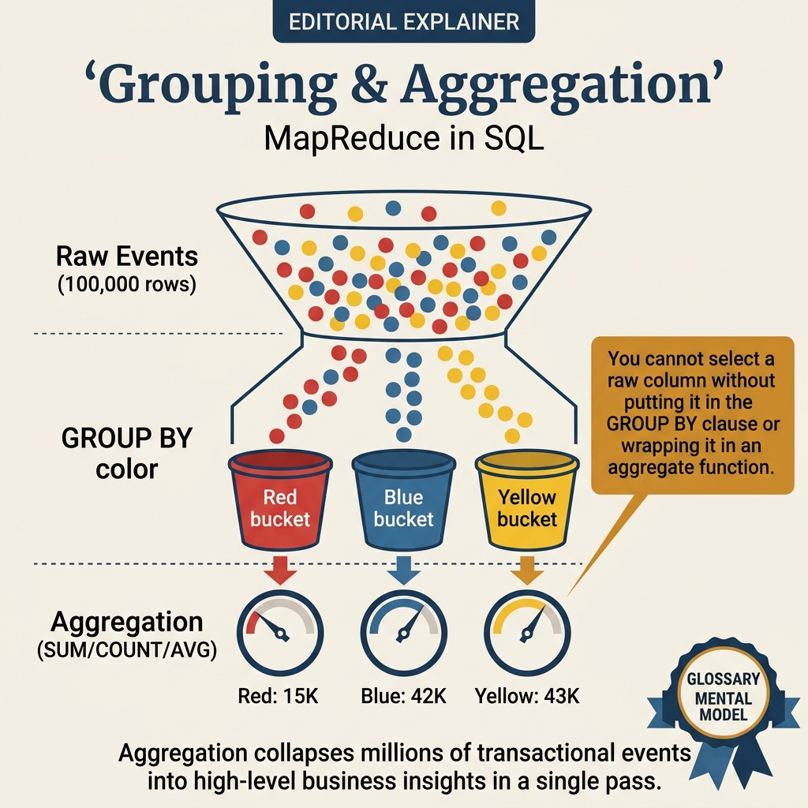
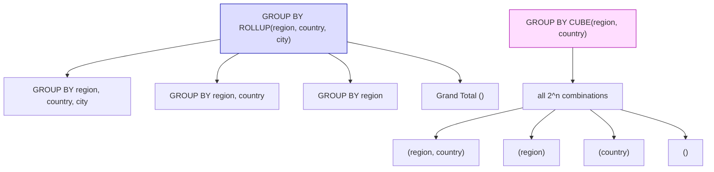

<!-- tags: sql, postgresql, database -->
# 📊 Grouping, Aggregation, Set Operations & Rollups

> GROUP BY, HAVING, aggregate functions (SUM/AVG/COUNT), UNION/INTERSECT/EXCEPT, GROUPING SETS, CUBE, ROLLUP — nền tảng cho báo cáo và analytics.

| Aspect            | Detail                                                            |
| ----------------- | ----------------------------------------------------------------- |
| **Concept**       | Aggregate functions, GROUP BY, Set Operations, Rollups            |
| **Use case**      | Reports, dashboards, analytics, data aggregation                  |
| **Go relevance**  | pgx query → scan aggregated results                               |
| **Neon Tutorial** | Sections 4 (Grouping), 5 (Set Ops), 6 (Grouping Sets/Cube/Rollup) |

---

📅 Ngày tạo: 2026-03-19 · 🔄 Cập nhật: 2026-04-04 · ⏱️ 14 phút đọc

---

## 1. DEFINE

Finance team yêu cầu: report doanh thu theo `region → country → city` kèm subtotal mỗi level. Developer viết 4 queries riêng: tổng toàn bộ, GROUP BY region, GROUP BY region+country, GROUP BY region+country+city. Kết quả: 4 round-trips, 4 Seq Scans trên cùng bảng 20M rows.

Một câu `GROUP BY ROLLUP(region, country, city)` trả về **tất cả level trong một query**. CUBE, GROUPING SETS, ROLLUP biến 4 queries thành 1 — planner scan bảng đúng một lần.


| Variant | Mô tả |
| --- | --- |
| COUNT(*) | Đếm tất cả rows · Includes NULL rows |
| COUNT(col) | Đếm non-NULL values · Skips NULL |
| COUNT(DISTINCT col) | Unique non-NULL values · Skips NULL |
| SUM(col) | Tổng · Skips NULL |

| Approach | Time | Space | Khi chọn |
| --- | --- | --- | --- |
| GROUP BY, HAVING, Aggregate Functions | Phụ thuộc cardinality | Phụ thuộc row width | Dùng để nắm baseline semantics trước khi tune planner hoặc index. |
| Set Operations & GROUPING SETS | Phụ thuộc plan | Phụ thuộc memory operator | Dùng khi query đã chạm index, cardinality hoặc join strategy. |
| Dashboard Queries & Performance | Phụ thuộc workload | Phụ thuộc buffer/WAL | Dùng khi workload production cần cân bằng correctness, lock và rollout. |


### Aggregate Functions

| Function                         | Mô tả                   | NULL handling      |
| -------------------------------- | ----------------------- | ------------------ |
| `COUNT(*)`                       | Đếm tất cả rows         | Includes NULL rows |
| `COUNT(col)`                     | Đếm non-NULL values     | Skips NULL         |
| `COUNT(DISTINCT col)`            | Unique non-NULL values  | Skips NULL         |
| `SUM(col)`                       | Tổng                    | Skips NULL         |
| `AVG(col)`                       | Trung bình              | Skips NULL         |
| `MIN(col)` / `MAX(col)`          | Min / Max               | Skips NULL         |
| `BOOL_AND(col)` / `BOOL_OR(col)` | All true / Any true     | Logic              |
| `STRING_AGG(col, sep)`           | Concatenate strings     | Skips NULL         |
| `ARRAY_AGG(col)`                 | Collect into array      | Includes NULL      |
| `JSON_AGG(col)`                  | Collect into JSON array | Includes NULL      |
| `PERCENTILE_CONT(0.5)`           | Median (interpolated)   | Ordered-set        |
| `PERCENTILE_DISC(0.5)`           | Median (exact value)    | Ordered-set        |

### GROUP BY Rules

```text
✅ OK: all non-aggregated columns in SELECT must be in GROUP BY
  SELECT city, status, COUNT(*) FROM users GROUP BY city, status;

❌ ERROR: 'email' not in GROUP BY
  SELECT email, COUNT(*) FROM users GROUP BY city;
  → ERROR: column "email" must appear in GROUP BY clause

✅ Shortcut: GROUP BY position (PG extension)
  SELECT city, COUNT(*) FROM users GROUP BY 1;
  → Groups by 1st column (city)
```

### Set Operations

| Operation   | Mô tả                      | Duplicates | NULL        |
| ----------- | -------------------------- | ---------- | ----------- |
| `UNION`     | Combine, remove duplicates | Removed    | NULL = NULL |
| `UNION ALL` | Combine, keep all          | Kept       | N/A         |
| `INTERSECT` | Common rows only           | Removed    | NULL = NULL |
| `EXCEPT`    | First minus second         | Removed    | NULL = NULL |

### GROUPING SETS / CUBE / ROLLUP

| Feature                          | Equivalent                            | Use case                  |
| -------------------------------- | ------------------------------------- | ------------------------- |
| `GROUPING SETS ((a,b), (a), ())` | 3 separate GROUP BY queries           | Custom aggregation levels |
| `ROLLUP (a, b)`                  | `GROUPING SETS ((a,b), (a), ())`      | Hierarchical subtotals    |
| `CUBE (a, b)`                    | `GROUPING SETS ((a,b), (a), (b), ())` | All combinations          |

---

Các failure mode trên nghe rõ. Nhưng có trap: GROUP BY expression sai = wrong aggregation level, và HAVING filter quá rộng = missing data. Trap đó sẽ xuất hiện ở PITFALLS.

## 2. VISUAL

Với Grouping, Aggregation, Set Operations & Rollups, bảng phân loại mới chỉ giúp bạn gọi đúng tên khái niệm. Điều quan trọng hơn là nhìn xem rows, giá trị hoặc ràng buộc thực sự đổi shape như thế nào khi query chạy qua từng bước.




*Hình: GROUP BY mental model — Partition (GROUP BY) → Aggregate (COUNT/SUM/AVG) → HAVING filter → Advanced (CUBE/ROLLUP/GROUPING SETS). WHERE filter rows, HAVING filter groups.*

### Level 1

```text
Data: orders(region, city, amount)

ROLLUP(region, city) produces:

Level 0: GROUP BY region, city     → Detail: Hà Nội - Ba Đình: 500
                                             Hà Nội - Hoàn Kiếm: 300
Level 1: GROUP BY region            → Subtotal: Hà Nội: 800
                                                TP.HCM: 1200
Level 2: () — grand total          → Total: 2000

┌─────────┬──────────┬─────────┐
│ region  │ city     │ total   │
├─────────┼──────────┼─────────┤
│ Hà Nội  │ Ba Đình  │  500    │ ← detail
│ Hà Nội  │ Hoàn Kiếm│  300    │ ← detail
│ Hà Nội  │ NULL     │  800    │ ← subtotal (region)
│ TP.HCM  │ Q1       │  700    │ ← detail
│ TP.HCM  │ Q7       │  500    │ ← detail
│ TP.HCM  │ NULL     │ 1200    │ ← subtotal (region)
│ NULL    │ NULL     │ 2000    │ ← grand total
└─────────┴──────────┴─────────┘
```

---

*Hình: Level 1 cho 📊 Grouping, Aggregation, Set Operations & Rollups — nhìn vào happy path hoặc baseline heuristic trước khi đi sâu vào planner và trade-off.*

### Level 2

```text
Decision Lens                 Dấu hiệu cần nhìn                 Hướng xử lý
---------------------------  --------------------------------  -------------------------------------------
Semantics trước               Kết quả có đúng intent không?    1. GROUP BY, HAVING, Aggregate Functions
Planner / index signal        Cardinality, cost, buffers ra sao? 2. Set Operations & GROUPING SETS
Production pressure           Lock, WAL, lag, rollback nào đau? 3. Dashboard Queries & Performance
```

*Hình: Level 2 biến 📊 Grouping, Aggregation, Set Operations & Rollups thành checklist quyết định — từ semantics, sang plan signal, rồi đến áp lực production.*


### Architecture — ROLLUP, CUBE, GROUPING SETS



*Hình: ROLLUP = hierarchical subtotals (n+1 levels). CUBE = all combinations (2^n groupings). GROUPING SETS = explicit custom combinations. Tất cả trong 1 query, 1 scan.*

---
## 3. CODE

Khi flow của Grouping, Aggregation, Set Operations & Rollups đã rõ, ta chuyển nó thành DDL, truy vấn và transaction có thể chạy thật. Ta bắt đầu từ case hẹp nhất rồi tăng dần số lượng rows, ràng buộc và biến thể.

### Problem 1: Basic — GROUP BY, HAVING, Aggregate Functions

> **Mục tiêu**: Aggregate data, filter groups, format reports
> **Cần**: PostgreSQL 14+
> **Đạt được**: Solid grouping & aggregation skills


```sql
-- ═══════════════════════════════════════════
-- 1. Basic GROUP BY + aggregates
-- ═══════════════════════════════════════════

-- ✅ Orders per customer
SELECT customer_id, COUNT(*) AS order_count, SUM(total) AS total_spent
FROM orders
GROUP BY customer_id
ORDER BY total_spent DESC
LIMIT 10;

-- ✅ Monthly revenue
SELECT
    date_trunc('month', ordered_at) AS month,
    COUNT(*) AS orders,
    SUM(total) AS revenue,
    AVG(total)::numeric(10,2) AS avg_order,
    MAX(total) AS max_order
FROM orders
WHERE status = 'delivered'
GROUP BY date_trunc('month', ordered_at)
ORDER BY month;

-- ═══════════════════════════════════════════
-- 2. HAVING — filter groups
-- ═══════════════════════════════════════════

-- ✅ Customers who spent > $1000
SELECT customer_id, SUM(total) AS total_spent, COUNT(*) AS orders
FROM orders
WHERE status != 'cancelled'
GROUP BY customer_id
HAVING SUM(total) > 1000
ORDER BY total_spent DESC;

-- ✅ Products ordered more than 100 times
SELECT p.name, COUNT(oi.id) AS times_ordered, SUM(oi.quantity) AS total_qty
FROM order_items oi
JOIN products p ON p.id = oi.product_id
GROUP BY p.id, p.name
HAVING COUNT(oi.id) > 100
ORDER BY times_ordered DESC;

-- ═══════════════════════════════════════════
-- 3. Advanced aggregates
-- ═══════════════════════════════════════════

-- ✅ STRING_AGG — concatenate
SELECT customer_id,
    STRING_AGG(DISTINCT status, ', ' ORDER BY status) AS all_statuses
FROM orders GROUP BY customer_id LIMIT 5;
-- → customer_id | all_statuses
-- →           1 | cancelled, delivered, pending

-- ✅ ARRAY_AGG — collect into array
SELECT category_id,
    ARRAY_AGG(name ORDER BY price DESC) AS products_by_price
FROM products
GROUP BY category_id;

-- ✅ FILTER clause — conditional aggregation (no CASE needed!)
SELECT
    date_trunc('month', ordered_at) AS month,
    COUNT(*) AS total_orders,
    COUNT(*) FILTER (WHERE status = 'delivered') AS delivered,
    COUNT(*) FILTER (WHERE status = 'cancelled') AS cancelled,
    SUM(total) FILTER (WHERE status = 'delivered') AS delivered_revenue,
    round(100.0 * COUNT(*) FILTER (WHERE status = 'cancelled') / COUNT(*), 1) AS cancel_rate
FROM orders
GROUP BY 1 ORDER BY 1;
-- ✅ FILTER is cleaner and faster than CASE WHEN ... THEN 1 END

-- ✅ Percentile (median)
SELECT
    category_id,
    COUNT(*) AS products,
    PERCENTILE_CONT(0.5) WITHIN GROUP (ORDER BY price) AS median_price,
    AVG(price)::numeric(10,2) AS avg_price
FROM products
GROUP BY category_id;
```


---

GROUP BY basics đã cover. Nhưng ROLLUP/CUBE cần multi-level aggregation — hãy summarize.

### Problem 2: Intermediate — Set Operations & GROUPING SETS

> **Mục tiêu**: UNION, INTERSECT, EXCEPT, GROUPING SETS, CUBE, ROLLUP
> **Cần**: PostgreSQL 9.5+ (GROUPING SETS)
> **Đạt được**: Complex reporting queries


```sql
-- ═══════════════════════════════════════════
-- 1. Set Operations
-- ═══════════════════════════════════════════

-- ✅ UNION: combine active + suspended users
SELECT email, 'active' AS source FROM customers WHERE tier = 'platinum'
UNION
SELECT email, 'vip_list' AS source FROM vip_mailing_list;
-- Duplicates removed (UNION deduplicates)

-- ✅ UNION ALL: keep duplicates (faster — no sort needed)
SELECT id, 'domestic' AS type, total FROM domestic_orders
UNION ALL
SELECT id, 'international', total FROM international_orders
ORDER BY total DESC;

-- ✅ INTERSECT: find customers who ordered in BOTH Jan and Feb
SELECT customer_id FROM orders WHERE ordered_at >= '2024-01-01' AND ordered_at < '2024-02-01'
INTERSECT
SELECT customer_id FROM orders WHERE ordered_at >= '2024-02-01' AND ordered_at < '2024-03-01';

-- ✅ EXCEPT: customers who ordered in Jan but NOT in Feb
SELECT customer_id FROM orders WHERE ordered_at >= '2024-01-01' AND ordered_at < '2024-02-01'
EXCEPT
SELECT customer_id FROM orders WHERE ordered_at >= '2024-02-01' AND ordered_at < '2024-03-01';

-- ═══════════════════════════════════════════
-- 2. GROUPING SETS — multiple aggregation levels
-- ═══════════════════════════════════════════

-- ✅ Revenue by category, by status, and grand total
SELECT
    c.name AS category,
    o.status,
    SUM(oi.subtotal)::numeric(12,2) AS revenue,
    COUNT(DISTINCT o.id) AS orders,
    GROUPING(c.name, o.status) AS grouping_level
FROM order_items oi
JOIN products p ON p.id = oi.product_id
JOIN categories c ON c.id = p.category_id
JOIN orders o ON o.id = oi.order_id
GROUP BY GROUPING SETS (
    (c.name, o.status),  -- Detail: category + status
    (c.name),            -- Subtotal: per category
    (o.status),          -- Subtotal: per status
    ()                   -- Grand total
)
ORDER BY GROUPING(c.name, o.status), c.name, o.status;
-- grouping_level: 0=detail, 1=one null, 3=grand total

-- ═══════════════════════════════════════════
-- 3. ROLLUP — hierarchical subtotals
-- ═══════════════════════════════════════════

-- ✅ Sales report with region → city subtotals
SELECT
    COALESCE(c.country, '*** ALL COUNTRIES ***') AS country,
    COALESCE(c.city, '*** ALL CITIES ***') AS city,
    COUNT(o.id) AS orders,
    SUM(o.total)::numeric(12,2) AS revenue,
    AVG(o.total)::numeric(10,2) AS avg_order
FROM orders o
JOIN customers c ON c.id = o.customer_id
WHERE o.status = 'delivered'
GROUP BY ROLLUP(c.country, c.city)
ORDER BY c.country NULLS LAST, c.city NULLS LAST;

-- ═══════════════════════════════════════════
-- 4. CUBE — all dimension combinations
-- ═══════════════════════════════════════════

-- ✅ sales by year × category × status (all combos)
SELECT
    extract(year FROM o.ordered_at)::int AS year,
    cat.name AS category,
    o.status,
    SUM(o.total)::numeric(12,2) AS revenue,
    COUNT(*) AS orders
FROM orders o
JOIN order_items oi ON oi.order_id = o.id
JOIN products p ON p.id = oi.product_id
JOIN categories cat ON cat.id = p.category_id
GROUP BY CUBE(
    extract(year FROM o.ordered_at),
    cat.name,
    o.status
)
HAVING COUNT(*) > 10
ORDER BY year NULLS LAST, category NULLS LAST, status NULLS LAST;
-- Generates ALL combinations: year×cat×status, year×cat, year×status,
-- cat×status, year, cat, status, grand_total
```

```go
// ✅ Go: Query with ROLLUP results
type SalesReport struct {
    Country  *string        `db:"country"`  // nil = subtotal row
    City     *string        `db:"city"`     // nil = subtotal row
    Orders   int64          `db:"orders"`
    Revenue  float64        `db:"revenue"`
}

func (r *Repo) GetSalesReport(ctx context.Context) ([]SalesReport, error) {
    rows, err := r.pool.Query(ctx, `
        SELECT c.country, c.city, COUNT(o.id), SUM(o.total)::numeric(12,2)
        FROM orders o JOIN customers c ON c.id = o.customer_id
        WHERE o.status = 'delivered'
        GROUP BY ROLLUP(c.country, c.city)
        ORDER BY c.country NULLS LAST, c.city NULLS LAST
    `)
    if err != nil {
        return nil, err
    }
    defer rows.Close()
    return pgx.CollectRows(rows, pgx.RowToStructByPos[SalesReport])
}
```

**Tại sao?** Ở mức Intermediate của Grouping, Aggregation, Set Operations & Rollups, bài khó không còn là viết cho chạy mà là giữ đúng invariant khi dữ liệu đổi shape. Problem 2: Intermediate — Set Operations & GROUPING SETS buộc bạn nhìn xem cardinality, nullability hoặc grain của dữ liệu đang bẻ semantic đi theo hướng nào.


---

ROLLUP đã cover. Nhưng GROUPING SETS cần customized breakdowns — hãy combine.

### Problem 3: Advanced — Dashboard Queries & Performance

> **Mục tiêu**: Real dashboard queries, performance patterns
> **Cần**: FILTER, window + aggregate combos
> **Đạt được**: Production analytics queries


```sql
-- ═══════════════════════════════════════════
-- 1. Dashboard: KPI summary
-- ═══════════════════════════════════════════

SELECT
    -- Time period
    date_trunc('month', ordered_at) AS month,

    -- Revenue KPIs
    SUM(total) FILTER (WHERE status = 'delivered')::numeric(12,2) AS revenue,
    SUM(total) FILTER (WHERE status = 'delivered' AND
        ordered_at >= date_trunc('month', ordered_at))::numeric(12,2) AS mtd_revenue,

    -- Order KPIs
    COUNT(*) AS total_orders,
    COUNT(*) FILTER (WHERE status = 'delivered') AS delivered,
    COUNT(*) FILTER (WHERE status = 'cancelled') AS cancelled,
    round(100.0 * COUNT(*) FILTER (WHERE status = 'cancelled') / COUNT(*), 1) AS cancel_pct,

    -- Customer KPIs
    COUNT(DISTINCT customer_id) AS unique_customers,
    round(SUM(total) FILTER (WHERE status = 'delivered')::numeric /
        NULLIF(COUNT(DISTINCT customer_id) FILTER (WHERE status = 'delivered'), 0), 2
    ) AS revenue_per_customer,

    -- Avg items per order
    round(AVG(item_count)::numeric, 1) AS avg_items_per_order

FROM orders o
LEFT JOIN LATERAL (
    SELECT COUNT(*) AS item_count FROM order_items WHERE order_id = o.id
) items ON true
WHERE ordered_at >= now() - interval '12 months'
GROUP BY 1 ORDER BY 1;

-- ═══════════════════════════════════════════
-- 2. Top N per group using GROUP BY + Window
-- ═══════════════════════════════════════════

-- ✅ Top 3 products per category by revenue
SELECT category, product, revenue, rank
FROM (
    SELECT
        cat.name AS category,
        p.name AS product,
        SUM(oi.subtotal)::numeric(12,2) AS revenue,
        RANK() OVER (PARTITION BY cat.id ORDER BY SUM(oi.subtotal) DESC) AS rank
    FROM order_items oi
    JOIN products p ON p.id = oi.product_id
    JOIN categories cat ON cat.id = p.category_id
    GROUP BY cat.id, cat.name, p.id, p.name
) ranked
WHERE rank <= 3
ORDER BY category, rank;

-- ═══════════════════════════════════════════
-- 3. Crosstab / Pivot (without tablefunc)
-- ═══════════════════════════════════════════

-- ✅ Monthly revenue by category (pivot table)
SELECT
    cat.name AS category,
    SUM(oi.subtotal) FILTER (WHERE extract(month FROM o.ordered_at) = 1)::numeric(10,2) AS jan,
    SUM(oi.subtotal) FILTER (WHERE extract(month FROM o.ordered_at) = 2)::numeric(10,2) AS feb,
    SUM(oi.subtotal) FILTER (WHERE extract(month FROM o.ordered_at) = 3)::numeric(10,2) AS mar,
    SUM(oi.subtotal) FILTER (WHERE extract(month FROM o.ordered_at) = 4)::numeric(10,2) AS apr,
    SUM(oi.subtotal) FILTER (WHERE extract(month FROM o.ordered_at) = 5)::numeric(10,2) AS may,
    SUM(oi.subtotal) FILTER (WHERE extract(month FROM o.ordered_at) = 6)::numeric(10,2) AS jun,
    SUM(oi.subtotal)::numeric(12,2) AS total
FROM order_items oi
JOIN products p ON p.id = oi.product_id
JOIN categories cat ON cat.id = p.category_id
JOIN orders o ON o.id = oi.order_id
WHERE extract(year FROM o.ordered_at) = 2024
GROUP BY ROLLUP(cat.name)
ORDER BY cat.name NULLS LAST;
```

**Tại sao?** Khi Grouping, Aggregation, Set Operations & Rollups đi tới mức Advanced, chi phí không còn nằm riêng trong câu lệnh mà lan sang lock time, maintenance window và rollback path. Problem 3: Advanced — Dashboard Queries & Performance đáng giá vì nó cho thấy một lựa chọn đẹp trên giấy có thể rất đắt trên hệ thống đang chạy.


---
Bạn đã đi qua GROUP BY, ROLLUP, và GROUPING SETS. Bây giờ đến phần nguy hiểm: wrong aggregation level và filter errors — trap đã được setup từ đầu bài.

## 4. PITFALLS

Grouping, Aggregation, Set Operations & Rollups thường không thất bại ở chỗ cú pháp sai, mà ở chỗ semantics bị hiểu lệch hoặc bị kéo vào ngữ cảnh production lớn hơn. Phần dưới đây gom những lỗi dễ trả giá nhất.

| # | Severity | Lỗi | Hậu quả | Fix |
| --- | --- | --- | --- | --- |
| 1 | 🔵 Minor | SELECT col without GROUP BY | — | Must GROUP BY every non-aggregate column |
| 2 | 🔵 Minor | WHERE vs HAVING confusion | — | WHERE: filter rows BEFORE grouping. HAVING: filter groups AFTER |
| 3 | 🔵 Minor | UNION sort confusion | — | ORDER BY applies to FINAL result. Wrap in subquery for per-part sorting |
| 4 | 🔵 Minor | NULL in GROUPING SETS | — | Use GROUPING() function to distinguish NULL values from subtotal NULLs |
| 5 | 🔵 Minor | CUBE on many columns | — | 2^N groups → very expensive! CUBE(a,b,c,d) = 16 grouping sets |
| 6 | 🔵 Minor | *COUNT(\*) vs COUNT(col)** | — | COUNT(*) counts rows, COUNT(col) skips NULL → different results! |

---
Bạn đã đi qua Grouping & Aggregation và cạm bẫy. Các resources dưới đây giúp đi sâu hơn.

## 5. REF

| Resource      | Link                                                                                                                                          |
| ------------- | --------------------------------------------------------------------------------------------------------------------------------------------- |
| GROUP BY      | [neon.com/postgresql/postgresql-tutorial/postgresql-group-by](https://neon.com/postgresql/postgresql-tutorial/postgresql-group-by/)           |
| HAVING        | [neon.com/postgresql/postgresql-tutorial/postgresql-having](https://neon.com/postgresql/postgresql-tutorial/postgresql-having/)               |
| UNION         | [neon.com/postgresql/postgresql-tutorial/postgresql-union](https://neon.com/postgresql/postgresql-tutorial/postgresql-union/)                 |
| GROUPING SETS | [neon.com/postgresql/postgresql-tutorial/postgresql-grouping-sets](https://neon.com/postgresql/postgresql-tutorial/postgresql-grouping-sets/) |
| ROLLUP        | [neon.com/postgresql/postgresql-tutorial/postgresql-rollup](https://neon.com/postgresql/postgresql-tutorial/postgresql-rollup/)               |
| CUBE          | [neon.com/postgresql/postgresql-tutorial/postgresql-cube](https://neon.com/postgresql/postgresql-tutorial/postgresql-cube/)                   |

---

## 6. RECOMMEND

Khi những bẫy chính của Grouping, Aggregation, Set Operations & Rollups đã hiện ra, bước tiếp theo là nối nó sang planner, maintenance hoặc topology lớn hơn để mental model không dừng ở mức cú pháp.

| Mở rộng                 | Khi nào                 | Lý do                       |
| ----------------------- | ----------------------- | --------------------------- |
| **Materialized Views**  | Dashboard pre-compute   | Cache aggregated results    |
| **TimescaleDB**         | Time-series aggregation | Continuous aggregates       |
| **pg_partman + ROLLUP** | Partitioned reporting   | Partition-aware aggregation |
| **Apache Superset**     | Interactive dashboards  | Connect to PG, build charts |


> **Callback** — Quay lại 4 queries riêng biệt cho 4 levels: `GROUP BY ROLLUP(region, country, city)` = 1 query, 1 scan, tất cả subtotals. Finance team hài lòng, database server cũng vậy.

---

← Previous: [13-sample-data-generation.md](./13-sample-data-generation.md) · → Next: [15-conditional-expressions.md](./15-conditional-expressions.md)

---

## 7. QUICK REF

| Nếu gặp | Nghĩ ngay |
| --- | --- |
| GROUP BY, HAVING, Aggregate Functions | Dùng pattern này khi gặp signal tương ứng trong query plan hoặc workload. |
| Set Operations & GROUPING SETS | Dùng pattern này khi gặp signal tương ứng trong query plan hoặc workload. |
| Dashboard Queries & Performance | Dùng pattern này khi gặp signal tương ứng trong query plan hoặc workload. |
