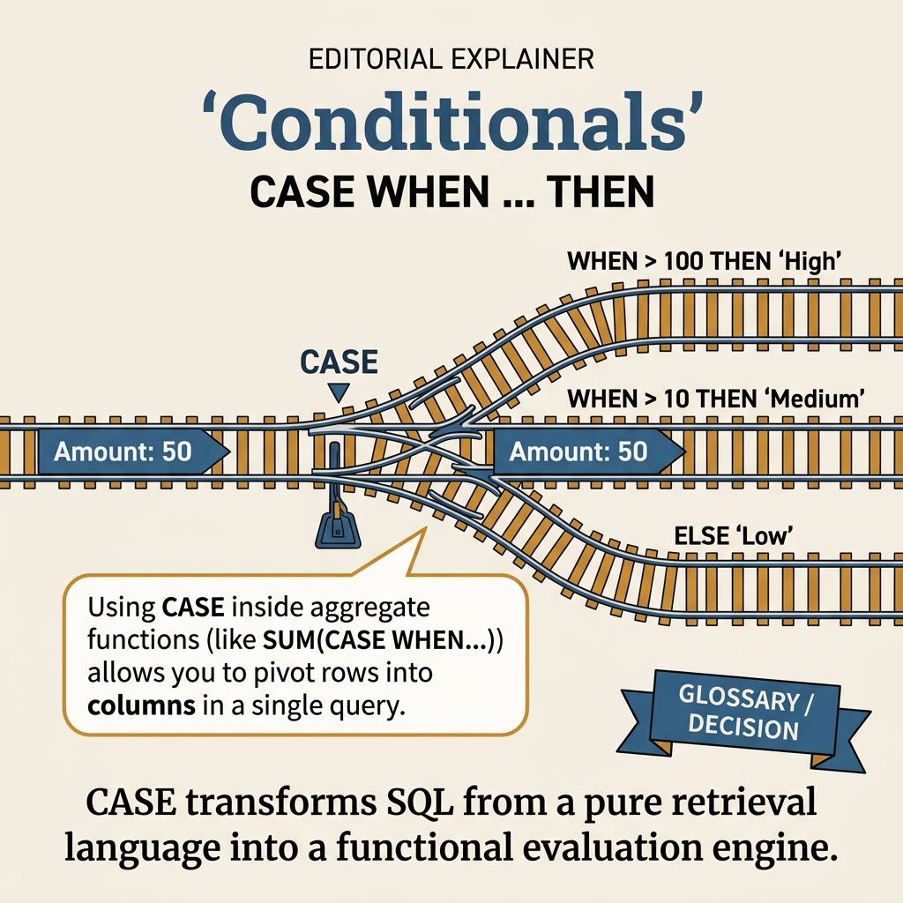
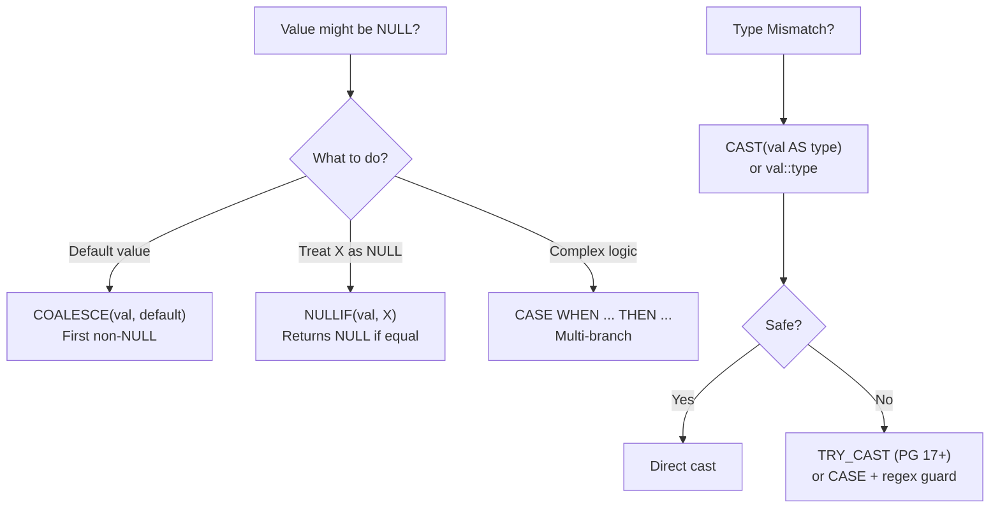

<!-- tags: sql, postgresql, database -->
# 🔀 Conditional Expressions, Type Casting & Utility Functions

> CASE, COALESCE, NULLIF, CAST, GREATEST/LEAST, generate_series — essential operators cho mọi query.

| Aspect            | Detail                                                          |
| ----------------- | --------------------------------------------------------------- |
| **Concept**       | Conditional logic, NULL handling, type conversion               |
| **Use case**      | Data transformation, default values, type conversion, reporting |
| **Go relevance**  | Handle nullable columns, format query results                   |
| **Neon Tutorial** | Section 15: Conditional Expressions & Operators                 |

---

📅 Ngày tạo: 2026-03-19 · 🔄 Cập nhật: 2026-04-04 · ⏱️ 12 phút đọc

---

## 1. DEFINE

Application code: `if order.status == null then "N/A" else order.status`. Logic này lặp lại ở 8 microservices. Mỗi service handle NULL khác nhau — API trả `null`, reporting trả `"N/A"`, export trả empty string. Khách hàng complaint: "tại sao cùng order mà 3 hệ thống hiển thị khác nhau?"

`COALESCE`, `NULLIF`, `CASE WHEN` — PostgreSQL xử lý conditional logic **tại data layer**, đảm bảo mọi consumer nhận cùng một kết quả. Bài này cover từ NULL handling đến type casting đến utility functions.


| Variant | Mô tả |
| --- | --- |
| CASE (simple) | CASE expr WHEN val THEN result END · Switch-style matching |
| CASE (searched) | CASE WHEN cond THEN result END · If-elsif logic |
| COALESCE | COALESCE(a, b, c) · First non-NULL value |
| NULLIF | NULLIF(a, b) · NULL if a = b, else a |

| Approach | Time | Space | Khi chọn |
| --- | --- | --- | --- |
| CASE, COALESCE, NULLIF | Phụ thuộc cardinality | Phụ thuộc row width | Dùng để nắm baseline semantics trước khi tune planner hoặc index. |
| CAST, Type Conversion, Date Functions | Phụ thuộc plan | Phụ thuộc memory operator | Dùng khi query đã chạm index, cardinality hoặc join strategy. |
| Utility Functions & Recipes | Phụ thuộc workload | Phụ thuộc buffer/WAL | Dùng khi workload production cần cân bằng correctness, lock và rollout. |


### Conditional Expressions

| Expression          | Syntax                               | Mô tả                 |
| ------------------- | ------------------------------------ | --------------------- |
| **CASE** (simple)   | `CASE expr WHEN val THEN result END` | Switch-style matching |
| **CASE** (searched) | `CASE WHEN cond THEN result END`     | If-elsif logic        |
| **COALESCE**        | `COALESCE(a, b, c)`                  | First non-NULL value  |
| **NULLIF**          | `NULLIF(a, b)`                       | NULL if a = b, else a |
| **GREATEST**        | `GREATEST(a, b, c)`                  | Largest value         |
| **LEAST**           | `LEAST(a, b, c)`                     | Smallest value        |

### Type Casting

| Syntax                   | Ví dụ                                | Standard             |
| ------------------------ | ------------------------------------ | -------------------- |
| `CAST(expr AS type)`     | `CAST('42' AS integer)`              | SQL standard         |
| `expr::type`             | `'42'::integer`                      | PostgreSQL shorthand |
| `type 'literal'`         | `integer '42'`                       | Type literal         |
| `expr AT TIME ZONE zone` | `ts AT TIME ZONE 'Asia/Ho_Chi_Minh'` | Timezone conversion  |

### Common Casts

| From             | To                         | Ví dụ             |
| ---------------- | -------------------------- | ----------------- |
| text → integer   | `'42'::int`                | Number parsing    |
| text → date      | `'2024-06-15'::date`       | Date parsing      |
| text → jsonb     | `'{"key":"val"}'::jsonb`   | JSON parsing      |
| integer → text   | `42::text`                 | String conversion |
| timestamp → date | `now()::date`              | Strip time        |
| numeric → int    | `3.7::int` → 4             | Rounds            |
| text → boolean   | `'true'::bool`             | Boolean parsing   |
| text → text[]    | `'{a,b,c}'::text[]`        | Array parsing     |
| interval → text  | `interval '2 hours'::text` | Format interval   |

---

Các failure mode trên nghe dễ tránh. Nhưng có trap: CASE WHEN thiếu ELSE = NULL surprise, và COALESCE chain quá dài = unreadable logic. Trap đó sẽ xuất hiện ở PITFALLS.

## 2. VISUAL

Với Conditional Expressions, Type Casting & Utility Functions, bảng phân loại mới chỉ giúp bạn gọi đúng tên khái niệm. Điều quan trọng hơn là nhìn xem rows, giá trị hoặc ràng buộc thực sự đổi shape như thế nào khi query chạy qua từng bước.




*Hình: 4 conditional handlers — CASE WHEN (multi-branch), COALESCE (null default), NULLIF (safe division), GREATEST/LEAST (value clamping). All planner-friendly.*

### Level 1

```text
COALESCE(a, b, c):
  a = NULL → try b
  b = NULL → try c
  c = 'default' → return 'default'

NULLIF(a, b):
  a = '' → NULLIF('', '') → NULL   (convert empty string to NULL)
  a = 'hello' → 'hello'             (not equal, return a)

Combined pattern:
  COALESCE(NULLIF(user_input, ''), 'N/A')
  → '' → NULL → 'N/A'     ✅ Clean!
  → 'Alice' → 'Alice'     ✅ Keep value
```

---

*Hình: Level 1 cho 🔀 Conditional Expressions, Type Casting & Utility Functions — nhìn vào happy path hoặc baseline heuristic trước khi đi sâu vào planner và trade-off.*

### Level 2

```text
Decision Lens                 Dấu hiệu cần nhìn                 Hướng xử lý
---------------------------  --------------------------------  -------------------------------------------
Semantics trước               Kết quả có đúng intent không?    1. CASE, COALESCE, NULLIF
Planner / index signal        Cardinality, cost, buffers ra sao? 2. CAST, Type Conversion, Date Functions
Production pressure           Lock, WAL, lag, rollback nào đau? 3. Utility Functions & Recipes
```

*Hình: Level 2 biến 🔀 Conditional Expressions, Type Casting & Utility Functions thành checklist quyết định — từ semantics, sang plan signal, rồi đến áp lực production.*


### Architecture — NULL Handling Decision Flow



*Hình: NULL handling — COALESCE cho default, NULLIF cho inverse, CASE cho complex. Type casting — CAST an toàn hơn :: vì rõ ràng hơn, TRY_CAST cho untrusted input.*

---
## 3. CODE

Khi flow của Conditional Expressions, Type Casting & Utility Functions đã rõ, ta chuyển nó thành DDL, truy vấn và transaction có thể chạy thật. Ta bắt đầu từ case hẹp nhất rồi tăng dần số lượng rows, ràng buộc và biến thể.

### Problem 1: Basic — CASE, COALESCE, NULLIF

> **Mục tiêu**: Conditional logic trong queries, NULL handling
> **Cần**: PostgreSQL 14+
> **Đạt được**: Clean, null-safe queries


```sql
-- ═══════════════════════════════════════════
-- 1. CASE expression (searched)
-- ═══════════════════════════════════════════

-- ✅ Categorize orders by amount
SELECT id, total,
    CASE
        WHEN total >= 1000 THEN '💎 Premium'
        WHEN total >= 500  THEN '🥇 High'
        WHEN total >= 100  THEN '🥈 Medium'
        ELSE '🥉 Low'
    END AS tier,
    CASE status
        WHEN 'delivered' THEN '✅'
        WHEN 'cancelled' THEN '❌'
        WHEN 'pending'   THEN '⏳'
        ELSE '📦'
    END AS status_icon
FROM orders LIMIT 10;

-- ✅ CASE in WHERE
SELECT * FROM products
WHERE CASE
    WHEN stock = 0 THEN status = 'discontinued'
    WHEN stock < 10 THEN status IN ('active', 'low_stock')
    ELSE true
END;

-- ✅ CASE in ORDER BY (custom sort)
SELECT * FROM orders
ORDER BY
    CASE status
        WHEN 'pending' THEN 1     -- ✅ Pending first
        WHEN 'processing' THEN 2
        WHEN 'shipped' THEN 3
        WHEN 'delivered' THEN 4
        WHEN 'cancelled' THEN 5
    END,
    ordered_at DESC;

-- ✅ CASE in UPDATE
UPDATE products SET status =
    CASE
        WHEN stock = 0 THEN 'out_of_stock'
        WHEN stock < 10 THEN 'low_stock'
        ELSE 'active'
    END
WHERE status = 'active';

-- ═══════════════════════════════════════════
-- 2. COALESCE — first non-NULL
-- ═══════════════════════════════════════════

-- ✅ Default value for nullable column
SELECT
    id,
    COALESCE(phone, email, 'No contact') AS contact,
    COALESCE(note, '') AS note,
    COALESCE(shipped_at, ordered_at) AS last_activity
FROM orders;

-- ✅ Safe division (avoid divide by zero via NULLIF)
SELECT
    category_id,
    SUM(total) AS revenue,
    COUNT(*) AS orders,
    -- ✅ NULLIF prevents divide-by-zero → returns NULL instead
    round(SUM(total) / NULLIF(COUNT(*), 0), 2) AS avg_order
FROM orders
GROUP BY category_id;

-- ✅ Convert empty string to NULL then default
SELECT COALESCE(NULLIF(trim(user_input), ''), 'N/A') AS clean_value;

-- ═══════════════════════════════════════════
-- 3. GREATEST / LEAST
-- ═══════════════════════════════════════════

-- ✅ Ensure value within bounds
SELECT
    id,
    GREATEST(price * 0.9, cost * 1.1) AS min_sale_price,  -- Don't sell below cost
    LEAST(stock, 100) AS available_to_sell,                 -- Cap at 100
    GREATEST(0, stock - reserved) AS available_stock        -- Don't go negative
FROM products;

-- ✅ Latest of multiple dates
SELECT
    id,
    GREATEST(created_at, updated_at, last_login_at) AS last_activity
FROM users;
```


---

CASE WHEN đã cover. Nhưng COALESCE/NULLIF cần null handling — hãy defend.

### Problem 2: Intermediate — CAST, Type Conversion, Date Functions

> **Mục tiêu**: Type casting patterns, date/time conversion
> **Cần**: PostgreSQL 14+
> **Đạt được**: Type-safe queries


```sql
-- ═══════════════════════════════════════════
-- 1. CAST basics
-- ═══════════════════════════════════════════

-- ✅ String ↔ Number
SELECT '42'::integer, '3.14'::numeric, 42::text;

-- ✅ String → Date/Timestamp
SELECT '2024-06-15'::date, '2024-06-15 10:30:00+07'::timestamptz;

-- ✅ Timestamp ↔ extraction
SELECT
    now()::date AS today,
    now()::time AS current_time,
    extract(year FROM now()) AS year,
    extract(dow FROM now()) AS day_of_week,  -- 0=Sun, 6=Sat
    to_char(now(), 'YYYY-MM-DD HH24:MI:SS') AS formatted;

-- ✅ Timezone conversion
SELECT
    now() AS server_time,
    now() AT TIME ZONE 'Asia/Ho_Chi_Minh' AS vn_time,
    now() AT TIME ZONE 'UTC' AS utc_time;

-- ═══════════════════════════════════════════
-- 2. Safe casting (TRY pattern)
-- ═══════════════════════════════════════════

-- ✅ Safe integer parse (returns NULL on failure)
CREATE OR REPLACE FUNCTION try_cast_int(text)
RETURNS integer AS $$
BEGIN
    RETURN $1::integer;
EXCEPTION WHEN OTHERS THEN
    RETURN NULL;
END;
$$ LANGUAGE plpgsql IMMUTABLE;

SELECT try_cast_int('42');     -- → 42
SELECT try_cast_int('hello');  -- → NULL (no error!)
SELECT try_cast_int('');       -- → NULL

-- ✅ Safe date parse
CREATE OR REPLACE FUNCTION try_cast_date(text)
RETURNS date AS $$
BEGIN
    RETURN $1::date;
EXCEPTION WHEN OTHERS THEN
    RETURN NULL;
END;
$$ LANGUAGE plpgsql IMMUTABLE;

-- ═══════════════════════════════════════════
-- 3. Practical conversion patterns
-- ═══════════════════════════════════════════

-- ✅ JSONB field → typed column
SELECT
    id,
    (metadata->>'score')::numeric AS score,
    (metadata->>'verified')::boolean AS verified,
    (metadata->>'login_count')::int AS logins
FROM users WHERE metadata IS NOT NULL;

-- ✅ Interval arithmetic
SELECT
    id, ordered_at, shipped_at,
    shipped_at - ordered_at AS shipping_time,
    EXTRACT(epoch FROM shipped_at - ordered_at) / 3600 AS hours_to_ship,
    -- ✅ Business days (exclude weekends)
    (SELECT count(*) FROM generate_series(
        ordered_at::date, shipped_at::date, '1 day'::interval
    ) d WHERE extract(dow FROM d) NOT IN (0, 6)) AS business_days
FROM orders
WHERE shipped_at IS NOT NULL
LIMIT 10;

-- ✅ Age calculation
SELECT
    id, first_name, created_at,
    age(now(), created_at) AS member_duration,
    extract(year FROM age(now(), created_at)) AS years_as_member,
    CASE
        WHEN age(now(), created_at) > interval '2 years' THEN 'veteran'
        WHEN age(now(), created_at) > interval '6 months' THEN 'regular'
        ELSE 'new'
    END AS member_status
FROM customers LIMIT 10;
```

**Tại sao?** Ở mức Intermediate của Conditional Expressions, Type Casting & Utility Functions, bài khó không còn là viết cho chạy mà là giữ đúng invariant khi dữ liệu đổi shape. Problem 2: Intermediate — CAST, Type Conversion, Date Functions buộc bạn nhìn xem cardinality, nullability hoặc grain của dữ liệu đang bẻ semantic đi theo hướng nào.


---

Null handling đã cover. Nhưng conditional aggregation cần FILTER — hãy slice.

### Problem 3: Advanced — Utility Functions & Recipes

> **Mục tiêu**: Compare tables, delete duplicates, utility patterns
> **Cần**: CTE, Window Functions
> **Đạt được**: Production utility queries


```sql
-- ═══════════════════════════════════════════
-- 1. Delete duplicate rows
-- ═══════════════════════════════════════════

-- ✅ Method 1: ctid (fastest, PG-specific)
DELETE FROM products
WHERE ctid NOT IN (
    SELECT MIN(ctid) FROM products GROUP BY sku
);

-- ✅ Method 2: ROW_NUMBER window function (most portable)
WITH ranked AS (
    SELECT id,
        ROW_NUMBER() OVER (PARTITION BY email ORDER BY created_at DESC) AS rn
    FROM customers
)
DELETE FROM customers WHERE id IN (
    SELECT id FROM ranked WHERE rn > 1
);

-- ✅ Method 3: DISTINCT ON (keep latest per key)
CREATE TABLE customers_deduped AS
SELECT DISTINCT ON (email) *
FROM customers
ORDER BY email, created_at DESC;

-- ═══════════════════════════════════════════
-- 2. Compare two tables
-- ═══════════════════════════════════════════

-- ✅ Find rows in A but not in B
SELECT * FROM products_new
EXCEPT
SELECT * FROM products_old;

-- ✅ Find rows in both
SELECT * FROM products_new
INTERSECT
SELECT * FROM products_old;

-- ✅ Full comparison with diff status
SELECT
    COALESCE(a.sku, b.sku) AS sku,
    CASE
        WHEN b.sku IS NULL THEN 'NEW'
        WHEN a.sku IS NULL THEN 'DELETED'
        WHEN a.price != b.price OR a.name != b.name THEN 'CHANGED'
        ELSE 'UNCHANGED'
    END AS diff_status,
    a.price AS new_price, b.price AS old_price,
    a.price - b.price AS price_diff
FROM products_new a
FULL OUTER JOIN products_old b ON a.sku = b.sku
WHERE a.sku IS NULL OR b.sku IS NULL
   OR a.price != b.price OR a.name != b.name;

-- ═══════════════════════════════════════════
-- 3. generate_series utilities
-- ═══════════════════════════════════════════

-- ✅ Calendar table (fill missing dates with zeros)
SELECT
    d::date AS date,
    COALESCE(o.order_count, 0) AS orders,
    COALESCE(o.revenue, 0) AS revenue
FROM generate_series(
    '2024-01-01'::date, '2024-12-31'::date, '1 day'
) d
LEFT JOIN (
    SELECT ordered_at::date AS date, COUNT(*) AS order_count, SUM(total) AS revenue
    FROM orders GROUP BY 1
) o ON o.date = d.date
ORDER BY d;

-- ✅ Hour-of-day distribution
SELECT
    h AS hour,
    COUNT(o.id) AS orders,
    repeat('█', (COUNT(o.id) / 10)::int) AS histogram
FROM generate_series(0, 23) h
LEFT JOIN orders o ON extract(hour FROM o.ordered_at) = h
GROUP BY h ORDER BY h;
```

```go
// ✅ Go: Handle CASE/COALESCE in scanned results
type OrderDisplay struct {
    ID       int64   `db:"id"`
    Total    float64 `db:"total"`
    Tier     string  `db:"tier"`       // From CASE
    Contact  string  `db:"contact"`    // From COALESCE
}

func (r *Repo) ListOrdersForDisplay(ctx context.Context) ([]OrderDisplay, error) {
    rows, err := r.pool.Query(ctx, `
        SELECT o.id, o.total,
            CASE
                WHEN o.total >= 1000 THEN 'premium'
                WHEN o.total >= 500 THEN 'high'
                ELSE 'standard'
            END AS tier,
            COALESCE(c.phone, c.email, 'unknown') AS contact
        FROM orders o JOIN customers c ON c.id = o.customer_id
        ORDER BY o.ordered_at DESC LIMIT 50
    `)
    if err != nil {
        return nil, err
    }
    defer rows.Close()
    return pgx.CollectRows(rows, pgx.RowToStructByName[OrderDisplay])
}
```

**Tại sao?** Khi Conditional Expressions, Type Casting & Utility Functions đi tới mức Advanced, chi phí không còn nằm riêng trong câu lệnh mà lan sang lock time, maintenance window và rollback path. Problem 3: Advanced — Utility Functions & Recipes đáng giá vì nó cho thấy một lựa chọn đẹp trên giấy có thể rất đắt trên hệ thống đang chạy.


---
Bạn đã đi qua CASE, COALESCE, và FILTER. Bây giờ đến phần nguy hiểm: NULL surprise và unreadable chains — trap đã được setup từ đầu bài.

## 4. PITFALLS

Conditional Expressions, Type Casting & Utility Functions thường không thất bại ở chỗ cú pháp sai, mà ở chỗ semantics bị hiểu lệch hoặc bị kéo vào ngữ cảnh production lớn hơn. Phần dưới đây gom những lỗi dễ trả giá nhất.

| # | Severity | Lỗi | Hậu quả | Fix |
| --- | --- | --- | --- | --- |
| 1 | 🔵 Minor | CASE without ELSE | — | Returns NULL → always include ELSE |
| 2 | 🔵 Minor | '42'::int on non-numeric text | — | Runtime error → use try_cast_int() |
| 3 | 🔵 Minor | COALESCE with different types | — | Type mismatch error → cast to same type |
| 4 | 🔵 Minor | Timezone confusion | — | timestamp vs timestamptz → always use timestamptz |
| 5 | 🔵 Minor | NULLIF argument order | — | NULLIF(a, b) → NULL if a=b. Not symmetric! |
| 6 | 🔵 Minor | GREATEST/LEAST with NULL | — | Returns NULL if any arg is NULL → wrap with COALESCE |

---
Bạn đã đi qua Conditional Expressions và cạm bẫy. Các resources dưới đây giúp đi sâu hơn.

## 5. REF

| Resource | Link                                                                                                                                |
| -------- | ----------------------------------------------------------------------------------------------------------------------------------- |
| CASE     | [neon.com/postgresql/postgresql-tutorial/postgresql-case](https://neon.com/postgresql/postgresql-tutorial/postgresql-case/)         |
| COALESCE | [neon.com/postgresql/postgresql-tutorial/postgresql-coalesce](https://neon.com/postgresql/postgresql-tutorial/postgresql-coalesce/) |
| NULLIF   | [neon.com/postgresql/postgresql-tutorial/postgresql-nullif](https://neon.com/postgresql/postgresql-tutorial/postgresql-nullif/)     |
| CAST     | [neon.com/postgresql/postgresql-tutorial/postgresql-cast](https://neon.com/postgresql/postgresql-tutorial/postgresql-cast/)         |

---

## 6. RECOMMEND

Khi những bẫy chính của Conditional Expressions, Type Casting & Utility Functions đã hiện ra, bước tiếp theo là nối nó sang planner, maintenance hoặc topology lớn hơn để mental model không dừng ở mức cú pháp.

| Topic               | Khi nào                   | Lý do                                    |
| ------------------- | ------------------------- | ---------------------------------------- |
| **Custom domains**  | Reusable type constraints | `CREATE DOMAIN email AS text CHECK(...)` |
| **Enum types**      | Fixed value sets          | Better than text + CHECK                 |
| **Range types**     | Date/number ranges        | `int4range`, `tstzrange`                 |
| **Composite types** | Complex return types      | `CREATE TYPE address AS (...)`           |


> **Callback** — Quay lại NULL hiển thị khác nhau trên 3 hệ thống: `COALESCE(status, "N/A")` tại data layer = mọi consumer nhận cùng output. Conditional logic centralized = zero divergence.

---

← Previous: [14-grouping-aggregation.md](./14-grouping-aggregation.md)

---

## 7. QUICK REF

| Nếu gặp | Nghĩ ngay |
| --- | --- |
| CASE, COALESCE, NULLIF | Dùng pattern này khi gặp signal tương ứng trong query plan hoặc workload. |
| CAST, Type Conversion, Date Functions | Dùng pattern này khi gặp signal tương ứng trong query plan hoặc workload. |
| Utility Functions & Recipes | Dùng pattern này khi gặp signal tương ứng trong query plan hoặc workload. |
