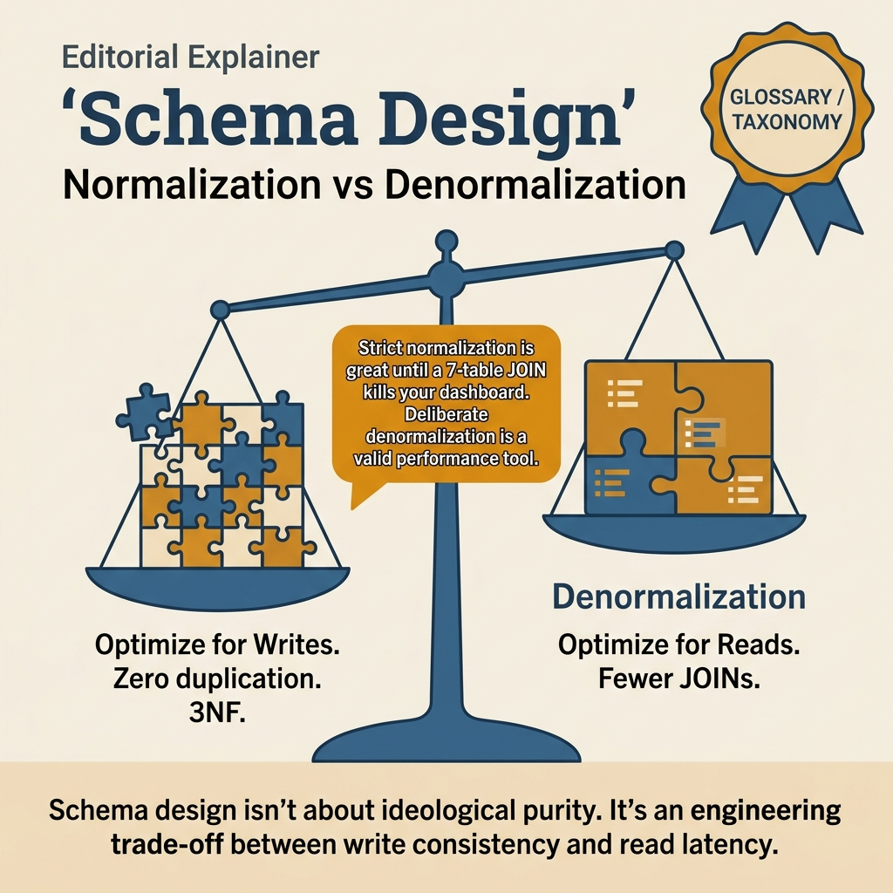
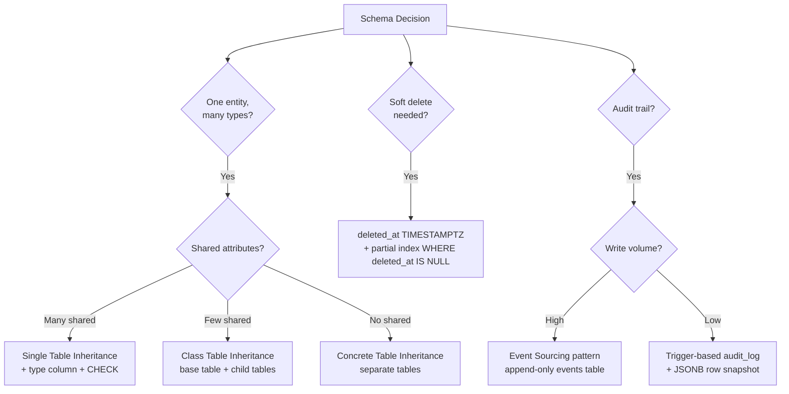

<!-- tags: sql, postgresql, schema-design, data-modeling, serialization -->
<!-- tags: sql, postgresql, schema-design, data-modeling -->
# 🏗️ Schema Design Patterns — Star, Snowflake & Serialization

> Các mô hình thiết kế database phổ biến: Star Schema, Snowflake Schema, Galaxy Schema, và kỹ thuật Serialization/Deserialization trong PostgreSQL

| Aspect         | Detail                                                       |
| -------------- | ------------------------------------------------------------ |
| **Complexity** | ⭐⭐⭐                                                        |
| **Use case**   | Data Warehouse, Analytics, OLAP, ETL Pipeline Design         |
| **Keywords**   | Star Schema, Snowflake, Galaxy, Fact, Dimension, JSONB, EAV  |

---

📅 Ngày tạo: 2026-03-27 · 🔄 Cập nhật: 2026-04-04 · ⏱️ 20 phút đọc

---

## 1. DEFINE

MVP: `orders` table có 47 columns — address, billing info, product details, shipping status, audit fields. Tháng 3: thêm feature multi-address → ALTER TABLE thêm 6 columns. Tháng 6: thêm order splitting → 12 columns nữa. Bây giờ bảng 65 columns, mỗi SELECT * decompress 60KB TOAST data, index đã 8GB, mọi migration đều ALTER TABLE 2 giờ.

Schema design không phải "tạo bảng cho đúng data". Nó là **architecture decision** ảnh hưởng query speed, migration cost, và team velocity 2 năm sau. Bài này cover normalization, polymorphic associations, soft delete, EAV, audit trail — và trade-off của từng pattern.


| Variant | Mô tả |
| --- | --- |
| Mục đích | Giao dịch hàng ngày · Phân tích, báo cáo |
| Normalization | 3NF (highly normalized) · Denormalized (star/snowflake) |
| Query | INSERT/UPDATE nhiều, SELECT ít · SELECT phức tạp, aggregate lớn |
| Latency | Milliseconds · Seconds → Minutes |

| Approach | Time | Space | Khi chọn |
| --- | --- | --- | --- |
| Star Schema — Thiết kế cơ bản | Phụ thuộc cardinality | Phụ thuộc row width | Dùng để nắm baseline semantics trước khi tune planner hoặc index. |
| Snowflake Schema — Normalize Dimensions | Phụ thuộc plan | Phụ thuộc memory operator | Dùng khi query đã chạm index, cardinality hoặc join strategy. |
| Galaxy Schema — Multiple Fact Tables | Phụ thuộc workload | Phụ thuộc buffer/WAL | Dùng khi workload production cần cân bằng correctness, lock và rollout. |
| Serialization — Lưu trữ dữ liệu có cấu trúc | Phụ thuộc incident path | Phụ thuộc replication/cache | Dùng khi cần operational playbook, incident response hoặc phối hợp nhiều kỹ thuật. |
| Event Sourcing — Serialize Event Payload | Phụ thuộc incident path | Phụ thuộc replication/cache | Dùng khi cần operational playbook, incident response hoặc phối hợp nhiều kỹ thuật. |
| EAV Pattern — Entity — Attribute — Value (Serialization thay thế) | Phụ thuộc incident path | Phụ thuộc replication/cache | Dùng khi cần operational playbook, incident response hoặc phối hợp nhiều kỹ thuật. |
| Binary Serialization — BYTEA | Phụ thuộc incident path | Phụ thuộc replication/cache | Dùng khi cần operational playbook, incident response hoặc phối hợp nhiều kỹ thuật. |
| Populate dim_time — Helper | Phụ thuộc incident path | Phụ thuộc replication/cache | Dùng khi cần operational playbook, incident response hoặc phối hợp nhiều kỹ thuật. |
| Practical Query — Star Schema Analytics | Phụ thuộc incident path | Phụ thuộc replication/cache | Dùng khi cần operational playbook, incident response hoặc phối hợp nhiều kỹ thuật. |


### Schema Design là gì?

Schema Design là quá trình tổ chức cấu trúc bảng, mối quan hệ và cách lưu trữ dữ liệu trong database. Với hệ thống phân tích (OLAP), các schema pattern đặc biệt giúp tối ưu truy vấn trên khối lượng dữ liệu lớn.

### OLTP vs OLAP

| Tiêu chí       | OLTP (Transactional)              | OLAP (Analytical)                  |
| --------------- | --------------------------------- | ---------------------------------- |
| **Mục đích**    | Giao dịch hàng ngày              | Phân tích, báo cáo                 |
| **Normalization** | 3NF (highly normalized)        | Denormalized (star/snowflake)      |
| **Query**       | INSERT/UPDATE nhiều, SELECT ít   | SELECT phức tạp, aggregate lớn     |
| **Latency**     | Milliseconds                      | Seconds → Minutes                  |
| **Ví dụ**       | E-commerce orders, banking        | BI dashboard, data warehouse       |

### Các Schema Pattern chính

| Pattern               | Mô tả                                                    | Khi nào dùng                       |
| --------------------- | --------------------------------------------------------- | ---------------------------------- |
| **Star Schema**       | 1 Fact table trung tâm + nhiều Dimension tables           | Dashboard, BI đơn giản            |
| **Snowflake Schema**  | Star Schema + Dimensions được normalize thêm              | Dữ liệu dimension phức tạp        |
| **Star Flake Schema** | Hybrid: một số dims normalized, một số không              | Cân bằng giữa star và snowflake   |
| **Galaxy Schema**     | Nhiều Fact tables chia sẻ Dimension tables (Fact Constellation) | Enterprise data warehouse    |

### Serialization / Deserialization

| Khái niệm             | Mô tả                                                  |
| ---------------------- | ------------------------------------------------------- |
| **Serialization**      | Chuyển đổi dữ liệu có cấu trúc → format lưu trữ (JSON, BYTEA, XML) |
| **Deserialization**    | Chuyển đổi ngược: format lưu trữ → dữ liệu có cấu trúc |
| **Use cases**          | Audit logs, settings, event sourcing, API payload cache  |

---

Các failure mode trên nghe cơ bản. Nhưng có trap: EAV pattern = query phức tạp + slow joins, và premature normalization = unnecessary complexity. Trap đó sẽ xuất hiện ở PITFALLS.

## 2. VISUAL

Với Schema Design Patterns — Star, Snowflake & Serialization, bảng phân loại mới chỉ giúp bạn gọi đúng tên khái niệm. Điều quan trọng hơn là nhìn xem rows, giá trị hoặc ràng buộc thực sự đổi shape như thế nào khi query chạy qua từng bước.




*Hình: 4 pattern families — Normalized 3NF (OLTP), Denormalized (OLAP), Hybrid JSONB (flexible), Audit Trail (compliance). Start normalized, denormalize only when measured.*

### Level 1

```
                    ┌──────────────┐
                    │  dim_product │
                    │──────────────│
                    │ product_id   │
                    │ name         │
                    │ category     │
                    │ brand        │
                    └──────┬───────┘
                           │
    ┌──────────────┐       │       ┌──────────────┐
    │  dim_time    │       │       │  dim_store   │
    │──────────────│       │       │──────────────│
    │ time_id      │       │       │ store_id     │
    │ date         │       │       │ name         │
    │ month        │       │       │ city         │
    │ quarter      │       │       │ region       │
    │ year         │       │       └──────┬───────┘
    └──────┬───────┘       │              │
           │               │              │
           │    ┌──────────┴──────────┐   │
           └───►│    fact_sales       │◄──┘
                │─────────────────────│
                │ sale_id             │
                │ time_id      (FK)   │
                │ product_id   (FK)   │
                │ store_id     (FK)   │
                │ customer_id  (FK)   │
                │ quantity            │
                │ revenue             │
                │ discount            │
                └──────────┬──────────┘
                           │
                    ┌──────┴───────┐
                    │ dim_customer │
                    │──────────────│
                    │ customer_id  │
                    │ name         │
                    │ segment      │
                    │ tier         │
                    └──────────────┘
```

```
    ┌────────────┐     ┌──────────────┐     ┌──────────────┐
    │ dim_country│◄────│  dim_city    │◄────│  dim_store   │
    │────────────│     │──────────────│     │──────────────│
    │ country_id │     │ city_id      │     │ store_id     │
    │ name       │     │ name         │     │ name         │
    │ continent  │     │ country_id   │     │ city_id  (FK)│
    └────────────┘     └──────────────┘     └──────┬───────┘
                                                    │
    ┌────────────┐     ┌──────────────┐            │
    │dim_category│◄────│ dim_product  │            │
    │────────────│     │──────────────│            │
    │ category_id│     │ product_id   │            │
    │ name       │     │ name         │     ┌──────┴──────────┐
    │ department │     │ category_id  │     │   fact_sales     │
    └────────────┘     └──────┬───────┘     │─────────────────│
                              │             │ product_id (FK) │
                              └────────────►│ store_id   (FK) │
                                            │ time_id    (FK) │
                                            │ quantity        │
                                            │ revenue         │
                                            └─────────────────┘
```

```
    Star Flake = Star Schema + Selective Normalization

    ┌──────────┐     ┌──────────┐
    │dim_brand │◄────│dim_product│──── Normalized (Snowflake)
    └──────────┘     └─────┬────┘
                           │
                    ┌──────┴──────┐
                    │ fact_sales   │
                    └──────┬──────┘
                           │
                    ┌──────┴──────┐
                    │ dim_time    │──── Denormalized (Star)
                    │ date, month │
                    │ quarter,year│
                    └─────────────┘
```

```
    ┌──────────────┐          ┌──────────────┐
    │ fact_sales    │          │ fact_shipping │
    │──────────────│          │──────────────│
    │ product_id   │          │ product_id   │
    │ customer_id  │          │ customer_id  │
    │ time_id      │          │ time_id      │
    │ revenue      │          │ carrier_id   │
    │ quantity     │          │ shipping_cost│
    └──────┬───────┘          └──────┬───────┘
           │                         │
           │    ┌──────────────┐     │
           └───►│ dim_product  │◄────┘    ← Shared Dimension
                └──────────────┘
           │    ┌──────────────┐     │
           └───►│ dim_customer │◄────┘    ← Shared Dimension
                └──────────────┘
           │    ┌──────────────┐     │
           └───►│  dim_time    │◄────┘    ← Shared Dimension
                └──────────────┘
```

---

*Hình: Level 1 cho 🏗️ Schema Design Patterns — Star, Snowflake & Serialization — nhìn vào happy path hoặc baseline heuristic trước khi đi sâu vào planner và trade-off.*

### Level 2

```text
Decision Lens                 Dấu hiệu cần nhìn                 Hướng xử lý
---------------------------  --------------------------------  -------------------------------------------
Semantics trước               Kết quả có đúng intent không?    1. Star Schema  —  Thiết kế cơ bản
Planner / index signal        Cardinality, cost, buffers ra sao? 2. Snowflake Schema  —  Normalize Dimensions
Production pressure           Lock, WAL, lag, rollback nào đau? 3. Galaxy Schema  —  Multiple Fact Tables
```

*Hình: Level 2 biến 🏗️ Schema Design Patterns — Star, Snowflake & Serialization thành checklist quyết định — từ semantics, sang plan signal, rồi đến áp lực production.*


### Architecture — Schema Pattern Decision Map



*Hình: Schema pattern chọn theo access pattern + write volume + query requirement. STI đơn giản nhất nhưng sparse columns. CTI normalize nhưng cần JOINs. Event sourcing cho audit nhưng storage heavy.*

---
## 3. CODE

Khi flow của Schema Design Patterns — Star, Snowflake & Serialization đã rõ, ta chuyển nó thành DDL, truy vấn và transaction có thể chạy thật. Ta bắt đầu từ case hẹp nhất rồi tăng dần số lượng rows, ràng buộc và biến thể.

### Problem 1: Basic — Star Schema — Thiết kế cơ bản

> **Mục tiêu**: Minh họa cách áp dụng **🏗️ Schema Design Patterns — Star, Snowflake & Serialization** qua ví dụ `Star Schema — Thiết kế cơ bản` trong đúng ngữ cảnh schema, query hoặc vận hành.


```sql
-- star_schema.sql — Star Schema: Sales Analytics
-- ━━━ ✅ Dimension Tables ━━━

-- Dimension: Thời gian
CREATE TABLE dim_time (
    time_id      SERIAL PRIMARY KEY,
    full_date    DATE NOT NULL UNIQUE,
    day_of_week  SMALLINT,          -- 1=Mon, 7=Sun
    day_name     VARCHAR(10),       -- Monday, Tuesday...
    month        SMALLINT,
    month_name   VARCHAR(10),
    quarter      SMALLINT,
    year         SMALLINT,
    is_weekend   BOOLEAN DEFAULT FALSE,
    is_holiday   BOOLEAN DEFAULT FALSE
);

-- Dimension: Sản phẩm (denormalized — category nằm luôn trong bảng)
CREATE TABLE dim_product (
    product_id   SERIAL PRIMARY KEY,
    sku          VARCHAR(50) UNIQUE NOT NULL,
    name         VARCHAR(200) NOT NULL,
    category     VARCHAR(100),      -- ⚠️ Denormalized trong Star Schema
    subcategory  VARCHAR(100),
    brand        VARCHAR(100),
    unit_price   NUMERIC(12,2),
    is_active    BOOLEAN DEFAULT TRUE
);

-- Dimension: Cửa hàng (denormalized — city, region nằm cùng bảng)
CREATE TABLE dim_store (
    store_id     SERIAL PRIMARY KEY,
    store_code   VARCHAR(20) UNIQUE NOT NULL,
    name         VARCHAR(200),
    city         VARCHAR(100),      -- ⚠️ Denormalized
    region       VARCHAR(100),
    country      VARCHAR(100),
    store_type   VARCHAR(50)        -- 'retail', 'outlet', 'online'
);

-- Dimension: Khách hàng
CREATE TABLE dim_customer (
    customer_id  SERIAL PRIMARY KEY,
    email        VARCHAR(255) UNIQUE,
    full_name    VARCHAR(200),
    segment      VARCHAR(50),       -- 'individual', 'corporate'
    tier         VARCHAR(20),       -- 'bronze', 'silver', 'gold', 'platinum'
    city         VARCHAR(100),
    joined_date  DATE
);

-- ━━━ ✅ Fact Table (trung tâm) ━━━
CREATE TABLE fact_sales (
    sale_id      BIGSERIAL PRIMARY KEY,
    -- Foreign keys đến các dimensions
    time_id      INT NOT NULL REFERENCES dim_time(time_id),
    product_id   INT NOT NULL REFERENCES dim_product(product_id),
    store_id     INT NOT NULL REFERENCES dim_store(store_id),
    customer_id  INT NOT NULL REFERENCES dim_customer(customer_id),
    -- ✅ Measures (các giá trị đo lường)
    quantity     INT NOT NULL,
    unit_price   NUMERIC(12,2),
    discount     NUMERIC(5,2) DEFAULT 0,
    revenue      NUMERIC(14,2) GENERATED ALWAYS AS
                 (quantity * unit_price * (1 - discount/100)) STORED,
    tax_amount   NUMERIC(12,2),
    -- Metadata
    created_at   TIMESTAMPTZ DEFAULT NOW()
);

-- ✅ Indexes tối ưu cho Star Schema
CREATE INDEX idx_fact_sales_time ON fact_sales(time_id);
CREATE INDEX idx_fact_sales_product ON fact_sales(product_id);
CREATE INDEX idx_fact_sales_store ON fact_sales(store_id);
CREATE INDEX idx_fact_sales_customer ON fact_sales(customer_id);

-- ✅ Composite index cho query phổ biến (theo thời gian + sản phẩm)
CREATE INDEX idx_fact_sales_time_product ON fact_sales(time_id, product_id);
```


Normalization đã cover. Nhưng denormalization cần trade-off analysis — hãy cân nhắc.

### Problem 2: Intermediate — Snowflake Schema — Normalize Dimensions

> **Mục tiêu**: Minh họa cách áp dụng **🏗️ Schema Design Patterns — Star, Snowflake & Serialization** qua ví dụ `Snowflake Schema — Normalize Dimensions` trong đúng ngữ cảnh schema, query hoặc vận hành.


```sql
-- snowflake_schema.sql — Snowflake Schema: Normalized Dimensions
-- ━━━ ✅ Normalized Location Hierarchy ━━━

CREATE TABLE dim_country (
    country_id   SERIAL PRIMARY KEY,
    name         VARCHAR(100) NOT NULL,
    iso_code     CHAR(2) UNIQUE,
    continent    VARCHAR(50)
);

CREATE TABLE dim_city (
    city_id      SERIAL PRIMARY KEY,
    name         VARCHAR(100) NOT NULL,
    country_id   INT REFERENCES dim_country(country_id),
    state        VARCHAR(100),
    postal_code  VARCHAR(20)
);

-- Store giờ chỉ reference city (normalized)
CREATE TABLE dim_store_sf (
    store_id     SERIAL PRIMARY KEY,
    store_code   VARCHAR(20) UNIQUE NOT NULL,
    name         VARCHAR(200),
    city_id      INT REFERENCES dim_city(city_id),  -- ✅ FK thay vì text
    store_type   VARCHAR(50)
);

-- ━━━ ✅ Normalized Product Hierarchy ━━━

CREATE TABLE dim_department (
    department_id SERIAL PRIMARY KEY,
    name          VARCHAR(100) NOT NULL
);

CREATE TABLE dim_category (
    category_id   SERIAL PRIMARY KEY,
    name          VARCHAR(100) NOT NULL,
    department_id INT REFERENCES dim_department(department_id)
);

CREATE TABLE dim_product_sf (
    product_id    SERIAL PRIMARY KEY,
    sku           VARCHAR(50) UNIQUE NOT NULL,
    name          VARCHAR(200) NOT NULL,
    category_id   INT REFERENCES dim_category(category_id),  -- ✅ FK
    brand         VARCHAR(100),
    unit_price    NUMERIC(12,2)
);

-- ━━━ ✅ Query: Join qua nhiều levels ━━━

-- Doanh thu theo department → category → product
SELECT
    dep.name        AS department,
    cat.name        AS category,
    SUM(f.revenue)  AS total_revenue,
    COUNT(*)        AS total_orders
FROM fact_sales f
    JOIN dim_product_sf p ON f.product_id = p.product_id
    JOIN dim_category cat ON p.category_id = cat.category_id
    JOIN dim_department dep ON cat.department_id = dep.department_id
GROUP BY dep.name, cat.name
ORDER BY total_revenue DESC;

-- ⚠️ Snowflake: Nhiều JOIN hơn → query phức tạp hơn
-- ✅ Nhưng: Tránh data redundancy, dễ maintain, disk nhỏ hơn
```

**Tại sao?** Ở mức Intermediate của Schema Design Patterns — Star, Snowflake & Serialization, bài khó không còn là viết cho chạy mà là giữ đúng invariant khi dữ liệu đổi shape. Problem 2: Intermediate — Snowflake Schema — Normalize Dimensions buộc bạn nhìn xem cardinality, nullability hoặc grain của dữ liệu đang bẻ semantic đi theo hướng nào.


Denormalization đã cover. Nhưng polymorphic patterns cần type column — hãy model.

### Problem 3: Advanced — Galaxy Schema — Multiple Fact Tables

> **Mục tiêu**: Minh họa cách áp dụng **🏗️ Schema Design Patterns — Star, Snowflake & Serialization** qua ví dụ `Galaxy Schema — Multiple Fact Tables` trong đúng ngữ cảnh schema, query hoặc vận hành.


```sql
-- galaxy_schema.sql — Galaxy (Fact Constellation): Multi-Fact Analytics
-- ━━━ ✅ Shared Dimensions ━━━
-- dim_product, dim_customer, dim_time được dùng chung

-- ━━━ ✅ Fact Table 1: Sales ━━━
CREATE TABLE fact_sales_galaxy (
    sale_id      BIGSERIAL PRIMARY KEY,
    time_id      INT REFERENCES dim_time(time_id),
    product_id   INT REFERENCES dim_product(product_id),
    customer_id  INT REFERENCES dim_customer(customer_id),
    store_id     INT REFERENCES dim_store(store_id),
    quantity     INT,
    revenue      NUMERIC(14,2)
);

-- ━━━ ✅ Fact Table 2: Shipping ━━━
CREATE TABLE fact_shipping (
    shipping_id  BIGSERIAL PRIMARY KEY,
    time_id      INT REFERENCES dim_time(time_id),
    product_id   INT REFERENCES dim_product(product_id),
    customer_id  INT REFERENCES dim_customer(customer_id),
    carrier      VARCHAR(100),
    shipping_cost NUMERIC(10,2),
    delivery_days INT,
    status       VARCHAR(20)       -- 'shipped','delivered','returned'
);

-- ━━━ ✅ Fact Table 3: Inventory ━━━
CREATE TABLE fact_inventory (
    inventory_id BIGSERIAL PRIMARY KEY,
    time_id      INT REFERENCES dim_time(time_id),
    product_id   INT REFERENCES dim_product(product_id),
    store_id     INT REFERENCES dim_store(store_id),
    stock_qty    INT,
    reorder_qty  INT,
    stock_value  NUMERIC(14,2)
);

-- ━━━ ✅ Cross-Fact Analysis ━━━
-- Kết hợp Sales + Shipping + Inventory cho 1 product
SELECT
    p.name           AS product,
    SUM(s.revenue)   AS total_sales,
    AVG(sh.delivery_days) AS avg_delivery,
    AVG(i.stock_qty) AS avg_stock
FROM dim_product p
    LEFT JOIN fact_sales_galaxy s  ON p.product_id = s.product_id
    LEFT JOIN fact_shipping sh     ON p.product_id = sh.product_id
    LEFT JOIN fact_inventory i     ON p.product_id = i.product_id
GROUP BY p.name
ORDER BY total_sales DESC
LIMIT 20;
```

**Tại sao?** Khi Schema Design Patterns — Star, Snowflake & Serialization đi tới mức Advanced, chi phí không còn nằm riêng trong câu lệnh mà lan sang lock time, maintenance window và rollback path. Problem 3: Advanced — Galaxy Schema — Multiple Fact Tables đáng giá vì nó cho thấy một lựa chọn đẹp trên giấy có thể rất đắt trên hệ thống đang chạy.


### Problem 4: Expert — Serialization — Lưu trữ dữ liệu có cấu trúc

> **Mục tiêu**: Minh họa cách áp dụng **🏗️ Schema Design Patterns — Star, Snowflake & Serialization** qua ví dụ `Serialization — Lưu trữ dữ liệu có cấu trúc` trong đúng ngữ cảnh schema, query hoặc vận hành.


```sql
-- serialization.sql — Serialization Patterns trong PostgreSQL
-- ━━━ ✅ Pattern 1: JSONB Serialization (phổ biến nhất) ━━━

-- Lưu settings/config dạng JSONB
CREATE TABLE app_settings (
    id           SERIAL PRIMARY KEY,
    scope        VARCHAR(50) NOT NULL,  -- 'system', 'user', 'tenant'
    scope_id     VARCHAR(100),          -- user_id hoặc tenant_id
    settings     JSONB NOT NULL DEFAULT '{}',
    updated_at   TIMESTAMPTZ DEFAULT NOW(),
    UNIQUE(scope, scope_id)
);

-- ✅ Serialize: Lưu settings phức tạp vào 1 column
INSERT INTO app_settings (scope, scope_id, settings)
VALUES ('user', 'usr_123', '{
    "theme": "dark",
    "language": "vi",
    "notifications": {
        "email": true,
        "push": false,
        "frequency": "daily"
    },
    "dashboard": {
        "widgets": ["revenue", "orders", "visitors"],
        "layout": "grid-3col"
    }
}');

-- ✅ Deserialize: Truy xuất nested data
SELECT
    scope_id,
    settings->>'theme'                           AS theme,
    settings->>'language'                        AS language,
    settings->'notifications'->>'email'          AS email_notif,
    settings->'dashboard'->'widgets'             AS widgets,
    jsonb_array_length(settings->'dashboard'->'widgets') AS widget_count
FROM app_settings
WHERE scope = 'user';

-- ✅ Partial update (không cần rewrite toàn bộ JSON)
UPDATE app_settings
SET settings = jsonb_set(settings, '{theme}', '"light"')
WHERE scope_id = 'usr_123';

-- ✅ Deep merge settings
UPDATE app_settings
SET settings = settings || '{"notifications": {"sms": true}}'::jsonb
WHERE scope_id = 'usr_123';
```

**Tại sao?** Ở lớp Expert của Schema Design Patterns — Star, Snowflake & Serialization, bạn phải giữ cùng lúc ba thứ: semantics đúng, planner không bị lạc hướng và rollout không làm production đau thêm. Problem 4: Expert — Serialization — Lưu trữ dữ liệu có cấu trúc tồn tại để luyện đúng khả năng phối hợp đó.


### Problem 5: Expert — Event Sourcing — Serialize Event Payload

> **Mục tiêu**: Minh họa cách áp dụng **🏗️ Schema Design Patterns — Star, Snowflake & Serialization** qua ví dụ `Event Sourcing — Serialize Event Payload` trong đúng ngữ cảnh schema, query hoặc vận hành.


```sql
-- event_sourcing.sql — Event Store Pattern
-- ━━━ ✅ Pattern 2: Event Sourcing với JSONB ━━━

CREATE TABLE event_store (
    event_id     BIGSERIAL PRIMARY KEY,
    aggregate_id UUID NOT NULL,                  -- entity ID (order, user, etc.)
    aggregate    VARCHAR(50) NOT NULL,            -- 'order', 'user', 'product'
    event_type   VARCHAR(100) NOT NULL,           -- 'OrderCreated', 'ItemAdded'
    payload      JSONB NOT NULL,                  -- ✅ Serialized event data
    metadata     JSONB DEFAULT '{}',              -- trace_id, user_agent, ip
    version      INT NOT NULL,                    -- optimistic concurrency
    created_at   TIMESTAMPTZ DEFAULT NOW(),
    UNIQUE(aggregate_id, version)                 -- ⚠️ Prevent duplicate events
);

-- Index cho replay events theo aggregate
CREATE INDEX idx_events_aggregate ON event_store(aggregate_id, version);
CREATE INDEX idx_events_type     ON event_store(event_type);

-- ✅ Serialize: Ghi event
INSERT INTO event_store (aggregate_id, aggregate, event_type, payload, version)
VALUES
    ('a1b2c3d4-e5f6-7890-abcd-ef1234567890', 'order', 'OrderCreated', '{
        "customer_id": "cust_456",
        "items": [
            {"product_id": "prod_001", "qty": 2, "price": 299000},
            {"product_id": "prod_002", "qty": 1, "price": 150000}
        ],
        "total": 748000,
        "currency": "VND"
    }', 1),
    ('a1b2c3d4-e5f6-7890-abcd-ef1234567890', 'order', 'PaymentReceived', '{
        "method": "momo",
        "amount": 748000,
        "transaction_id": "txn_789"
    }', 2);

-- ✅ Deserialize: Replay events cho 1 order
SELECT
    event_type,
    version,
    payload->>'total'      AS order_total,
    payload->>'method'     AS payment_method,
    created_at
FROM event_store
WHERE aggregate_id = 'a1b2c3d4-e5f6-7890-abcd-ef1234567890'
ORDER BY version;

-- ✅ Deserialize: Tìm orders có sản phẩm cụ thể
SELECT DISTINCT aggregate_id
FROM event_store,
     jsonb_array_elements(payload->'items') AS item
WHERE event_type = 'OrderCreated'
  AND item->>'product_id' = 'prod_001';
```

**Tại sao?** Ở lớp Expert của Schema Design Patterns — Star, Snowflake & Serialization, bạn phải giữ cùng lúc ba thứ: semantics đúng, planner không bị lạc hướng và rollout không làm production đau thêm. Problem 5: Expert — Event Sourcing — Serialize Event Payload tồn tại để luyện đúng khả năng phối hợp đó.


### Problem 6: Expert — EAV Pattern — Entity-Attribute-Value (Serialization thay thế)

> **Mục tiêu**: Minh họa cách áp dụng **🏗️ Schema Design Patterns — Star, Snowflake & Serialization** qua ví dụ `EAV Pattern — Entity-Attribute-Value (Serialization thay thế)` trong đúng ngữ cảnh schema, query hoặc vận hành.


```sql
-- eav_pattern.sql — Entity-Attribute-Value vs JSONB
-- ━━━ ✅ Pattern 3: EAV (truyền thống) ━━━

-- EAV: Mỗi attribute là 1 row → linh hoạt nhưng query phức tạp
CREATE TABLE product_attributes_eav (
    product_id   INT NOT NULL,
    attribute    VARCHAR(100) NOT NULL,
    value        TEXT,
    PRIMARY KEY (product_id, attribute)
);

INSERT INTO product_attributes_eav VALUES
    (1, 'color', 'red'),
    (1, 'size', 'XL'),
    (1, 'weight_kg', '0.5'),
    (1, 'material', 'cotton'),
    (2, 'color', 'blue'),
    (2, 'screen_size', '15.6'),
    (2, 'ram_gb', '16');

-- ⚠️ EAV Query phức tạp — cần pivot
SELECT
    product_id,
    MAX(CASE WHEN attribute = 'color' THEN value END) AS color,
    MAX(CASE WHEN attribute = 'size' THEN value END) AS size,
    MAX(CASE WHEN attribute = 'weight_kg' THEN value END) AS weight
FROM product_attributes_eav
GROUP BY product_id;

-- ━━━ ✅ JSONB thay thế EAV (recommended) ━━━

CREATE TABLE product_attributes_json (
    product_id   INT PRIMARY KEY,
    attributes   JSONB NOT NULL DEFAULT '{}'
);

INSERT INTO product_attributes_json VALUES
    (1, '{"color": "red", "size": "XL", "weight_kg": 0.5, "material": "cotton"}'),
    (2, '{"color": "blue", "screen_size": 15.6, "ram_gb": 16}');

-- ✅ Query đơn giản hơn nhiều
SELECT
    product_id,
    attributes->>'color'      AS color,
    attributes->>'size'       AS size,
    attributes->>'weight_kg'  AS weight
FROM product_attributes_json;

-- ✅ Tìm products theo attribute
SELECT * FROM product_attributes_json
WHERE attributes @> '{"color": "red"}';

-- ✅ GIN index cho JSONB (thay vì index từng attribute)
CREATE INDEX idx_product_attrs ON product_attributes_json USING GIN(attributes);
```

**Tại sao?** Ở lớp Expert của Schema Design Patterns — Star, Snowflake & Serialization, bạn phải giữ cùng lúc ba thứ: semantics đúng, planner không bị lạc hướng và rollout không làm production đau thêm. Problem 6: Expert — EAV Pattern — Entity-Attribute-Value (Serialization thay thế) tồn tại để luyện đúng khả năng phối hợp đó.


### Problem 7: Expert — Binary Serialization — BYTEA

> **Mục tiêu**: Minh họa cách áp dụng **🏗️ Schema Design Patterns — Star, Snowflake & Serialization** qua ví dụ `Binary Serialization — BYTEA` trong đúng ngữ cảnh schema, query hoặc vận hành.


```sql
-- binary_serialization.sql — BYTEA cho binary data
-- ━━━ ✅ Pattern 4: Binary Serialization ━━━

-- Lưu protobuf, msgpack, hoặc binary serialized data
CREATE TABLE cached_responses (
    cache_key    VARCHAR(255) PRIMARY KEY,
    content_type VARCHAR(50),        -- 'application/protobuf', 'application/msgpack'
    payload      BYTEA NOT NULL,     -- ✅ Binary serialized data
    ttl_seconds  INT DEFAULT 3600,
    created_at   TIMESTAMPTZ DEFAULT NOW(),
    expires_at   TIMESTAMPTZ GENERATED ALWAYS AS
                 (created_at + (ttl_seconds || ' seconds')::INTERVAL) STORED
);

-- ✅ Serialize: Lưu binary data
INSERT INTO cached_responses (cache_key, content_type, payload, ttl_seconds)
VALUES (
    'user:profile:123',
    'application/json',
    convert_to('{"name":"Minh","role":"admin"}', 'UTF8'),  -- text → bytea
    7200
);

-- ✅ Deserialize: Đọc binary data
SELECT
    cache_key,
    convert_from(payload, 'UTF8') AS json_text,  -- bytea → text
    expires_at
FROM cached_responses
WHERE cache_key = 'user:profile:123'
  AND expires_at > NOW();

-- ✅ Cleanup expired cache
DELETE FROM cached_responses WHERE expires_at < NOW();
```

**Tại sao?** Ở lớp Expert của Schema Design Patterns — Star, Snowflake & Serialization, bạn phải giữ cùng lúc ba thứ: semantics đúng, planner không bị lạc hướng và rollout không làm production đau thêm. Problem 7: Expert — Binary Serialization — BYTEA tồn tại để luyện đúng khả năng phối hợp đó.


### Problem 8: Expert — Populate dim_time — Helper

> **Mục tiêu**: Minh họa cách áp dụng **🏗️ Schema Design Patterns — Star, Snowflake & Serialization** qua ví dụ `Populate dim_time — Helper` trong đúng ngữ cảnh schema, query hoặc vận hành.


```sql
-- populate_dim_time.sql — Generate date dimension
-- ━━━ ✅ Tạo dữ liệu cho dim_time (3 năm) ━━━

INSERT INTO dim_time (full_date, day_of_week, day_name, month, month_name, quarter, year, is_weekend)
SELECT
    d::DATE                                           AS full_date,
    EXTRACT(ISODOW FROM d)::SMALLINT                  AS day_of_week,
    TO_CHAR(d, 'Day')                                 AS day_name,
    EXTRACT(MONTH FROM d)::SMALLINT                   AS month,
    TO_CHAR(d, 'Month')                               AS month_name,
    EXTRACT(QUARTER FROM d)::SMALLINT                 AS quarter,
    EXTRACT(YEAR FROM d)::SMALLINT                    AS year,
    EXTRACT(ISODOW FROM d) IN (6, 7)                  AS is_weekend
FROM generate_series('2024-01-01'::DATE, '2026-12-31'::DATE, '1 day') AS d;

-- ✅ Verify
SELECT year, COUNT(*) AS days FROM dim_time GROUP BY year ORDER BY year;
-- 2024: 366 (leap year)
-- 2025: 365
-- 2026: 365
```

**Tại sao?** Ở lớp Expert của Schema Design Patterns — Star, Snowflake & Serialization, bạn phải giữ cùng lúc ba thứ: semantics đúng, planner không bị lạc hướng và rollout không làm production đau thêm. Problem 8: Expert — Populate dim_time — Helper tồn tại để luyện đúng khả năng phối hợp đó.


### Problem 9: Expert — Practical Query — Star Schema Analytics

> **Mục tiêu**: Minh họa cách áp dụng **🏗️ Schema Design Patterns — Star, Snowflake & Serialization** qua ví dụ `Practical Query — Star Schema Analytics` trong đúng ngữ cảnh schema, query hoặc vận hành.


```sql
-- analytics_queries.sql — Truy vấn phân tích trên Star Schema

-- ━━━ ✅ Doanh thu theo tháng + năm ━━━
SELECT
    t.year,
    t.month,
    t.month_name,
    SUM(f.revenue)    AS monthly_revenue,
    COUNT(f.sale_id)  AS total_orders,
    ROUND(AVG(f.revenue), 0) AS avg_order_value
FROM fact_sales f
    JOIN dim_time t ON f.time_id = t.time_id
GROUP BY t.year, t.month, t.month_name
ORDER BY t.year, t.month;

-- ━━━ ✅ Top 10 sản phẩm theo region ━━━
SELECT
    s.region,
    p.name AS product,
    SUM(f.revenue) AS revenue,
    RANK() OVER (PARTITION BY s.region ORDER BY SUM(f.revenue) DESC) AS rank
FROM fact_sales f
    JOIN dim_product p  ON f.product_id = p.product_id
    JOIN dim_store s    ON f.store_id = s.store_id
GROUP BY s.region, p.name
HAVING RANK() OVER (PARTITION BY s.region ORDER BY SUM(f.revenue) DESC) <= 10;

-- ━━━ ✅ Customer segmentation: RFM Analysis ━━━
WITH rfm AS (
    SELECT
        c.customer_id,
        c.full_name,
        MAX(t.full_date)       AS last_purchase,
        COUNT(f.sale_id)       AS frequency,
        SUM(f.revenue)         AS monetary
    FROM fact_sales f
        JOIN dim_customer c ON f.customer_id = c.customer_id
        JOIN dim_time t     ON f.time_id = t.time_id
    GROUP BY c.customer_id, c.full_name
)
SELECT
    customer_id,
    full_name,
    last_purchase,
    frequency,
    monetary,
    NTILE(5) OVER (ORDER BY last_purchase DESC) AS r_score,
    NTILE(5) OVER (ORDER BY frequency)          AS f_score,
    NTILE(5) OVER (ORDER BY monetary)           AS m_score
FROM rfm;

-- ━━━ ✅ YoY Growth comparison ━━━
SELECT
    t.month,
    SUM(CASE WHEN t.year = 2025 THEN f.revenue END) AS revenue_2025,
    SUM(CASE WHEN t.year = 2026 THEN f.revenue END) AS revenue_2026,
    ROUND(
        (SUM(CASE WHEN t.year = 2026 THEN f.revenue END) -
         SUM(CASE WHEN t.year = 2025 THEN f.revenue END)) /
        NULLIF(SUM(CASE WHEN t.year = 2025 THEN f.revenue END), 0) * 100
    , 1) AS yoy_growth_pct
FROM fact_sales f
    JOIN dim_time t ON f.time_id = t.time_id
WHERE t.year IN (2025, 2026)
GROUP BY t.month
ORDER BY t.month;
```

**Tại sao?** Ở lớp Expert của Schema Design Patterns — Star, Snowflake & Serialization, bạn phải giữ cùng lúc ba thứ: semantics đúng, planner không bị lạc hướng và rollout không làm production đau thêm. Problem 9: Expert — Practical Query — Star Schema Analytics tồn tại để luyện đúng khả năng phối hợp đó.


---
Bạn đã đi qua schema patterns. Bây giờ đến phần nguy hiểm: EAV complexity và premature normalization — trap đã được setup từ đầu bài.

## 4. PITFALLS

Schema Design Patterns — Star, Snowflake & Serialization thường không thất bại ở chỗ cú pháp sai, mà ở chỗ semantics bị hiểu lệch hoặc bị kéo vào ngữ cảnh production lớn hơn. Phần dưới đây gom những lỗi dễ trả giá nhất.

| # | Severity | Lỗi | Hậu quả | Fix |
| --- | --- | --- | --- | --- |
| 1 | 🟡 Common | Star Schema: dimension data bị duplicate | Chấp nhận trade-off hoặc chuyển sang Snowflake cho dims lớn | Chấp nhận trade-off hoặc chuyển sang Snowflake cho dims lớn |
| 2 | 🔵 Minor | Snowflake: Quá nhiều JOINs → query chậm | Giới hạn 2-3 levels normalize, dùng Star Flake hybrid | Giới hạn 2-3 levels normalize, dùng Star Flake hybrid |
| 3 | 🔵 Minor | Serialization: JSONB index quá lớn | Dùng GIN index chọn lọc: CREATE INDEX ON t USING GIN(col jsonb_path_ops) | Dùng GIN index chọn lọc: CREATE INDEX ON t USING GIN(col jsonb_path_ops) |
| 4 | 🔵 Minor | EAV: Query cần pivot phức tạp | Migrate sang JSONB — đơn giản hơn và PostgreSQL optimize tốt hơn | Migrate sang JSONB — đơn giản hơn và PostgreSQL optimize tốt hơn |
| 5 | 🔵 Minor | Fact table không có indexes trên FK | Luôn tạo index trên tất cả FK columns trong fact table | Luôn tạo index trên tất cả FK columns trong fact table |
| 6 | 🔵 Minor | dim_time không pre-populated | Generate trước 3-5 năm data, tránh INSERT on-the-fly | Generate trước 3-5 năm data, tránh INSERT on-the-fly |
| 7 | 🔵 Minor | BYTEA serialization mất type safety | Dùng JSONB khi cần query, BYTEA chỉ cho opaque binary | Dùng JSONB khi cần query, BYTEA chỉ cho opaque binary |

---
Bạn đã đi qua Schema Design Patterns và cạm bẫy. Các resources dưới đây giúp đi sâu hơn.

## 5. REF

| Resource                                   | Link                                                      |
| ------------------------------------------ | --------------------------------------------------------- |
| Kimball Dimensional Modeling Techniques     | https://www.kimballgroup.com/data-warehouse-business-intelligence-resources/kimball-techniques/dimensional-modeling-techniques/ |
| PostgreSQL JSONB Documentation              | https://www.postgresql.org/docs/current/datatype-json.html |
| Star Schema – The Complete Reference       | Ralph Kimball, Margy Ross — O'Reilly                      |
| Data Warehouse Toolkit                      | https://www.kimballgroup.com/data-warehouse-business-intelligence-resources/ |
| PostgreSQL Wiki: EAV vs JSONB              | https://wiki.postgresql.org/wiki/EAV_vs_JSON               |

---

## 6. RECOMMEND

Khi những bẫy chính của Schema Design Patterns — Star, Snowflake & Serialization đã hiện ra, bước tiếp theo là nối nó sang planner, maintenance hoặc topology lớn hơn để mental model không dừng ở mức cú pháp.

| Mở rộng                    | Khi nào                          | Lý do                                        |
| -------------------------- | -------------------------------- | --------------------------------------------- |
| **dbt (Data Build Tool)**  | Quản lý data transformations     | Version control cho SQL transformations       |
| **Materialized Views**     | Pre-compute expensive aggregates | Cache kết quả query phức tạp                  |
| **Partitioning**           | Fact table > 100M rows           | Chia nhỏ bảng theo time range → query nhanh   |
| **CITUS Extension**        | Distributed PostgreSQL           | Shard fact tables qua nhiều nodes             |
| **Apache Iceberg/Delta Lake** | Petabyte-scale analytics      | Table format cho data lake                    |
| **Column-store (TimescaleDB)** | Time-series analytics        | Nén dữ liệu tốt hơn row-store cho analytics |


> **Callback** — Quay lại bảng 65 columns, ALTER TABLE 2 giờ: schema MVP phình nhanh hơn feature velocity. Normalize sớm + event sourcing cho audit trail + partial index cho soft delete — architecture decision tại schema layer ảnh hưởng team velocity năm sau.

---

[← 15. Conditional Expressions](./15-conditional-expressions.md)

---

## 7. QUICK REF

| Nếu gặp | Nghĩ ngay |
| --- | --- |
| Star Schema — Thiết kế cơ bản | Dùng pattern này khi gặp signal tương ứng trong query plan hoặc workload. |
| Snowflake Schema — Normalize Dimensions | Dùng pattern này khi gặp signal tương ứng trong query plan hoặc workload. |
| Galaxy Schema — Multiple Fact Tables | Dùng pattern này khi gặp signal tương ứng trong query plan hoặc workload. |
| Serialization — Lưu trữ dữ liệu có cấu trúc | Dùng pattern này khi gặp signal tương ứng trong query plan hoặc workload. |
