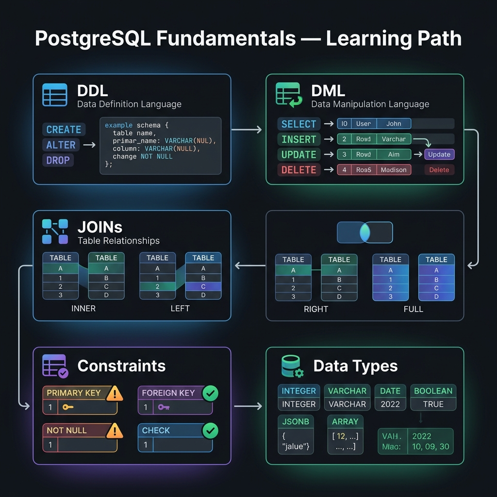

<!-- tags: sql, postgresql, database, overview -->
# 📘 PostgreSQL Fundamental

> Đây là nơi bạn khóa lại mọi thứ “đáng ra phải hiển nhiên” nhưng lại thường gây lỗi production: data types, joins, grouping, transactions, JSONB, windows, COPY và schema patterns.

| Aspect | Detail |
| --- | --- |
| **Concept** | PostgreSQL core SQL semantics |
| **Audience** | Beginner đến experienced backend engineer |
| **Primary style** | Concept-First hub cho semantic correctness |
| **Entry point** | `01-data-types.md`, `02-ddl-constraints.md`, `03-dml-transactions.md` |

📅 Ngày tạo: 2026-03-19 · 🔄 Cập nhật: 2026-04-04 · ⏱️ 4 phút đọc

---

## 1. DEFINE

Team onboard 3 engineers. Sprint 1: engineer A dùng `TEXT` cho boolean flag, engineer B dùng `VARCHAR(1)` lưu 'Y'/'N', engineer C dùng `BOOLEAN`. Code review thấy 3 conventions — nhưng migration đã apply. Schema inconsistency bắt đầu từ đây, và mọi query optimization phía trên đều đứng trên nền lung lay.

16 bài fundamental — từ data types đến schema design patterns. Đây là track dành cho ai viết SQL hàng ngày nhưng chưa tự tin về constraint behavior, join optimization, hay window function semantics. Mỗi bài có vivid scenario + code examples + pitfalls.

| Variant | Mô tả |
| --- | --- |
| Schema Semantics | Data types, DDL, constraints, schema patterns |
| Query Semantics | Joins, subqueries, grouping, conditional expressions |
| Data Modeling Extensions | JSONB, arrays, views, triggers |
| Data Movement | COPY, batch operations, sample data generation |

| Approach | Time | Space | Khi chọn |
| --- | --- | --- | --- |
| Schema before query tricks | Phụ thuộc schema size | O(1) | Dùng khi muốn tránh bug do type/constraint từ gốc. |
| Query semantics before planner | Phụ thuộc query shape | O(1) | Dùng khi cần chắc kết quả đúng trước khi tối ưu. |
| Data movement after semantics | Phụ thuộc batch size | O(1) | Dùng khi đã rõ table design và muốn import/generate dữ liệu. |

Core insight:

> Performance tuning không cứu được một query sai semantics. Track fundamental tồn tại để đảm bảo mọi tối ưu sau này đứng trên nền logic đúng.

### File Map

| File | Chủ đề |
| --- | --- |
| [01-data-types.md](./01-data-types.md) | Types, domains, enums, composite, UUID, JSONB |
| [02-ddl-constraints.md](./02-ddl-constraints.md) | CREATE/ALTER TABLE, PK/FK/CHECK/UNIQUE |
| [03-dml-transactions.md](./03-dml-transactions.md) | INSERT/UPDATE/DELETE, UPSERT, transaction basics |
| [04-joins-subqueries.md](./04-joins-subqueries.md) | Joins, EXISTS, correlated subqueries |
| [05-jsonb-array.md](./05-jsonb-array.md) | JSONB operators, array functions |
| [08-window-functions.md](./08-window-functions.md) | Ranking, running totals, frames |
| [12-batch-operations-copy.md](./12-batch-operations-copy.md) | COPY, batch insert, import/export |
| [16-schema-design-patterns.md](./16-schema-design-patterns.md) | Schema shapes and trade-offs |

---

## 2. VISUAL

Với PostgreSQL Fundamental, bảng phân loại mới chỉ giúp bạn gọi đúng tên khái niệm. Điều quan trọng hơn là nhìn xem rows, giá trị hoặc ràng buộc thực sự đổi shape như thế nào khi query chạy qua từng bước.



### Level 1

```text
Types / Constraints
        |
        v
DML / Transactions
        |
        v
Joins / Grouping / Conditions
        |
        v
JSONB / Views / Triggers / Windows
        |
        v
COPY / Batch / Schema Patterns
```

*Hình: Level 1 cho thấy track fundamental đi từ schema semantics sang query semantics rồi mới tới data movement/patterns.*

### Level 2

```text
If you are confused about...          Open first
-----------------------------------  -----------------------------------------
wrong column type / invalid data      01, 02
upsert / rollback / transaction flow  03
duplicate rows after join             04, 14
NULL / CASE / conditional logic       15
JSONB or array modeling               05
ranking / running totals              08
bulk import / seed data               12, 13
schema shape choice                   16
```

*Hình: Level 2 route symptom theo semantic domain thay vì theo thứ tự file thuần túy.*

---
## 3. CODE

Khi flow của PostgreSQL Fundamental đã rõ, ta chuyển nó thành DDL, truy vấn và transaction có thể chạy thật. Ta bắt đầu từ case hẹp nhất rồi tăng dần số lượng rows, ràng buộc và biến thể.

### Problem 1: Basic — Chọn file đúng khi query trả sai kết quả

> **Mục tiêu**: Không đổ lỗi cho planner khi thực ra query semantics đang sai.
> **Approach**: Map symptom logic sang file fundamental phù hợp.
> **Ví dụ**: Đầu vào là bug “kết quả sai”; đầu ra là file nên đọc lại.
> **Độ phức tạp**: Basic — correctness trước tuning.

```sql
-- semantics_router.sql
SELECT *
FROM (VALUES
  ('NULL / COALESCE / CASE bug', '15-conditional-expressions.md'),
  ('duplicate rows after join', '04-joins-subqueries.md'),
  ('GROUP BY / HAVING confusion', '14-grouping-aggregation.md'),
  ('wrong insert/update rollback expectation', '03-dml-transactions.md'),
  ('JSONB / array filter mismatch', '05-jsonb-array.md')
) AS routes(symptom, revisit_file);
```

**Tại sao?** Nhiều bug bị gọi nhầm là “database chậm” hoặc “planner dở”, trong khi vấn đề thật nằm ở semantics cơ bản. Router này giữ người đọc ở đúng tầng tư duy trước khi họ chuyển lên performance.

**Kết luận**: Fundamental README phải giữ learner ở lớp correctness. Nếu symptom còn ở lớp semantics, đừng nhảy sang optimizer.

### Problem 2: Intermediate — Build sandbox data để luyện joins và grouping

> **Mục tiêu**: Có dataset nhỏ nhưng đủ giàu để luyện query semantics.
> **Approach**: Tạo vài bảng quan hệ để thực hành joins, grouping và windows.
> **Ví dụ**: Đầu vào là database sandbox trống; đầu ra là dataset đủ để làm hầu hết bài trong track.
> **Độ phức tạp**: Intermediate — học bằng dataset có shape thật.

```sql
CREATE TABLE customers (
  customer_id bigint GENERATED ALWAYS AS IDENTITY PRIMARY KEY,
  email text NOT NULL UNIQUE
);

CREATE TABLE orders (
  order_id bigint GENERATED ALWAYS AS IDENTITY PRIMARY KEY,
  customer_id bigint NOT NULL REFERENCES customers(customer_id),
  total_amount numeric(12,2) NOT NULL,
  status text NOT NULL,
  created_at timestamptz NOT NULL DEFAULT now()
);

INSERT INTO customers(email)
VALUES ('a@example.com'), ('b@example.com'), ('c@example.com');

INSERT INTO orders(customer_id, total_amount, status)
VALUES
  (1, 100.00, 'paid'),
  (1, 80.00, 'pending'),
  (2, 200.00, 'paid');
```

**Tại sao?** Một hub README tốt không chỉ nói “đọc file này”. Nó cho người đọc một sandbox tối thiểu để họ có thể luyện joins, aggregation, conditions và windows trên dữ liệu đủ thật.

**Kết luận**: Nếu fundamental chỉ là text mà không có dataset thực hành, learner sẽ khó internalize semantics.

### Problem 3: Advanced — Chuyển từ semantics sang quiz checkpoint

> **Mục tiêu**: Chốt thời điểm nên rời track fundamental sang quiz.
> **Approach**: Dùng một checkpoint list thay vì đọc “cho cảm giác đủ”.
> **Ví dụ**: Đầu vào là learner sắp kết thúc track; đầu ra là criteria để chuyển sang `quiz/module/01`.
> **Độ phức tạp**: Advanced — self-evaluation có structure.

```text
Checklist trước khi sang module quiz 01:
  - Phân biệt được text vs varchar(n) vs jsonb vs array
  - Giải thích được PK / FK / CHECK / UNIQUE dùng để bảo vệ invariant gì
  - Viết được join không tạo duplicate rows ngoài ý muốn
  - Biết khi nào dùng GROUP BY, HAVING, window functions
  - Hiểu transaction cơ bản và upsert semantics
```

**Tại sao?** Nếu không có exit criteria, learner rất dễ ở lại fundamental quá lâu hoặc rời đi quá sớm. Checkpoint này biến README thành stage gate, không chỉ là catalog.

**Kết luận**: Khi đủ checkpoint, bước tiếp theo đúng là module quiz 01 chứ không phải đọc lại ngẫu nhiên.

---
## 4. PITFALLS

PostgreSQL Fundamental thường không thất bại ở chỗ cú pháp sai, mà ở chỗ semantics bị hiểu lệch hoặc bị kéo vào ngữ cảnh production lớn hơn. Phần dưới đây gom những lỗi dễ trả giá nhất.

| # | Severity | Lỗi | Hậu quả | Fix |
| --- | --- | --- | --- | --- |
| 1 | 🔴 Fatal | Nhảy sang performance khi query còn sai semantics | Tối ưu sai query, giữ lại bug logic | Khóa vững joins, grouping, transactions, conditions trước. |
| 2 | 🟡 Common | Học file rời rạc theo hứng | Mental model thiếu liên kết giữa schema, query và data movement | Đi theo router trong README và checkpoint cuối track. |
| 3 | 🟡 Common | Coi JSONB/array như shortcut cho schema design | Tạo model khó query, khó index | Chỉ dùng sau khi hiểu rõ trade-off với relational columns. |
| 4 | 🔵 Minor | Bỏ qua quiz fundamentals | Không biết mình còn hổng chỗ nào | Chuyển sang `../../quiz/module/01-postgresql-fundamentals.md` sau track. |

---
## 5. REF

| Resource | Loại | Link | Ghi chú |
| --- | --- | --- | --- |
| Neon PostgreSQL Tutorial | Tutorial | https://neon.com/postgresql/tutorial | Companion material cho track này. |
| PostgreSQL Official Docs | Official docs | https://www.postgresql.org/docs/current/ | Verify syntax và semantics khi cần. |

---

## 6. RECOMMEND

Khi những bẫy chính của PostgreSQL Fundamental đã hiện ra, bước tiếp theo là nối nó sang planner, maintenance hoặc topology lớn hơn để mental model không dừng ở mức cú pháp.

| Mở rộng | Khi nào | Lý do | File/Link |
| --- | --- | --- | --- |
| Performance Track | Khi query đã đúng nhưng bắt đầu chậm | Chuyển từ semantics sang planner/cost | [../performance/README.md](../performance/README.md) |
| SQL Fundamentals Quiz | Khi cần tự kiểm tra baseline | Ép người đọc biến kiến thức thành reasoning | [../../quiz/module/01-postgresql-fundamentals.md](../../quiz/module/01-postgresql-fundamentals.md) |

---

## 7. QUICK REF

| Nếu gặp | Mở file |
| --- | --- |
| Type / constraint confusion | `01`, `02` |
| DML / transaction semantics | `03` |
| Join / subquery bug | `04` |
| JSONB / array issue | `05` |
| Window / aggregation issue | `08`, `14` |
| Batch import / seed / schema pattern | `12`, `13`, `16` |