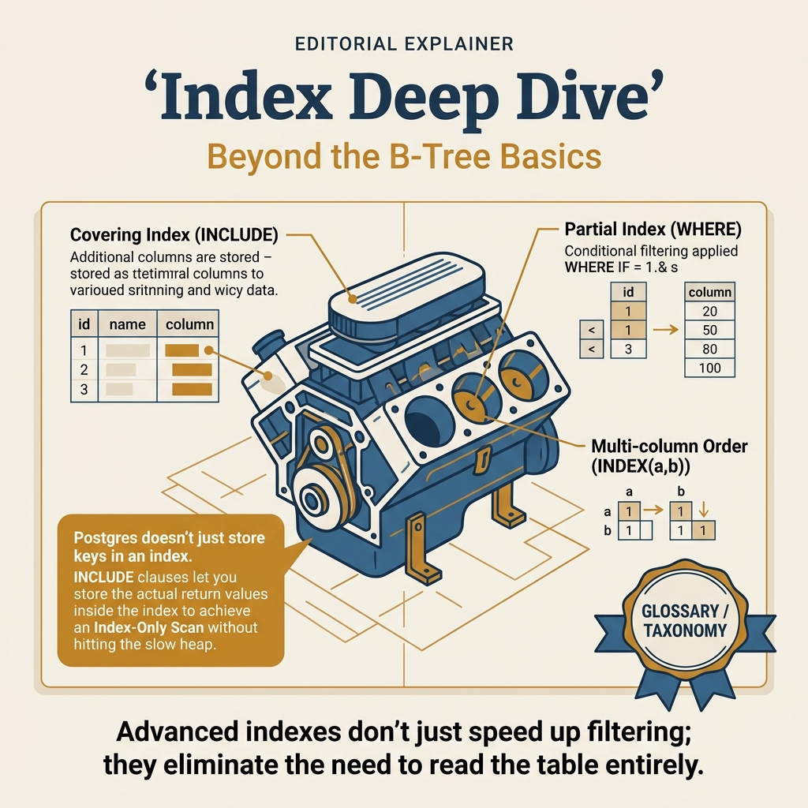
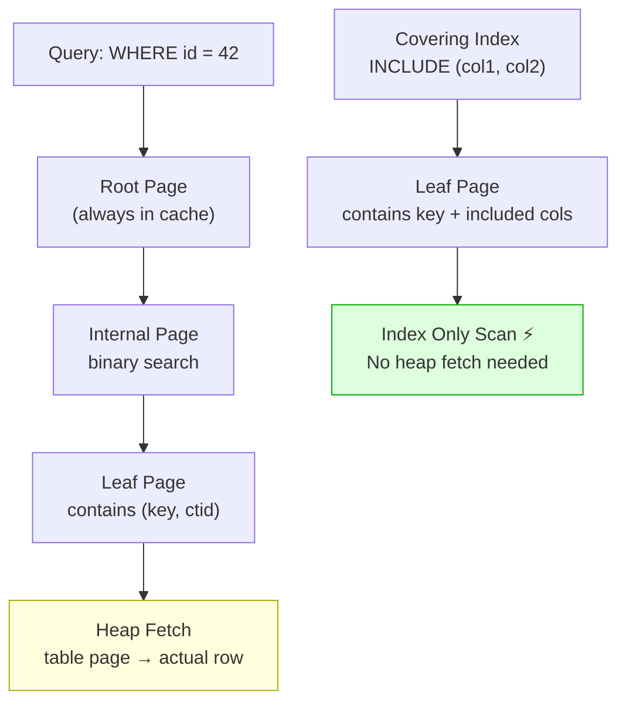

<!-- tags: sql, postgresql, database, indexing -->
# 🔎 Index Deep Dive

> B-tree, GIN, GiST, BRIN, partial, covering — chọn đúng index cho từng use case

| Aspect           | Detail                                   |
| ---------------- | ---------------------------------------- |
| **Concept**      | Index types, strategies, maintenance     |
| **Use case**     | Query acceleration, unique enforcement   |
| **Go relevance** | Query performance cho Go apps            |
| **CLI**          | `\di`, `pg_stat_user_indexes`, `EXPLAIN` |

---

📅 Ngày tạo: 2026-03-20 · 🔄 Cập nhật: 2026-04-04 · ⏱️ 15 phút đọc

---

## 1. DEFINE

EXPLAIN ANALYZE hiện: `Index Scan using idx_orders_created_at on orders (actual time=0.03..847.21 ms rows=50000)`. Index đang được dùng — nhưng 847ms? B-Tree trên `created_at` có depth 4 — mỗi level = 1 random I/O. 50,000 rows match → 50,000 heap lookups (index → table → page). Table 200M rows, data phân tán trên 3TB disk — random I/O everywhere.

Switching sang Bitmap Index Scan + covering index `INCLUDE (amount, status)`: PostgreSQL gom tất cả matching pages, sort by physical location, sequential read, trả data trực tiếp từ index. Latency: 847ms → 23ms.

Index không chỉ là "có hay không". **Index internals** — B-Tree depth, leaf page density, heap fetches, covering columns, visibility map — quyết định query chạy 0.03ms hay 847ms. Bài này đi sâu vào engine level.


| Variant | Mô tả |
| --- | --- |
| B-tree | Balanced tree · =, <, >, BETWEEN, ORDER BY · Medium · Default index |
| Hash | Hash table · = only · Small · Equality lookups |
| GIN | Inverted index · JSONB @>, Array &&, FTS · Large · Full-text, JSONB |
| GiST | Generalized tree · Geometry, range, proximity · Medium · PostGIS, exclusion |

| Approach | Time | Space | Khi chọn |
| --- | --- | --- | --- |
| Common Index Patterns | Phụ thuộc cardinality | Phụ thuộc row width | Dùng để nắm baseline semantics trước khi tune planner hoặc index. |
| JSONB + GIN Indexing | Phụ thuộc plan | Phụ thuộc memory operator | Dùng khi query đã chạm index, cardinality hoặc join strategy. |
| BRIN + Index Maintenance | Phụ thuộc workload | Phụ thuộc buffer/WAL | Dùng khi workload production cần cân bằng correctness, lock và rollout. |


### Index Types

| Type        | Algorithm         | Best for                             | Size   | Ví dụ                  |
| ----------- | ----------------- | ------------------------------------ | ------ | ---------------------- |
| **B-tree**  | Balanced tree     | `=`, `<`, `>`, `BETWEEN`, `ORDER BY` | Medium | Default index          |
| **Hash**    | Hash table        | `=` only                             | Small  | Equality lookups       |
| **GIN**     | Inverted index    | JSONB `@>`, Array `&&`, FTS          | Large  | Full-text, JSONB       |
| **GiST**    | Generalized tree  | Geometry, range, proximity           | Medium | PostGIS, exclusion     |
| **SP-GiST** | Space-partitioned | Non-balanced structures              | Medium | Phone numbers, IP      |
| **BRIN**    | Block range       | Sorted data, time-series             | Tiny   | Timestamps, sequential |

### Index Strategies

| Strategy          | Mô tả                     | When                             |
| ----------------- | ------------------------- | -------------------------------- |
| **Single column** | Index trên 1 cột          | Simple equality/range            |
| **Composite**     | Index trên nhiều cột      | Multi-column WHERE               |
| **Partial**       | Index với WHERE condition | Subset of rows                   |
| **Covering**      | INCLUDE extra columns     | Index-only scan                  |
| **Expression**    | Index trên function       | `lower(email)`, `(data->>'key')` |
| **Unique**        | Enforce uniqueness        | Constraints                      |

### Decision Heuristics

| Query Pattern                                    | Index Type         |
| ------------------------------------------------ | ------------------ |
| `WHERE email = ?`                                | B-tree (single)    |
| `WHERE status = ? AND created_at > ?`            | B-tree (composite) |
| `WHERE data @> '{"key":"val"}'`                  | GIN                |
| `WHERE tags && ARRAY['a','b']`                   | GIN                |
| `WHERE to_tsvector('english', body) @@ query`    | GIN                |
| `WHERE ST_DWithin(geom, point, 1000)`            | GiST               |
| `WHERE created_at BETWEEN ? AND ?` (sorted data) | BRIN               |
| `WHERE active = true` (10% of table)             | Partial B-tree     |

### Failure Modes

| Lỗi                             | Nguyên nhân                  | Fix                          |
| ------------------------------- | ---------------------------- | ---------------------------- |
| Index not used                  | Planner chọn seq scan        | Check selectivity, `ANALYZE` |
| Index bloat                     | Many updates/deletes         | `REINDEX CONCURRENTLY`       |
| Too many indexes                | Slow writes                  | Audit unused indexes         |
| Wrong column order in composite | Left-most prefix not matched | Reorder columns              |

---

Các failure mode trên nghe cơ bản. Nhưng có trap: GIN index trên high-cardinality column = slow writes, và BRIN index trên non-correlated data = useless. Trap đó sẽ xuất hiện ở PITFALLS.

## 2. VISUAL

Với Index Deep Dive, vocabulary thôi không cứu được bạn. Bottleneck chỉ lộ mặt khi plan, timeline hoặc đường đi của bộ nhớ và I/O được đặt lên bàn cùng lúc.




*Hình: B-tree internals — Structure (root→branch→leaf), Search Path (O(log N)), Bloat & Maintenance (REINDEX CONCURRENTLY), Covering Index (INCLUDE eliminates heap fetch).*

### Level 1

```
                   Query Speed    Write Speed    Size    Best For
B-tree    ████████████  ██████████  ████████    General purpose
GIN       █████████████ ████████    ██████████  JSONB, Array, FTS
GiST      ██████████    ████████    ████████    Geometry, Range
BRIN      ██████████    ███████████ ██          Time-series, sorted
Hash      █████████████ ███████████ ████        Equality only
```

---

*Hình: Level 1 cho 🔎 Index Deep Dive — nhìn vào happy path hoặc baseline heuristic trước khi đi sâu vào planner và trade-off.*

### Level 2

```text
Decision Lens                 Dấu hiệu cần nhìn                 Hướng xử lý
---------------------------  --------------------------------  -------------------------------------------
Semantics trước               Kết quả có đúng intent không?    1. Common Index Patterns
Planner / index signal        Cardinality, cost, buffers ra sao? 2. JSONB + GIN Indexing
Production pressure           Lock, WAL, lag, rollback nào đau? 3. BRIN + Index Maintenance
```

*Hình: Level 2 biến 🔎 Index Deep Dive thành checklist quyết định — từ semantics, sang plan signal, rồi đến áp lực production.*


### Architecture — B-Tree Index Internals



*Hình: Regular index = leaf page → heap fetch (random I/O). Covering index = data in leaf page → Index Only Scan (no heap fetch). Depth 3-4 cho tables tới 100M+ rows.*

---
## 3. CODE

Khi tín hiệu trực quan của Index Deep Dive đã rõ, ta chuyển sang truy vấn, lệnh chẩn đoán và playbook có thể chạy thật. Bắt đầu từ baseline đơn giản rồi tăng dần áp lực workload.

### Problem 1: Basic — Common Index Patterns

> **Mục tiêu**: Minh họa cách áp dụng **🔎 Index Deep Dive** qua ví dụ `Common Index Patterns` trong đúng ngữ cảnh schema, query hoặc vận hành.


```sql
-- ✅ B-tree (default) — equality + range
CREATE INDEX idx_users_email ON users(email);
CREATE INDEX idx_orders_created ON orders(created_at DESC);

-- ✅ Composite index — column order matters!
-- Query: WHERE user_id = ? AND status = ? ORDER BY created_at
CREATE INDEX idx_orders_user_status_created
    ON orders(user_id, status, created_at DESC);
-- ✅ Works for: WHERE user_id = ?
-- ✅ Works for: WHERE user_id = ? AND status = ?
-- ❌ Does NOT work for: WHERE status = ? (no left-most prefix)

-- ✅ Partial index — only index active orders (5% of table)
CREATE INDEX idx_orders_pending
    ON orders(created_at)
    WHERE status = 'pending';
-- Index size: 5% of full index!

-- ✅ Covering index — index-only scan (no heap access)
CREATE INDEX idx_orders_covering
    ON orders(user_id)
    INCLUDE (total, status, created_at);
-- SELECT total, status FROM orders WHERE user_id = 123
-- → Index Only Scan ← no table access needed!

-- ✅ Expression index
CREATE INDEX idx_users_email_lower ON users(lower(email));
-- WHERE lower(email) = 'user@example.com' → uses index

-- ✅ Check index usage
SELECT
    schemaname, tablename, indexname,
    idx_scan,         -- Times index was used
    idx_tup_read,     -- Rows read from index
    idx_tup_fetch,    -- Rows fetched from table
    pg_size_pretty(pg_relation_size(indexrelid)) AS size
FROM pg_stat_user_indexes
ORDER BY idx_scan ASC;  -- Least used = candidate for removal

-- ✅ Find unused indexes
SELECT indexname, idx_scan
FROM pg_stat_user_indexes
WHERE idx_scan = 0
AND schemaname = 'public'
ORDER BY pg_relation_size(indexrelid) DESC;
```


B-tree deep dive đã cover. Nhưng GiST/GIN cần specialized use cases — hãy chọn.

### Problem 2: Intermediate — JSONB + GIN Indexing

> **Mục tiêu**: Minh họa cách áp dụng **🔎 Index Deep Dive** qua ví dụ `JSONB + GIN Indexing` trong đúng ngữ cảnh schema, query hoặc vận hành.


```sql
-- ✅ GIN index cho JSONB containment queries
CREATE INDEX idx_products_attrs ON products USING gin(attributes);

-- ✅ GIN index cho jsonb_path_ops (faster @>, smaller)
CREATE INDEX idx_products_attrs_path ON products
    USING gin(attributes jsonb_path_ops);
-- Supports: @> (containment) only
-- Faster + smaller than default GIN

-- ✅ Expression index cho specific JSONB key
CREATE INDEX idx_products_brand ON products((attributes->>'brand'));
-- WHERE attributes->>'brand' = 'Apple'

-- ✅ GIN cho array
CREATE INDEX idx_products_tags ON products USING gin(tags);
-- WHERE tags @> ARRAY['premium']  → GIN scan
-- WHERE tags && ARRAY['a','b']    → GIN scan

-- ✅ Full-text search GIN
ALTER TABLE articles ADD COLUMN search_vector tsvector
    GENERATED ALWAYS AS (
        setweight(to_tsvector('english', coalesce(title, '')), 'A') ||
        setweight(to_tsvector('english', coalesce(body, '')), 'B')
    ) STORED;

CREATE INDEX idx_articles_search ON articles USING gin(search_vector);

-- Query
SELECT title, ts_rank(search_vector, query) AS rank
FROM articles, to_tsquery('english', 'postgresql & performance') AS query
WHERE search_vector @@ query
ORDER BY rank DESC;
```


Specialized indexes đã cover. Nhưng index maintenance cần REINDEX strategy — hãy plan.

### Problem 3: Advanced — BRIN + Index Maintenance

> **Mục tiêu**: Minh họa cách áp dụng **🔎 Index Deep Dive** qua ví dụ `BRIN + Index Maintenance` trong đúng ngữ cảnh schema, query hoặc vận hành.


```sql
-- ✅ BRIN — tiny index for sorted/append-only data
CREATE INDEX idx_logs_created_brin ON event_logs
    USING brin(created_at)
    WITH (pages_per_range = 128);
-- B-tree index: 1GB → BRIN: 10KB for time-series data!

-- ✅ When BRIN works: data is physically sorted by indexed column
-- ✅ When BRIN fails: random inserts, many updates

-- ✅ Index maintenance
REINDEX INDEX CONCURRENTLY idx_users_email;  -- Rebuild without lock
REINDEX TABLE CONCURRENTLY users;            -- Rebuild all indexes

-- ✅ Check index bloat
SELECT
    nspname, relname,
    round(100 * pg_relation_size(indexrelid) / pg_relation_size(indrelid)) AS ratio
FROM pg_index
JOIN pg_class ON pg_class.oid = pg_index.indexrelid
JOIN pg_namespace ON pg_namespace.oid = pg_class.relnamespace
WHERE pg_relation_size(indrelid) > 0
ORDER BY ratio DESC;
```


---
Bạn đã đi qua B-tree, specialized indexes, và maintenance. Bây giờ đến phần nguy hiểm: wrong index type cho workload — trap đã được setup từ đầu bài.

## 4. PITFALLS

Index Deep Dive rất dễ bị dùng theo phản xạ: thấy chậm là thêm index, thấy lag là tăng tài nguyên. Phần dưới đây gom những lỗi tối ưu tưởng đúng nhưng lại làm latency, lock hoặc chi phí vận hành tệ hơn.

| # | Severity | Lỗi | Hậu quả | Fix |
| --- | --- | --- | --- | --- |
| 1 | 🟡 Common | Composite index wrong order | — | Equality columns first, range last |
| 2 | 🔵 Minor | Too many indexes (>10/table) | — | Audit unused, consolidate |
| 3 | 🔵 Minor | Index không được dùng | — | Run ANALYZE, check selectivity |
| 4 | 🔵 Minor | BRIN on non-sorted data | — | BRIN chỉ hiệu quả cho sorted data |
| 5 | 🟡 Common | CREATE INDEX lock table | — | Luôn dùng CONCURRENTLY |

---
Bạn đã đi qua Index Deep Dive và cạm bẫy. Các resources dưới đây giúp đi sâu hơn.

## 5. REF

| Resource           | Link                                                                                                         |
| ------------------ | ------------------------------------------------------------------------------------------------------------ |
| PostgreSQL Indexes | [postgresql.org/docs/current/indexes.html](https://www.postgresql.org/docs/current/indexes.html)             |
| Index Types        | [postgresql.org/docs/current/indexes-types.html](https://www.postgresql.org/docs/current/indexes-types.html) |
| GIN                | [postgresql.org/docs/current/gin.html](https://www.postgresql.org/docs/current/gin.html)                     |

---

## 6. RECOMMEND

Khi các bẫy thường gặp của Index Deep Dive đã lộ mặt, bạn có thể nối bài này sang maintenance, replication hoặc triage workflow để quyết định tuning không bị cô lập.

| Mở rộng                | Khi nào                       | Lý do                          |
| ---------------------- | ----------------------------- | ------------------------------ |
| **Dexter**             | Auto index suggestions        | AI-driven index recommendation |
| **HypoPG**             | Test indexes without creating | What-if analysis               |
| **pg_stat_statements** | Top slow queries              | Target index creation          |
| **pg_qualstats**       | WHERE clause analysis         | Missing index detection        |


> **Callback** — Quay lại 847ms Index Scan trên 50K rows: B-Tree depth 4 + 50,000 heap fetches = 50,000 random I/O. Covering index `INCLUDE (amount, status)` → Index Only Scan → 23ms. Index internals quyết định query performance, không chỉ index existence.

---

**Liên kết**: [← README](./README.md) · [→ Deadlock & Locking](./02-deadlock-locking.md)

---

## 7. QUICK REF

| Nếu gặp | Nghĩ ngay |
| --- | --- |
| Common Index Patterns | Dùng pattern này khi gặp signal tương ứng trong production workload. |
| JSONB + GIN Indexing | Dùng pattern này khi gặp signal tương ứng trong production workload. |
| BRIN + Index Maintenance | Dùng pattern này khi gặp signal tương ứng trong production workload. |
