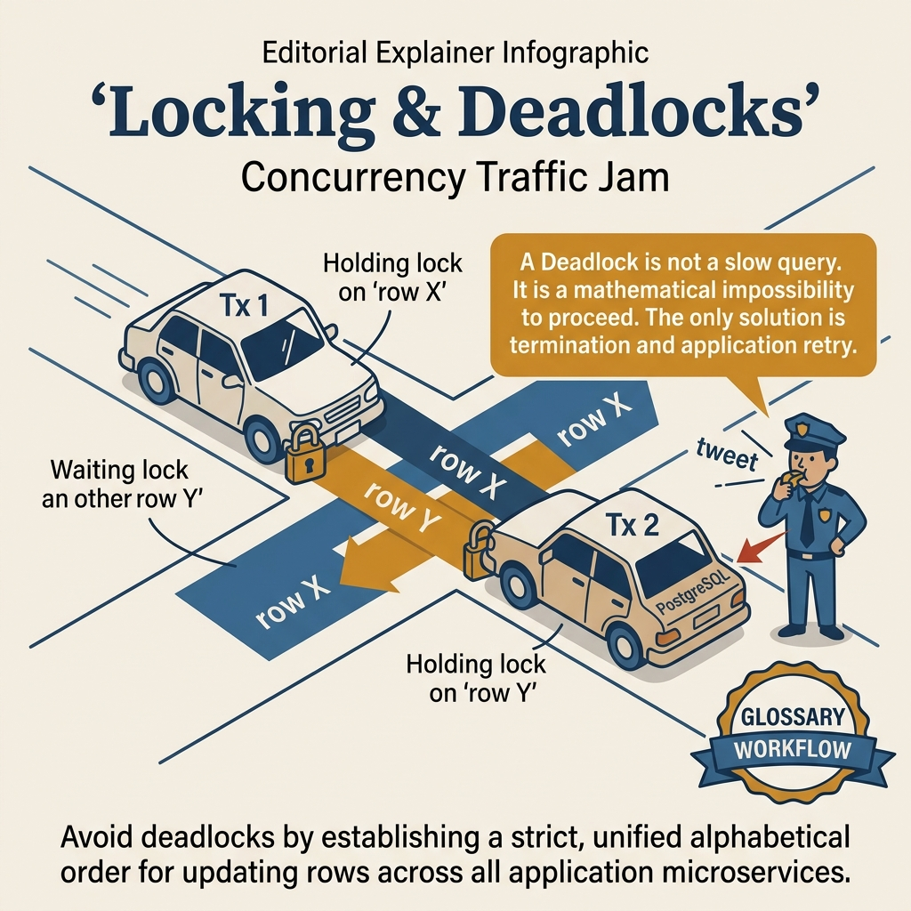
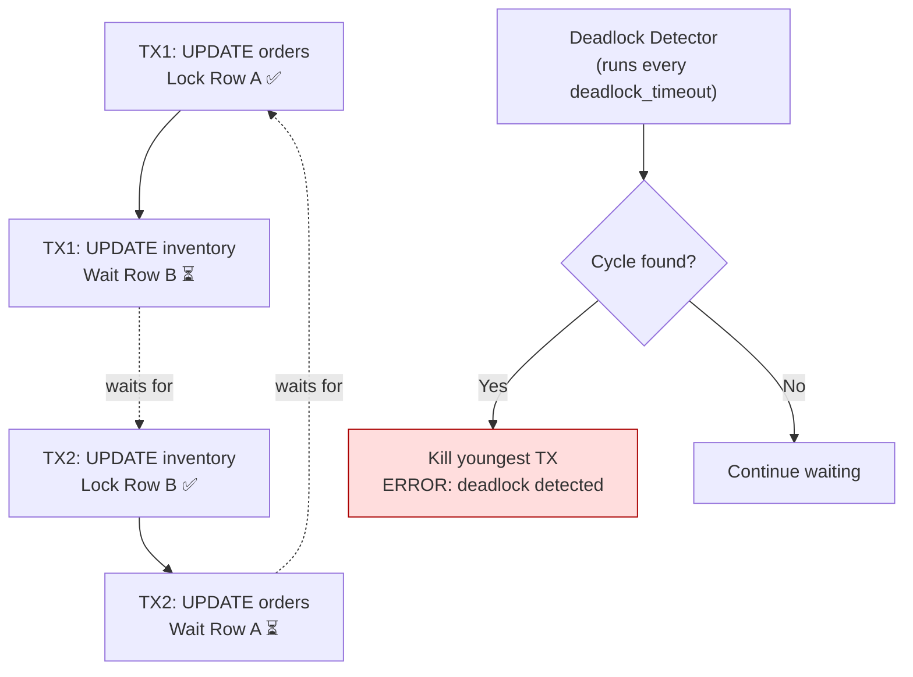

<!-- tags: sql, postgresql, database, deadlock -->
# 🔒 Deadlock & Locking — Detection, Prevention, Monitoring

> Hiểu cơ chế lock trong PostgreSQL, phát hiện & phòng tránh deadlock, monitoring lock contention trên production.

| Aspect           | Detail                                                     |
| ---------------- | ---------------------------------------------------------- |
| **Concept**      | Row locks, table locks, advisory locks, deadlock detection |
| **Use case**     | Concurrent writes, job queues, distributed locking         |
| **Go relevance** | pgx transactions, `FOR UPDATE`, retry patterns             |
| **CLI**          | `pg_locks`, `pg_stat_activity`, `pg_blocking_pids()`       |

---

📅 Ngày tạo: 2026-03-19 · 🔄 Cập nhật: 2026-04-04 · ⏱️ 18 phút đọc

---

## 1. DEFINE

3:14 AM. PostgreSQL log: `ERROR: deadlock detected`. Process 8742 chờ process 9156, process 9156 chờ process 8742. Cả hai stuck. Autovacuum bị block. Hàng trăm queries xếp hàng sau. App timeout cascade.

Postmortem: payment service UPDATE `orders SET status='paid'` rồi UPDATE `inventory SET stock=stock-1`. Shipping service UPDATE `inventory` rồi UPDATE `orders`. Hai services, hai bảng, **ngược thứ tự lock**. 99.99% thời gian không deadlock vì timing khác nhau — nhưng dưới load cao, xác suất collision tăng exponentially.

Fix nghe đơn giản: "luôn lock theo thứ tự alphabetical". Thực tế phức tạp hơn: implicit locks từ FK constraints, advisory locks, lock escalation. Bài này cover: lock types (Row, Page, Table), deadlock detection algorithm, prevention strategies, và monitoring queries.


| Variant | Mô tả |
| --- | --- |
| FOR UPDATE | Exclusive row lock · Block UPDATE, DELETE, FOR UPDATE · Prevent concurrent modify |
| FOR NO KEY UPDATE | Lock trừ FK checks · Block UPDATE, DELETE (nhưng FK OK) · Most UPDATE scenarios |
| FOR SHARE | Shared read lock · Block UPDATE, DELETE · Ensure data doesn't change |
| FOR KEY SHARE | Minimally restrictive · Block DELETE chỉ nếu key thay đổi · FK reference checking |

| Approach | Time | Space | Khi chọn |
| --- | --- | --- | --- |
| Lock Types & Detection | Phụ thuộc cardinality | Phụ thuộc row width | Dùng để nắm baseline semantics trước khi tune planner hoặc index. |
| Deadlock Prevention Patterns | Phụ thuộc plan | Phụ thuộc memory operator | Dùng khi query đã chạm index, cardinality hoặc join strategy. |
| Production Lock Monitoring & Analysis | Phụ thuộc workload | Phụ thuộc buffer/WAL | Dùng khi workload production cần cân bằng correctness, lock và rollout. |


### Selected Relation Lock Modes thường gặp trong PostgreSQL

PostgreSQL có nhiều relation lock mode. Bảng dưới đây là **subset thường gặp trên production**, đủ để reasoning cho DML, DDL, VACUUM và index rollout:

```text
┌─────────────────────────────────────────────────────┐
│  ACCESS EXCLUSIVE (DDL: DROP TABLE, ALTER TABLE)    │ ← Block mọi thứ
├─────────────────────────────────────────────────────┤
│  EXCLUSIVE (REFRESH MATERIALIZED VIEW CONCURRENTLY) │
├─────────────────────────────────────────────────────┤
│  SHARE UPDATE EXCLUSIVE (VACUUM, ANALYZE, CREATE INDEX CONCURRENTLY) │
├─────────────────────────────────────────────────────┤
│  SHARE (CREATE INDEX)                               │
├─────────────────────────────────────────────────────┤
│  ROW EXCLUSIVE (INSERT, UPDATE, DELETE)             │ ← Phổ biến nhất
├─────────────────────────────────────────────────────┤
│  ROW SHARE (SELECT FOR UPDATE/SHARE)                │
├─────────────────────────────────────────────────────┤
│  ACCESS SHARE (SELECT)                              │ ← Nhẹ nhất
└─────────────────────────────────────────────────────┘
```

### Row-Level Locks

| Lock Mode           | Mô tả                  | Block gì?                          | Use case                   |
| ------------------- | ---------------------- | ---------------------------------- | -------------------------- |
| `FOR UPDATE`        | Exclusive row lock     | Block UPDATE, DELETE, FOR UPDATE   | Prevent concurrent modify  |
| `FOR NO KEY UPDATE` | Lock trừ FK checks     | Block UPDATE, DELETE (nhưng FK OK) | Most UPDATE scenarios      |
| `FOR SHARE`         | Shared read lock       | Block UPDATE, DELETE               | Ensure data doesn't change |
| `FOR KEY SHARE`     | Minimally restrictive  | Block DELETE chỉ nếu key thay đổi  | FK reference checking      |
| `SKIP LOCKED`       | Bỏ qua rows đang lock  | —                                  | Job queue pattern          |
| `NOWAIT`            | Error ngay nếu bị lock | —                                  | Fast-fail pattern          |

### Deadlock — Khi nào xảy ra?

```text
Deadlock xảy ra khi 2+ transactions chờ nhau theo vòng tròn:

Transaction A:  LOCK row 1 → chờ LOCK row 2
Transaction B:  LOCK row 2 → chờ LOCK row 1
                    ↑                    │
                    └────────────────────┘
                         DEADLOCK!
```

**PostgreSQL tự detect deadlock** sau `deadlock_timeout` (default: 1s) và **kill 1 transaction** (victim) để phá vòng.

### Lock Conflicts Matrix

| Held \ Request   | ACCESS SHARE | ROW SHARE | ROW EXCL | SHARE UPDATE EXCL | SHARE | SHARE ROW EXCL | EXCL | ACCESS EXCL |
| ---------------- | ------------ | --------- | -------- | ----------------- | ----- | -------------- | ---- | ----------- |
| **ACCESS SHARE** | ✅           | ✅        | ✅       | ✅                | ✅    | ✅             | ✅   | ❌          |
| **ROW SHARE**    | ✅           | ✅        | ✅       | ✅                | ✅    | ✅             | ❌   | ❌          |
| **ROW EXCL**     | ✅           | ✅        | ✅       | ✅                | ❌    | ❌             | ❌   | ❌          |
| **SHARE**        | ✅           | ✅        | ❌       | ❌                | ✅    | ❌             | ❌   | ❌          |
| **ACCESS EXCL**  | ❌           | ❌        | ❌       | ❌                | ❌    | ❌             | ❌   | ❌          |

✅ = Compatible (cả 2 cùng hold) · ❌ = Conflict (phải chờ)

### Failure Modes

| Lỗi                             | Nguyên nhân             | Hậu quả                |
| ------------------------------- | ----------------------- | ---------------------- |
| `deadlock_detected` (40P01)     | Circular wait           | 1 transaction bị kill  |
| `lock_not_available`            | `NOWAIT` + row locked   | Immediate error        |
| `serialization_failure` (40001) | SSI conflict            | Transaction phải retry |
| Lock timeout                    | `lock_timeout` exceeded | Statement cancelled    |
| Table-level lock wait           | DDL during heavy DML    | Application stall      |

---

Các failure mode trên nghe quen. Nhưng có trap: advisory lock không auto-release = lock leak, và FOR UPDATE SKIP LOCKED misuse = data inconsistency. Trap đó sẽ xuất hiện ở PITFALLS.

## 2. VISUAL

Với Deadlock & Locking — Detection, Prevention, Monitoring, vocabulary thôi không cứu được bạn. Bottleneck chỉ lộ mặt khi plan, timeline hoặc đường đi của bộ nhớ và I/O được đặt lên bàn cùng lúc.




*Hình: Lock lifecycle — Acquisition (row/table/advisory) → Queue (FIFO, timeout) → Deadlock Detection (cycle check, 1 aborted) → Prevention (consistent ordering, SKIP LOCKED).*

### Level 1

```text
Timeline:
─────────────────────────────────────────────────────────────────

T1: BEGIN                  T2: BEGIN
    │                          │
t=0 │ UPDATE accounts        │
    │ SET balance -= 100      │
    │ WHERE id = 1  [LOCK ①]  │
    │                          │
t=1 │                          │ UPDATE accounts
    │                          │ SET balance -= 200
    │                          │ WHERE id = 2  [LOCK ②]
    │                          │
t=2 │ UPDATE accounts         │
    │ SET balance += 100       │
    │ WHERE id = 2  [WAIT ②!]  │ ← Chờ T2 release row 2
    │                          │
t=3 │                          │ UPDATE accounts
    │                          │ SET balance += 200
    │                          │ WHERE id = 1  [WAIT ①!] ← Chờ T1
    │                          │
    ╔══════════╗               │
    ║ DEADLOCK ║ ← PostgreSQL detect sau 1s, kill T2
    ╚══════════╝

FIX: Lock rows theo THỨ TỰ NHẤT QUÁN (sort by ID)

T1: BEGIN                  T2: BEGIN
    │                          │
    │ LOCK id=1 [✅]           │ LOCK id=1 [WAIT ← chờ T1]
    │ LOCK id=2 [✅]           │
    │ COMMIT    [RELEASE]     │
    │                          │ LOCK id=1 [✅ ← T1 đã release]
    │                          │ LOCK id=2 [✅]
    │                          │ COMMIT
    → Không deadlock!
```

```text
┌─ Lock Monitoring ─────────────────────────────────────────────┐
│                                                                │
│  pg_stat_activity        pg_locks           pg_blocking_pids  │
│  ┌──────────────┐       ┌──────────┐       ┌──────────────┐  │
│  │ PID: 12345   │──────▶│ relation │       │ blocked: 456 │  │
│  │ state: active│       │ locktype │       │ blocker: 123 │  │
│  │ query: ...   │       │ granted  │       └──────────────┘  │
│  │ wait_event   │       │ pid      │                          │
│  └──────────────┘       └──────────┘                          │
│         │                                                      │
│         ▼                                                      │
│  pg_stat_statements → Identify hot queries causing locks       │
│  log_lock_waits     → Log khi lock wait > deadlock_timeout     │
└────────────────────────────────────────────────────────────────┘
```

---

*Hình: Level 1 cho 🔒 Deadlock & Locking — Detection, Prevention, Monitoring — nhìn vào happy path hoặc baseline heuristic trước khi đi sâu vào planner và trade-off.*

### Level 2

```text
Decision Lens                 Dấu hiệu cần nhìn                 Hướng xử lý
---------------------------  --------------------------------  -------------------------------------------
Semantics trước               Kết quả có đúng intent không?    1. Lock Types & Detection
Planner / index signal        Cardinality, cost, buffers ra sao? 2. Deadlock Prevention Patterns
Production pressure           Lock, WAL, lag, rollback nào đau? 3. Production Lock Monitoring & Analysis
```

*Hình: Level 2 biến 🔒 Deadlock & Locking — Detection, Prevention, Monitoring thành checklist quyết định — từ semantics, sang plan signal, rồi đến áp lực production.*


### Architecture — Deadlock Detection



*Hình: TX1 giữ Row A chờ Row B, TX2 giữ Row B chờ Row A = circular wait. Deadlock detector kill TX mới nhất. Prevention: luôn lock theo thứ tự consistent.*

---
## 3. CODE

Khi tín hiệu trực quan của Deadlock & Locking — Detection, Prevention, Monitoring đã rõ, ta chuyển sang truy vấn, lệnh chẩn đoán và playbook có thể chạy thật. Bắt đầu từ baseline đơn giản rồi tăng dần áp lực workload.

### Problem 1: Basic — Lock Types & Detection

> **Mục tiêu**: Hiểu các loại lock, detect lock contention real-time
> **Cần**: PostgreSQL 15+, psql
> **Đạt được**: Biết cách monitor locks trên production


```sql
-- ═══════════════════════════════════════════
-- 1. Xem tất cả locks hiện tại
-- ═══════════════════════════════════════════

-- ✅ View active locks với thông tin chi tiết
SELECT
    l.pid,
    a.usename,
    l.locktype,
    l.relation::regclass AS table_name,
    l.mode,
    l.granted,
    a.query,
    a.state,
    a.wait_event_type,
    a.wait_event,
    age(now(), a.query_start) AS query_duration
FROM pg_locks l
JOIN pg_stat_activity a ON l.pid = a.pid
WHERE a.pid != pg_backend_pid()  -- Exclude current session
ORDER BY a.query_start;

-- ═══════════════════════════════════════════
-- 2. Tìm blocking chains — ai block ai?
-- ═══════════════════════════════════════════

-- ✅ Blocked processes + their blockers
SELECT
    blocked.pid     AS blocked_pid,
    blocked.query   AS blocked_query,
    age(now(), blocked.query_start) AS blocked_duration,
    blocker.pid     AS blocker_pid,
    blocker.query   AS blocker_query,
    age(now(), blocker.query_start) AS blocker_duration
FROM pg_stat_activity blocked
JOIN LATERAL (
    SELECT unnest(pg_blocking_pids(blocked.pid)) AS pid
) blocking_pids ON true
JOIN pg_stat_activity blocker ON blocker.pid = blocking_pids.pid
WHERE blocked.wait_event_type = 'Lock';

-- ═══════════════════════════════════════════
-- 3. Lock wait statistics
-- ═══════════════════════════════════════════

-- ✅ Tables with most lock contention
SELECT
    relname,
    n_tup_upd + n_tup_del AS total_writes,
    n_dead_tup,
    n_live_tup,
    round(100.0 * n_dead_tup / NULLIF(n_live_tup, 0), 2) AS dead_ratio
FROM pg_stat_user_tables
ORDER BY (n_tup_upd + n_tup_del) DESC
LIMIT 10;

-- ═══════════════════════════════════════════
-- 4. Configuration cho lock monitoring
-- ═══════════════════════════════════════════

-- ✅ Enable lock wait logging
ALTER SYSTEM SET log_lock_waits = on;          -- Log khi lock wait > deadlock_timeout
ALTER SYSTEM SET deadlock_timeout = '1s';       -- Default 1s, tăng nếu false positives
ALTER SYSTEM SET lock_timeout = '30s';          -- Max wait time cho locks
ALTER SYSTEM SET statement_timeout = '60s';     -- Max query execution time
SELECT pg_reload_conf();
```


> **✅ Đạt được**: Monitor locks real-time, tìm blocking chains, configure thresholds.
> **⚠️ Lưu ý**: `log_lock_waits` phải ON trên production để trace lock issues.

---

Lock types đã cover. Nhưng deadlock detection cần pg_locks — hãy investigate.

### Problem 2: Intermediate — Deadlock Prevention Patterns

> **Mục tiêu**: 4 patterns phòng tránh deadlock trong application code
> **Cần**: Hiểu transaction isolation
> **Đạt được**: Zero-deadlock application design


```sql
-- ═══════════════════════════════════════════
-- Pattern 1: Consistent Lock Ordering
-- ═══════════════════════════════════════════

-- ❌ BAD: Random lock order → deadlock risk
-- Session 1: UPDATE accounts WHERE id = 1; UPDATE accounts WHERE id = 2;
-- Session 2: UPDATE accounts WHERE id = 2; UPDATE accounts WHERE id = 1;

-- ✅ GOOD: Always lock in sorted order
-- Cả 2 sessions đều: LOCK id=1 trước, rồi id=2
BEGIN;
    -- Lock tất cả rows cần thiết TRƯỚC, theo thứ tự ID tăng dần
    SELECT * FROM accounts WHERE id IN (1, 2) ORDER BY id FOR UPDATE;
    -- Giờ safe để modify
    UPDATE accounts SET balance = balance - 100 WHERE id = 1;
    UPDATE accounts SET balance = balance + 100 WHERE id = 2;
COMMIT;

-- ═══════════════════════════════════════════
-- Pattern 2: SKIP LOCKED — Job Queue (lock-free)
-- ═══════════════════════════════════════════

-- ✅ Multiple workers grab different jobs — NO contention
-- Worker 1:
BEGIN;
    DELETE FROM job_queue
    WHERE id = (
        SELECT id FROM job_queue
        WHERE status = 'pending'
        ORDER BY priority DESC, created_at ASC
        LIMIT 1
        FOR UPDATE SKIP LOCKED  -- ✅ Skip rows locked by other workers
    )
    RETURNING *;
COMMIT;

-- ═══════════════════════════════════════════
-- Pattern 3: NOWAIT — Fast-Fail
-- ═══════════════════════════════════════════

-- ✅ Fail immediately instead of waiting (UI scenarios)
BEGIN;
    SELECT * FROM products WHERE id = 42 FOR UPDATE NOWAIT;
    -- If locked → ERROR: could not obtain lock on row
    -- Application catches error → show "item being edited by another user"
COMMIT;

-- ═══════════════════════════════════════════
-- Pattern 4: Advisory Locks (application-level)
-- ═══════════════════════════════════════════

-- ✅ Process-level mutex — only 1 instance runs
SELECT pg_try_advisory_lock(hashtext('daily_report'));
-- Returns true  → got lock, proceed
-- Returns false → another instance running, skip

-- ✅ Transaction-level — auto-released on COMMIT
BEGIN;
    SELECT pg_advisory_xact_lock(
        hashtext('user'),  -- namespace
        42                 -- user_id
    );
    -- Only 1 transaction can process user 42 at a time
    UPDATE user_stats SET ... WHERE user_id = 42;
COMMIT;  -- Lock auto-released

-- ✅ Timeout-based advisory lock
SELECT pg_try_advisory_lock(hashtext('cron_job'));
-- Do work...
SELECT pg_advisory_unlock(hashtext('cron_job'));
```

```go
// ✅ Go: Consistent lock ordering + deadlock retry
func (r *Repo) Transfer(ctx context.Context, fromID, toID int64, amount decimal.Decimal) error {
    return r.withRetry(ctx, 3, func() error {
        tx, err := r.pool.BeginTx(ctx, pgx.TxOptions{
            IsoLevel: pgx.ReadCommitted,
        })
        if err != nil {
            return err
        }
        defer tx.Rollback(ctx)

        // ✅ Pattern 1: Lock in sorted order → prevent deadlock
        ids := []int64{fromID, toID}
        sort.Slice(ids, func(i, j int) bool { return ids[i] < ids[j] })

        accounts := make(map[int64]decimal.Decimal)
        for _, id := range ids {
            var balance decimal.Decimal
            err := tx.QueryRow(ctx,
                `SELECT balance FROM accounts WHERE id = $1 FOR UPDATE`, id,
            ).Scan(&balance)
            if err != nil {
                return fmt.Errorf("lock account %d: %w", id, err)
            }
            accounts[id] = balance
        }

        // ✅ Business validation
        if accounts[fromID].LessThan(amount) {
            return ErrInsufficientBalance
        }

        // ✅ Execute transfer
        batch := &pgx.Batch{}
        batch.Queue(`UPDATE accounts SET balance = balance - $1 WHERE id = $2`, amount, fromID)
        batch.Queue(`UPDATE accounts SET balance = balance + $1 WHERE id = $2`, amount, toID)
        batch.Queue(`INSERT INTO transfer_log (from_id, to_id, amount) VALUES ($1, $2, $3)`,
            fromID, toID, amount)

        results := tx.SendBatch(ctx, batch)
        defer results.Close()
        for i := 0; i < 3; i++ {
            if _, err := results.Exec(); err != nil {
                return err
            }
        }

        return tx.Commit(ctx)
    })
}

// ✅ Generic retry wrapper for deadlocks + serialization failures
func (r *Repo) withRetry(ctx context.Context, maxRetries int, fn func() error) error {
    for attempt := 0; attempt < maxRetries; attempt++ {
        err := fn()
        if err == nil {
            return nil
        }

        var pgErr *pgconn.PgError
        if errors.As(err, &pgErr) {
            switch pgErr.Code {
            case "40P01": // deadlock_detected
                log.Printf("⚠️ Deadlock detected, retry %d/%d", attempt+1, maxRetries)
            case "40001": // serialization_failure
                log.Printf("⚠️ Serialization failure, retry %d/%d", attempt+1, maxRetries)
            default:
                return err // Non-retryable
            }
            // ✅ Exponential backoff
            jitter := time.Duration(rand.Intn(50)) * time.Millisecond
            time.Sleep(time.Duration(1<<attempt)*100*time.Millisecond + jitter)
            continue
        }
        return err
    }
    return fmt.Errorf("max retries (%d) exceeded", maxRetries)
}
```


> **✅ Đạt được**: 4 patterns phòng tránh deadlock + Go retry wrapper.
> **⚠️ Lưu ý**: LUÔN retry `40P01` (deadlock) và `40001` (serialization).

---

Deadlock đã cover. Nhưng lock-free patterns cần MVCC — hãy design around.

### Problem 3: Advanced — Production Lock Monitoring & Analysis

> **Mục tiêu**: Setup comprehensive lock monitoring, analyze lock contention patterns
> **Cần**: pg_stat_statements extension
> **Đạt được**: Proactive lock issue detection


```sql
-- ═══════════════════════════════════════════
-- 1. Lock Monitoring View — tạo 1 lần, dùng mãi
-- ═══════════════════════════════════════════

CREATE OR REPLACE VIEW v_lock_monitor AS
SELECT
    -- Blocked process info
    blocked.pid          AS blocked_pid,
    blocked.usename      AS blocked_user,
    blocked.application_name AS blocked_app,
    blocked.query        AS blocked_query,
    blocked.state        AS blocked_state,
    age(now(), blocked.query_start) AS blocked_duration,

    -- Blocker process info
    blocker.pid          AS blocker_pid,
    blocker.usename      AS blocker_user,
    blocker.application_name AS blocker_app,
    blocker.query        AS blocker_query,
    blocker.state        AS blocker_state,
    age(now(), blocker.query_start) AS blocker_duration,

    -- Lock info
    bl.locktype,
    bl.relation::regclass AS locked_table,
    bl.mode              AS blocked_mode

FROM pg_locks bl
JOIN pg_stat_activity blocked ON bl.pid = blocked.pid
JOIN pg_locks kl ON (
    kl.locktype = bl.locktype
    AND kl.database IS NOT DISTINCT FROM bl.database
    AND kl.relation IS NOT DISTINCT FROM bl.relation
    AND kl.page IS NOT DISTINCT FROM bl.page
    AND kl.tuple IS NOT DISTINCT FROM bl.tuple
    AND kl.transactionid IS NOT DISTINCT FROM bl.transactionid
    AND kl.classid IS NOT DISTINCT FROM bl.classid
    AND kl.objid IS NOT DISTINCT FROM bl.objid
    AND kl.objsubid IS NOT DISTINCT FROM bl.objsubid
    AND kl.pid != bl.pid
)
JOIN pg_stat_activity blocker ON kl.pid = blocker.pid
WHERE NOT bl.granted;

-- ✅ Usage: check blocked queries
SELECT * FROM v_lock_monitor ORDER BY blocked_duration DESC;

-- ═══════════════════════════════════════════
-- 2. Kill long-running blockers (emergency)
-- ═══════════════════════════════════════════

-- ✅ Cancel query (gentle)
SELECT pg_cancel_backend(blocker_pid)
FROM v_lock_monitor
WHERE blocked_duration > interval '5 minutes';

-- ✅ Terminate connection (force — last resort)
SELECT pg_terminate_backend(blocker_pid)
FROM v_lock_monitor
WHERE blocked_duration > interval '10 minutes';

-- ═══════════════════════════════════════════
-- 3. Deadlock analysis từ logs
-- ═══════════════════════════════════════════

-- ✅ PostgreSQL log sẽ show:
-- LOG:  process 12345 detected deadlock while waiting for ShareLock on transaction 67890
-- DETAIL:  Process holding the lock: 67890.
--          Wait queue: 12345.
-- CONTEXT: while updating tuple (0,42) in relation "accounts"
-- STATEMENT: UPDATE accounts SET balance = balance - 100 WHERE id = 2

-- ✅ Query deadlock frequency (cần pg_stat_statements)
SELECT
    query,
    calls,
    mean_exec_time,
    rows
FROM pg_stat_statements
WHERE query ILIKE '%accounts%'
  AND query ILIKE '%UPDATE%'
ORDER BY calls DESC;

-- ═══════════════════════════════════════════
-- 4. DDL Lock Prevention — safe schema changes
-- ═══════════════════════════════════════════

-- ❌ BAD: ALTER TABLE blocks ALL reads + writes
ALTER TABLE users ADD COLUMN phone text;
-- → ACCESS EXCLUSIVE lock → blocks everything!

-- ✅ GOOD: Set low lock_timeout to fail fast
SET lock_timeout = '5s';
ALTER TABLE users ADD COLUMN phone text;
-- If can't get lock in 5s → fails instead of blocking traffic

-- ✅ GOOD: CONCURRENTLY for indexes
CREATE INDEX CONCURRENTLY idx_users_phone ON users(phone);
-- → SHARE UPDATE EXCLUSIVE on target relation
-- → avoids blocking ordinary SELECT/INSERT/UPDATE/DELETE
-- → still conflicts with some schema changes and maintenance operations
```

```go
// ✅ Go: Advisory lock for cron jobs — only 1 instance
func (s *Scheduler) RunExclusiveJob(ctx context.Context, jobName string, fn func(ctx context.Context) error) error {
    lockKey := int64(crc32.ChecksumIEEE([]byte(jobName)))

    // ✅ Try to acquire advisory lock (non-blocking)
    var acquired bool
    err := s.pool.QueryRow(ctx,
        `SELECT pg_try_advisory_lock($1)`, lockKey,
    ).Scan(&acquired)
    if err != nil {
        return fmt.Errorf("advisory lock check: %w", err)
    }

    if !acquired {
        log.Printf("⏭️ Job %s already running on another instance, skipping", jobName)
        return nil
    }

    // ✅ Release lock when done
    defer func() {
        _, _ = s.pool.Exec(ctx, `SELECT pg_advisory_unlock($1)`, lockKey)
    }()

    log.Printf("🔒 Acquired lock for job: %s", jobName)
    return fn(ctx)
}
```


> **✅ Đạt được**: Lock monitoring view, emergency kill, DDL safety, advisory lock cron.
> **⚠️ Lưu ý**: `pg_terminate_backend` là biện pháp cuối cùng — có thể gây rollback.

---
Bạn đã đi qua locking, deadlock detection, và lock-free patterns. Bây giờ đến phần nguy hiểm: advisory lock leak và SKIP LOCKED misuse — trap đã được setup từ đầu bài.

## 4. PITFALLS

Deadlock & Locking — Detection, Prevention, Monitoring rất dễ bị dùng theo phản xạ: thấy chậm là thêm index, thấy lag là tăng tài nguyên. Phần dưới đây gom những lỗi tối ưu tưởng đúng nhưng lại làm latency, lock hoặc chi phí vận hành tệ hơn.

| # | Severity | Lỗi | Hậu quả | Fix |
| --- | --- | --- | --- | --- |
| 1 | 🔴 Fatal | Hai services lock bảng ngược thứ tự | Deadlock → transaction bị kill → user-facing error → retry storm | Lock consistent order: alphabetical by table name, ascending by PK |
| 2 | 🔴 Fatal | SELECT ... FOR UPDATE không SKIP LOCKED trong batch job | Batch job lock toàn bộ rows → block mọi concurrent access 30 phút | `FOR UPDATE SKIP LOCKED` — skip rows đang bị lock, xử lý batch sau |
| 3 | 🟡 Common | Long-running transaction giữ lock implicit | Block autovacuum + block DDL + accumulate dead tuples | `idle_in_transaction_session_timeout = 30s`, kill after 30 min |
| 4 | 🟡 Common | FK constraint tạo implicit lock mà developer không biết | DELETE parent row lock child table → unexpected wait | Hiểu FK lock behavior: DELETE/UPDATE parent = ShareRowExclusiveLock on child |
| 5 | 🔵 Minor | Không set `deadlock_timeout` phù hợp | Default 1s — deadlock detector chạy mỗi giây, overhead trên high-concurrency | Set 500ms-2s tùy workload, monitor `pg_stat_activity` wait events |

---
Bạn đã đi qua Deadlock & Locking và cạm bẫy. Các resources dưới đây giúp đi sâu hơn.

## 5. REF

| Resource           | Link                                                                                                                                                               |
| ------------------ | ------------------------------------------------------------------------------------------------------------------------------------------------------------------ |
| PG Lock Types      | [postgresql.org/docs/current/explicit-locking.html](https://www.postgresql.org/docs/current/explicit-locking.html)                                                 |
| Advisory Locks     | [postgresql.org/docs/current/functions-admin.html#FUNCTIONS-ADVISORY-LOCKS](https://www.postgresql.org/docs/current/functions-admin.html#FUNCTIONS-ADVISORY-LOCKS) |
| Deadlock Detection | [postgresql.org/docs/current/runtime-config-locks.html](https://www.postgresql.org/docs/current/runtime-config-locks.html)                                         |
| pg_locks View      | [postgresql.org/docs/current/view-pg-locks.html](https://www.postgresql.org/docs/current/view-pg-locks.html)                                                       |
| Lock Monitoring    | [wiki.postgresql.org/wiki/Lock_Monitoring](https://wiki.postgresql.org/wiki/Lock_Monitoring)                                                                       |

---

## 6. RECOMMEND

Khi các bẫy thường gặp của Deadlock & Locking — Detection, Prevention, Monitoring đã lộ mặt, bạn có thể nối bài này sang maintenance, replication hoặc triage workflow để quyết định tuning không bị cô lập.

| Mở rộng                         | Khi nào                | Lý do                                 |
| ------------------------------- | ---------------------- | ------------------------------------- |
| **pg_stat_statements**          | Production monitoring  | Track queries causing most lock waits |
| **pgBadger log analysis**       | Post-mortem            | Parse logs cho deadlock patterns      |
| **Optimistic locking**          | Low contention         | Version column thay vì `FOR UPDATE`   |
| **SKIP LOCKED + LISTEN/NOTIFY** | Job queue              | Event-driven job processing           |
| **pg_cron**                     | Scheduled lock cleanup | Kill long-running idle transactions   |


> **Callback** — Quay lại deadlock 3:14 AM: payment update orders→inventory, shipping update inventory→orders — ngược thứ tự. Fix: cả hai services lock theo alphabetical order (inventory trước orders). Simple rule, zero deadlocks kể từ đó.

---

← Previous: [01-index-deep-dive.md](./01-index-deep-dive.md) · → Next: [03-pagination-techniques.md](./03-pagination-techniques.md)

---

## 7. QUICK REF

| Signal | Kiểm tra | Action |
| --- | --- | --- |
| `ERROR: deadlock detected` | `pg_locks` + `pg_stat_activity` | Identify lock order → fix to consistent order |
| Long-running queries blocked | `wait_event_type = 'Lock'` | Kill blocking session hoặc optimize |
| Autovacuum blocked > 1 giờ | `pg_stat_activity WHERE backend_type = 'autovacuum'` | Kill conflicting transactions |
| Batch job slow | `FOR UPDATE` without SKIP LOCKED | Add `SKIP LOCKED` for concurrent batch safety |
