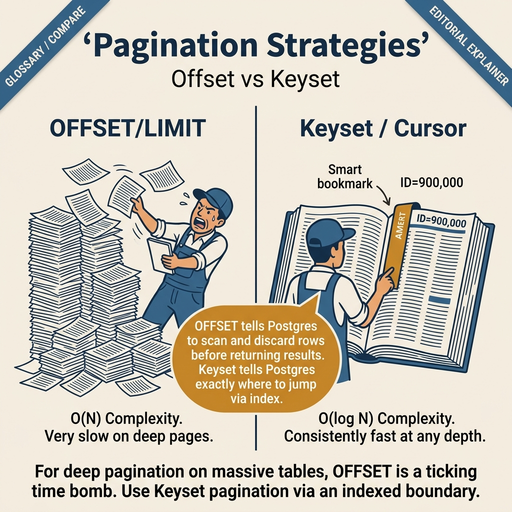
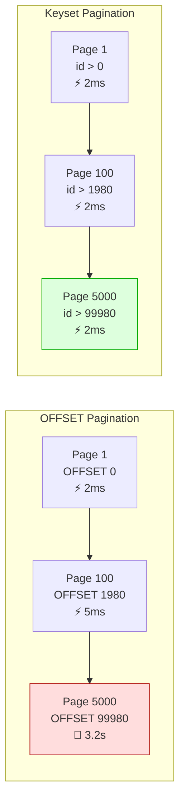

<!-- tags: sql, postgresql, database -->
# 📄 Pagination Techniques — Offset vs Keyset vs Cursor

> So sánh chi tiết 3 chiến lược phân trang: hiểu trade-offs, chọn đúng cho từng tình huống, implement với Go + pgx.

| Aspect           | Detail                                                   |
| ---------------- | -------------------------------------------------------- |
| **Concept**      | Offset pagination, keyset/cursor pagination, seek method |
| **Use case**     | API endpoints, infinite scroll, report generation        |
| **Go relevance** | pgx query building, API response design                  |
| **Performance**  | Offset O(n) worst → Keyset O(1) constant                 |

---

📅 Ngày tạo: 2026-03-19 · 🔄 Cập nhật: 2026-04-04 · ⏱️ 16 phút đọc

---

## 1. DEFINE

API `/products?page=5000&size=20`. Backend: `SELECT * FROM products ORDER BY id LIMIT 20 OFFSET 99980`. PostgreSQL phải: sort 100,000 rows, skip 99,980, return 20. Mỗi page request scan gần toàn bộ table — page 1 mất 2ms, page 5000 mất **3.2 giây**. Linear degradation theo page number.

Switching sang keyset pagination: `WHERE id > $last_seen_id ORDER BY id LIMIT 20`. PostgreSQL seek index trực tiếp đến vị trí — mọi page đều 2ms, bất kể page number. Nhưng keyset không hỗ trợ "nhảy đến page 5000" — phải scroll tuần tự.

Săn third option: cursor-based pagination giữ server-side state, OFFSET chấp nhận được khi total < 10K rows. Bài này cover khi nào dùng OFFSET, keyset, cursor — và trade-off của từng approach.


| Variant | Mô tả |
| --- | --- |
| Offset | LIMIT n OFFSET skip · ❌ O(skip+n) — chậm dần · ✅ Có · ❌ Không (row shift) |
| Keyset | WHERE id > last_id LIMIT n · ✅ O(n) — constant · ❌ Không · ✅ Có |
| Cursor | DECLARE CURSOR ... FETCH n · ✅ O(n) constant · ❌ Không · ⚠️ Trong transaction |

| Approach | Time | Space | Khi chọn |
| --- | --- | --- | --- |
| Offset vs Keyset Side — by — Side | Phụ thuộc cardinality | Phụ thuộc row width | Dùng để nắm baseline semantics trước khi tune planner hoặc index. |
| Keyset với Composite Sort + Go API | Phụ thuộc plan | Phụ thuộc memory operator | Dùng khi query đã chạm index, cardinality hoặc join strategy. |
| Combining Techniques cho Complex Queries | Phụ thuộc workload | Phụ thuộc buffer/WAL | Dùng khi workload production cần cân bằng correctness, lock và rollout. |


### 3 chiến lược phân trang

| Strategy   | Cách hoạt động               | Performance             | Jump to page? | Stable?              |
| ---------- | ---------------------------- | ----------------------- | ------------- | -------------------- |
| **Offset** | `LIMIT n OFFSET skip`        | ❌ O(skip+n) — chậm dần | ✅ Có         | ❌ Không (row shift) |
| **Keyset** | `WHERE id > last_id LIMIT n` | ✅ O(n) — constant      | ❌ Không      | ✅ Có                |
| **Cursor** | `DECLARE CURSOR ... FETCH n` | ✅ O(n) constant        | ❌ Không      | ⚠️ Trong transaction |

### Tại sao Offset chậm?

```text
Query: SELECT * FROM orders ORDER BY id LIMIT 20 OFFSET 1000000;

PostgreSQL phải:
  1. Scan + sort TẤT CẢ rows potentially (index scan if lucky)
  2. Skip 1,000,000 rows ← chi phí ở đây!
  3. Return 20 rows

→ Page 1:       OFFSET 0        → nhanh
→ Page 100:     OFFSET 2000     → OK
→ Page 50,000:  OFFSET 1000000  → RẤT CHẬM (scan 1M rows rồi bỏ)
```

### Keyset giải quyết thế nào?

```text
Query: SELECT * FROM orders WHERE id > 1000000 ORDER BY id LIMIT 20;

PostgreSQL:
  1. Index Scan từ id = 1000000
  2. Đọc 20 rows tiếp theo ← chỉ đọc đúng 20!

→ Page 1:       WHERE id > 0            → nhanh
→ Page 100:     WHERE id > last_id      → nhanh
→ Page 50,000:  WHERE id > last_id      → VẪN NHANH (O(1) index seek)
```

### Khi nào dùng cái nào?

| Scenario                      | Recommendation | Lý do                              |
| ----------------------------- | -------------- | ---------------------------------- |
| Admin panel với page numbers  | **Offset**     | Cần jump to page, data nhỏ         |
| Mobile infinite scroll        | **Keyset**     | Không cần page number, performance |
| API cho client apps           | **Keyset**     | Stable pagination, scalable        |
| Report generation             | **Cursor**     | Sequential processing, server-side |
| Data < 10K rows               | **Offset**     | Đủ nhanh, simple                   |
| Data > 100K rows              | **Keyset**     | Offset quá chậm ở pages sau        |
| Real-time feed (Twitter-like) | **Keyset**     | New data không shift pages         |

---

Các failure mode trên nghe rõ. Nhưng có trap: OFFSET trên large dataset = O(n) scan mỗi page, và cursor-based pagination với duplicate sort key = skip/duplicate rows. Trap đó sẽ xuất hiện ở PITFALLS.

## 2. VISUAL

Với Pagination Techniques — Offset vs Keyset vs Cursor, vocabulary thôi không cứu được bạn. Bottleneck chỉ lộ mặt khi plan, timeline hoặc đường đi của bộ nhớ và I/O được đặt lên bàn cùng lúc.




*Hình: 3 pagination strategies — OFFSET/LIMIT (simple, degrades deep), Keyset WHERE > last_id (O(log N), scalable), CURSOR (server-side, batch processing).*

### Level 1

```text
Response Time (ms)
│
│  1000ms ┤                                         ╱ Offset
│         │                                       ╱
│   500ms ┤                                     ╱
│         │                                   ╱
│   200ms ┤                                ╱
│         │                              ╱
│   100ms ┤                           ╱
│         │                        ╱
│    50ms ┤                     ╱
│         │                  ╱
│    10ms ┤  ─ ─ ─ ─ ─ ─ ─ ─ ─ ─ ─ ─ ─ ─ ─ ─ ─ ─  Keyset (constant!)
│         │╱
│     5ms ┤
│         └──────────────────────────────────────────
│         Page 1      1000     5000    10000   50000
```

```text
Client                   Server                    Database
  │                        │                          │
  │ GET /orders?limit=20   │                          │
  │───────────────────────▶│  SELECT * FROM orders    │
  │                        │  ORDER BY id LIMIT 20    │
  │                        │─────────────────────────▶│
  │                        │◀─rows (id: 1..20)────────│
  │◀─{ data, cursor: 20 }─│                          │
  │                        │                          │
  │ GET /orders?           │                          │
  │   after=20&limit=20    │  SELECT * FROM orders    │
  │───────────────────────▶│  WHERE id > 20           │
  │                        │  ORDER BY id LIMIT 20    │
  │                        │─────────────────────────▶│
  │                        │◀─rows (id: 21..40)───────│
  │◀─{ data, cursor: 40 }─│                          │
```

---

*Hình: Level 1 cho 📄 Pagination Techniques — Offset vs Keyset vs Cursor — nhìn vào happy path hoặc baseline heuristic trước khi đi sâu vào planner và trade-off.*

### Level 2

```text
Decision Lens                 Dấu hiệu cần nhìn                 Hướng xử lý
---------------------------  --------------------------------  -------------------------------------------
Semantics trước               Kết quả có đúng intent không?    1. Offset vs Keyset Side — by — Side
Planner / index signal        Cardinality, cost, buffers ra sao? 2. Keyset với Composite Sort + Go API
Production pressure           Lock, WAL, lag, rollback nào đau? 3. Combining Techniques cho Complex Queries
```

*Hình: Level 2 biến 📄 Pagination Techniques — Offset vs Keyset vs Cursor thành checklist quyết định — từ semantics, sang plan signal, rồi đến áp lực production.*


### Architecture — Pagination Performance Comparison



*Hình: OFFSET scan + skip = O(offset) — linear degradation. Keyset seek index = O(1) — constant time mọi page. Trade-off: keyset không support random page access.*

---
## 3. CODE

Khi tín hiệu trực quan của Pagination Techniques — Offset vs Keyset vs Cursor đã rõ, ta chuyển sang truy vấn, lệnh chẩn đoán và playbook có thể chạy thật. Bắt đầu từ baseline đơn giản rồi tăng dần áp lực workload.

### Problem 1: Basic — Offset vs Keyset Side-by-Side

> **Mục tiêu**: So sánh cùng 1 dataset, 2 cách paginate
> **Cần**: Table với 1M+ rows
> **Đạt được**: Thấy rõ performance difference


```sql
-- ═══════════════════════════════════════════
-- Setup: 2 triệu orders
-- ═══════════════════════════════════════════
CREATE TABLE orders (
    id          bigint GENERATED ALWAYS AS IDENTITY PRIMARY KEY,
    customer_id integer NOT NULL,
    amount      numeric(10,2) NOT NULL,
    status      text NOT NULL DEFAULT 'pending',
    created_at  timestamptz NOT NULL DEFAULT now()
);

INSERT INTO orders (customer_id, amount, status, created_at)
SELECT
    (random() * 10000)::int,
    (random() * 1000)::numeric(10,2),
    (ARRAY['pending','paid','shipped','delivered'])[1 + (random()*3)::int],
    now() - (random() * 365 * 2)::int * interval '1 day'
FROM generate_series(1, 2000000);

CREATE INDEX idx_orders_created ON orders(created_at DESC, id DESC);
ANALYZE orders;

-- ═══════════════════════════════════════════
-- OFFSET Pagination
-- ═══════════════════════════════════════════

-- ✅ Page 1 — nhanh
EXPLAIN (ANALYZE, BUFFERS)
SELECT * FROM orders ORDER BY created_at DESC, id DESC
LIMIT 20 OFFSET 0;
-- Execution: ~0.5ms ✅

-- 🐌 Page 50,000 — CHẬM
EXPLAIN (ANALYZE, BUFFERS)
SELECT * FROM orders ORDER BY created_at DESC, id DESC
LIMIT 20 OFFSET 1000000;
-- Execution: ~800ms 🐌
-- → PostgreSQL scan 1M rows rồi bỏ!

-- ═══════════════════════════════════════════
-- KEYSET Pagination
-- ═══════════════════════════════════════════

-- ✅ Page 1 — nhanh
EXPLAIN (ANALYZE, BUFFERS)
SELECT * FROM orders ORDER BY created_at DESC, id DESC
LIMIT 20;
-- Execution: ~0.3ms ✅

-- ✅ Page 50,000 — VẪN NHANH!
-- Giả sử cursor từ page trước: created_at='2024-06-15', id=1000001
EXPLAIN (ANALYZE, BUFFERS)
SELECT * FROM orders
WHERE (created_at, id) < ('2024-06-15'::timestamptz, 1000001)
ORDER BY created_at DESC, id DESC
LIMIT 20;
-- Execution: ~0.5ms ✅
-- → Index seek trực tiếp, chỉ đọc 20 rows!
```


> **✅ Đạt được**: Keyset nhanh hơn 1600x ở page 50,000.
> **⚠️ Lưu ý**: ROW value comparison `(a, b) < (x, y)` sử dụng composite index hiệu quả.

---

OFFSET pagination đã cover. Nhưng keyset pagination cần cursor — hãy optimize.

### Problem 2: Intermediate — Keyset với Composite Sort + Go API

> **Mục tiêu**: Implement keyset pagination cho real-world API
> **Cần**: Composite cursor (multiple columns), bi-directional
> **Đạt được**: Production-ready paginated API


```sql
-- ═══════════════════════════════════════════
-- Keyset với composite sort: status + created_at + id
-- ═══════════════════════════════════════════

-- ✅ Composite index cho sort order
CREATE INDEX idx_orders_status_created_id
    ON orders(status, created_at DESC, id DESC);

-- ✅ Forward pagination (next page)
SELECT * FROM orders
WHERE status = 'paid'
  AND (created_at, id) < ($1, $2)  -- cursor from previous page
ORDER BY created_at DESC, id DESC
LIMIT $3;  -- page_size

-- ✅ Backward pagination (previous page)
SELECT * FROM (
    SELECT * FROM orders
    WHERE status = 'paid'
      AND (created_at, id) > ($1, $2)  -- cursor from current page start
    ORDER BY created_at ASC, id ASC  -- reverse order
    LIMIT $3
) sub
ORDER BY created_at DESC, id DESC;  -- re-sort to original order

-- ═══════════════════════════════════════════
-- Estimated total count (for UI "page X of ~Y")
-- ═══════════════════════════════════════════

-- ✅ FAST approximate count (< 1ms)
SELECT reltuples::bigint AS estimated_count
FROM pg_class
WHERE relname = 'orders';

-- ✅ FAST approximate with filter (using statistics)
SELECT
    n_live_tup * (
        SELECT null_frac FROM pg_stats
        WHERE tablename = 'orders' AND attname = 'status'
    ) AS estimated_paid_orders
FROM pg_stat_user_tables
WHERE relname = 'orders';

-- ❌ SLOW exact count — avoid on large tables
-- SELECT count(*) FROM orders WHERE status = 'paid';
-- → 500ms+ on 2M rows!
```

```go
// ✅ Go: Keyset pagination API handler
package handler

type PaginationCursor struct {
    CreatedAt time.Time `json:"created_at"`
    ID        int64     `json:"id"`
}

type PaginatedResponse[T any] struct {
    Data       []T               `json:"data"`
    NextCursor *PaginationCursor `json:"next_cursor,omitempty"`
    PrevCursor *PaginationCursor `json:"prev_cursor,omitempty"`
    HasMore    bool              `json:"has_more"`
    Total      int64             `json:"total_estimated"` // approximate
}

func (h *OrderHandler) ListOrders(ctx context.Context, req ListOrdersRequest) (*PaginatedResponse[Order], error) {
    pageSize := req.PageSize
    if pageSize <= 0 || pageSize > 100 {
        pageSize = 20 // default
    }

    // ✅ Fetch N+1 rows to check hasMore
    fetchSize := pageSize + 1

    var rows pgx.Rows
    var err error

    if req.Cursor != nil {
        // ✅ Keyset: WHERE (created_at, id) < (cursor)
        rows, err = h.pool.Query(ctx,
            `SELECT id, customer_id, amount, status, created_at
             FROM orders
             WHERE status = $1
               AND (created_at, id) < ($2, $3)
             ORDER BY created_at DESC, id DESC
             LIMIT $4`,
            req.Status, req.Cursor.CreatedAt, req.Cursor.ID, fetchSize,
        )
    } else {
        // ✅ First page
        rows, err = h.pool.Query(ctx,
            `SELECT id, customer_id, amount, status, created_at
             FROM orders
             WHERE status = $1
             ORDER BY created_at DESC, id DESC
             LIMIT $2`,
            req.Status, fetchSize,
        )
    }
    if err != nil {
        return nil, err
    }
    defer rows.Close()

    orders, err := pgx.CollectRows(rows, pgx.RowToStructByName[Order])
    if err != nil {
        return nil, err
    }

    // ✅ Check hasMore + trim to pageSize
    hasMore := len(orders) > pageSize
    if hasMore {
        orders = orders[:pageSize]
    }

    // ✅ Build cursors
    var nextCursor *PaginationCursor
    if hasMore && len(orders) > 0 {
        last := orders[len(orders)-1]
        nextCursor = &PaginationCursor{
            CreatedAt: last.CreatedAt,
            ID:        last.ID,
        }
    }

    // ✅ Approximate total (fast)
    var estimatedTotal int64
    _ = h.pool.QueryRow(ctx,
        `SELECT reltuples::bigint FROM pg_class WHERE relname = 'orders'`,
    ).Scan(&estimatedTotal)

    return &PaginatedResponse[Order]{
        Data:       orders,
        NextCursor: nextCursor,
        HasMore:    hasMore,
        Total:      estimatedTotal,
    }, nil
}
```


> **✅ Đạt được**: Bi-directional keyset, N+1 trick, approximate count, Go generics.
> **⚠️ Lưu ý**: Client encode/decode cursor (Base64 JSON).

---

Keyset đã cover. Nhưng cursor-based server-side cần DECLARE/FETCH — hãy stream.

### Problem 3: Advanced — Combining Techniques cho Complex Queries

> **Mục tiêu**: Keyset + Window functions + CTE cho advanced pagination
> **Cần**: Complex sorting, filtering, search
> **Đạt được**: High-performance pagination trên complex queries


```sql
-- ═══════════════════════════════════════════
-- Full-text Search + Keyset Pagination
-- ═══════════════════════════════════════════

-- ✅ FTS search với relevance ranking + keyset
WITH search_results AS (
    SELECT
        id, title, body,
        ts_rank(search_vector, query) AS rank,
        created_at
    FROM articles,
         to_tsquery('english', 'postgresql & performance') AS query
    WHERE search_vector @@ query
)
SELECT * FROM search_results
WHERE (rank, id) < ($1, $2)  -- cursor: (last_rank, last_id)
ORDER BY rank DESC, id DESC
LIMIT 20;

-- ✅ Index: GIN on search_vector + B-tree on (rank, id)

-- ═══════════════════════════════════════════
-- Deferred Join — Fastest offset pagination
-- ═══════════════════════════════════════════

-- ❌ SLOW: fetch ALL columns then offset
SELECT * FROM orders ORDER BY created_at DESC LIMIT 20 OFFSET 500000;

-- ✅ FAST: offset on index-only, then join
SELECT o.*
FROM orders o
JOIN (
    SELECT id FROM orders
    ORDER BY created_at DESC
    LIMIT 20 OFFSET 500000   -- Index Only Scan (tiny)
) ids ON o.id = ids.id
ORDER BY o.created_at DESC;
-- → 10x faster vì inner query chỉ scan index (nhỏ)

-- ═══════════════════════════════════════════
-- Cursor-based pagination (server-side)
-- ═══════════════════════════════════════════

-- ✅ PostgreSQL CURSOR — for batch processing
BEGIN;
    DECLARE order_cursor SCROLL CURSOR FOR
        SELECT * FROM orders
        WHERE status = 'pending'
        ORDER BY created_at;

    -- Fetch 100 records at a time
    FETCH FORWARD 100 FROM order_cursor;
    -- Process batch...
    FETCH FORWARD 100 FROM order_cursor;
    -- Process batch...

    -- Jump backward
    FETCH BACKWARD 50 FROM order_cursor;

    CLOSE order_cursor;
COMMIT;

-- ═══════════════════════════════════════════
-- Pagination Statistics — track usage
-- ═══════════════════════════════════════════

-- ✅ Monitor: users actually go beyond page 10?
CREATE TABLE pagination_analytics (
    endpoint    text NOT NULL,
    page_depth  integer NOT NULL,
    response_ms integer NOT NULL,
    created_at  timestamptz DEFAULT now()
);

-- ✅ Nếu 99% users chỉ xem page 1-5 → offset OK
-- ✅ Nếu có use case page > 100 → MUST use keyset
SELECT
    endpoint,
    percentile_cont(0.50) WITHIN GROUP (ORDER BY page_depth) AS p50_depth,
    percentile_cont(0.95) WITHIN GROUP (ORDER BY page_depth) AS p95_depth,
    percentile_cont(0.99) WITHIN GROUP (ORDER BY page_depth) AS p99_depth,
    avg(response_ms) AS avg_ms
FROM pagination_analytics
GROUP BY endpoint;
```

```go
// ✅ Go: Deferred join for offset pagination (when keyset not possible)
func (r *Repo) ListWithDeferredJoin(ctx context.Context, page, pageSize int) ([]Order, error) {
    offset := (page - 1) * pageSize

    rows, err := r.pool.Query(ctx, `
        SELECT o.*
        FROM orders o
        JOIN (
            SELECT id FROM orders
            ORDER BY created_at DESC
            LIMIT $1 OFFSET $2
        ) ids ON o.id = ids.id
        ORDER BY o.created_at DESC
    `, pageSize, offset)
    if err != nil {
        return nil, err
    }
    defer rows.Close()

    return pgx.CollectRows(rows, pgx.RowToStructByName[Order])
}
```


> **✅ Đạt được**: FTS + keyset, deferred join, PG cursor, analytics tracking.
> **⚠️ Lưu ý**: Deferred join chỉ hiệu quả khi inner query dùng Index Only Scan.

---
Bạn đã đi qua OFFSET, keyset, và cursor. Bây giờ đến phần nguy hiểm: O(n) OFFSET và duplicate sort key — trap đã được setup từ đầu bài.

## 4. PITFALLS

Pagination Techniques — Offset vs Keyset vs Cursor rất dễ bị dùng theo phản xạ: thấy chậm là thêm index, thấy lag là tăng tài nguyên. Phần dưới đây gom những lỗi tối ưu tưởng đúng nhưng lại làm latency, lock hoặc chi phí vận hành tệ hơn.

| # | Severity | Lỗi | Hậu quả | Fix |
| --- | --- | --- | --- | --- |
| 1 | 🔵 Minor | OFFSET trên millions rows | — | Dùng keyset pagination |
| 2 | 🔵 Minor | *count(\*) trên mỗi request** | — | pg_class.reltuples cho approximate count |
| 3 | 🔵 Minor | Keyset thiếu tie-breaker | — | Luôn include unique column (ID) trong cursor |
| 4 | 🔵 Minor | ROW value comparison sai index | — | (a, b) < (x, y) cần composite index (a, b) |
| 5 | 🔵 Minor | Cursor không encode | — | Base64 cursor → client không sửa được |
| 6 | 🟡 Common | OFFSET + concurrent INSERT | — | Row shift → duplicate/missing data |
| 7 | 🔵 Minor | Ignore page depth analytics | — | 99% users ở page 1-5, optimize cho đó |

---
Bạn đã đi qua Pagination Techniques và cạm bẫy. Các resources dưới đây giúp đi sâu hơn.

## 5. REF

| Resource                         | Link                                                                                                                       |
| -------------------------------- | -------------------------------------------------------------------------------------------------------------------------- |
| Use The Index, Luke (Pagination) | [use-the-index-luke.com/no-offset](https://use-the-index-luke.com/no-offset)                                               |
| PG FETCH FIRST                   | [postgresql.org/docs/current/sql-select.html#SQL-LIMIT](https://www.postgresql.org/docs/current/sql-select.html#SQL-LIMIT) |
| PG DECLARE CURSOR                | [postgresql.org/docs/current/sql-declare.html](https://www.postgresql.org/docs/current/sql-declare.html)                   |
| Slack Keyset Post                | [slack.engineering/evolving-api-pagination](https://slack.engineering/evolving-api-pagination-at-slack/)                   |

---

## 6. RECOMMEND

Khi các bẫy thường gặp của Pagination Techniques — Offset vs Keyset vs Cursor đã lộ mặt, bạn có thể nối bài này sang maintenance, replication hoặc triage workflow để quyết định tuning không bị cô lập.

| Mở rộng                 | Khi nào                     | Lý do                              |
| ----------------------- | --------------------------- | ---------------------------------- |
| **GraphQL Relay spec**  | GraphQL API                 | Cursor-based pagination standard   |
| **Elasticsearch**       | Full-text search pagination | `search_after` = keyset equivalent |
| **Redis cache cursors** | High-traffic API            | Cache cursor state for performance |
| **Batch processing**    | ETL / Data pipeline         | PG CURSOR + Go channels            |


> **Callback** — Quay lại OFFSET 99980 mất 3.2 giây: PostgreSQL scan + skip toàn bộ. Keyset `WHERE id > $last_seen` → constant 2ms. API public dùng keyset, admin dashboard (< 10K rows) chấp nhận OFFSET. Chọn theo access pattern, không phải theo thói quen.

---

← Previous: [02-deadlock-locking.md](./02-deadlock-locking.md) · → Next: [04-query-analysis-workflow.md](./04-query-analysis-workflow.md)

---

## 7. QUICK REF

| Signal | Approach | Khi nào |
| --- | --- | --- |
| Total rows < 10K | OFFSET + LIMIT | Acceptable performance, simple implementation |
| Total rows > 10K, sequential browsing | Keyset (WHERE id > $1) | O(1) per page, requires sorted column |
| Need to jump to arbitrary page | OFFSET + count query | Chấp nhận slow, hoặc cache count |
| Real-time feed (infinite scroll) | Cursor-based | Server-side state, best UX for infinite scroll |
