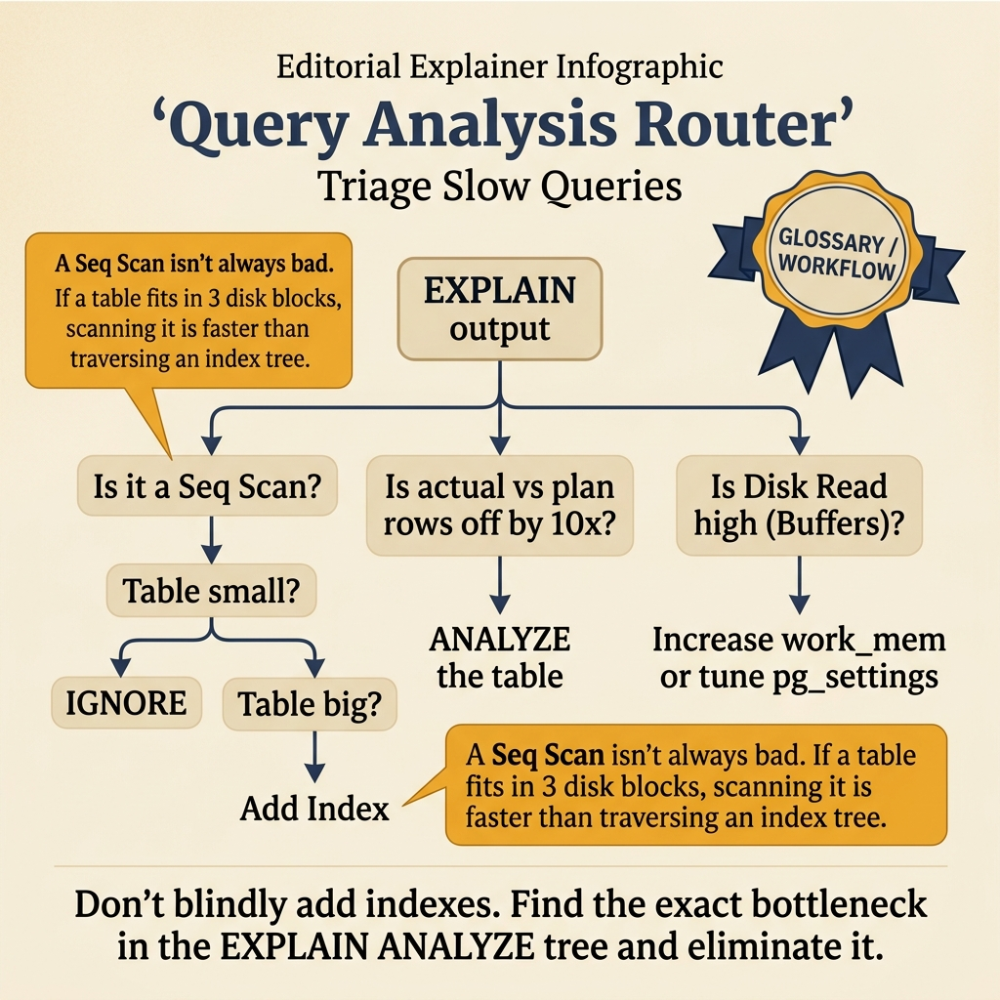
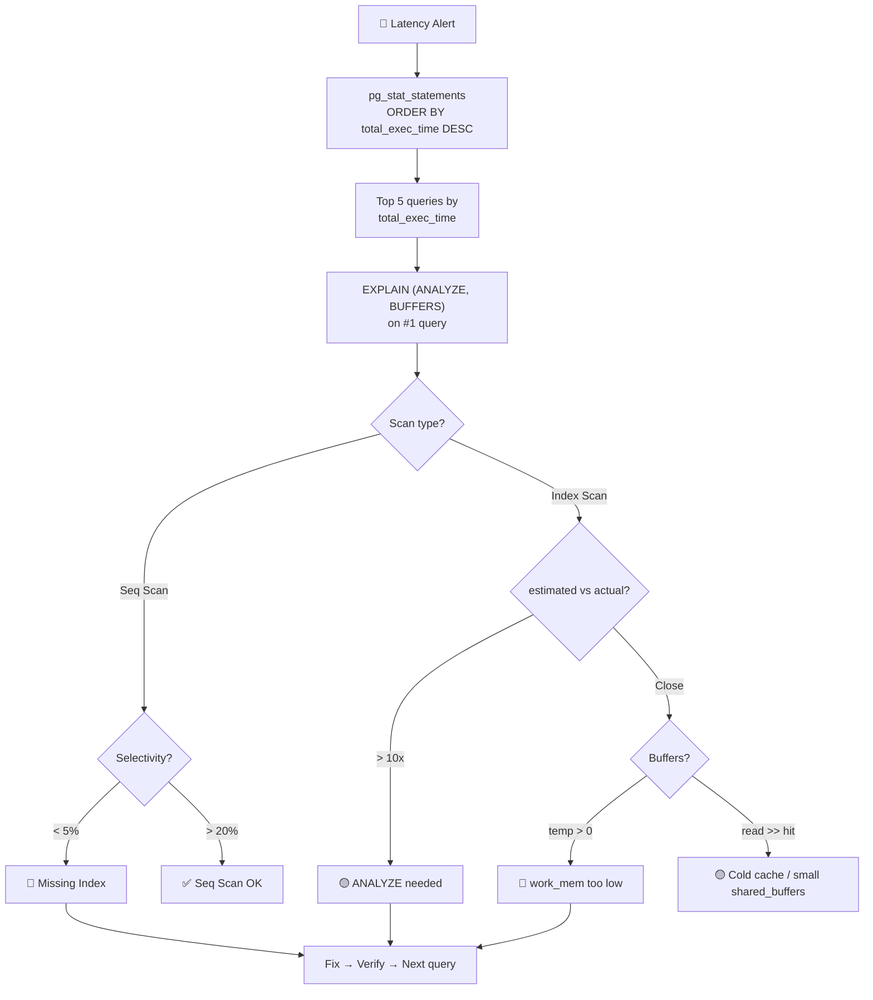

<!-- tags: sql, postgresql, database, query-optimization -->
# 🔬 Query Analysis Workflow — Từ Slow Query đến Production-Optimized

> Full workflow phân tích query: identify → diagnose → fix → verify → monitor. Kết hợp EXPLAIN, pg_stat_statements, auto_explain, và monitoring tools.

| Aspect           | Detail                                                      |
| ---------------- | ----------------------------------------------------------- |
| **Concept**      | Query analysis pipeline, combining diagnostic tools         |
| **Use case**     | Performance debugging, proactive optimization               |
| **Go relevance** | Observability integration, query profiling                  |
| **Tools**        | EXPLAIN ANALYZE, pg_stat_statements, auto_explain, pgBadger |

---

📅 Ngày tạo: 2026-03-19 · 🔄 Cập nhật: 2026-04-04 · ⏱️ 18 phút đọc

---

## 1. DEFINE

Grafana alert: p95 latency tăng từ 50ms lên 300ms trong 2 giờ qua. Team có 10 slow queries trong `pg_stat_statements`. Mỗi query trông đều "chậm". Fix query nào trước? Thêm index nào? `total_exec_time` hay `mean_exec_time` quan trọng hơn?

Query #3 có `mean_exec_time = 800ms` nhưng chỉ chạy 5 lần/giờ = 4 giây tổng. Query #7 có `mean_exec_time = 15ms` nhưng chạy 50,000 lần/giờ = **750 giây tổng** — chiếm 85% database CPU. Fix query #7 trước.

Query analysis không phải "EXPLAIN query chậm nhất". Nó là **workflow có thứ tự**: thu thập evidence → ranking by impact → EXPLAIN ANALYZE → identify root cause → targeted fix → verify. Bài này là operational workflow step-by-step.


| Variant | Mô tả |
| --- | --- |
| pg_stat_statements | Top N slow queries, call frequency · ① IDENTIFY — tìm query nào chậm nhất |
| EXPLAIN (ANALYZE, BUFFERS) | Chi tiết execution plan · ② DIAGNOSE — tại sao chậm |
| auto_explain | Tự động log plan cho slow queries · ① + ②: Passive monitoring |
| pg_stat_user_tables | Table statistics (seq scan, idx scan) · ① IDENTIFY — bảng nào thiếu index |

| Approach | Time | Space | Khi chọn |
| --- | --- | --- | --- |
| Setup pg_stat_statements + Find Slow Queries | Phụ thuộc cardinality | Phụ thuộc row width | Dùng để nắm baseline semantics trước khi tune planner hoặc index. |
| auto_explain + Before/After Comparison | Phụ thuộc plan | Phụ thuộc memory operator | Dùng khi query đã chạm index, cardinality hoặc join strategy. |
| Production Monitoring Dashboard Queries | Phụ thuộc workload | Phụ thuộc buffer/WAL | Dùng khi workload production cần cân bằng correctness, lock và rollout. |


### 5-Step Analysis Workflow

```text
┌─────────────────────────────────────────────────────────────────┐
│                    QUERY ANALYSIS WORKFLOW                       │
│                                                                  │
│  ① IDENTIFY          ② DIAGNOSE           ③ FIX                │
│  ┌──────────┐       ┌────────────┐       ┌──────────────┐      │
│  │ Find slow│──────▶│ EXPLAIN    │──────▶│ Add index    │      │
│  │ queries  │       │ ANALYZE    │       │ Rewrite query│      │
│  │          │       │ BUFFERS    │       │ Config tune  │      │
│  └──────────┘       └────────────┘       └──────┬───────┘      │
│       ↑                                          │               │
│       │              ④ VERIFY              ⑤ MONITOR            │
│       │             ┌────────────┐       ┌──────────────┐      │
│       └─────────────│ Compare    │◀──────│ Continuous   │      │
│                     │ before/    │       │ tracking     │      │
│                     │ after      │       │ alerts       │      │
│                     └────────────┘       └──────────────┘      │
└─────────────────────────────────────────────────────────────────┘
```

### Các công cụ và vai trò

| Tool                           | Vai trò                               | Khi nào dùng                         |
| ------------------------------ | ------------------------------------- | ------------------------------------ |
| **pg_stat_statements**         | Top N slow queries, call frequency    | ① IDENTIFY — tìm query nào chậm nhất |
| **EXPLAIN (ANALYZE, BUFFERS)** | Chi tiết execution plan               | ② DIAGNOSE — tại sao chậm            |
| **auto_explain**               | Tự động log plan cho slow queries     | ① + ②: Passive monitoring            |
| **pg_stat_user_tables**        | Table statistics (seq scan, idx scan) | ① IDENTIFY — bảng nào thiếu index    |
| **pg_stat_user_indexes**       | Index usage statistics                | ③ FIX — audit unused indexes         |
| **pgBadger**                   | Log analysis → HTML report            | ⑤ MONITOR — periodic review          |
| **pg_stat_activity**           | Active queries ngay lúc này           | Real-time debugging                  |

### Red Flags — Dấu hiệu query cần optimize

| Signal                           | Metric                               | Threshold        |
| -------------------------------- | ------------------------------------ | ---------------- |
| 🔴 Slow query                    | `pg_stat_statements.mean_exec_time`  | > 100ms          |
| 🔴 Sequential scan trên bảng lớn | `pg_stat_user_tables.seq_scan` tăng  | bảng > 10K rows  |
| 🔴 Low cache hit                 | `shared hit / (hit + read)`          | < 95%            |
| 🔴 Temp files (sort spill)       | EXPLAIN BUFFERS: `temp read/written` | > 0              |
| 🔴 Estimated ≠ Actual rows       | EXPLAIN: ratio > 10x                 | > 10x difference |
| 🟡 High call count               | `pg_stat_statements.calls`           | Top 10 queries   |
| 🟡 Index bloat                   | index size >> expected               | > 2x table data  |

---

Các failure mode trên nghe dễ tránh. Nhưng có trap: chỉ nhìn execution time mà bỏ qua buffers = miss I/O bottleneck, và analyze report trên cold cache = misleading. Trap đó sẽ xuất hiện ở PITFALLS.

## 2. VISUAL

Với Query Analysis Workflow — Từ Slow Query đến Production-Optimized, vocabulary thôi không cứu được bạn. Bottleneck chỉ lộ mặt khi plan, timeline hoặc đường đi của bộ nhớ và I/O được đặt lên bàn cùng lúc.




*Hình: 5 symptom → tool → action — Slow single (EXPLAIN), Slow across (pg_stat_statements), Lock waits (pg_stat_activity), Temp spill (work_mem), Stale stats (ANALYZE).*

### Level 1

```text
🚨 Alert: API endpoint /orders slow (p95 > 2s)

Step 1: Find the query
─────────────────────
pg_stat_statements → query: "SELECT ... FROM orders JOIN users ..."
                     calls: 50,000/day
                     mean_time: 450ms
                     total_time: 6.25 hours/day ← 🔴

Step 2: Analyze the plan
────────────────────────
EXPLAIN (ANALYZE, BUFFERS) SELECT ...
→ Hash Join
    → Seq Scan on orders (800ms)     ← 🔴 Bottleneck!
       Filter: status = 'paid'
       Rows Removed: 1,800,000       ← Đọc 2M, giữ 200K
       Buffers: shared read=15000    ← 🔴 Disk I/O
    → Hash (users)

Step 3: Fix
───────────
CREATE INDEX idx_orders_status_created ON orders(status, created_at DESC);
ANALYZE orders;

Step 4: Verify
──────────────
EXPLAIN (ANALYZE, BUFFERS) SELECT ...  -- same query
→ Nested Loop
    → Index Scan on idx_orders_status_created (2ms)  ← ✅ 400x faster!
       Buffers: shared hit=50                         ← ✅ All from cache

Step 5: Monitor
───────────────
pg_stat_statements reset → re-check after 24h
→ mean_time: 1.2ms ✅
→ total_time: 1 min/day (from 6.25 hours!) ✅
```

---

*Hình: Level 1 cho 🔬 Query Analysis Workflow — Từ Slow Query đến Production-Optimized — nhìn vào happy path hoặc baseline heuristic trước khi đi sâu vào planner và trade-off.*

### Level 2

```text
Decision Lens                 Dấu hiệu cần nhìn                 Hướng xử lý
---------------------------  --------------------------------  -------------------------------------------
Semantics trước               Kết quả có đúng intent không?    1. Setup pg_stat_statements + Find Slow Queries
Planner / index signal        Cardinality, cost, buffers ra sao? 2. auto_explain + Before/After Comparison
Production pressure           Lock, WAL, lag, rollback nào đau? 3. Production Monitoring Dashboard Queries
```

*Hình: Level 2 biến 🔬 Query Analysis Workflow — Từ Slow Query đến Production-Optimized thành checklist quyết định — từ semantics, sang plan signal, rồi đến áp lực production.*


### Architecture — Query Analysis Decision Flow



*Hình: Query analysis workflow — ranking by total impact → EXPLAIN → phân loại → targeted fix. Luôn fix highest-total-time query trước, không phải slowest-single-execution.*

---
## 3. CODE

Khi tín hiệu trực quan của Query Analysis Workflow — Từ Slow Query đến Production-Optimized đã rõ, ta chuyển sang truy vấn, lệnh chẩn đoán và playbook có thể chạy thật. Bắt đầu từ baseline đơn giản rồi tăng dần áp lực workload.

### Problem 1: Basic — Setup pg_stat_statements + Find Slow Queries

> **Mục tiêu**: Enable pg_stat_statements, tìm top slow queries
> **Cần**: PostgreSQL 15+, superuser access
> **Đạt được**: Identify query optimization targets


```sql
-- ═══════════════════════════════════════════
-- 1. Enable pg_stat_statements
-- ═══════════════════════════════════════════

-- ✅ Install extension (one-time)
CREATE EXTENSION IF NOT EXISTS pg_stat_statements;

-- ✅ postgresql.conf settings
ALTER SYSTEM SET shared_preload_libraries = 'pg_stat_statements';
ALTER SYSTEM SET pg_stat_statements.max = 10000;        -- Track up to 10K unique queries
ALTER SYSTEM SET pg_stat_statements.track = 'all';       -- Track all statements (top = only top-level)
ALTER SYSTEM SET pg_stat_statements.track_utility = on;  -- Track non-DML too
-- Requires restart!

-- ═══════════════════════════════════════════
-- 2. Top 10 slow queries (by total time)
-- ═══════════════════════════════════════════

-- ✅ Queries consuming most total time — biggest optimization targets
SELECT
    queryid,
    LEFT(query, 100) AS query_preview,
    calls,
    round(total_exec_time::numeric, 2) AS total_ms,
    round(mean_exec_time::numeric, 2) AS mean_ms,
    round(min_exec_time::numeric, 2) AS min_ms,
    round(max_exec_time::numeric, 2) AS max_ms,
    round(stddev_exec_time::numeric, 2) AS stddev_ms,
    rows,
    round(100.0 * shared_blks_hit / NULLIF(shared_blks_hit + shared_blks_read, 0), 2) AS cache_hit_pct,
    shared_blks_hit + shared_blks_read AS total_blocks,
    temp_blks_read + temp_blks_written AS temp_blocks  -- 🔴 Sort spill
FROM pg_stat_statements
WHERE userid = (SELECT usesysid FROM pg_user WHERE usename = current_user)
ORDER BY total_exec_time DESC
LIMIT 10;

-- ═══════════════════════════════════════════
-- 3. Top queries by frequency (hotspot)
-- ═══════════════════════════════════════════

SELECT
    LEFT(query, 80) AS query_preview,
    calls,
    round(mean_exec_time::numeric, 2) AS mean_ms,
    rows / NULLIF(calls, 0) AS rows_per_call
FROM pg_stat_statements
ORDER BY calls DESC
LIMIT 10;

-- ═══════════════════════════════════════════
-- 4. Queries with worst cache hit ratio
-- ═══════════════════════════════════════════

SELECT
    LEFT(query, 100) AS query_preview,
    calls,
    round(mean_exec_time::numeric, 2) AS mean_ms,
    shared_blks_read AS disk_reads,
    round(100.0 * shared_blks_hit / NULLIF(shared_blks_hit + shared_blks_read, 0), 2) AS cache_hit_pct
FROM pg_stat_statements
WHERE shared_blks_hit + shared_blks_read > 100  -- Ignore trivial queries
ORDER BY cache_hit_pct ASC
LIMIT 10;

-- ═══════════════════════════════════════════
-- 5. Reset stats (after optimization, re-measure)
-- ═══════════════════════════════════════════
SELECT pg_stat_statements_reset();
```


> **✅ Đạt được**: Biết query nào chậm nhất, gọi nhiều nhất, cache kém nhất.
> **⚠️ Lưu ý**: `total_exec_time` = calls × mean_time. Optimize query có `total_time` cao nhất → biggest impact.

---

Query analysis basics đã cover. Nhưng systematic workflow cần step-by-step — hãy follow.

### Problem 2: Intermediate — auto_explain + Before/After Comparison

> **Mục tiêu**: Auto-log slow query plans, so sánh before/after optimization
> **Cần**: auto_explain extension
> **Đạt được**: Passive query plan monitoring


```sql
-- ═══════════════════════════════════════════
-- 1. Setup auto_explain
-- ═══════════════════════════════════════════

-- ✅ postgresql.conf (requires restart for shared_preload_libraries)
ALTER SYSTEM SET shared_preload_libraries = 'pg_stat_statements, auto_explain';
-- OR session-level (no restart):
LOAD 'auto_explain';

-- ✅ Configuration
ALTER SYSTEM SET auto_explain.log_min_duration = '100ms';  -- Log plans for queries > 100ms
ALTER SYSTEM SET auto_explain.log_analyze = on;            -- Include actual times
ALTER SYSTEM SET auto_explain.log_buffers = on;            -- Include buffer stats
ALTER SYSTEM SET auto_explain.log_timing = on;
ALTER SYSTEM SET auto_explain.log_nested_statements = on;  -- Include subqueries
ALTER SYSTEM SET auto_explain.log_format = 'text';         -- text | json | yaml
SELECT pg_reload_conf();

-- ═══════════════════════════════════════════
-- 2. Before/After Optimization Comparison
-- ═══════════════════════════════════════════

-- ✅ BEFORE: Document current plan
-- Lưu output vào file/ticket trước khi optimize
EXPLAIN (ANALYZE, BUFFERS, FORMAT JSON)
SELECT
    o.id, o.amount, o.status,
    c.name AS customer_name,
    p.name AS product_name
FROM orders o
JOIN customers c ON c.id = o.customer_id
JOIN order_items oi ON oi.order_id = o.id
JOIN products p ON p.id = oi.product_id
WHERE o.status = 'pending'
  AND o.created_at > now() - interval '30 days'
ORDER BY o.created_at DESC
LIMIT 50;

-- BEFORE result:
-- Execution Time: 1,234 ms
-- Buffers: shared hit=500, read=15000  ← 🔴 Heavy disk I/O

-- ✅ OPTIMIZATION: Add targeted indexes
CREATE INDEX CONCURRENTLY idx_orders_status_created
    ON orders(status, created_at DESC)
    WHERE status = 'pending';  -- Partial index!

CREATE INDEX CONCURRENTLY idx_order_items_order_product
    ON order_items(order_id)
    INCLUDE (product_id);  -- Covering index

ANALYZE orders;
ANALYZE order_items;

-- ✅ AFTER: Compare plans
EXPLAIN (ANALYZE, BUFFERS, FORMAT JSON)
-- ... same query ...

-- AFTER result:
-- Execution Time: 3 ms  ← ✅ 400x improvement!
-- Buffers: shared hit=120, read=0  ← ✅ All from cache

-- ═══════════════════════════════════════════
-- 3. Table-level health check
-- ═══════════════════════════════════════════

-- ✅ Tables with most sequential scans (need indexes?)
SELECT
    schemaname, relname,
    seq_scan,
    seq_tup_read,
    idx_scan,
    CASE WHEN seq_scan + idx_scan > 0
         THEN round(100.0 * idx_scan / (seq_scan + idx_scan), 2)
         ELSE 0
    END AS idx_usage_pct,
    n_live_tup,
    n_dead_tup,
    last_autovacuum,
    last_autoanalyze
FROM pg_stat_user_tables
WHERE n_live_tup > 1000  -- Ignore tiny tables
ORDER BY seq_scan DESC
LIMIT 10;
```


> **✅ Đạt được**: Passive monitoring + structured before/after comparison.
> **⚠️ Lưu ý**: `auto_explain.log_min_duration` quá thấp sẽ flood logs.

---

Workflow đã cover. Nhưng production profiling cần pg_stat_statements — hãy aggregate.

### Problem 3: Advanced — Production Monitoring Dashboard Queries

> **Mục tiêu**: Bộ queries cho production monitoring dashboard
> **Cần**: pg_stat_statements, pg_stat_activity
> **Đạt được**: Comprehensive database health overview


```sql
-- ═══════════════════════════════════════════
-- 1. Database Health Dashboard
-- ═══════════════════════════════════════════

-- ✅ Overall cache hit ratio
SELECT
    'Cache Hit Ratio' AS metric,
    round(100.0 * sum(blks_hit) / NULLIF(sum(blks_hit + blks_read), 0), 2) || '%' AS value,
    CASE
        WHEN 100.0 * sum(blks_hit) / NULLIF(sum(blks_hit + blks_read), 0) > 99 THEN '✅ Excellent'
        WHEN 100.0 * sum(blks_hit) / NULLIF(sum(blks_hit + blks_read), 0) > 95 THEN '🟡 OK'
        ELSE '🔴 Bad — increase shared_buffers'
    END AS status
FROM pg_stat_database
WHERE datname = current_database();

-- ✅ Active connections
SELECT
    'Connections' AS metric,
    count(*) || ' / ' || current_setting('max_connections') AS value,
    CASE
        WHEN count(*)::float / current_setting('max_connections')::float < 0.7 THEN '✅ OK'
        WHEN count(*)::float / current_setting('max_connections')::float < 0.9 THEN '🟡 Warning'
        ELSE '🔴 Critical'
    END AS status
FROM pg_stat_activity;

-- ✅ Long-running queries (> 5 min)
SELECT
    pid,
    usename,
    application_name,
    state,
    age(now(), query_start) AS duration,
    LEFT(query, 100) AS query_preview,
    wait_event_type,
    wait_event
FROM pg_stat_activity
WHERE state != 'idle'
  AND query_start < now() - interval '5 minutes'
  AND pid != pg_backend_pid()
ORDER BY query_start;

-- ═══════════════════════════════════════════
-- 2. Performance regression detection
-- ═══════════════════════════════════════════

-- ✅ Queries with high stddev (inconsistent performance)
SELECT
    LEFT(query, 80) AS query_preview,
    calls,
    round(mean_exec_time::numeric, 2) AS mean_ms,
    round(stddev_exec_time::numeric, 2) AS stddev_ms,
    round(max_exec_time::numeric, 2) AS max_ms,
    round(stddev_exec_time / NULLIF(mean_exec_time, 0) * 100, 2) AS cv_pct  -- Coefficient of Variation
FROM pg_stat_statements
WHERE calls > 100
ORDER BY stddev_exec_time DESC
LIMIT 10;
-- cv_pct > 100% → query behaves very differently across calls (cache cold/hot?)

-- ═══════════════════════════════════════════
-- 3. Missing indexes detection
-- ═══════════════════════════════════════════

-- ✅ Tables with high seq scan but low index usage
SELECT
    relname,
    seq_scan,
    idx_scan,
    n_live_tup,
    seq_tup_read / NULLIF(seq_scan, 0) AS avg_rows_per_scan,
    pg_size_pretty(pg_relation_size(relid)) AS table_size
FROM pg_stat_user_tables
WHERE seq_scan > idx_scan    -- More seq scans than index scans
  AND n_live_tup > 10000    -- Only meaningful tables
ORDER BY seq_tup_read DESC
LIMIT 10;
```

```go
// ✅ Go: Query performance monitor middleware
type QueryStats struct {
    Query     string        `json:"query"`
    Duration  time.Duration `json:"duration"`
    RowCount  int64         `json:"row_count"`
    CacheHit  bool          `json:"cache_hit"`
    Timestamp time.Time     `json:"timestamp"`
}

// ✅ Logging wrapper cho pgx
type QueryLogger struct {
    pool      *pgxpool.Pool
    slowThreshold time.Duration
    logger    *slog.Logger
}

func (ql *QueryLogger) Query(ctx context.Context, sql string, args ...any) (pgx.Rows, error) {
    start := time.Now()
    rows, err := ql.pool.Query(ctx, sql, args...)
    duration := time.Since(start)

    // ✅ Log slow queries automatically
    if duration > ql.slowThreshold {
        ql.logger.Warn("🐌 Slow query detected",
            "duration_ms", duration.Milliseconds(),
            "query", truncate(sql, 200),
            "args_count", len(args),
        )
    }

    // ✅ Metrics for monitoring (Prometheus, DataDog, etc.)
    queryDurationHistogram.Observe(duration.Seconds())
    queryCounter.Inc()

    return rows, err
}

func truncate(s string, max int) string {
    if len(s) <= max {
        return s
    }
    return s[:max] + "..."
}
```


> **✅ Đạt được**: Full production dashboard queries + Go monitoring middleware.
> **⚠️ Lưu ý**: Chạy dashboard queries trong cronjob → alert khi metrics xấu.

---
Bạn đã đi qua analysis, workflow, và production profiling. Bây giờ đến phần nguy hiểm: I/O blindspot và cold cache — trap đã được setup từ đầu bài.

## 4. PITFALLS

Query Analysis Workflow — Từ Slow Query đến Production-Optimized rất dễ bị dùng theo phản xạ: thấy chậm là thêm index, thấy lag là tăng tài nguyên. Phần dưới đây gom những lỗi tối ưu tưởng đúng nhưng lại làm latency, lock hoặc chi phí vận hành tệ hơn.

| # | Severity | Lỗi | Hậu quả | Fix |
| --- | --- | --- | --- | --- |
| 1 | 🔵 Minor | Chỉ dùng EXPLAIN (không ANALYZE) | — | Chỉ thấy estimates — LUÔN dùng EXPLAIN (ANALYZE, BUFFERS) |
| 2 | 🔵 Minor | EXPLAIN ANALYZE UPDATE/DELETE | — | Nó thực sự chạy! Wrap trong BEGIN; ... ROLLBACK; |
| 3 | 🔵 Minor | Optimize 1 query mà ignore total workload | — | pg_stat_statements → sort by total_time, optimize top queries |
| 4 | 🔵 Minor | Quên ANALYZE sau massive INSERT | — | Statistics cũ → planner chọn plan sai |
| 5 | 🔵 Minor | auto_explain threshold quá thấp | — | Log flood → dùng 100ms-500ms cho production |
| 6 | 🔵 Minor | Không reset pg_stat_statements | — | Stats tích lũy → reset sau optimization để đo lại |
| 7 | 🔵 Minor | Ignore stddev_exec_time | — | High stddev = query chậm intermittently (cache issue?) |

---
Bạn đã đi qua Query Analysis Workflow và cạm bẫy. Các resources dưới đây giúp đi sâu hơn.

## 5. REF

| Resource            | Link                                                                                                               |
| ------------------- | ------------------------------------------------------------------------------------------------------------------ |
| pg_stat_statements  | [postgresql.org/docs/current/pgstatstatements.html](https://www.postgresql.org/docs/current/pgstatstatements.html) |
| auto_explain        | [postgresql.org/docs/current/auto-explain.html](https://www.postgresql.org/docs/current/auto-explain.html)         |
| EXPLAIN Visualizer  | [explain.dalibo.com](https://explain.dalibo.com/)                                                                  |
| pgBadger            | [github.com/darold/pgbadger](https://github.com/darold/pgbadger)                                                   |
| Use The Index, Luke | [use-the-index-luke.com](https://use-the-index-luke.com/)                                                          |
| pgHero Dashboard    | [github.com/ankane/pghero](https://github.com/ankane/pghero)                                                       |

---

## 6. RECOMMEND

Khi các bẫy thường gặp của Query Analysis Workflow — Từ Slow Query đến Production-Optimized đã lộ mặt, bạn có thể nối bài này sang maintenance, replication hoặc triage workflow để quyết định tuning không bị cô lập.

| Mở rộng                   | Khi nào                 | Lý do                              |
| ------------------------- | ----------------------- | ---------------------------------- |
| **Grafana + pg_exporter** | Production monitoring   | Visual dashboards, alerting        |
| **pg_qualstats**          | Missing index detection | Automatic index recommendations    |
| **HypoPG**                | What-if index analysis  | Test indexes without creating them |
| **Dexter**                | AI index suggestions    | Automated index management         |
| **pganalyze**             | SaaS monitoring         | Automatic EXPLAIN, index advisor   |


> **Callback** — Quay lại 10 slow queries: query #7 chỉ 15ms/call nhưng 50K calls/giờ = 750 giây tổng CPU. Fix query #7 trước giảm 85% database load. Ranking by `total_exec_time` thay vì `mean_exec_time` là bước đầu tiên của mọi performance investigation.

---

← Previous: [03-pagination-techniques.md](./03-pagination-techniques.md)

---

## 7. QUICK REF

| Nếu gặp | Nghĩ ngay |
| --- | --- |
| Setup pg_stat_statements + Find Slow Queries | Dùng pattern này khi gặp signal tương ứng trong production workload. |
| auto_explain + Before/After Comparison | Dùng pattern này khi gặp signal tương ứng trong production workload. |
| Production Monitoring Dashboard Queries | Dùng pattern này khi gặp signal tương ứng trong production workload. |
