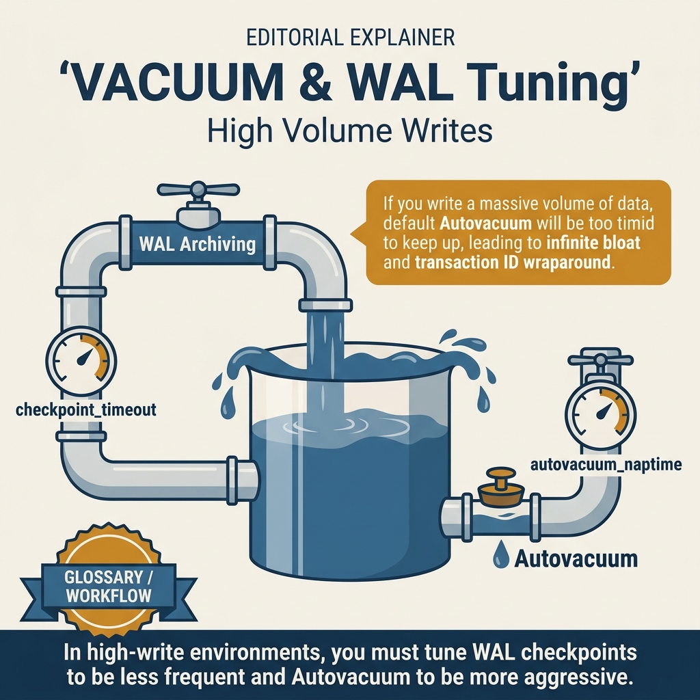
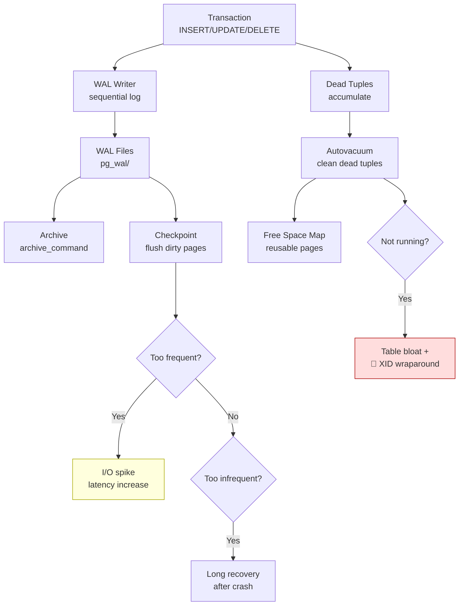

<!-- tags: sql, postgresql, database, performance -->
# 🧹 VACUUM, WAL & Checkpoint Tuning

> PostgreSQL garbage collection, Write-Ahead Log, checkpoint optimization — production DBA essentials cho write-heavy workloads.

| Aspect           | Detail                                                  |
| ---------------- | ------------------------------------------------------- |
| **Concept**      | VACUUM, autovacuum, WAL, checkpoints                    |
| **Use case**     | High-write workloads, bloat prevention, crash recovery  |
| **Go relevance** | Connection management during maintenance                |
| **DBA Roadmap**  | Vacuum Processing, WAL, Checkpoints / Background Writer |

---

📅 Ngày tạo: 2026-03-19 · 🔄 Cập nhật: 2026-04-04 · ⏱️ 16 phút đọc

---

## 1. DEFINE

Monitoring alert: `age(datfrozenxid) = 1,500,000,000`. Transaction ID wraparound threshold ở 2 tỷ. Còn 500 triệu transactions trước khi PostgreSQL **tự shutdown để protect data**. Autovacuum đang chạy nhưng bảng `audit_logs` 500GB — mỗi lần VACUUM mất 6 giờ, và bảng tiếp tục nhận 100K writes/giờ.

Song song: WAL directory phình 40GB — `archive_command` fail im lặng từ 3 ngày trước. Nếu disk đầy, PostgreSQL stop accepting writes. Checkpoint mỗi 30 phút tạo I/O spike giết p99 latency.

VACUUM, WAL, Checkpoint — ba cơ chế maintenance chạy im lặng phía sau. Khi cả ba healthy, bạn không bao giờ nghĩ đến chúng. Khi một cái fail, database sống sót được bao lâu phụ thuộc vào cách bạn đã configure từ đầu.


| Variant | Mô tả |
| --- | --- |
| VACUUM | ShareUpdateExclusiveLock · Reclaim dead tuples, update visibility map · Regular maintenance |
| VACUUM FULL | AccessExclusiveLock · Rewrite entire table, compact fully · Extreme bloat only |
| VACUUM FREEZE | ShareUpdateExclusiveLock · Freeze old transactions, prevent wraparound · Anti-wraparound |
| VACUUM (PARALLEL n) | ShareUpdateExclusiveLock · Multi-worker VACUUM (PG 13+) · Large tables |

| Approach | Time | Space | Khi chọn |
| --- | --- | --- | --- |
| VACUUM Commands & Monitoring | Phụ thuộc cardinality | Phụ thuộc row width | Dùng để nắm baseline semantics trước khi tune planner hoặc index. |
| WAL & Checkpoint Tuning | Phụ thuộc plan | Phụ thuộc memory operator | Dùng khi query đã chạm index, cardinality hoặc join strategy. |


### VACUUM Types

| Type                    | Lock           | Mô tả                                       | Khi nào dùng        |
| ----------------------- | -------------- | ------------------------------------------- | ------------------- |
| **VACUUM**              | `ShareUpdateExclusiveLock` | Reclaim dead tuples, update visibility map  | Regular maintenance |
| **VACUUM FULL**         | `AccessExclusiveLock`      | Rewrite entire table, compact fully         | Extreme bloat only  |
| **VACUUM FREEZE**       | `ShareUpdateExclusiveLock` | Freeze old transactions, prevent wraparound | Anti-wraparound     |
| **VACUUM (PARALLEL n)** | `ShareUpdateExclusiveLock` | Multi-worker VACUUM (PG 13+)                | Large tables        |
| **Autovacuum**          | `ShareUpdateExclusiveLock` | Automatic background VACUUM                 | Always-on           |

### WAL (Write-Ahead Log) — Crash Recovery

```text
Client sends: UPDATE accounts SET balance = 900 WHERE id = 1

Step 1: Write to WAL buffer (in memory)
  ┌───────────────────────────────────────┐
  │ WAL Record: UPDATE accounts id=1     │
  │   old: balance=1000                   │
  │   new: balance=900                    │
  │   LSN: 0/16F3A28                     │
  └───────────────────────────────────────┘

Step 2: Modify shared_buffers (dirty page)
  ┌───────────────────────────────────────┐
  │ Page 42: accounts row id=1           │
  │   balance = 900 (dirty, not on disk) │
  └───────────────────────────────────────┘

Step 3: COMMIT → flush WAL to disk
  WAL buffer → WAL files on disk ← Durable!

Step 4: Checkpoint (later) → write dirty pages to data files
  shared_buffers → data files on disk

Crash recovery:
  1. Read last checkpoint position
  2. Replay WAL records from checkpoint → data files
  3. Database consistent! ✅
```

### Checkpoint vs Background Writer

| Component      | Vai trò                                                   | Trigger                 |
| -------------- | --------------------------------------------------------- | ----------------------- |
| **Checkpoint** | Đảm bảo dirty buffers trước redo point được flush + fsync | Time or WAL size        |
| **Bgwriter**   | Gradually write dirty buffers to reduce checkpoint spikes | Continuous              |
| **WAL writer** | Periodically helps flush WAL buffers                      | Background / group commit |

### Key Parameters

| Parameter                      | Default             | Mô tả                                           |
| ------------------------------ | ------------------- | ----------------------------------------------- |
| `checkpoint_timeout`           | 5 min               | Max time between checkpoints                    |
| `max_wal_size`                 | 1 GB                | WAL size that triggers checkpoint               |
| `checkpoint_completion_target` | 0.9                 | Spread checkpoint I/O over 90% of interval      |
| `wal_buffers`                  | Auto-tuned (`-1`)   | WAL buffer size, typically capped around 16MB   |
| `wal_compression`              | off                 | Compress WAL records (saves I/O)                |
| `full_page_writes`             | on                  | Write full page after checkpoint (crash safety) |

---

Các failure mode trên nghe cơ bản. Nhưng có trap: WAL size quá nhỏ = frequent checkpoints = I/O spikes, và vacuum cost delay quá cao = dead tuples accumulate. Trap đó sẽ xuất hiện ở PITFALLS.

## 2. VISUAL

Với VACUUM, WAL & Checkpoint Tuning, vocabulary thôi không cứu được bạn. Bottleneck chỉ lộ mặt khi plan, timeline hoặc đường đi của bộ nhớ và I/O được đặt lên bàn cùng lúc.




*Hình: Triangle interaction — Write Path (WAL+dirty pages) → VACUUM (dead tuples, xid horizon) → Checkpoint (flush all, consistent state) → Monitoring (pg_stat_bgwriter). Tune all three together.*

### Level 1

```text
Autovacuum launcher (runs every autovacuum_naptime):
  │
  ▼
For each table:
  dead_tuples > threshold + scale_factor × live_tuples?
  │
  ├── YES → Start autovacuum worker
  │          │
  │          ├── Phase 1: Scan heap for dead tuples
  │          ├── Phase 2: Remove index entries pointing to dead tuples
  │          ├── Phase 3: Vacuum heap pages (reclaim space)
  │          ├── Phase 4: Truncate (return pages to OS if at end of file)
  │          └── Phase 5: Update pg_class stats + visibility map
  │
  └── NO → Skip, check next table

Default thresholds:
  vacuum:   50 + 0.20 × n_live_tup  (20% dead tuples)
  analyze:  50 + 0.10 × n_live_tup  (10% changed tuples)

Example: 1M live tuples
  vacuum after:  50 + 200,000 = 200,050 dead tuples
  analyze after: 50 + 100,000 = 100,050 changed tuples
```

---

*Hình: Level 1 cho 🧹 VACUUM, WAL & Checkpoint Tuning — nhìn vào happy path hoặc baseline heuristic trước khi đi sâu vào planner và trade-off.*

### Level 2

```text
Decision Lens                 Dấu hiệu cần nhìn                 Hướng xử lý
---------------------------  --------------------------------  -------------------------------------------
Semantics trước               Kết quả có đúng intent không?    1. VACUUM Commands & Monitoring
Planner / index signal        Cardinality, cost, buffers ra sao? 2. WAL & Checkpoint Tuning
Production pressure           Lock, WAL, lag, rollback nào đau? 1. VACUUM Commands & Monitoring
```

*Hình: Level 2 biến 🧹 VACUUM, WAL & Checkpoint Tuning thành checklist quyết định — từ semantics, sang plan signal, rồi đến áp lực production.*


### Architecture — VACUUM + WAL + Checkpoint Interaction



*Hình: Ba cơ chế chạy song song — WAL ghi log, Checkpoint flush pages, VACUUM dọn dead tuples. Nếu một cái fail, database tích lũy nợ kỹ thuật cho đến khi crash hoặc shutdown.*

---
## 3. CODE

Khi tín hiệu trực quan của VACUUM, WAL & Checkpoint Tuning đã rõ, ta chuyển sang truy vấn, lệnh chẩn đoán và playbook có thể chạy thật. Bắt đầu từ baseline đơn giản rồi tăng dần áp lực workload.

### Problem 1: Basic — VACUUM Commands & Monitoring

> **Mục tiêu**: Manual VACUUM, monitoring, bloat detection
> **Cần**: PostgreSQL 15+
> **Đạt được**: Control table bloat


```sql
-- ═══════════════════════════════════════════
-- 1. Manual VACUUM
-- ═══════════════════════════════════════════

-- ✅ Basic VACUUM (reclaim dead tuples)
VACUUM orders;
VACUUM VERBOSE orders;  -- With output

-- ✅ VACUUM + ANALYZE (update statistics too)
VACUUM ANALYZE orders;

-- ✅ VACUUM FREEZE (prevent TX wraparound)
VACUUM FREEZE orders;

-- ✅ VACUUM FULL (rewrite table — LOCKS TABLE!)
-- ⚠️ Only for extreme bloat. Takes exclusive lock!
VACUUM FULL orders;

-- ✅ Parallel VACUUM (PG 13+)
VACUUM (PARALLEL 4) orders;
-- Uses 4 workers for index cleanup

-- ═══════════════════════════════════════════
-- 2. Autovacuum monitoring
-- ═══════════════════════════════════════════

-- ✅ Which tables need vacuum?
SELECT
    schemaname, relname,
    n_live_tup, n_dead_tup,
    round(100.0 * n_dead_tup / NULLIF(n_live_tup + n_dead_tup, 0), 2) AS dead_pct,
    last_autovacuum,
    last_autoanalyze,
    autovacuum_count,
    autoanalyze_count
FROM pg_stat_user_tables
ORDER BY n_dead_tup DESC
LIMIT 10;

-- ✅ Check autovacuum running now
SELECT pid, datname, relid::regclass AS table_name,
    phase, heap_blks_total, heap_blks_scanned, heap_blks_vacuumed,
    index_vacuum_count, max_dead_tuples, num_dead_tuples
FROM pg_stat_progress_vacuum;

-- ✅ Check if autovacuum is being blocked
SELECT blocked.pid, blocked.query AS blocked_query,
    blocking.pid AS blocking_pid, blocking.query AS blocking_query
FROM pg_stat_activity blocked
JOIN pg_locks bl ON bl.pid = blocked.pid
JOIN pg_locks bkl ON bkl.relation = bl.relation AND bkl.pid != bl.pid
JOIN pg_stat_activity blocking ON blocking.pid = bkl.pid
WHERE blocked.query LIKE '%autovacuum%';

-- ═══════════════════════════════════════════
-- 3. Table bloat estimation
-- ═══════════════════════════════════════════

-- ✅ Simple bloat check
SELECT
    relname,
    pg_size_pretty(pg_total_relation_size(oid)) AS total_size,
    pg_size_pretty(pg_relation_size(oid)) AS data_size,
    pg_size_pretty(pg_total_relation_size(oid) - pg_relation_size(oid)) AS index_size,
    reltuples::bigint AS est_rows,
    CASE WHEN reltuples > 0
        THEN pg_size_pretty((pg_relation_size(oid) / reltuples * 100)::bigint)
        ELSE '0 bytes'
    END AS bytes_per_100_rows
FROM pg_class
WHERE relkind = 'r' AND relnamespace = 'public'::regnamespace
ORDER BY pg_total_relation_size(oid) DESC
LIMIT 10;
```


---

Vacuum+WAL basics đã cover. Nhưng checkpoint tuning cần spread configuration — hãy balance.

### Problem 2: Intermediate — WAL & Checkpoint Tuning

> **Mục tiêu**: Optimize WAL settings cho high-write workload
> **Cần**: Superuser access
> **Đạt được**: Reduced checkpoint spikes, better write performance


```sql
-- ═══════════════════════════════════════════
-- 1. WAL monitoring
-- ═══════════════════════════════════════════

-- ✅ Current WAL position
SELECT pg_current_wal_lsn(),
    pg_walfile_name(pg_current_wal_lsn()),
    pg_size_pretty(pg_wal_lsn_diff(pg_current_wal_lsn(), '0/0')) AS total_wal;

-- ✅ WAL generation rate (PG 14+)
SELECT
    wal_records,
    wal_fpi,
    pg_size_pretty(wal_bytes) AS wal_bytes_since_reset,
    now() - stats_reset AS time_since_reset,
    pg_size_pretty(
        (wal_bytes / GREATEST(EXTRACT(EPOCH FROM now() - stats_reset), 1))::bigint
    ) AS approx_bytes_per_second
FROM pg_stat_wal;

-- ✅ Checkpoint statistics
SELECT
    checkpoints_timed,              -- Scheduled checkpoints
    checkpoints_req,                -- Requested (forced) checkpoints
    checkpoint_write_time / 1000 AS write_seconds,
    checkpoint_sync_time / 1000 AS sync_seconds,
    buffers_checkpoint,             -- Buffers written by checkpoints
    buffers_clean,                  -- Buffers written by bgwriter
    buffers_backend,                -- Buffers written by backends (BAD!)
    round(100.0 * buffers_backend /
        NULLIF(buffers_checkpoint + buffers_clean + buffers_backend, 0), 2) AS backend_write_pct,
    stats_reset
FROM pg_stat_bgwriter;
-- ⚠️ backend_write_pct > 5% → increase shared_buffers or bgwriter throughput

-- ═══════════════════════════════════════════
-- 2. Optimal WAL/Checkpoint settings
-- ═══════════════════════════════════════════

-- ✅ Production recommendations (high-write workload)
ALTER SYSTEM SET max_wal_size = '4GB';               -- Larger = fewer checkpoints
ALTER SYSTEM SET min_wal_size = '1GB';               -- Keep WAL files ready
ALTER SYSTEM SET checkpoint_timeout = '15min';        -- Less frequent checkpoints
ALTER SYSTEM SET checkpoint_completion_target = 0.9;  -- Spread I/O over 90% of interval
ALTER SYSTEM SET wal_compression = 'lz4';             -- PG 15+: compress WAL (save disk I/O)
ALTER SYSTEM SET wal_buffers = '64MB';                -- Larger buffer

-- ✅ Bgwriter tuning (reduce checkpoint spikes)
ALTER SYSTEM SET bgwriter_delay = '100ms';            -- Check every 100ms (default 200ms)
ALTER SYSTEM SET bgwriter_lru_maxpages = 400;         -- Write up to 400 pages per round
ALTER SYSTEM SET bgwriter_lru_multiplier = 2.0;       -- Predict and pre-write

SELECT pg_reload_conf();

-- ═══════════════════════════════════════════
-- 3. WAL archiving for PITR
-- ═══════════════════════════════════════════

-- ✅ Enable WAL archiving (Point-in-Time Recovery)
ALTER SYSTEM SET wal_level = 'replica';              -- Required for archiving
ALTER SYSTEM SET archive_mode = on;                   -- Enable archiving
ALTER SYSTEM SET archive_command = 'cp %p /backup/wal/%f';  -- Demo only: command must fail loudly on archive failure
-- Restart required for wal_level and archive_mode changes
```

```go
// ✅ Go: Handle maintenance window procedures
func (s *Service) RunMaintenanceWindow(ctx context.Context) error {
    slog.Info("Starting maintenance window")

    // ✅ Run VACUUM ANALYZE on high-write tables
    tables := []string{"orders", "events", "sessions"}
    for _, table := range tables {
        start := time.Now()
        _, err := s.pool.Exec(ctx, fmt.Sprintf("VACUUM ANALYZE %s", table))
        if err != nil {
            slog.Error("VACUUM failed", "table", table, "error", err)
            continue
        }
        slog.Info("VACUUM complete", "table", table, "duration", time.Since(start))
    }

    // ✅ Reindex bloated indexes (non-blocking)
    _, err := s.pool.Exec(ctx, "REINDEX DATABASE CONCURRENTLY myapp")
    if err != nil {
        slog.Error("REINDEX failed", "error", err)
    }

    return nil
}
```


> **✅ Đạt được**: WAL monitoring, checkpoint tuning, archiving setup, Go maintenance patterns.
> **⚠️ Lưu ý**: `buffers_backend` cao thường nghĩa là background writer/checkpoint không theo kịp. Đừng chỉ tăng `shared_buffers`; hãy đọc cùng `checkpoint_*`, `max_wal_size`, `bgwriter_*` và pattern ghi thực tế.

---
Bạn đã đi qua vacuum, WAL, và checkpoint tuning. Bây giờ đến phần nguy hiểm: frequent checkpoints và vacuum delays — trap đã được setup từ đầu bài.

## 4. PITFALLS

VACUUM, WAL & Checkpoint Tuning rất dễ bị dùng theo phản xạ: thấy chậm là thêm index, thấy lag là tăng tài nguyên. Phần dưới đây gom những lỗi tối ưu tưởng đúng nhưng lại làm latency, lock hoặc chi phí vận hành tệ hơn.

| # | Severity | Lỗi | Hậu quả | Fix |
| --- | --- | --- | --- | --- |
| 1 | 🟡 Common | VACUUM FULL during peak | — | Exclusive lock → dùng pg_repack thay thế |
| 2 | 🟡 Common | Autovacuum disabled | — | Dead tuples tích lũy → never disable autovacuum |
| 3 | 🟡 Common | max_wal_size quá nhỏ | — | Frequent checkpoints → I/O spikes → increase to 2-8GB |
| 4 | 🟡 Common | Long transactions block vacuum | — | Dead tuples can't be reclaimed → idle_in_transaction_session_timeout |
| 5 | 🔴 Fatal | No WAL archiving | — | No PITR capability → enable for production |
| 6 | 🔵 Minor | buffers_backend high | — | Backends forced to write → increase shared_buffers + bgwriter |

---
Bạn đã đi qua Vacuum & WAL & Checkpoint và cạm bẫy. Các resources dưới đây giúp đi sâu hơn.

## 5. REF

| Resource    | Link                                                                                                                 |
| ----------- | -------------------------------------------------------------------------------------------------------------------- |
| VACUUM      | [postgresql.org/docs/current/routine-vacuuming.html](https://www.postgresql.org/docs/current/routine-vacuuming.html) |
| WAL         | [postgresql.org/docs/current/wal.html](https://www.postgresql.org/docs/current/wal.html)                             |
| Checkpoints | [postgresql.org/docs/current/wal-configuration.html](https://www.postgresql.org/docs/current/wal-configuration.html) |
| pg_repack   | [github.com/reorg/pg_repack](https://github.com/reorg/pg_repack)                                                     |

---

## 6. RECOMMEND

Khi các bẫy thường gặp của VACUUM, WAL & Checkpoint Tuning đã lộ mặt, bạn có thể nối bài này sang maintenance, replication hoặc triage workflow để quyết định tuning không bị cô lập.

| Mở rộng         | Khi nào               | Lý do                                    |
| --------------- | --------------------- | ---------------------------------------- |
| **pg_repack**   | Online table rewrite  | No exclusive lock like VACUUM FULL       |
| **pgstattuple** | Row-level bloat stats | More accurate than estimates             |
| **pg_surgery**  | Fix corrupted pages   | Emergency repair                         |
| **PITR setup**  | Disaster recovery     | Point-in-Time Recovery from WAL archives |


> **Callback** — Quay lại `age(datfrozenxid) = 1.5B`: 500M transactions trước khi PostgreSQL shutdown. Fix: `autovacuum_freeze_max_age = 200000000` per table cho bảng lớn, WAL archive monitoring mỗi giờ, checkpoint tuning `completion_target = 0.9`. Ba cơ chế phải healthy đồng thời — fail một cái = countdown bắt đầu.

---

← Previous: [03-pagination-techniques.md](../performance/03-pagination-techniques.md)

---

## 7. QUICK REF

| Nếu gặp | Nghĩ ngay |
| --- | --- |
| VACUUM Commands & Monitoring | Dùng pattern này khi gặp signal tương ứng trong production workload. |
| WAL & Checkpoint Tuning | Dùng pattern này khi gặp signal tương ứng trong production workload. |
